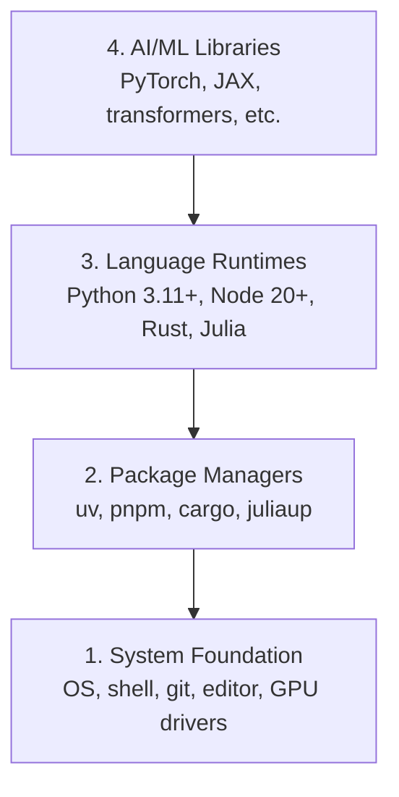

# 开发环境

> 你的工具塑造你的思维。一次性正确配置它们。

**类型：**构建
**语言：**Python、Node.js、Rust
**先决条件：**无
**时间：**约45分钟

## 学习目标

- 从零开始设置Python 3.11+、Node.js 20+和Rust工具链
- 配置虚拟环境和包管理器以实现可复现的构建
- 验证CUDA/MPS的GPU访问并运行测试张量操作
- 理解四层堆叠：系统、包、运行时、AI库

## 问题

你即将通过200多节课学习AI工程，涉及Python、TypeScript、Rust和Julia。如果你的环境有问题，每一节课都会变成与工具的斗争，而不是学习。

大多数人跳过环境设置。然后他们花数小时调试导入错误、版本冲突和缺失的CUDA驱动。我们将一次性正确地完成这项工作。

## 核心概念

AI 工程环境有四个层次：



我们采用自底向上的安装方式。每个层次依赖于其下方的层次。

## 动手构建

### 步骤1：系统基础

检查你的系统并安装基础组件。

```bash
# macOS
xcode-select --install
brew install git curl wget

# Ubuntu/Debian
sudo apt update && sudo apt install -y build-essential git curl wget

# Windows (use WSL2)
wsl --install -d Ubuntu-24.04
```

### 步骤2：Python with uv

我们使用 `uv`——它比 pip 快 10-100 倍，并能自动管理虚拟环境。

```bash
curl -LsSf https://astral.sh/uv/install.sh | sh

uv python install 3.12

uv venv
source .venv/bin/activate  # or .venv\Scripts\activate on Windows

uv pip install numpy matplotlib jupyter
```

验证：

```python
import sys
print(f"Python {sys.version}")

import numpy as np
print(f"NumPy {np.__version__}")
a = np.array([1, 2, 3])
print(f"Vector: {a}, dot product with itself: {np.dot(a, a)}")
```

### 步骤3：Node.js 与 pnpm

用于TypeScript课程（agents, MCP服务器, 网页应用）。

```bash
curl -fsSL https://fnm.vercel.app/install | bash
fnm install 22
fnm use 22

npm install -g pnpm

node -e "console.log('Node', process.version)"
```

### 步骤4：Rust

用于对性能要求高的课程（推理, 系统）。

```bash
curl --proto '=https' --tlsv1.2 -sSf https://sh.rustup.rs | sh

rustc --version
cargo --version
```

### 步骤5：Julia（可选）

对于Julia擅长的数学密集型课程。

```bash
curl -fsSL https://install.julialang.org | sh

julia -e 'println("Julia ", VERSION)'
```

### 步骤6：GPU设置（如果你有的话）

```bash
# NVIDIA
nvidia-smi

# Install PyTorch with CUDA
uv pip install torch torchvision torchaudio --index-url https://download.pytorch.org/whl/cu124
```

```python
import torch
print(f"CUDA available: {torch.cuda.is_available()}")
if torch.cuda.is_available():
    print(f"GPU: {torch.cuda.get_device_name(0)}")
```

没有GPU？没问题。大多数课程在CPU上运行。对于训练密集型课程，请使用Google Colab或云端GPU。

### 步骤7：验证一切

运行验证脚本：

```bash
python phases/00-setup-and-tooling/01-dev-environment/code/verify.py
```

## 使用它

您的环境现在已为本课程的所有课程准备就绪。以下是您将在各处使用的工具：

|  语言  |  使用场景  |  包管理器  |
|----------|---------|-----------------|
|  Python  |  阶段 1-12（机器学习、深度学习、自然语言处理、计算机视觉、音频、大型语言模型）  |  uv  |
|  TypeScript  |  阶段 13-17（工具、智能体、群体、基础设施）  |  pnpm  |
|  Rust  |  阶段 12、15-17（性能关键系统）  |  cargo  |
|  Julia  |  阶段 1（数学基础）  |  Pkg  |

## Ship It

本课程提供一个验证脚本，任何人都可以运行它来检查自己的环境设置。

参见 `outputs/prompt-env-check.md` 获取帮助 AI 助手诊断环境问题的提示。

## 练习

1. 运行验证脚本并修复所有失败
2. 为本课程创建 Python 虚拟环境并安装 PyTorch
3. 用四种语言各写一个 "hello world" 并运行它们
