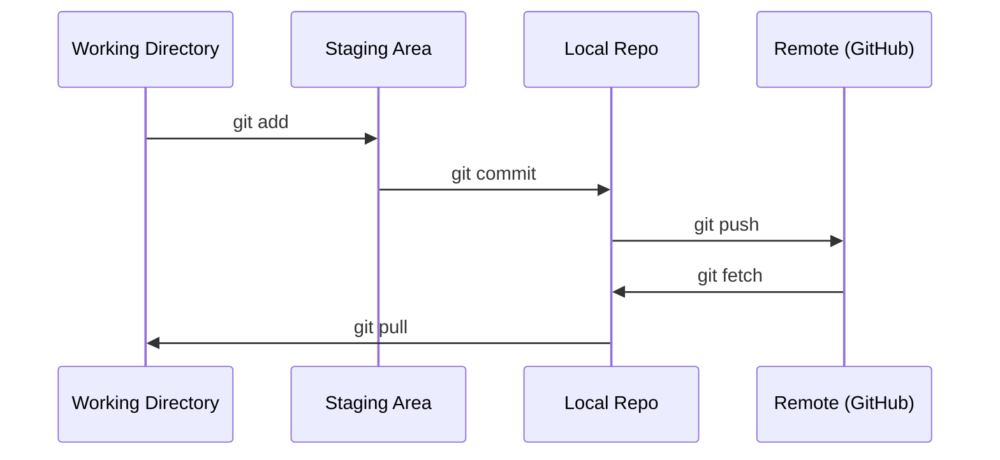

# Git 与协作

> 版本控制不是可选的。你在这里构建的每一个实验、每一个模型、每一课都会被追踪。

**类型：** 学习
**语言：** --
**先修要求：** 阶段 0，第 01 课
**时间：** 约 30 分钟

## 学习目标

- 配置 git 身份并使用日常的 add、commit 和 push 工作流程
- 创建和合并分支以进行隔离实验而不破坏主分支
- 编写一个 `.gitignore` 来排除模型检查点和大型二进制文件
- 使用 `.gitignore` 浏览提交历史以了解项目演进

## 问题

你即将在 20 个阶段中编写数百个代码文件。没有版本控制，你会丢失工作、破坏无法撤销的内容，并且无法与他人协作。

Git 是工具，GitHub 是代码存放的地方。这节课涵盖本课程所需的内容，仅此而已。

## 核心概念



要记住三件事：
1. 频繁保存(`git commit`)
2. 推送到远程(`git commit`)
3. 为实验创建分支(`git commit`)

## 动手构建

### 步骤1：配置git

```bash
git config --global user.name "Your Name"
git config --global user.email "you@example.com"
```

### 步骤2：日常工作流程

```bash
git status
git add file.py
git commit -m "Add perceptron implementation"
git push origin main
```

### 步骤3：为实验创建分支

```bash
git checkout -b experiment/new-optimizer

# ... make changes, commit ...

git checkout main
git merge experiment/new-optimizer
```

### 步骤4：使用本课程仓库

```bash
git clone https://github.com/liangdabiao/ai-engineering-from-scratch.git
cd ai-engineering-from-scratch

git checkout -b my-progress
# work through lessons, commit your code
git push origin my-progress
```

## 使用它

对于本课程，你只需要这些命令：

|  命令  |  时机  |
|---------|------|
|  `git clone`  |  获取课程仓库  |
|  `git add` + `git commit`  |  保存你的工作  |
|  `git push`  |  备份到 GitHub  |
|  `git checkout -b`  |  尝试不破坏主分支的改动  |
|  `git log --oneline`  |  看看你做了什么  |

就是这样。你不需要rebase、cherry-pick或子模块来完成本课程。

## 练习

1. 克隆这个仓库，创建一个名为`my-progress`的分支，创建一个文件，提交它，推送它
2. 创建一个排除模型检查点文件（`.gitignore`, `.pt`, `.pth`）的`my-progress`
3. 使用`my-progress`查看该仓库的提交历史并阅读课程是如何添加的

## 关键术语

|  术语  |  人们的说法  |  实际含义  |
|------|----------------|----------------------|
|  提交  |  "保存"  |  整个项目在某个时间点的快照  |
|  分支  |  "一份副本"  |  一个指向提交的指针，随着你的工作向前移动  |
|  合并  |  "组合代码"  |  将一个分支的更改应用到另一个分支  |
| 远程  |  "云端"  |  代码仓库的副本托管在其他地方（GitHub、GitLab） |
