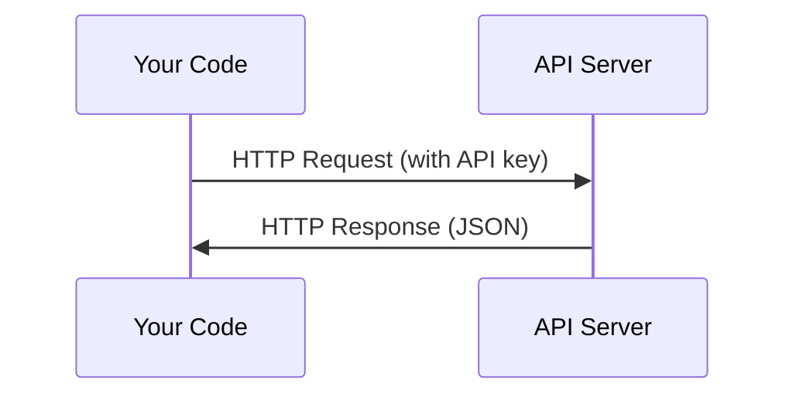

# API 与密钥

> 每个 AI API 的工作方式都一样：发送请求，获取响应。细节会变，模式不会。

**类型：** 构建
**语言：** Python、TypeScript
**前置要求：** 阶段 0，第 01 课
**时间：** 约 30 分钟

## 学习目标

- 使用环境变量和 `.env` 文件安全地存储 API 密钥
- 使用 Anthropic Python SDK 和原始 HTTP 两种方式调用 LLM API
- 对比基于 SDK 和原始 HTTP 的请求/响应格式以便于调试
- 识别并处理常见 API 错误，包括认证错误和速率限制

## 问题

从阶段 11 开始，你将调用 LLM API（Anthropic、OpenAI、Google）。在阶段 13-16，你将构建在这些 API 上循环使用的智能体(Agent)。你需要了解 API 密钥的工作原理、如何安全地存储它们，以及如何发出你的第一次 API 调用。

## 核心概念



每次 API 调用都包含：
1. 一个端点(Endpoint)（URL）
2. 一个 API 密钥（认证）
3. 一个请求体(Request Body)（你想要的内容）
4. 一个响应体(Response Body)（你返回的内容）

## 动手构建

### 步骤 1：安全存储 API 密钥

切勿将 API 密钥写入代码中。请使用环境变量。

```bash
export ANTHROPIC_API_KEY="sk-ant-..."
export OPENAI_API_KEY="sk-..."
```

或者使用 `.env` 文件（将其加入 `.gitignore`）：

```
ANTHROPIC_API_KEY=sk-ant-...
OPENAI_API_KEY=sk-...
```

### 步骤 2：首次 API 调用（Python）

```python
import anthropic

client = anthropic.Anthropic()

response = client.messages.create(
    model="claude-sonnet-4-20250514",
    max_tokens=256,
    messages=[{"role": "user", "content": "What is a neural network in one sentence?"}]
)

print(response.content[0].text)
```

### 步骤 3：首次 API 调用（TypeScript）

```typescript
import Anthropic from "@anthropic-ai/sdk";

const client = new Anthropic();

const response = await client.messages.create({
  model: "claude-sonnet-4-20250514",
  max_tokens: 256,
  messages: [{ role: "user", content: "What is a neural network in one sentence?" }],
});

console.log(response.content[0].text);
```

### 步骤 4：原始 HTTP（无 SDK）

```python
import os
import urllib.request
import json

url = "https://api.anthropic.com/v1/messages"
headers = {
    "Content-Type": "application/json",
    "x-api-key": os.environ["ANTHROPIC_API_KEY"],
    "anthropic-version": "2023-06-01",
}
body = json.dumps({
    "model": "claude-sonnet-4-20250514",
    "max_tokens": 256,
    "messages": [{"role": "user", "content": "What is a neural network in one sentence?"}],
}).encode()

req = urllib.request.Request(url, data=body, headers=headers, method="POST")
with urllib.request.urlopen(req) as resp:
    result = json.loads(resp.read())
    print(result["content"][0]["text"])
```

这就是 SDK 在底层所做的事情。理解原始 HTTP 调用有助于调试。

## 使用它

对于本课程：

|  API  |  何时需要它  |  免费额度  |
|-----|-----------------|-----------|
|  Anthropic (Claude)  |  阶段11-16（代理，工具）  |  注册时获赠5美元额度  |
|  OpenAI  |  阶段11（对比）  |  注册时获赠5美元额度  |
|  Hugging Face  |  阶段4-10（模型，数据集）  |  免费  |

你现在不需要全部都用上。当课程(lesson)需要时再设置它们。

## 发布

本課(lesson)产出：
- `outputs/prompt-api-troubleshooter.md` - 诊断常见的 API 错误

## 练习

1. 获取一个 Anthropic API key 并发起你的第一次 API 调用
2. 尝试原始 HTTP 版本，并对比响应格式与 SDK 版本的差异
3. 故意使用一个错误的 API key 并阅读错误信息

## 关键术语

|  术语  |  人们的说法  |  实际含义  |
|------|----------------|----------------------|
|  API key  |  "API 的密码"  |  用于标识你的账户并授权请求的唯一字符串  |
|  Rate limit  |  "他们在限流我"  |  每分钟/每小时的最大请求数，用于防止滥用并确保公平使用  |
|  Token  |  "一个词"（在 API 语境中）  |  计费单位：输入和输出 token 分别计数并收费  |
|  Streaming  |  "实时响应"  |  逐词获取响应，而非等待完整响应  |
