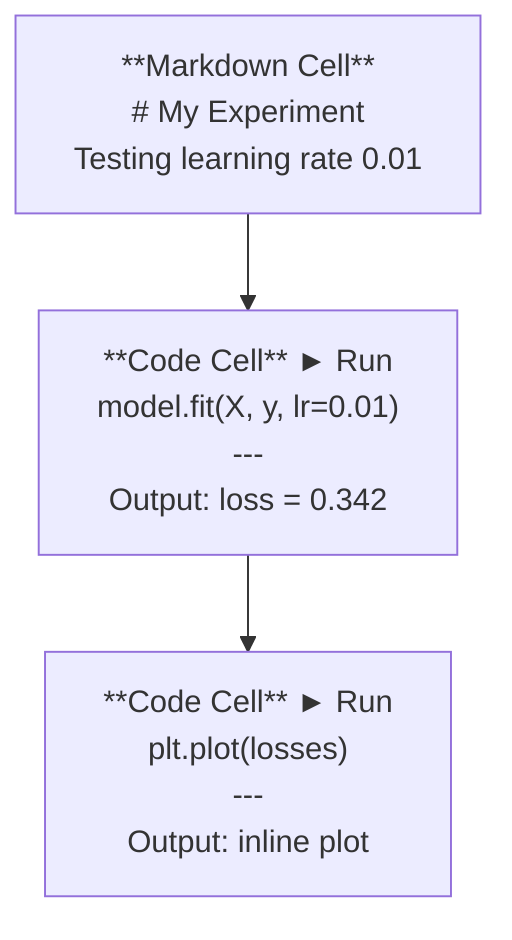
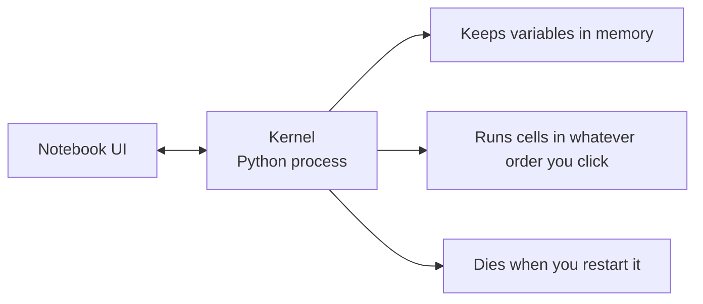

# Jupyter Notebooks

> Notebooks 是 AI 工程的实验台。你在这里进行原型开发，然后将有效的部分投入生产。

**类型：** 构建
**语言：** Python
**前提条件：** 阶段 0，第 01 课
**时间：** 约 30 分钟

## 学习目标

- 安装并启动 JupyterLab、Jupyter Notebook 或带有 Jupyter 扩展的 VS Code
- 使用魔法命令 (`%timeit`, `%%time`, `%matplotlib inline`) 进行基准测试和行内可视化
- 区分何时使用 notebooks 与 scripts，并应用 "在 notebooks 中探索，在 scripts 中交付" 的工作流程
- 识别并避免常见的 notebook 陷阱：乱序执行、隐藏状态和内存泄漏

## 问题

每一篇 AI 论文、教程和 Kaggle 竞赛都使用 Jupyter notebooks。它们让你可以分段运行代码、内嵌查看输出、将代码与解释混合，并快速迭代。如果你尝试不用 notebooks 学习 AI，就像做数学作业没有草稿纸一样。

但 notebooks 确实存在陷阱。人们用它做所有事情，包括它们并不擅长的事情。知道何时使用 notebook 以及何时使用 script 将帮你避免日后的调试噩梦。

## 核心概念

笔记本是一个单元格列表。每个单元格要么是代码，要么是文本。



内核是一个在后台运行的Python进程。当你运行一个单元格时，它会将代码发送给内核，内核执行代码并返回结果。所有单元格共享同一个内核，因此变量在单元格之间保持持久。



那个“无论你按什么顺序点”的部分既是超能力也是自伤武器。

## 动手构建

### 步骤1：选择你的界面

三个选项，一种格式：

|  界面  |  安装  |  最适合  |
|-----------|---------|----------|
|  JupyterLab  |  `pip install jupyterlab` 然后 `jupyter lab`  |  完整的IDE体验，多选项卡，文件浏览器，终端  |
|  Jupyter Notebook  |  `pip install notebook` 然后 `jupyter notebook`  |  简单、轻量，一次一个笔记本  |
|  VS Code  |  安装"Jupyter"扩展  |  已在编辑器中，Git集成，调试  |

三者都读写相同的`.ipynb`文件。挑你喜欢的就行。JupyterLab在AI工作中最为常见。

```bash
pip install jupyterlab
jupyter lab
```

### 第二步：重要的键盘快捷键

你在两种模式下操作。按`Escape`进入命令模式（左侧蓝色条），按`Enter`进入编辑模式（绿色条）。

**命令模式（最常用）：**

|  按键  |  操作  |
|-----|--------|
|  `Shift+Enter`  |  运行当前单元格，并移动到下一个  |
|  `A`  |  在上方插入单元格  |
|  `B`  |  在下方插入单元格  |
|  `DD`  |  删除单元格  |
|  `M`  |  转换为Markdown  |
|  `Y`  |  转换为代码  |
|  `Z`  |  撤消单元格操作  |
|  `Ctrl+Shift+H`  |  显示所有快捷键  |

**编辑模式:**

|  按键  |  操作  |
|-----|--------|
|  `Tab`  |  自动完成  |
|  `Shift+Tab`  |  显示函数签名  |
|  `Ctrl+/`  |  切换注释  |

`Shift+Enter`是你每天会用上千次的东西。先学会它。

### 第3步：单元格类型

**代码单元格**运行Python并显示输出：

```python
import numpy as np
data = np.random.randn(1000)
data.mean(), data.std()
```

输出：`(0.0032, 0.9987)`

**Markdown 单元格**可以渲染格式化文本。使用它们来记录你在做什么以及为什么这样做。支持标题、粗体、斜体、LaTeX数学公式（`$E = mc^2$`）、表格和图片。

### 第4步：魔术命令

这些不是Python。它们是Jupyter特有的命令，以`%`（行魔术）或`%%`（单元格魔术）开头。

**给代码计时：**

```python
%timeit np.random.randn(10000)
```

输出：`45.2 us +/- 1.3 us per loop`

```python
%%time
model.fit(X_train, y_train, epochs=10)
```

输出：`Wall time: 2.34 s`

`%timeit` 运行代码多次并取平均值。`%%time` 只运行一次。使用 `%timeit` 进行微基准测试，`%%time` 进行训练运行。

**启用内联绘图：**

```python
%matplotlib inline
```

每个 `plt.plot()` 或 `plt.show()` 现在直接渲染在笔记本中。

**无需离开笔记本即可安装包：**

```python
!pip install scikit-learn
```

前缀 `!` 可运行任何 shell 命令。

**检查环境变量：**

```python
%env CUDA_VISIBLE_DEVICES
```

### 步骤 5：内联显示富输出

笔记本会自动显示单元格中的最后一个表达式。但你可以控制它：

```python
import pandas as pd

df = pd.DataFrame({
    "model": ["Linear", "Random Forest", "Neural Net"],
    "accuracy": [0.72, 0.89, 0.94],
    "training_time": [0.1, 2.3, 45.6]
})
df
```

这会渲染出一个格式化的HTML表格，而不是文本转储。绘图也是如此：

```python
import matplotlib.pyplot as plt

plt.figure(figsize=(8, 4))
plt.plot([1, 2, 3, 4], [1, 4, 2, 3])
plt.title("Inline Plot")
plt.show()
```

绘图出现在单元格正下方。这就是为什么笔记本在AI工作中占主导地位。你可以同时看到数据、绘图和代码。

对于图像：

```python
from IPython.display import Image, display
display(Image(filename="architecture.png"))
```

### 步骤6：Google Colab

Colab是云端免费的Jupyter笔记本。它提供GPU、预装库和Google Drive集成。无需设置。

1. 前往 [colab.research.google.com](https://colab.research.google.com)
2. 上传本课程的任何[colab.research.google.com](https://colab.research.google.com)文件
3. 运行时 > 更改运行时类型 > T4 GPU（免费）

Colab 与本地 Jupyter 的区别：
- 文件不在会话之间持久化（保存到云端硬盘或下载）
- 预装：numpy, pandas, matplotlib, torch, tensorflow, sklearn
- `from google.colab import files` 上传/下载文件
- `from google.colab import files` 用于持久存储
- 会话在90分钟无活动后超时（免费套餐）

## 使用它

### Notebooks 与 Scripts：何时使用哪种

|  使用 notebooks 进行  |  使用 scripts 进行  |
|-------------------|-----------------|
|  探索数据集  |  训练流水线  |
|  原型模型  |  可复用工具  |
| 可视化结果  |  任何包含`if __name__`的内容 |
| 解释你的工作  |  按计划运行的代码 |
| 快速实验  |  生产代码 |
| 课程练习  |  包和库 |

规则：**在笔记本中探索，在脚本中发布**。

AI中的常见工作流程：
1. 在笔记本中探索数据
2. 在笔记本中构建模型原型
3. 一旦可行，将代码移动到 `.py` 文件
4. 将这些 `.py` 文件重新导入笔记本以进行进一步实验

### 常见陷阱

**乱序执行。** 您先运行单元格5，然后单元格2，再单元格7。笔记本在您的机器上可以工作，但当别人从上到下运行时就会出错。修复方法：分享前执行 Kernel > Restart & Run All。

**隐藏状态。** 您删除了一个单元格，但其中创建的变量仍留在内存中。笔记本看起来干净，但依赖于一个幽灵单元格。修复方法：定期重启内核。

**内存泄漏。** 加载一个4GB数据集，训练模型，再加载另一个数据集。没有任何内存被释放。修复方法：`del variable_name` 和 `gc.collect()`，或重启内核。

## 发布

本課(lesson)产出：
- `outputs/prompt-notebook-helper.md` 用于调试笔记本问题

## 练习

1. 打开 JupyterLab，创建一个笔记本，并使用 `%timeit` 来比较列表推导式和 numpy 创建10万个随机数数组的性能。创建一个包含markdown和代码单元格的笔记本，用于加载CSV、显示数据框和绘制图表。然后运行 Kernel > Restart & Run All 来验证它从上到下都能正常工作。从 `%timeit` 获取代码，粘贴到 Colab 笔记本中，并使用免费GPU运行。
2. 
3. 

## 关键术语

|  术语  |  人们的说法  |  实际含义  |
|------|----------------|----------------------|
|  内核  |  "运行我代码的东西"  |  一个独立的Python进程，用于执行单元格并将变量保留在内存中  |
|  单元格  |  "一个代码块"  |  笔记本中独立可运行的单元，可以是代码或markdown  |
|  魔法命令  |  "Jupyter技巧"  |  以 `%` 或 `%%` 为前缀的特殊命令，用于控制笔记本环境  |
|  `.ipynb`  |  "笔记本文件"  |  一个包含单元格、输出和元数据的JSON文件。代表IPython笔记本  |

## 延伸阅读

- [JupyterLab Docs](https://jupyterlab.readthedocs.io/) 获取全套功能
- [JupyterLab Docs](https://jupyterlab.readthedocs.io/) 了解 Colab 特有的限制和功能
- [JupyterLab Docs](https://jupyterlab.readthedocs.io/) 获取高级用户快捷键
