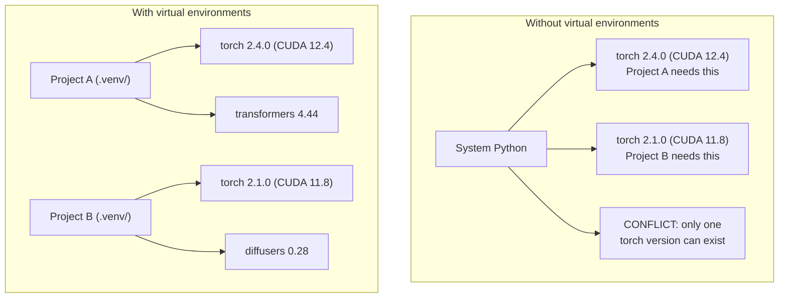

# Python 环境

> 依赖地狱是真实存在的。虚拟环境就是解药。

**类型：** 构建
**语言：** Shell
**先决条件：** 阶段0，第01课
**时间：** 约30分钟

## 学习目标

- 使用 `uv`、`venv` 或 `conda` 创建隔离的虚拟环境
- 编写包含可选依赖组的 `uv` 并生成锁文件以确保可重现性
- 诊断并解决常见陷阱：全局安装、pip/conda 混用、CUDA 版本不匹配
- 为具有冲突依赖关系的项目实现分阶段环境策略

## 问题

你为一个微调项目安装了 PyTorch 2.4。下周，另一个项目需要 PyTorch 2.1，因为它的 CUDA 构建被固定了。你全局升级，第一个项目崩溃了。你降级，第二个项目又崩溃了。

这就是依赖地狱。在 AI/ML 工作中经常发生，因为：

- PyTorch、JAX 和 TensorFlow 各自带有自己的 CUDA 绑定
- 模型库锁定特定的框架版本
- 全局的 `pip install` 会覆盖之前的任何内容
- CUDA 11.8 版本不适用于 CUDA 12.x 驱动程序（反之亦然）

解决方法：每个项目都有自己独立的包环境。

## 核心概念



## 动手构建

### 选项 1：uv venv（推荐）

`uv` 是最快的 Python 包管理器（比 pip 快 10-100 倍）。它在单个工具中处理虚拟环境、Python 版本和依赖解析。

```bash
curl -LsSf https://astral.sh/uv/install.sh | sh

uv python install 3.12

cd your-project
uv venv
source .venv/bin/activate
```

安装包：

```bash
uv pip install torch numpy
```

一步创建使用 `pyproject.toml` 的项目：

```bash
uv init my-ai-project
cd my-ai-project
uv add torch numpy matplotlib
```

### 选项2：venv（内置）

如果无法安装 `uv`，Python 自带 `venv`：

```bash
python3 -m venv .venv
source .venv/bin/activate  # Linux/macOS
.venv\Scripts\activate     # Windows

pip install torch numpy
```

比 `uv` 慢，但只要有 Python 安装的地方都能工作。

### 选项3：conda（需要时使用）

Conda 管理非 Python 依赖项，如 CUDA 工具包、cuDNN 和 C 库。在以下情况下使用：

- 你需要特定版本的 CUDA 工具包，但不想系统级安装
- 你在共享集群上，无法安装系统包
- 某个库的安装说明写着“use conda”

```bash
# Install miniconda (not the full Anaconda)
curl -LsSf https://repo.anaconda.com/miniconda/Miniconda3-latest-Linux-x86_64.sh -o miniconda.sh
bash miniconda.sh -b

conda create -n myproject python=3.12
conda activate myproject

conda install pytorch torchvision torchaudio pytorch-cuda=12.4 -c pytorch -c nvidia
```

一条规则：如果你为某个环境使用conda，那么该环境中的所有包都应使用conda管理。将`pip install`混入conda环境会导致依赖冲突，调试起来非常痛苦。

### 本课程：分阶段策略

你可以为整个课程创建一个环境。但别这样做。不同阶段需要不同（有时相互冲突）的依赖。

策略：

```
ai-engineering-from-scratch/
├── .venv/                    <-- shared lightweight env for phases 0-3
├── phases/
│   ├── 04-neural-networks/
│   │   └── .venv/            <-- PyTorch env
│   ├── 05-cnns/
│   │   └── .venv/            <-- same PyTorch env (symlink or shared)
│   ├── 08-transformers/
│   │   └── .venv/            <-- might need different transformer versions
│   └── 11-llm-apis/
│       └── .venv/            <-- API SDKs, no torch needed
```

`code/env_setup.sh`中的脚本为本课程创建基础环境。

## pyproject.toml基础

每个Python项目都应该有一个`pyproject.toml`。它在一个文件中取代了`setup.py`、`setup.cfg`和`requirements.txt`。

```toml
[project]
name = "ai-engineering-from-scratch"
version = "0.1.0"
requires-python = ">=3.11"
dependencies = [
    "numpy>=1.26",
    "matplotlib>=3.8",
    "jupyter>=1.0",
    "scikit-learn>=1.4",
]

[project.optional-dependencies]
torch = ["torch>=2.3", "torchvision>=0.18"]
llm = ["anthropic>=0.39", "openai>=1.50"]
```

然后安装：

```bash
uv pip install -e ".[torch]"    # base + PyTorch
uv pip install -e ".[llm]"     # base + LLM SDKs
uv pip install -e ".[torch,llm]" # everything
```

## 锁定文件

锁定文件将每个依赖（包括传递依赖）固定到精确版本。这保证了可重现性：任何从锁定文件安装的人都会得到完全相同的包。

```bash
# uv generates uv.lock automatically when using uv add
uv add numpy

# pip-tools approach
uv pip compile pyproject.toml -o requirements.lock
uv pip install -r requirements.lock
```

将你的锁定文件提交到git。当有人克隆仓库时，他们从锁定文件安装并得到相同的版本。

## 常见错误

### 1. 全局安装

```bash
pip install torch  # BAD: installs to system Python

source .venv/bin/activate
pip install torch  # GOOD: installs to virtual environment
```

检查你的包安装到哪里：

```bash
which python       # should show .venv/bin/python, not /usr/bin/python
which pip           # should show .venv/bin/pip
```

### 2. 混合使用 pip 和 conda

```bash
conda create -n myenv python=3.12
conda activate myenv
conda install pytorch -c pytorch
pip install some-other-package   # BAD: can break conda's dependency tracking
conda install some-other-package # GOOD: let conda manage everything
```

如果必须在 conda 中使用 pip（有些包只能用 pip 安装），请先安装所有 conda 包，最后安装 pip 包。

### 3. 忘记激活环境

```bash
python train.py           # uses system Python, missing packages
source .venv/bin/activate
python train.py           # uses project Python, packages found
```

你的 Shell 提示符应该显示环境名称：

```
(.venv) $ python train.py
```

### 4. 将 .venv 提交到 git

```bash
echo ".venv/" >> .gitignore
```

虚拟环境大小为200MB到2GB。它们是本地的，无法在不同机器之间移植。请提交`pyproject.toml`和锁定文件(lockfile)替代。

### 5. CUDA 版本不匹配

```bash
nvidia-smi                # shows driver CUDA version (e.g., 12.4)
python -c "import torch; print(torch.version.cuda)"  # shows PyTorch CUDA version

# These must be compatible.
# PyTorch CUDA version must be <= driver CUDA version.
```

## 使用它

运行设置脚本创建课程环境：

```bash
bash phases/00-setup-and-tooling/06-python-environments/code/env_setup.sh
```

这会在仓库根目录创建一个`.venv`，其中安装并验证了核心依赖。

## 练习

1. 运行`env_setup.sh`并验证所有检查通过
2. 创建第二个虚拟环境，在其中安装不同版本的numpy，并确认两个环境相互隔离
3. 为一个同时需要PyTorch和Anthropic SDK的项目编写`env_setup.sh`
4. 故意在全局（不激活venv）安装一个包，注意它的安装位置，然后卸载它

## 关键术语

|  术语  |  人们的说法  |  实际含义  |
|------|----------------|----------------------|
| 虚拟环境  |  "A venv"  |  包含Python解释器和包的独立目录，与系统Python隔离 |
| 锁文件  |  "Pinned dependencies"  |  列出每个包及其确切版本的文件，确保跨机器安装一致 |
| pyproject.toml  |  "The new setup.py"  |  标准Python项目配置文件，替代setup.py/setup.cfg/requirements.txt |
| 传递依赖  |  "A dependency of a dependency"  |  包B依赖C；如果你安装依赖B的A，那么C是A的传递依赖 |
| CUDA不匹配  |  "My GPU isn't working"  |  PyTorch编译时使用的CUDA版本与你的GPU驱动支持的版本不同 |
