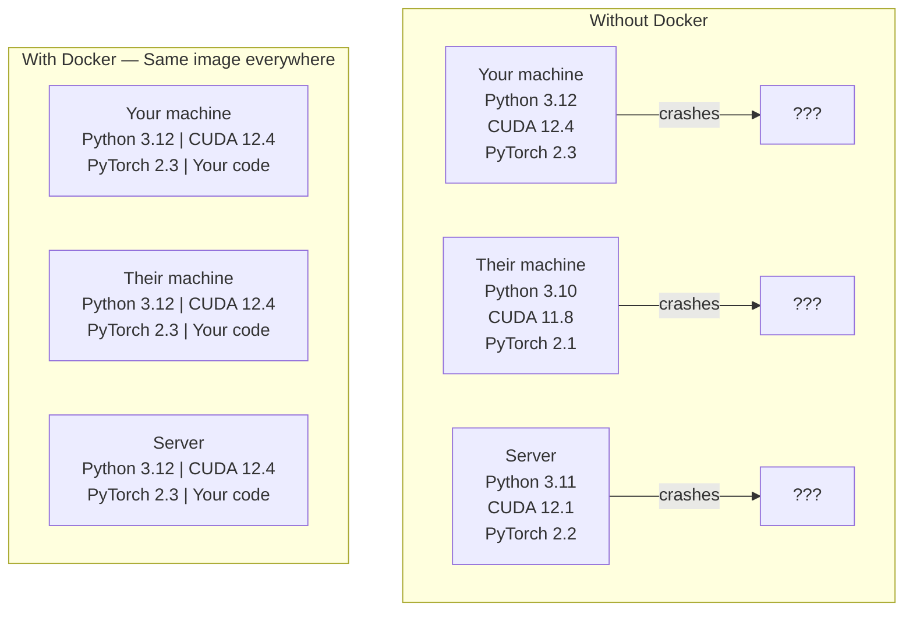

# Docker for AI

> 容器让"在我的机器上能运行"成为过去式。

**类型：** 构建
**语言：** Docker
**前提条件：** 阶段0，第01课和第03课
**时间：** 约60分钟

## 学习目标

- 从Dockerfile构建一个支持GPU的Docker镜像，其中包含CUDA、PyTorch和AI库
- 将宿主机目录挂载为卷，以便在容器重建时持久化模型、数据集和代码
- 配置NVIDIA Container Toolkit，让容器能够使用GPU
- 使用Docker Compose编排多服务AI应用（推理服务器+向量数据库）

## 问题

你在自己的笔记本电脑上用PyTorch 2.3、CUDA 12.4和Python 3.12训练了一个模型。你的同事安装了PyTorch 2.1、CUDA 11.8和Python 3.10。你的模型在他们机器上崩溃了。而你的Dockerfile在两台机器上都能工作。

AI项目是依赖关系的噩梦。一个典型的栈包括Python、PyTorch、CUDA驱动、cuDNN、系统级C库，以及像flash-attn这样需要精确编译器版本的特殊包。Docker将所有这些打包到一个镜像中，该镜像在任何地方都能一致地运行。

## 核心概念

Docker 将你的代码、运行时、库和系统工具打包成一个称为容器的隔离单元。可以把它想象成一个轻量级虚拟机，只不过它共享宿主机操作系统内核而不是运行自己的内核，因此它能在几秒内启动而不是几分钟。



### 为什么AI项目比大多数更需要Docker

1. **GPU驱动是脆弱的。** CUDA 12.4 的代码不能在 CUDA 11.8 上运行。Docker 通过 NVIDIA Container Toolkit 在容器内隔离 CUDA 工具包，同时共享宿主机的 GPU 驱动。

2. **模型权重很大。** 一个 7B 参数的模型在 fp16 下占 14 GB。你不想每次重新构建时都重新下载它。Docker 卷允许你从宿主机挂载一个模型目录。

3. **多服务架构很常见。** 一个真正的 AI 应用不仅仅是一个 Python 脚本。它包含推理服务器、用于RAG的向量数据库，或许还有前端网页。Docker Compose 用一个命令编排所有这些服务。

### 关键词汇

| 术语  |  含义 |
|------|---------------|
| 镜像(Image)  |  只读模板。你的配方。由 Dockerfile 构建。 |
| 容器(Container)  |  镜像的运行实例。你的厨房。 |
| Dockerfile  |  构建镜像的指令。逐层构建。 |
| 卷(Volume)  |  持久化存储，在容器重启后仍然保留。 |
| docker-compose  |  一种用 YAML 定义多容器应用的工具。 |

### AI中的常见容器模式

```
Dev Container
  Full toolkit. Editor support. Jupyter. Debugging tools.
  Used during development and experimentation.

Training Container
  Minimal. Just the training script and dependencies.
  Runs on GPU clusters. No editor, no Jupyter.

Inference Container
  Optimized for serving. Small image. Fast cold start.
  Runs behind a load balancer in production.
```

## 动手构建

### 步骤1：安装Docker

```bash
# macOS
brew install --cask docker
open /Applications/Docker.app

# Ubuntu
curl -fsSL https://get.docker.com | sh
sudo usermod -aG docker $USER
# Log out and back in for group change to take effect
```

验证：

```bash
docker --version
docker run hello-world
```

### 步骤2：安装NVIDIA容器工具包（Linux带NVIDIA GPU）

这使得Docker容器可以访问你的GPU。macOS和Windows (WSL2)用户可以跳过此步骤；Docker Desktop在这些平台上对GPU直通(GPU passthrough)的处理方式不同。

```bash
distribution=$(. /etc/os-release;echo $ID$VERSION_ID)
curl -fsSL https://nvidia.github.io/libnvidia-container/gpgkey | sudo gpg --dearmor -o /usr/share/keyrings/nvidia-container-toolkit-keyring.gpg
curl -s -L https://nvidia.github.io/libnvidia-container/$distribution/libnvidia-container.list | \
    sed 's#deb https://#deb [signed-by=/usr/share/keyrings/nvidia-container-toolkit-keyring.gpg] https://#g' | \
    sudo tee /etc/apt/sources.list.d/nvidia-container-toolkit.list

sudo apt-get update
sudo apt-get install -y nvidia-container-toolkit
sudo nvidia-ctk runtime configure --runtime=docker
sudo systemctl restart docker
```

测试容器内GPU访问：

```bash
docker run --rm --gpus all nvidia/cuda:12.4.1-base-ubuntu22.04 nvidia-smi
```

如果你看到你的GPU信息，则工具包工作正常。

### 步骤3：理解基础镜像

选择正确的基础镜像可以节省数小时的调试时间。

```
nvidia/cuda:12.4.1-devel-ubuntu22.04
  Full CUDA toolkit. Compilers included.
  Use for: building packages that need nvcc (flash-attn, bitsandbytes)
  Size: ~4 GB

nvidia/cuda:12.4.1-runtime-ubuntu22.04
  CUDA runtime only. No compilers.
  Use for: running pre-built code
  Size: ~1.5 GB

pytorch/pytorch:2.3.1-cuda12.4-cudnn9-runtime
  PyTorch pre-installed on top of CUDA.
  Use for: skipping the PyTorch install step
  Size: ~6 GB

python:3.12-slim
  No CUDA. CPU only.
  Use for: inference on CPU, lightweight tools
  Size: ~150 MB
```

### 步骤4：编写用于AI开发的Dockerfile

以下是`code/Dockerfile`中的Dockerfile。逐步讲解：

```dockerfile
FROM nvidia/cuda:12.4.1-devel-ubuntu22.04

ENV DEBIAN_FRONTEND=noninteractive
ENV PYTHONUNBUFFERED=1

RUN apt-get update && apt-get install -y --no-install-recommends \
    python3.12 \
    python3.12-venv \
    python3.12-dev \
    python3-pip \
    git \
    curl \
    build-essential \
    && rm -rf /var/lib/apt/lists/*

RUN update-alternatives --install /usr/bin/python python /usr/bin/python3.12 1

RUN python -m pip install --no-cache-dir --upgrade pip setuptools wheel

RUN python -m pip install --no-cache-dir \
    torch==2.3.1 \
    torchvision==0.18.1 \
    torchaudio==2.3.1 \
    --index-url https://download.pytorch.org/whl/cu124

RUN python -m pip install --no-cache-dir \
    numpy \
    pandas \
    scikit-learn \
    matplotlib \
    jupyter \
    transformers \
    datasets \
    accelerate \
    safetensors

WORKDIR /workspace

VOLUME ["/workspace", "/models"]

EXPOSE 8888

CMD ["python"]
```

构建它：

```bash
docker build -t ai-dev -f phases/00-setup-and-tooling/07-docker-for-ai/code/Dockerfile .
```

第一次需要一些时间（下载CUDA基础镜像和PyTorch）。后续构建将使用缓存的层。

运行它：

```bash
docker run --rm -it --gpus all \
    -v $(pwd):/workspace \
    -v ~/models:/models \
    ai-dev python -c "import torch; print(f'PyTorch {torch.__version__}, CUDA: {torch.cuda.is_available()}')"
```

在容器内运行Jupyter：

```bash
docker run --rm -it --gpus all \
    -v $(pwd):/workspace \
    -v ~/models:/models \
    -p 8888:8888 \
    ai-dev jupyter notebook --ip=0.0.0.0 --port=8888 --no-browser --allow-root
```

### 步骤5：为数据和模型设置卷挂载

卷挂载对AI工作至关重要。没有它们，当容器停止时，你下载的14 GB模型就会消失。

```bash
# Mount your code
-v $(pwd):/workspace

# Mount a shared models directory
-v ~/models:/models

# Mount datasets
-v ~/datasets:/data
```

在你的训练脚本中，从挂载路径加载：

```python
from transformers import AutoModel

model = AutoModel.from_pretrained("/models/llama-7b")
```

模型存放在宿主文件系统上。你可以随意重建容器，而无需重新下载。

### 第6步：用于多服务AI应用的Docker Compose

一个真正的RAG应用需要一个推理服务器和一个向量数据库。Docker Compose通过一条命令运行两者。

参见`code/docker-compose.yml`：

```yaml
services:
  ai-dev:
    build:
      context: .
      dockerfile: Dockerfile
    deploy:
      resources:
        reservations:
          devices:
            - driver: nvidia
              count: all
              capabilities: [gpu]
    volumes:
      - ../../../:/workspace
      - ~/models:/models
      - ~/datasets:/data
    ports:
      - "8888:8888"
    stdin_open: true
    tty: true
    command: jupyter notebook --ip=0.0.0.0 --port=8888 --no-browser --allow-root

  qdrant:
    image: qdrant/qdrant:v1.12.5
    ports:
      - "6333:6333"
      - "6334:6334"
    volumes:
      - qdrant_data:/qdrant/storage

volumes:
  qdrant_data:
```

启动所有服务：

```bash
cd phases/00-setup-and-tooling/07-docker-for-ai/code
docker compose up -d
```

现在你的AI开发容器可以通过服务名访问`http://qdrant:6333`处的向量数据库。Docker Compose会自动创建一个共享网络。

从AI容器内部测试连接：

```python
from qdrant_client import QdrantClient

client = QdrantClient(host="qdrant", port=6333)
print(client.get_collections())
```

停下一切：

```bash
docker compose down
```

添加 `-v` 以同时删除 qdrant 卷：

```bash
docker compose down -v
```

### 第7步：用于AI工作的有用Docker命令

```bash
# List running containers
docker ps

# List all images and their sizes
docker images

# Remove unused images (reclaim disk space)
docker system prune -a

# Check GPU usage inside a running container
docker exec -it <container_id> nvidia-smi

# Copy a file from container to host
docker cp <container_id>:/workspace/results.csv ./results.csv

# View container logs
docker logs -f <container_id>
```

## 使用它

你现在拥有了一个可复现的AI开发环境。在本课程剩余部分：

- 使用 `docker compose up` 同时启动开发环境和向量数据库
- 将代码、模型和数据挂载为卷，以便在重建之间不会丢失任何内容
- 当某节课需要新的Python包时，将其添加到Dockerfile并重建
- 与队友共享你的Dockerfile。他们将获得完全相同的环境。

### 没有GPU？

移除 `--gpus all` 标志和 NVIDIA 部署模块。容器仍可正常用于基于 CPU 的课程。PyTorch 检测到 CUDA 缺失时会自动回退到 CPU。

## 练习

1. 构建 Dockerfile 并在容器内运行 `python -c "import torch; print(torch.__version__)"`
2. 启动 docker-compose 堆栈，验证 AI 容器在 `python -c "import torch; print(torch.__version__)"` 处可访问 Qdrant
3. 向 Dockerfile 添加 `python -c "import torch; print(torch.__version__)"`，重新构建，并在端口 5000 上运行一个简单的 API 服务器。使用 `http://qdrant:6333/collections` 映射端口
4. 使用 `python -c "import torch; print(torch.__version__)"` 测量镜像大小。尝试将基础镜像从 `http://qdrant:6333/collections` 切换到 `flask` 并比较大小

## 关键术语

|  术语  |  人们的说法  |  实际含义  |
|------|----------------|----------------------|
| 容器  |  "轻量级虚拟机"  |  使用主机内核的隔离进程，拥有自己的文件系统和网络 |
| 镜像层  |  "缓存步骤"  |  每条 Dockerfile 指令都会创建一个层。未更改的层会被缓存，因此重新构建很快。 |
| NVIDIA 容器工具包  |  "Docker 中的 GPU"  |  一种运行时挂钩，通过 `--gpus` 标志将主机 GPU 暴露给容器 |
| 卷挂载  |  "共享文件夹"  |  主机上的一个目录映射到容器中。更改在容器停止后仍然存在。 |
|  基础镜像  |  "起点"  |  您的Dockerfile所基于的`FROM`映像。决定了预安装的内容。  |
