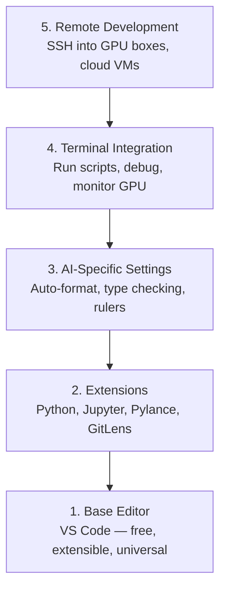

# 编辑器设置

> 你的编辑器就是你的副驾驶。一次性配置好，让它不碍事，并开始发挥它的作用。

**类型：** 构建
**语言：** --
**前置要求：** 阶段0，第01课
**时间：** 约20分钟

## 学习目标

- 安装带有Python、Jupyter、代码检查和远程SSH等必要扩展的VS Code
- 配置保存时格式化、类型检查和针对AI工作流的笔记本输出滚动
- 设置远程SSH，像在本地一样编辑和调试远程GPU机器上的代码
- 评估编辑器替代品（Cursor、Windsurf、Neovim）及其对AI工作的权衡

## 问题

你将在编辑器中花费数千小时编写Python、运行笔记本、调试训练循环以及通过SSH连接GPU盒子。一个配置不当的编辑器会让每次使用都充满摩擦：没有自动补全、没有类型提示、没有行内错误提示、手动格式化、以及笨重的终端工作流。

正确的设置只需20分钟。跳过它则每天耗费你20分钟。

## 核心概念

一个AI工程编辑器设置需要五样东西：



## 动手构建

### 第一步：安装VS Code

VS Code是推荐的编辑器。它是免费的，可以在所有操作系统上运行，拥有顶级的Jupyter notebook支持，并且扩展生态系统涵盖了AI工作所需的一切。

从[code.visualstudio.com](https://code.visualstudio.com/)下载。

在终端中验证：

```bash
code --version
```

如果在macOS上找不到`code`，请打开VS Code，按`Cmd+Shift+P`，输入“Shell Command”，然后选择“Install 'code' command in PATH”。

### 第二步：安装必要的扩展

在VS Code中打开集成终端（`Ctrl+`` `或`@@SKIP0002@@ ``），并安装对AI工作重要的扩展：

```bash
code --install-extension ms-python.python
code --install-extension ms-python.vscode-pylance
code --install-extension ms-toolsai.jupyter
code --install-extension eamodio.gitlens
code --install-extension ms-vscode-remote.remote-ssh
code --install-extension ms-python.debugpy
code --install-extension ms-python.black-formatter
code --install-extension charliermarsh.ruff
```

每个扩展的作用：

|  扩展  |  用途  |
|-----------|-----|
|  Python  |  语言支持、虚拟环境检测、运行/调试  |
|  Pylance  |  快速类型检查、自动补全、导入解析  |
| Jupyter  |  在VS Code内运行笔记本，变量浏览器 |
| GitLens  |  查看谁更改了什么，内联Git追溯 |
| Remote SSH  |  像本地一样打开远程GPU盒子上的文件夹 |
| Debugpy  |  Python的逐步调试 |
| Black Formatter  |  保存时自动格式化，一致的风格 |
| Ruff  |  快速检查，捕捉常见错误 |

本课中的`code/.vscode/extensions.json`文件包含了完整的推荐列表。打开项目文件夹时，VS Code会提示您安装它们。

### 第3步：配置设置

从本课中的`code/.vscode/settings.json`复制设置，或通过`Settings > Open Settings (JSON)`手动应用。

AI工作的关键设置：

```jsonc
{
    "python.analysis.typeCheckingMode": "basic",
    "editor.formatOnSave": true,
    "editor.rulers": [88, 120],
    "notebook.output.scrolling": true,
    "files.autoSave": "afterDelay"
}
```

为什么这些很重要：

- **基本类型检查**：在运行之前捕获错误的参数类型。节省调试张量形状不匹配和错误API参数的时间。
- **保存时格式化**：再也不用考虑格式化问题了。Black会处理它。
- **标尺在88和120**：Black在88处换行。120标记显示文档字符串和注释是否过长。
- **笔记本输出滚动**：训练循环会打印数千行。没有滚动，输出面板会爆炸。
- **自动保存**：你会忘记保存。你的训练脚本会运行过时的代码。自动保存可以防止这种情况。

### 第4步：终端集成

VS Code 的集成终端是运行训练脚本、监控 GPU 和管理环境的地方。

正确设置：

```jsonc
{
    "terminal.integrated.defaultProfile.osx": "zsh",
    "terminal.integrated.defaultProfile.linux": "bash",
    "terminal.integrated.fontSize": 13,
    "terminal.integrated.scrollback": 10000
}
```

有用的快捷键：

|  操作  |  macOS  |  Linux/Windows  |
|--------|-------|---------------|
|  切换终端  |  `@@SKIP0000@@ ``  |  `@@SKIP0000@@ ``  |
|  新终端  |  `Ctrl+Shift+`` `  |  `Ctrl+Shift+`` `  |
|  拆分终端  |  `Cmd+\`  |  `Ctrl+\`  |

拆分终端很有用：一个用于运行脚本，一个用于监控GPU，使用`nvidia-smi -l 1`或`watch -n 1 nvidia-smi`。

### 第5步：远程开发（SSH连接到GPU服务器）

这是AI工作中最重要的扩展。你将在远程机器（云虚拟机、实验室服务器、Lambda、Vast.ai）上运行训练。远程SSH让你打开远程文件系统、编辑文件、运行终端和调试，就像一切都是本地的。

设置：

1. 安装远程SSH扩展（在步骤2中完成）。
2. 按 `Ctrl+Shift+P`（或 `Cmd+Shift+P`），输入"Remote-SSH: Connect to Host"。
3. 输入 `Ctrl+Shift+P`。
4. VS Code 会自动在远程机器上安装其服务器组件。

如需免密码访问，请设置SSH密钥：

```bash
ssh-keygen -t ed25519 -C "your-email@example.com"
ssh-copy-id user@your-gpu-box-ip
```

为方便起见，将主机添加到 `~/.ssh/config` 中：

```
Host gpu-box
    HostName 203.0.113.50
    User ubuntu
    IdentityFile ~/.ssh/id_ed25519
    ForwardAgent yes
```

现在 `Remote-SSH: Connect to Host > gpu-box` 即可即时连接。

## 替代方案

### Cursor

[cursor.com](https://cursor.com) 是 VS Code 的一个分支，内置 AI 代码生成功能。它使用相同的扩展生态系统和设置格式。如果你使用 Cursor，本课中的所有内容仍然适用。导入相同的 `settings.json` 和 `extensions.json`。

### Windsurf

[windsurf.com](https://windsurf.com) 是另一个以 AI 为中心的 VS Code 分支。同样：相同的扩展，相同的设置格式，相同的远程 SSH 支持。

### Vim/Neovim

如果你已经在使用 Vim 或 Neovim 并且能够高效工作，请继续使用。用于 AI Python 工作的最低配置：

- **pyright** 或 **pylsp** 用于类型检查（通过 Mason 或手动安装）
- **nvim-lspconfig** 用于语言服务器集成
- **jupyter-vim** 或 **molten-nvim** 用于类似笔记本的执行
- **telescope.nvim** 用于文件/符号搜索
- **none-ls.nvim** 配合 black 和 ruff 用于格式化和代码检查

如果你还没有使用Vim，现在不要开始。学习曲线会与学习AI工程相竞争。使用VS Code。

## 使用它

使用这种设置，你的日常工作流程如下：

1. 在VS Code中打开项目文件夹（或通过Remote SSH连接到GPU服务器）。
2. 在编辑器中编写Python代码，带有自动补全、类型提示和内联错误提示。
3. 使用Jupyter扩展内联运行Jupyter笔记本。
4. 使用集成终端运行训练脚本、`uv pip install`和GPU监控。
5. 在提交之前使用GitLens审查更改。

## 练习

1. 安装VS Code以及步骤2中列出的所有扩展
2. 将本课中的`settings.json`复制到你的VS Code配置中
3. 打开一个Python文件，验证Pylance是否显示类型提示，并且Black在保存时格式化
4. 如果你有远程机器的访问权限，设置Remote SSH并打开一个文件夹

## 关键术语

|  术语  |  人们的说法  |  实际含义  |
|------|----------------|----------------------|
|  LSP  |  "自动补全引擎"  |  语言服务器协议(Language Server Protocol): 编辑器从特定语言的服务器获取类型信息、补全和诊断的标准  |
|  Pylance  |  "Python插件"  |  Microsoft的Python语言服务器，使用Pyright进行类型检查和智能感知(IntelliSense)  |
| 远程SSH | "在服务器上工作" | VS Code扩展，可在远程机器上运行轻量级服务器，并将用户界面流式传输到本地编辑器 |
| 保存时格式化 | "自动美化" | 每次保存时，编辑器都会运行格式化程序（Black、Ruff），以确保代码风格始终一致 |
