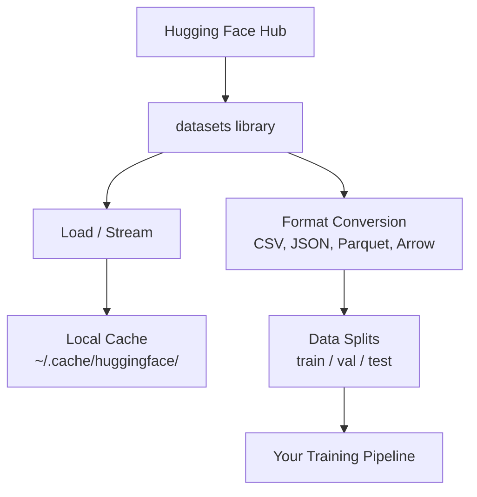

# 数据管理

> 数据是燃料。你如何管理它决定了你能走多快。

**类型：** 构建
**语言：** Python
**先决条件：** 阶段 0，第 01 课
**时间：** 约45分钟

## 学习目标

- 使用 Hugging Face `datasets` 库加载、流式传输和缓存数据集
- 在 CSV、JSON、Parquet 和 Arrow 格式间转换并解释它们的权衡
- 使用固定随机种子创建可重现的训练/验证/测试集划分
- 使用 `datasets`、Git LFS 或 DVC 管理大型模型和数据集文件

## 问题

每个 AI 项目都从数据开始。你需要找到数据集、下载它们、在格式间转换、为训练和评估划分数据集，并对它们进行版本控制以使实验可重现。每次都手动操作既慢又容易出错。你需要一个可重复的工作流程。

## 核心概念



Hugging Face `datasets` 库是为 AI 工作加载数据的标准方式。它开箱即用地处理下载、缓存、格式转换和流式传输。

## 动手构建

### 步骤1：安装datasets库

```bash
pip install datasets huggingface_hub
```

### 步骤2：加载数据集

```python
from datasets import load_dataset

dataset = load_dataset("imdb")
print(dataset)
print(dataset["train"][0])
```

这将下载IMDB电影评论数据集。首次下载后，会从`~/.cache/huggingface/datasets/`缓存加载。

### 步骤3：流式加载大型数据集

某些数据集太大，无法装入磁盘。流式加载逐行加载，无需下载完整内容。

```python
dataset = load_dataset("wikimedia/wikipedia", "20220301.en", split="train", streaming=True)

for i, example in enumerate(dataset):
    print(example["title"])
    if i >= 4:
        break
```

流式加载会给你一个`IterableDataset`。你可以在数据到达时逐行处理。无论数据集大小，内存使用量保持恒定。

### 第4步：数据集格式

`datasets`库底层使用Apache Arrow。您可以根据管道需求转换为其他格式。

```python
dataset = load_dataset("imdb", split="train")

dataset.to_csv("imdb_train.csv")
dataset.to_json("imdb_train.json")
dataset.to_parquet("imdb_train.parquet")
```

格式比较：

|  格式  |  大小  |  读取速度  |  最佳用途  |
|--------|------|-----------|----------|
|  CSV  |  大  |  慢  |  人类可读性、电子表格  |
|  JSON  |  大  |  慢  |  应用编程接口、嵌套数据  |
| Parquet | 小 | 快 | 分析型列式查询 |
| Arrow | 小 | 最快 | 内存处理（`datasets`内部使用） |

对于AI工作，Parquet是最佳存储格式。Arrow是你在内存中处理的格式。CSV和JSON用于数据交换。

### 步骤5：数据拆分

每个机器学习项目都需要三种拆分：

- **训练集**：模型从中学习（通常80%）
- **验证集**：训练过程中检查进度（通常10%）
- **测试集**：训练完成后的最终评估（通常10%）

有些数据集是预先划分好的。如果没有，请自行划分：

```python
dataset = load_dataset("imdb", split="train")

split = dataset.train_test_split(test_size=0.2, seed=42)
train_val = split["train"].train_test_split(test_size=0.125, seed=42)

train_ds = train_val["train"]
val_ds = train_val["test"]
test_ds = split["test"]

print(f"Train: {len(train_ds)}, Val: {len(val_ds)}, Test: {len(test_ds)}")
```

始终设置随机种子以确保可重复性。相同的种子每次产生相同的划分。

### 步骤6：下载并缓存模型

模型文件很大。`huggingface_hub`库负责下载和缓存。

```python
from huggingface_hub import hf_hub_download, snapshot_download

model_path = hf_hub_download(
    repo_id="sentence-transformers/all-MiniLM-L6-v2",
    filename="config.json"
)
print(f"Cached at: {model_path}")

model_dir = snapshot_download("sentence-transformers/all-MiniLM-L6-v2")
print(f"Full model at: {model_dir}")
```

模型缓存到`~/.cache/huggingface/hub/`。一旦下载，后续运行时会立即加载。

### 步骤7：处理大文件

模型权重和大数据集不应存入git。三个选项：

**选项A：.gitignore（最简单）**

```
*.bin
*.safetensors
*.pt
*.onnx
data/*.parquet
data/*.csv
models/
```

**选项B：Git LFS（在git中追踪大文件）**

```bash
git lfs install
git lfs track "*.bin"
git lfs track "*.safetensors"
git add .gitattributes
```

Git LFS在仓库中存储指针，实际文件存储在单独的服务器上。GitHub免费提供1GB空间。

**选项C：DVC（数据版本控制）**

```bash
pip install dvc
dvc init
dvc add data/training_set.parquet
git add data/training_set.parquet.dvc data/.gitignore
git commit -m "Track training data with DVC"
```

DVC创建指向数据的小型`.dvc`文件。数据本身存储在S3、GCS或其他远程存储后端。

| 方法  |  复杂度  |  最适合场景 |
|----------|-----------|----------|
|  .gitignore  |  低  |  个人项目，可重新获取的已下载数据 |
|  Git LFS  |  中  |  通过Git分享模型权重的团队 |
|  DVC  |  高  |  可复现实验、大型数据集、团队 |

本课程中，`.gitignore` 就足够了。当你需要在多台机器上复现精确实验时，使用DVC。

### 第8步：存储模式

**本地存储**适用于大约10 GB以下的数据集。HF缓存会自动处理此问题。

**云存储**适用于更大的数据集或跨机器共享的数据。

```python
import os

local_path = os.path.expanduser("~/.cache/huggingface/datasets/")

# s3_path = "s3://my-bucket/datasets/"
# gcs_path = "gs://my-bucket/datasets/"
```

DVC可直接与S3和GCS集成。

```bash
dvc remote add -d myremote s3://my-bucket/dvc-store
dvc push
```

对于本课程，本地存储就足够了。当您在远程GPU实例上进行微调时，云存储就变得相关了。

## 本课程使用的数据集

|  数据集  |  课程  |  大小  |  教授内容  |
|---------|---------|------|----------------|
|  IMDB  |  分词、分类  |  84 MB  |  文本分类基础  |
|  WikiText  |  语言建模  |  181 MB  |  下一个词预测  |
|  SQuAD  |  问答系统  |  35 MB  |  问答，片段抽取  |
|  Common Crawl (子集)  |  嵌入  |  变化  |  大规模文本处理  |
|  MNIST  |  视觉基础  |  21 MB  |  图像分类基础  |
|  COCO (子集)  |  多模态  |  变化  |  图像-文本对  |

你现在不需要全部下载。每节课都会说明需要哪些内容。

## 使用它

运行实用程序脚本以验证一切正常：

```bash
python code/data_utils.py
```

这会下载一个小型数据集，进行转换、拆分，并打印摘要。

## 发布

本課(lesson)产出：
- `code/data_utils.py` - 可重复使用的数据加载和缓存工具
- `code/data_utils.py` - 查找适合任务的数据集的提示

## 练习

1. 用`mrpc`配置加载`glue`数据集，检查前5个样本
2. 流式处理`glue`数据集，统计10秒内能处理多少样本
3. 将数据集转换为Parquet格式，并与CSV比较文件大小
4. 创建70/15/15的训练/验证/测试划分，使用固定种子，验证各集合大小

## 关键术语

|  术语  |  人们的说法  |  实际含义  |
|------|----------------|----------------------|
|  数据集划分  |  "训练数据"  |  在机器学习生命周期的不同阶段使用的命名子集（训练/验证/测试） |
| 流式传输  |  "惰性加载"  |  从远程源逐行处理数据，无需下载完整数据集 |
| Parquet  |  "压缩版CSV"  |  一种列式文件格式，针对分析查询和存储效率进行了优化 |
| Arrow  |  "快速数据框"  |  一种内存列式格式，被datasets库内部用于零拷贝读取 |
| Git LFS  |  "面向大文件的Git"  |  一种将大型文件存储在git仓库之外，同时在版本控制中保留指针的扩展 |
| DVC  |  "面向数据的Git"  |  一种用于数据集和模型的版本控制系统，与云存储集成 |
| Cache  |  "已下载"  |  先前获取的数据的本地副本，默认存储在~/.cache/huggingface/ |
