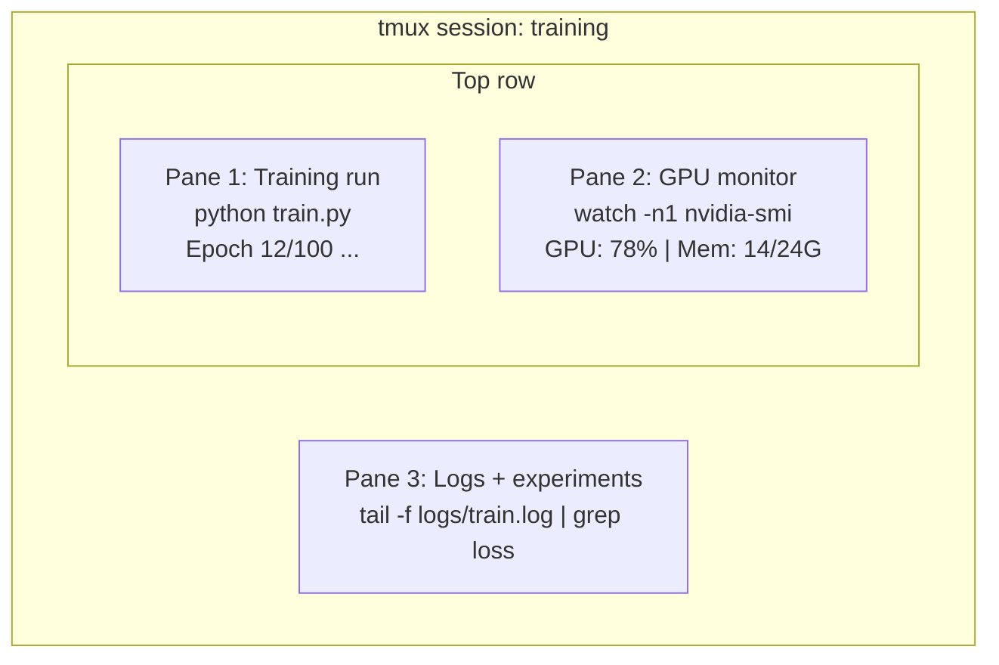

# 终端与Shell

> 终端是AI工程师的常驻之地。请在此感到舒适。

**类型：**学习
**语言：** --
**前置条件：**阶段0，第01课
**时间：**约35分钟

## 学习目标

- 使用管道(piping)、重定向(redirects)和`grep`从命令行过滤和处理训练日志
- 创建持久化的tmux会话，包含多个面板，用于并发训练和GPU监控
- 使用`grep`、`htop`和`nvtop`监控系统和GPU资源
- 使用SSH、`grep`和`htop`在本地和远程机器之间传输文件

## 问题

你在终端上花费的时间将超过任何编辑器。训练运行、GPU监控、日志跟踪、远程SSH会话、环境管理。每个AI工作流程都离不开Shell。如果你在这里慢吞吞，你在任何地方都会慢吞吞。

本课涵盖对AI工作至关重要的终端技能。不涉及Unix历史，也不深入Bash脚本。只给你需要的。

## 核心概念



三件事同时运行。一个终端。你可以分离，回家，SSH重新登录，再重新连接。训练继续运行。

## 动手构建

### 第1步：了解你的Shell

检查你正在运行的Shell：

```bash
echo $SHELL
```

大多数系统使用`bash`或`zsh`。两者都可以。本课程中的命令在这两种中都能工作。

需要了解的关键点：

```bash
# Move around
cd ~/projects/ai-engineering-from-scratch
pwd
ls -la

# History search (most useful shortcut you'll learn)
# Ctrl+R then type part of a previous command
# Press Ctrl+R again to cycle through matches

# Clear terminal
clear   # or Ctrl+L

# Cancel a running command
# Ctrl+C

# Suspend a running command (resume with fg)
# Ctrl+Z
```

### 第2步：管道和重定向

管道将命令连接在一起。这就是你处理日志、过滤输出和串联工具的方式。你会经常用到它。

```bash
# Count how many times "loss" appears in a log
cat train.log | grep "loss" | wc -l

# Extract just the loss values from training output
grep "loss:" train.log | awk '{print $NF}' > losses.txt

# Watch a log file update in real time, filtering for errors
tail -f train.log | grep --line-buffered "ERROR"

# Sort experiments by final accuracy
grep "final_accuracy" results/*.log | sort -t= -k2 -n -r

# Redirect stdout and stderr to separate files
python train.py > output.log 2> errors.log

# Redirect both to the same file
python train.py > train_full.log 2>&1
```

你需要掌握的三种重定向：

|  符号  |  作用  |
|--------|-------------|
|  `>`  |  将标准输出写入文件（覆盖）  |
|  `>>`  |  将标准输出追加到文件  |
|  `2>`  |  将标准错误写入文件  |
|  `2>&1`  |  将stderr发送到与stdout相同的位置 |
|  `\ | `  |  将一个命令的stdout作为stdin发送给下一个命令 |

### 步骤3：后台进程

训练运行需要数小时。你不想让终端一直开着。

```bash
# Run in background (output still goes to terminal)
python train.py &

# Run in background, immune to hangup (closing terminal won't kill it)
nohup python train.py > train.log 2>&1 &

# Check what's running in background
jobs
ps aux | grep train.py

# Bring a background job to foreground
fg %1

# Kill a background process
kill %1
# or find its PID and kill that
kill $(pgrep -f "train.py")
```

`&`、`nohup`和`screen`/`tmux`之间的区别：

|  方法  |  关闭终端后是否存活？  |  能否重新连接？ |
|--------|-------------------------|---------------|
|  `command &`  |  否  |  否  |
|  `nohup command &`  |  是  |  否 (检查日志文件)  |
|  `screen` / `tmux`  |  是  |  是  |

对于任何超过几分钟的任务，请使用 tmux。

### 第4步：tmux

tmux 允许你创建带有多个窗格的持久终端会话。这是管理训练运行的最有用的工具。

```bash
# Install
# macOS
brew install tmux
# Ubuntu
sudo apt install tmux

# Start a named session
tmux new -s training

# Split horizontally
# Ctrl+B then "

# Split vertically
# Ctrl+B then %

# Navigate between panes
# Ctrl+B then arrow keys

# Detach (session keeps running)
# Ctrl+B then d

# Reattach
tmux attach -t training

# List sessions
tmux ls

# Kill a session
tmux kill-session -t training
```

一个典型的AI工作流会话：

```bash
tmux new -s train

# Pane 1: start training
python train.py --epochs 100 --lr 1e-4

# Ctrl+B, " to split, then run GPU monitor
watch -n1 nvidia-smi

# Ctrl+B, % to split vertically, tail the logs
tail -f logs/experiment.log

# Now detach with Ctrl+B, d
# SSH out, go get coffee, come back
# tmux attach -t train
```

### 第5步：使用htop和nvtop进行监控

```bash
# System processes (better than top)
htop

# GPU processes (if you have NVIDIA GPU)
# Install: sudo apt install nvtop (Ubuntu) or brew install nvtop (macOS)
nvtop

# Quick GPU check without nvtop
nvidia-smi

# Watch GPU usage update every second
watch -n1 nvidia-smi

# See which processes are using the GPU
nvidia-smi --query-compute-apps=pid,name,used_memory --format=csv
```

`htop` 你会使用的快捷键：
- `F6` 或 `>` 按列排序（按内存排序以查找内存泄漏）
- `F6` 切换树形视图（查看子进程）
- `F6` 杀死进程
- `F6` 搜索进程名

### 第6步：使用SSH连接远程GPU设备

当你租用云GPU（Lambda、RunPod、Vast.ai）时，通过SSH连接。

```bash
# Basic connection
ssh user@gpu-box-ip

# With a specific key
ssh -i ~/.ssh/my_gpu_key user@gpu-box-ip

# Copy files to remote
scp model.pt user@gpu-box-ip:~/models/

# Copy files from remote
scp user@gpu-box-ip:~/results/metrics.json ./

# Sync a whole directory (faster for many files)
rsync -avz ./data/ user@gpu-box-ip:~/data/

# Port forward (access remote Jupyter/TensorBoard locally)
ssh -L 8888:localhost:8888 user@gpu-box-ip
# Now open localhost:8888 in your browser

# SSH config for convenience
# Add to ~/.ssh/config:
# Host gpu
#     HostName 192.168.1.100
#     User ubuntu
#     IdentityFile ~/.ssh/gpu_key
#
# Then just:
# ssh gpu
```

### 第7步：AI工作的实用别名

将这些添加到您的`~/.bashrc`或`~/.zshrc`中：

```bash
source phases/00-setup-and-tooling/10-terminal-and-shell/code/shell_aliases.sh
```

或者复制您需要的别名。关键别名：

```bash
# GPU status at a glance
alias gpu='nvidia-smi --query-gpu=index,name,utilization.gpu,memory.used,memory.total,temperature.gpu --format=csv,noheader'

# Kill all Python training processes
alias killtraining='pkill -f "python.*train"'

# Quick virtual environment activate
alias ae='source .venv/bin/activate'

# Watch training loss
alias watchloss='tail -f logs/*.log | grep --line-buffered "loss"'
```

完整列表请参见`code/shell_aliases.sh`。

### 第8步：常见的AI终端模式

这些在实践中反复出现：

```bash
# Run training, log everything, notify when done
python train.py 2>&1 | tee train.log; echo "DONE" | mail -s "Training complete" you@email.com

# Compare two experiment logs side by side
diff <(grep "accuracy" exp1.log) <(grep "accuracy" exp2.log)

# Find the largest model files (clean up disk space)
find . -name "*.pt" -o -name "*.safetensors" | xargs du -h | sort -rh | head -20

# Download a model from Hugging Face
wget https://huggingface.co/model/resolve/main/model.safetensors

# Untar a dataset
tar xzf dataset.tar.gz -C ./data/

# Count lines in all Python files (see how big your project is)
find . -name "*.py" | xargs wc -l | tail -1

# Check disk space (training data fills disks fast)
df -h
du -sh ./data/*

# Environment variable check before training
env | grep -i cuda
env | grep -i torch
```

## 使用它

以下是本课程中各工具的使用时机：

|  工具  |  使用时机  |
|------|----------------|
|  tmux  |  每次训练运行（阶段3+） |
|  `tail -f` + `grep`  |  监控训练日志  |
|  `nohup` / `&`  |  快速后台任务  |
|  `htop` / `nvtop`  |  调试训练缓慢、OOM错误  |
| SSH + `rsync`  |  在云GPU上工作 |
| 管道与重定向  |  处理实验结果 |
| 别名  |  节省重复命令的时间 |

## 练习

1. 安装 tmux，创建一个包含三个窗格的会话，在一个窗格中运行 `htop`，另一个窗格中运行 `watch -n1 date`，第三个窗格中运行一个 Python 脚本。分离并重新连接。
2. 将 `htop` 中的别名添加到你的 shell 配置中，然后使用 `watch -n1 date`（或 `code/shell_aliases.sh`）重新加载。
3. 使用 `htop` 创建一个模拟训练日志，然后使用 `watch -n1 date`、`code/shell_aliases.sh` 和 `source ~/.zshrc` 提取出损失值。
4. 为你能够访问的服务器设置一个 SSH 配置项（或者使用 `htop` 来练习语法）。

## 关键术语

|  术语  |  人们的说法  |  实际含义  |
|------|----------------|----------------------|
| Shell  |  "终端"  |  解释你命令的程序（bash，zsh，fish） |
| tmux  |  "终端复用器"  |  一个允许你在一个窗口内运行多个终端会话，并支持分离/重新连接的程序 |
| Pipe  |  "竖线符号"  |  用于将一个命令的输出作为另一个命令输入的 `|` 运算符 |  |
| PID  |  "进程ID"  |  分配给每个运行进程的唯一编号，用于监控或终止进程 |
| nohup  |  "不挂断"  |  运行不受挂断信号影响的命令，因此关闭终端不会终止它 |
| SSH  |  "连接到服务器"  |  安全外壳协议，一种用于在远程机器上运行命令的加密协议 |
