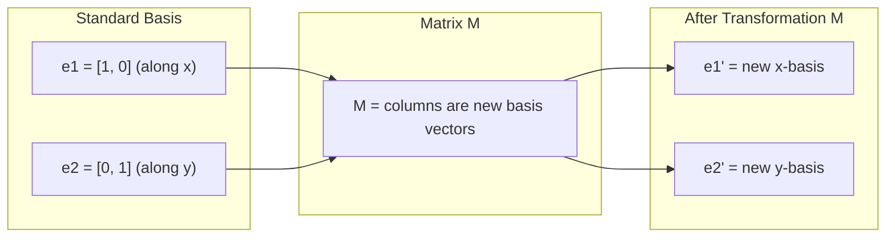
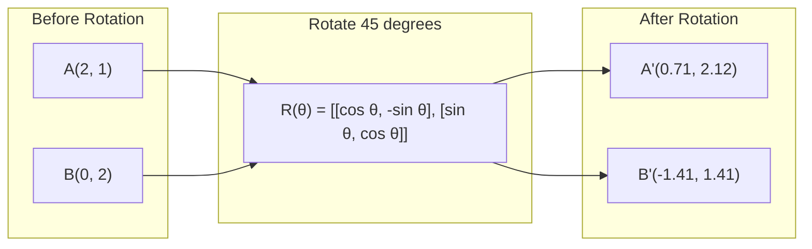
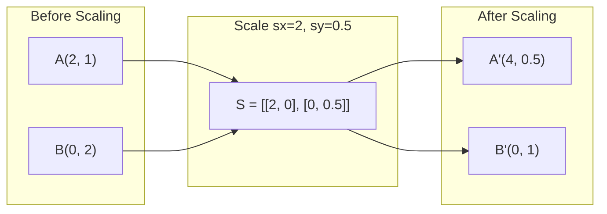
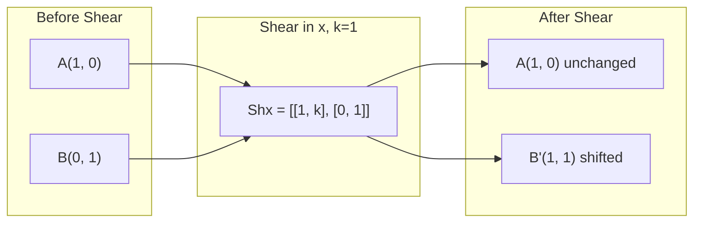
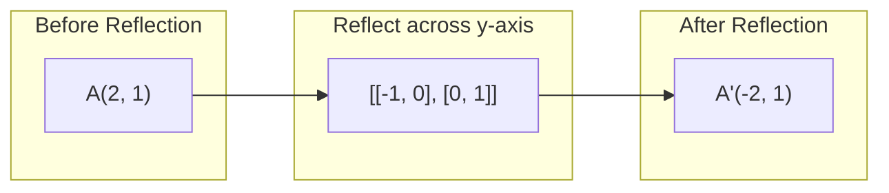
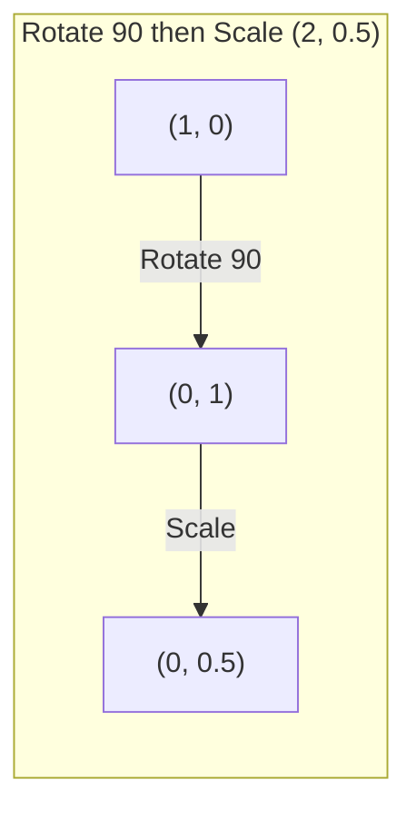
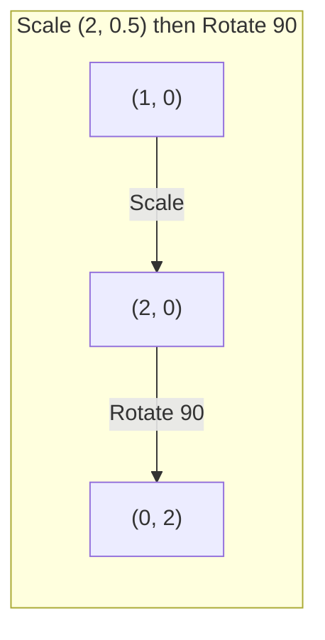

# 矩阵变换

> 矩阵是一台重塑空间的机器。了解它对每个点做了什么，你就理解了整个变换。

**类型：** 构建
**语言：** Python, Julia
**先修知识：** 阶段1，课程01-02（线性代数直观理解，向量与矩阵运算）
**时长：** ~75分钟

## 学习目标

- 构建旋转、缩放、剪切和反射矩阵，并将其应用于2D和3D点
- 通过矩阵乘法组合多个变换，并验证顺序的重要性
- 从特征方程计算2x2矩阵的特征值和特征向量
- 解释为什么特征值决定PCA方向、RNN稳定性和谱聚类行为

## 问题

你读到PCA时看到“找到协方差矩阵的特征向量”。你读到模型稳定性时看到“检查所有特征值的模长是否小于1”。你读到数据增强时看到“应用随机旋转”。在你从几何上理解矩阵对空间的作用之前，这些都没有意义。

矩阵不只是数字网格。它们是空间机器。旋转矩阵旋转点。缩放矩阵拉伸点。剪切矩阵倾斜点。神经网络应用于数据的每个变换都是这些操作之一或其组合。本课程使这些操作具体化。

## 核心概念

### 变换作为矩阵

2D中的每个线性变换都可以写成2x2矩阵。矩阵精确告诉你基向量[1, 0]和[0, 1]最终的位置。其余的一切随之而来。



### 旋转

角度为theta的2D旋转保持距离和角度不变。它沿着圆弧移动每个点。



在3D中，你绕轴旋转。每个轴都有其自己的旋转矩阵：

```
Rz(theta) = | cos  -sin  0 |     Rotate around z-axis
            | sin   cos  0 |     (x-y plane spins, z stays)
            |  0     0   1 |

Rx(theta) = | 1   0     0    |   Rotate around x-axis
            | 0  cos  -sin   |   (y-z plane spins, x stays)
            | 0  sin   cos   |

Ry(theta) = |  cos  0  sin |     Rotate around y-axis
            |   0   1   0  |     (x-z plane spins, y stays)
            | -sin  0  cos |
```

### 缩放

缩放沿每个轴独立地拉伸或压缩。



### 剪切

剪切倾斜一个轴，同时保持另一个轴固定。它将矩形变成平行四边形。



剪切矩阵：
- `Shx = [[1, k], [0, 1]]` 将x平移k*y
- `Shx = [[1, k], [0, 1]]` 将y平移k*x

### 反射

反射将点沿轴或直线镜像。



反射矩阵：
- 关于y轴对称：`[[-1, 0], [0, 1]]`
- 关于x轴对称：`[[-1, 0], [0, 1]]`

### 复合：链式变换

先应用变换A再应用变换B等同于将它们对应的矩阵相乘：`result = B @ A @ point`。顺序很重要。先旋转再缩放与先缩放再旋转结果不同。



复合结果：`S @ R = [[0, -2], [0.5, 0]]`



复合结果：`R @ S = [[0, -0.5], [2, 0]]`

结果不同。矩阵乘法不满足交换律。

### 特征值与特征向量

大多数向量在被矩阵作用时会改变方向。特征向量很特殊：矩阵只会缩放它们，绝不会旋转它们。缩放因子就是特征值。

```
A @ v = lambda * v

v is the eigenvector (direction that survives)
lambda is the eigenvalue (how much it stretches)

Example: A = | 2  1 |
             | 1  2 |

Eigenvector [1, 1] with eigenvalue 3:
  A @ [1,1] = [3, 3] = 3 * [1, 1]     (same direction, scaled by 3)

Eigenvector [1, -1] with eigenvalue 1:
  A @ [1,-1] = [1, -1] = 1 * [1, -1]  (same direction, unchanged)
```

该矩阵沿[1,1]方向将空间拉伸3倍，并保持[1,-1]方向不变。所有其他方向都是这两个方向的混合。

### 特征分解

如果一个矩阵有n个线性无关的特征向量，那么它可以被分解为：

```
A = V @ D @ V^(-1)

V = matrix whose columns are eigenvectors
D = diagonal matrix of eigenvalues
V^(-1) = inverse of V

This says: rotate into eigenvector coordinates, scale along each axis, rotate back.
```

### 特征值为何重要

**PCA.** 协方差矩阵的特征向量(Eigenvectors)是主成分。特征值(Eigenvalues)告诉你每个成分捕获了多少方差。按特征值排序，保留前k个，就实现了降维(Dimensionality Reduction)。

**稳定性(Stability).** 在循环网络(Recurrent Networks)和动力系统中，模大于1的特征值(Eigenvalues)会导致输出爆炸，模小于1会导致梯度消失。这就是用一句话描述的梯度消失/爆炸问题(Vanishing/Exploding Gradient Problem)。

**谱方法(Spectral methods).** 图神经网络(Graph Neural Networks)使用邻接矩阵(Adjacency Matrix)的特征值。谱聚类(Spectral Clustering)使用拉普拉斯矩阵(Laplacian)的特征值。特征向量(Eigenvectors)揭示了图的结构。

### 行列式作为体积缩放因子

变换矩阵的行列式告诉你它在二维中缩放面积、在三维中缩放体积的程度。

```
det = 1:   area preserved (rotation)
det = 2:   area doubled
det = 0:   space crushed to lower dimension (singular)
det = -1:  area preserved but orientation flipped (reflection)

| det(Rotation) | = 1        (always)
| det(Scale sx, sy) | = sx * sy
| det(Shear) | = 1           (area preserved)
| det(Reflection) | = -1     (orientation flipped)
```

```figure
matrix-transform
```

## 动手构建

### 第一步：从头实现变换矩阵（Python）

```python
import math

def rotation_2d(theta):
    c, s = math.cos(theta), math.sin(theta)
    return [[c, -s], [s, c]]

def scaling_2d(sx, sy):
    return [[sx, 0], [0, sy]]

def shearing_2d(kx, ky):
    return [[1, kx], [ky, 1]]

def reflection_x():
    return [[1, 0], [0, -1]]

def reflection_y():
    return [[-1, 0], [0, 1]]

def mat_vec_mul(matrix, vector):
    return [
        sum(matrix[i][j] * vector[j] for j in range(len(vector)))
        for i in range(len(matrix))
    ]

def mat_mul(a, b):
    rows_a, cols_b = len(a), len(b[0])
    cols_a = len(a[0])
    return [
        [sum(a[i][k] * b[k][j] for k in range(cols_a)) for j in range(cols_b)]
        for i in range(rows_a)
    ]

point = [1.0, 0.0]
angle = math.pi / 4

rotated = mat_vec_mul(rotation_2d(angle), point)
print(f"Rotate (1,0) by 45 deg: ({rotated[0]:.4f}, {rotated[1]:.4f})")

scaled = mat_vec_mul(scaling_2d(2, 3), [1.0, 1.0])
print(f"Scale (1,1) by (2,3): ({scaled[0]:.1f}, {scaled[1]:.1f})")

sheared = mat_vec_mul(shearing_2d(1, 0), [1.0, 1.0])
print(f"Shear (1,1) kx=1: ({sheared[0]:.1f}, {sheared[1]:.1f})")

reflected = mat_vec_mul(reflection_y(), [2.0, 1.0])
print(f"Reflect (2,1) across y: ({reflected[0]:.1f}, {reflected[1]:.1f})")
```

### 第二步：变换的复合

```python
R = rotation_2d(math.pi / 2)
S = scaling_2d(2, 0.5)

rotate_then_scale = mat_mul(S, R)
scale_then_rotate = mat_mul(R, S)

point = [1.0, 0.0]
result1 = mat_vec_mul(rotate_then_scale, point)
result2 = mat_vec_mul(scale_then_rotate, point)

print(f"Rotate 90 then scale: ({result1[0]:.2f}, {result1[1]:.2f})")
print(f"Scale then rotate 90: ({result2[0]:.2f}, {result2[1]:.2f})")
print(f"Same? {result1 == result2}")
```

### 第三步：从头计算特征值（2x2矩阵）

对于2x2矩阵 `[[a, b], [c, d]]`，特征值满足特征方程：`lambda^2 - (a+d)*lambda + (ad - bc) = 0`。

```python
def eigenvalues_2x2(matrix):
    a, b = matrix[0]
    c, d = matrix[1]
    trace = a + d
    det = a * d - b * c
    discriminant = trace ** 2 - 4 * det
    if discriminant < 0:
        real = trace / 2
        imag = (-discriminant) ** 0.5 / 2
        return (complex(real, imag), complex(real, -imag))
    sqrt_disc = discriminant ** 0.5
    return ((trace + sqrt_disc) / 2, (trace - sqrt_disc) / 2)

def eigenvector_2x2(matrix, eigenvalue):
    a, b = matrix[0]
    c, d = matrix[1]
    if abs(b) > 1e-10:
        v = [b, eigenvalue - a]
    elif abs(c) > 1e-10:
        v = [eigenvalue - d, c]
    else:
        if abs(a - eigenvalue) < 1e-10:
            v = [1, 0]
        else:
            v = [0, 1]
    mag = (v[0] ** 2 + v[1] ** 2) ** 0.5
    return [v[0] / mag, v[1] / mag]

A = [[2, 1], [1, 2]]
vals = eigenvalues_2x2(A)
print(f"Matrix: {A}")
print(f"Eigenvalues: {vals[0]:.4f}, {vals[1]:.4f}")

for val in vals:
    vec = eigenvector_2x2(A, val)
    result = mat_vec_mul(A, vec)
    scaled = [val * vec[0], val * vec[1]]
    print(f"  lambda={val:.1f}, v={[round(x,4) for x in vec]}")
    print(f"    A@v = {[round(x,4) for x in result]}")
    print(f"    l*v = {[round(x,4) for x in scaled]}")
```

### 第四步：行列式作为体积缩放因子

```python
def det_2x2(matrix):
    return matrix[0][0] * matrix[1][1] - matrix[0][1] * matrix[1][0]

print(f"det(rotation 45) = {det_2x2(rotation_2d(math.pi/4)):.4f}")
print(f"det(scale 2,3)   = {det_2x2(scaling_2d(2, 3)):.1f}")
print(f"det(shear kx=1)  = {det_2x2(shearing_2d(1, 0)):.1f}")
print(f"det(reflect y)   = {det_2x2(reflection_y()):.1f}")

singular = [[1, 2], [2, 4]]
print(f"det(singular)     = {det_2x2(singular):.1f}")
print("Singular: columns are proportional, space collapses to a line.")
```

## 使用它

NumPy 通过优化后的例程处理所有这些运算。

```python
import numpy as np

theta = np.pi / 4
R = np.array([[np.cos(theta), -np.sin(theta)],
              [np.sin(theta),  np.cos(theta)]])

point = np.array([1.0, 0.0])
print(f"Rotate (1,0) by 45 deg: {R @ point}")

S = np.diag([2.0, 3.0])
composed = S @ R
print(f"Scale(2,3) after Rotate(45): {composed @ point}")

A = np.array([[2, 1], [1, 2]], dtype=float)
eigenvalues, eigenvectors = np.linalg.eig(A)
print(f"\nEigenvalues: {eigenvalues}")
print(f"Eigenvectors (columns):\n{eigenvectors}")

for i in range(len(eigenvalues)):
    v = eigenvectors[:, i]
    lam = eigenvalues[i]
    print(f"  A @ v{i} = {A @ v}, lambda * v{i} = {lam * v}")

print(f"\ndet(R) = {np.linalg.det(R):.4f}")
print(f"det(S) = {np.linalg.det(S):.1f}")

B = np.array([[3, 1], [0, 2]], dtype=float)
vals, vecs = np.linalg.eig(B)
D = np.diag(vals)
V = vecs
reconstructed = V @ D @ np.linalg.inv(V)
print(f"\nEigendecomposition A = V @ D @ V^-1:")
print(f"Original:\n{B}")
print(f"Reconstructed:\n{reconstructed}")
```

### 使用 NumPy 进行三维旋转

```python
def rotation_3d_z(theta):
    c, s = np.cos(theta), np.sin(theta)
    return np.array([[c, -s, 0], [s, c, 0], [0, 0, 1]])

def rotation_3d_x(theta):
    c, s = np.cos(theta), np.sin(theta)
    return np.array([[1, 0, 0], [0, c, -s], [0, s, c]])

point_3d = np.array([1.0, 0.0, 0.0])
rotated_z = rotation_3d_z(np.pi / 2) @ point_3d
rotated_x = rotation_3d_x(np.pi / 2) @ point_3d

print(f"\n3D point: {point_3d}")
print(f"Rotate 90 around z: {np.round(rotated_z, 4)}")
print(f"Rotate 90 around x: {np.round(rotated_x, 4)}")
```

## 发布

本课为 PCA（第二阶段）和神经网络权重分析奠定几何基础。这里编写的特征值/特征向量代码与生产级机器学习系统中的降维、谱聚类和稳定性分析所使用的算法相同。

## 练习

1. 对单位正方形（顶点为 [0,0], [1,0], [1,1], [0,1]）应用旋转、缩放和剪切变换。打印每种变换后的顶点。验证旋转保持顶点之间的距离不变。

2. 使用特征方程手动计算矩阵 [[4, 2], [1, 3]] 的特征值。然后用你从头实现的函数和 NumPy 进行验证。

3. 创建一个由三种变换（旋转30度，缩放[1.5, 0.8]，剪切kx=0.3）组合而成的复合变换，并将其应用于排列成圆形的8个点上。打印变换前后的坐标。计算复合矩阵的行列式(Determinant)，并验证其等于各个矩阵行列式的乘积。

## 关键术语

|  术语  |  人们的说法  |  实际含义  |
|------|----------------|----------------------|
|  旋转矩阵(Rotation matrix)  |  "旋转物体"  |  一种正交矩阵，沿圆弧移动点，同时保持距离和角度不变。行列式始终为1。 |
|  缩放矩阵(Scaling matrix)  |  "放大物体"  |  一种对角矩阵，沿每个轴独立拉伸或压缩。行列式等于缩放因子的乘积。 |
|  剪切矩阵(Shearing matrix)  |  "倾斜物体"  |  一种矩阵，将一个坐标与另一个坐标成比例地移动，将矩形变为平行四边形。行列式为1。 |
|  反射(Reflection)  |  "镜像物体"  |  一种矩阵，将空间沿轴或平面翻转。行列式为-1。 |
|  复合(Composition)  |  "做两件事"  |  将变换矩阵相乘以串联操作。顺序很重要：B @ A 表示先应用 A，再应用 B。 |
|  特征向量(Eigenvector)  |  "特殊方向"  |  矩阵仅缩放而不旋转的方向。矩阵的"指纹"。 |
|  特征值(Eigenvalue)  |  "拉伸程度"  |  矩阵缩放其特征向量的标量因子。可以为负（翻转）或复数（旋转）。 |
|  特征分解(Eigendecomposition)  |  "分解矩阵"  |  将矩阵写为 V @ D @ V^(-1)，将其分解为基本的缩放方向和幅度。 |
|  行列式(Determinant)  |  "矩阵的一个数值"  |  变换缩放面积（2D）或体积（3D）的因子。零意味着变换不可逆。 |
|  特征方程(Characteristic equation)  |  "特征值的来源"  |  det(A - λI) = 0。根为特征值的多项式。 |

## 延伸阅读

- [3Blue1Brown: Linear Transformations](https://www.3blue1brown.com/lessons/linear-transformations) -- 矩阵如何重塑空间的直观直觉
- [3Blue1Brown: Linear Transformations](https://www.3blue1brown.com/lessons/linear-transformations) -- 特征值几何意义的最佳视觉解释
- [3Blue1Brown: Linear Transformations](https://www.3blue1brown.com/lessons/linear-transformations) -- Gilbert Strang的经典论述
