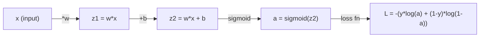
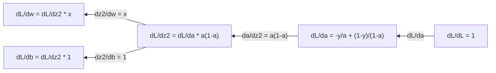
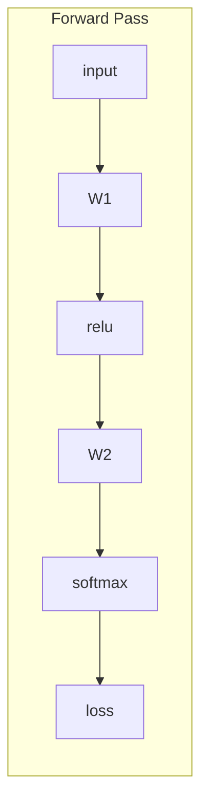
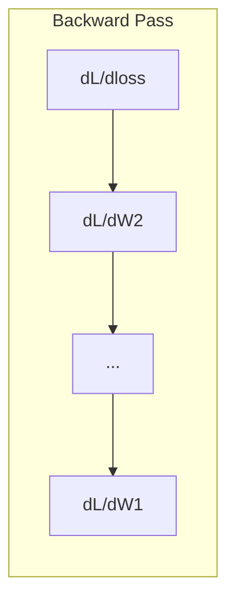

# 机器学习微积分

> 导数告诉你哪个方向是下坡。神经网络学习仅需这一点。

**类型：** 学习
**语言：** Python
**前置条件：** 阶段1，课程01-03
**时间：** ~60分钟

## 学习目标

- 计算常见机器学习函数（x^2, sigmoid, 交叉熵）的数值导数和解析导数
- 从零实现梯度下降以最小化一维和二维损失函数
- 推导线性回归模型的梯度并通过手动权重更新训练它
- 解释Hessian矩阵、泰勒级数近似及其与优化方法的联系

## 问题

你有一个包含数百万权重的神经网络。每个权重都是一个旋钮。你需要弄清楚每个旋钮的转动方向，使模型稍微不那么错误。微积分给了你那个方向。

没有微积分，训练神经网络意味着尝试随机变化并希望得到最好的结果。有了导数，你确切知道每个权重如何影响误差。你每次都把每个旋钮拧到正确的方向。

## 核心概念

### 什么是导数？

导数衡量变化率。对于函数 y = f(x)，导数 f'(x) 告诉你：如果你将 x 微小移动一点点，y 会改变多少？

几何上，导数是某点处切线的斜率。

**f(x) = x^2:**

|  x  |  f(x)  |  f'(x) (斜率)  |
|---|------|---------------|
|  0  |  0     |  0（平坦，在底部）  |
|  1  |  1     |  2  |
|  2  |  4     |  4（此处切线斜率）  |
|  3  |  9     |  6  |

在 x=2 处，斜率是4。如果你将 x 向右移动一小点，y 大约增加该量的4倍。在 x=0 处，斜率是0。你处于碗的底部。

正式定义：

```
f'(x) = lim   f(x + h) - f(x)
        h->0  -----------------
                     h
```

在代码中，你跳过极限，只使用一个非常小的 h。这就是数值导数。

### 偏导数(Partial derivatives)：一次一个变量

实际函数有许多输入。神经网络损失依赖于成千上万个权重。偏导数保持所有变量不变，只改变一个，然后对该变量求导。

```
f(x, y) = x^2 + 3xy + y^2

df/dx = 2x + 3y     (treat y as a constant)
df/dy = 3x + 2y     (treat x as a constant)
```

每个偏导数回答：如果我仅微调这一个权重，损失如何变化？

### 梯度：所有偏导数的向量

梯度将所有偏导数收集到一个向量中。对于函数 f(x, y, z)，梯度为：

```
grad f = [ df/dx, df/dy, df/dz ]
```

梯度指向最陡上升的方向。为最小化函数，沿相反方向前进。

**f(x,y) = x^2 + y^2 的等高线图：**

该函数形成碗状，等高线为同心圆。最小值在 (0, 0)。

|  点  |  梯度 f  |  -梯度 f（下降方向）  |
|-------|--------|----------------------------|
|  (1, 1)  |  [2, 2]（指向上坡，远离最小值）  |  [-2, -2]（指向下坡，朝向最小值）  |
|  (0, 0)  |  [0, 0]（平坦，在最小值处）  |  [0, 0]  |

这就是梯度下降的图示。计算梯度，取反，迈出一步。

### 与优化的联系

训练神经网络就是优化。你有一个损失函数 L(w1, w2, ..., wn)，衡量模型误差大小。你想要最小化它。

```
Gradient descent update rule:

  w_new = w_old - learning_rate * dL/dw

For every weight:
  1. Compute the partial derivative of loss with respect to that weight
  2. Subtract a small multiple of it from the weight
  3. Repeat
```

学习率控制步长。太大则过头，太小则缓慢。

**损失景观（一维切片）：**

损失函数 L(w) 形成一条有高峰和低谷的曲线，随权重 w 变化。

|  特征  |  描述  |
|---------|-------------|
|  全局最小值  |  整个曲线的最低点——最佳解  |
|  局部最小值  |  比邻近点低但并非全局最低的谷底  |
|  斜率  |  梯度下降从任意起点沿斜率下坡  |

梯度下降沿斜率下坡。它可能陷入局部最小值，但在高维空间（数百万权重）中这很少成为实际问题。

### 数值法导数与解析法导数

计算导数有两种方法。

解析法：手动应用微积分规则。对于 f(x) = x^2，其导数为 f'(x) = 2x。精确且快速。

数值法：利用定义进行近似。对于极小的 h，计算 f(x+h) 和 f(x-h)，然后使用差值。

```
Numerical (central difference):

f'(x) ~= f(x + h) - f(x - h)
          -----------------------
                  2h

h = 0.0001 works well in practice
```

数值法导数虽然较慢，但适用于任何函数。解析法导数快速，但需要推导公式。神经网络框架采用第三种方法：自动微分，它能机械地计算精确导数。你将在第三阶段看到这一点。

### 简单函数的手动求导

这些是在机器学习中反复出现的导数。

```
Function        Derivative       Used in
--------        ----------       -------
f(x) = x^2     f'(x) = 2x      Loss functions (MSE)
f(x) = wx + b  f'(w) = x        Linear layer (gradient w.r.t. weight)
                f'(b) = 1        Linear layer (gradient w.r.t. bias)
                f'(x) = w        Linear layer (gradient w.r.t. input)
f(x) = e^x     f'(x) = e^x     Softmax, attention
f(x) = ln(x)   f'(x) = 1/x     Cross-entropy loss
f(x) = 1/(1+e^-x)  f'(x) = f(x)(1-f(x))   Sigmoid activation
```

对于 f(x) = x^2：

```
f(x) = x^2    f'(x) = 2x

  x    f(x)   f'(x)   meaning
  -2    4      -4      slope tilts left (decreasing)
  -1    1      -2      slope tilts left (decreasing)
   0    0       0      flat (minimum!)
   1    1       2      slope tilts right (increasing)
   2    4       4      slope tilts right (increasing)
```

对于 f(w) = wx + b，其中 x=3, b=1：

```
f(w) = 3w + 1    f'(w) = 3

The derivative with respect to w is just x.
If x is big, a small change in w causes a big change in output.
```

### 链式法则

当函数复合时，链式法则告诉你如何求导。

```
If y = f(g(x)), then dy/dx = f'(g(x)) * g'(x)

Example: y = (3x + 1)^2
  outer: f(u) = u^2       f'(u) = 2u
  inner: g(x) = 3x + 1    g'(x) = 3
  dy/dx = 2(3x + 1) * 3 = 6(3x + 1)
```

神经网络是函数的链：输入 -> 线性 -> 激活 -> 线性 -> 激活 -> 损失。反向传播就是从输出到输入重复应用链式法则。这就是整个算法。

### 海森矩阵

梯度告诉你斜率。海森矩阵告诉你曲率。

海森矩阵是二阶偏导数矩阵。对于函数 f(x1, x2, ..., xn)，海森矩阵的第 (i, j) 项为：

```
H[i][j] = d^2f / (dx_i * dx_j)
```

对于二元函数 f(x, y)：

```
H = | d^2f/dx^2    d^2f/dxdy |
    | d^2f/dydx    d^2f/dy^2 |
```

**在临界点（梯度为零）处，海森矩阵告诉你什么：**

|  海森矩阵性质  |  含义  |  曲面示例  |
|-----------------|---------|-----------------|
|  正定（所有特征值 > 0）  |  局部最小值  |  开口向上的碗  |
|  负定（所有特征值 < 0）  |  局部最大值  |  开口向下的碗  |
| 不定（混合特征值）||| 鞍点 | 马鞍形状 |  |

**实例：** f(x, y) = x^2 - y^2 （鞍函数）

```
df/dx = 2x       df/dy = -2y
d^2f/dx^2 = 2    d^2f/dy^2 = -2    d^2f/dxdy = 0

H = | 2   0 |
    | 0  -2 |

Eigenvalues: 2 and -2 (one positive, one negative)
--> Saddle point at (0, 0)
```

对比 f(x, y) = x^2 + y^2 （碗形）：

```
H = | 2  0 |
    | 0  2 |

Eigenvalues: 2 and 2 (both positive)
--> Local minimum at (0, 0)
```

**为什么Hessian矩阵在机器学习中很重要：**

牛顿法使用Hessian矩阵，可以比梯度下降执行更好的优化步骤。它不仅仅沿着斜率，而是考虑曲率：

```
Newton's update:    w_new = w_old - H^(-1) * gradient
Gradient descent:   w_new = w_old - lr * gradient
```

牛顿法收敛更快，因为Hessian矩阵“重新缩放”梯度——陡峭的方向步长更小，平坦的方向步长更大。

问题在于：对于具有N个参数的神经网络，Hessian矩阵是N×N。一个百万参数的模型需要一万亿条目的矩阵。这就是为什么我们使用近似方法。

| 方法 | 使用的信息 | 代价 | 收敛速度 |
|--------|-------------|------|-------------|
| 梯度下降 | 仅一阶导数 | 每步O(N) | 慢（线性） |
| 牛顿法 | 完整Hessian矩阵 | 每步O(N^3) | 快（二次） |
| L-BFGS | 利用梯度历史近似Hessian | 每步O(N) | 中等（超线性） |
| Adam | 每个参数自适应学习率（对角Hessian近似） | 每步O(N) | 中等 |
| 自然梯度 | Fisher信息矩阵（统计Hessian） | 每步O(N^2) | 快 |

在实践中，Adam是深度学习默认的优化器。它通过跟踪每个参数梯度的运行均值和方差，以低廉代价近似二阶信息。

### 泰勒级数近似

任何光滑函数都可以在局部用多项式近似：

```
f(x + h) = f(x) + f'(x)*h + (1/2)*f''(x)*h^2 + (1/6)*f'''(x)*h^3 + ...
```

包含的项越多，近似效果越好——但仅在点x附近。

**为什么泰勒级数在机器学习中重要：**

- **一阶泰勒 = 梯度下降。** 当你使用 f(x+h) ~ f(x) + f'(x)*h 时，实际上是在进行线性近似。梯度下降通过最小化这个线性模型来选择 h = -lr * f'(x)。

- **二阶泰勒 = 牛顿法。** 使用 f(x+h) ~ f(x) + f'(x)*h + (1/2)*f''(x)*h^2，得到一个二次模型。最小化它得到 h = -f'(x)/f''(x) —— 即牛顿步长。

- **损失函数设计。**均方误差和交叉熵是光滑的，这意味着它们的泰勒展开具有良好的性质。这并非偶然。光滑的损失函数使优化可预测。

```
Approximation order    What it captures    Optimization method
-------------------    -----------------   -------------------
0th order (constant)   Just the value      Random search
1st order (linear)     Slope               Gradient descent
2nd order (quadratic)  Curvature           Newton's method
Higher orders          Finer structure     Rarely used in ML
```

关键洞察：所有基于梯度的优化本质上都是在局部逼近损失函数，并朝着该近似的最小值迈步。

### 机器学习中的积分

导数告诉你变化率。积分计算累积量——曲线下的面积。

在机器学习中，你很少手动计算积分，但这个概念无处不在：

**概率。**对于密度为p(x)的连续随机变量：
```
P(a < X < b) = integral from a to b of p(x) dx
```
a和b之间概率密度曲线下的面积就是落在这个区间内的概率。

**期望值。**按概率加权的平均结果：
```
E[f(X)] = integral of f(x) * p(x) dx
```
数据分布上的期望损失是一个积分。训练过程最小化了它的经验近似。

**KL散度。**衡量两个分布之间的差异：
```
KL(p || q) = integral of p(x) * log(p(x) / q(x)) dx
```
用于变分自编码器、知识蒸馏和贝叶斯推理。

**归一化常数。**在贝叶斯推理中：
```
p(w | data) = p(data | w) * p(w) / integral of p(data | w) * p(w) dw
```
分母是对所有可能参数值的积分。它通常难以处理，这就是为什么我们使用MCMC和变分推理等近似方法。

|  积分概念  |  在机器学习中的出现位置  |
|-----------------|----------------------|
|  曲线下面积  |  由密度函数得到概率  |
|  期望值  |  损失函数、风险最小化  |
|  KL散度  |  变分自编码器、策略优化、知识蒸馏  |
|  归一化  |  贝叶斯后验、softmax分母  |
|  边际似然  |  模型比较、证据下界  |

### 计算图中的多变量链式法则

链式法则不仅适用于直线上的标量函数。在神经网络中，变量会分叉并合并。以下是导数如何通过简单的前向传播流动：



反向传播从左到右计算梯度：



每条箭头乘以局部导数。任何参数的梯度是从损失到该参数路径上所有局部导数的乘积。当路径分支并合并时，将贡献相加（多元链式法则）。

这就是反向传播的全部：通过计算图从输出到输入系统地应用链式法则。

### 雅可比矩阵(Jacobian matrix)

当函数将向量映射到向量（如神经网络层）时，其导数是一个矩阵。雅可比矩阵包含每个输出相对于每个输入的所有偏导数。

对于 f: R^n -> R^m，雅可比矩阵 J 是一个 m x n 矩阵：

|   |  x1  |  x2  |  ...  |  xn  |
|---|---|---|---|---|
|  f1  |  df1/dx1  |  df1/dx2  |  ...  |  df1/dxn  |
|  f2  |  df2/dx1  |  df2/dx2  |  ...  |  df2/dxn  |
|  ...  |  ...  |  ...  |  ...  |  ...  |
|  fm  |  dfm/dx1  |  dfm/dx2  |  ...  |  dfm/dxn  |

你不会为神经网络手动计算雅可比矩阵。PyTorch 会处理。但了解它的存在有助于理解反向传播中的形状：如果一层将 R^n 映射到 R^m，其雅可比矩阵是 m x n。梯度通过该矩阵的转置反向流动。

### 为什么这对神经网络很重要

神经网络中的每个权重都有一个梯度。梯度告诉你如何调整该权重以减少损失。





每次权重更新：
- `W1 = W1 - lr * dL/dW1`
- `W2 = W2 - lr * dL/dW2`

前向传播计算预测值和损失。反向传播计算损失相对于每个权重的梯度。然后每个权重向下走一小步。重复数百万步。这就是深度学习。

```figure
derivative-tangent
```

## 动手构建

### 步骤 1：从头开始实现数值导数

```python
def numerical_derivative(f, x, h=1e-7):
    return (f(x + h) - f(x - h)) / (2 * h)

def f(x):
    return x ** 2

for x in [-2, -1, 0, 1, 2]:
    numerical = numerical_derivative(f, x)
    analytical = 2 * x
    print(f"x={x:2d}  f'(x) numerical={numerical:.6f}  analytical={analytical:.1f}")
```

数值导数与解析导数匹配到多位小数。

### 步骤 2：偏导数和梯度

```python
def numerical_gradient(f, point, h=1e-7):
    gradient = []
    for i in range(len(point)):
        point_plus = list(point)
        point_minus = list(point)
        point_plus[i] += h
        point_minus[i] -= h
        partial = (f(point_plus) - f(point_minus)) / (2 * h)
        gradient.append(partial)
    return gradient

def f_multi(point):
    x, y = point
    return x**2 + 3*x*y + y**2

grad = numerical_gradient(f_multi, [1.0, 2.0])
print(f"Numerical gradient at (1,2): {[f'{g:.4f}' for g in grad]}")
print(f"Analytical gradient at (1,2): [2*1+3*2, 3*1+2*2] = [{2*1+3*2}, {3*1+2*2}]")
```

### 步骤3：梯度下降求f(x) = x^2的最小值

```python
x = 5.0
lr = 0.1
for step in range(20):
    grad = 2 * x
    x = x - lr * grad
    print(f"step {step:2d}  x={x:8.4f}  f(x)={x**2:10.6f}")
```

从x=5开始，每一步都向x=0（最小值）靠近。

### 步骤4：二维函数上的梯度下降

```python
def f_2d(point):
    x, y = point
    return x**2 + y**2

point = [4.0, 3.0]
lr = 0.1
for step in range(30):
    grad = numerical_gradient(f_2d, point)
    point = [p - lr * g for p, g in zip(point, grad)]
    loss = f_2d(point)
    if step % 5 == 0 or step == 29:
        print(f"step {step:2d}  point=({point[0]:7.4f}, {point[1]:7.4f})  f={loss:.6f}")
```

### 步骤5：比较数值导数和解析导数

```python
import math

test_functions = [
    ("x^2",      lambda x: x**2,          lambda x: 2*x),
    ("x^3",      lambda x: x**3,          lambda x: 3*x**2),
    ("sin(x)",   lambda x: math.sin(x),   lambda x: math.cos(x)),
    ("e^x",      lambda x: math.exp(x),   lambda x: math.exp(x)),
    ("1/x",      lambda x: 1/x,           lambda x: -1/x**2),
]

x = 2.0
print(f"{'Function':<12} {'Numerical':>12} {'Analytical':>12} {'Error':>12}")
print("-" * 50)
for name, f, df in test_functions:
    num = numerical_derivative(f, x)
    ana = df(x)
    err = abs(num - ana)
    print(f"{name:<12} {num:12.6f} {ana:12.6f} {err:12.2e}")
```

### 步骤6：数值计算Hessian矩阵

```python
def hessian_2d(f, x, y, h=1e-5):
    fxx = (f(x + h, y) - 2 * f(x, y) + f(x - h, y)) / (h ** 2)
    fyy = (f(x, y + h) - 2 * f(x, y) + f(x, y - h)) / (h ** 2)
    fxy = (f(x + h, y + h) - f(x + h, y - h) - f(x - h, y + h) + f(x - h, y - h)) / (4 * h ** 2)
    return [[fxx, fxy], [fxy, fyy]]

def saddle(x, y):
    return x ** 2 - y ** 2

def bowl(x, y):
    return x ** 2 + y ** 2

H_saddle = hessian_2d(saddle, 0.0, 0.0)
H_bowl = hessian_2d(bowl, 0.0, 0.0)
print(f"Saddle Hessian: {H_saddle}")  # [[2, 0], [0, -2]] -- mixed signs
print(f"Bowl Hessian:   {H_bowl}")    # [[2, 0], [0, 2]]  -- both positive
```

鞍点函数的Hessian矩阵特征值为2和-2（符号相反，确认为鞍点）。碗状函数的特征值为2和2（均为正，确认为最小值）。

### 步骤7：泰勒近似的应用

```python
import math

def taylor_approx(f, f_prime, f_double_prime, x0, h, order=2):
    result = f(x0)
    if order >= 1:
        result += f_prime(x0) * h
    if order >= 2:
        result += 0.5 * f_double_prime(x0) * h ** 2
    return result

x0 = 0.0
for h in [0.1, 0.5, 1.0, 2.0]:
    true_val = math.sin(h)
    t1 = taylor_approx(math.sin, math.cos, lambda x: -math.sin(x), x0, h, order=1)
    t2 = taylor_approx(math.sin, math.cos, lambda x: -math.sin(x), x0, h, order=2)
    print(f"h={h:.1f}  sin(h)={true_val:.4f}  order1={t1:.4f}  order2={t2:.4f}")
```

在x0=0附近，sin(x) ~ x（一阶泰勒展开）。对于小h近似效果极佳，但对于大h则失效。这就是为什么梯度下降在较小学习率下效果最好——每一步都假设线性近似是准确的。

### 步骤8：这对神经网络的重要性

```python
import random

random.seed(42)

w = random.gauss(0, 1)
b = random.gauss(0, 1)
lr = 0.01

xs = [1.0, 2.0, 3.0, 4.0, 5.0]
ys = [3.0, 5.0, 7.0, 9.0, 11.0]

for epoch in range(200):
    total_loss = 0
    dw = 0
    db = 0
    for x, y in zip(xs, ys):
        pred = w * x + b
        error = pred - y
        total_loss += error ** 2
        dw += 2 * error * x
        db += 2 * error
    dw /= len(xs)
    db /= len(xs)
    total_loss /= len(xs)
    w -= lr * dw
    b -= lr * db
    if epoch % 40 == 0 or epoch == 199:
        print(f"epoch {epoch:3d}  w={w:.4f}  b={b:.4f}  loss={total_loss:.6f}")

print(f"\nLearned: y = {w:.2f}x + {b:.2f}")
print(f"Actual:  y = 2x + 1")
```

每个基于梯度的训练循环都遵循此模式：预测、计算损失、计算梯度、更新权重。

## 使用它

使用NumPy，同样的操作更快更简洁：

```python
import numpy as np

x = np.array([1, 2, 3, 4, 5], dtype=float)
y = np.array([3, 5, 7, 9, 11], dtype=float)

w, b = np.random.randn(), np.random.randn()
lr = 0.01

for epoch in range(200):
    pred = w * x + b
    error = pred - y
    loss = np.mean(error ** 2)
    dw = np.mean(2 * error * x)
    db = np.mean(2 * error)
    w -= lr * dw
    b -= lr * db

print(f"Learned: y = {w:.2f}x + {b:.2f}")
```

你刚刚从头实现了梯度下降。PyTorch自动化了梯度计算，但更新循环是相同的。

## 练习

1. 使用两次调用`numerical_second_derivative(f, x)`实现`numerical_derivative`。验证x^3在x=2处的二阶导数为12。
2. 使用梯度下降求f(x, y) = (x - 3)^2 + (y + 1)^2的最小值。从(0, 0)开始。答案应收敛于(3, -1)。
3. 在梯度下降循环中加入动量：维护一个累积过去梯度的速度向量。比较在f(x) = x^4 - 3x^2上有无动量的收敛速度。

## 关键术语

|  术语  |  人们的说法  |  实际含义  |
|------|----------------|----------------------|
|  导数  |  "斜率"  |  函数在某一点的变化率。告诉你输入每单位变化时输出变化多少。  |
|  偏导数  |  "单变量导数"  |  在保持其他变量不变的情况下，关于一个变量的导数。  |
|  梯度  |  "最陡上升方向"  |  所有偏导数组成的向量。指向函数增长最快的方向。  |
|  梯度下降  |  "下山"  |  从参数中减去梯度（乘以学习率）以减小损失。神经网络训练的核心。  |
|  学习率  |  "步长"  |  控制每次梯度下降步长大小的标量。太大：发散。太小：收敛缓慢。  |
|  链式法则  |  "导数相乘"  |  复合函数求导法则：df/dx = df/dg * dg/dx。反向传播的数学基础。  |
|  雅可比矩阵  |  "导数矩阵"  |  当函数从向量映射到向量时，雅可比矩阵是所有输出关于输入的偏导数组成的矩阵。  |
| 数值导数(Numerical derivative)  |  "有限差分(Finite differences)"  |  通过计算函数在两个邻近点的值并计算它们之间的斜率来近似导数。 |
| 反向传播(Backpropagation)  |  "反向模式自动微分(Reverse-mode autodiff)"  |  利用链式法则从输出到输入逐层计算梯度。神经网络如何学习。 |
| 海森矩阵(Hessian)  |  "二阶导数矩阵(Matrix of second derivatives)"  |  所有二阶偏导数组成的矩阵。描述函数的曲率。在临界点处正定海森矩阵意味着局部最小值。 |
| 泰勒级数(Taylor series)  |  "多项式近似(Polynomial approximation)"  |  利用函数在某个点附近的导数来近似该函数：f(x+h) ~ f(x) + f'(x)h + (1/2)f''(x)h^2 + ... 理解为什么梯度下降法和牛顿法有效的基础。 |
| 积分(Integral)  |  "曲线下面积(Area under the curve)"  |  一个量在某个区间上的累积。在机器学习中，积分定义了概率、期望值和KL散度。 |

## 延伸阅读

- [3Blue1Brown: Essence of Calculus](https://www.3blue1brown.com/topics/calculus) - 导数、积分和链式法则的直观可视化
- [3Blue1Brown: Essence of Calculus](https://www.3blue1brown.com/topics/calculus) - 梯度如何在神经网络层间流动
