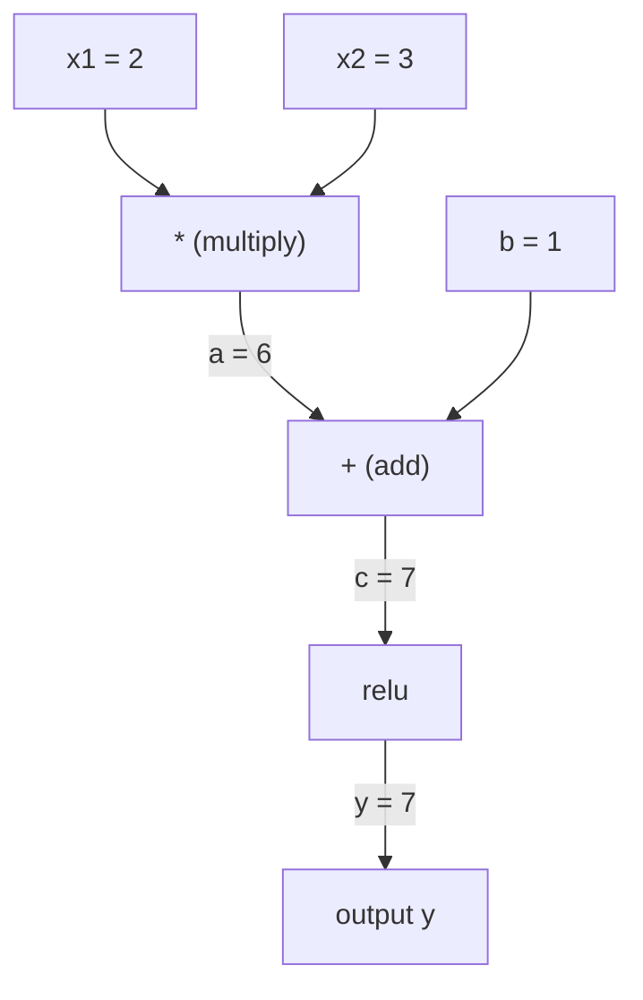
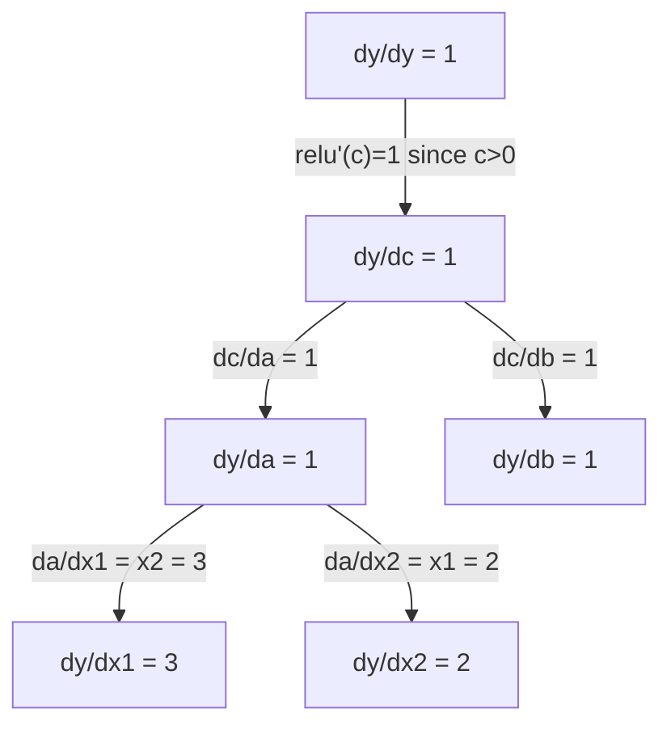

# 链式法则与自动微分

> 链式法则是每个学习型神经网络背后的引擎。

**类型：** 构建
**语言：** Python
**前置要求：** 阶段1，第04课（导数与梯度）
**时间：** 约90分钟

## 学习目标

- 构建一个最小的自动求导引擎（Value类），记录操作并通过反向模式自动微分计算梯度
- 使用拓扑排序实现计算图的前向和反向传播
- 仅使用从头编写的自动求导引擎构建并在XOR上训练一个多层感知机
- 使用数值有限差分进行梯度检查，验证自动微分的正确性

## 问题

你可以计算简单函数的导数。但神经网络并非简单函数。它是由数百个函数组合而成的：矩阵乘法、加偏置、应用激活函数、再次矩阵乘法、softmax、交叉熵损失。输出是函数的函数的函数。

要训练网络，你需要每个权重相对于损失函数的梯度。对于数百万个参数，手动计算是不可能的。数值方法（有限差分）又太慢。

链式法则提供了数学基础。自动微分提供了算法实现。二者结合，让你能够通过任意函数组合计算精确梯度，时间与单次前向传播成正比。

PyTorch、TensorFlow和JAX正是这样工作的。你将从头构建一个微型版本。

## 核心概念

### 链式法则

如果 `y = f(g(x))`，则 `y` 对 `x` 的导数为：

```
dy/dx = dy/dg * dg/dx = f'(g(x)) * g'(x)
```

沿链相乘各个导数。每个环节贡献其局部导数。

示例：`y = sin(x^2)`

```
g(x) = x^2       g'(x) = 2x
f(g) = sin(g)     f'(g) = cos(g)

dy/dx = cos(x^2) * 2x
```

对于更深层的复合，链式法则延伸为：

```
y = f(g(h(x)))

dy/dx = f'(g(h(x))) * g'(h(x)) * h'(x)
```

神经网络中的每一层都是这条链中的一个环节。

### 计算图

计算图将链式法则可视化。每个操作成为一个节点。数据沿图前向流动。梯度沿反向流动。

**前向传播（计算值）：**



**反向传播（计算梯度）：**



反向传播在每个节点应用链式法则，将梯度从输出传播到输入。

### 前向模式 vs 反向模式

通过计算图应用链式法则有两种方式。

**前向模式**从输入开始，向前传播导数。它计算`dx/dx = 1`并通过每个操作传播。适用于输入少、输出多的情况。

```
Forward mode: seed dx/dx = 1, propagate forward

  x = 2       (dx/dx = 1)
  a = x^2     (da/dx = 2x = 4)
  y = sin(a)  (dy/dx = cos(a) * da/dx = cos(4) * 4 = -2.615)
```

**反向模式**从输出开始，向后传播梯度。它计算`dy/dy = 1`并逆序通过每个操作传播。适用于输入多、输出少的情况。

```
Reverse mode: seed dy/dy = 1, propagate backward

  y = sin(a)  (dy/dy = 1)
  a = x^2     (dy/da = cos(a) = cos(4) = -0.654)
  x = 2       (dy/dx = dy/da * da/dx = -0.654 * 4 = -2.615)
```

神经网络有数百万个输入（权重）和一个输出（损失）。反向模式通过一次反向传播计算所有梯度。这就是反向传播使用反向模式的原因。

|  模式  |  种子  |  方向  |  最佳适用场景  |
|------|------|-----------|-----------|
|  前向  |  `dx_i/dx_i = 1`  |  输入到输出  |  输入少，输出多  |
|  反向  |  `dy/dy = 1`  |  输出到输入  |  输入多，输出少（神经网络）  |

### 用于前向模式的对偶对偶(Dual Numbers)

前向模式可以通过对偶对偶优雅地实现。对偶对偶具有形式`a + b*epsilon`，其中`epsilon^2 = 0`。

```
Dual number: (value, derivative)

(2, 1) means: value is 2, derivative w.r.t. x is 1

Arithmetic rules:
  (a, a') + (b, b') = (a+b, a'+b')
  (a, a') * (b, b') = (a*b, a'*b + a*b')
  sin(a, a')         = (sin(a), cos(a)*a')
```

将输入变量的导数种子设为1。导数自动通过每个操作传播。

### 构建自动求导引擎

自动求导引擎需要三样东西：

1. **值封装。** 将每个数字封装在一个对象中，该对象存储其值和梯度。
2. **图记录。** 每次操作记录其输入和局部梯度函数。
3. **反向传播。** 对图进行拓扑排序，然后逆序遍历，在每个节点应用链式法则。

这正是PyTorch的`autograd`所做的。`torch.Tensor`类封装值，在`requires_grad=True`时记录操作，并在调用`.backward()`时计算梯度。

### PyTorch自动求导的内部工作原理

当你编写PyTorch代码时：

```python
x = torch.tensor(2.0, requires_grad=True)
y = x ** 2 + 3 * x + 1
y.backward()
print(x.grad)  # 7.0 = 2*x + 3 = 2*2 + 3
```

PyTorch内部：

1. 为`x`创建一个`Tensor`节点，设`requires_grad=True`
2. 每个操作（`Tensor`、`x`、`requires_grad=True`）创建一个新节点并记录反向函数
3. `Tensor`通过记录的计算图触发反向模式自动微分
4. 每个节点的`Tensor`计算局部梯度并将其传递给父节点
5. 梯度通过加法（而非替换）累积到`Tensor`属性中

计算图是动态的（定义即运行）。每个前向传播都会构建一个新图。这就是PyTorch支持模型中控制流（if/else、循环）的原因。

```figure
chain-rule
```

## 动手构建

### 第1步：Value类

```python
class Value:
    def __init__(self, data, children=(), op=''):
        self.data = data
        self.grad = 0.0
        self._backward = lambda: None
        self._prev = set(children)
        self._op = op

    def __repr__(self):
        return f"Value(data={self.data:.4f}, grad={self.grad:.4f})"
```

每个`Value`存储其数值数据、梯度（初始为零）、反向函数以及指向产生它的子节点的指针。

### 第2步：带梯度追踪的算术运算

```python
    def __add__(self, other):
        other = other if isinstance(other, Value) else Value(other)
        out = Value(self.data + other.data, (self, other), '+')
        def _backward():
            self.grad += out.grad
            other.grad += out.grad
        out._backward = _backward
        return out

    def __mul__(self, other):
        other = other if isinstance(other, Value) else Value(other)
        out = Value(self.data * other.data, (self, other), '*')
        def _backward():
            self.grad += other.data * out.grad
            other.grad += self.data * out.grad
        out._backward = _backward
        return out

    def relu(self):
        out = Value(max(0, self.data), (self,), 'relu')
        def _backward():
            self.grad += (1.0 if out.data > 0 else 0.0) * out.grad
        out._backward = _backward
        return out
```

每个操作创建一个闭包，该闭包知道如何计算局部梯度并乘以上游梯度（`out.grad`）。`+=`处理一个值在多个操作中使用的情况。

### 第3步：反向传播

```python
    def backward(self):
        topo = []
        visited = set()
        def build_topo(v):
            if v not in visited:
                visited.add(v)
                for child in v._prev:
                    build_topo(child)
                topo.append(v)
        build_topo(self)

        self.grad = 1.0
        for v in reversed(topo):
            v._backward()
```

拓扑排序确保每个节点的梯度在传播到其子节点之前被完全计算。初始梯度为1.0（dy/dy = 1）。

### 第4步：为完整引擎添加更多操作

基础的Value类处理加法、乘法和ReLU。真正的自动微分引擎需要更多操作。以下是构建神经网络所需的操作：

```python
    def __neg__(self):
        return self * -1

    def __sub__(self, other):
        return self + (-other)

    def __radd__(self, other):
        return self + other

    def __rmul__(self, other):
        return self * other

    def __rsub__(self, other):
        return other + (-self)

    def __pow__(self, n):
        out = Value(self.data ** n, (self,), f'**{n}')
        def _backward():
            self.grad += n * (self.data ** (n - 1)) * out.grad
        out._backward = _backward
        return out

    def __truediv__(self, other):
        return self * (other ** -1) if isinstance(other, Value) else self * (Value(other) ** -1)

    def exp(self):
        import math
        e = math.exp(self.data)
        out = Value(e, (self,), 'exp')
        def _backward():
            self.grad += e * out.grad
        out._backward = _backward
        return out

    def log(self):
        import math
        out = Value(math.log(self.data), (self,), 'log')
        def _backward():
            self.grad += (1.0 / self.data) * out.grad
        out._backward = _backward
        return out

    def tanh(self):
        import math
        t = math.tanh(self.data)
        out = Value(t, (self,), 'tanh')
        def _backward():
            self.grad += (1 - t ** 2) * out.grad
        out._backward = _backward
        return out
```

**每个操作的重要性：**

|  操作  |  反向规则  |  用于  |
|-----------|--------------|---------|
|  `__sub__`  |  复用 add + neg  |  损失计算（预测值 - 目标值） |
|  `__pow__`  |  n * x^(n-1)  |  多项式激活函数，均方误差（误差^2） |
|  `__truediv__`  |  复用 mul + pow(-1)  |  归一化，学习率缩放 |
|  `exp`  |  exp(x) * upstream  |  Softmax，对数似然 |
|  `log`  |  (1/x) * upstream  |  交叉熵损失，对数概率 |
|  `tanh`  |  (1 - tanh^2) * upstream  |  经典激活函数 |

巧妙之处：`__sub__`和`__truediv__`是基于现有操作定义的。它们自动获得正确的梯度，因为链式法则通过底层的add/mul/pow操作进行组合。

### 第5步：从头构建迷你MLP

有了完整的Value类，你可以构建神经网络。不需要PyTorch，不需要NumPy。只需要Value和链式法则。

```python
import random

class Neuron:
    def __init__(self, n_inputs):
        self.w = [Value(random.uniform(-1, 1)) for _ in range(n_inputs)]
        self.b = Value(0.0)

    def __call__(self, x):
        act = sum((wi * xi for wi, xi in zip(self.w, x)), self.b)
        return act.tanh()

    def parameters(self):
        return self.w + [self.b]

class Layer:
    def __init__(self, n_inputs, n_outputs):
        self.neurons = [Neuron(n_inputs) for _ in range(n_outputs)]

    def __call__(self, x):
        return [n(x) for n in self.neurons]

    def parameters(self):
        return [p for n in self.neurons for p in n.parameters()]

class MLP:
    def __init__(self, sizes):
        self.layers = [Layer(sizes[i], sizes[i+1]) for i in range(len(sizes)-1)]

    def __call__(self, x):
        for layer in self.layers:
            x = layer(x)
        return x[0] if len(x) == 1 else x

    def parameters(self):
        return [p for layer in self.layers for p in layer.parameters()]
```

`Neuron`计算`tanh(w1*x1 + w2*x2 + ... + b)`。`Layer`是一个神经元列表。`MLP`堆叠层。每个权重都是一个`Value`，因此调用`loss.backward()`会将梯度传播到每个参数。

**在XOR上训练：**

```python
random.seed(42)
model = MLP([2, 4, 1])  # 2 inputs, 4 hidden neurons, 1 output

xs = [[0, 0], [0, 1], [1, 0], [1, 1]]
ys = [-1, 1, 1, -1]  # XOR pattern (using -1/1 for tanh)

for step in range(100):
    preds = [model(x) for x in xs]
    loss = sum((p - y) ** 2 for p, y in zip(preds, ys))

    for p in model.parameters():
        p.grad = 0.0
    loss.backward()

    lr = 0.05
    for p in model.parameters():
        p.data -= lr * p.grad

    if step % 20 == 0:
        print(f"step {step:3d}  loss = {loss.data:.4f}")

print("\nPredictions after training:")
for x, y in zip(xs, ys):
    print(f"  input={x}  target={y:2d}  pred={model(x).data:6.3f}")
```

这是micrograd。一个纯Python实现的完整神经网络训练循环，带有自动微分。每个商业深度学习框架都在大规模上做同样的事情。

### 第6步：梯度检查

如何知道你的自动微分是正确的？将其与数值导数进行比较。这就是梯度检查。

```python
def gradient_check(build_expr, x_val, h=1e-7):
    x = Value(x_val)
    y = build_expr(x)
    y.backward()
    autodiff_grad = x.grad

    y_plus = build_expr(Value(x_val + h)).data
    y_minus = build_expr(Value(x_val - h)).data
    numerical_grad = (y_plus - y_minus) / (2 * h)

    diff = abs(autodiff_grad - numerical_grad)
    return autodiff_grad, numerical_grad, diff
```

在一个复杂表达式上测试它：

```python
def expr(x):
    return (x ** 3 + x * 2 + 1).tanh()

ad, num, diff = gradient_check(expr, 0.5)
print(f"Autodiff:  {ad:.8f}")
print(f"Numerical: {num:.8f}")
print(f"Difference: {diff:.2e}")
# Difference should be < 1e-5
```

梯度检查在实现新操作时至关重要。如果你的反向传播存在错误，数值检查会捕捉到它。每个严肃的深度学习实现都会在开发过程中进行梯度检查。

**何时使用梯度检查：**

|  情景  |  是否进行梯度检查？  |
|-----------|-------------------|
|  向你的自动求导系统添加新操作  |  是，总是  |
|  调试训练循环不收敛  |  是，先检查梯度  |
|  生产环境训练  |  否，太慢（每个参数前向传递2次）  |
|  自动求导代码的单元测试  |  是，自动化它  |

### 第7步：与手动计算验证

```python
x1 = Value(2.0)
x2 = Value(3.0)
a = x1 * x2          # a = 6.0
b = a + Value(1.0)    # b = 7.0
y = b.relu()          # y = 7.0

y.backward()

print(f"y = {y.data}")          # 7.0
print(f"dy/dx1 = {x1.grad}")   # 3.0 (= x2)
print(f"dy/dx2 = {x2.grad}")   # 2.0 (= x1)
```

手动检查：`y = relu(x1*x2 + 1)`。由于`x1*x2 + 1 = 7 > 0`，relu是恒等函数。
`dy/dx1 = x2 = 3`。`dy/dx2 = x1 = 2`。引擎匹配。

## 使用它

### 与PyTorch验证

```python
import torch

x1 = torch.tensor(2.0, requires_grad=True)
x2 = torch.tensor(3.0, requires_grad=True)
a = x1 * x2
b = a + 1.0
y = torch.relu(b)
y.backward()

print(f"PyTorch dy/dx1 = {x1.grad.item()}")  # 3.0
print(f"PyTorch dy/dx2 = {x2.grad.item()}")  # 2.0
```

相同的梯度。你的引擎计算出与PyTorch相同的结果，因为数学原理相同：通过链式法则的反向模式自动微分。

### 更复杂的表达式

```python
a = Value(2.0)
b = Value(-3.0)
c = Value(10.0)
f = (a * b + c).relu()  # relu(2*(-3) + 10) = relu(4) = 4

f.backward()
print(f"df/da = {a.grad}")  # -3.0 (= b)
print(f"df/db = {b.grad}")  #  2.0 (= a)
print(f"df/dc = {c.grad}")  #  1.0
```

## 发布

本課(lesson)产出：
- `outputs/skill-autodiff.md` ——构建和调试自动求导系统的技能
- `outputs/skill-autodiff.md` ——一个可以扩展的最小自动求导引擎

这里构建的Value类是第3阶段神经网络训练循环的基础。

## 练习

1. 在Value类中添加`__pow__`，以便计算`x ** n`。验证在`x=2`处`d/dx(x^3)`等于`12.0`。

2. 添加`tanh`作为激活函数。验证`tanh'(0) = 1`和`tanh'(2) = 0.0707`（近似）。

3. 为单个神经元构建计算图：`y = relu(w1*x1 + w2*x2 + b)`。计算所有五个梯度，并与PyTorch验证。

4. 使用对偶数实现前向模式自动微分。创建一个`Dual`类，并验证其给出的导数与反向模式引擎相同。

## 关键术语

|  术语  |  人们的说法  |  实际含义  |
|------|----------------|----------------------|
| 链式法则 | "导数相乘" | 复合函数的导数等于每个函数局部导数的乘积，并在正确点处求值 |
| 计算图 | "网络图" | 一个有向无环图，节点为运算，边传递值（前向）或梯度（反向） |
| 前向模式 | "前向传播导数" | 从输入到输出传播导数的自动微分。每个输入变量一次前向传递。 |
| 反向模式 | "反向传播" | 从输出到输入传播梯度的自动微分。每个输出变量一次反向传递。 |
| 自动梯度 | "自动求梯度" | 记录值上的操作、构建图，并通过链式法则计算精确梯度的系统 |
| 对偶数 | "值加导数" | 形如 a + b*epsilon (epsilon^2 = 0) 的数，通过算术运算携带导数信息 |
| 拓扑排序 | "依赖顺序" | 对图节点排序，使每个节点出现在其所有依赖之后。正确的梯度传播需要。 |
| 梯度累积 | "相加而非替换" | 当一个值馈入多个运算时，其梯度等于所有传入梯度贡献之和 |
| 动态图 | "运行时定义" | 每次前向传播重新构建的计算图，允许模型内部使用Python控制流（PyTorch风格） |
| 梯度检查 | "数值验证" | 将自动微分梯度与数值有限差分梯度比较以验证正确性。调试必备。 |
| MLP | "多层感知器" | 具有一个或多个隐藏层神经元的神经网络。每个神经元计算加权和加偏置，然后应用激活函数。 |
| 神经元 | "加权和+激活" | 基本单元：输出 = 激活(w1*x1 + w2*x2 + ... + b)。权重和偏置是可学习参数。 |

## 延伸阅读

- [3Blue1Brown: Backpropagation calculus](https://www.youtube.com/watch?v=tIeHLnjs5U8) -- 神经网络中链式法则的可视化解释
- [3Blue1Brown: Backpropagation calculus](https://www.youtube.com/watch?v=tIeHLnjs5U8) -- 真实系统的工作方式
- [3Blue1Brown: Backpropagation calculus](https://www.youtube.com/watch?v=tIeHLnjs5U8) -- 全面的参考
