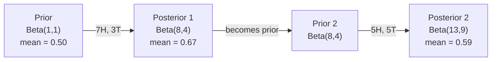

# 贝叶斯定理(Bayes' Theorem)

> 概率论是关于你预期什么。贝叶斯定理是关于你学到什么。

**类型：** 构建
**语言：** Python
**先决条件：** 阶段1，第06课（概率基础）
**时间：** ~75分钟

## 学习目标

- 应用贝叶斯定理从先验概率、似然和证据计算后验概率
- 从头构建一个带有拉普拉斯平滑和对数空间计算的朴素贝叶斯文本分类器
- 比较极大似然估计和最大后验估计，并解释最大后验估计如何对应于L2正则化
- 使用Beta-二项共轭先验实现A/B测试的序贯贝叶斯更新

## 问题

一项医学检测准确率为99%。你检测呈阳性。你实际患病的概率是多少？

大多数人说是99%。真正的答案取决于这种疾病的罕见程度。如果每10,000人中有1人患病，那么阳性结果只给你大约1%的患病概率。另外99%的阳性结果是来自健康人的假警报。

这不是一个技巧性问题。这就是贝叶斯定理。每个垃圾邮件过滤器、每个医学诊断、每个量化不确定性的机器学习模型都使用这个推理过程。你从一个信念开始。你看到证据。你更新。

如果你不理解这一点就构建机器学习系统，你会误解模型输出，设置糟糕的阈值，并发布过度自信的预测。

## 核心概念

### 从联合概率到贝叶斯

你已经从第06课知道条件概率是：

```
P(A|B) = P(A and B) / P(B)
```

并且对称地：

```
P(B|A) = P(A and B) / P(A)
```

两个表达式共享相同的分子：P(A和B)。将它们相等并重新排列：

```
P(A and B) = P(A|B) * P(B) = P(B|A) * P(A)

Therefore:

P(A|B) = P(B|A) * P(A) / P(B)
```

这就是贝叶斯定理。四个量，一个方程。

### 四个部分

|  部分  |  名称  |  含义  |
|------|------|---------------|
|  P(A\ | B)  |  后验概率  |  在看到证据B后你对A的更新信念  |
|  P(B | A)  |  似然  |  如果A为真，证据B的概率有多大  |
|  P(A)  |  先验  |  在看到任何证据之前你对A的信念  |
|  P(B)  |  证据  |  在所有可能性下看到B的总概率  |

证据项P(B)起到归一化作用。你可以使用全概率公式将其展开：

```
P(B) = P(B|A) * P(A) + P(B|not A) * P(not A)
```

### 医学检测示例

一种疾病影响每10,000人中的1人。检测的准确率为99%（能检测出99%的病人，假阳性率为1%）。

```
P(sick)          = 0.0001     (prior: disease is rare)
P(positive|sick) = 0.99       (likelihood: test catches it)
P(positive|healthy) = 0.01    (false positive rate)

P(positive) = P(positive|sick) * P(sick) + P(positive|healthy) * P(healthy)
            = 0.99 * 0.0001 + 0.01 * 0.9999
            = 0.000099 + 0.009999
            = 0.010098

P(sick|positive) = P(positive|sick) * P(sick) / P(positive)
                 = 0.99 * 0.0001 / 0.010098
                 = 0.0098
                 = 0.98%
```

小于1%。先验占主导地位。当某种情况罕见时，即使准确的检测也会产生大量假阳性。这就是医生要求做确认检测的原因。

### 垃圾邮件过滤器示例

你收到一封包含“彩票”一词的邮件。这是垃圾邮件吗？

```
P(spam)                = 0.3      (30% of email is spam)
P("lottery"|spam)      = 0.05     (5% of spam emails contain "lottery")
P("lottery"|not spam)  = 0.001    (0.1% of legitimate emails contain "lottery")

P("lottery") = 0.05 * 0.3 + 0.001 * 0.7
             = 0.015 + 0.0007
             = 0.0157

P(spam|"lottery") = 0.05 * 0.3 / 0.0157
                  = 0.955
                  = 95.5%
```

一个词就将概率从30%提升到95.5%。真正的垃圾邮件过滤器会同时对数百个词应用贝叶斯定理。

### 朴素贝叶斯：独立性假设

朴素贝叶斯通过假设所有特征在给定类别条件下条件独立，将其扩展到多个特征：

```
P(class | feature_1, feature_2, ..., feature_n)
  = P(class) * P(feature_1|class) * P(feature_2|class) * ... * P(feature_n|class)
    / P(feature_1, feature_2, ..., feature_n)
```

“朴素”之处在于独立性假设。在文本中，词的出现并非独立（“新”和“纽约”存在相关性）。但该假设在实践中效果出奇地好，因为分类器只需要对类别进行排序，而不需要生成校准的概率。

由于分母对所有类别相同，你可以跳过它，直接比较分子：

```
score(class) = P(class) * product of P(feature_i | class)
```

选择得分最高的类别。

### 最大似然估计(Maximum Likelihood Estimation, MLE)

如何从训练数据中得到P(特征|类别)？计数。

```
P("free"|spam) = (number of spam emails containing "free") / (total spam emails)
```

这就是MLE：选择使观测数据最可能的参数值。你正在最大化似然函数，对于离散计数，它简化为相对频率。

问题：如果某个词在训练期间的垃圾邮件中从未出现，MLE会赋予它零概率。一个未见过的词就会使整个乘积为零。通过拉普拉斯平滑(Laplace smoothing)解决：

```
P(word|class) = (count(word, class) + 1) / (total_words_in_class + vocabulary_size)
```

对每个计数加1确保没有概率为零。

### 最大后验估计(Maximum a Posteriori, MAP)

MLE问：什么参数最大化P(数据|参数)？

MAP问：什么参数最大化P(参数|数据)？

根据贝叶斯定理：

```
P(parameters|data) proportional to P(data|parameters) * P(parameters)
```

MAP在参数本身之上添加了一个先验。如果你认为参数应该很小，你可以将其编码为惩罚大值的先验。这在机器学习中与L2正则化相同。岭回归中的“岭”惩罚实际上就是权重上的高斯先验。

|  估计  |  优化  |  ML等价物  |
|------------|-----------|---------------|
|  MLE  |  P(数据\ | 参数)  |  无正则化训练  |
|  MAP  |  P(数据\ | 参数) * P(参数)  |  L2 / L1正则化  |

### 贝叶斯(Bayesian)与频率派(Frequentist)的实际区别

频率派将参数视为固定未知数。他们问：“如果我多次重复这个实验，会发生什么？”

贝叶斯学派将参数视为分布。他们问：“根据我所观察到的情况，我对参数有什么看法？”

对于构建机器学习系统，实际区别在于：

|  方面  |  频率学派  |  贝叶斯学派  |
|--------|-------------|----------|
|  输出  |  点估计  |  值的分布  |
|  不确定性  |  置信区间（关于过程）  |  可信区间（关于参数）  |
|  小数据  |  可能过拟合  |  先验作为正则化  |
|  计算  |  通常更快  |  通常需要采样（MCMC）  |

大多数生产环境中的机器学习是频率学派的（SGD、点估计）。当你需要校准的不确定性（医疗决策、安全关键系统）或数据稀缺时（少样本学习、冷启动），贝叶斯方法会大放异彩。

### 为什么贝叶斯思维对机器学习很重要

这种联系比类比更深层：

**先验是正则化。** 权重上的高斯先验是L2正则化。拉普拉斯先验是L1。每次添加正则化项时，你都在对预期的参数值做出贝叶斯陈述。

**后验是不确定性。** 一个预测概率值并不能告诉你模型对该估计有多自信。贝叶斯方法给你一个分布：“我认为垃圾邮件的概率在0.8到0.95之间。”

**贝叶斯更新是在线学习。** 今天的后验成为明天的先验。当模型看到新数据时，它会增量更新其信念，而不是从头重新训练。

**模型比较是贝叶斯式的。** 贝叶斯信息准则（BIC）、边际似然和贝叶斯因子都使用贝叶斯推理来选择模型，而不会过拟合。

```figure
bayes-update
```

## 动手构建

### 第一步：贝叶斯定理函数

```python
def bayes(prior, likelihood, false_positive_rate):
    evidence = likelihood * prior + false_positive_rate * (1 - prior)
    posterior = likelihood * prior / evidence
    return posterior

result = bayes(prior=0.0001, likelihood=0.99, false_positive_rate=0.01)
print(f"P(sick|positive) = {result:.4f}")
```

### 步骤 2：朴素贝叶斯分类器

```python
import math
from collections import defaultdict

class NaiveBayes:
    def __init__(self, smoothing=1.0):
        self.smoothing = smoothing
        self.class_counts = defaultdict(int)
        self.word_counts = defaultdict(lambda: defaultdict(int))
        self.class_word_totals = defaultdict(int)
        self.vocab = set()

    def train(self, documents, labels):
        for doc, label in zip(documents, labels):
            self.class_counts[label] += 1
            words = doc.lower().split()
            for word in words:
                self.word_counts[label][word] += 1
                self.class_word_totals[label] += 1
                self.vocab.add(word)

    def predict(self, document):
        words = document.lower().split()
        total_docs = sum(self.class_counts.values())
        vocab_size = len(self.vocab)
        best_class = None
        best_score = float("-inf")
        for cls in self.class_counts:
            score = math.log(self.class_counts[cls] / total_docs)
            for word in words:
                count = self.word_counts[cls].get(word, 0)
                total = self.class_word_totals[cls]
                score += math.log((count + self.smoothing) / (total + self.smoothing * vocab_size))
            if score > best_score:
                best_score = score
                best_class = cls
        return best_class
```

对数概率防止下溢。将许多小概率相乘会产生浮点数无法表示的极小数。对对数概率求和在数值上稳定且数学上等价。

### 步骤 3：在垃圾邮件数据上训练

```python
train_docs = [
    "win free money now",
    "free lottery ticket winner",
    "claim your prize today free",
    "urgent offer free cash",
    "congratulations you won free",
    "meeting tomorrow at noon",
    "project update attached",
    "can we schedule a call",
    "quarterly report review",
    "lunch on thursday sounds good",
    "team standup notes attached",
    "please review the pull request",
]

train_labels = [
    "spam", "spam", "spam", "spam", "spam",
    "ham", "ham", "ham", "ham", "ham", "ham", "ham",
]

classifier = NaiveBayes()
classifier.train(train_docs, train_labels)

test_messages = [
    "free money waiting for you",
    "meeting rescheduled to friday",
    "you won a free prize",
    "please review the attached report",
]

for msg in test_messages:
    print(f"  '{msg}' -> {classifier.predict(msg)}")
```

### 步骤 4：检查学习到的概率

```python
def show_top_words(classifier, cls, n=5):
    vocab_size = len(classifier.vocab)
    total = classifier.class_word_totals[cls]
    probs = {}
    for word in classifier.vocab:
        count = classifier.word_counts[cls].get(word, 0)
        probs[word] = (count + classifier.smoothing) / (total + classifier.smoothing * vocab_size)
    sorted_words = sorted(probs.items(), key=lambda x: x[1], reverse=True)
    for word, prob in sorted_words[:n]:
        print(f"    {word}: {prob:.4f}")

print("\nTop spam words:")
show_top_words(classifier, "spam")
print("\nTop ham words:")
show_top_words(classifier, "ham")
```

## 使用它

Scikit-learn 提供了生产就绪的朴素贝叶斯实现：

```python
from sklearn.feature_extraction.text import CountVectorizer
from sklearn.naive_bayes import MultinomialNB
from sklearn.metrics import classification_report

vectorizer = CountVectorizer()
X_train = vectorizer.fit_transform(train_docs)
clf = MultinomialNB()
clf.fit(X_train, train_labels)

X_test = vectorizer.transform(test_messages)
predictions = clf.predict(X_test)
for msg, pred in zip(test_messages, predictions):
    print(f"  '{msg}' -> {pred}")
```

相同的算法。CountVectorizer 处理分词和词汇表构建。MultinomialNB 内部处理平滑和对数概率。你从零开始的版本用 40 行代码完成了相同的事情。

## 发布

这里构建的 NaiveBayes 类展示了完整流程：分词、带拉普拉斯平滑的概率估计、对数空间预测。`code/bayes.py` 中的代码端到端运行，除 Python 标准库外无其他依赖。

### 共轭先验

当先验和后验属于同一分布族时，该先验称为“共轭”的。这使得贝叶斯更新在代数上简洁——无需数值积分即可得到闭合形式的后验。

|  似然  |  共轭先验  |  后验  |  示例  |
|-----------|----------------|-----------|---------|
|  伯努利  |  Beta(a, b)  |  Beta(a + 成功数, b + 失败数)  |  硬币抛掷偏差估计  |
|  正态（已知方差）  |  Normal(mu_0, sigma_0)  |  Normal(加权均值, 更小方差)  |  传感器校准  |
|  泊松  |  Gamma(a, b)  |  Gamma(a + 计数总和, b + n)  |  到达率建模  |
|  多项  |  Dirichlet(alpha)  |  Dirichlet(alpha + 计数)  |  主题模型、语言模型  |

为什么这很重要：没有共轭先验，你需要蒙特卡洛采样或变分推断来近似后验。有了共轭先验，你只需更新两个数值。

贝塔分布(Beta distribution)是实践中最常见的共轭先验。Beta(a, b)表示你关于某个概率参数的信念。均值是 a/(a+b)。a+b 越大，分布越集中（越有信心）。

Beta先验的特殊情况：
- Beta(1, 1) = 均匀分布。你对参数没有意见。
- Beta(10, 10) = 在0.5处尖峰。你强烈相信参数接近0.5。
- Beta(1, 10) = 向0偏斜。你相信参数很小。

更新规则非常简单：

```
Prior:     Beta(a, b)
Data:      s successes, f failures
Posterior: Beta(a + s, b + f)
```

无需积分。无需采样。只需加法。

### 顺序贝叶斯更新(Sequential Bayesian Updating)

贝叶斯推理(Bayesian inference)本质上是顺序的。今天的后验成为明天的先验。这就是现实系统在不重新处理所有历史数据的情况下增量学习的方式。

具体示例：估计一枚硬币是否公平。

**第1天：尚无数据。**
从Beta(1, 1)开始——一个均匀先验。你没有意见。
- 先验均值：0.5
- 先验在[0, 1]上平坦

**第2天：观察到7次正面，3次反面。**
后验 = Beta(1 + 7, 1 + 3) = Beta(8, 4)
- 后验均值：8/12 = 0.667
- 证据表明硬币偏向正面

**第3天：又观察到5次正面，5次反面。**
使用昨天的后验作为今天的先验。
后验 = Beta(8 + 5, 4 + 5) = Beta(13, 9)
- 后验均值：13/22 = 0.591
- 平衡的新数据将估计拉回0.5附近



观测顺序无关紧要。用所有12次正面和8次反面一次性更新Beta(1,1)得到Beta(13,9)——相同的结果。顺序更新和批量更新在数学上等价。但顺序更新让你可以在每一步做出决策，而无需存储原始数据。

这是在线学习在生产级ML系统中的基础。赌臂的汤普森采样、增量推荐系统和流式异常检测器都使用这种模式。

### 与A/B测试的联系

A/B测试本质上就是贝叶斯推断。

场景：你正在测试两种按钮颜色。变体A（蓝色）和变体B（绿色）。你想知道哪个获得更多的点击。

贝叶斯A/B测试：

1. **先验。** 两个变体都从Beta(1, 1)开始。没有先验偏好。
2. **数据。** 变体A：1000次展示中50次点击。变体B：1000次展示中65次点击。
3. **后验。**
   - A: Beta(1 + 50, 1 + 950) = Beta(51, 951)。均值 = 0.051
   - B: Beta(1 + 65, 1 + 935) = Beta(66, 936)。均值 = 0.066
4. **决策。** 计算P(B > A)——B的真实转化率高于A的概率。

解析计算P(B > A)很困难。但蒙特卡洛方法让它变得简单：

```
1. Draw 100,000 samples from Beta(51, 951)  -> samples_A
2. Draw 100,000 samples from Beta(66, 936)  -> samples_B
3. P(B > A) = fraction of samples where B > A
```

如果P(B > A) > 0.95，你发布变体B。如果在0.05到0.95之间，你继续收集数据。如果P(B > A) < 0.05，你发布变体A。

相对于频率派A/B测试的优势：
- 你得到直接的概率陈述：“B有97%的概率更好”
- 没有p值困惑。没有“无法拒绝零假设”的含糊其辞。
- 你可以随时检查结果，而不会增加假阳性率（没有“偷看问题”）
- 你可以融入先验知识（例如，之前的测试表明转化率通常在3-8%）

|  方面  |  频率派A/B  |  贝叶斯A/B  |
|--------|----------------|--------------|
|  输出  |  p值  |  P(B > A)  |
|  解释  |  “如果A=B，这数据有多令人惊讶？”  |  “B比A好的可能性有多大？”  |
|  提前停止  |  增加假阳性  |  任何时刻都安全（给定选择良好的先验和正确指定的模型）  |
|  先验知识  |  未使用  |  编码为Beta先验  |
| 决策规则 | p < 0.05 | P(B > A) > 阈值 |

## 练习

1. **多次测试。** 一名患者在两次独立测试中均呈阳性（两次测试准确率均为99%，疾病患病率为万分之一）。两次测试后P(sick)是多少？将第一次测试的后验概率作为第二次的先验概率。

2. **平滑影响。** 使用平滑值0.01、0.1、1.0和10.0运行垃圾邮件分类器。顶部单词概率如何变化？当smoothing=0且一个词仅出现在正常邮件中时会发生什么？

3. **添加特征。** 扩展朴素贝叶斯类，除了词频外，还使用消息长度（短/长）作为特征。从训练数据中估计P(short|spam)和P(short|ham)，并将其整合到预测分数中。

4. **手动计算最大后验估计。** 给定观测数据（10次抛硬币中有7次正面），使用Beta(2,2)先验计算偏差的最大后验估计。将其与最大似然估计（7/10）进行比较。

## 关键术语

|  术语  |  人们的说法  |  实际含义  |
|------|----------------|----------------------|
| 先验 | "我的初始猜测" | 观察证据之前的P(hypothesis)。在机器学习中：正则化项。 |
| 似然 | "数据拟合得多好" | P(evidence\ | hypothesis)。在特定假设下观测数据的概率。 |
| 后验 | "我更新后的信念" | P(hypothesis\ | evidence)。先验乘以似然，然后归一化。 |
| 证据 | "归一化常数" | 所有假设下的P(data)。确保后验之和为1。 |
| 朴素贝叶斯 | "那个简单的文本分类器" | 一种假设特征在给定类别下独立的分类器。尽管假设不成立，但仍表现良好。 |
| 拉普拉斯平滑 | "加一平滑" | 为每个特征添加一个小计数，以防止未出现数据的零概率。 |
| 最大似然估计 | "直接使用频率" | 选择使P(data\ | parameters)最大化的参数。无先验。在小数据上可能过拟合。 |
| 最大后验估计 | "带先验的最大似然估计" | 选择使P(data\ | parameters)*P(parameters)最大化的参数。等价于正则化的最大似然估计。 |
| 对数概率 | "在对数空间中工作" | 使用log(P)代替P，以避免乘多个小数时浮点数下溢。 |
| 假阳性 | "错误警报" | 测试结果为阳性，但真实状态为阴性。导致基础概率谬误。 |

## 延伸阅读

- [3Blue1Brown: Bayes' theorem](https://www.youtube.com/watch?v=HZGCoVF3YvM) - visual explanation with the medical test example
- [3Blue1Brown: Bayes' theorem](https://www.youtube.com/watch?v=HZGCoVF3YvM) - naive Bayes and its connection to discriminative models
- [3Blue1Brown: Bayes' theorem](https://www.youtube.com/watch?v=HZGCoVF3YvM) - free book, Bayesian statistics with Python code
- [3Blue1Brown: Bayes' theorem](https://www.youtube.com/watch?v=HZGCoVF3YvM) - production implementations and when to use each variant
