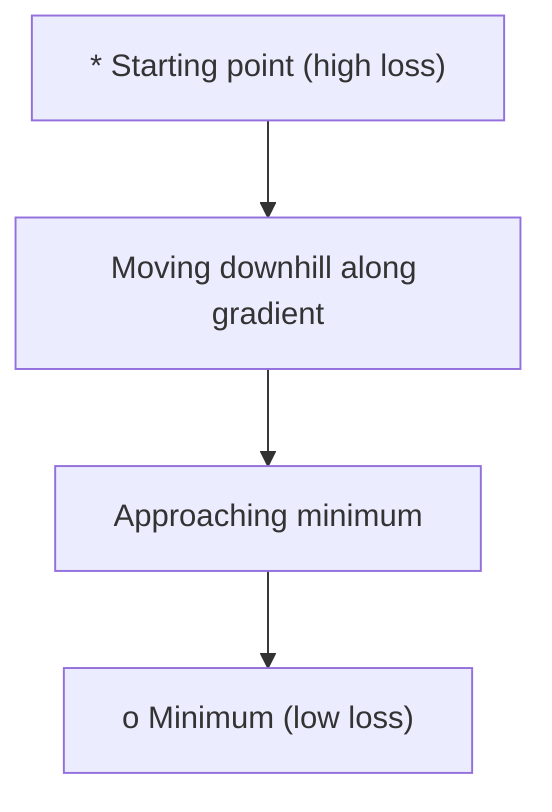
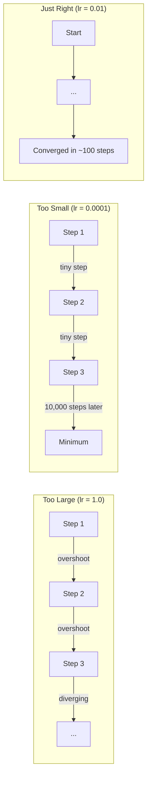
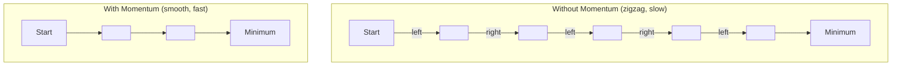
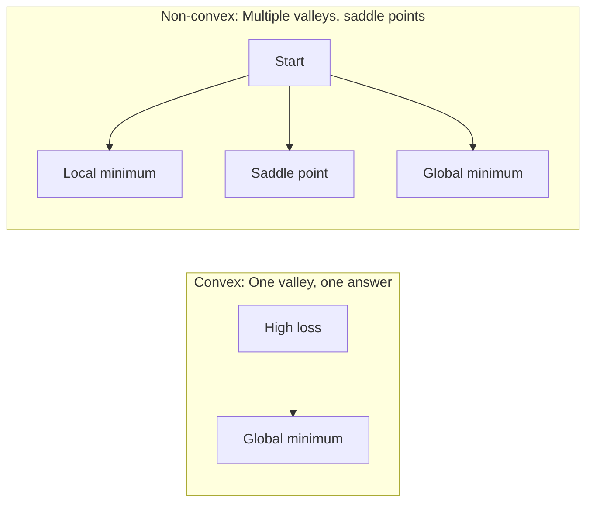
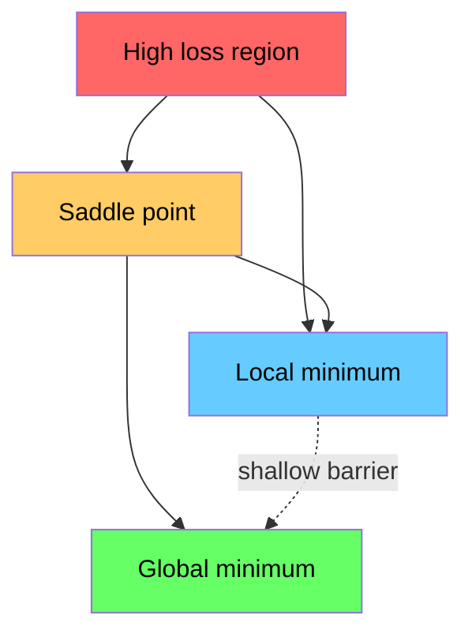

# 优化(Optimization)

> 训练神经网络不过是在寻找一个山谷的底部。

**类型：** 构建
**语言：** Python
**前置条件：** 阶段1，第04-05课（导数(Derivative)、梯度(Gradient)）
**时间：** ~75分钟

## 学习目标

- 从头实现朴素梯度下降、带动量的SGD和Adam
- 比较优化器在Rosenbrock函数上的收敛情况，并解释Adam为何能自适应每个权重的学习率
- 区分凸损失平面(Convex Loss Landscape)与非凸损失平面(Non-Convex Loss Landscape)，并解释鞍点(Saddle Point)在高维空间中的作用
- 配置学习率调度策略（步衰减(Step Decay)、余弦退火(Cosine Annealing)、预热(Warmup)）以稳定训练

## 问题

你有一个损失函数(Loss Function)，它告诉你模型有多错误。你有梯度(Gradient)，它们告诉你哪个方向会使损失更大。现在你需要一个下山的策略。

朴素的方法很简单：沿着梯度的反方向移动。用某个称为学习率(Learning Rate)的数值缩放步长。重复。这就是梯度下降(Gradient Descent)，它有效。但“有效”是有条件的。学习率太大，你会直接越过山谷，在墙壁之间来回反弹；太小，你会像爬行一样经过数千个不必要的步骤才到达答案。碰到鞍点(Saddle Point)，你会停止移动，即使你还没有找到最小值。

深度学习中的每一个优化器(Optimizer)都在回答同一个问题：如何更快、更可靠地到达山谷底部？

## 核心概念

### 优化(Optimization)的含义

优化(Optimization)就是找到最小化（或最大化）函数的输入值。在机器学习中，函数是损失(Loss)，输入是模型的权重(Weight)。训练就是优化(Optimization)。

```
minimize L(w) where:
  L = loss function
  w = model weights (could be millions of parameters)
```

### 梯度下降(Gradient Descent)（朴素版）

最简单的优化器(Optimizer)。计算损失相对于每个权重的梯度(Gradient)。将每个权重沿其梯度的反方向移动。用学习率(Learning Rate)缩放步长。

```
w = w - lr * gradient
```

这就是整个算法。一行。



### 学习率(Learning Rate)：最重要的超参数(Hyperparameter)

学习率(Learning Rate)控制步长。它决定收敛的一切。



没有公式可以算出正确的学习率。你通过实验找到它。常见的起点：Adam用0.001，带动量的SGD用0.01。

### 随机梯度下降(SGD) vs 批梯度下降 vs 小批量梯度下降

普通梯度下降(vanilla gradient descent)在迈出一步之前计算整个数据集上的梯度。这被称为批量梯度下降(batch gradient descent)。它稳定但缓慢。

随机梯度下降(SGD)在单个随机样本上计算梯度并立即更新。它带有噪声但速度很快。

小批量梯度下降(Mini-batch gradient descent)在两者之间取得平衡。在一个小批量（32、64、128、256个样本）上计算梯度，然后更新。这是实际中每个人都在使用的方法。

|  变体  |  批量大小  |  梯度质量  |  每步速度  |  噪声  |
|---------|-----------|-----------------|---------------|-------|
|  批量梯度下降  |  整个数据集  |  精确  |  慢  |  无  |
|  SGD  |  1个样本  |  噪声很大  |  快  |  高  |
|  小批量  |  32-256  |  估计良好  |  平衡  |  中等  |

SGD和小批量中的噪声并不是一个缺陷。它有助于逃离浅的局部极小值和鞍点。

### 动量(Momentum)：球滚下山坡

普通梯度下降只关注当前的梯度。如果梯度呈锯齿状（在狭窄山谷中常见），进展会很慢。动量通过将过去梯度累积到速度项中来解决此问题。

```
v = beta * v + gradient
w = w - lr * v
```

类比：一个球滚下山坡。它不会在每个凸起处停下并重新开始。它在一致的方向上积累速度，并抑制振荡。



`beta` (通常为 0.9) 控制保留多少历史信息。beta 越大意味着动量越大，路径越平滑，但对方向变化的响应越慢。

### Adam：自适应学习率

不同的权重需要不同的学习率。很少获得大梯度的权重在最终获得大梯度时应该迈出更大的步长。而不断获得巨大梯度的权重应该迈出更小的步长。

Adam（自适应矩估计）对每个权重跟踪两件事：

1. 一阶矩（m）：梯度的运行平均值（类似动量）
2. 二阶矩（v）：梯度平方的运行平均值（梯度幅度）

```
m = beta1 * m + (1 - beta1) * gradient
v = beta2 * v + (1 - beta2) * gradient^2

m_hat = m / (1 - beta1^t)    bias correction
v_hat = v / (1 - beta2^t)    bias correction

w = w - lr * m_hat / (sqrt(v_hat) + epsilon)
```

除以`sqrt(v_hat)`是关键思想。梯度大的权重除以大数（有效步长小），梯度小的权重除以小数（有效步长大）。每个权重都有自己的自适应学习率。

默认超参数：`lr=0.001, beta1=0.9, beta2=0.999, epsilon=1e-8`。这些默认值对大多数问题都适用。

### 学习率调度

固定学习率是一种折中。训练早期，需要大步长快速推进；训练后期，需要小步长在最小值附近精细调整。

常见调度策略：

|  调度策略  |  公式  |  使用场景  |
|----------|---------|----------|
|  阶梯衰减  |  每N个epoch lr = lr * factor  |  简单，手动控制  |
|  指数衰减  |  lr = lr_0 * decay^t  |  平滑衰减  |
|  余弦退火  |  lr = lr_min + 0.5 * (lr_max - lr_min) * (1 + cos(pi * t / T))  |   transformers，现代训练  |
|  预热+衰减  |  线性上升，然后衰减  |  大型模型，防止早期不稳定  |

### 凸函数 vs 非凸函数

凸函数只有一个最小值，梯度下降总能找到它。像`f(x) = x^2`这样的二次函数是凸函数。

神经网络损失函数是非凸的，有多个局部最小值、鞍点和平坦区域。



在实践中，高维神经网络中的局部极小值(Local Minima)很少成为问题。大多数局部极小值的损失值接近全局最小值。鞍点(Saddle Points)（在某些方向平坦，在其他方向弯曲）才是真正的障碍。动量和来自小批量(Mini-batch)的噪声有助于逃离它们。

### 损失景观可视化(Loss Landscape Visualization)

损失是所有权重的函数。对于具有100万个权重的模型，损失景观存在于1,000,001维空间中。我们通过选取权重空间中的两个随机方向并绘制沿这些方向的损失来可视化它，从而生成一个2D表面。



尖锐极小值(Sharp Minima)泛化能力差。平坦极小值(Flat Minima)泛化能力强。这是带动量的随机梯度下降(SGD with Momentum)在最终测试准确率上经常优于Adam的一个原因：其噪声阻止了陷入尖锐极小值。

```figure
gradient-descent
```

## 动手构建

### 步骤1：定义测试函数

Rosenbrock函数是一个经典的优化基准。其最小值位于(1, 1)处，在一个狭窄弯曲的山谷中，容易找到但难以追踪。

```
f(x, y) = (1 - x)^2 + 100 * (y - x^2)^2
```

```python
def rosenbrock(params):
    x, y = params
    return (1 - x) ** 2 + 100 * (y - x ** 2) ** 2

def rosenbrock_gradient(params):
    x, y = params
    df_dx = -2 * (1 - x) + 200 * (y - x ** 2) * (-2 * x)
    df_dy = 200 * (y - x ** 2)
    return [df_dx, df_dy]
```

### 步骤2：朴素梯度下降(Vanilla Gradient Descent)

```python
class GradientDescent:
    def __init__(self, lr=0.001):
        self.lr = lr

    def step(self, params, grads):
        return [p - self.lr * g for p, g in zip(params, grads)]
```

### 步骤3：带动量的随机梯度下降(SGD with Momentum)

```python
class SGDMomentum:
    def __init__(self, lr=0.001, momentum=0.9):
        self.lr = lr
        self.momentum = momentum
        self.velocity = None

    def step(self, params, grads):
        if self.velocity is None:
            self.velocity = [0.0] * len(params)
        self.velocity = [
            self.momentum * v + g
            for v, g in zip(self.velocity, grads)
        ]
        return [p - self.lr * v for p, v in zip(params, self.velocity)]
```

### 步骤4：Adam

```python
class Adam:
    def __init__(self, lr=0.001, beta1=0.9, beta2=0.999, epsilon=1e-8):
        self.lr = lr
        self.beta1 = beta1
        self.beta2 = beta2
        self.epsilon = epsilon
        self.m = None
        self.v = None
        self.t = 0

    def step(self, params, grads):
        if self.m is None:
            self.m = [0.0] * len(params)
            self.v = [0.0] * len(params)

        self.t += 1

        self.m = [
            self.beta1 * m + (1 - self.beta1) * g
            for m, g in zip(self.m, grads)
        ]
        self.v = [
            self.beta2 * v + (1 - self.beta2) * g ** 2
            for v, g in zip(self.v, grads)
        ]

        m_hat = [m / (1 - self.beta1 ** self.t) for m in self.m]
        v_hat = [v / (1 - self.beta2 ** self.t) for v in self.v]

        return [
            p - self.lr * mh / (vh ** 0.5 + self.epsilon)
            for p, mh, vh in zip(params, m_hat, v_hat)
        ]
```

### 步骤5：运行并比较

```python
def optimize(optimizer, func, grad_func, start, steps=5000):
    params = list(start)
    history = [params[:]]
    for _ in range(steps):
        grads = grad_func(params)
        params = optimizer.step(params, grads)
        history.append(params[:])
    return history

start = [-1.0, 1.0]

gd_history = optimize(GradientDescent(lr=0.0005), rosenbrock, rosenbrock_gradient, start)
sgd_history = optimize(SGDMomentum(lr=0.0001, momentum=0.9), rosenbrock, rosenbrock_gradient, start)
adam_history = optimize(Adam(lr=0.01), rosenbrock, rosenbrock_gradient, start)

for name, history in [("GD", gd_history), ("SGD+M", sgd_history), ("Adam", adam_history)]:
    final = history[-1]
    loss = rosenbrock(final)
    print(f"{name:6s} -> x={final[0]:.6f}, y={final[1]:.6f}, loss={loss:.8f}")
```

预期输出：Adam收敛最快。带动量的随机梯度下降沿更平滑的路径前进。朴素梯度下降沿狭窄山谷进展缓慢。

## 使用它

在实践中，使用PyTorch或JAX优化器。它们处理参数组(Parameter Groups)、权重衰减(Weight Decay)、梯度裁剪(Gradient Clipping)和GPU加速。

```python
import torch

model = torch.nn.Linear(784, 10)

sgd = torch.optim.SGD(model.parameters(), lr=0.01, momentum=0.9)
adam = torch.optim.Adam(model.parameters(), lr=0.001)
adamw = torch.optim.AdamW(model.parameters(), lr=0.001, weight_decay=0.01)

scheduler = torch.optim.lr_scheduler.CosineAnnealingLR(adam, T_max=100)
```

经验法则：

- 从Adam（学习率lr=0.001）开始。它在大多数问题上无需调参即可工作。
- 当你需要最佳最终准确率且可以投入更多调参时，切换到带动量的随机梯度下降（学习率lr=0.01，动量momentum=0.9）。
- 对于Transformer，使用AdamW（解耦权重衰减的Adam）。
- 对于超过几个周期的训练，始终使用学习率调度(Learning Rate Schedule)。
- 如果训练不稳定，降低学习率。如果训练太慢，增加学习率。

## 发布

本节课提供了一个选择正确优化器的提示。参见`outputs/prompt-optimizer-guide.md`。

这里构建的优化器类将在第三阶段从头训练神经网络时再次出现。

## 练习

1. **学习率扫描。** 分别在[0.0001, 0.0005, 0.001, 0.005, 0.01]学习率下对Rosenbrock函数运行普通梯度下降。每个学习率运行5000步后，绘制或打印最终损失。找出仍然收敛的最大学习率。

2. **动量比较。** 分别在[0.0, 0.5, 0.9, 0.99]动量值下对Rosenbrock函数运行SGD。记录每一步的损失。哪个动量值收敛最快？哪个出现过冲？

3. **鞍点逃逸。** 定义函数`f(x, y) = x^2 - y^2`（原点处有一个鞍点）。从(0.01, 0.01)开始。比较普通梯度下降、带动量的SGD和Adam的表现。哪个能够逃离鞍点？

4. **实现学习率衰减。** 给GradientDescent类添加指数衰减调度：`lr = lr_0 * 0.999^step`。在Rosenbrock函数上比较有无衰减的收敛情况。

## 关键术语

|  术语  |  人们的说法  |  实际含义  |
|------|----------------|----------------------|
|  梯度下降  |  "下山"  |  通过减去梯度乘以学习率来更新权重。最基本的优化器。 |
|  学习率  |  "步长"  |  控制每次更新移动权重幅度的标量。太大导致发散，太小浪费计算。 |
|  动量  |  "持续滚动"  |  将过去的梯度累积成速度向量。抑制振荡，加速沿一致方向移动。 |
|  SGD  |  "随机采样"  |  随机梯度下降。在随机子集而不是整个数据集上计算梯度。实践中几乎总是指小批量SGD。 |
|  小批量  |  "一块数据"  |  用于估计梯度的一小部分训练数据（32-256个样本）。平衡速度和梯度准确性。 |
|  Adam  |  "默认优化器"  |  自适应矩估计。跟踪每个权重的梯度及其平方的运行平均值，为每个权重赋予自己的学习率。 |
|  偏差修正  |  "修复冷启动"  |  Adam的第一和第二矩初始化为零。偏差修正通过除以(1 - beta^t)来补偿早期步骤。 |
|  学习率调度  |  "随时间改变学习率"  |  在训练过程中调整学习率的函数。早期大步，后期小步。 |
|  凸函数  |  "单一谷底"  |  局部最小值就是全局最小值的函数。梯度下降总能找到它。神经网络损失不是凸函数。 |
|  鞍点  |  "平坦但不是最小值"  |  梯度为零但某些方向是最小值、某些方向是最大值的点。在高维中很常见。 |
| 损失景观（Loss landscape）  |  "地形"  |  在权重空间上绘制的损失函数。通过沿两个随机方向切片进行可视化。 |
| 收敛（Convergence）  |  "抵达"  |  优化器已达到进一步步长不会显著减少损失的点。 |

## 延伸阅读

- [Sebastian Ruder: An overview of gradient descent optimization algorithms](https://ruder.io/optimizing-gradient-descent/) - 所有主要优化器的综合调查
- [Sebastian Ruder: An overview of gradient descent optimization algorithms](https://ruder.io/optimizing-gradient-descent/) - 动量动力学的交互式可视化
- [Sebastian Ruder: An overview of gradient descent optimization algorithms](https://ruder.io/optimizing-gradient-descent/) - 原始Adam论文，可读且简短
- [Sebastian Ruder: An overview of gradient descent optimization algorithms](https://ruder.io/optimizing-gradient-descent/) - 展示尖锐与平坦最小值的论文
