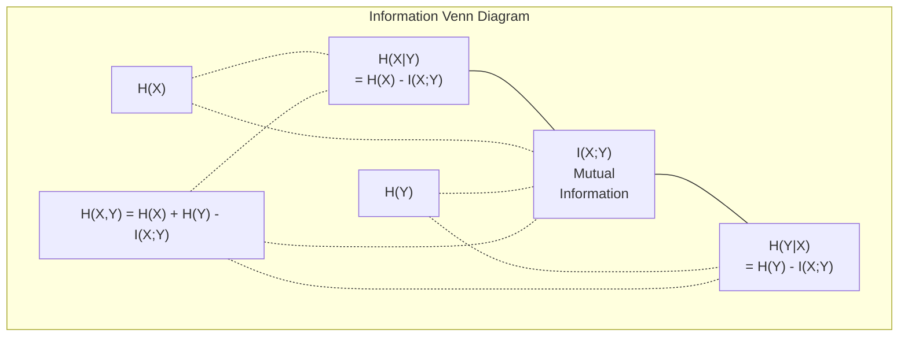

# 信息论

> 信息论衡量惊奇度。损失函数正是基于此建立的。

**类型：** 学习
**语言：** Python
**前置要求：** 第一阶段，第06课（概率论）
**时间：** ~60分钟

## 学习目标

- 从零实现熵、交叉熵和KL散度，并解释它们之间的关系
- 推导为什么最小化交叉熵损失等价于最大化对数似然
- 计算特征与目标之间的互信息，用于特征重要性排序
- 解释困惑度，即语言模型选择的有效词汇量

## 问题

你在每个分类模型训练中都会调用`CrossEntropyLoss()`。你在每篇语言模型论文中都会看到“困惑度”。你在VAE、蒸馏和RLHF中读到KL散度。这些并非互不相关的概念。它们是同一个思想，只是以不同的面貌出现。

信息论为你提供了推理不确定性、压缩和预测的语言。克劳德·香农在1948年为了解决通信问题而发明了它。事实证明，训练神经网络就是一个通信问题：模型试图通过一个由学习到的权重构成的噪声信道来传输正确的标签。

本节课将从零构建每一个公式，让你看到它们从何而来以及为何有效。

## 核心概念

### 信息量（惊奇度）

当不太可能的事情发生时，它携带了更多的信息。一枚硬币正面朝上？并不令人惊讶。中了彩票？非常令人惊讶。

概率为p的事件的信息量为：

```
I(x) = -log(p(x))
```

使用以2为底的对数得到比特。使用自然对数得到奈特。同一个概念，不同单位。

```
Event              Probability    Surprise (bits)
Fair coin heads    0.5            1.0
Rolling a 6        0.167          2.58
1-in-1000 event    0.001          9.97
Certain event      1.0            0.0
```

确定的事件携带的信息量为零。你早已知道它们会发生。

### 熵（平均惊奇度）

熵是分布所有可能结果上的期望惊奇度。

```
H(P) = -sum( p(x) * log(p(x)) )  for all x
```

对于二元变量，公平硬币的熵最大：1比特。有偏硬币（99%正面）的熵很低：0.08比特。你早已知道会发生什么，因此每次投掷几乎不告诉你任何信息。

```
Fair coin:    H = -(0.5 * log2(0.5) + 0.5 * log2(0.5)) = 1.0 bit
Biased coin:  H = -(0.99 * log2(0.99) + 0.01 * log2(0.01)) = 0.08 bits
```

熵(Entropy)衡量分布中不可归约的不确定性。你无法压缩到低于它。

### 交叉熵(Cross-Entropy)（你每天使用的损失函数）

交叉熵衡量当你使用分布Q来编码实际来自分布P的事件时的平均惊讶度。

```
H(P, Q) = -sum( p(x) * log(q(x)) )  for all x
```

P是真实分布（标签）。Q是你的模型预测。如果Q与P完美匹配，交叉熵等于熵。任何不匹配都会使其变大。

在分类中，P是独热向量(one-hot vector)（真实类别概率为1，其他为0）。这简化了交叉熵为：

```
H(P, Q) = -log(q(true_class))
```

这就是分类中完整的交叉熵损失公式。最大化正确类别的预测概率。

### KL散度(KL Divergence)（分布之间的距离）

KL散度衡量使用Q代替P所获得的额外惊讶度。

```
D_KL(P || Q) = sum( p(x) * log(p(x) / q(x)) )  for all x
             = H(P, Q) - H(P)
```

交叉熵是熵加上KL散度。由于训练过程中真实分布的熵是常数，最小化交叉熵等同于最小化KL散度。你在将模型分布推向真实分布。

KL散度不是对称的：D_KL(P || Q) != D_KL(Q || P)。它不是真正的距离度量。

### 互信息(Mutual Information)

互信息衡量知道一个变量能告诉你多少关于另一个变量的信息。

```
I(X; Y) = H(X) - H(X|Y)
        = H(X) + H(Y) - H(X, Y)
```

如果X和Y独立，互信息为零。知道一个不会告诉你另一个的任何信息。如果它们完全相关，互信息等于任一变量的熵。

在特征选择中，特征与目标之间的高互信息意味着该特征有用。低互信息意味着它是噪音。

### 条件熵(Conditional Entropy)

H(Y|X) 衡量的是在观察到 X 之后，关于 Y 仍然存在多少不确定性。

```
H(Y|X) = H(X,Y) - H(X)
```

两种极端情况：
- 如果 X 完全决定了 Y，那么 H(Y|X) = 0。知道 X 就消除了关于 Y 的所有不确定性。例如：X = 摄氏温度，Y = 华氏温度。
- 如果 X 没有告诉你关于 Y 的任何信息，那么 H(Y|X) = H(Y)。知道 X 并没有减少你的不确定性。例如：X = 抛硬币，Y = 明天的天气。

条件熵总是非负的，且不超过 H(Y)：

```
0 <= H(Y|X) <= H(Y)
```

在机器学习中，条件熵出现在决策树中。在每个分裂点上，算法会选择使 H(Y|X) 最小的特征 X——即能够最大程度消除关于标签 Y 的不确定性的特征。

### 联合熵(Joint Entropy)

H(X,Y) 是 X 和 Y 联合分布的熵。

```
H(X,Y) = -sum sum p(x,y) * log(p(x,y))   for all x, y
```

关键性质：

```
H(X,Y) <= H(X) + H(Y)
```

当 X 和 Y 独立时等号成立。如果它们共享信息，联合熵小于各自熵之和。"缺失"的熵正是互信息(Mutual Information)。



关系式：
- H(X,Y) = H(X) + H(Y|X) = H(Y) + H(X|Y)
- I(X;Y) = H(X) - H(X|Y) = H(Y) - H(Y|X)
- H(X,Y) = H(X) + H(Y) - I(X;Y)

### 互信息(Mutual Information，深入探讨)

互信息 I(X;Y) 量化了知道一个变量能在多大程度上减少对另一个变量的不确定性。

```
I(X;Y) = H(X) - H(X|Y)
       = H(Y) - H(Y|X)
       = H(X) + H(Y) - H(X,Y)
       = sum sum p(x,y) * log(p(x,y) / (p(x) * p(y)))
```

性质：
- I(X;Y) >= 0 总是成立。观察某些东西永远不会丢失信息。
- I(X;Y) = 0 当且仅当 X 和 Y 独立。
- I(X;Y) = I(Y;X)。它是对称的，不同于 KL 散度。
- I(X;X) = H(X)。变量与其自身共享全部信息。

**特征选择的互信息。** 在机器学习中，你希望特征对目标具有信息量。互信息(Mutual information)提供了一种基于原理的特征排序方法：

1. 对于每个特征 X_i，计算 I(X_i; Y)，其中 Y 是目标变量。
2. 按互信息得分对特征排序。
3. 保留前 k 个特征。

这对于特征与目标之间的任何关系都有效——线性、非线性、单调或非单调。相关性(Correlation)只能捕捉线性关系。互信息捕捉所有关系。

|  方法  |  检测  |  计算成本  |  处理分类型？  |
|--------|---------|-------------------|---------------------|
|  皮尔逊相关系数  |  线性关系  |  O(n)  |  否  |
|  斯皮尔曼相关系数  |  单调关系  |  O(n log n)  |  否  |
|  互信息  |  任意统计依赖关系  |  O(n log n)（分箱）  |  是  |

### 标签平滑(Label Smoothing)与交叉熵(Cross-Entropy)

标准分类使用硬目标： [0, 0, 1, 0]。真实类别概率为1，其他为0。标签平滑将其替换为软目标：

```
soft_target = (1 - epsilon) * hard_target + epsilon / num_classes
```

令 epsilon = 0.1，4个类别：
- 硬目标：  [0, 0, 1, 0]
- 软目标：  [0.025, 0.025, 0.925, 0.025]

从信息论角度看，标签平滑增加了目标分布的熵。硬独热(one-hot)目标的熵为0——没有不确定性。软目标具有正熵。

这样做的好处：
- 防止模型将logits驱动到极端值（在交叉熵下，需要无限logits才能完美匹配独热目标）
- 起到正则化作用：模型不能100%确信
- 改善校准：预测概率更好地反映真实不确定性
- 缩小训练与推理行为之间的差距

带标签平滑的交叉熵损失变为：

```
L = (1 - epsilon) * CE(hard_target, prediction) + epsilon * H_uniform(prediction)
```

第二项惩罚那些远离均匀分布的预测——这是对置信度的直接正则化。

### 为什么交叉熵(Cross-Entropy)是分类损失函数

三个视角，同一个结论。

**信息论视角。** 交叉熵衡量的是，使用模型分布代替真实分布时浪费了多少比特。最小化交叉熵使你的模型成为现实最有效的编码器。

**最大似然视角。** 对于N个训练样本，其真实类别为y_i：

```
Likelihood     = product( q(y_i) )
Log-likelihood = sum( log(q(y_i)) )
Negative log-likelihood = -sum( log(q(y_i)) )
```

最后一行就是交叉熵损失。最小化交叉熵 = 在模型下最大化训练数据的似然。

**梯度视角。** 交叉熵关于logits的梯度就是 (predicted - true)。简洁、稳定且计算快速。这就是为什么它与softmax完美搭配。

### 比特 vs 奈特

唯一的区别在于对数的底数。

```
log base 2   -> bits      (information theory tradition)
log base e   -> nats      (machine learning convention)
log base 10  -> hartleys  (rarely used)
```

1 nat = 1/ln(2) bits = 1.4427 bits。PyTorch和TensorFlow默认使用自然对数（nats）。

### 困惑度（Perplexity）

困惑度(Perplexity)是交叉熵的指数。它告诉你模型在多少个等可能的选项中感到不确定的有效数量。

```
Perplexity = 2^H(P,Q)   (if using bits)
Perplexity = e^H(P,Q)   (if using nats)
```

一个困惑度为50的语言模型，平均而言，就像它必须从50个可能的下一词元中均匀选择一样困惑。越低越好。

GPT-2在常见基准上达到了约30的困惑度。现代模型在代表性良好的领域上达到了个位数。

```figure
entropy-kl
```

## 动手构建

### 步骤1：信息量和熵

```python
import math

def information_content(p, base=2):
    if p <= 0 or p > 1:
        return float('inf') if p <= 0 else 0.0
    return -math.log(p) / math.log(base)

def entropy(probs, base=2):
    return sum(
        p * information_content(p, base)
        for p in probs if p > 0
    )

fair_coin = [0.5, 0.5]
biased_coin = [0.99, 0.01]
fair_die = [1/6] * 6

print(f"Fair coin entropy:   {entropy(fair_coin):.4f} bits")
print(f"Biased coin entropy: {entropy(biased_coin):.4f} bits")
print(f"Fair die entropy:    {entropy(fair_die):.4f} bits")
```

### 步骤2：交叉熵和KL散度

```python
def cross_entropy(p, q, base=2):
    total = 0.0
    for pi, qi in zip(p, q):
        if pi > 0:
            if qi <= 0:
                return float('inf')
            total += pi * (-math.log(qi) / math.log(base))
    return total

def kl_divergence(p, q, base=2):
    return cross_entropy(p, q, base) - entropy(p, base)

true_dist = [0.7, 0.2, 0.1]
good_model = [0.6, 0.25, 0.15]
bad_model = [0.1, 0.1, 0.8]

print(f"Entropy of true dist:     {entropy(true_dist):.4f} bits")
print(f"CE (good model):          {cross_entropy(true_dist, good_model):.4f} bits")
print(f"CE (bad model):           {cross_entropy(true_dist, bad_model):.4f} bits")
print(f"KL divergence (good):     {kl_divergence(true_dist, good_model):.4f} bits")
print(f"KL divergence (bad):      {kl_divergence(true_dist, bad_model):.4f} bits")
```

### 第3步：交叉熵作为分类损失

```python
def softmax(logits):
    max_logit = max(logits)
    exps = [math.exp(z - max_logit) for z in logits]
    total = sum(exps)
    return [e / total for e in exps]

def cross_entropy_loss(true_class, logits):
    probs = softmax(logits)
    return -math.log(probs[true_class])

logits = [2.0, 1.0, 0.1]
true_class = 0

probs = softmax(logits)
loss = cross_entropy_loss(true_class, logits)

print(f"Logits:      {logits}")
print(f"Softmax:     {[f'{p:.4f}' for p in probs]}")
print(f"True class:  {true_class}")
print(f"Loss:        {loss:.4f} nats")
print(f"Perplexity:  {math.exp(loss):.2f}")
```

### 第4步：交叉熵等于负对数似然

```python
import random

random.seed(42)

n_samples = 1000
n_classes = 3
true_labels = [random.randint(0, n_classes - 1) for _ in range(n_samples)]
model_logits = [[random.gauss(0, 1) for _ in range(n_classes)] for _ in range(n_samples)]

ce_loss = sum(
    cross_entropy_loss(label, logits)
    for label, logits in zip(true_labels, model_logits)
) / n_samples

nll = -sum(
    math.log(softmax(logits)[label])
    for label, logits in zip(true_labels, model_logits)
) / n_samples

print(f"Cross-entropy loss:      {ce_loss:.6f}")
print(f"Negative log-likelihood: {nll:.6f}")
print(f"Difference:              {abs(ce_loss - nll):.2e}")
```

### 第5步：互信息

```python
def mutual_information(joint_probs, base=2):
    rows = len(joint_probs)
    cols = len(joint_probs[0])

    margin_x = [sum(joint_probs[i][j] for j in range(cols)) for i in range(rows)]
    margin_y = [sum(joint_probs[i][j] for i in range(rows)) for j in range(cols)]

    mi = 0.0
    for i in range(rows):
        for j in range(cols):
            pxy = joint_probs[i][j]
            if pxy > 0:
                mi += pxy * math.log(pxy / (margin_x[i] * margin_y[j])) / math.log(base)
    return mi

independent = [[0.25, 0.25], [0.25, 0.25]]
dependent = [[0.45, 0.05], [0.05, 0.45]]

print(f"MI (independent): {mutual_information(independent):.4f} bits")
print(f"MI (dependent):   {mutual_information(dependent):.4f} bits")
```

## 使用它

使用NumPy实现相同的概念，这是你在实践中会用到的方式：

```python
import numpy as np

def np_entropy(p):
    p = np.asarray(p, dtype=float)
    mask = p > 0
    result = np.zeros_like(p)
    result[mask] = p[mask] * np.log(p[mask])
    return -result.sum()

def np_cross_entropy(p, q):
    p, q = np.asarray(p, dtype=float), np.asarray(q, dtype=float)
    mask = p > 0
    return -(p[mask] * np.log(q[mask])).sum()

def np_kl_divergence(p, q):
    return np_cross_entropy(p, q) - np_entropy(p)

true = np.array([0.7, 0.2, 0.1])
pred = np.array([0.6, 0.25, 0.15])
print(f"Entropy:    {np_entropy(true):.4f} nats")
print(f"Cross-ent:  {np_cross_entropy(true, pred):.4f} nats")
print(f"KL div:     {np_kl_divergence(true, pred):.4f} nats")
```

你从零开始构建了`torch.nn.CrossEntropyLoss()`内部所做的工作。现在你知道为什么训练过程中损失会下降：你的模型预测分布越来越接近真实分布，以浪费的信息纳特(nats)衡量。

## 练习

1. 假设均匀分布（26个字母），计算英文字母表的熵。然后使用实际字母频率估计熵。哪个更高？为什么？

2. 一个模型对于真实类别为1的样本输出logits [5.0, 2.0, 0.5]。手工计算交叉熵损失，然后用你的`cross_entropy_loss`函数验证。什么样的logits会使损失为零？

3. 证明KL散度不是对称的。选取两个分布P和Q，计算D_KL(P || Q)和D_KL(Q || P)。解释它们为何不同。

4. 构建一个函数，计算一系列token预测的困惑度(perplexity)。给定一个(true_token_index, predicted_logits)对列表，返回该序列的困惑度。

## 关键术语

|  术语  |  人们的说法  |  实际含义  |
|------|----------------|----------------------|
|  信息量  |  "惊奇度"  |  编码一个事件所需的比特数（或纳特数）：-log(p)  |
|  熵  |  "随机性"  |  一个分布所有结果的平均惊奇度。衡量不可约的不确定性。  |
|  交叉熵  |  "损失函数"  |  使用模型分布Q编码来自真实分布P的事件时的平均惊奇度。  |
|  KL散度  |  "分布之间的距离"  |  使用Q代替P所浪费的额外比特数。等于交叉熵减去熵。不对称。  |
|  互信息  |  "X和Y的相关程度"  |  知道Y后对X的不确定性的减少量。为零表示独立。  |
|  Softmax  |  "将logits转化为概率"  |  指数化并归一化。将任意实值向量映射为有效的概率分布。  |
| 困惑度（Perplexity）  |  "模型有多困惑"  |  交叉熵的指数。模型在每一步实际选择的词汇量。 |
| 比特（Bits）  |  "香农单位"  |  以2为底的对数度量的信息量。1比特相当于分辨一次公平抛硬币的结果。 |
| 纳特（Nats）  |  "机器学习单位"  |  以自然对数为底度量的信息量。PyTorch和TensorFlow默认使用。 |
| 负对数似然（Negative log-likelihood）  |  "NLL损失"  |  对于独热标签，与交叉熵损失相同。最小化它即最大化正确预测的概率。 |

## 延伸阅读

- [Shannon 1948: A Mathematical Theory of Communication](https://people.math.harvard.edu/~ctm/home/text/others/shannon/entropy/entropy.pdf) - 原始论文，仍可读
- [Shannon 1948: A Mathematical Theory of Communication](https://people.math.harvard.edu/~ctm/home/text/others/shannon/entropy/entropy.pdf) - 熵和KL散度的最佳可视化解释
- [Shannon 1948: A Mathematical Theory of Communication](https://people.math.harvard.edu/~ctm/home/text/others/shannon/entropy/entropy.pdf) - 框架如何实现你刚刚构建的内容
