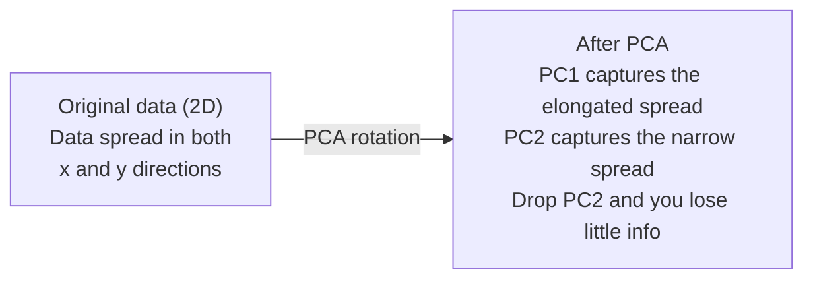

# 降维

> 高维数据具有结构。通过从正确的角度观察，你就能发现它。

**类型：** 构建
**语言：** Python
**先修知识：** 阶段1，课程01（线性代数直觉）、02（向量、矩阵与运算）、03（特征值与特征向量）、06（概率与分布）
**时间：** 约90分钟

## 学习目标

- 从头实现PCA：中心化数据、计算协方差矩阵、特征分解并投影
- 使用解释方差比和肘部法则选择主成分数量
- 比较PCA、t-SNE和UMAP在2D空间中可视化MNIST手写数字的效果，并解释它们的权衡
- 应用带有RBF核的核PCA来分离标准PCA无法处理的非线性数据结构

## 问题

你有一个数据集，每个样本有784个特征。可能是手写数字的像素值，可能是基因表达水平，也可能是用户行为信号。你无法可视化784维的空间，无法绘制它们，甚至无法思考它们。

但其中大多数784个特征是冗余的。实际信息存在于一个更小的表面上。一个手写的“7”不需要784个独立数字来描述它，只需要几个：笔画的倾斜角度、横杠的长度、倾斜程度。其余的都是噪声。

降维找到了那个更小的表面。它将你的784维数据压缩到2、10或50维，同时保留重要的结构。

## 核心概念

### 维度灾难

高维空间是反直觉的。随着维度增加，三件事会出问题。

**距离变得毫无意义。** 在高维空间中，任意两个随机点之间的距离趋近于相同的值。如果每个点与其他所有点的距离大致相等，那么最近邻搜索就失效了。

```
Dimension    Avg distance ratio (max/min between random points)
2            ~5.0
10           ~1.8
100          ~1.2
1000         ~1.02
```

**体积集中在角落。** d维单位超立方体有2^d个角落。在100维中，几乎所有体积都集中在角落，远离中心。数据点分散到边缘，模型在内部区域缺乏数据。

**你需要指数级更多的数据。** 为了在空间中保持相同的样本密度，从2维到20维，你需要10^18倍的数据。你永远不够。降维将数据密度恢复到可工作的水平。

### PCA：找到重要的方向

主成分分析(PCA)找到数据方差最大的轴。它旋转你的坐标系，使得第一个轴捕获最大方差，第二个轴捕获次大方差，依此类推。

算法如下：

```
1. Center the data        (subtract the mean from each feature)
2. Compute covariance     (how features move together)
3. Eigendecomposition     (find the principal directions)
4. Sort by eigenvalue     (biggest variance first)
5. Project               (keep top k eigenvectors, drop the rest)
```

为什么要进行特征分解？协方差矩阵是对称且半正定的。其特征向量是特征空间中的正交方向。特征值告诉你每个方向捕获了多少方差。最大特征值对应的特征向量指向最大方差的方向。



- **PCA之前：** 数据云团在对角线方向上沿x轴和y轴分布
- **PCA之后：** 坐标系被旋转，使得PC1与最大方差方向（拉长的散布）对齐，PC2与最小方差方向（狭窄的散布）对齐
- **降维：** 丢弃PC2将数据投影到PC1上，损失的信息非常少

### 解释方差比

每个主成分捕获总方差的一部分。解释方差比告诉你是多少。

```
Component    Eigenvalue    Explained ratio    Cumulative
PC1          4.73          0.473              0.473
PC2          2.51          0.251              0.724
PC3          1.12          0.112              0.836
PC4          0.89          0.089              0.925
...
```

当累积解释方差达到0.95时，你知道这么多成分捕获了95%的信息。之后的主要是噪声。

### 选择成分数量

三种策略：

1. **阈值法。** 保留足够多的成分以解释90-95%的方差。
2. **肘部法。** 绘制每个成分的解释方差。寻找一个急剧下降的点。
3. **下游性能法。** 使用PCA作为预处理。尝试不同的k值并测量模型的准确率。最佳的k是准确率趋于平稳的那个。

### t-SNE：保留邻域

t分布随机邻域嵌入(t-SNE)专为可视化设计。它将高维数据映射到二维（或三维），同时保留哪些点彼此相近。

直观理解：在原始空间中，基于点之间的距离计算点对的概率分布。近的点获得高概率。远的点获得低概率。然后找到一个二维布局，使得相同的概率分布成立。在784维中相邻的点在二维中仍然相邻。

t-SNE的关键特性：
- 非线性。它可以展开PCA无法处理的复杂流形。
- 随机性。不同的运行会产生不同的布局。
- 困惑度参数控制要考虑多少个邻居（典型范围：5-50）。
- 输出中簇之间的距离没有意义。只有簇本身有意义。
- 在大数据集上速度慢。默认情况下为O(n^2)。

### UMAP：更快，更好的全局结构

均匀流形逼近与投影(UMAP)的工作方式与t-SNE类似，但有两个优势：
- 速度更快。它使用近似最近邻图，而不是计算所有成对距离。
- 全局结构更好。输出中簇的相对位置往往比t-SNE更有意义。

UMAP在高维空间中构建一个加权图（称为"模糊拓扑表示"），然后找到一个能够尽可能保留该图的低维布局。

关键参数：
- `n_neighbors`：定义局部结构的邻居数量（类似于困惑度）。较高的值保留更多全局结构。
- `n_neighbors`：输出中点聚集的紧密程度。较低的值会产生更密集的簇。

### 何时使用哪种方法

|  方法  |  用途  |  保留特性  |  速度  |
|--------|----------|-----------|-------|
|  PCA  |  训练前的预处理  |  全局方差  |  快速（精确），适用于数百万样本  |
|  PCA  |  快速探索性可视化  |  线性结构  |  快速  |
|  t-SNE  |  出版物质量的2D图  |  局部邻域  |  慢（理想样本数<10k）  |
|  UMAP  |  大规模2D可视化  |  局部+部分全局结构  |  中等（可处理数百万样本）  |
|  PCA  |  模型的特征降维  |  按方差排序的特征  |  快速  |
|  t-SNE / UMAP  |  理解簇结构  |  簇分离  |  中到慢  |

经验法则：使用PCA进行预处理和数据压缩。当需要在2D中可视化结构时，使用t-SNE或UMAP。

### 核PCA

标准PCA寻找线性子空间。它旋转你的坐标系并丢弃轴。但如果数据位于非线性流形上呢？2D中的圆无法通过任何直线分离。标准PCA将无济于事。

核主成分分析(Kernel PCA)在由核函数诱导的高维特征空间中应用主成分分析(PCA)，无需显式计算该空间中的坐标。这就是核技巧(kernel trick)——与支持向量机(SVM)背后的思想相同。

算法如下：
1. 计算核矩阵 K，其中 K_ij = k(x_i, x_j)
2. 在特征空间中对核矩阵进行中心化
3. 对中心化后的核矩阵进行特征值分解
4. 前几个特征向量（乘以 1/sqrt(特征值) 缩放）即为投影结果

常用的核函数：

|  核心函数  |  公式  |  适用场景  |
|--------|---------|----------|
|  径向基函数(RBF)  |  exp(-gamma * \ | \ | x - y\ | \ | ^2)  |  大多数非线性数据、光滑流形  |
|  多项式核  |  (x . y + c)^d  |  多项式关系  |
|  Sigmoid核  |  tanh(alpha * x . y + c)  |  类神经网络映射  |

何时使用核主成分分析(Kernel PCA)vs标准主成分分析(PCA)：

|  标准  |  标准PCA  |  核PCA  |
|-----------|-------------|------------|
|  数据结构  |  线性子空间  |  非线性流形  |
|  速度  |  O(min(n^2 d, d^2 n))  |  O(n^2 d + n^3)  |
|  可解释性  |  主成分是特征的线性组合  |  主成分缺乏直接的特征解释  |
|  可扩展性  |  可处理数百万样本  |  核矩阵为 n×n，受限于内存  |
|  重构  |  直接逆变换  |  需要原像近似  |

经典示例：2D中的同心圆。两圈点，一个在内一个在外。标准PCA将两者投影到同一条直线上——对分类无用。使用RBF核的核PCA将内圆和外圆映射到不同区域，使其线性可分。

### 重建误差

你的降维效果如何？你将784维压缩到50维。你丢失了什么？

测量重建误差：
1. 将数据投影到k维：X_reduced = X @ W_k
2. 重建：X_hat = X_reduced @ W_k^T
3. 计算MSE：mean((X - X_hat)^2)

对于PCA，重建误差与解释方差有清晰的关系：

```
Reconstruction error = sum of eigenvalues NOT included
Total variance = sum of ALL eigenvalues
Fraction lost = (sum of dropped eigenvalues) / (sum of all eigenvalues)
```

每个成分的解释方差比为：

```
explained_ratio_k = eigenvalue_k / sum(all eigenvalues)
```

绘制累积解释方差与成分数量的关系图会得到"肘部"曲线。正确的成分数量是满足以下条件的位置：
- 曲线趋于平缓（收益递减）
- 累积方差跨越你的阈值（通常为0.90或0.95）
- 下游任务性能趋于稳定

重建误差在选择k之外也很有用。你可以用它进行异常检测：重建误差高的样本是不适合所学子空间的离群点。这是生产系统中基于PCA的异常检测的基础。

```figure
pca-axes
```

## 动手构建

### 步骤1：从头实现PCA

```python
import numpy as np

class PCA:
    def __init__(self, n_components):
        self.n_components = n_components
        self.components = None
        self.mean = None
        self.eigenvalues = None
        self.explained_variance_ratio_ = None

    def fit(self, X):
        self.mean = np.mean(X, axis=0)
        X_centered = X - self.mean

        cov_matrix = np.cov(X_centered, rowvar=False)

        eigenvalues, eigenvectors = np.linalg.eigh(cov_matrix)

        sorted_idx = np.argsort(eigenvalues)[::-1]
        eigenvalues = eigenvalues[sorted_idx]
        eigenvectors = eigenvectors[:, sorted_idx]

        self.components = eigenvectors[:, :self.n_components].T
        self.eigenvalues = eigenvalues[:self.n_components]
        total_var = np.sum(eigenvalues)
        self.explained_variance_ratio_ = self.eigenvalues / total_var

        return self

    def transform(self, X):
        X_centered = X - self.mean
        return X_centered @ self.components.T

    def fit_transform(self, X):
        self.fit(X)
        return self.transform(X)
```

### 步骤2：在合成数据上测试

```python
np.random.seed(42)
n_samples = 500

t = np.random.uniform(0, 2 * np.pi, n_samples)
x1 = 3 * np.cos(t) + np.random.normal(0, 0.2, n_samples)
x2 = 3 * np.sin(t) + np.random.normal(0, 0.2, n_samples)
x3 = 0.5 * x1 + 0.3 * x2 + np.random.normal(0, 0.1, n_samples)

X_synthetic = np.column_stack([x1, x2, x3])

pca = PCA(n_components=2)
X_reduced = pca.fit_transform(X_synthetic)

print(f"Original shape: {X_synthetic.shape}")
print(f"Reduced shape:  {X_reduced.shape}")
print(f"Explained variance ratios: {pca.explained_variance_ratio_}")
print(f"Total variance captured: {sum(pca.explained_variance_ratio_):.4f}")
```

### 步骤3：MNIST数字在2D中

```python
from sklearn.datasets import fetch_openml

mnist = fetch_openml("mnist_784", version=1, as_frame=False, parser="auto")
X_mnist = mnist.data[:5000].astype(float)
y_mnist = mnist.target[:5000].astype(int)

pca_mnist = PCA(n_components=50)
X_pca50 = pca_mnist.fit_transform(X_mnist)
print(f"50 components capture {sum(pca_mnist.explained_variance_ratio_):.2%} of variance")

pca_2d = PCA(n_components=2)
X_pca2d = pca_2d.fit_transform(X_mnist)
print(f"2 components capture {sum(pca_2d.explained_variance_ratio_):.2%} of variance")
```

### 步骤4：与sklearn比较

```python
from sklearn.decomposition import PCA as SklearnPCA
from sklearn.manifold import TSNE

sklearn_pca = SklearnPCA(n_components=2)
X_sklearn_pca = sklearn_pca.fit_transform(X_mnist)

print(f"\nOur PCA explained variance:     {pca_2d.explained_variance_ratio_}")
print(f"Sklearn PCA explained variance: {sklearn_pca.explained_variance_ratio_}")

diff = np.abs(np.abs(X_pca2d) - np.abs(X_sklearn_pca))
print(f"Max absolute difference: {diff.max():.10f}")

tsne = TSNE(n_components=2, perplexity=30, random_state=42)
X_tsne = tsne.fit_transform(X_mnist)
print(f"\nt-SNE output shape: {X_tsne.shape}")
```

### 步骤5：UMAP比较

```python
try:
    from umap import UMAP

    reducer = UMAP(n_components=2, n_neighbors=15, min_dist=0.1, random_state=42)
    X_umap = reducer.fit_transform(X_mnist)
    print(f"UMAP output shape: {X_umap.shape}")
except ImportError:
    print("Install umap-learn: pip install umap-learn")
```

## 使用它

PCA作为分类器前的预处理：

```python
from sklearn.decomposition import PCA as SklearnPCA
from sklearn.linear_model import LogisticRegression
from sklearn.model_selection import train_test_split
from sklearn.metrics import accuracy_score

X_train, X_test, y_train, y_test = train_test_split(
    X_mnist, y_mnist, test_size=0.2, random_state=42
)

results = {}
for k in [10, 30, 50, 100, 200]:
    pca_k = SklearnPCA(n_components=k)
    X_tr = pca_k.fit_transform(X_train)
    X_te = pca_k.transform(X_test)

    clf = LogisticRegression(max_iter=1000, random_state=42)
    clf.fit(X_tr, y_train)
    acc = accuracy_score(y_test, clf.predict(X_te))
    var_captured = sum(pca_k.explained_variance_ratio_)
    results[k] = (acc, var_captured)
    print(f"k={k:>3d}  accuracy={acc:.4f}  variance={var_captured:.4f}")
```

在达到784维之前，性能早已停滞不前。这个停滞点就是你的工作点。

## 发布

本課(lesson)产出：
- `outputs/skill-dimensionality-reduction.md` - 为给定任务选择合适的降维技术的技能

## 练习

1. 修改PCA类以支持`inverse_transform`。分别用10、50和200个主成分重构MNIST数字图像。打印每次的重构误差（与原始图像的均方差异）。

2. 在相同的MNIST子集上运行t-SNE，困惑度分别取5、30和100。描述输出结果如何变化。为什么困惑度会影响簇的紧密程度？

3. 取一个具有50个特征的数据集，其中只有5个有信息（使用`sklearn.datasets.make_classification`生成一个）。应用PCA并检查解释方差曲线是否正确识别出数据实际上是5维的。

## 关键术语

|  术语  |  人们的说法  |  实际含义  |
|------|----------------|----------------------|
|  维度灾难  |  "特征过多"  |  随着维度增加，距离、体积和数据密度都会出现反直觉的行为。模型需要呈指数级增长的数据来弥补。 |
|  PCA（主成分分析）  |  "降维"  |  旋转坐标系，使坐标轴与最大方差方向对齐，然后丢弃低方差轴。 |
|  主成分  |  "一个重要方向"  |  协方差矩阵的特征向量。特征空间中数据变化最大的方向。 |
|  解释方差比  |  "该成分包含多少信息"  |  单个主成分捕获的总方差比例。对前k个比例求和可看出k个成分保留了多大比例的信息。 |
|  协方差矩阵  |  "特征如何相关"  |  一个对称矩阵，其中第(i,j)个元素度量特征i和特征j一起变化的程度。对角线元素是各个特征的方差。 |
|  t-SNE  |  "那个聚类图"  |  一种非线性方法，通过保留成对邻域概率将高维数据映射到二维。适合可视化，不适合预处理。 |
|  UMAP  |  "更快的t-SNE"  |  一种基于拓扑数据分析的非线性方法。保留局部和部分全局结构。扩展性优于t-SNE。 |
|  困惑度  |  "t-SNE的一个旋钮"  |  控制每个点考虑的有效邻居数量。低困惑度关注非常局部的结构，高困惑度捕捉更广泛的模式。 |
|  流形  |  "数据所在的表面"  |  嵌入在高维空间中的低维表面。一张在三维中被揉皱的纸是一个二维流形。 |

## 延伸阅读

- [A Tutorial on Principal Component Analysis](https://arxiv.org/abs/1404.1100) (Shlens) - 从头开始清晰的PCA推导
- [A Tutorial on Principal Component Analysis](https://arxiv.org/abs/1404.1100) (Wattenberg等人) - 交互式指南：t-SNE的陷阱和参数选择
- [A Tutorial on Principal Component Analysis](https://arxiv.org/abs/1404.1100) - UMAP作者的理论和实践指南
