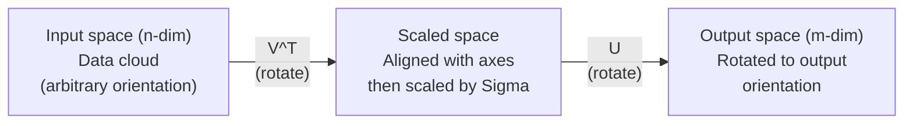
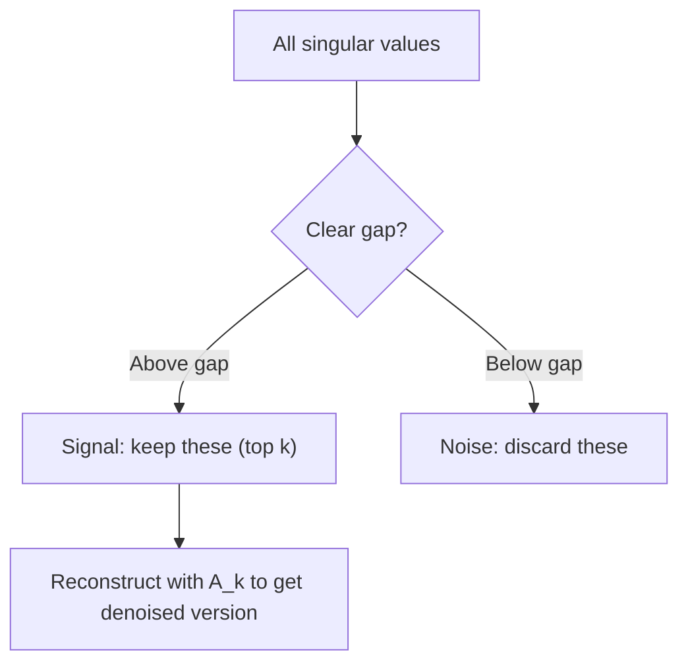

# 奇异值分解

> SVD是线性代数中的瑞士军刀。每个矩阵都有它。每个数据科学家都需要它。

**类型：** 构建
**语言：** Python, Julia
**先修知识：** 阶段1，第01课（线性代数直觉）、第02课（向量与矩阵运算）、第03课（矩阵变换）
**时间：** 约120分钟

## 学习目标

- 通过幂迭代实现SVD，并解释U、Sigma和V^T的几何意义
- 应用截断SVD进行图像压缩，并衡量压缩比与重建误差的关系
- 通过SVD计算Moore-Penrose伪逆，以求解超定最小二乘系统
- 将SVD与PCA、推荐系统（潜在因子）以及NLP中的潜在语义分析联系起来

## 问题

你有一个1000x2000的矩阵。它可能是用户-电影评分，可能是文档-词频表，也可能是图像的像素值。你需要压缩它、去噪、发现其中的隐藏结构，或者用它求解最小二乘系统。特征分解只适用于方阵。即便如此，它还要求矩阵有完整的线性无关特征向量集。

SVD适用于任何矩阵。任何形状。任何秩。没有条件。它将矩阵分解为三个因子，揭示了矩阵对空间作用的几何结构。它是整个线性代数中最通用、最有用的分解。

## 核心概念

### SVD的几何意义

每个矩阵，不论形状如何，都依次执行三个操作：旋转、缩放、旋转。SVD使这种分解明确化。

```
A = U * Sigma * V^T

      m x n     m x m    m x n    n x n
     (any)    (rotate)  (scale)  (rotate)
```

给定任意矩阵A，SVD将其分解为：
- V^T 在输入空间（n维）中旋转向量
- Sigma 沿各轴缩放（拉伸或压缩）
- U 将结果旋转到输出空间（m维）



这样理解：你给SVD一个矩阵，它告诉你：“这个矩阵接受一个输入球体，首先通过V^T旋转，然后通过Sigma拉伸成椭球体，最后通过U旋转椭球体。”奇异值就是椭球体各轴的长度。

### 完整的分解

对于形状为 m x n 的矩阵A：

```
A = U * Sigma * V^T

where:
  U     is m x m, orthogonal (U^T U = I)
  Sigma is m x n, diagonal (singular values on the diagonal)
  V     is n x n, orthogonal (V^T V = I)

The singular values sigma_1 >= sigma_2 >= ... >= sigma_r > 0
where r = rank(A)
```

U的列称为左奇异向量。V的列称为右奇异向量。Sigma的对角线元素称为奇异值。它们总是非负的，并按惯例降序排列。

### 左奇异向量、奇异值、右奇异向量

SVD的每个分量都有独特的几何含义。

**右奇异向量（V的列）：**这些构成了输入空间（R^n）的一组标准正交基。它们是输入空间中的方向，矩阵将这些方向映射到输出空间中的正交方向。可以将其视为定义域的自然坐标系。

**奇异值（Sigma的对角线）：**这些是缩放因子。第i个奇异值告诉你矩阵沿着第i个右奇异向量方向拉伸向量的程度。奇异值为零意味着矩阵完全压缩了那个方向。

**左奇异向量（U的列）：**这些构成了输出空间（R^m）的一组标准正交基。第i个左奇异向量是输出空间中第i个右奇异向量（经过缩放后）所落到的方向。

它们之间的关系：

```
A * v_i = sigma_i * u_i

The matrix A takes the i-th right singular vector v_i,
scales it by sigma_i, and maps it to the i-th left singular vector u_i.
```

这给出了任何矩阵的逐坐标图像。

### 外积形式

SVD可以写成秩一矩阵的和：

```
A = sigma_1 * u_1 * v_1^T + sigma_2 * u_2 * v_2^T + ... + sigma_r * u_r * v_r^T

Each term sigma_i * u_i * v_i^T is a rank-1 matrix (an outer product).
The full matrix is the sum of r such matrices, where r is the rank.
```

这种形式是低秩逼近的基础。每一项增加一层结构。第一项捕获了最重要的单一模式。第二项捕获了次重要的模式。依此类推。截断这个和就得到了给定秩下的最佳逼近。

```
Rank-1 approx:    A_1 = sigma_1 * u_1 * v_1^T
                  (captures the dominant pattern)

Rank-2 approx:    A_2 = sigma_1 * u_1 * v_1^T + sigma_2 * u_2 * v_2^T
                  (captures the two most important patterns)

Rank-k approx:    A_k = sum of top k terms
                  (optimal by the Eckart-Young theorem)
```

### 与特征分解的关系

SVD和特征分解密切相关。A的奇异值和奇异向量直接来自A^T A和A A^T的特征值和特征向量。

```
A^T A = V * Sigma^T * U^T * U * Sigma * V^T
      = V * Sigma^T * Sigma * V^T
      = V * D * V^T

where D = Sigma^T * Sigma is a diagonal matrix with sigma_i^2 on the diagonal.

So:
- The right singular vectors (V) are eigenvectors of A^T A
- The singular values squared (sigma_i^2) are eigenvalues of A^T A

Similarly:
A A^T = U * Sigma * V^T * V * Sigma^T * U^T
      = U * Sigma * Sigma^T * U^T

So:
- The left singular vectors (U) are eigenvectors of A A^T
- The eigenvalues of A A^T are also sigma_i^2
```

这种联系告诉你三件事：
1. 奇异值总是实数且非负（它们是半正定矩阵特征值的平方根）。
2. 你可以通过A^T A的特征分解来计算SVD，但这会将条件数平方并损失数值精度。专用的SVD算法避免了这一点。
3. 当A是方阵且对称半正定时，SVD和特征分解是相同的。

### 截断SVD：低秩逼近

Eckart-Young-Mirsky定理指出，对A的最佳秩k逼近（在Frobenius范数和谱范数下）是通过只保留前k个奇异值及其对应的向量得到的：

```
A_k = U_k * Sigma_k * V_k^T

where:
  U_k     is m x k  (first k columns of U)
  Sigma_k is k x k  (top-left k x k block of Sigma)
  V_k     is n x k  (first k columns of V)

Approximation error = sigma_{k+1}  (in spectral norm)
                    = sqrt(sigma_{k+1}^2 + ... + sigma_r^2)  (in Frobenius norm)
```

这不仅仅是"一个很好的"近似。它可以证明是秩k的最佳可能近似。没有其他秩k矩阵比它更接近A。

|  成分  |  相对大小  |  在秩3近似中保留？  |
|-----------|-------------------|------------------------|
|  sigma_1  |  最大  |  是  |
|  sigma_2  |  大  |  是  |
|  sigma_3  |  中大  |  是  |
|  sigma_4  |  中  |  否（误差）  |
|  sigma_5  |  中小  |  否（误差）  |
|  sigma_6  |  小  |  否（误差）  |
|  sigma_7  |  非常小  |  否（误差）  |
|  sigma_8  |  极小  |  否（误差）  |

保留前3个：A_3捕获三个最大的奇异值。误差 = 剩余值（sigma_4到sigma_8）。

如果奇异值快速衰减，一个小的k就能捕获矩阵的大部分。如果衰减缓慢，则该矩阵没有低秩结构。

### 使用SVD进行图像压缩

灰度图像是一个像素强度矩阵。800x600的图像有480,000个值。SVD让你用更少的数值来近似它。

```
Original image: 800 x 600 = 480,000 values

SVD with rank k:
  U_k:      800 x k values
  Sigma_k:  k values
  V_k:      600 x k values
  Total:    k * (800 + 600 + 1) = k * 1401 values

  k=10:   14,010 values   (2.9% of original)
  k=50:   70,050 values  (14.6% of original)
  k=100: 140,100 values  (29.2% of original)

  The compression ratio improves as k gets smaller,
  but visual quality degrades.
```

关键洞察：自然图像的奇异值快速衰减。前几个奇异值捕获了大致结构（形状、渐变）。后面的奇异值捕获细节和噪声。截断到秩50通常能产生与原始图像几乎相同的图像，同时节省85%的存储。

### 推荐系统中的SVD

Netflix Prize让其声名大噪。你有一个用户-电影评分矩阵，其中大部分条目是缺失的。

```
             Movie1  Movie2  Movie3  Movie4  Movie5
  User1      [  5      ?       3       ?       1  ]
  User2      [  ?      4       ?       2       ?  ]
  User3      [  3      ?       5       ?       ?  ]
  User4      [  ?      ?       ?       4       3  ]

  ? = unknown rating
```

核心思想：该评分矩阵是低秩的。用户的品味并非完全独立。存在少数几个潜在因子（如动作片vs剧情片、老片vs新片、理智型vs情感型）可以解释大部分偏好。

对（填充后的）评分矩阵进行SVD分解，得到：
- U：潜在因子空间中的用户画像
- Sigma：每个潜在因子的重要性
- V^T：潜在因子空间中的电影画像

用户对电影的预测评分是他们的用户画像与电影画像的点积（由奇异值加权）。低秩近似填充了缺失的条目。

在实践中，你使用像Simon Funk的增量SVD或ALS（交替最小二乘法）这样的变体，它们直接处理缺失数据。但核心思想相同：通过SVD进行潜在因子分解。

### 自然语言处理中的SVD：潜在语义分析

潜在语义分析（Latent Semantic Analysis，LSA），也称为潜在语义索引（Latent Semantic Indexing，LSI），对词项-文档矩阵应用SVD。

```
             Doc1   Doc2   Doc3   Doc4
  "cat"      [  3      0      1      0  ]
  "dog"      [  2      0      0      1  ]
  "fish"     [  0      4      1      0  ]
  "pet"      [  1      1      1      1  ]
  "ocean"    [  0      3      0      0  ]

After SVD with rank k=2:

  Each document becomes a point in 2D "concept space."
  Each term becomes a point in the same 2D space.
  Documents about similar topics cluster together.
  Terms with similar meanings cluster together.

  "cat" and "dog" end up near each other (land pets).
  "fish" and "ocean" end up near each other (water concepts).
  Doc1 and Doc3 cluster if they share similar topics.
```

LSA是从原始文本中捕获语义相似性的首批成功方法之一。它之所以有效，是因为同义词倾向于出现在相似的文档中，因此SVD将它们分到相同的潜在维度中。现代词嵌入（Word2Vec、GloVe）可以被视为这一思想的继承者。

### 用于降噪的SVD

含噪声数据的信号集中在前几个奇异值上，而噪声分布在整个奇异值上。截断可以去除噪声基底。

**干净信号的奇异值：**

|  分量  |  大小  |  类型  |
|-----------|-----------|------|
|  sigma_1  |  非常大  |  信号  |
|  sigma_2  |  大  |  信号  |
|  sigma_3  |  中  |  信号  |
|  sigma_4  |  接近零  |  可忽略  |
|  sigma_5  |  接近零  |  可忽略  |

**噪声信号奇异值（噪声加到所有上）：**

|  分量  |  大小  |  类型  |
|-----------|-----------|------|
|  sigma_1  |  非常大  |  信号  |
|  sigma_2  |  大  |  信号  |
|  sigma_3  |  中  |  信号  |
|  sigma_4  |  小  |  噪声  |
|  sigma_5  |  小  |  噪声  |
|  sigma_6  |  小  |  噪声  |
|  sigma_7  |  小  |  噪声  |



这在信号处理、科学测量和数据清理中都会用到。当你有一个被加性噪声污染的矩阵时，截断奇异值分解是一种将信号与噪声分离的原则性方法。

### 通过奇异值分解的伪逆

Moore-Penrose伪逆A+将矩阵求逆推广到非方阵和奇异矩阵。奇异值分解使得计算它变得轻而易举。

```
If A = U * Sigma * V^T, then:

A+ = V * Sigma+ * U^T

where Sigma+ is formed by:
  1. Transpose Sigma (swap rows and columns)
  2. Replace each non-zero diagonal entry sigma_i with 1/sigma_i
  3. Leave zeros as zeros

For A (m x n):      A+ is (n x m)
For Sigma (m x n):  Sigma+ is (n x m)
```

伪逆可以解决最小二乘问题。如果Ax = b没有精确解（超定系统），那么x = A+ b就是最小二乘解（使||Ax - b||最小化）。

```
Overdetermined system (more equations than unknowns):

  [1  1]         [3]
  [2  1] x   =   [5]       No exact solution exists.
  [3  1]         [6]

  x_ls = A+ b = V * Sigma+ * U^T * b

  This gives the x that minimizes the sum of squared residuals.
  Same result as the normal equations (A^T A)^(-1) A^T b,
  but numerically more stable.
```

### 数值稳定性优势

计算A^T A的特征分解会将奇异值平方（A^T A的特征值是sigma_i^2）。这会将条件数平方，放大数值误差。

```
Example:
  A has singular values [1000, 1, 0.001]
  Condition number of A: 1000 / 0.001 = 10^6

  A^T A has eigenvalues [10^6, 1, 10^{-6}]
  Condition number of A^T A: 10^6 / 10^{-6} = 10^{12}

  Computing SVD directly: works with condition number 10^6
  Computing via A^T A:     works with condition number 10^{12}
                           (6 extra digits of precision lost)
```

现代SVD算法（Golub-Kahan双对角化）直接对A进行操作，从不构造A^T A。这就是为什么你应该总是优先使用`np.linalg.svd(A)`而非`np.linalg.eig(A.T @ A)`。

### 与PCA的联系

PCA即对中心化数据进行的SVD。这不是类比，它本质上是相同的计算。

```
Given data matrix X (n_samples x n_features), centered (mean subtracted):

Covariance matrix: C = (1/(n-1)) * X^T X

PCA finds eigenvectors of C. But:

  X = U * Sigma * V^T    (SVD of X)

  X^T X = V * Sigma^2 * V^T

  C = (1/(n-1)) * V * Sigma^2 * V^T

So the principal components are exactly the right singular vectors V.
The explained variance for each component is sigma_i^2 / (n-1).

In sklearn, PCA is implemented using SVD, not eigendecomposition.
It is faster and more numerically stable.
```

这意味着你在第10课中学到的关于降维的所有内容都是SVD在幕后发挥作用。PCA是机器学习中最常见的SVD应用。

```figure
svd-rank-reconstruction
```

## 动手构建

### 步骤1：使用幂迭代从头实现SVD

思路：为了找到最大的奇异值及其向量，对A^T A（或A A^T）使用幂迭代。然后对矩阵进行降阶处理，重复求下一个奇异值。

```python
import numpy as np

def power_iteration(M, num_iters=100):
    n = M.shape[1]
    v = np.random.randn(n)
    v = v / np.linalg.norm(v)

    for _ in range(num_iters):
        Mv = M @ v
        v = Mv / np.linalg.norm(Mv)

    eigenvalue = v @ M @ v
    return eigenvalue, v

def svd_from_scratch(A, k=None):
    m, n = A.shape
    if k is None:
        k = min(m, n)

    sigmas = []
    us = []
    vs = []

    A_residual = A.copy().astype(float)

    for _ in range(k):
        AtA = A_residual.T @ A_residual
        eigenvalue, v = power_iteration(AtA, num_iters=200)

        if eigenvalue < 1e-10:
            break

        sigma = np.sqrt(eigenvalue)
        u = A_residual @ v / sigma

        sigmas.append(sigma)
        us.append(u)
        vs.append(v)

        A_residual = A_residual - sigma * np.outer(u, v)

    U = np.column_stack(us) if us else np.empty((m, 0))
    S = np.array(sigmas)
    V = np.column_stack(vs) if vs else np.empty((n, 0))

    return U, S, V
```

### 步骤2：测试并与NumPy对比

```python
np.random.seed(42)
A = np.random.randn(5, 4)

U_ours, S_ours, V_ours = svd_from_scratch(A)
U_np, S_np, Vt_np = np.linalg.svd(A, full_matrices=False)

print("Our singular values:", np.round(S_ours, 4))
print("NumPy singular values:", np.round(S_np, 4))

A_reconstructed = U_ours @ np.diag(S_ours) @ V_ours.T
print(f"Reconstruction error: {np.linalg.norm(A - A_reconstructed):.8f}")
```

### 步骤3：图像压缩演示

```python
def compress_image_svd(image_matrix, k):
    U, S, Vt = np.linalg.svd(image_matrix, full_matrices=False)
    compressed = U[:, :k] @ np.diag(S[:k]) @ Vt[:k, :]
    return compressed

image = np.random.seed(42)
rows, cols = 200, 300
image = np.random.randn(rows, cols)

for k in [1, 5, 10, 20, 50]:
    compressed = compress_image_svd(image, k)
    error = np.linalg.norm(image - compressed) / np.linalg.norm(image)
    original_size = rows * cols
    compressed_size = k * (rows + cols + 1)
    ratio = compressed_size / original_size
    print(f"k={k:>3d}  error={error:.4f}  storage={ratio:.1%}")
```

### 步骤4：降噪

```python
np.random.seed(42)
clean = np.outer(np.sin(np.linspace(0, 4*np.pi, 100)),
                 np.cos(np.linspace(0, 2*np.pi, 80)))
noise = 0.3 * np.random.randn(100, 80)
noisy = clean + noise

U, S, Vt = np.linalg.svd(noisy, full_matrices=False)
denoised = U[:, :5] @ np.diag(S[:5]) @ Vt[:5, :]

print(f"Noisy error:    {np.linalg.norm(noisy - clean):.4f}")
print(f"Denoised error: {np.linalg.norm(denoised - clean):.4f}")
print(f"Improvement:    {(1 - np.linalg.norm(denoised - clean) / np.linalg.norm(noisy - clean)):.1%}")
```

### 步骤5：伪逆

```python
A = np.array([[1, 1], [2, 1], [3, 1]], dtype=float)
b = np.array([3, 5, 6], dtype=float)

U, S, Vt = np.linalg.svd(A, full_matrices=False)
S_inv = np.diag(1.0 / S)
A_pinv = Vt.T @ S_inv @ U.T

x_svd = A_pinv @ b
x_lstsq = np.linalg.lstsq(A, b, rcond=None)[0]
x_pinv = np.linalg.pinv(A) @ b

print(f"SVD pseudoinverse solution:  {x_svd}")
print(f"np.linalg.lstsq solution:   {x_lstsq}")
print(f"np.linalg.pinv solution:    {x_pinv}")
```

## 使用它

完整可运行的演示在`code/svd.py`中。运行它可以看到SVD应用于图像压缩、推荐系统、潜在语义分析和降噪。

```bash
python svd.py
```

`code/svd.jl`中的Julia版本使用Julia原生的`svd()`函数和`LinearAlgebra`包演示了相同的概念。

```bash
julia svd.jl
```

## 发布

本課(lesson)产出：
- `outputs/skill-svd.md`——一种知道在真实项目中何时以及如何应用SVD的技能

## 练习

1. 不使用幂迭代从头实现完整的SVD。相反，计算A^T A的特征分解以得到V和奇异值，然后计算U = A V Sigma^{-1}。比较数值精度与你的幂迭代版本以及NumPy的结果。

2. 加载一张真实的灰度图像（或将一张图像转换为灰度）。分别用秩1、5、10、25、50、100对其进行压缩。对每个秩，计算压缩比和相对误差。找到图像在视觉上可接受的秩。

3. 构建一个小型推荐系统。创建一个10x8的用户-电影评分矩阵，其中包含一些已知条目。用行均值填充缺失条目。计算SVD并重构一个秩为3的近似矩阵。使用重构矩阵预测缺失评分。验证预测是否合理。

4. 创建一个100x50的文档-术语矩阵，包含3个合成主题。每个主题有5个相关术语。添加噪声。应用SVD并验证前3个奇异值远大于其余奇异值。将文档投影到3维潜在空间，并检查同一主题的文档是否聚集在一起。

5. 生成一个干净的低秩矩阵（秩为3，大小50x40），并添加不同级别的高斯噪声（sigma = 0.1, 0.5, 1.0, 2.0）。对于每个噪声级别，通过从1到40扫描k并测量与干净矩阵的重构误差，找到最优截断秩。绘制最优k随噪声级别变化的曲线图。

## 关键术语

|  术语  |  人们的说法  |  实际含义  |
|------|----------------|----------------------|
|  SVD  |  "分解任何矩阵"  |  将A分解为U Sigma V^T，其中U和V是正交矩阵，Sigma是对角矩阵且元素非负。适用于任何形状的矩阵。  |
|  奇异值  |  "该成分的重要性"  |  Sigma的第i个对角元素。衡量矩阵沿第i个主方向拉伸的程度。始终非负，按降序排列。  |
|  左奇异向量  |  "输出方向"  |  U的一列。第i个右奇异向量缩放（乘以sigma_i）后映射到的输出空间方向。  |
|  右奇异向量  |  "输入方向"  |  V的一列。矩阵映射到第i个左奇异向量（乘以sigma_i）前的输入空间方向。  |
|  截断SVD  |  "低秩近似"  |  只保留前k个奇异值及其对应的向量。产生原始矩阵在秩k下可证明的最佳近似（Eckart-Young定理）。  |
|  秩  |  "真实维度"  |  非零奇异值的个数。指示矩阵实际使用的独立方向数量。  |
|  伪逆  |  "广义逆"  |  V Sigma+ U^T。对非零奇异值取倒数，零保持不变。用于解决非方阵或奇异矩阵的最小二乘问题。  |
|  条件数  |  "对误差的敏感度"  |  sigma_max / sigma_min。条件数大意味着输入微小变化会导致输出巨大变化。SVD直接揭示这一点。  |
|  潜在因子  |  "隐藏变量"  |  SVD发现的低秩空间中的维度。在推荐系统中，潜在因子可能对应类型偏好；在NLP中，可能对应主题。  |
|  Frobenius范数  |  "矩阵总大小"  |  所有元素平方和的平方根。等于所有奇异值平方和的平方根。用于衡量近似误差。  |
|  Eckart-Young定理  |  "SVD给出最佳压缩"  |  对于任何目标秩k，截断SVD在所有可能秩k矩阵中最小化近似误差。  |
|  幂迭代  |  "寻找最大特征向量"  |  将随机向量反复乘以矩阵并归一化。收敛到最大特征值对应的特征向量。是许多SVD算法的基础模块。  |

## 延伸阅读

- [Gilbert Strang: Linear Algebra and Its Applications, Chapter 7](https://math.mit.edu/~gs/linearalgebra/) - thorough treatment of SVD with applications
- [Gilbert Strang: Linear Algebra and Its Applications, Chapter 7](https://math.mit.edu/~gs/linearalgebra/) - geometric intuition for SVD
- [Gilbert Strang: Linear Algebra and Its Applications, Chapter 7](https://math.mit.edu/~gs/linearalgebra/) - accessible overview from the American Mathematical Society
- [Gilbert Strang: Linear Algebra and Its Applications, Chapter 7](https://math.mit.edu/~gs/linearalgebra/) - Simon Funk's original blog post on SVD for recommendations
- [Gilbert Strang: Linear Algebra and Its Applications, Chapter 7](https://math.mit.edu/~gs/linearalgebra/) - the original NLP application of SVD
- [Gilbert Strang: Linear Algebra and Its Applications, Chapter 7](https://math.mit.edu/~gs/linearalgebra/) - the gold standard for understanding SVD algorithms and their numerical properties
