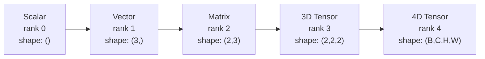
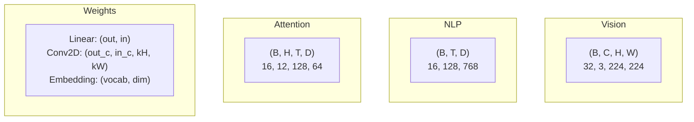
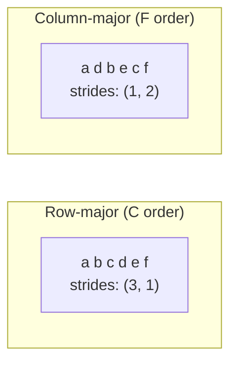
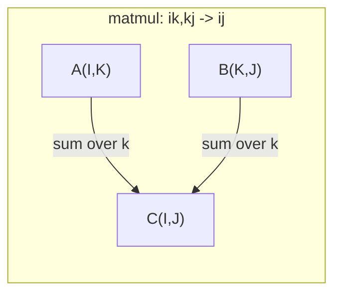

# 张量运算

> 张量是数据与深度学习间的通用语言。每一张图像、每一句话、每一个梯度都通过它们流动。

**类型：** 构建
**语言：** Python
**前置要求：** 第一阶段，第01课（线性代数直觉），第02课（向量、矩阵与运算）
**时间：** 约90分钟

## 学习目标

- 从零实现具有形状、步幅、重塑、转置和逐元素运算的张量类
- 应用广播规则以在不复制数据的情况下操作不同形状的张量
- 编写einsum表达式用于点积、矩阵乘法、外积和批量操作
- 追踪多头注意力中每一步的精确张量形状

## 问题

你构建了一个Transformer。前向传播看起来没问题。你运行它，得到：`RuntimeError: mat1 and mat2 shapes cannot be multiplied (32x768 and 512x768)`。你盯着形状看。你试了一下转置。现在它显示`Expected 4D input (got 3D input)`。你加了一个unsqueeze。又有别的东西出错了。

形状错误是深度学习代码中最常见的bug。概念上并不难——每次操作都有一个形状约定——但它们会迅速倍增。一个Transformer有数十个重塑、转置和广播链在一起。一个错误的轴就会导致错误级联。更糟糕的是，有些形状错误根本不会抛出错误。它们会通过沿错误维度广播或对错误轴求和来静默产生垃圾数据。

矩阵处理两组事物之间的成对关系。真实数据并不适合两维。一批32张224x224的RGB图像是一个4D张量：`(32, 3, 224, 224)`。具有12个头的自注意力也是4D的：`(batch, heads, seq_len, head_dim)`。你需要一种能够推广到任意维度数量、并且运算在所有维度上干净组合的数据结构。这种结构就是张量。掌握它的运算，形状错误就会变得微不足道且易于调试。

## 核心概念

### 张量是什么

张量是一个具有统一数据类型的多维数字数组。维度的数量称为**秩**（或**阶**）。每个维度是一个**轴**。**形状**是一个元组，列出了每个轴上的大小。



总元素数 = 所有大小的乘积。形状`(2, 3, 4)`包含`2 * 3 * 4 = 24`个元素。

### 深度学习中的张量形状

不同的数据类型按惯例映射到特定的张量形状。



PyTorch使用NCHW（通道优先）。TensorFlow默认使用NHWC（通道在后）。不匹配的布局会导致静默减速或错误。

### 内存布局如何工作

内存中的2D数组是一个1D字节序列。**步幅**告诉你在每个轴上移动一步需要跳过的元素数量。



转置并不移动数据，它交换步长，使张量变为**不连续**——一行的元素在内存中不再相邻。

### 广播规则

广播允许你在不复制数据的情况下对不同形状的张量进行操作。从右侧对齐形状。两个维度兼容当它们相等或其中一个为1。维度较少的张量在左侧填充1。

```
Tensor A:     (8, 1, 6, 1)
Tensor B:        (7, 1, 5)
Padded B:     (1, 7, 1, 5)
Result:       (8, 7, 6, 5)
```

### Einsum：通用张量操作

爱因斯坦求和约定用字母标记每个轴。输入中出现但未出现在输出中的轴会被求和。同时出现在输入和输出中的轴则保留。



关键模式：`i,i->`（点积）、`i,j->ij`（外积）、`ii->`（迹）、`ij->ji`（转置）、`bij,bjk->bik`（批量矩阵乘法）、`bhtd,bhsd->bhts`（注意力分数）。

```figure
tensor-broadcast
```

## 动手构建

代码位于`code/tensors.py`。每个步骤都参考了该处的实现。

### 第1步：张量存储和步长

张量存储一个扁平的数字列表加上形状元数据。步长告诉索引逻辑如何将多维索引映射到扁平位置。

```python
class Tensor:
    def __init__(self, data, shape=None):
        if isinstance(data, (list, tuple)):
            self._data, self._shape = self._flatten_nested(data)
        elif isinstance(data, np.ndarray):
            self._data = data.flatten().tolist()
            self._shape = tuple(data.shape)
        else:
            self._data = [data]
            self._shape = ()

        if shape is not None:
            total = reduce(lambda a, b: a * b, shape, 1)
            if total != len(self._data):
                raise ValueError(
                    f"Cannot reshape {len(self._data)} elements into shape {shape}"
                )
            self._shape = tuple(shape)

        self._strides = self._compute_strides(self._shape)

    @staticmethod
    def _compute_strides(shape):
        if len(shape) == 0:
            return ()
        strides = [1] * len(shape)
        for i in range(len(shape) - 2, -1, -1):
            strides[i] = strides[i + 1] * shape[i + 1]
        return tuple(strides)
```

对于形状`(3, 4)`，步长为`(4, 1)`——前进一行跳过4个元素，前进一列跳过1个元素。

### 第2步：重塑、压缩、解压

重塑更改形状而不改变元素顺序。元素总数必须保持不变。对于某个维度使用`-1`来推断其大小。

```python
t = Tensor(list(range(12)), shape=(2, 6))
r = t.reshape((3, 4))
r = t.reshape((-1, 3))
```

压缩移除大小为1的轴。解压插入一个大小为1的轴。解压对于广播至关重要——一个偏置向量`(D,)`加上一个批量`(B, T, D)`需要解压为`(1, 1, D)`。

```python
t = Tensor(list(range(6)), shape=(1, 3, 1, 2))
s = t.squeeze()
v = Tensor([1, 2, 3])
u = v.unsqueeze(0)
```

### 第3步：转置和排列

转置交换两个轴。排列重新排序所有轴。这就是在NCHW和NHWC之间转换的方式。

```python
mat = Tensor(list(range(6)), shape=(2, 3))
tr = mat.transpose(0, 1)

t4d = Tensor(list(range(24)), shape=(1, 2, 3, 4))
perm = t4d.permute((0, 2, 3, 1))
```

在转置或置换后，张量在内存中变为非连续。在PyTorch中，`view`对非连续张量会失败——请先使用`reshape`或调用`.contiguous()`。

### 步骤4：逐元素操作与归约

逐元素操作（加法、乘法、减法）独立应用于每个元素并保持形状不变。归约操作（求和、均值、最大值）会折叠一个或多个轴。

```python
a = Tensor([[1, 2], [3, 4]])
b = Tensor([[10, 20], [30, 40]])
c = a + b
d = a * 2
s = a.sum(axis=0)
```

卷积神经网络中的全局平均池化：`(B, C, H, W).mean(axis=[2, 3])`生成`(B, C)`。自然语言处理中的序列均值池化：`(B, T, D).mean(axis=1)`生成`(B, D)`。

### 步骤5：利用NumPy进行广播

在`tensors.py`中的`demo_broadcasting_numpy()`函数展示了核心模式。

```python
activations = np.random.randn(4, 3)
bias = np.array([0.1, 0.2, 0.3])
result = activations + bias

images = np.random.randn(2, 3, 4, 4)
scale = np.array([0.5, 1.0, 1.5]).reshape(1, 3, 1, 1)
result = images * scale

a = np.array([1, 2, 3]).reshape(-1, 1)
b = np.array([10, 20, 30, 40]).reshape(1, -1)
outer = a * b
```

通过广播计算成对距离：将`(M, 2)`重塑为`(M, 1, 2)`，将`(N, 2)`重塑为`(1, N, 2)`，相减，平方，沿最后一个轴求和，取平方根。结果：`(M, N)`。

### 步骤6：Einsum操作

`demo_einsum()`和`demo_einsum_gallery()`函数遍历了所有常见模式。

```python
a = np.array([1.0, 2.0, 3.0])
b = np.array([4.0, 5.0, 6.0])
dot = np.einsum("i,i->", a, b)

A = np.array([[1, 2], [3, 4], [5, 6]], dtype=float)
B = np.array([[7, 8, 9], [10, 11, 12]], dtype=float)
matmul = np.einsum("ik,kj->ij", A, B)

batch_A = np.random.randn(4, 3, 5)
batch_B = np.random.randn(4, 5, 2)
batch_mm = np.einsum("bij,bjk->bik", batch_A, batch_B)
```

缩并的计算成本是所有索引大小（保留和求和）的乘积。对于B=32，I=128，J=64，K=128的`bij,bjk->bik`：`32 * 128 * 64 * 128 = 33,554,432`次乘加操作。

### 步骤7：基于Einsum的注意力机制

`demo_attention_einsum()`函数端到端地实现了多头注意力。

```python
B, H, T, D = 2, 4, 8, 16
E = H * D

X = np.random.randn(B, T, E)
W_q = np.random.randn(E, E) * 0.02

Q = np.einsum("bte,ek->btk", X, W_q)
Q = Q.reshape(B, T, H, D).transpose(0, 2, 1, 3)

scores = np.einsum("bhtd,bhsd->bhts", Q, K) / np.sqrt(D)
weights = softmax(scores, axis=-1)
attn_output = np.einsum("bhts,bhsd->bhtd", weights, V)

concat = attn_output.transpose(0, 2, 1, 3).reshape(B, T, E)
output = np.einsum("bte,ek->btk", concat, W_o)
```

每一步都是张量操作：投影（通过einsum的矩阵乘法）、头分割（重塑+转置）、注意力分数（通过einsum的批量矩阵乘法）、加权求和（通过einsum的批量矩阵乘法）、头合并（转置+重塑）、输出投影（通过einsum的矩阵乘法）。

## 使用它

### Scratch与NumPy对比

|  操作  |  Scratch（Tensor类）  |  NumPy  |
|---|---|---|
| 创建  |  `Tensor([[1,2],[3,4]])`  |  `np.array([[1,2],[3,4]])`  |
| 重塑  |  `t.reshape((3,4))`  |  `a.reshape(3,4)`  |
| 转置  |  `t.transpose(0,1)`  |  `a.T` 或 `a.transpose(0,1)`  |
| 压缩  |  `t.squeeze(0)`  |  `np.squeeze(a, 0)`  |
| 求和  |  `t.sum(axis=0)`  |  `a.sum(axis=0)`  |
| 爱因斯坦求和  |  N/A  |  `np.einsum("ij,jk->ik", a, b)`  |

### 从头实现 vs PyTorch

```python
import torch

t = torch.tensor([[1, 2, 3], [4, 5, 6]], dtype=torch.float32)
t.shape
t.stride()
t.is_contiguous()

t.reshape(3, 2)
t.unsqueeze(0)
t.transpose(0, 1)
t.transpose(0, 1).contiguous()

torch.einsum("ik,kj->ij", A, B)
```

PyTorch 增加了自动求导、GPU 支持和优化的 BLAS 内核。形状语义完全相同。如果你理解了从头实现的版本，PyTorch 的形状错误就会变得可读。

### 每个神经网络层作为张量运算

|  操作  |  张量形式  |  爱因斯坦求和  |
|---|---|---|
|  线性层  |  `Y = X @ W.T + b`  |  `"bd,od->bo"` + 偏置  |
|  注意力 QKV  |  `Q = X @ W_q`  |  `"btd,dh->bth"`  |
|  注意力分数  |  `Q @ K.T / sqrt(d)`  |  `"bhtd,bhsd->bhts"`  |
|  注意力输出  |  `softmax(scores) @ V`  |  `"bhts,bhsd->bhtd"`  |
|  批归一化  |  `(X - mu) / sigma * gamma`  |  逐元素 + 广播  |
|  Softmax  |  `exp(x) / sum(exp(x))`  |  逐元素 + 归约  |

## 发布

本课产生两个可复用的提示词：

1. **`outputs/prompt-tensor-shapes.md`** -- 一个用于调试张量形状不匹配的系统性提示词。包含每个常见操作（矩阵乘法、广播、拼接、线性层、卷积2d、批归一化、softmax）的决策表和一个修复查找表。

2. **`outputs/prompt-tensor-debugger.md`** -- 一个逐步调试提示词，当形状错误阻碍您时，可将其粘贴到任何AI助手中。输入错误消息和张量形状，即可获得精确修复。

## 练习

1. **简单 -- 重塑往返。** 取一个形状为 `(2, 3, 4)` 的张量。将其重塑为 `(6, 4)`，然后重塑为 `(24,)`，再重塑回 `(2, 3, 4)`。通过打印扁平数据验证每一步的元素顺序保持不变。

2. **中等 -- 实现广播。** 用 `broadcast_to(shape)` 方法扩展 `Tensor` 类，该方法将大小为1的维度扩展以匹配目标形状。然后修改 `_elementwise_op` 以在操作前自动广播。用形状 `(3, 1)` 和 `(1, 4)` 测试，生成 `(3, 4)`。

3. **困难 -- 从头构建einsum。** 实现一个基本的 `einsum(subscripts, *tensors)` 函数，至少处理：点积（`i,i->`）、矩阵乘法（`ij,jk->ik`）、外积（`i,j->ij`）和转置（`ij->ji`）。解析下标字符串，识别收缩索引，并遍历所有索引组合。将结果与 `np.einsum` 进行比较。

4. **困难 -- 注意力形状跟踪器。** 编写一个函数，输入为 `batch_size`、`seq_len`、`embed_dim` 和 `num_heads`，并输出多头注意力每一步的精确形状：输入、Q/K/V投影、头分割、注意力分数、softmax权重、加权和、头合并、输出投影。与 `demo_attention_einsum()` 输出进行验证。

## 关键术语

|  术语  |  人们的说法  |  实际含义  |
|---|---|---|
|  张量  |  "矩阵但更多维度"  |  一个多维数组，具有统一类型和定义的形状、步幅和操作  |
|  秩  |  "维度的数量"  |  轴的数量。矩阵的秩为2，而不是其矩阵秩  |
|  形状  |  "张量的大小"  |  一个元组，列出每个轴的大小。`(2, 3)` 表示2行3列  |
|  步幅  |  "内存布局方式"  |  沿每个轴前进一个位置所需跳过的元素数  |
|  广播  |  "形状不同时也能工作"  |  一组严格规则：从右对齐，维度必须相等或其中之一为1  |
|  连续  |  "张量是正常的"  |  元素按顺序存储在内存中，没有间隙或逻辑布局的重排  |
|  Einsum  |  "编写矩阵乘法的花哨方式"  |  一种通用表示法，可在一行中表示任意张量收缩、外积、迹或转置  |
| 视图(View)  |  "与reshape相同"  |  共享相同内存缓冲区但具有不同形状/步幅元数据的张量。在非连续数据上失败 |
| 收缩(Contraction)  |  "对索引求和"  |  张量之间的共享索引经过乘法和求和的一般操作，产生低秩结果 |
| NCHW / NHWC  |  "PyTorch 与 TensorFlow 格式"  |  图像张量的内存布局约定。NCHW将通道放在空间维度之前，NHWC放在之后 |

## 延伸阅读

- [NumPy Broadcasting](https://numpy.org/doc/stable/user/basics.broadcasting.html) -- 带有可视化示例的规范规则
- [NumPy Broadcasting](https://numpy.org/doc/stable/user/basics.broadcasting.html) -- 视图何时工作以及何时复制
- [NumPy Broadcasting](https://numpy.org/doc/stable/user/basics.broadcasting.html) -- 一个使张量重塑可读且安全的库
- [NumPy Broadcasting](https://numpy.org/doc/stable/user/basics.broadcasting.html) -- 可视化注意力机制中流动的张量形状
- [NumPy Broadcasting](https://numpy.org/doc/stable/user/basics.broadcasting.html) -- 完整的einsum文档及示例
