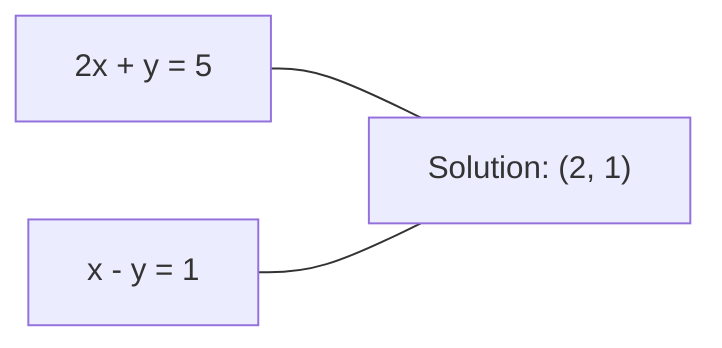
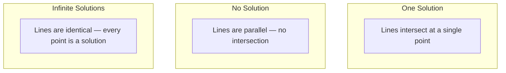

# 线性系统

> 求解 Ax = b 是数学中最古老的问题，但至今仍在驱动你的神经网络。

**类型：** 构建
**语言：** Python
**先修知识：** 第一阶段，第01课（线性代数直觉）、第02课（向量与矩阵）、第03课（矩阵变换）
**时间：** 约120分钟

## 学习目标

- 使用部分主元高斯消元法和回代求解 Ax = b
- 通过 LU、QR 和 Cholesky 分解对矩阵进行分解，并解释各自适用场景
- 推导最小二乘法的正规方程，并将其与线性回归和岭回归联系起来
- 利用条件数诊断病态系统，并应用正则化使之稳定

## 问题

每次训练线性回归时，你都在求解一个线性系统。每次计算最小二乘拟合时，你也在求解一个线性系统。当神经网络层计算 `y = Wx + b` 时，它就是在求一个线性系统的一侧。当添加正则化时，你在修改这个系统。当使用高斯过程时，你在分解一个矩阵。当为了马氏距离求逆协方差矩阵时，你也在求解一个线性系统。

方程 Ax = b 无处不在。A 是已知系数的矩阵。b 是已知输出的向量。x 是你想求的未知向量。在线性回归中，A 是你的数据矩阵，b 是你的目标向量，x 是权重向量。整个模型归结为：找到 x 使得 Ax 尽可能接近 b。

本课程将从零开始构建求解该方程的每一种主要方法。你将理解为什么有些方法快而另一些稳定，为什么有些只适用于方阵系统而另一些可处理超定系统，以及为什么矩阵的条件数决定你的答案是否有意义。

## 核心概念

### Ax = b 的几何意义

线性方程组具有几何解释。每个方程定义了一个超平面。解是所有超平面相交的点（或集合）。

```
2x + y = 5          Two lines in 2D.
x - y  = 1          They intersect at x=2, y=1.
```



可能发生三种情况：



在矩阵形式中，“唯一解”意味着 A 可逆。“无解”意味着系统不相容。“无穷多解”意味着 A 有零空间。大多数机器学习问题属于“无精确解”类别，因为你的方程（数据点）多于未知数（参数）。这就是最小二乘法的用武之地。

### 列视角与行视角

有两种方式解读 Ax = b。

**行视角：** A 的每一行定义一个方程。每个方程是一个超平面。解是所有超平面相交的点。

**列视角：** A 的每一列是一个向量。问题变为：A 的列的什么线性组合能产生 b？

```
A = | 2  1 |    b = | 5 |
    | 1 -1 |        | 1 |

Row picture: solve 2x + y = 5 and x - y = 1 simultaneously.

Column picture: find x1, x2 such that:
  x1 * [2, 1] + x2 * [1, -1] = [5, 1]
  2 * [2, 1] + 1 * [1, -1] = [4+1, 2-1] = [5, 1]   check.
```

列视角更为基本。如果 b 位于 A 的列空间中，系统有解。如果不在，则找到列空间中离 b 最近的点。这个最近点就是最小二乘解。

### 高斯消元法

高斯消元法将 Ax = b 转化为上三角系统 Ux = c，再通过回代求解。这是最直接的方法。

算法步骤：

```
1. For each column k (the pivot column):
   a. Find the largest entry in column k at or below row k (partial pivoting).
   b. Swap that row with row k.
   c. For each row i below k:
      - Compute multiplier m = A[i][k] / A[k][k]
      - Subtract m times row k from row i.
2. Back substitute: solve from the last equation upward.
```

示例：

```
Original:
| 2  1  1 | 8 |       R2 = R2 - (2)R1     | 2  1   1 |  8 |
| 4  3  3 |20 |  -->  R3 = R3 - (1)R1 --> | 0  1   1 |  4 |
| 2  3  1 |12 |                            | 0  2   0 |  4 |

                       R3 = R3 - (2)R2     | 2  1   1 |  8 |
                                       --> | 0  1   1 |  4 |
                                           | 0  0  -2 | -4 |

Back substitute:
  -2 * x3 = -4    -->  x3 = 2
  x2 + 2  = 4     -->  x2 = 2
  2*x1 + 2 + 2 = 8 --> x1 = 2
```

高斯消元法的计算量为 O(n^3) 次操作。对于 1000x1000 的系统，大约需要十亿次浮点运算。速度很快，但如果需要求解多个相同 A 的系统，还可以做得更好。

### 部分主元：为何重要

不使用主元的高斯消元法可能失败或产生垃圾结果。如果主元为零，会除以零；如果主元很小，会放大舍入误差。

```
Bad pivot:                       With partial pivoting:
| 0.001  1 | 1.001 |            Swap rows first:
| 1      1 | 2     |            | 1      1 | 2     |
                                 | 0.001  1 | 1.001 |
m = 1/0.001 = 1000              m = 0.001/1 = 0.001
R2 = R2 - 1000*R1               R2 = R2 - 0.001*R1
| 0.001  1     | 1.001   |      | 1      1     | 2     |
| 0     -999   | -999.0  |      | 0      0.999 | 0.999 |

x2 = 1.000 (correct)            x2 = 1.000 (correct)
x1 = (1.001 - 1)/0.001          x1 = (2 - 1)/1 = 1.000 (correct)
   = 0.001/0.001 = 1.000        Stable because the multiplier is small.
```

在精度有限的浮点运算中，无主元版本可能丢失有效数字。部分主元始终选择最大的可用主元，以最小化误差放大。

### LU 分解

LU 分解将 A 分解为一个下三角矩阵 L 和一个上三角矩阵 U：A = LU。L 矩阵存储高斯消元法中的乘子，U 矩阵是消元的结果。

```
A = L @ U

| 2  1  1 |   | 1  0  0 |   | 2  1   1 |
| 4  3  3 | = | 2  1  0 | @ | 0  1   1 |
| 2  3  1 |   | 1  2  1 |   | 0  0  -2 |
```

为什么分解而不是直接消元？因为一旦得到 L 和 U，对于任意新的 b，求解 Ax = b 只需 O(n^2) 代价：

```
Ax = b
LUx = b
Let y = Ux:
  Ly = b    (forward substitution, O(n^2))
  Ux = y    (back substitution, O(n^2))
```

O(n^3) 的代价在分解时只需支付一次。后续每次求解都是 O(n^2)。如果需要求解 1000 个具有相同 A 但不同 b 向量的系统，LU 分解将总工作量降低大约 1000/3 倍。

结合部分主元，得到 PA = LU，其中 P 是记录行交换的置换矩阵。

### QR 分解

QR 分解将 A 分解为一个正交矩阵 Q 和一个上三角矩阵 R：A = QR。

正交矩阵具有性质 Q^T Q = I。其列是标准正交向量。乘以 Q 保持长度和角度不变。

```
A = Q @ R

Q has orthonormal columns: Q^T Q = I
R is upper triangular

To solve Ax = b:
  QRx = b
  Rx = Q^T b    (just multiply by Q^T, no inversion needed)
  Back substitute to get x.
```

在求解最小二乘问题时，QR 比 LU 数值更稳定。Gram-Schmidt 过程逐列构建 Q：

```
Given columns a1, a2, ... of A:

q1 = a1 / ||a1||

q2 = a2 - (a2 . q1) * q1        (subtract projection onto q1)
q2 = q2 / ||q2||                (normalize)

q3 = a3 - (a3 . q1) * q1 - (a3 . q2) * q2
q3 = q3 / ||q3||

R[i][j] = qi . aj    for i <= j
```

每一步都移除沿所有先前 q 向量的分量，只留下新的正交方向。

### Cholesky 分解

当 A 对称（A = A^T）且正定（所有特征值为正）时，可将其分解为 A = L L^T，其中 L 是下三角矩阵。这就是 Cholesky 分解。

```
A = L @ L^T

| 4  2 |   | 2  0 |   | 2  1 |
| 2  5 | = | 1  2 | @ | 0  2 |

L[i][i] = sqrt(A[i][i] - sum(L[i][k]^2 for k < i))
L[i][j] = (A[i][j] - sum(L[i][k]*L[j][k] for k < j)) / L[j][j]    for i > j
```

Cholesky 速度是 LU 的两倍，且存储需求减半。它仅适用于对称正定矩阵，但这类矩阵频繁出现：

- 协方差矩阵是对称半正定的（通过正则化成为正定）。
- 高斯过程中的核矩阵是对称正定的。
- 凸函数在最小值处的 Hessian 矩阵是对称正定的。
- A^T A 总是对称半正定的。

在高斯过程中，使用 Cholesky 分解核矩阵 K，然后求解 K alpha = y 得到预测均值。Cholesky 因子还提供了边际似然的 log 行列式：log det(K) = 2 * sum(log(diag(L)))。

### 最小二乘：当 Ax = b 无精确解时

如果 A 是 m x n 且 m > n（方程数多于未知数），则该方程组是超定的。没有精确解。相反，你最小化平方误差：

```
minimize ||Ax - b||^2

This is the sum of squared residuals:
  sum((A[i,:] @ x - b[i])^2 for i in range(m))
```

最小化器满足正规方程：

```
A^T A x = A^T b
```

推导：展开 ||Ax - b||^2 = (Ax - b)^T (Ax - b) = x^T A^T A x - 2 x^T A^T b + b^T b。对 x 求梯度并设为零：2 A^T A x - 2 A^T b = 0。

```
Original system (overdetermined, 4 equations, 2 unknowns):
| 1  1 |         | 3 |
| 1  2 | x     = | 5 |       No exact x satisfies all 4 equations.
| 1  3 |         | 6 |
| 1  4 |         | 8 |

Normal equations:
A^T A = | 4  10 |    A^T b = | 22 |
        | 10 30 |            | 63 |

Solve: x = [1.5, 1.7]

This is linear regression. x[0] is the intercept, x[1] is the slope.
```

### 正规方程 = 线性回归

联系是确切的。在线性回归中，数据矩阵 X 每行对应一个样本，每列对应一个特征。目标向量 y 每个元素对应一个样本。权重向量 w 满足：

```
X^T X w = X^T y
w = (X^T X)^(-1) X^T y
```

这是线性回归的闭式解。每次调用 `sklearn.linear_model.LinearRegression.fit()` 都会计算这个（或通过 QR 或 SVD 的等价形式）。

在矩阵中加入正则化项 lambda * I，得到岭回归：

```
(X^T X + lambda * I) w = X^T y
w = (X^T X + lambda * I)^(-1) X^T y
```

正则化使矩阵条件更好（更容易精确求逆），并通过将权重向零收缩来防止过拟合。当 lambda > 0 时，矩阵 X^T X + lambda * I 总是对称正定的，因此可以使用 Cholesky 求解。

### 伪逆（Moore-Penrose）

伪逆 A+ 将矩阵求逆推广到非方阵和奇异矩阵。对于任意矩阵 A：

```
x = A+ b

where A+ = V Sigma+ U^T    (computed via SVD)
```

Sigma+ 是通过对每个非零奇异值取倒数并转置结果得到的。如果 A = U Sigma V^T，则 A+ = V Sigma+ U^T。

```
A = U Sigma V^T        (SVD)

Sigma = | 5  0 |       Sigma+ = | 1/5  0  0 |
        | 0  2 |                | 0  1/2  0 |
        | 0  0 |

A+ = V Sigma+ U^T
```

伪逆给出最小范数最小二乘解。如果系统：
- 有唯一解：A+ b 给出该解。
- 无解：A+ b 给出最小二乘解。
- 有无穷多解：A+ b 给出具有最小 ||x|| 的那个解。

NumPy 的 `np.linalg.lstsq` 和 `np.linalg.pinv` 都在内部使用 SVD。

### 条件数

条件数衡量解对输入微小变化的敏感程度。对于矩阵 A，条件数为：

```
kappa(A) = ||A|| * ||A^(-1)|| = sigma_max / sigma_min
```

其中 sigma_max 和 sigma_min 是最大和最小奇异值。

```
Well-conditioned (kappa ~ 1):        Ill-conditioned (kappa ~ 10^15):
Small change in b -->                Small change in b -->
small change in x                    huge change in x

| 2  0 |   kappa = 2/1 = 2          | 1   1          |   kappa ~ 10^15
| 0  1 |   safe to solve            | 1   1+10^(-15) |   solution is garbage
```

经验法则：
- kappa < 100：安全，解精确。
- kappa ~ 10^k：你会从浮点算术中损失大约 k 位精度。
- kappa ~ 10^16（对于 float64）：解无意义。矩阵实际上是奇异的。

在机器学习中，当特征近乎共线时会出现病态。正则化（添加 lambda * I）将条件数从 sigma_max / sigma_min 改善为 (sigma_max + lambda) / (sigma_min + lambda)。

### 迭代方法：共轭梯度

对于非常大的稀疏系统（数百万个未知数），直接方法如 LU 或 Cholesky 过于昂贵。迭代方法通过多次迭代改进猜测来近似解。

共轭梯度法(CG)在A对称正定时求解Ax = b。它最多在n次迭代内（在精确算术下）找到精确解，但如果A的特征值聚集，通常收敛得更快。

```
Algorithm sketch:
  x0 = initial guess (often zero)
  r0 = b - A x0           (residual)
  p0 = r0                 (search direction)

  For k = 0, 1, 2, ...:
    alpha = (rk . rk) / (pk . A pk)
    x_{k+1} = xk + alpha * pk
    r_{k+1} = rk - alpha * A pk
    beta = (r_{k+1} . r_{k+1}) / (rk . rk)
    p_{k+1} = r_{k+1} + beta * pk
    if ||r_{k+1}|| < tolerance: stop
```

CG用于：
- 大规模优化（牛顿-CG法）
- 求解PDE离散化
- 核方法（核矩阵太大无法分解）
- 为其他迭代求解器提供预条件

收敛速度取决于条件数。条件数更好的系统收敛更快，这也是正则化有帮助的另一个原因。

### 全貌：何时使用哪种方法

|  方法  |  要求  |  代价  |  使用场景  |
|--------|-------------|------|----------|
|  高斯消元法  |  方阵、非奇异A  |  O(n^3)  |  一次性求解方阵系统  |
|  LU分解  |  方阵、非奇异A  |  O(n^3)分解 + O(n^2)求解  |  对同一A多次求解  |
|  QR分解  |  任意A (m >= n)  |  O(mn^2)  |  最小二乘，数值稳定  |
|  乔列斯基分解  |  对称正定A  |  O(n^3/3)  |  协方差矩阵、高斯过程、岭回归  |
|  正规方程  |  超定 (m > n)  |  O(mn^2 + n^3)  |  线性回归（小n）  |
|  SVD/伪逆  |  任意A  |  O(mn^2)  |  秩亏系统、最小范数解  |
|  共轭梯度法  |  对称正定、稀疏A  |  O(n * k * nnz)  |  大型稀疏系统，k = 迭代次数  |

### 与机器学习的关系

本课中的每种方法都在生产级机器学习中出现过：

**线性回归。** 闭式解求解正规方程 X^T X w = X^T y。这通过乔列斯基分解（如果n小）、QR分解（如果数值稳定性重要）或SVD（如果矩阵可能秩亏）完成。

**岭回归。** 在X^T X上加lambda * I。正则化系统 (X^T X + lambda * I) w = X^T y 总是可以通过乔列斯基分解求解，因为对于lambda > 0，X^T X + lambda * I是对称正定的。

**高斯过程。** 预测均值需要求解K alpha = y，其中K是核矩阵。K的乔列斯基分解是标准方法。对数边际似然使用 log det(K) = 2 sum(log(diag(L)))。

**神经网络初始化。** 正交初始化使用QR分解创建列正交的权重矩阵。这可以防止深度网络中的信号崩溃。

**预条件。** 大规模优化器使用不完全乔列斯基分解或不完全LU分解作为共轭梯度求解器的预条件器。

**特征工程。** X^T X的条件数告诉你特征是否共线。如果kappa很大，则丢弃特征或添加正则化。

```figure
linear-system-conditioning
```

## 动手构建

### 步骤1：带部分主元的高斯消元法

```python
import numpy as np

def gaussian_elimination(A, b):
    n = len(b)
    Ab = np.hstack([A.astype(float), b.reshape(-1, 1).astype(float)])

    for k in range(n):
        max_row = k + np.argmax(np.abs(Ab[k:, k]))
        Ab[[k, max_row]] = Ab[[max_row, k]]

        if abs(Ab[k, k]) < 1e-12:
            raise ValueError(f"Matrix is singular or nearly singular at pivot {k}")

        for i in range(k + 1, n):
            m = Ab[i, k] / Ab[k, k]
            Ab[i, k:] -= m * Ab[k, k:]

    x = np.zeros(n)
    for i in range(n - 1, -1, -1):
        x[i] = (Ab[i, -1] - Ab[i, i+1:n] @ x[i+1:n]) / Ab[i, i]

    return x
```

### 步骤2：LU分解

```python
def lu_decompose(A):
    n = A.shape[0]
    L = np.eye(n)
    U = A.astype(float).copy()
    P = np.eye(n)

    for k in range(n):
        max_row = k + np.argmax(np.abs(U[k:, k]))
        if max_row != k:
            U[[k, max_row]] = U[[max_row, k]]
            P[[k, max_row]] = P[[max_row, k]]
            if k > 0:
                L[[k, max_row], :k] = L[[max_row, k], :k]

        for i in range(k + 1, n):
            L[i, k] = U[i, k] / U[k, k]
            U[i, k:] -= L[i, k] * U[k, k:]

    return P, L, U

def lu_solve(P, L, U, b):
    n = len(b)
    Pb = P @ b.astype(float)

    y = np.zeros(n)
    for i in range(n):
        y[i] = Pb[i] - L[i, :i] @ y[:i]

    x = np.zeros(n)
    for i in range(n - 1, -1, -1):
        x[i] = (y[i] - U[i, i+1:] @ x[i+1:]) / U[i, i]

    return x
```

### 步骤3：乔列斯基分解

```python
def cholesky(A):
    n = A.shape[0]
    L = np.zeros_like(A, dtype=float)

    for i in range(n):
        for j in range(i + 1):
            s = A[i, j] - L[i, :j] @ L[j, :j]
            if i == j:
                if s <= 0:
                    raise ValueError("Matrix is not positive definite")
                L[i, j] = np.sqrt(s)
            else:
                L[i, j] = s / L[j, j]

    return L
```

### 步骤4：通过正规方程的最小二乘法

```python
def least_squares_normal(A, b):
    AtA = A.T @ A
    Atb = A.T @ b
    return gaussian_elimination(AtA, Atb)

def ridge_regression(A, b, lam):
    n = A.shape[1]
    AtA = A.T @ A + lam * np.eye(n)
    Atb = A.T @ b
    L = cholesky(AtA)
    y = np.zeros(n)
    for i in range(n):
        y[i] = (Atb[i] - L[i, :i] @ y[:i]) / L[i, i]
    x = np.zeros(n)
    for i in range(n - 1, -1, -1):
        x[i] = (y[i] - L.T[i, i+1:] @ x[i+1:]) / L.T[i, i]
    return x
```

### 步骤5：条件数

```python
def condition_number(A):
    U, S, Vt = np.linalg.svd(A)
    return S[0] / S[-1]
```

## 使用它

在实际数据上将各部分组合用于线性回归和岭回归：

```python
np.random.seed(42)
X_raw = np.random.randn(100, 3)
w_true = np.array([2.0, -1.0, 0.5])
y = X_raw @ w_true + np.random.randn(100) * 0.1

X = np.column_stack([np.ones(100), X_raw])

w_ols = least_squares_normal(X, y)
print(f"OLS weights (ours):    {w_ols}")

w_np = np.linalg.lstsq(X, y, rcond=None)[0]
print(f"OLS weights (numpy):   {w_np}")
print(f"Max difference: {np.max(np.abs(w_ols - w_np)):.2e}")

w_ridge = ridge_regression(X, y, lam=1.0)
print(f"Ridge weights (ours):  {w_ridge}")

from sklearn.linear_model import Ridge
ridge_sk = Ridge(alpha=1.0, fit_intercept=False)
ridge_sk.fit(X, y)
print(f"Ridge weights (sklearn): {ridge_sk.coef_}")
```

## 发布

本課(lesson)产出：
- `code/linear_systems.py` 包含高斯消元法、LU分解、乔列斯基分解、最小二乘法和岭回归的从头实现
- 一个工作示例，展示正规方程和sklearn的LinearRegression产生相同的权重

## 练习

1. 使用你的高斯消元法、LU求解器和`np.linalg.solve`求解系统`[[1,2,3],[4,5,6],[7,8,10]] x = [6, 15, 27]`。验证三者都在浮点容差内给出相同答案。

2. 生成一个50x5的随机矩阵X和目标y = X @ w_true + 噪声。使用正规方程、QR（通过`np.linalg.qr`）、SVD（通过`np.linalg.svd`）和`np.linalg.lstsq`求解w。比较所有四个解。测量X^T X的条件数，并解释它如何影响你对哪种方法的信任。

3. 通过使两列几乎相同（例如，列2 = 列1 + 1e-10 * 噪声）来创建一个近似奇异的矩阵。计算其条件数。分别在有正则化（添加0.01 * I）和无正则化的情况下求解Ax = b。比较解和残差。解释为什么正则化有帮助。

4. 对100x100的随机对称正定矩阵实现共轭梯度算法。统计收敛到容差1e-8所需的迭代次数。与理论最大值n次迭代进行比较。

5. 在大小为10、50、200、500的对称正定矩阵上，记录你的Cholesky求解器、LU求解器和`np.linalg.solve`的求解时间。绘制结果。验证Cholesky比LU快约2倍。

## 关键术语

|  术语  |  人们的说法  |  实际含义  |
|------|----------------|----------------------|
|  线性系统(Linear system)  |  "求解x"  |  一组线性方程Ax = b。求x意味着找到在变换A下产生输出b的输入。  |
|  高斯消元(Gaussian elimination)  |  "行化简"  |  使用行操作系统地使对角线以下的元素为零，产生一个可通过回代求解的上三角系统。复杂度O(n^3)。  |
|  部分选主元(Partial pivoting)  |  "为稳定性交换行"  |  在消去第k列之前，将该列中绝对值最大的行交换到主元位置。防止小数字除法。  |
|  LU分解(LU decomposition)  |  "分解为三角矩阵"  |  将A写为A = LU，其中L是下三角矩阵（存储乘数），U是上三角矩阵（消元后的矩阵）。将O(n^3)的代价分摊到多次求解中。  |
|  QR分解(QR decomposition)  |  "正交分解"  |  将A写为A = QR，其中Q具有标准正交列，R是上三角矩阵。对于最小二乘问题比LU更稳定。  |
|  乔列斯基分解(Cholesky decomposition)  |  "矩阵的平方根"  |  对于对称正定矩阵A，写为A = LL^T。代价是LU分解的一半。用于协方差矩阵、核矩阵和岭回归。  |
|  最小二乘(Least squares)  |  "无法精确求解时的最佳拟合"  |  当系统超定（方程数多于未知数）时，最小化残差平方和  |  | Ax - b |  | ^2。  |
|  正则方程(Normal equations)  |  "微积分捷径"  |  A^T A x = A^T b。将  |  | Ax - b |  | ^2的梯度设为零。这就是线性回归的闭式解。  |
|  伪逆(Pseudoinverse)  |  "非方阵的求逆"  |  通过SVD得到A+ = V Sigma+ U^T。对任意矩阵（方阵或矩形、奇异或非奇异）给出最小范数最小二乘解。  |
|  条件数(Condition number)  |  "这个答案有多可信"  |  kappa = sigma_max / sigma_min。衡量对输入扰动的敏感性。损失大约log10(kappa)位精度。  |
|  岭回归(Ridge regression)  |  "正则化最小二乘"  |  求解 (X^T X + lambda I) w = X^T y。添加lambda I改善了条件数，并将权重向零收缩。防止过拟合。  |
|  共轭梯度(Conjugate gradient)  |  "大矩阵的迭代Ax=b求解"  |  一种用于对称正定系统的迭代求解器。最多n步收敛。适用于分解代价过高的大型稀疏系统。  |
|  超定系统(Overdetermined system)  |  "数据多于参数"  |  在m×n系统中m > n。不存在精确解。最小二乘找到最佳逼近。这就是每个回归问题。  |
|  回代(Back substitution)  |  "从下往上求解"  |  给定一个上三角系统，先求解最后一个方程，然后向后代入。复杂度O(n^2)。  |
|  前代(Forward substitution)  |  "从上往下求解"  |  给定一个下三角系统，先求解第一个方程，然后向前代入。复杂度O(n^2)。用于LU求解中的L步骤。  |

## 延伸阅读

- [MIT 18.06: Linear Algebra](https://ocw.mit.edu/courses/18-06-linear-algebra-spring-2010/) (Gilbert Strang) —— 关于线性系统和矩阵分解的权威课程
- [MIT 18.06: Linear Algebra](https://ocw.mit.edu/courses/18-06-linear-algebra-spring-2010/) (Trefethen & Bau) —— 理解数值稳定性、条件数以及算法为何失效的标准参考
- [MIT 18.06: Linear Algebra](https://ocw.mit.edu/courses/18-06-linear-algebra-spring-2010/) (Golub & Van Loan) —— 所有矩阵算法的百科全书式参考
- [MIT 18.06: Linear Algebra](https://ocw.mit.edu/courses/18-06-linear-algebra-spring-2010/) —— 求解Ax = b几何意义的直观理解
