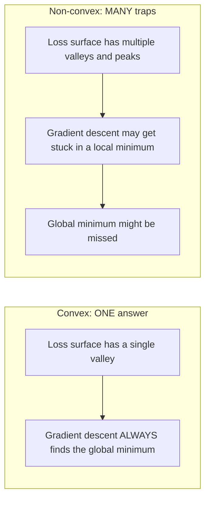
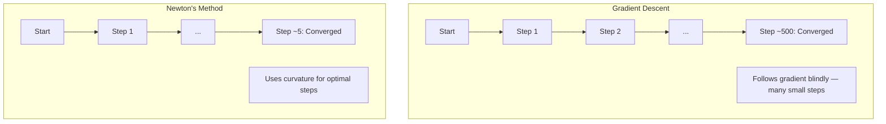
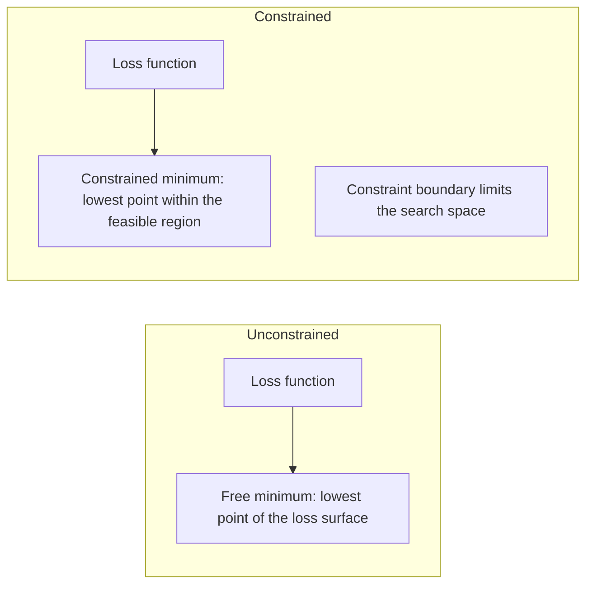
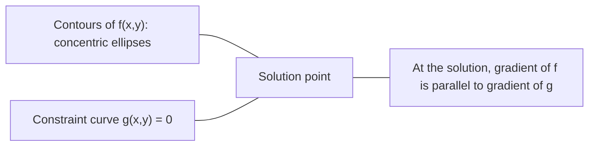

# 凸优化(Convex Optimization)

> 凸问题只有一个谷底。神经网络却有数百万个。了解这其中的区别至关重要。

**类型：** 构建
**语言：** Python
**前置知识：** 第一阶段，第04课（机器学习微积分(Calculus for ML))，第08课（优化(Optimization)）
**时间：** 约90分钟

## 学习目标

- 使用定义、二阶导数(Second Derivative)和海森矩阵(Hessian)准则测试函数是否是凸函数(Convex Function)
- 实现牛顿法(Newton's Method)并比较其二次收敛(Quadratic Convergence)与梯度下降(Gradient Descent)的差异
- 使用拉格朗日乘子法(Lagrange Multipliers)求解带约束优化问题并解释KKT条件
- 解释为什么神经网络(Neural Network)的损失景观(Loss Landscape)是非凸(Non-Convex)的，但随机梯度下降(SGD)仍能找到良好解

## 问题

第08课教你学会了梯度下降(Gradient Descent)、动量(Momentum)和Adam。这些优化器(Optimizer)可以在任何曲面上走下坡路。但它们没有任何保证。在非凸(Non-Convex)的景观上使用梯度下降，可能会陷入糟糕的局部最小值(Local Minimum)、卡在鞍点(Saddle Point)上，或者无限振荡。你之所以仍然使用它，是因为神经网络是非凸的，且没有替代方案。

但机器学习中的许多问题是凸的(Convex)。线性回归、逻辑回归、支持向量机(SVMs)、LASSO、岭回归(Ridge Regression)。对于这些问题，存在更强大的方法：具有数学保证的优化。一个凸问题(Convex Problem)恰好有一个谷底。任何走下坡路的算法都能达到全局最小值(Global Minimum)。无需重新启动，无需学习率调度，无需祈祷。

理解凸性(Convexity)可以带来三个好处。首先，它能告诉你问题是容易（凸的）还是困难（非凸的）。其次，它为凸问题提供了更快的工具，如牛顿法(Newton's Method)。第三，它解释了贯穿整个机器学习的各种概念：作为约束(Constraint)的正则化(Regularization)、支持向量机中的对偶性(Duality)，以及深度学习(Deep Learning)为何在违背凸性带来的所有优良性质的情况下仍然有效。

## 核心概念

### 凸集(Convex Sets)

一个集合 S 是凸的，如果对于 S 中任意两点，它们之间的线段也完全位于 S 内。

|  凸集  |  非凸集  |
|---|---|
|  **矩形**：任意两点间的连线线段位于内部  |  **星形/新月形**：内部两点间的线段可能超出集合  |
|  **三角形**：对所有内部点同样成立  |  **甜甜圈/环形**：空洞导致有些线段离开集合  |
|  任意两点间的线段都保持在集合内  |  某些点对间的线段会离开集合  |

形式化测试：对于 S 中的任意点 x, y 以及任意 t ∈ [0, 1]，点 t x + (1-t)y 也属于 S。

凸集的例子：
- 一条直线、一个平面、整个 R^n
- 一个球（圆、球体、超球体）
- 半空间：{x : a^T x <= b}
- 任意多个凸集的交集

非凸集的例子：
- 一个甜甜圈（环形）
- 两个不相交的圆的并集
- 任何有“凹痕”或“空洞”的集合

### 凸函数(Convex Function)

函数 f 是凸的，如果其定义域是凸集，且对于任意两点 x, y 在其定义域内以及任意 t ∈ [0, 1]，都有：

```
f(tx + (1-t)y) <= t*f(x) + (1-t)*f(y)
```

几何意义：图形上任意两点间的线段位于图形的上方或与其重合。

|  性质  |  凸函数  |  非凸函数  |
|---|---|---|
|  **线段测试**  |  图形上任意两点间的线段位于曲线的 **上方或重合**  |  图形上某些点间的线段会 **低于** 曲线  |
|  **形状**  |  单个向上弯曲的碗/谷  |  具有混合曲率的多个峰和谷  |
|  **局部最小值**  |  每个局部最小值都是全局最小值  |  可能存在多个不同高度的局部最小值  |

常见凸函数：
- f(x) = x^2（抛物线）
- f(x) = |x|（绝对值）
- f(x) = e^x（指数函数）
- f(x) = max(0, x)（ReLU，虽然是分段线性）
- f(x) = -log(x)（x > 0，负对数）
- 任何线性函数 f(x) = a^T x + b（既是凸函数也是凹函数）

### 凸性测试

三种实用测试方法，从最简单到最严格。

**测试1：二阶导数测试（一维）。** 如果对于所有 x 都有 f''(x) >= 0，那么 f 是凸函数。

- f(x) = x^2: f''(x) = 2 >= 0。凸函数。
- f(x) = x^3: f''(x) = 6x。当x<0时为负。非凸函数。
- f(x) = e^x: f''(x) = e^x > 0。凸函数。

**测试2：海森矩阵测试（多变量）。** 如果对于所有x，海森矩阵H(x)都是半正定的，则f是凸函数。海森矩阵是二阶偏导数的矩阵。

**测试3：定义测试。** 直接检查不等式f(tx + (1-t)y) <= t*f(x) + (1-t)*f(y)。适用于导数难以计算的函数。

### 为什么凸性重要

凸优化的中心定理：

**对于凸函数，每个局部最小值都是全局最小值。**

这意味着梯度下降不会陷入局部最优。任何下坡路径都会到达相同的答案。算法保证收敛到最优解。



后果：
- 无需随机重启
- 无需复杂的学习率调度
- 收敛证明是可能的（速率取决于函数性质）
- 解是唯一的（除了平坦区域）

### 机器学习中的凸与非凸

|  问题  |  凸？  |  原因  |
|---------|---------|-----|
|  线性回归（MSE）  |  是  |  损失函数是权重的二次型  |
|  逻辑回归  |  是  |  对数损失是权重的凸函数  |
|  SVM（铰链损失）  |  是  |  线性函数的最大值  |
|  LASSO（L1回归）  |  是  |  凸函数之和仍是凸函数  |
|  岭回归（L2）  |  是  |  二次型+二次型=凸函数  |
|  神经网络（任何损失）  |  否  |  非线性激活函数导致非凸地形  |
|  k均值聚类  |  否  |  离散分配步骤  |
|  矩阵分解  |  否  |  未知量的乘积  |

具有凸损失的线性模型是凸的。一旦你添加带有非线性激活函数的隐藏层，凸性就会失效。

### 海森矩阵

函数f: R^n -> R的海森矩阵H是n×n的二阶偏导数矩阵。

```
H[i][j] = d^2 f / (dx_i dx_j)
```

对于f(x, y) = x^2 + 3xy + y^2：

```
df/dx = 2x + 3y       d^2f/dx^2 = 2      d^2f/dxdy = 3
df/dy = 3x + 2y       d^2f/dydx = 3      d^2f/dy^2 = 2

H = [ 2  3 ]
    [ 3  2 ]
```

海森矩阵告诉你关于曲率的信息：
- 所有特征值为正：函数在每个方向上都是向上弯曲（在该点凸）
- 所有特征值为负：在每个方向上向下弯曲（凹函数，局部最大值）
- 混合符号：鞍点（某些方向向上弯曲，其他方向向下弯曲）
- 特征值为零：在该方向平坦（退化）

对于凸性，海森矩阵必须在所有点上半正定（所有特征值>=0），而不仅仅是在一个点上。

### 牛顿法

梯度下降使用一阶信息（梯度）。牛顿法使用二阶信息（海森矩阵）。它在当前点拟合二次近似，并直接跳到该二次函数的最小值。

```
Update rule:
  x_new = x - H^(-1) * gradient

Compare to gradient descent:
  x_new = x - lr * gradient
```

牛顿法用逆海森矩阵替代标量学习率。这根据局部曲率自动调整步长和方向。



优点：
- 最小值附近的二次收敛（每步误差平方）
- 无需调整学习率
- 尺度不变性（无论如何参数化问题都有效）

缺点：
- 计算海森矩阵需要 O(n^2) 内存和 O(n^3) 求逆
- 对于具有100万个权重的神经网络，即有10^12个元素和10^18次运算
- 不适用于深度学习

### 约束优化

无约束优化：在所有 x 上最小化 f(x)。
约束优化：在约束条件下最小化 f(x)。

现实问题都有约束条件。你想最小化成本但预算有限。你想最小化误差但模型复杂度有限。



### 拉格朗日乘子法

拉格朗日乘子法将约束问题转化为无约束问题。

问题：在约束 g(x)=0 下最小化 f(x)。

解法：引入新变量（拉格朗日乘子 lambda）并求解无约束问题：

```
L(x, lambda) = f(x) + lambda * g(x)
```

在解处，L 的梯度为零：

```
dL/dx = df/dx + lambda * dg/dx = 0
dL/dlambda = g(x) = 0
```

几何直观：在约束最小值点，f 的梯度必须与约束 g 的梯度平行。如果它们不平行，你可以沿着约束表面移动以进一步减小 f。



示例：在约束 x+y=1 下最小化 f(x,y)=x^2+y^2。

```
L = x^2 + y^2 + lambda(x + y - 1)

dL/dx = 2x + lambda = 0  =>  x = -lambda/2
dL/dy = 2y + lambda = 0  =>  y = -lambda/2
dL/dlambda = x + y - 1 = 0

From first two: x = y
Substituting: 2x = 1, so x = y = 0.5, lambda = -1
```

直线 x+y=1 上距离原点最近的点是 (0.5, 0.5)。

### KKT 条件

Karush-Kuhn-Tucker 条件将拉格朗日乘子法扩展到不等式约束。

问题：在约束 g_i(x) <= 0 (i=1,...,m) 下最小化 f(x)。

KKT 条件（最优性必要条件）：

```
1. Stationarity:    df/dx + sum(lambda_i * dg_i/dx) = 0
2. Primal feasibility:  g_i(x) <= 0  for all i
3. Dual feasibility:    lambda_i >= 0  for all i
4. Complementary slackness:  lambda_i * g_i(x) = 0  for all i
```

互补松弛性是关键：要么约束是活动的 (g_i=0，解位于边界上)，要么乘子为零（该约束无关紧要）。不影响解的约束对应的 lambda=0。

KKT 条件是支持向量机(SVM)的核心。支持向量是约束活动 (lambda>0) 的数据点。所有其他数据点的 lambda=0，不影响决策边界。

### 正则化作为约束优化

L1 和 L2 正则化并非随意技巧。它们实际上是约束优化问题。

**L2 正则化（岭回归）：**

```
minimize  Loss(w)  subject to  ||w||^2 <= t

Equivalent unconstrained form:
minimize  Loss(w) + lambda * ||w||^2
```

约束 ||w||^2 <= t 定义了一个球（二维为圆，三维为球体）。解是损失等高线首次接触该球的位置。

**L1 正则化（LASSO）：**

```
minimize  Loss(w)  subject to  ||w||_1 <= t

Equivalent unconstrained form:
minimize  Loss(w) + lambda * ||w||_1
```

约束 ||w||_1 <= t 定义了一个菱形（二维为旋转正方形）。

|  属性  |  L2 约束（圆）  |  L1 约束（菱形）  |
|---|---|---|
|  **约束形状**  |  圆（高维为球体）  |  菱形（二维为旋转正方形）  |
|  **损失等高线接触位置**  |  光滑边界——圆上任意点  |  角点——与坐标轴对齐  |
|  **解的行为**  |  权重小但不为零  |  部分权重恰好为零（稀疏）  |
|  **结果**  |  权重收缩  |  特征选择  |

这解释了为什么 L1 产生稀疏模型（特征选择），而 L2 仅收缩权重。钻石形具有与坐标轴对齐的角。损失等高线更有可能触及一个角，使一个或多个权重精确为零。

### 对偶性

每个约束优化问题（原始问题）都有一个伴生问题（对偶问题）。对于凸问题，原始问题和对偶问题具有相同的最优值。这称为强对偶性。

拉格朗日对偶函数：

```
Primal: minimize f(x) subject to g(x) <= 0
Lagrangian: L(x, lambda) = f(x) + lambda * g(x)
Dual function: d(lambda) = min_x L(x, lambda)
Dual problem: maximize d(lambda) subject to lambda >= 0
```

为什么对偶性重要：
- 对偶问题有时比原始问题更容易求解
- SVM 以其对偶形式求解，问题依赖于数据点之间的点积（从而能够使用核技巧）
- 对偶问题提供了原始问题最优值的下界，有助于检查解的质量

对于 SVM 特别地：

```
Primal: find w, b that maximize the margin 2/||w|| subject to
        y_i(w^T x_i + b) >= 1 for all i

Dual:   maximize sum(alpha_i) - 0.5 * sum_ij(alpha_i * alpha_j * y_i * y_j * x_i^T x_j)
        subject to alpha_i >= 0 and sum(alpha_i * y_i) = 0

The dual only involves dot products x_i^T x_j.
Replace x_i^T x_j with K(x_i, x_j) to get the kernel trick.
```

### 为什么深度学习尽管非凸性仍然有效

神经网络损失函数是高度非凸的。根据所有经典度量，优化它们应该失败。然而，随机梯度下降法可靠地找到了好的解。几个因素可以解释这一点。

**大多数局部最小值已经足够好。**在高维空间中，随机临界点（梯度为零的点）绝大多数是鞍点，而不是局部最小值。少数存在的局部最小值往往具有接近全局最小值的损失值。当参数空间有数百万个维度时，陷入糟糕局部最小值的可能性极低。

**鞍点，而不是局部最小值，才是真正的障碍。**在一个具有 n 个参数的函数中，鞍点具有正负曲率方向的混合。对于高维随机临界点，所有 n 个特征值均为正（局部最小值）的概率大约是 2^(-n)。几乎所有临界点都是鞍点。SGD 的噪声有助于逃离它们。

**过参数化平滑了地形。**参数比训练样本更多的网络具有更平滑、更连通的损失面。更宽的网络具有更少的坏局部最小值。这违反直觉，但在经验上是一致的。

**损失地形结构：**

|  属性  |  低维空间  |  高维空间  |
|---|---|---|
|  **地形**  |  许多孤立的山峰和山谷  |  平滑连通的谷地  |
|  **最小值**  |  许多孤立的局部最小值  |  很少的坏局部最小值；大多数接近最优  |
|  **导航**  |  难以找到全局最小值  |  许多路径通向好的解  |
|  **临界点**  |  局部最小值和鞍点的混合  |  绝大多数是鞍点，而不是局部最小值  |

**随机噪声起到隐式正则化的作用。**小批量 SGD 增加了噪声，防止了陷入尖锐最小值。尖锐最小值过拟合；平坦最小值泛化性好。噪声将优化偏向于损失地形的平坦区域。

### 实践中二阶方法

纯牛顿法对于大模型不实用。几种近似方法使二阶信息可用。

**L-BFGS（有限内存 BFGS）：**使用最后 m 个梯度差来近似逆 Hessian 矩阵。需要 O(mn) 内存，而不是 O(n^2)。对于最多约 10,000 个参数的问题效果良好。用于经典机器学习（逻辑回归、CRF），但不用于深度学习。

**自然梯度：**使用 Fisher 信息矩阵（对数似然的期望 Hessian）代替标准 Hessian。这考虑了概率分布的几何结构。K-FAC（Kronecker 因子近似曲率）将 Fisher 矩阵近似为 Kronecker 积，使其对神经网络实用。

**无 Hessian 优化：**使用共轭梯度法求解 Hx = g，而从不显式构建 H。仅需要 Hessian-向量乘积，可以通过自动微分在 O(n) 时间内计算。

**对角近似：**Adam 的二阶矩是 Hessian 对角线的对角近似。AdaHessian 通过使用 Hutchinson 估计器的实际 Hessian 对角线元素扩展了这一点。

|  方法  |  内存  |  每步开销  |  何时使用  |
|--------|--------|--------------|-------------|
|  梯度下降  |  O(n)  |  O(n)  |  基线，大模型  |
|  牛顿法  |  O(n^2)  |  O(n^3)  |  小型凸问题  |
|  L-BFGS  |  O(mn)  |  O(mn)  |  中型凸问题  |
| Adam | O(n) | O(n) | 深度学习默认 |
| K-FAC | O(n) | 每层O(n) | 研究、大批量训练 |

```figure
convex-vs-nonconvex
```

## 动手构建

### 步骤1：凸性检查器

构建一个通过采样点并检查定义来经验性测试凸性的函数。

```python
import random
import math

def check_convexity(f, dim, bounds=(-5, 5), samples=1000):
    violations = 0
    for _ in range(samples):
        x = [random.uniform(*bounds) for _ in range(dim)]
        y = [random.uniform(*bounds) for _ in range(dim)]
        t = random.uniform(0, 1)
        mid = [t * xi + (1 - t) * yi for xi, yi in zip(x, y)]
        lhs = f(mid)
        rhs = t * f(x) + (1 - t) * f(y)
        if lhs > rhs + 1e-10:
            violations += 1
    return violations == 0, violations
```

### 步骤2：二维牛顿法

使用显式海森矩阵实现牛顿法。比较其与梯度下降的收敛速度。

```python
def newtons_method(f, grad_f, hessian_f, x0, steps=50, tol=1e-12):
    x = list(x0)
    history = [x[:]]
    for _ in range(steps):
        g = grad_f(x)
        H = hessian_f(x)
        det = H[0][0] * H[1][1] - H[0][1] * H[1][0]
        if abs(det) < 1e-15:
            break
        H_inv = [
            [H[1][1] / det, -H[0][1] / det],
            [-H[1][0] / det, H[0][0] / det],
        ]
        dx = [
            H_inv[0][0] * g[0] + H_inv[0][1] * g[1],
            H_inv[1][0] * g[0] + H_inv[1][1] * g[1],
        ]
        x = [x[0] - dx[0], x[1] - dx[1]]
        history.append(x[:])
        if sum(gi ** 2 for gi in g) < tol:
            break
    return history
```

### 步骤3：拉格朗日乘子求解器

使用拉格朗日函数上的梯度下降求解约束优化问题。

```python
def lagrange_solve(f_grad, g_val, g_grad, x0, lr=0.01,
                   lr_lambda=0.01, steps=5000):
    x = list(x0)
    lam = 0.0
    history = []
    for _ in range(steps):
        fg = f_grad(x)
        gv = g_val(x)
        gg = g_grad(x)
        x = [
            xi - lr * (fgi + lam * ggi)
            for xi, fgi, ggi in zip(x, fg, gg)
        ]
        lam = lam + lr_lambda * gv
        history.append((x[:], lam, gv))
    return history
```

### 步骤4：比较一阶方法与二阶方法

对相同的二次函数运行梯度下降和牛顿法。统计达到收敛的步数。

```python
def quadratic(x):
    return 5 * x[0] ** 2 + x[1] ** 2

def quadratic_grad(x):
    return [10 * x[0], 2 * x[1]]

def quadratic_hessian(x):
    return [[10, 0], [0, 2]]
```

牛顿法将在1步内收敛（它对二次函数是精确的）。梯度下降需要数百步，因为海森矩阵的特征值相差5倍，形成了拉长的山谷。

## 使用它

凸性分析在选择机器学习模型和求解器时直接适用。

对于凸问题（逻辑回归、支持向量机、LASSO）：
- 使用专用求解器（liblinear、CVXPY、scipy.optimize.minimize 的 method='L-BFGS-B'）
- 期望唯一的全局解
- 二阶方法实用且快速

对于非凸问题（神经网络）：
- 使用一阶方法（SGD、Adam）
- 接受解依赖于初始化和随机性
- 使用过参数化、噪声和学习率调度作为隐式正则化
- 不要浪费时间寻找全局最小值。一个好的局部最小值就足够了。

```python
from scipy.optimize import minimize

result = minimize(
    fun=lambda w: sum((y - X @ w) ** 2) + 0.1 * sum(w ** 2),
    x0=np.zeros(d),
    method='L-BFGS-B',
    jac=lambda w: -2 * X.T @ (y - X @ w) + 0.2 * w,
)
```

对于支持向量机，对偶形式允许你使用核技巧：

```python
from sklearn.svm import SVC

svm = SVC(kernel='rbf', C=1.0)
svm.fit(X_train, y_train)
print(f"Support vectors: {svm.n_support_}")
```

## 练习

1. **凸性画廊。** 使用检查器测试这些函数的凸性：f(x) = x^4、f(x) = sin(x)、f(x,y) = x^2 + y^2、f(x,y) = x*y、f(x) = max(x, 0)。解释每个结果为何合理。

2. **牛顿法与梯度下降竞赛。** 在函数 f(x,y) = 50*x^2 + y^2 上从起始点 (10, 10) 运行两种方法。每种方法需要多少步才能使损失小于 1e-10？当条件数（海森矩阵最大特征值与最小特征值之比）增加时，梯度下降会发生什么？

3. **拉格朗日乘子几何。** 在约束条件 x + 2y = 4 下最小化 f(x,y) = (x-3)^2 + (y-3)^2。通过检查解处 f 的梯度与 g 的梯度平行来验证解。

4. **正则化约束。** 实现 L1 约束优化：在 |x| + |y| <= 1 下最小化 (x-3)^2 + (y-2)^2。表明解有一个坐标为零（菱形约束导致的稀疏性）。

5. **海森矩阵特征值分析。** 计算 Rosenbrock 函数在 (1,1) 和 (-1,1) 处的海森矩阵。计算这两点的特征值。特征值告诉你关于最小值处及远离最小值处的曲率信息。

## 关键术语

| 术语  |  含义 |
|------|---------------|
| 凸集 | 集合中任意两点之间的线段完全位于集合内的集合 |
| 凸函数 | 图像上任意两点之间的直线位于图像上方或上的函数。等价地，海森矩阵处处半正定 |
| 局部最小值 | 比所有邻近点都低的点。对于凸函数，每个局部最小值都是全局最小值 |
| 全局最小值 | 函数在整个定义域内的最低点 |
| 海森矩阵 | 所有二阶偏导数构成的矩阵。编码曲率信息 |
| 半正定 | 所有特征值非负的矩阵。是多维中“二阶导数 >= 0”的类比 |
| 条件数 | 海森矩阵最大特征值与最小特征值之比。高条件数意味着拉长的山谷和缓慢的梯度下降 |
| 牛顿法 | 使用逆海森矩阵确定步长和方向的二阶优化器。在最小值附近具有二次收敛速度 |
| 拉格朗日乘数(Lagrange multiplier)  |  引入的变量，用于将有约束优化问题转化为无约束问题 |
| KKT条件(KKT conditions)  |  带不等式约束的最优性的必要条件。推广了拉格朗日乘数 |
| 互补松弛性(Complementary slackness)  |  在解处，要么约束是活动的，要么其乘数为零。两者不同时非零 |
| 对偶性(Duality)  |  每个约束问题都有一个伴随的对偶问题。对于凸问题，两者具有相同的最优值 |
| 强对偶性(Strong duality)  |  原问题和对偶问题的最优值相等。对于满足斯莱特条件的凸问题成立 |
| L-BFGS(L-BFGS)  |  近似二阶方法，存储最近m个梯度差而非完整的海森矩阵 |
| 鞍点(Saddle point)  |  梯度为零但在某些方向上是极小值、在另一些方向上是极大值的点 |
| 过参数化(Overparameterization)  |  使用比训练样本更多的参数。平滑了损失景观并减少了不良局部极小值 |

## 延伸阅读

- [Boyd & Vandenberghe: Convex Optimization](https://web.stanford.edu/~boyd/cvxbook/) - 标准教科书，可免费在线获取
- [Boyd & Vandenberghe: Convex Optimization](https://web.stanford.edu/~boyd/cvxbook/) - 架起凸优化理论与深度学习实践的桥梁
- [Boyd & Vandenberghe: Convex Optimization](https://web.stanford.edu/~boyd/cvxbook/) - 为什么非凸神经网络景观并不像看起来那么糟糕
- [Boyd & Vandenberghe: Convex Optimization](https://web.stanford.edu/~boyd/cvxbook/) - 牛顿法、L-BFGS和约束优化的全面参考
