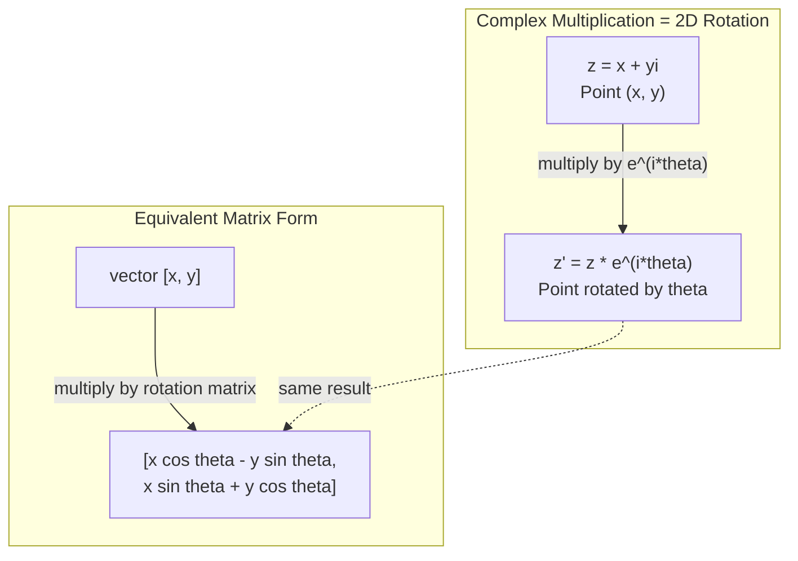
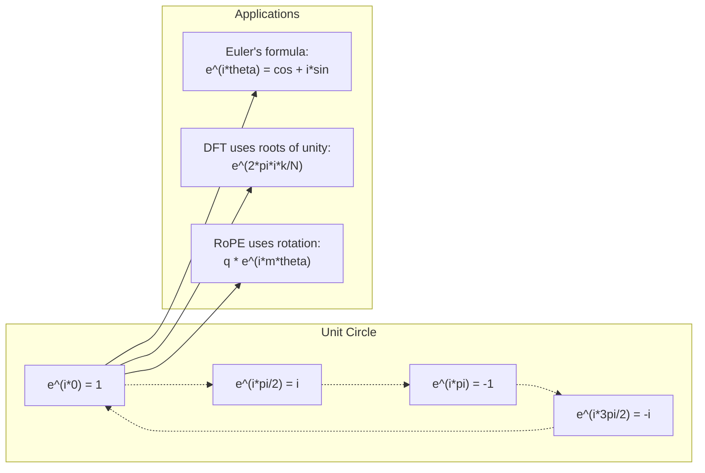

# 面向AI的复数

> -1的平方根并非想象出来的。它是旋转、频率以及信号处理半壁江山的关键。

**类型：** 学习
**语言：** Python
**前置知识：** Phase 1, 第01-04课（线性代数、微积分）
**时长：** ~60分钟

## 学习目标

- 用直角坐标和极坐标两种形式执行复数运算（加、乘、除、共轭）
- 应用欧拉公式在复指数和三角函数之间转换
- 使用复单位根实现离散傅里叶变换
- 解释复数旋转如何支撑Transformer中的RoPE和正弦位置编码

## 问题

你打开一篇关于傅里叶变换的论文，到处是`i`。你查看Transformer位置编码，看到不同频率下的`sin`和`cos`——复指数的实部和虚部。你阅读量子计算，发现一切都用复向量空间表达。

复数看似抽象。一个建立在-1平方根上的数系感觉像是数学花招。但这不是花招。它是旋转和振荡的自然语言。每当有东西旋转、振动或振荡时，复数就是正确的工具。

不理解复数，你就无法理解离散傅里叶变换。你无法理解FFT。你无法理解RoPE（旋转位置嵌入）在现代语言模型中的工作原理。你无法理解原始Transformer论文中正弦位置编码为何使用它们所使用的频率。

本课从零构建复数运算，将其与几何联系起来，并准确展示复数在机器学习中出现的位置。

## 核心概念

### 什么是复数？

复数有两个部分：实部和虚部。

```
z = a + bi

where:
  a is the real part
  b is the imaginary part
  i is the imaginary unit, defined by i^2 = -1
```

就是这样。你将数轴扩展成一个平面。实数放在一个轴上。虚数放在另一个轴上。每个复数都是这个平面中的一个点。

### 复数运算

**加法。** 实部相加，虚部相加。

```
(a + bi) + (c + di) = (a + c) + (b + d)i

Example: (3 + 2i) + (1 + 4i) = 4 + 6i
```

**乘法。** 使用分配律并记住 i^2 = -1。

```
(a + bi)(c + di) = ac + adi + bci + bdi^2
                 = ac + adi + bci - bd
                 = (ac - bd) + (ad + bc)i

Example: (3 + 2i)(1 + 4i) = 3 + 12i + 2i + 8i^2
                            = 3 + 14i - 8
                            = -5 + 14i
```

**共轭。** 翻转虚部的符号。

```
conjugate of (a + bi) = a - bi
```

复数与其共轭的乘积总是实数：

```
(a + bi)(a - bi) = a^2 + b^2
```

**除法。** 分子分母同乘以分母的共轭。

```
(a + bi) / (c + di) = (a + bi)(c - di) / (c^2 + d^2)
```

这样可以消去分母中的虚部，得到一个干净的复数。

### 复平面

复平面将每个复数映射到一个二维点。水平轴是实轴，垂直轴是虚轴。

```
z = 3 + 2i  corresponds to the point (3, 2)
z = -1 + 0i corresponds to the point (-1, 0) on the real axis
z = 0 + 4i  corresponds to the point (0, 4) on the imaginary axis
```

复数同时是一个点和从原点出发的向量。这种双重解释使得复数对几何有用。

### 极坐标形式

平面中的任何点都可以通过它到原点的距离以及与正实轴的角度来描述。

```
z = r * (cos(theta) + i*sin(theta))

where:
  r = |z| = sqrt(a^2 + b^2)     (magnitude, or modulus)
  theta = atan2(b, a)             (phase, or argument)
```

直角坐标形式 (a + bi) 适合加法。极坐标形式 (r, theta) 适合乘法。

**极坐标形式的乘法。** 模相乘，辐角相加。

```
z1 = r1 * e^(i*theta1)
z2 = r2 * e^(i*theta2)

z1 * z2 = (r1 * r2) * e^(i*(theta1 + theta2))
```

这就是复数非常适合旋转的原因。乘以模为1的复数就是纯旋转。

### 欧拉公式(Euler's formula)

复指数与三角学之间的桥梁：

```
e^(i*theta) = cos(theta) + i*sin(theta)
```

这是本课最重要的公式。当 theta = pi 时：

```
e^(i*pi) = cos(pi) + i*sin(pi) = -1 + 0i = -1

Therefore: e^(i*pi) + 1 = 0
```

五个基本常数 (e, i, pi, 1, 0) 在一个等式中联结。

### 为什么欧拉公式对ML很重要

欧拉公式指出，随着θ的变化，`e^(i*theta)` 描绘了单位圆。当θ=0时，你位于(1,0)；θ=π/2时，位于(0,1)；θ=π时，位于(-1,0)；θ=3π/2时，位于(0,-1)。完整旋转一圈对应θ=2π。

这意味着复指数就是旋转。而旋转在信号处理和机器学习中无处不在。

### 与二维旋转的联系

将复数(x+yi)乘以e^(i*theta)相当于将点(x,y)绕原点旋转角度θ。

```
Rotation via complex multiplication:
  (x + yi) * (cos(theta) + i*sin(theta))
  = (x*cos(theta) - y*sin(theta)) + (x*sin(theta) + y*cos(theta))i

Rotation via matrix multiplication:
  [cos(theta)  -sin(theta)] [x]   [x*cos(theta) - y*sin(theta)]
  [sin(theta)   cos(theta)] [y] = [x*sin(theta) + y*cos(theta)]
```

它们产生相同的结果。复数乘法就是二维旋转。旋转矩阵只是用矩阵记法表示的复数乘法。



### 相量和旋转信号

复指数e^(i*omega*t)是一个以角频率ω绕单位圆旋转的点。随着t增加，该点描绘出圆形轨迹。

这个旋转点的实部是cos(ωt)，虚部是sin(ωt)。正弦信号是一个旋转复数的投影。

```
e^(i*omega*t) = cos(omega*t) + i*sin(omega*t)

Real part:      cos(omega*t)    -- a cosine wave
Imaginary part: sin(omega*t)    -- a sine wave
```

这就是相量(Phasor)表示法。不需要跟踪摆动的正弦波，而是跟踪一个平滑旋转的箭头。相位偏移变为角度偏移，幅度变化变为模长变化，信号相加变为向量相加。

### 单位根

N次单位根(N-th roots of unity)是单位圆上等间距的N个点：

```
w_k = e^(2*pi*i*k/N)    for k = 0, 1, 2, ..., N-1
```

对于N=4，单位根为：1, i, -1, -i（四个方位点）。
对于N=8，你会得到四个方位点加上四个对角线方向。

单位根是离散傅里叶变换(DFT)的基础。DFT将信号分解为这N个等间距频率的分量。

### 与DFT的联系

信号x[0], x[1], ..., x[N-1]的离散傅里叶变换为：

```
X[k] = sum_{n=0}^{N-1} x[n] * e^(-2*pi*i*k*n/N)
```

每个X[k]衡量信号与第k个单位根（频率为k的复正弦波）的相关程度。DFT将信号分解为N个旋转相量，并给出每个相量的幅度和相位。

### 为什么i不是虚数

“虚数”(imaginary)一词是历史偶然。笛卡尔使用它时带有轻蔑意味。但i并不比负数刚被人们拒绝时更“虚”。负数回答了“3减5等于多少？”的问题，而虚数单位回答了“什么数的平方等于-1？”的问题。

更有用的是：i是一个90度旋转算子。将实数乘以i一次，旋转90度到虚轴；再乘以i一次(i^2)，再旋转90度——现在指向负实轴方向。这就是i^2=-1的原因。并不神秘，它是由两个四分之一圈构成的一个半圈。

这就是为什么复数在工程中无处不在。任何涉及旋转的事物——电磁波、量子态、信号振荡、位置编码——都可以自然地用复数描述。

### 复指数与三角函数

在欧拉公式之前，工程师将信号表示为A*cos(ωt+φ)——幅度A，频率ω，相位φ。这种方法可行但计算繁琐：将两个不同相位的余弦相加需要使用三角恒等式。

使用复指数后，相同的信号变为A*e^(i(ωt+φ))。两个信号相加只需复数相加；相乘（调制）只需模长相乘、角度相加。相位偏移变为角度加法，频率偏移变为乘以相量。

整个信号处理领域转向复指数记法，因为数学更简洁。“真实信号”始终只是复数表示的实部，虚部作为辅助工具，使所有代数运算自然进行。

### 与Transformer的联系

**正弦位置编码(Sinusoidal positional encodings)**（原始Transformer论文）：

```
PE(pos, 2i) = sin(pos / 10000^(2i/d))
PE(pos, 2i+1) = cos(pos / 10000^(2i/d))
```

正弦和余弦对就是不同频率复指数的实部和虚部。每个频率提供一种不同的位置编码“分辨率”。低频变化慢（粗略位置），高频变化快（精细位置）。它们共同为每个位置提供独特的频率指纹。

**RoPE（旋转位置编码）** 更进一步。它显式地将查询和键向量乘以复数旋转矩阵。两个token之间的相对位置变为旋转角度。注意力使用这些旋转后的向量计算，使模型通过复数乘法对相对位置敏感。

|  运算  |  代数形式  |  几何意义  |
|-----------|---------------|-------------------|
|  加法  |  (a+c) + (b+d)i  |  平面上的向量加法  |
|  乘法 | (ac-bd) + (ad+bc)i | 旋转和缩放  |
|  共轭 | a - bi | 关于实轴对称  |
|  模长 | sqrt(a^2 + b^2) | 到原点的距离  |
|  相位 | atan2(b, a) | 与正实轴的夹角  |
|  除法 | 乘以共轭 | 反向旋转和重新缩放  |
|  幂 | r^n * e^(i*n*theta) | 旋转n次，缩放r^n倍  |



```figure
roots-of-unity
```

## 动手构建

### 第1步：复数类

构建一个复数类，支持算术运算、模长、相位以及直角坐标与极坐标之间的转换。

```python
import math

class Complex:
    def __init__(self, real, imag=0.0):
        self.real = real
        self.imag = imag

    def __add__(self, other):
        return Complex(self.real + other.real, self.imag + other.imag)

    def __mul__(self, other):
        r = self.real * other.real - self.imag * other.imag
        i = self.real * other.imag + self.imag * other.real
        return Complex(r, i)

    def __truediv__(self, other):
        denom = other.real ** 2 + other.imag ** 2
        r = (self.real * other.real + self.imag * other.imag) / denom
        i = (self.imag * other.real - self.real * other.imag) / denom
        return Complex(r, i)

    def magnitude(self):
        return math.sqrt(self.real ** 2 + self.imag ** 2)

    def phase(self):
        return math.atan2(self.imag, self.real)

    def conjugate(self):
        return Complex(self.real, -self.imag)
```

### 第2步：极坐标转换与欧拉公式

```python
def to_polar(z):
    return z.magnitude(), z.phase()

def from_polar(r, theta):
    return Complex(r * math.cos(theta), r * math.sin(theta))

def euler(theta):
    return Complex(math.cos(theta), math.sin(theta))
```

验证：`euler(theta).magnitude()` 应始终为1.0。`euler(0)` 应得到(1, 0)。`euler(pi)` 应得到(-1, 0)。

### 第3步：旋转

将点(x, y)旋转角度θ就是一次复数乘法：

```python
point = Complex(3, 4)
rotated = point * euler(math.pi / 4)
```

模长保持不变，只有角度发生变化。

### 第4步：基于复数运算的DFT

```python
def dft(signal):
    N = len(signal)
    result = []
    for k in range(N):
        total = Complex(0, 0)
        for n in range(N):
            angle = -2 * math.pi * k * n / N
            total = total + Complex(signal[n], 0) * euler(angle)
        result.append(total)
    return result
```

这是O(N^2)的DFT。每个输出X[k]是信号样本乘以单位根的求和。

### 第5步：逆DFT

逆DFT从频谱重建原始信号。与正DFT的唯一区别：指数符号取反并除以N。

```python
def idft(spectrum):
    N = len(spectrum)
    result = []
    for n in range(N):
        total = Complex(0, 0)
        for k in range(N):
            angle = 2 * math.pi * k * n / N
            total = total + spectrum[k] * euler(angle)
        result.append(Complex(total.real / N, total.imag / N))
    return result
```

这实现了完美重建。先进行DFT，再进行IDFT，就能恢复原始信号至机器精度，信息无损失。

### 第6步：单位根

```python
def roots_of_unity(N):
    return [euler(2 * math.pi * k / N) for k in range(N)]
```

验证两个性质：
- 每个根的模长恰好为1。
- 所有N个根的和为零（它们因对称性相互抵消）。

这些性质使得DFT可逆。单位根构成了频域的一组正交基。

## 使用它

Python内置了对复数的支持。字面量`j`表示虚数单位。

```python
z = 3 + 2j
w = 1 + 4j

print(z + w)
print(z * w)
print(abs(z))

import cmath
print(cmath.phase(z))
print(cmath.exp(1j * cmath.pi))
```

对于数组，numpy原生处理复数：

```python
import numpy as np

z = np.array([1+2j, 3+4j, 5+6j])
print(np.abs(z))
print(np.angle(z))
print(np.conj(z))
print(np.real(z))
print(np.imag(z))

signal = np.sin(2 * np.pi * 5 * np.linspace(0, 1, 128))
spectrum = np.fft.fft(signal)
freqs = np.fft.fftfreq(128, d=1/128)
```

## 发布

运行`code/complex_numbers.py`以生成`outputs/skill-complex-arithmetic.md`。

## 练习

1. **手动复数运算。** 计算(2 + 3i) * (4 - i)并用代码验证。然后计算(5 + 2i) / (1 - 3i)。在复平面上绘制两个结果，并确认乘法旋转并缩放了第一个数。

2. **旋转序列。** 从点(1, 0)开始，乘以e^(i*pi/6)十二次。验证12次乘法后回到(1, 0)。打印每一步的坐标，确认它们描绘出一个正十二边形。

3. **已知信号的DFT。** 创建一个信号，它是sin(2*pi*3*t)和0.5*sin(2*pi*7*t)之和，在32个点上采样。运行你的DFT。验证幅度谱在频率3和7处有峰值，并且7处的峰值高度是3处的一半。

4. **单位根可视化。** 计算8次单位根。验证它们之和为零。验证任何根乘以本原根e^(2*pi*i/8)得到下一个根。

5. **旋转矩阵等价性。** 对于10个随机角度和10个随机点，验证复数乘法与使用2x2旋转矩阵的矩阵-向量乘法结果相同。打印最大数值差异。

## 关键术语

| 术语  |  含义 |
|------|---------------|
| 复数 | 形如 a + bi 的数，其中 a 是实部，b 是虚部，且 i^2 = -1 |
| 虚数单位 | 数 i，定义为 i^2 = -1。并非哲学意义上的“想象中”——它是一个旋转算子 |
| 复平面 | 二维平面，x轴为实轴，y轴为虚轴。也称为Argand平面（Argand plane） |
| 模（Modulus） | 到原点的距离：sqrt(a^2 + b^2)。记作 \ | z\ |  |
| 相位（Argument） | 从正实轴开始的角度：atan2(b, a)。记作 arg(z) |
| 共轭 | 关于实轴的镜像：a + bi 的共轭是 a - bi |
| 极坐标形式 | 将 z 表示为 r * e^(i*theta) 而非 a + bi。使乘法变得简单 |
| 欧拉公式 | e^(i*theta) = cos(theta) + i*sin(theta)。将指数函数与三角函数联系起来 |
| 相量 | 旋转复数 e^(i*omega*t)，表示正弦信号 |
| 单位根 | 对于 k = 0 到 N-1，N 个复数 e^(2*pi*i*k/N)。即单位圆上 N 个等分点 |
| DFT | 离散傅里叶变换。利用单位根将信号分解为复正弦分量 |
| RoPE | 旋转位置编码。利用复数乘法在Transformer注意力中编码相对位置 |

## 延伸阅读

- [Visual Introduction to Euler's Formula](https://betterexplained.com/articles/intuitive-understanding-of-eulers-formula/) - 无需繁重符号即可建立几何直觉
- [Visual Introduction to Euler's Formula](https://betterexplained.com/articles/intuitive-understanding-of-eulers-formula/) - 介绍使用复数旋转的旋转位置编码的论文
- [Visual Introduction to Euler's Formula](https://betterexplained.com/articles/intuitive-understanding-of-eulers-formula/) - 原始Transformer论文，使用正弦位置编码
- [Visual Introduction to Euler's Formula](https://betterexplained.com/articles/intuitive-understanding-of-eulers-formula/) - 关于 e^(i*pi) = -1 的视觉解释
- [Visual Introduction to Euler's Formula](https://betterexplained.com/articles/intuitive-understanding-of-eulers-formula/) - 对复数的最佳视觉处理，充满几何洞察
- [Visual Introduction to Euler's Formula](https://betterexplained.com/articles/intuitive-understanding-of-eulers-formula/) - 线性代数和特征值背景下的复数
