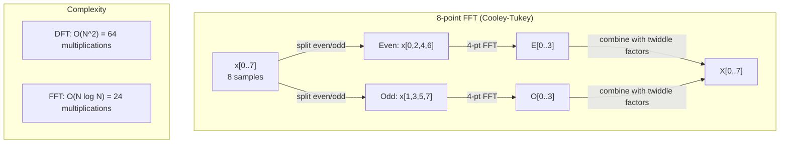
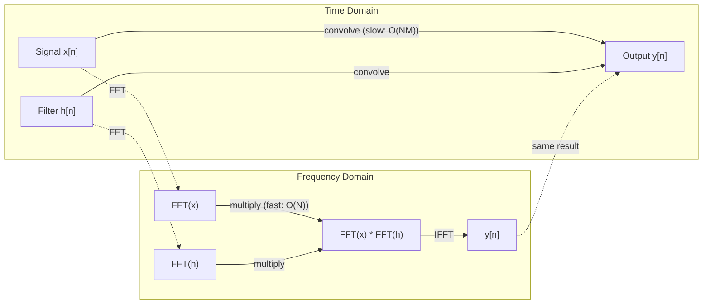

# 傅里叶变换(Fourier Transform)

> 每个信号都是正弦波的和。傅里叶变换告诉你它们是什么。

**类型:** 构建
**语言:** Python
**前置知识:** 阶段1，第01-04课，第19课（复数）
**时间:** ~90分钟

## 学习目标

- 从头实现DFT，并与O(N log N)的Cooley-Tukey FFT进行验证
- 解释频率系数：从信号中提取幅度、相位和功率谱
- 应用卷积定理(Convolution Theorem)通过FFT乘法执行卷积
- 将傅里叶频率分解与Transformer位置编码和CNN卷积层联系起来

## 问题

音频记录是随时间变化的一系列压力测量值。股票价格是随天数变化的一系列数值。图像是随空间变化的像素强度网格。所有这些都是在时域（或空域）中的数据。你看到的是某些索引上数值的变化。

但许多模式在时域中是看不见的。这个音频信号是纯音还是和弦？这个股票价格是否有周周期？这个图像是否有重复纹理？这些问题涉及频率内容，而时域隐藏了它们。

傅里叶变换将数据从时域转换到频域。它取一个信号并将其分解为不同频率的正弦波。每个正弦波都有一个幅度（强度）和一个相位（起始位置）。傅里叶变换告诉你这两者。

这对机器学习很重要，因为频域思维无处不在。卷积神经网络执行卷积，这在频域中是乘法。Transformer位置编码使用频率分解来表示位置。音频模型（语音识别、音乐生成）在频谱图（频率表示的声音）上操作。时间序列模型寻找周期模式。理解傅里叶变换为你提供了处理所有这些的词汇。

## 核心概念

### DFT定义

给定N个样本x[0], x[1], ..., x[N-1]，离散傅里叶变换(Discrete Fourier Transform)产生N个频率系数X[0], X[1], ..., X[N-1]：

```
X[k] = sum_{n=0}^{N-1} x[n] * e^(-2*pi*i*k*n/N)

for k = 0, 1, ..., N-1
```

每个X[k]是一个复数。其幅度|X[k]|告诉你频率k的幅度。其相位angle(X[k])告诉你该频率的相位偏移。

关键洞察：`e^(-2*pi*i*k*n/N)`是频率k处的旋转相量(rotating phasor)。DFT计算信号与N个等间距频率之间的相关性。如果信号在频率k处有能量，则相关性很大；否则接近零。

### 每个系数的含义

**X[0]：直流分量(DC component)。** 这是所有样本的和——与均值成正比。它表示信号的恒定（零频率）偏移。

```
X[0] = sum_{n=0}^{N-1} x[n] * e^0 = sum of all samples
```

**X[k]（1 <= k <= N/2）：正频率(positive frequencies)。** X[k]表示每N个样本中频率k个周期。更高的k意味着更高的频率（更快的振荡）。

**X[N/2]：奈奎斯特频率(Nyquist frequency)。** 用N个样本可以表示的最高频率。高于此频率会出现混叠(aliasing)——高频伪装成低频。

**X[k]（N/2 < k < N）：负频率(negative frequencies)。** 对于实值信号，X[N-k] = conj(X[k])。负频率是正频率的镜像。这就是有用信息在前N/2 + 1个系数中的原因。

### 逆DFT(Inverse DFT)

逆DFT从频率系数重建原始信号：

```
x[n] = (1/N) * sum_{k=0}^{N-1} X[k] * e^(2*pi*i*k*n/N)

for n = 0, 1, ..., N-1
```

与前向DFT的唯一区别：指数中的符号为正（非负），并且有1/N的归一化因子。

逆DFT是完美重建。没有信息丢失。你可以从时域到频域，再返回，没有任何误差。DFT是一种基变换(basis change)——它在不同的坐标系中重新表达相同的信息。

### FFT：使其快速

上述定义的DFT是O(N^2)：对于N个输出系数中的每一个，你要对N个输入样本求和。对于N=100万，那就是10^12次运算。

快速傅里叶变换(Fast Fourier Transform, FFT)以O(N log N)计算相同的结果。对于N=100万，大约是2000万次运算，而不是一万亿。这使得频率分析变得实用。

Cooley-Tukey算法（最常见的FFT）通过分治法工作：

1. 将信号分成偶数索引和奇数索引样本。
2. 递归计算每一半的DFT。
3. 使用“旋转因子(twiddle factors)” e^(-2*pi*i*k/N)组合两个半尺寸的DFT。

```
X[k] = E[k] + e^(-2*pi*i*k/N) * O[k]          for k = 0, ..., N/2 - 1
X[k + N/2] = E[k] - e^(-2*pi*i*k/N) * O[k]    for k = 0, ..., N/2 - 1

where E = DFT of even-indexed samples
      O = DFT of odd-indexed samples
```

对称性意味着每一层递归做O(N)工作，共有log2(N)层。总计：O(N log N)。



FFT要求信号长度是2的幂。在实践中，信号会被零填充到下一个2的幂。

### 频谱分析

**功率谱(power spectrum)** 是|X[k]|^2——每个频率系数的幅度平方。它显示了每个频率上有多少能量。

**相位谱**是angle(X[k])——每个频率的相位偏移。对于大多数分析任务，你关心的是功率谱而忽略相位。

```
Power at frequency k:  P[k] = |X[k]|^2 = X[k].real^2 + X[k].imag^2
Phase at frequency k:  phi[k] = atan2(X[k].imag, X[k].real)
```

### 频率分辨率

DFT的频率分辨率取决于样本数N和采样率fs。

```
Frequency of bin k:      f_k = k * fs / N
Frequency resolution:    delta_f = fs / N
Maximum frequency:       f_max = fs / 2  (Nyquist)
```

要分辨两个接近的频率，你需要更多样本。要捕获高频，你需要更高的采样率。

### 卷积定理

这是信号处理中最重要的结果之一，且与CNN直接相关。

**时域中的卷积等于频域中的逐点相乘。**

```
x * h = IFFT(FFT(x) . FFT(h))

where * is convolution and . is element-wise multiplication
```

为什么重要：

- 直接卷积两个长度分别为N和M的信号需要O(N*M)次操作。
- 基于FFT的卷积需要O(N log N)：变换两者，相乘，再变换回来。
- 对于大卷积核，FFT卷积速度显著更快。
- 这正是大感受野的卷积层中所做的。

注意：DFT计算的是循环卷积（信号环绕）。对于线性卷积（无环绕），在计算前将两个信号都补零至长度N+M-1。



### 加窗

DFT假设信号是周期性的——它将N个样本视为无限重复信号的一个周期。如果信号的起始值和结束值不同，这会在边界处产生不连续性，表现为虚假的高频内容。这称为频谱泄漏。

加窗通过在计算DFT前将信号两端逐渐衰减到零来减少泄漏。

常见窗函数：

|  窗函数  |  形状  |  主瓣宽度  |  旁瓣电平  |  使用场景  |
|--------|-------|----------------|-----------------|----------|
|  矩形窗  |  平坦（无窗）  |  最窄  |  最高（-13 dB）  |  当信号在N个样本中恰好是周期性的  |
| 汉宁窗  |  升余弦  |  中等  |  低（-31 dB）  |  通用频谱分析  |
| 海明窗  |  修正余弦  |  中等  |  更低（-42 dB）  |  音频处理、语音分析  |
| 布莱克曼窗  |  三余弦  |  宽  |  非常低（-58 dB）  |  当旁瓣抑制是关键时  |

```
Hann window:    w[n] = 0.5 * (1 - cos(2*pi*n / (N-1)))
Hamming window: w[n] = 0.54 - 0.46 * cos(2*pi*n / (N-1))
```

在DFT之前，将窗函数与信号逐点相乘：`X = DFT(x * w)`。

### DFT性质

|  性质  |  时域  |  频域  |
|----------|-------------|-----------------|
|  线性  |  a*x + b*y  |  a*X + b*Y  |
|  时移  |  x[n - k]  |  X[f] * e^(-2*pi*i*f*k/N)  |
|  频移  |  x[n] * e^(2*pi*i*f0*n/N)  |  X[f - f0]  |
|  卷积  |  x * h  |  X * H（逐点）  |
|  乘法  |  x * h（逐点）  |  X * H（循环卷积，缩放1/N）  |
|  帕塞瓦尔定理  |  sum |x[n]|^2  |  (1/N) * sum |X[k]|^2  |  |  |  |  |
|  共轭对称（实输入）  |  x[n]为实数  |  X[k] = conj(X[N-k])  |

帕塞瓦尔定理说总能量在两种域中是相同的。能量在变换过程中守恒。

### 与位置编码的联系

原始Transformer使用正弦位置编码：

```
PE(pos, 2i)   = sin(pos / 10000^(2i/d_model))
PE(pos, 2i+1) = cos(pos / 10000^(2i/d_model))
```

每一对维度(2i, 2i+1)以不同频率振荡。频率从高（维度0,1）到低（最后维度）呈几何级数分布。这使得每个位置在所有频带上都有独特的模式——类似于傅里叶系数唯一标识信号的方式。

这提供的关键性质：

- **唯一性：** 没有两个位置具有相同的编码。
- **有界值：** sin和cos始终在[-1, 1]内。
- **相对位置：** 位置p+k的编码可以表示为位置p编码的线性函数。模型可以学会关注相对位置。

### 与CNN的联系

卷积层通过在整个信号或图像上滑动，将学习到的滤波器（卷积核）应用于输入。数学上，这就是卷积操作。

根据卷积定理，这等价于：
1. 对输入进行FFT
2. 对卷积核进行FFT
3. 在频域中相乘
4. 对结果进行IFFT

标准CNN实现使用直接卷积（对小尺寸3x3卷积核更快）。但对于大卷积核或全局卷积，基于FFT的方法明显更快。一些架构（如FNet）完全用FFT替代注意力机制，以O(N log N)而非O(N^2)的复杂度实现了有竞争力的精度。

### 声谱图(spectrogram)和短时傅里叶变换

单个FFT给出了整个信号的频率内容，但完全没有说明这些频率何时出现。一个啁啾信号（频率随时间增加的信号）和一个和弦（所有频率同时出现）可以有相同的幅度谱。

短时傅里叶变换通过计算信号重叠窗口上的FFT解决了这个问题。结果是一个声谱图：一个二维表示，时间在一个轴上，频率在另一个轴上。每个点的强度显示该频率在该时间的能量。

```
STFT procedure:
1. Choose a window size (e.g., 1024 samples)
2. Choose a hop size (e.g., 256 samples -- 75% overlap)
3. For each window position:
   a. Extract the windowed segment
   b. Apply a Hann/Hamming window
   c. Compute FFT
   d. Store the magnitude spectrum as one column of the spectrogram
```

声谱图是音频机器学习模型的标准输入表示。语音识别模型（Whisper、DeepSpeech）基于梅尔声谱图(mel-spectrogram)——将频率映射到梅尔尺度上的声谱图，这更符合人类音高感知。

### 混叠(aliasing)

如果信号包含高于fs/2（奈奎斯特频率）的频率，以采样率fs进行采样将产生混叠副本。一个90 Hz的信号以100 Hz采样看起来与一个10 Hz的信号完全相同。仅凭样本无法区分它们。

```
Example:
  True signal: 90 Hz sine wave
  Sampling rate: 100 Hz
  Apparent frequency: 100 - 90 = 10 Hz

  The samples from the 90 Hz signal at 100 Hz sampling rate
  are identical to the samples from a 10 Hz signal.
  No amount of math can recover the original 90 Hz.
```

这就是模数转换器包含抗混叠滤波器(anti-aliasing filter)的原因，该滤波器在采样前去除高于奈奎斯特频率的频率。在机器学习中，当对特征图进行下采样而没有适当的低通滤波时，会出现混叠——一些架构通过抗混叠池化层(anti-aliased pooling layer)解决这个问题。

### 零填充并不能提高分辨率

一个常见的误解：在FFT之前对信号进行零填充可以提高频率分辨率。事实并非如此。零填充在现有频率bin之间进行插值，得到更平滑的频谱。但它无法揭示原始样本中不存在的频率细节。

真正的频率分辨率仅取决于观测时间T = N / fs。要分辨相距delta_f的两个频率，至少需要T = 1 / delta_f秒的数据。任何数量的零填充都无法改变这一基本极限。

```figure
fourier-synthesis
```

## 动手构建

### 步骤1：从头实现DFT

O(N^2)的DFT直接来自定义。

```python
import math

class Complex:
    ...

def dft(x):
    N = len(x)
    result = []
    for k in range(N):
        total = Complex(0, 0)
        for n in range(N):
            angle = -2 * math.pi * k * n / N
            w = Complex(math.cos(angle), math.sin(angle))
            xn = x[n] if isinstance(x[n], Complex) else Complex(x[n])
            total = total + xn * w
        result.append(total)
    return result
```

### 步骤2：逆DFT

相同的结构，指数为正，除以N。

```python
def idft(X):
    N = len(X)
    result = []
    for n in range(N):
        total = Complex(0, 0)
        for k in range(N):
            angle = 2 * math.pi * k * n / N
            w = Complex(math.cos(angle), math.sin(angle))
            total = total + X[k] * w
        result.append(Complex(total.real / N, total.imag / N))
    return result
```

### 步骤3：FFT（Cooley-Tukey）

递归FFT要求长度为2的幂。拆分为偶数索引和奇数索引，递归，用旋转因子(twiddle factor)合并。

```python
def fft(x):
    N = len(x)
    if N <= 1:
        return [x[0] if isinstance(x[0], Complex) else Complex(x[0])]
    if N % 2 != 0:
        return dft(x)

    even = fft([x[i] for i in range(0, N, 2)])
    odd = fft([x[i] for i in range(1, N, 2)])

    result = [Complex(0)] * N
    for k in range(N // 2):
        angle = -2 * math.pi * k / N
        twiddle = Complex(math.cos(angle), math.sin(angle))
        t = twiddle * odd[k]
        result[k] = even[k] + t
        result[k + N // 2] = even[k] - t
    return result
```

### 步骤4：频谱分析辅助工具

```python
def power_spectrum(X):
    return [xk.real ** 2 + xk.imag ** 2 for xk in X]

def convolve_fft(x, h):
    N = len(x) + len(h) - 1
    padded_N = 1
    while padded_N < N:
        padded_N *= 2

    x_padded = x + [0.0] * (padded_N - len(x))
    h_padded = h + [0.0] * (padded_N - len(h))

    X = fft(x_padded)
    H = fft(h_padded)

    Y = [xk * hk for xk, hk in zip(X, H)]

    y = idft(Y)
    return [y[n].real for n in range(N)]
```

## 使用它

对于实际工作，使用numpy的FFT（底层由高度优化的C库支持）。

```python
import numpy as np

signal = np.sin(2 * np.pi * 5 * np.arange(256) / 256)
spectrum = np.fft.fft(signal)
freqs = np.fft.fftfreq(256, d=1/256)

power = np.abs(spectrum) ** 2

positive_freqs = freqs[:len(freqs)//2]
positive_power = power[:len(power)//2]
```

对于加窗和更高级的频谱分析：

```python
from scipy.signal import windows, stft

window = windows.hann(256)
windowed = signal * window
spectrum = np.fft.fft(windowed)
```

对于卷积：

```python
from scipy.signal import fftconvolve

result = fftconvolve(signal, kernel, mode='full')
```

对于频谱图：

```python
from scipy.signal import stft

frequencies, times, Zxx = stft(signal, fs=sample_rate, nperseg=256)
spectrogram = np.abs(Zxx) ** 2
```

频谱图矩阵的形状为 (频率数, 时间帧数)。每一列是一个时间窗口的功率谱。这是音频机器学习模型作为输入的格式。

## 发布

运行`code/fourier.py`以生成`outputs/prompt-spectral-analyzer.md`。

## 练习

1. **纯音识别。** 创建一个信号，包含一个频率未知（1到50 Hz之间）的正弦波，以128 Hz采样1秒。使用DFT识别该频率。验证答案是否匹配。然后添加标准差为0.5的高斯噪声，重复实验。噪声如何影响频谱？

2. **FFT与DFT验证。** 生成长度为64的随机信号。分别计算DFT（O(N^2)）和FFT。验证所有系数匹配到1e-10以内。对长度为256、512、1024和2048的信号计时两种函数。绘制DFT时间与FFT时间的比值图。

3. **卷积定理的示例证明。** 创建信号 x = [1, 2, 3, 4, 0, 0, 0, 0] 和滤波器 h = [1, 1, 1, 0, 0, 0, 0, 0]。直接计算它们的循环卷积（嵌套循环）。然后通过FFT计算（变换、相乘、逆变换）。验证结果匹配。现在通过适当补零进行线性卷积。

4. **窗函数效应。** 创建一个信号，是10 Hz和12 Hz两个正弦波之和（非常接近）。以128 Hz采样1秒。分别计算无窗、汉宁窗和汉明窗下的功率谱。哪个窗函数最容易区分两个峰值？为什么？

5. **位置编码分析。** 为d_model = 128和max_pos = 512生成正弦位置编码。对于每一对位置(p1, p2)，计算它们编码的点积。证明点积只依赖于|p1 - p2|，而不是绝对位置。随着距离增加，点积如何变化？

## 关键术语

| 术语  |  含义 |
|------|---------------|
|  DFT（离散傅里叶变换）  |  将N个时域样本转换为N个频域系数。每个系数是与该频率复正弦波的相关性。 |
|  FFT（快速傅里叶变换）  |  一种O(N log N)计算DFT的算法。Cooley-Tukey算法递归地分割奇偶索引。 |
|  逆DFT  |  从频率系数重建时域信号。与DFT公式相同，但指数符号翻转并乘以1/N缩放。 |
|  频率仓  |  DFT输出中每个索引k代表频率k*fs/N Hz。“仓”是离散频率槽。 |
|  直流分量  |  X[0]，零频率系数。与信号均值成正比。 |
|  奈奎斯特频率  |  fs/2，在采样率fs下可表示的最大频率。高于此频率会出现混叠。 |
|  功率谱  |  |X[k]|^2，每个频率系数幅度的平方。显示能量在频率上的分布。 |  |  |
|  相位谱  |  angle(X[k])，每个频率分量的相位偏移。在分析中常被忽略。 |
|  频谱泄漏  |  由于将非周期信号视为周期信号而产生的虚假频率内容。通过加窗减少。 |
|  窗函数  |  在DFT之前应用的锥形函数（汉宁、汉明、布莱克曼），用于减少频谱泄漏。 |
|  旋转因子  |  在FFT蝶形运算中用于组合子DFT的复指数 e^(-2*pi*i*k/N)。 |
|  卷积定理  |  时域卷积等于频域逐点相乘。信号处理和CNN的基础。 |
|  循环卷积  |  信号环绕的卷积。这是DFT自然计算的结果。 |
|  线性卷积  |  无环绕的标准卷积。通过在DFT前补零实现。 |
|  帕塞瓦尔定理  |  傅里叶变换保持总能量守恒。sum |x[n]|^2 = (1/N) sum |X[k]|^2。 |  |  |  |  |
|  混叠  |  当高于奈奎斯特的频率因采样率不足而表现为较低频率时出现。 |

## 延伸阅读

- [Cooley & Tukey: An Algorithm for the Machine Calculation of Complex Fourier Series (1965)](https://www.ams.org/journals/mcom/1965-19-090/S0025-5718-1965-0178586-1/) - 改变计算的原始FFT论文
- [Cooley & Tukey: An Algorithm for the Machine Calculation of Complex Fourier Series (1965)](https://www.ams.org/journals/mcom/1965-19-090/S0025-5718-1965-0178586-1/) - 傅里叶变换的最佳可视化介绍
- [Cooley & Tukey: An Algorithm for the Machine Calculation of Complex Fourier Series (1965)](https://www.ams.org/journals/mcom/1965-19-090/S0025-5718-1965-0178586-1/) - 在Transformer中用FFT替换自注意力
- [Cooley & Tukey: An Algorithm for the Machine Calculation of Complex Fourier Series (1965)](https://www.ams.org/journals/mcom/1965-19-090/S0025-5718-1965-0178586-1/) - 免费在线教科书，深入介绍FFT、加窗和谱分析
- [Cooley & Tukey: An Algorithm for the Machine Calculation of Complex Fourier Series (1965)](https://www.ams.org/journals/mcom/1965-19-090/S0025-5718-1965-0178586-1/) - 从傅里叶频率分解推导出的正弦位置编码
- [Cooley & Tukey: An Algorithm for the Machine Calculation of Complex Fourier Series (1965)](https://www.ams.org/journals/mcom/1965-19-090/S0025-5718-1965-0178586-1/) - 使用梅尔频谱图作为输入表示的语音识别
