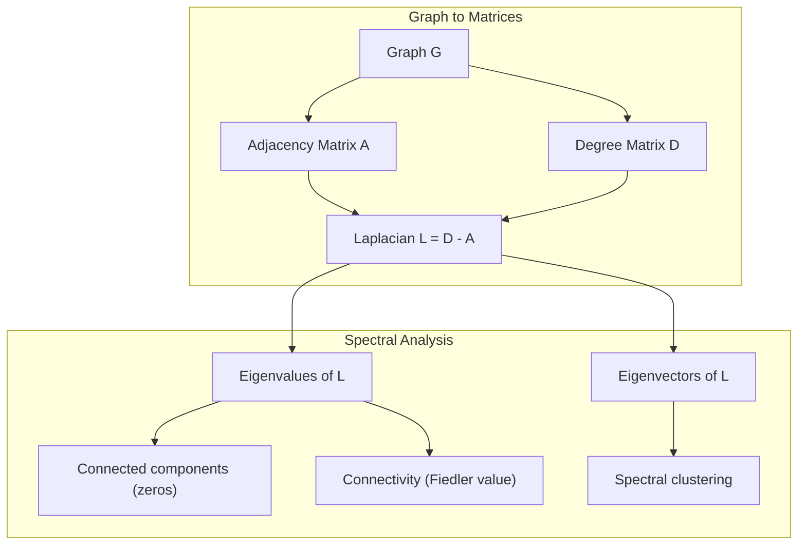
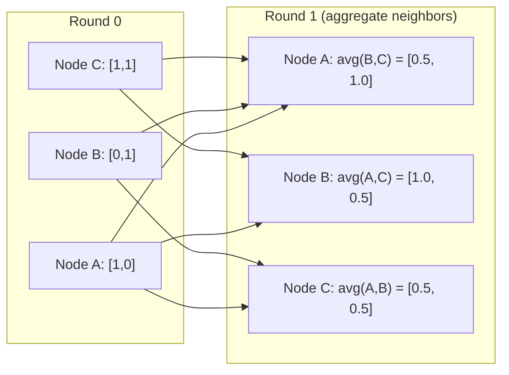

# 机器学习图论

> 图是关系的数据结构。如果你的数据存在连接，你就需要图论。

**类型：** 构建
**语言：** Python
**前置知识：** 阶段1，第01-03课（线性代数、矩阵）
**时间：** ~90分钟

## 学习目标

- 构建一个带有邻接矩阵/列表表示的图类，并实现BFS和DFS遍历
- 计算图的拉普拉斯矩阵，利用其特征值检测连通分量和聚类节点
- 实现一轮GNN风格的消息传递，作为归一化邻接矩阵乘法
- 应用谱聚类，使用Fiedler向量对图进行划分

## 问题

社交网络、分子、知识库、引文网络、道路地图——这些都是图。传统机器学习将数据视为平面表格。每一行独立。每一列是特征。但当连接结构重要时，表格就失效了。

考虑一个社交网络。你想预测用户会购买什么产品。他们的购买历史很重要。但他们朋友的购买历史更重要。连接携带信号。

或者考虑一个分子。你想预测它是否与蛋白质结合。原子很重要，但真正重要的是原子之间如何成键。结构就是数据。

图神经网络(GNNs)是深度学习领域增长最快的领域。它们驱动药物发现、社交推荐、欺诈检测和知识图谱推理。每个GNN都建立在相同的基础上：基本的图论。

你需要四样东西：
1. 一种将图表示为矩阵的方法（这样你就可以对它们进行乘法运算）
2. 遍历算法以探索图结构
3. 拉普拉斯矩阵——谱图理论中最重要的矩阵
4. 消息传递——使GNN工作的操作

## 核心概念

### 图：节点和边

图G = (V, E)由顶点（节点）V和边E组成。每条边连接两个节点。

**有向与无向。** 在无向图中，边(u, v)表示u连接到v且v连接到u。在有向图中，边(u, v)表示u指向v，但不一定反过来。

**加权与无权。** 在无权图中，边要么存在要么不存在。在加权图中，每条边有一个数值权重——距离、成本、强度。

|  图类型  |  示例  |
|-----------|---------|
|  无向、无权  |  Facebook好友网络  |
|  有向、无权  |  Twitter关注网络  |
|  无向、加权  |  道路地图（距离）  |
|  有向、加权  |  网页链接（PageRank分数）  |

### 邻接矩阵

邻接矩阵A是核心表示。对于有n个节点的图：

```
A[i][j] = 1    if there is an edge from node i to node j
A[i][j] = 0    otherwise
```

对于无向图，A是对称的：A[i][j] = A[j][i]。对于加权图，A[i][j] = 边(i, j)的权重。

**示例——一个三角形：**

```
Nodes: 0, 1, 2
Edges: (0,1), (1,2), (0,2)

A = [[0, 1, 1],
     [1, 0, 1],
     [1, 1, 0]]
```

邻接矩阵是每个GNN的输入。对A的矩阵运算对应于对图的运算。

### 度

节点的度是连接到它的边的数量。对于有向图，有入度（进入的边）和出度（出去的边）。

度矩阵D是对角矩阵：

```
D[i][i] = degree of node i
D[i][j] = 0    for i != j
```

对于三角形示例：D = diag(2, 2, 2) 因为每个节点连接到其他两个节点。

度告诉你节点的重要性。高度数 = 枢纽节点。网络的度分布揭示了其结构。社交网络遵循幂律（少数枢纽，许多叶子节点）。随机图具有泊松分布的度。

### BFS和DFS

两种基本的图遍历算法。两者都需要。

**广度优先搜索（Breadth-First Search, BFS）：** 首先探索所有邻居，然后是邻居的邻居。使用队列（FIFO）。

```
BFS from node 0:
  Visit 0
  Queue: [1, 2]        (neighbors of 0)
  Visit 1
  Queue: [2, 3]        (add neighbors of 1)
  Visit 2
  Queue: [3]           (neighbors of 2 already visited)
  Visit 3
  Queue: []            (done)
```

BFS 在无权图中找到最短路径。从起点到任意节点的距离等于该节点首次被发现时的 BFS 层级。这就是为什么 BFS 被用于社交网络中的跳数距离。

**深度优先搜索（Depth-First Search, DFS）：** 在回溯之前尽可能深入。使用栈（LIFO）或递归。

```
DFS from node 0:
  Visit 0
  Stack: [1, 2]        (neighbors of 0)
  Visit 2               (pop from stack)
  Stack: [1, 3]         (add neighbors of 2)
  Visit 3               (pop from stack)
  Stack: [1]
  Visit 1               (pop from stack)
  Stack: []             (done)
```

DFS 可用于：
- 寻找连通分量（从未访问节点运行 DFS）
- 检测环（DFS 树中的回边）
- 拓扑排序（逆向 DFS 完成顺序）

|  算法  |  数据结构  |  寻找  |  用例  |
|-----------|---------------|-------|----------|
|  BFS  |  队列  |  最短路径  |  社交网络距离、知识图谱遍历  |
|  DFS  |  栈  |  分量、环  |  连通性、拓扑排序  |

### 图拉普拉斯矩阵（Graph Laplacian）

L = D - A。谱图理论中最重要的矩阵。

对于三角形：

```
D = [[2, 0, 0],    A = [[0, 1, 1],    L = [[2, -1, -1],
     [0, 2, 0],         [1, 0, 1],         [-1, 2, -1],
     [0, 0, 2]]         [1, 1, 0]]         [-1, -1,  2]]
```

拉普拉斯矩阵具有显著的性质：

1. **L 是半正定的。** 所有特征值 >= 0。

2. **零特征值的个数等于连通分量的个数。** 连通图恰好有一个零特征值。具有 3 个不连通分量的图有三个零特征值。

3. **最小的非零特征值（Fiedler 值）度量连通性。** 大的 Fiedler 值意味着图高度连通。小的 Fiedler 值意味着图有一个薄弱点——一个瓶颈。

4. **Fiedler 值的特征向量（Fiedler 向量）揭示了最佳分割。** 值为正的节点归为一组，值为负的节点归为另一组。这就是谱聚类（spectral clustering）。



### 谱性质（Spectral Properties）

邻接矩阵和拉普拉斯矩阵的特征值无需遍历就能揭示结构性质。

**谱聚类**的工作原理如下：
1. 计算拉普拉斯矩阵 L
2. 找到 L 的 k 个最小特征向量（跳过第一个，对于连通图它是全1向量）
3. 将这些特征向量作为每个节点的新坐标
4. 在这些坐标上运行 k-means

为什么这样有效？拉普拉斯矩阵的特征向量编码了图上“最平滑”的函数。连接良好的节点获得相似的特征向量值。被瓶颈分隔的节点获得不同的值。特征向量自然地分离簇。

**随机游走连接。** 归一化拉普拉斯矩阵与图上的随机游走相关。随机游走的稳态分布与节点度成正比。混合时间（游走收敛的速度）取决于谱间隙（spectral gap）。

### 消息传递（Message Passing）

图神经网络的核心操作。每个节点从其邻居收集消息，聚合它们，并更新自身状态。

```
h_v^(k+1) = UPDATE(h_v^(k), AGGREGATE({h_u^(k) : u in neighbors(v)}))
```

在最简单的形式中，AGGREGATE = 均值，UPDATE = 线性变换 + 激活函数：

```
h_v^(k+1) = sigma(W * mean({h_u^(k) : u in neighbors(v)}))
```

这实际上是矩阵乘法。如果 H 是全体节点特征的矩阵，A 是邻接矩阵：

```
H^(k+1) = sigma(A_norm * H^(k) * W)
```

其中 A_norm 是归一化邻接矩阵（每行和为1）。

一轮消息传递让每个节点“看到”其直接邻居。两轮让它看到邻居的邻居。K 轮让每个节点获得其 K 跳邻域内的信息。



### 概念与机器学习应用

|  概念  |  机器学习应用  |
|---------|---------------|
|  邻接矩阵(Adjacency matrix)  |  图神经网络输入表示  |
|  图拉普拉斯(Graph Laplacian)  |  谱聚类、社区检测  |
|  广度优先搜索/深度优先搜索(BFS/DFS)  |  知识图谱遍历、路径查找  |
|  度分布(Degree distribution)  |  节点重要性、特征工程  |
|  消息传递(Message passing)  |  图神经网络层（图卷积网络、图注意力网络、GraphSAGE）  |
|  拉普拉斯矩阵的特征值(Eigenvalues of L)  |  社区检测、图分割  |
|  谱聚类(Spectral clustering)  |  无监督节点分组  |
|  PageRank  |  节点重要性、网络搜索  |

```figure
graph-degree-distribution
```

## 动手构建

### 步骤1：从零实现图类

```python
class Graph:
    def __init__(self, n_nodes, directed=False):
        self.n = n_nodes
        self.directed = directed
        self.adj = {i: {} for i in range(n_nodes)}

    def add_edge(self, u, v, weight=1.0):
        self.adj[u][v] = weight
        if not self.directed:
            self.adj[v][u] = weight

    def neighbors(self, node):
        return list(self.adj[node].keys())

    def degree(self, node):
        return len(self.adj[node])

    def adjacency_matrix(self):
        import numpy as np
        A = np.zeros((self.n, self.n))
        for u in range(self.n):
            for v, w in self.adj[u].items():
                A[u][v] = w
        return A

    def degree_matrix(self):
        import numpy as np
        D = np.zeros((self.n, self.n))
        for i in range(self.n):
            D[i][i] = self.degree(i)
        return D

    def laplacian(self):
        return self.degree_matrix() - self.adjacency_matrix()
```

邻接表(`self.adj`)高效存储邻居节点。邻接矩阵转换使用numpy，因为所有谱操作都需要它。

### 步骤2：广度优先搜索和深度优先搜索

```python
from collections import deque

def bfs(graph, start):
    visited = set()
    order = []
    distances = {}
    queue = deque([(start, 0)])
    visited.add(start)
    while queue:
        node, dist = queue.popleft()
        order.append(node)
        distances[node] = dist
        for neighbor in graph.neighbors(node):
            if neighbor not in visited:
                visited.add(neighbor)
                queue.append((neighbor, dist + 1))
    return order, distances


def dfs(graph, start):
    visited = set()
    order = []
    stack = [start]
    while stack:
        node = stack.pop()
        if node in visited:
            continue
        visited.add(node)
        order.append(node)
        for neighbor in reversed(graph.neighbors(node)):
            if neighbor not in visited:
                stack.append(neighbor)
    return order
```

广度优先搜索使用deque（双端队列）实现O(1)的popleft操作。深度优先搜索使用列表作为栈。两者都精确访问每个节点一次——时间复杂度为O(V + E)。

### 步骤3：连通分量与拉普拉斯特征值

```python
def connected_components(graph):
    visited = set()
    components = []
    for node in range(graph.n):
        if node not in visited:
            order, _ = bfs(graph, node)
            visited.update(order)
            components.append(order)
    return components


def laplacian_eigenvalues(graph):
    import numpy as np
    L = graph.laplacian()
    eigenvalues = np.linalg.eigvalsh(L)
    return eigenvalues
```

`eigvalsh`用于对称矩阵——对于无向图，拉普拉斯矩阵总是对称的。它按升序返回特征值。统计零值的个数即可得到连通分量的数量。

### 步骤4：谱聚类

```python
def spectral_clustering(graph, k=2):
    import numpy as np
    L = graph.laplacian()
    eigenvalues, eigenvectors = np.linalg.eigh(L)
    features = eigenvectors[:, 1:k+1]

    labels = np.zeros(graph.n, dtype=int)
    for i in range(graph.n):
        if features[i, 0] >= 0:
            labels[i] = 0
        else:
            labels[i] = 1
    return labels
```

当k=2时，Fiedler向量的符号将图分成两个簇。当k>2时，你需要对前k个特征向量（排除平凡的[1,1,...,1]向量）运行k-means算法。

### 步骤5：消息传递

```python
def message_passing(graph, features, weight_matrix):
    import numpy as np
    A = graph.adjacency_matrix()
    row_sums = A.sum(axis=1, keepdims=True)
    row_sums[row_sums == 0] = 1
    A_norm = A / row_sums
    aggregated = A_norm @ features
    output = aggregated @ weight_matrix
    return output
```

这是图神经网络消息传递的一轮。每个节点的新特征是邻居特征的加权平均，经权重矩阵变换。堆叠多轮可以传播更远的信息。

## 使用它

使用networkx和numpy，同样的操作可以一行实现：

```python
import networkx as nx
import numpy as np

G = nx.karate_club_graph()

A = nx.adjacency_matrix(G).toarray()
L = nx.laplacian_matrix(G).toarray()

eigenvalues = np.linalg.eigvalsh(L.astype(float))
print(f"Smallest eigenvalues: {eigenvalues[:5]}")
print(f"Connected components: {nx.number_connected_components(G)}")

communities = nx.community.greedy_modularity_communities(G)
print(f"Communities found: {len(communities)}")

pr = nx.pagerank(G)
top_nodes = sorted(pr.items(), key=lambda x: x[1], reverse=True)[:5]
print(f"Top 5 PageRank nodes: {top_nodes}")
```

networkx通过优化的C后端处理任意大小的图。在生产环境中使用它。使用你自己从零实现的代码来理解其工作原理。

### numpy谱分析

```python
import numpy as np

A = np.array([
    [0, 1, 1, 0, 0],
    [1, 0, 1, 0, 0],
    [1, 1, 0, 1, 0],
    [0, 0, 1, 0, 1],
    [0, 0, 0, 1, 0]
])

D = np.diag(A.sum(axis=1))
L = D - A

eigenvalues, eigenvectors = np.linalg.eigh(L)
print(f"Eigenvalues: {np.round(eigenvalues, 4)}")
print(f"Fiedler value: {eigenvalues[1]:.4f}")
print(f"Fiedler vector: {np.round(eigenvectors[:, 1], 4)}")

fiedler = eigenvectors[:, 1]
group_a = np.where(fiedler >= 0)[0]
group_b = np.where(fiedler < 0)[0]
print(f"Cluster A: {group_a}")
print(f"Cluster B: {group_b}")
```

Fiedler向量承担了主要工作。正项在一个簇中，负项在另一个簇中。不需要迭代优化——仅需一次特征分解。

## 发布

本課(lesson)产出：
- `outputs/skill-graph-analysis.md`——分析图结构数据的技能参考

## 联系

|  概念  |  出现在何处  |
|---------|------------------|
|  邻接矩阵(Adjacency matrix)  |  图卷积网络、图注意力网络、GraphSAGE输入  |
|  拉普拉斯矩阵(Laplacian)  |  谱聚类、ChebNet滤波器  |
|  广度优先搜索(BFS)  |  知识图谱遍历、最短路径查询  |
|  消息传递(Message passing)  |  每个图神经网络层、神经消息传递  |
| 谱间隙(Spectral gap)  |  图的连通性，随机游走的混合时间 |
| 度分布(Degree distribution)  |  幂律网络，节点特征工程 |
| 连通分量(Connected components)  |  预处理，处理不连通图 |
| PageRank  |  节点重要性排序，注意力初始化 |

GNNs值得特别提及。GCN的图卷积操作（Kipf & Welling, 2017）使用了添加自环的邻接矩阵，A_hat = A + I：

```text
H^(l+1) = sigma(D_hat^(-1/2) * A_hat * D_hat^(-1/2) * H^(l) * W^(l))
```

其中A_hat = A + I（邻接加自环），D_hat是A_hat的度矩阵。自环确保每个节点在聚合时包含自身特征。这正是一种对称归一化的消息传递。D_hat^(-1/2) * A_hat * D_hat^(-1/2)是归一化邻接矩阵。拉普拉斯矩阵出现是因为这个归一化与L_sym = I - D^(-1/2) * A * D^(-1/2)相关。理解拉普拉斯矩阵意味着理解GCN为何有效。

## 练习

1. **从头实现PageRank。**从均匀得分开始。每一步：score(v) = (1-d)/n + d * sum(score(u)/out_degree(u))，对所有指向v的u求和。使用d=0.85。迭代至收敛（变化<1e-6）。在一个小型网页图上测试。

2. **使用谱聚类发现社区。**创建一个具有两个明显分离的簇的图（例如，两个由一条边连接的团）。运行谱聚类并验证它找到了正确的分割。当添加更多跨簇边时会发生什么？

3. **实现Dijkstra算法**用于加权图中的最短路径。在同一图的均匀权重下与BFS进行比较。

4. **构建一个2层消息传递网络。**使用不同的权重矩阵应用两次消息传递。显示经过2轮后，每个节点具有来自其2跳邻居的信息。

5. **分析一个真实世界的图。**使用空手道俱乐部图（34个节点，78条边）。计算度分布、拉普拉斯特征值和谱聚类。将谱聚类结果与已知的真实分割进行比较。

## 关键术语

|  术语  |  人们的说法  |  实际含义  |
|------|----------------|----------------------|
|  图(Graph)  |  "节点与边"  |  一种表示成对关系的数学结构G=(V,E)  |
|  邻接矩阵(Adjacency matrix)  |  "连接表"  |  一个n x n矩阵，A[i][j] = 1表示节点i和j相连  |
|  度(Degree)  |  "节点的连接程度"  |  与一个节点相连的边的数量  |
|  拉普拉斯矩阵(Laplacian)  |  "D减去A"  |  L = D - A，其特征值揭示图结构的矩阵  |
|  Fiedler值(Fiedler value)  |  "代数连通度"  |  L的最小非零特征值，衡量图的连通程度  |
|  BFS  |  "逐层搜索"  |  先访问所有邻居再深入，寻找最短路径的遍历方式  |
|  DFS  |  "深度优先"  |  沿一条路径走到尽头再回溯的遍历方式  |
|  消息传递(Message passing)  |  "节点与邻居交流"  |  每个节点从邻居聚合信息，是GNN的核心  |
|  谱聚类(Spectral clustering)  |  "用特征向量聚类"  |  使用拉普拉斯矩阵的特征向量对图进行划分  |
|  连通分量(Connected component)  |  "独立片段"  |  每个节点都能到达其他节点的最大子图  |

## 延伸阅读

- **Kipf & Welling (2017)** -- “基于图卷积网络的半监督分类”（Semi-Supervised Classification with Graph Convolutional Networks）。这篇论文开启了现代GNN的时代，展示了谱图卷积可以简化为消息传递。
- **Spielman (2012)** -- “谱图理论”（Spectral Graph Theory）讲义。关于拉普拉斯矩阵、谱间隙和图划分的权威入门。
- **Hamilton (2020)** -- “图表示学习”（Graph Representation Learning）。从基础到应用全面介绍GNN的书籍。
- **Bronstein et al. (2021)** -- “几何深度学习：网格、群、图、测地线及规范”（Geometric Deep Learning: Grids, Groups, Graphs, Geodesics, and Gauges）。统一框架论文。
- **Veličković et al. (2018)** -- “图注意力网络”（Graph Attention Networks）。用注意力机制扩展消息传递。
