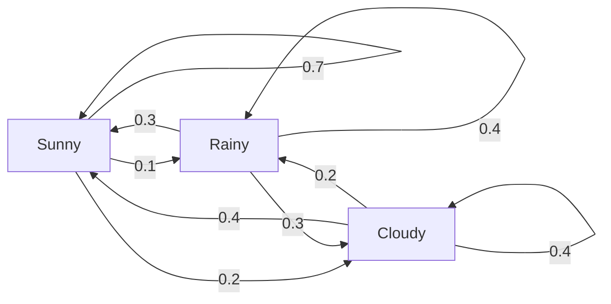
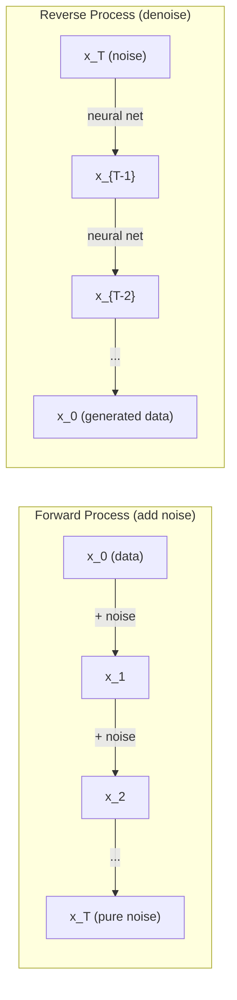

# 随机过程

> 具有结构的随机性。随机游走、马尔可夫链和扩散模型背后的数学。

**类型：** 学习
**语言：** Python
**先修知识：** 阶段1，第06-07课（概率论，贝叶斯）
**时间：** ~75分钟

## 学习目标

- 模拟一维和二维随机游走，并验证位移的sqrt(n)标度
- 构建马尔可夫链模拟器，并通过特征分解计算其平稳分布
- 实现Metropolis-Hastings MCMC和Langevin动力学，用于从目标分布采样
- 将前向扩散过程与布朗运动联系起来，并解释反向过程如何生成数据

## 问题

许多人工智能系统涉及随时间演变的随机性。不是静态的随机性——而是结构化的、序列化的随机性，其中每一步都依赖于之前的状态。

语言模型一次生成一个词元。每个词元依赖于之前的上下文。模型输出一个概率分布，从中采样，然后继续。这就是一个随机过程。

扩散模型逐步向图像添加噪声，直到变成纯静态。然后它们反转这个过程，逐步去噪，直到新图像出现。前向过程是一个马尔可夫链。反向过程是一个学习得到的、反向运行的马尔可夫链。

强化学习智能体在环境中采取动作。每个动作以某种概率导致新状态。智能体在随机世界中遵循随机策略。整个过程是一个马尔可夫决策过程。

MCMC采样——贝叶斯推断的支柱——构建了一个马尔可夫链，其平稳分布就是你想从中采样的后验分布。

所有这些都建立在四个基础概念之上：
1. 随机游走——最简单的随机过程
2. 马尔可夫链——具有转移矩阵的结构化随机性
3. Langevin动力学——带噪声的梯度下降
4. Metropolis-Hastings——从任意分布采样

## 核心概念

### 随机游走

从位置0开始。每一步，抛一枚均匀硬币。正面：向右移动（+1）。反面：向左移动（-1）。

经过n步后，你的位置是n个随机+/-1值的和。期望位置是0（游走是无偏的）。但离原点的期望距离以sqrt(n)增长。

这违反直觉。游走是公平的——没有向任何方向漂移。但随着时间的推移，它离起点越来越远。n步后的标准差为sqrt(n)。

```
Step 0:  Position = 0
Step 1:  Position = +1 or -1
Step 2:  Position = +2, 0, or -2
...
Step 100: Expected distance from origin ~ 10 (sqrt(100))
Step 10000: Expected distance from origin ~ 100 (sqrt(10000))
```

**在二维中**，游走以等概率向上、下、左或右移动。同样的sqrt(n)标度适用于离原点的距离。路径描绘出类似分形的图案。

**为什么是sqrt(n)？**每一步是+1或-1，概率相等。n步后，位置S_n = X_1 + X_2 + ... + X_n，其中每个X_i是+/-1。每一步的方差为1，且步长独立，所以Var(S_n) = n。标准差 = sqrt(n)。根据中心极限定理，S_n / sqrt(n)收敛到标准正态分布。

这种sqrt(n)标度在机器学习中随处可见。SGD噪声按1/sqrt(批次大小)标度。嵌入维度按sqrt(d)标度。平方根是独立随机加和的标志。

**与布朗运动的联系。** 取一个步长为1/sqrt(n)、每单位时间n步的随机游走。当n趋于无穷大时，游走收敛到布朗运动B(t)——一个连续时间过程，其中B(t)服从正态分布，均值为0，方差为t。

布朗运动是扩散的数学基础。它模拟了流体中粒子的随机抖动、股票价格的波动，以及——关键地——扩散模型中的噪声过程。

**赌徒破产问题。** 一个从位置k出发、在0和N处有吸收壁的随机游走。在到达0之前到达N的概率是多少？对于公平游走：P(到达N) = k/N。这出人意料地简单优雅。它与鞅理论相关——公平随机游走是一个鞅（期望未来值等于当前值）。

### 马尔可夫链

马尔可夫链是一个根据固定概率在状态之间转移的系统。关键性质：下一状态只依赖于当前状态，而不依赖于历史。

```
P(X_{t+1} = j | X_t = i, X_{t-1} = ...) = P(X_{t+1} = j | X_t = i)
```

这就是马尔可夫性质。它意味着你可以用转移矩阵P描述整个动力学：

```
P[i][j] = probability of going from state i to state j
```

P的每一行和为1（你必须去某个地方）。

**示例——天气：**

```
States: Sunny (0), Rainy (1), Cloudy (2)

P = [[0.7, 0.1, 0.2],    (if sunny: 70% sunny, 10% rainy, 20% cloudy)
     [0.3, 0.4, 0.3],    (if rainy: 30% sunny, 40% rainy, 30% cloudy)
     [0.4, 0.2, 0.4]]    (if cloudy: 40% sunny, 20% rainy, 40% cloudy)
```

从任何状态开始。经过多次转移，状态的分布收敛到平稳分布π，其中π * P = π。这是P的特征值1的左特征向量。

对于天气链，平稳分布可能是[0.53, 0.18, 0.29]——从长远来看，无论起始状态如何，晴天占53%的时间。



**计算平稳分布。** 有两种方法：

1. **幂法**：将任何初始分布反复乘以P。经过足够多次迭代后，它会收敛。
2. **特征值法**：找到P的特征值1的左特征向量。这是P^T的特征值1的特征向量。

两种方法都要求链满足收敛条件。

**收敛条件。** 马尔可夫链收敛到唯一的平稳分布当且仅当它是：
- **不可约的**：每个状态都可以从其他任何状态到达
- **非周期的**：链不会以固定周期循环

你在机器学习中遇到的大多数链都满足这两个条件。

**吸收态。** 一旦进入某个状态就永远无法离开（P[i][i]=1），则该状态是吸收态。吸收马尔可夫链对具有终止状态的过程进行建模——结束的游戏、流失的客户、到达文本结束标记的令牌序列。

**混合时间。** 链需要多少步才能“接近”平稳分布？形式上，即从平稳分布的总变差距离降至某个阈值以下所需的步数。快速混合=所需步数少。P 的谱间隙（1 减去第二大特征值）控制混合时间。间隙越大=混合越快。

### 与语言模型的联系

语言模型中的令牌生成近似于一个马尔可夫过程。给定当前上下文，模型输出下一个令牌的分布。温度控制分布的尖锐程度：

```
P(token_i) = exp(logit_i / temperature) / sum(exp(logit_j / temperature))
```

- 温度=1.0：标准分布
- 温度<1.0：更尖锐（更确定性）
- 温度>1.0：更平坦（更随机）
- 温度→0：argmax（贪婪）

Top-k 采样截断到概率最高的 k 个令牌。Top-p（核）采样截断到累积概率超过 p 的最小令牌集合。两者都修改了马尔可夫转移概率。

### 布朗运动

随机游走的连续时间极限。位置 B(t) 具有三个性质：
1. B(0)=0
2. B(t)-B(s) 服从正态分布，均值为 0，方差为 t-s（对于 t>s）
3. 非重叠区间上的增量是独立的

布朗运动是连续的，但处处不可微——它在每个尺度上随机抖动。路径在平面上具有分形维数 2。

在离散模拟中，你通过以下方式近似布朗运动：

```
B(t + dt) = B(t) + sqrt(dt) * z,    where z ~ N(0, 1)
```

sqrt(dt) 缩放很重要。它来自应用于随机游走的中心极限定理。

### 朗之万动力学

梯度下降寻找函数的最小值。朗之万动力学寻找与 exp(-U(x)/T) 成正比的概率分布，其中 U 是能量函数，T 是温度。

```
x_{t+1} = x_t - dt * gradient(U(x_t)) + sqrt(2 * T * dt) * z_t
```

作用在粒子上的有两个力：
1. **梯度力** (-dt*gradient(U))：推向低能量（如梯度下降）
2. **随机力** (sqrt(2*T*dt)*z)：推向随机方向（探索）

在温度 T=0 时，这是纯粹的梯度下降。在高温下，它几乎是随机游走。在合适的温度下，粒子探索能量景观，并在低能量区域停留更长时间。

**与扩散模型的联系。** 扩散模型的前向过程是：

```
x_t = sqrt(alpha_t) * x_{t-1} + sqrt(1 - alpha_t) * noise
```

这是一个逐步将数据与噪声混合的马尔可夫链。经过足够多的步数后，x_T 是纯高斯噪声。

反向过程——从噪声回到数据——也是一个马尔可夫链，但其转移概率由神经网络学习。网络学习预测每一步添加的噪声，然后减去它。



### MCMC：马尔可夫链蒙特卡罗

有时你需要从可以评估（差一个常数）但不能直接采样的分布 p(x) 中采样。贝叶斯后验是经典例子——你知道似然乘以先验，但归一化常数难以处理。

**Metropolis-Hastings** 构造一个平稳分布为 p(x) 的马尔可夫链：

1. 从某个位置 x 开始
2. 从提议分布 Q(x'|x) 提出新位置 x'
3. 计算接受比率：a = p(x') * Q(x|x') / (p(x) * Q(x'|x))
4. 以概率 min(1,a) 接受 x'。否则停留在 x。
5. 重复。

如果 Q 是对称的（例如 Q(x'|x)=Q(x|x')=N(x,sigma^2)），比率简化为 a = p(x')/p(x)。你只需要概率的比率——归一化常数抵消了。

在温和条件下，链保证收敛到 p(x)。但如果提议步长太小（随机游走）或太大（高拒绝率），收敛可能很慢。调整提议是 MCMC 的艺术所在。

**为什么有效。** 接受比例确保了细致平衡：处于x状态并移动到x'的概率等于处于x'状态并移动到x的概率。细致平衡意味着p(x)是马尔可夫链的平稳分布。因此，经过足够多的步骤后，样本来自p(x)。

**实践考虑：**
- **预烧期**：丢弃前N个样本。链需要从起始点达到平稳分布。
- **稀疏化**：每k个样本保留一个以减少自相关。
- **多条链**：从不同起始点运行多条链。如果它们收敛到相同分布，就有收敛的证据。
- **接受率**：对于d维高斯提议分布，最优接受率约为23%（Roberts & Rosenthal, 2001）。过高意味着链几乎不移动。过低意味着它拒绝所有提议。

### 人工智能中的随机过程

|  随机过程  |  人工智能应用  |
|---------|---------------|
|  随机游走  |  强化学习中的探索，Node2Vec嵌入  |
|  马尔可夫链  |  文本生成，MCMC采样  |
|  布朗运动  |  扩散模型（正向过程）  |
|  Langevin动力学  |  基于分数的生成模型，SGLD  |
|  马尔可夫决策过程  |  强化学习  |
|  Metropolis-Hastings  |  贝叶斯推断，后验采样  |

```figure
random-walk-diffusion
```

## 动手构建

### 步骤1：随机游走模拟器

```python
import numpy as np

def random_walk_1d(n_steps, seed=None):
    rng = np.random.RandomState(seed)
    steps = rng.choice([-1, 1], size=n_steps)
    positions = np.concatenate([[0], np.cumsum(steps)])
    return positions


def random_walk_2d(n_steps, seed=None):
    rng = np.random.RandomState(seed)
    directions = rng.choice(4, size=n_steps)
    dx = np.zeros(n_steps)
    dy = np.zeros(n_steps)
    dx[directions == 0] = 1   # right
    dx[directions == 1] = -1  # left
    dy[directions == 2] = 1   # up
    dy[directions == 3] = -1  # down
    x = np.concatenate([[0], np.cumsum(dx)])
    y = np.concatenate([[0], np.cumsum(dy)])
    return x, y
```

一维随机游走存储累积和。每一步是+1或-1。经过n步后，位置即为总和。方差随n线性增长，因此标准差随sqrt(n)增长。

### 步骤2：马尔可夫链

```python
class MarkovChain:
    def __init__(self, transition_matrix, state_names=None):
        self.P = np.array(transition_matrix, dtype=float)
        self.n_states = len(self.P)
        self.state_names = state_names or [str(i) for i in range(self.n_states)]

    def step(self, current_state, rng=None):
        if rng is None:
            rng = np.random.RandomState()
        probs = self.P[current_state]
        return rng.choice(self.n_states, p=probs)

    def simulate(self, start_state, n_steps, seed=None):
        rng = np.random.RandomState(seed)
        states = [start_state]
        current = start_state
        for _ in range(n_steps):
            current = self.step(current, rng)
            states.append(current)
        return states

    def stationary_distribution(self):
        eigenvalues, eigenvectors = np.linalg.eig(self.P.T)
        idx = np.argmin(np.abs(eigenvalues - 1.0))
        stationary = np.real(eigenvectors[:, idx])
        stationary = stationary / stationary.sum()
        return np.abs(stationary)
```

平稳分布是特征值为1的P的左特征向量。我们通过计算P^T的特征向量来找到它（转置将左特征向量变为右特征向量）。

### 步骤3：Langevin动力学

```python
def langevin_dynamics(grad_U, x0, dt, temperature, n_steps, seed=None):
    rng = np.random.RandomState(seed)
    x = np.array(x0, dtype=float)
    trajectory = [x.copy()]
    for _ in range(n_steps):
        noise = rng.randn(*x.shape)
        x = x - dt * grad_U(x) + np.sqrt(2 * temperature * dt) * noise
        trajectory.append(x.copy())
    return np.array(trajectory)
```

梯度将x推向低能量。噪声防止它陷入停滞。在平衡状态下，样本的分布与exp(-U(x)/温度)成正比。

### 步骤4：Metropolis-Hastings

```python
def metropolis_hastings(target_log_prob, proposal_std, x0, n_samples, seed=None):
    rng = np.random.RandomState(seed)
    x = np.array(x0, dtype=float)
    samples = [x.copy()]
    accepted = 0
    for _ in range(n_samples - 1):
        x_proposed = x + rng.randn(*x.shape) * proposal_std
        log_ratio = target_log_prob(x_proposed) - target_log_prob(x)
        if np.log(rng.rand()) < log_ratio:
            x = x_proposed
            accepted += 1
        samples.append(x.copy())
    acceptance_rate = accepted / (n_samples - 1)
    return np.array(samples), acceptance_rate
```

该算法提出一个新点，检查它是否具有更高的概率（或者以与比例成正比的概率接受），然后重复。对于良好混合，接受率应在23-50%左右。

## 使用它

在实践中，你使用成熟的库来实现这些算法。但理解其机制对于调试和调优仍然重要。

```python
import numpy as np

rng = np.random.RandomState(42)
walk = np.cumsum(rng.choice([-1, 1], size=10000))
print(f"Final position: {walk[-1]}")
print(f"Expected distance: {np.sqrt(10000):.1f}")
print(f"Actual distance: {abs(walk[-1])}")
```

### numpy用于转移矩阵

```python
import numpy as np

P = np.array([[0.7, 0.1, 0.2],
              [0.3, 0.4, 0.3],
              [0.4, 0.2, 0.4]])

distribution = np.array([1.0, 0.0, 0.0])
for _ in range(100):
    distribution = distribution @ P

print(f"Stationary distribution: {np.round(distribution, 4)}")
```

将初始分布反复乘以P。经过足够多的迭代后，无论从何处开始，它都会收敛到平稳分布。这是求解主导左特征向量的幂法。

### 与真实框架的联系

- **PyTorch扩散：** Hugging Face `DDPMScheduler`中的`diffusers`实现了正向和反向马尔可夫链
- **NumPyro / PyMC：** 使用MCMC（NUTS采样器，改进了Metropolis-Hastings）进行贝叶斯推断
- **Gymnasium（强化学习）：** 环境步进函数定义了马尔可夫决策过程

### 验证马尔可夫链收敛

```python
import numpy as np

P = np.array([[0.9, 0.1], [0.3, 0.7]])

eigenvalues = np.linalg.eigvals(P)
spectral_gap = 1 - sorted(np.abs(eigenvalues))[-2]
print(f"Eigenvalues: {eigenvalues}")
print(f"Spectral gap: {spectral_gap:.4f}")
print(f"Approximate mixing time: {1/spectral_gap:.1f} steps")
```

谱间隙告诉你链忘记初始状态的速度。间隙为0.2意味着大约5步混合。间隙为0.01意味着大约100步。在运行长时间模拟之前务必检查这一点——缓慢混合的链会浪费计算资源。

## 发布

本課(lesson)产出：
- `outputs/prompt-stochastic-process-advisor.md` -- 一个有助于识别给定问题适用哪种随机过程框架的提示

## 联系

|  概念  |  出现在何处  |
|---------|------------------|
|  随机游走  |  Node2Vec图嵌入，强化学习中的探索  |
|  马尔可夫链  |  大型语言模型中的令牌生成，MCMC采样  |
|  布朗运动  |  DDPM中的正向扩散过程，基于SDE的模型  |
|  Langevin动力学  |  基于分数的生成模型，随机梯度Langevin动力学 (SGLD)  |
|  Stationary distribution  |  MCMC convergence target, PageRank  |
|  Metropolis-Hastings  |  Bayesian posterior sampling, simulated annealing  |
|  Temperature  |  LLM sampling, Boltzmann exploration in RL, simulated annealing  |
|  Mixing time  |  Convergence speed of MCMC, spectral gap analysis  |
|  Absorbing state  |  End-of-sequence token, terminal states in RL  |
|  Detailed balance  |  Correctness guarantee for MCMC samplers  |

Diffusion models deserve special attention. DDPM (Ho et al., 2020) defines a forward Markov chain:

```
q(x_t | x_{t-1}) = N(x_t; sqrt(1-beta_t) * x_{t-1}, beta_t * I)
```

where beta_t is a noise schedule. After T steps, x_T is approximately N(0, I). The reverse process is parameterized by a neural network that predicts the noise:

```
p_theta(x_{t-1} | x_t) = N(x_{t-1}; mu_theta(x_t, t), sigma_t^2 * I)
```

Every step of generation is a step in a learned Markov chain. Understanding Markov chains means understanding how and why diffusion models generate data.

SGLD (Stochastic Gradient Langevin Dynamics) combines mini-batch gradient descent with Langevin noise. Instead of computing the full gradient, you use a stochastic estimate and add calibrated noise. As learning rate decays, SGLD transitions from optimization to sampling -- you get approximate Bayesian posterior samples for free. This is one of the simplest ways to get uncertainty estimates from a neural network.

The key insight across all these connections: stochastic processes are not just theoretical tools. They are the computational mechanisms inside modern AI systems. When you tune the temperature of an LLM, you are adjusting a Markov chain. When you train a diffusion model, you are learning to reverse a Brownian-motion-like process. When you run Bayesian inference, you are constructing a chain that converges to the posterior.

## 练习

1. **Simulate 1000 random walks of 10000 steps.** Plot the distribution of final positions. Verify it is approximately Gaussian with mean 0 and standard deviation sqrt(10000) = 100.

2. **Build a text generator using a Markov chain.** Train on a small corpus: for each word, count transitions to the next word. Build the transition matrix. Generate new sentences by sampling from the chain.

3. **Implement simulated annealing** using Metropolis-Hastings. Start at high temperature (accept almost everything) and gradually cool down (accept only improvements). Use it to find the minimum of a function with many local minima.

4. **Compare Langevin dynamics at different temperatures.** Sample from a double-well potential U(x) = (x^2 - 1)^2. At low temperature, samples cluster in one well. At high temperature, they spread across both. Find the critical temperature where the chain mixes between wells.

5. **Implement the forward diffusion process.** Start with a 1D signal (e.g., a sine wave). Add noise progressively over 100 steps with a linear noise schedule. Show how the signal degrades to pure noise. Then implement a simple denoiser that reverses the process (even a naive one that just subtracts the estimated noise).

## 关键术语

|  术语  |  人们的说法  |  实际含义  |
|------|----------------|----------------------|
|  Random walk  |  "Coin-flip movement"  |  A process where position changes by random increments at each step  |
|  Markov property  |  "Memoryless"  |  The future depends only on the present state, not on the history  |
|  Transition matrix  |  "The probability table"  |  P[i][j] = probability of moving from state i to state j  |
|  Stationary distribution  |  "The long-run average"  |  The distribution pi where pi*P = pi -- the chain's equilibrium  |
|  Brownian motion  |  "Random jiggling"  |  The continuous-time limit of a random walk, B(t) ~ N(0, t)  |
|  Langevin dynamics  |  "Gradient descent with noise"  |  Update rule that combines deterministic gradient and random perturbation  |
|  MCMC  |  "Walking toward the target"  |  Constructing a Markov chain whose stationary distribution is the one you want  |
|  Metropolis-Hastings  |  "Propose and accept/reject"  |  MCMC algorithm that uses acceptance ratios to ensure convergence  |
|  Temperature  |  "The randomness knob"  |  Parameter controlling the tradeoff between exploration and exploitation  |
|  Diffusion process  |  "Noise in, noise out"  |  Forward: gradually add noise. Reverse: gradually remove it. Generates data.  |

## 延伸阅读

- **Ho, Jain, Abbeel (2020)** -- "Denoising Diffusion Probabilistic Models." The DDPM paper that launched the diffusion model revolution. Clear derivation of the forward and reverse Markov chains.
- **Song & Ermon (2019)** -- "Generative Modeling by Estimating Gradients of the Data Distribution." Score-based approach using Langevin dynamics for sampling.
- **Roberts & Rosenthal (2004)** -- "General state space Markov chains and MCMC algorithms." The theory behind when and why MCMC works.
- **Norris (1997)** -- "Markov Chains." The standard textbook. Covers convergence, stationary distributions, and hitting times.
- **Welling & Teh (2011)** -- "Bayesian Learning via Stochastic Gradient Langevin Dynamics." Combines SGD with Langevin dynamics for scalable Bayesian inference.
