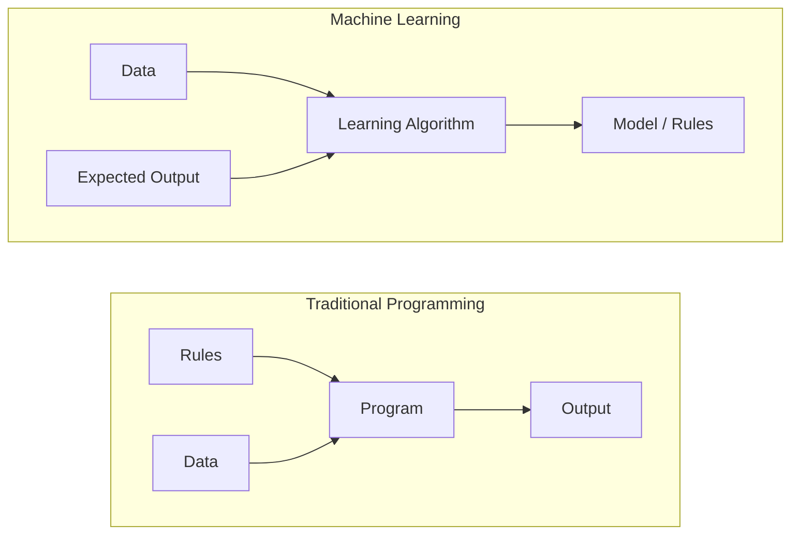
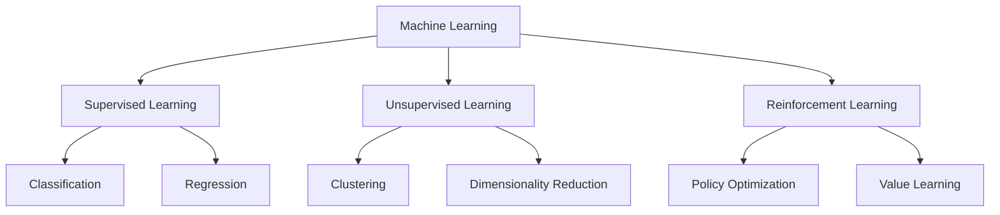
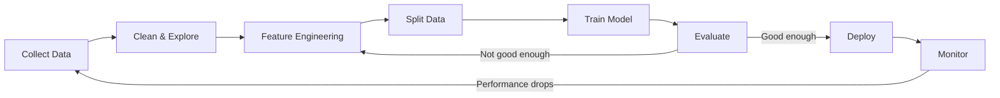
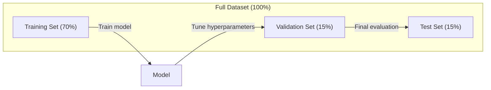
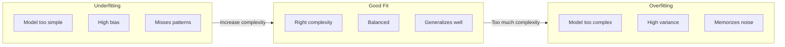
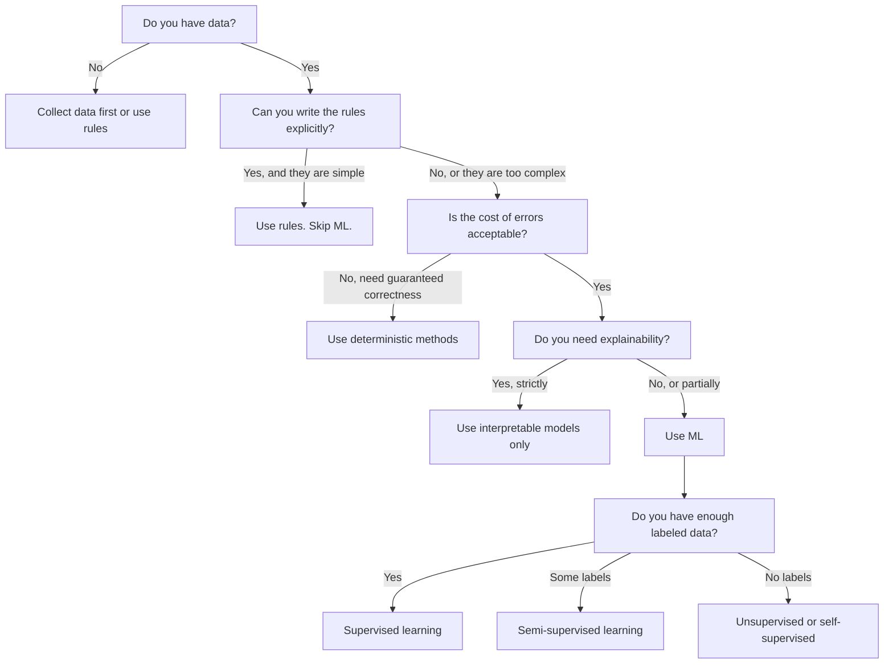

# 什么是机器学习

> 机器学习是教计算机从数据中发现模式，而不是手动编写规则。

**类型:** 学习
**语言:** Python
**前提条件:** 第一阶段（数学基础）
**时间:** 约45分钟

## 学习目标

- 解释监督学习(Supervised Learning)、无监督学习(Unsupervised Learning)和强化学习(Reinforcement Learning)之间的区别，并针对给定问题识别适用类型
- 从头实现一个最近质心分类器(Nearest Centroid Classifier)，并对照随机基线进行评估
- 区分分类(Classification)和回归(Regression)任务，并为每种任务选择合适的损失函数(Loss Function)
- 评估给定的业务问题是否适合使用机器学习，或者更适合用确定性规则解决

## 问题

你想构建一个垃圾邮件过滤器。传统方法是：坐下来写几百条规则。“如果邮件包含‘免费赚钱’，标记为垃圾邮件。如果超过3个感叹号，标记为垃圾邮件。”你花几周时间写规则。然后垃圾邮件发送者改变措辞。你的规则失效。你写更多规则。这个循环永无止境。

机器学习颠覆了这一过程。你不需要编写规则，而是给计算机数千封标注好的邮件（“垃圾邮件”或“非垃圾邮件”），让它自己找出规则。计算机会发现你从未想到的模式。当垃圾邮件发送者改变策略时，你可以用新数据重新训练模型，而不是重写代码。

从“编写规则”到“从数据中学习”的转变，正是机器学习的核心。每一个推荐引擎、语音助手、自动驾驶汽车和语言模型都以这种方式工作。

## 核心概念

### 从数据中学习，而非规则

传统编程和机器学习以相反的方向解决问题。



传统编程：你编写规则。程序将规则应用于数据以产生输出。

机器学习：你提供数据和期望的输出。算法发现规则。

训练得到的“模型”就是规则本身，以数字（权重、参数）的形式编码。它能从见过的例子中泛化，对从未见过的数据进行预测。

### 机器学习的三种类型



**监督学习(Supervised Learning)**：你有输入-输出对。模型学习将输入映射到输出。
- “这里有10,000张标注为猫或狗的照片。学会区分它们。”
- “这里有房屋特征和价格。学会预测价格。”

**无监督学习(Unsupervised Learning)**：你只有输入，没有标签。模型自行发现结构。
- “这里有10,000个客户购买历史。找出自然的分组。”
- “这里有1,000维的数据点。降维到2维并保持结构。”

**强化学习(Reinforcement Learning)**：智能体在环境中采取行动，并获得奖励或惩罚。它学习一种策略（policy）以最大化总奖励。
- “玩这个游戏。赢+1，输-1。找出策略。”
- “控制这只机械臂。拿起物体+1，每秒浪费-0.01。”

在实践中，你构建的大多数东西都使用监督学习。无监督学习常用于预处理和探索。强化学习则驱动游戏AI、机器人以及语言模型的RLHF。

### 三大类型之外

上述三种分类很清晰，但现实中的机器学习往往模糊了界限。

**半监督学习(Semi-supervised Learning)** 使用少量标注数据和大量未标注数据。例如，你有100张标注的医学图像和100,000张未标注的图像。技术包括：

- **标签传播(Label Propagation):** 构建一个连接相似数据点的图。标签通过图从标注节点传播到未标注的邻居节点。
- **伪标签(Pseudo-labeling):** 在标注数据上训练模型，然后使用该模型预测未标注数据的标签，最后在所有数据上重新训练。模型自举其训练集。
- **一致性正则化(Consistency Regularization):** 模型应对输入及其轻微扰动版本给出相同的预测。即使没有标签，这种方法也有效。

**自监督学习(Self-supervised Learning)** 从数据本身创建监督信号。完全不需要人工标签。模型从数据结构中创建自己的预测任务。

- **掩码语言建模(Masked Language Modeling, BERT):** 隐藏句子中15%的单词，训练模型预测缺失的单词。 “标签”来自原始文本。
- **对比学习(Contrastive Learning, SimCLR):** 取一张图像，创建两个增强版本。训练模型识别它们来自同一图像，同时与来自其他图像的增强版本区分开。
- **下一个词预测(Next-Token Prediction, GPT):** 根据所有前面的词预测下一个词。每个文本文档都成为一个训练样本。

这些并不是三大类型之外的独立类别，而是结合了监督和无监督思想的策略。自监督学习在技术上是监督学习（模型预测某个东西），但标签是自动生成的，而非人工标注。

### 分类 vs 回归

这是监督学习的两个主要任务。

|  方面  |  分类  |  回归  |
|--------|---------------|------------|
| 输出(Output) | 离散类别(Discrete categories) | 连续数值(Continuous numbers) |
| 示例(Example) | “这封邮件是垃圾邮件吗？”(Is this email spam?) | “房价会是多少？”(What will the house price be?) |
| 输出空间(Output space) | {猫(cat), 狗(dog), 鸟(bird)} | 任意实数(Any real number) |
| 损失函数(Loss function) | 交叉熵(Cross-entropy)、准确率(accuracy) | 均方误差(Mean squared error)、MAE |
| 决策(Decision) | 类别之间的边界(Boundaries between classes) | 拟合数据的曲线(A curve that fits the data) |

分类(Classification)回答“属于哪个类别？”回归(Regression)回答“数值是多少？”

有些问题可以归结为任一种方式。预测股票涨跌是分类，预测精确价格是回归。

### 机器学习工作流(ML Workflow)

每个机器学习项目都遵循相同的流程，无论使用何种算法。



**收集数据(Collect Data)**：收集原始数据。数据越多通常越好，但质量比数量更重要。

**清洗与探索(Clean & Explore)**：处理缺失值、去除重复项、可视化数据分布、发现异常值。这一步通常占项目总时间的60-80%。

**特征工程(Feature Engineering)**：将原始数据转换为模型可用的特征。将日期转换为星期几，对数值列进行归一化，对类别变量进行编码。好的特征比花哨的算法更重要。

**拆分数据(Split Data)**：划分为训练集(training)、验证集(validation)和测试集(test)。模型在训练集上训练，在验证集上调优超参数，最终在测试集上报告性能。

**训练模型(Train Model)**：将训练数据输入算法。算法调整内部参数以最小化损失函数。

**评估(Evaluate)**：在验证/测试集上衡量性能。如果性能不可接受，返回调整特征、算法或超参数。

**部署(Deploy)**：将模型投入生产环境，对新数据进行预测。

**监控(Monitor)**：跟踪性能随时间的变化。数据分布会变化（数据漂移），模型会退化。当性能下降时，重新训练。

### 训练集、验证集和测试集划分(Training, Validation, and Test Splits)

这是初学者最容易出错的概念。你必须在训练过程中从未见过的数据上评估模型，否则你衡量的是记忆而非学习。



|  数据划分(Split) | 目的(Purpose) | 使用时机(When used) | 典型大小(Typical size)  |
|-------|---------|-----------|-------------|
|  训练集(Training) | 模型从这些数据中学习 | 训练期间 | 60-80%  |
|  验证集(Validation) | 调优超参数、比较模型 | 每次训练后 | 10-20%  |
|  测试集(Test) | 最终无偏性能评估 | 仅一次，在最后 | 10-20%  |

测试集是神圣的。你只看它一次。如果你根据测试性能不断调整模型，实际上就是在用测试集训练，你报告的数字将毫无意义。

对于小数据集，使用k折交叉验证(k-fold cross-validation)：将数据分成k份，用k-1份训练，剩余1份验证，轮换并取平均结果。

### 过拟合(Overfitting)与欠拟合(Underfitting)



**欠拟合(Underfitting)**：模型过于简单，无法捕捉数据中的模式。例如用直线拟合曲线关系。训练误差高，测试误差也高。

**过拟合(Overfitting)**：模型过于复杂，记住了训练数据（包括噪声）。曲线扭曲地穿过每个训练点，但在新数据上失败。训练误差低，测试误差高。

**良好拟合(Good fit)**：模型捕捉了真实模式而没记住噪声。训练误差和测试误差都合理低。

过拟合的迹象(Signs of overfitting):
- 训练准确率远高于验证准确率
- 模型在训练数据上表现良好，但在新数据上表现较差
- 增加训练数据量会提高性能（模型在死记硬背，而不是学习）

过拟合的解决方法：
- 获取更多训练数据
- 降低模型复杂度（更少的参数、更简单的架构）
- 正则化（对大权重添加惩罚）
- Dropout（训练过程中随机将神经元置零）
- 早停法（验证误差开始上升时停止训练）

欠拟合的解决方法：
- 使用更复杂的模型
- 添加更多特征
- 降低正则化
- 延长训练时间

### 偏差-方差权衡

这是过拟合和欠拟合背后的数学框架。

**偏差(Bias)**：由模型中错误假设引起的误差。当真实关系是非线性时，线性模型具有高偏差。高偏差会导致欠拟合。

**方差(Variance)**：对训练数据中小波动的敏感度引起的误差。高方差模型在不同数据子集上训练时会产生差异很大的预测。高方差会导致过拟合。

|  模型复杂度  |  偏差  |  方差  |  结果  |
|-----------------|------|----------|--------|
|  过低（对曲线数据用线性模型）  |  高  |  低  |  欠拟合  |
|  刚好  |  中等  |  中等  |  良好泛化  |
|  过高（对10个点用20次多项式）  |  低  |  高  |  过拟合  |

总误差 = 偏差^2 + 方差 + 不可约噪声

你无法降低不可约噪声（它是数据本身的随机性）。你需要找到偏差^2 + 方差最小化的最佳平衡点。

### 没有免费午餐定理

没有一个算法能在所有问题上表现最佳。在某类问题上表现良好的算法在另一类问题上可能表现很差。这就是数据科学家尝试多种算法并比较结果的原因。

在实践中，选择取决于：
- 你有多少数据
- 有多少特征
- 关系是线性还是非线性
- 是否需要可解释性
- 你能负担多少计算资源

### 何时不使用机器学习

机器学习功能强大，但并非总是合适的工具。在考虑使用模型之前，先问问自己是否真的需要它。

**在以下情况下不要使用机器学习：**

- **规则简单且明确。** 税款计算、排序算法、单位换算。如果你可以用几条if语句写出逻辑，那么模型只会增加复杂性而没有好处。
- **你没有数据或数据极少。** 机器学习需要示例来学习。只有10个数据点，你无法训练出任何有意义的模型。先收集数据。
- **出错的代价是灾难性的，并且需要保证正确性。** 药物剂量计算、核反应堆控制、加密验证。机器学习模型是概率性的。它们有时会出错。如果“有时出错”是不可接受的，请使用确定性方法。
- **查找表或启发式方法就能解决问题。** 如果一个简单的阈值或表格能覆盖99%的情况，添加机器学习会增加维护成本而没有实质性的改进。
- **你无法解释决策，而可解释性又是必需的。** 受监管的行业（借贷、保险、刑事司法）有时要求每个决策都能完全解释。一些机器学习模型是可解释的（线性回归、小型决策树）。但大多数不是。
- **问题的变化速度快于你重新训练模型的速度。** 如果规则每天都在变化，而重新训练需要一周，那么模型总是过时的。

使用这个决策流程图：



## 动手构建

`code/ml_intro.py`中的代码从头实现了一个最近质心分类器，这是最简单的机器学习算法。它展示了核心思想：从数据中学习，然后对新数据预测。

### 第1步：从头实现最近质心分类器

最近质心分类器计算训练数据中每个类别的中心（均值）。在预测时，它将每个新点分配给中心最近的那个类别。

```python
class NearestCentroid:
    def fit(self, X, y):
        self.classes = np.unique(y)
        self.centroids = np.array([
            X[y == c].mean(axis=0) for c in self.classes
        ])

    def predict(self, X):
        distances = np.array([
            np.sqrt(((X - c) ** 2).sum(axis=1))
            for c in self.centroids
        ])
        return self.classes[distances.argmin(axis=0)]
```

这就是整个算法。拟合计算两个均值。预测计算距离。没有梯度下降，没有迭代，没有超参数。

### 第2步：在合成数据上训练

我们生成一个二维分类数据集，包含两个类别，它们略有重叠。质心分类器在类别中心之间绘制一条线性决策边界。

```python
rng = np.random.RandomState(42)
X_class0 = rng.randn(100, 2) + np.array([1.0, 1.0])
X_class1 = rng.randn(100, 2) + np.array([-1.0, -1.0])
X = np.vstack([X_class0, X_class1])
y = np.array([0] * 100 + [1] * 100)
```

### 步骤3：与基准对比

每个机器学习模型都应与一个简单的基准进行对比。这里的基准随机预测一个类别。如果你的机器学习模型未能击败随机猜测，那么一定出了问题。

```python
baseline_preds = rng.choice([0, 1], size=len(y_test))
baseline_acc = np.mean(baseline_preds == y_test)
```

在这个干净的数据集上，质心分类器应能达到90%以上的准确率。随机基准大约为50%。

### 为何重要

最近质心分类器极其简单。它没有超参数，没有迭代，没有梯度下降。然而它捕捉了机器学习的基本模式：

1. **学习**：从训练数据中学习表示（质心）
2. **预测**：使用该表示对新数据进行预测（最近距离）
3. **评估**：与基准（随机猜测）进行比较

每个机器学习算法，从逻辑回归到Transformer，都遵循同样的三步模式。表示形式变得更复杂，但工作流程保持不变。

### 步骤4：质心分类器无法做到的

最近质心分类器假设每个类别形成一个单一团块。它画出线性决策边界。它在以下情况会失效：

- 类别有多个簇（例如，数字"1"可以有多种不同的写法）
- 决策边界是非线性的（例如，一个类别环绕另一个类别）
- 特征尺度差异很大（距离由最大尺度特征主导）

这些局限性促使了你将学习的其他所有算法。K近邻处理多个簇。决策树处理非线性边界。特征缩放解决尺度问题。每一课都建立在前一课局限性的基础上。

## 使用它

sklearn提供了`NearestCentroid`和合成数据生成器：

```python
from sklearn.neighbors import NearestCentroid
from sklearn.datasets import make_classification
from sklearn.model_selection import train_test_split

X, y = make_classification(
    n_samples=500, n_features=2, n_redundant=0,
    n_clusters_per_class=1, random_state=42
)
X_train, X_test, y_train, y_test = train_test_split(X, y, test_size=0.3)

clf = NearestCentroid()
clf.fit(X_train, y_train)
print(f"Accuracy: {clf.score(X_test, y_test):.3f}")
```

## 发布

本课程产出`outputs/prompt-ml-problem-framer.md`——一个将模糊的商业问题转化为具体机器学习任务的提示。给它一个问题描述（如"我们希望降低客户流失"或"预测下个季度的需求"），它便会识别学习类型，定义预测目标，列出候选特征，选择成功指标，建立基准，并标记数据泄露或类别不平衡等陷阱。在任何机器学习项目开始时使用它，以避免构建错误的东西。

## 关键术语

|  术语  |  人们的说法  |  实际含义  |
|------|----------------|----------------------|
|  模型  |  "人工智能"  |  一个带有可学习参数的数学函数，将输入映射到输出  |
|  训练  |  "教授人工智能"  |  运行优化算法来调整模型参数，使预测与已知输出匹配  |
|  特征  |  "输入列"  |  模型用于预测的数据的可测量属性  |
|  标签  |  "答案"  |  训练样本的已知输出，用于计算误差信号  |
|  超参数  |  "你调整的设置"  |  训练前设置的参数，控制学习过程（学习率、层数）  |
|  损失函数  |  "模型有多错"  |  测量预测输出与实际输出之间差距的函数，训练过程试图最小化它  |
|  过拟合  |  "它记住了测试"  |  模型学习了训练数据特有的噪声而非一般模式，因此在新数据上失败  |
|  欠拟合  |  "它什么都没学到"  |  模型过于简单，无法捕捉数据中的真实模式  |
|  泛化  |  "在新数据上有效"  |  模型对未训练过的数据做出准确预测的能力  |
|  交叉验证  |  "在不同数据块上测试"  |  反复将数据分割成训练/测试折并平均结果，提供更稳健的性能估计  |
|  正则化  |  "保持权重较小"  |  向损失函数添加惩罚项，阻止过于复杂的模型  |
|  数据漂移  |  "世界变了"  |  输入数据的统计分布随时间变化，导致模型性能下降  |

## 练习

1. 选取任意数据集（例如鸢尾花、泰坦尼克）。按70/15/15划分为训练/验证/测试集。解释为什么不应该在测试集上调整超参数。
2. 列出三个实际问题。对每个问题，判断是分类、回归还是聚类，以及是监督学习还是无监督学习。
3. 一个模型在训练数据上达到99%准确率但在测试数据上只有60%。诊断问题并列出三个你尝试解决的方法。

## 延伸阅读

- [An Introduction to Statistical Learning](https://www.statlearning.com/) - 涵盖所有经典机器学习方法并附有实践示例的免费教科书
- [An Introduction to Statistical Learning](https://www.statlearning.com/) - 简洁的机器学习概念视觉入门
- [An Introduction to Statistical Learning](https://www.statlearning.com/) - Python实现机器学习的实用参考
