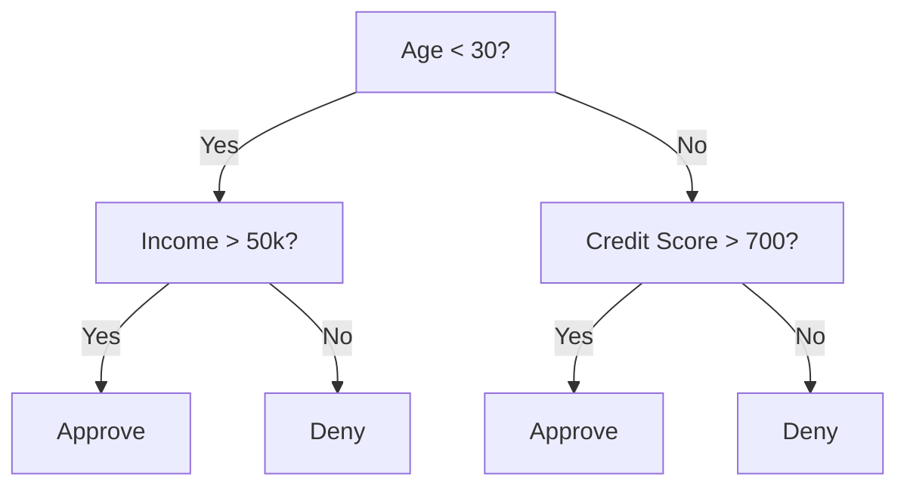
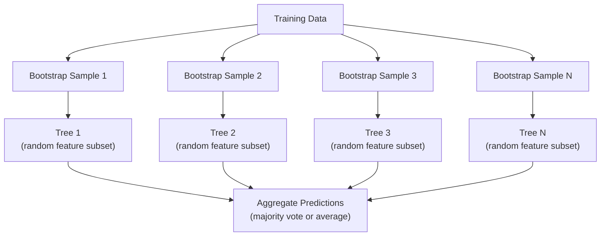

# 决策树与随机森林

> 单棵决策树不过是一张流程图。但由众多决策树组成的森林，却是机器学习中最强大的工具之一。

**类型：** 构建
**语言：** Python
**前置知识：** 阶段 1（第 09 课：信息论，第 06 课：概率论）
**时长：** 约 90 分钟

## 学习目标

- 实现基尼不纯度(Gini impurity)、熵(Entropy)和信息增益(Information Gain)的计算，以找到最优的决策树分裂点
- 从头构建带预剪枝控制（最大深度、最小样本数）的决策树分类器
- 利用自助采样(Bootstrap Sampling)和特征随机化构建随机森林，并解释其降低方差的原因
- 比较基于MDI的特征重要性与置换特征重要性(Permutation Importance)，识别MDI存在偏差的情形

## 问题

你有一张表格数据：行是样本，列是特征，还有一个你想预测的目标列。你可以扔一个神经网络上去。但对于表格数据，基于树的模型（决策树、随机森林、梯度提升树）始终优于深度学习。在结构化数据的Kaggle竞赛中，XGBoost和LightGBM占据主导地位，而非Transformer。

为什么？树模型无需预处理即可处理混合特征类型（数值型和类别型）。它们无需特征工程即可处理非线性关系。它们具有可解释性：你可以查看树结构，准确了解预测的生成原因。而随机森林通过对多棵树取平均，对中等规模数据集具有很强的抗过拟合能力。

本课使用递归分裂从零构建决策树，然后在其之上构建随机森林。你将实现分裂准则（基尼不纯度、熵、信息增益）背后的数学原理，并理解为什么弱学习器的集成能成为强学习器。

## 核心概念

### 决策树的工作原理

决策树通过提出一系列是/否问题，将特征空间划分为矩形区域。



每个内部节点针对一个特征和阈值进行测试。每个叶节点做出预测。要对新数据点进行分类，从根节点开始，沿着分支直到到达叶节点。

树通过自顶向下构建：在每个节点，选择最能分离数据的特征和阈值。“最佳”由分裂准则定义。

### 分裂准则：衡量不纯度

在每个节点，我们有一组样本。我们希望对它们进行分裂，使得生成的子节点尽可能“纯净”，即每个子节点主要包含一个类别。

**基尼不纯度(Gini Impurity)** 衡量的是：如果根据该节点的类别分布对随机选中的样本进行标记，它被错误分类的概率。

```
Gini(S) = 1 - sum(p_k^2)

where p_k is the proportion of class k in set S.
```

对于纯节点（全属一类），基尼 = 0。对于二分类中类别各占50%的情况，基尼 = 0.5。值越小越好。

```
Example: 6 cats, 4 dogs

Gini = 1 - (0.6^2 + 0.4^2) = 1 - (0.36 + 0.16) = 0.48
```

**熵(Entropy)** 衡量节点中的信息含量（无序度）。在阶段1第09课中已介绍。

```
Entropy(S) = -sum(p_k * log2(p_k))
```

对于纯节点，熵 = 0。对于二分类中各类别各占50%的情况，熵 = 1.0。值越小越好。

```
Example: 6 cats, 4 dogs

Entropy = -(0.6 * log2(0.6) + 0.4 * log2(0.4))
        = -(0.6 * -0.737 + 0.4 * -1.322)
        = 0.442 + 0.529
        = 0.971 bits
```

**信息增益(Information Gain)** 是分裂后不纯度（熵或基尼）的下降量。

```
IG(S, feature, threshold) = Impurity(S) - weighted_avg(Impurity(S_left), Impurity(S_right))

where the weights are the proportions of samples in each child.
```

每个节点的贪心算法：尝试每个特征和每个可能的阈值。选择使信息增益最大的（特征，阈值）对。

### 分裂如何工作

对于当前节点上有n个特征和m个样本的数据集：

1. 对于每个特征 j (j = 1 到 n)：
   - 按特征 j 对样本排序
   - 尝试两个连续不同值之间的每个中点作为阈值
   - 计算每个阈值的信息增益
2. 选择信息增益最高的特征和阈值
3. 将数据分为左（特征 <= 阈值）和右（特征 > 阈值）
4. 在每个子节点上递归

这种贪心方法不能保证全局最优树。寻找最优树是NP难的。但贪心分裂在实践中效果很好。

### 停止条件

如果没有停止条件，树会一直生长直到每个叶节点都是纯的（每个叶节点只有一个样本）。这会完美记住训练数据，并导致泛化能力极差。

**预剪枝(Pre-Pruning)** 在树完全生长之前停止：
- 最大深度：当树达到设定深度时停止分裂
- 叶节点最小样本数：如果节点样本数少于k则停止
- 最小信息增益：如果最佳分裂对不纯度的改善小于阈值则停止
- 最大叶节点数：限制叶节点的总数

**后剪枝(Post-Pruning)** 先让树完全生长，再进行修剪：
- 成本复杂度剪枝（scikit-learn使用）：添加一个与叶节点数量成正比的惩罚项。增大惩罚项以得到更小的树
- 减少错误剪枝：如果验证误差没有增加，则移除子树

预剪枝更简单、更快。后剪枝通常能产生更好的树，因为它不会过早停止那些可能引向有用后续分裂的分裂。

### 决策树用于回归

对于回归，叶节点的预测是该叶中目标值的均值。分裂准则也有所不同：

**方差减少(Variance reduction)** 取代了信息增益(Information gain)：

```
VR(S, feature, threshold) = Var(S) - weighted_avg(Var(S_left), Var(S_right))
```

选择能最大程度减少方差的分裂。树将输入空间划分为多个区域，并在每个区域预测一个常数（均值）。

### 随机森林：集成方法的力量

单棵决策树具有高方差。数据的微小变化可能导致完全不同的树。随机森林通过平均多棵树来解决这个问题。



两种随机性来源使树变得多样化：

**装袋(Bagging，即Bootstrap aggregating)：** 每棵树在自助采样(Bootstrap sample)上训练，即从训练数据中随机有放回地抽样。每个自助样本中大约包含63%的原始样本（其余为袋外样本，可用于验证）。

**特征随机化(Feature randomization)：** 在每个分裂点，只考虑特征的随机子集。对于分类，默认使用sqrt(n_features)个特征；对于回归，使用n_features/3个特征。这可以防止所有树都在同一个主导特征上分裂。

关键洞察：平均多个去相关的树可以在不增加偏差的情况下减少方差。单棵树可能表现平平，但集成模型很强大。

### 特征重要性

随机森林天然提供特征重要性得分。最常用的方法是：

**平均杂质减少(Mean Decrease in Impurity, MDI)：** 对于每个特征，汇总所有树中所有使用该特征的节点上杂质减少的总和。在更早的分裂中产生更大杂质减少的特征更为重要。

```
importance(feature_j) = sum over all nodes where feature_j is used:
    (n_samples_at_node / n_total_samples) * impurity_decrease
```

这种方法很快（在训练期间计算），但对高基数特征和具有许多可能分裂点的特征有偏。

**排列重要性(Permutation importance)** 是另一种方法：打乱一个特征的值，并测量模型准确率下降的程度。这种方法更可靠但更慢。

### 树何时优于神经网络

在表格数据上，树和森林通常优于神经网络。原因如下：

|  因素  |  树  |  神经网络  |
|--------|-------|----------------|
|  混合类型（数值+类别）  |  原生支持  |  需要编码  |
|  小数据集（< 1万行）  |  表现良好  |  过拟合  |
|  特征交互  |  通过分裂发现  |  需要架构设计  |
|  可解释性  |  完全透明  |  黑箱  |
|  训练时间  |  分钟  |  小时  |
|  超参数敏感性  |  低  |  高  |

当数据具有空间或序列结构（图像、文本、音频）时，神经网络胜出。对于扁平的特征表格，树是默认选择。

```figure
decision-tree-depth
```

## 动手构建

### 步骤1：基尼杂质(Gini impurity)与熵(Entropy)

从头构建两种分裂准则，并验证它们在哪些分裂是好的上达成一致。

```python
import math

def gini_impurity(labels):
    n = len(labels)
    if n == 0:
        return 0.0
    counts = {}
    for label in labels:
        counts[label] = counts.get(label, 0) + 1
    return 1.0 - sum((c / n) ** 2 for c in counts.values())

def entropy(labels):
    n = len(labels)
    if n == 0:
        return 0.0
    counts = {}
    for label in labels:
        counts[label] = counts.get(label, 0) + 1
    return -sum(
        (c / n) * math.log2(c / n) for c in counts.values() if c > 0
    )
```

### 步骤2：寻找最佳分裂

尝试每个特征和每个阈值。返回信息增益最高的那个。

```python
def information_gain(parent_labels, left_labels, right_labels, criterion="gini"):
    measure = gini_impurity if criterion == "gini" else entropy
    n = len(parent_labels)
    n_left = len(left_labels)
    n_right = len(right_labels)
    if n_left == 0 or n_right == 0:
        return 0.0
    parent_impurity = measure(parent_labels)
    child_impurity = (
        (n_left / n) * measure(left_labels) +
        (n_right / n) * measure(right_labels)
    )
    return parent_impurity - child_impurity
```

### 步骤3：构建DecisionTree类

递归分裂、预测和特征重要性追踪。

```python
class DecisionTree:
    def __init__(self, max_depth=None, min_samples_split=2,
                 min_samples_leaf=1, criterion="gini",
                 max_features=None):
        self.max_depth = max_depth
        self.min_samples_split = min_samples_split
        self.min_samples_leaf = min_samples_leaf
        self.criterion = criterion
        self.max_features = max_features
        self.tree = None
        self.feature_importances_ = None

    def fit(self, X, y):
        self.n_features = len(X[0])
        self.feature_importances_ = [0.0] * self.n_features
        self.n_samples = len(X)
        self.tree = self._build(X, y, depth=0)
        total = sum(self.feature_importances_)
        if total > 0:
            self.feature_importances_ = [
                fi / total for fi in self.feature_importances_
            ]

    def predict(self, X):
        return [self._predict_one(x, self.tree) for x in X]
```

### 第4步：构建随机森林类

自助采样、特征随机化和多数投票。

```python
class RandomForest:
    def __init__(self, n_trees=100, max_depth=None,
                 min_samples_split=2, max_features="sqrt",
                 criterion="gini"):
        self.n_trees = n_trees
        self.max_depth = max_depth
        self.min_samples_split = min_samples_split
        self.max_features = max_features
        self.criterion = criterion
        self.trees = []

    def fit(self, X, y):
        n = len(X)
        for _ in range(self.n_trees):
            indices = [random.randint(0, n - 1) for _ in range(n)]
            X_boot = [X[i] for i in indices]
            y_boot = [y[i] for i in indices]
            tree = DecisionTree(
                max_depth=self.max_depth,
                min_samples_split=self.min_samples_split,
                max_features=self.max_features,
                criterion=self.criterion,
            )
            tree.fit(X_boot, y_boot)
            self.trees.append(tree)

    def predict(self, X):
        all_preds = [tree.predict(X) for tree in self.trees]
        predictions = []
        for i in range(len(X)):
            votes = {}
            for preds in all_preds:
                v = preds[i]
                votes[v] = votes.get(v, 0) + 1
            predictions.append(max(votes, key=votes.get))
        return predictions
```

参见`code/trees.py`获取包含所有辅助方法的完整实现。

## 使用它

使用scikit-learn，训练一个随机森林只需三行代码：

```python
from sklearn.ensemble import RandomForestClassifier
from sklearn.datasets import load_iris
from sklearn.model_selection import train_test_split

X, y = load_iris(return_X_y=True)
X_train, X_test, y_train, y_test = train_test_split(X, y, random_state=42)

rf = RandomForestClassifier(n_estimators=100, random_state=42)
rf.fit(X_train, y_train)
print(f"Accuracy: {rf.score(X_test, y_test):.4f}")
print(f"Feature importances: {rf.feature_importances_}")
```

在实践中，梯度提升树（XGBoost、LightGBM、CatBoost）通常比随机森林更强，因为它们顺序构建树，每棵树修正前一棵树的错误。但随机森林更难配置错误，且几乎不需要超参数调优。

## 发布

本节课生成`outputs/prompt-tree-interpreter.md`——一个为业务利益相关者解释决策树分裂的提示。输入训练好的树结构（深度、特征、分裂阈值、准确率），它将模型转化为通俗易懂的规则，排序特征重要性，标记过拟合或数据泄露，并建议下一步行动。任何时候你需要向不懂代码的人解释基于树的模型时，都可以使用它。

## 练习

1. 在具有3个类别的二维数据集上训练一个单决策树。手动追踪分裂并绘制矩形决策边界。比较max_depth=2与max_depth=10时的边界。

2. 实现回归树的方差缩减分裂。生成y = sin(x) + noise的200个点，并拟合你的回归树。绘制树的分段常数预测与真实曲线的对比图。

3. 构建包含1、5、10、50和200棵树的随机森林。绘制训练准确率和测试准确率随树数量变化的曲线。观察测试准确率趋于稳定但不会下降（随机森林抵抗过拟合）。

4. 在5个不同的数据集上比较基尼不纯度与信息熵作为分裂准则。测量准确率和树深度。大多数情况下，它们产生几乎相同的结果。解释原因。

5. 实现排列重要性。在一个特征为随机噪声但具有高基数的数据集上将其与MDI重要性进行比较。MDI会将噪声特征排名很高。排列重要性则不会。

## 关键术语

|  术语  |  人们的说法  |  实际含义  |
|------|----------------|----------------------|
|  决策树  |  "预测的流程图"  |  通过学习一系列if/else分裂将特征空间划分为矩形区域的模型  |
|  基尼不纯度  |  "节点有多混杂"  |  在节点处随机样本被错误分类的概率。0=纯净，0.5=二分类最大不纯度  |
|  信息熵  |  "节点的无序度"  |  节点处的信息量。0=纯净，1.0=二分类最大不确定性。来自信息论  |
|  信息增益  |  "分裂有多好"  |  分裂后不纯度的减少。选择分裂的贪心准则  |
|  预剪枝  |  "提前停止树生长"  |  通过设置最大深度、最小样本数或最小增益阈值来提前停止树生长  |
|  后剪枝  |  "之后修剪树"  |  先生长完整树，然后移除不能提升验证性能的子树  |
|  袋装法  |  "在随机子集上训练"  |  自助聚合。在每个不同的有放回随机样本上训练模型  |
|  随机森林  |  "一堆树"  |  决策树的集成，每棵树在自助样本上训练，每个分裂使用随机特征子集  |
|  特征重要性（MDI）  |  "哪些特征重要"  |  每个特征贡献的总不纯度减少，跨所有树和节点求和  |
|  排列重要性  |  "打乱并检查"  |  当特征值被随机打乱时准确率下降。对于噪声特征比MDI更可靠  |
|  方差缩减  |  "信息增益的回归版本"  |  信息增益的回归树类比。选择使目标方差减少最多的分裂  |
|  自助样本  |  "有重复的随机样本"  |  从原始数据集中有放回抽取的随机样本。样本量相同，但有重复  |

## 延伸阅读

- [Breiman: Random Forests (2001)](https://link.springer.com/article/10.1023/A:1010933404324) - 原始随机森林论文
- [Breiman: Random Forests (2001)](https://link.springer.com/article/10.1023/A:1010933404324) - 树与神经网络在表格任务上的严格比较
- [Breiman: Random Forests (2001)](https://link.springer.com/article/10.1023/A:1010933404324) - 使用可视化工具的实用指南
- [Breiman: Random Forests (2001)](https://link.springer.com/article/10.1023/A:1010933404324) - 主导Kaggle的梯度提升论文
