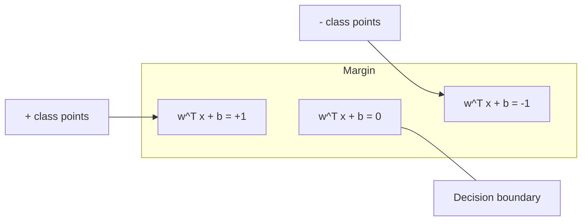
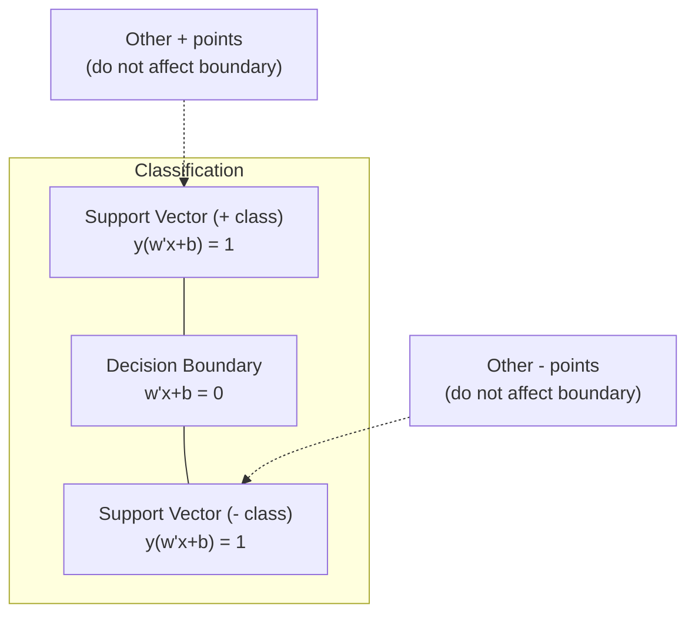
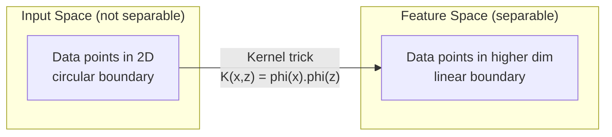

# 支持向量机(Support Vector Machines)

> 在两个类别之间找到最宽的街道。这就是整个想法。

**类型：** 构建
**语言：** Python
**前置知识：** 阶段1 (第08课 优化, 第14课 范数与距离, 第18课 凸优化)
**时间：** ~90分钟

## 学习目标

- 使用原始形式上的合页损失(Hinge Loss)和梯度下降从零实现线性支持向量机
- 解释最大间隔原则并从训练好的模型中识别支持向量
- 比较线性核、多项式核和RBF核，解释核技巧(Kernel Trick)如何避免显式的高维映射
- 评估C参数在间隔宽度和分类错误之间控制的权衡

## 问题

你有两个类别的数据点，需要画一条直线（或超平面）将它们分开。可能有无数条直线都有效。你应该选择哪一条？

选择具有最大间隔的那一条。间隔(Margin)是决策边界到每侧最近数据点的距离。更宽的间隔意味着分类器更自信，并且在未见数据上泛化能力更强。

这种直觉导致了支持向量机(Support Vector Machines)，这是机器学习中数学上最优雅的算法之一。在深度学习之前，SVM是主要的分类方法，并且对于小数据集、高维数据以及需要原则性强、理论保证良好的模型的问题，它们仍然是最佳选择。

SVM直接与阶段1相关：优化是凸的（第18课），间隔用范数测量（第14课），核技巧利用点积来处理非线性边界，而无需在高维空间中计算。

## 核心概念

### 最大间隔分类器

给定线性可分的带有标签y_i ∈ {-1, +1}和特征向量x_i的数据，我们希望找到一个超平面 w^T x + b = 0 来分隔这些类别。

从点x_i到超平面的距离为：

```
distance = |w^T x_i + b| / ||w||
```

对于正确分类的点：y_i * (w^T x_i + b) > 0。间隔是从超平面到两侧最近点距离的两倍。



优化问题：

```
maximize    2 / ||w||     (the margin width)
subject to  y_i * (w^T x_i + b) >= 1  for all i
```

等价地（最小化||w||^2更容易优化）：

```
minimize    (1/2) ||w||^2
subject to  y_i * (w^T x_i + b) >= 1  for all i
```

这是一个凸二次规划问题(Convex Quadratic Program)。它具有唯一的全局解。恰好位于间隔边界上的数据点（即 y_i * (w^T x_i + b) = 1 的点）就是支持向量。只有这些点决定了决策边界。移动或移除任何一个非支持向量点，边界都不会改变。

### 支持向量：关键少数



大多数训练点无关紧要。只有支持向量重要。这就是为什么SVM在预测时内存高效：你只需要存储支持向量，而不是整个训练集。

支持向量的数量也给出了泛化误差的一个上界。相对于数据集大小，支持向量越少，泛化能力越好。

### 软间隔：用C参数处理噪声

真实数据很少是完全线性可分的。有些点可能在边界的错误一侧，或者落在间隔内部。软间隔公式通过引入松弛变量(Slack Variables)来允许违规。

```
minimize    (1/2) ||w||^2 + C * sum(xi_i)
subject to  y_i * (w^T x_i + b) >= 1 - xi_i
            xi_i >= 0  for all i
```

松弛变量ξ_i度量了第i个点违反间隔的程度。参数C控制权衡：

|  C 值  |  行为  |
|---------|----------|
|  大 C  |  严重惩罚违规。间隔窄，错误分类少。过拟合  |
|  小 C  |  允许更多违规。间隔宽，错误分类多。欠拟合  |

C是正则化强度，取倒数。大C = 较少正则化。小C = 较多正则化。

### 合页损失：SVM的损失函数

软间隔SVM可以重写为无约束优化：

```
minimize    (1/2) ||w||^2 + C * sum(max(0, 1 - y_i * (w^T x_i + b)))
```

项 max(0, 1 - y_i * f(x_i)) 是合页损失(Hinge Loss)。当点被正确分类且超出间隔时，它为零；当点落在间隔内或分类错误时，它是线性的。

```
Hinge loss for a single point:

loss
  |
  | \
  |  \
  |   \
  |    \
  |     \_______________
  |
  +-----|-----|-------->  y * f(x)
       0     1

Zero loss when y*f(x) >= 1 (correctly classified, outside margin).
Linear penalty when y*f(x) < 1.
```

与逻辑损失（逻辑回归）比较：

```
Hinge:     max(0, 1 - y*f(x))          Hard cutoff at margin
Logistic:  log(1 + exp(-y*f(x)))        Smooth, never exactly zero
```

合页损失产生稀疏解（只有支持向量有非零贡献）。逻辑损失使用所有数据点。这使得SVM在预测时内存更高效。

### 使用梯度下降训练线性 SVM

你可以通过梯度下降在合页损失加 L2 正则化上训练线性 SVM，而无需解决约束二次规划(QP)：

```
L(w, b) = (lambda/2) * ||w||^2 + (1/n) * sum(max(0, 1 - y_i * (w^T x_i + b)))

Gradient with respect to w:
  If y_i * (w^T x_i + b) >= 1:  dL/dw = lambda * w
  If y_i * (w^T x_i + b) < 1:   dL/dw = lambda * w - y_i * x_i

Gradient with respect to b:
  If y_i * (w^T x_i + b) >= 1:  dL/db = 0
  If y_i * (w^T x_i + b) < 1:   dL/db = -y_i
```

这称为原问题(primal formulation)。每个 epoch 的运行时间为 O(n * d)，其中 n 是样本数，d 是特征数。对于大规模、稀疏、高维数据（如文本分类）来说，这很快。

### 对偶问题和核技巧(kernel trick)

SVM 问题的拉格朗日对偶（来自第一阶段第18课，KKT条件）为：

```
maximize    sum(alpha_i) - (1/2) * sum_ij(alpha_i * alpha_j * y_i * y_j * (x_i . x_j))
subject to  0 <= alpha_i <= C
            sum(alpha_i * y_i) = 0
```

对偶问题仅涉及数据点之间的点积 x_i . x_j。这是关键洞察。将每个点积替换为核函数(Kernel Function) K(x_i, x_j)，SVM 就可以学习非线性边界，而无需显式计算变换。

```
Linear kernel:      K(x, z) = x . z
Polynomial kernel:  K(x, z) = (x . z + c)^d
RBF (Gaussian):     K(x, z) = exp(-gamma * ||x - z||^2)
```

RBF 核将数据映射到无限维空间。输入空间中距离近的点，核值接近1；距离远的点，核值接近0。它可以学习任意平滑的决策边界。



核技巧(kernel trick)在高维空间中计算点积，而无需实际进入该空间。对于 D 维中 d 次多项式核，显式特征空间有 O(D^d) 维，但 K(x, z) 的计算时间为 O(D)。

### 用于回归的 SVM (SVR)

支持向量回归(Support Vector Regression)在数据周围拟合一个宽度为 epsilon 的管道。管道内部的点损失为零，外部的点受到线性惩罚。

```
minimize    (1/2) ||w||^2 + C * sum(xi_i + xi_i*)
subject to  y_i - (w^T x_i + b) <= epsilon + xi_i
            (w^T x_i + b) - y_i <= epsilon + xi_i*
            xi_i, xi_i* >= 0
```

epsilon 参数控制管道宽度。管道越宽 = 支持向量越少 = 拟合更平滑。管道越窄 = 支持向量越多 = 拟合更紧密。

### 为什么 SVM 输给了深度学习（以及它们何时仍然获胜）

SVM 从1990年代末到2010年代初主导了机器学习。深度学习超越它们的原因如下：

|  因素  |  SVM  |  深度学习  |
|--------|------|---------------|
|  特征工程  |  需要  |  学习特征  |
|  可扩展性  |  O(n^2) 到 O(n^3)（核方法） |  O(n) per epoch（SGD）  |
|  图像/文本/音频  |  需要手工特征  |  从原始数据学习  |
|  大数据集（>10万） |  慢  |  扩展性好  |
|  GPU 加速  |  收益有限  |  大幅加速  |

SVM 在以下情况下仍然获胜：
- 小数据集（几百到几千个样本）
- 高维稀疏数据（文本 TF-IDF 特征）
- 当你需要数学保证（间隔界）时
- 当训练时间必须最小化（线性 SVM 非常快）时
- 具有清晰间隔结构的二分类
- 异常检测（单类 SVM）

```figure
svm-margin
```

## 动手构建

### 第1步：合页损失(Hinge loss)和梯度

基础。计算一个批次的合页损失及其梯度。

```python
def hinge_loss(X, y, w, b):
    n = len(X)
    total_loss = 0.0
    for i in range(n):
        margin = y[i] * (dot(w, X[i]) + b)
        total_loss += max(0.0, 1.0 - margin)
    return total_loss / n
```

### 第2步：通过梯度下降的线性 SVM

通过最小化正则化合页损失进行训练。无需 QP 求解器。

```python
class LinearSVM:
    def __init__(self, lr=0.001, lambda_param=0.01, n_epochs=1000):
        self.lr = lr
        self.lambda_param = lambda_param
        self.n_epochs = n_epochs
        self.w = None
        self.b = 0.0

    def fit(self, X, y):
        n_features = len(X[0])
        self.w = [0.0] * n_features
        self.b = 0.0

        for epoch in range(self.n_epochs):
            for i in range(len(X)):
                margin = y[i] * (dot(self.w, X[i]) + self.b)
                if margin >= 1:
                    self.w = [wj - self.lr * self.lambda_param * wj
                              for wj in self.w]
                else:
                    self.w = [wj - self.lr * (self.lambda_param * wj - y[i] * X[i][j])
                              for j, wj in enumerate(self.w)]
                    self.b -= self.lr * (-y[i])

    def predict(self, X):
        return [1 if dot(self.w, x) + self.b >= 0 else -1 for x in X]
```

### 第3步：核函数(Kernel Functions)

实现线性核、多项式核和 RBF 核。

```python
def linear_kernel(x, z):
    return dot(x, z)

def polynomial_kernel(x, z, degree=3, c=1.0):
    return (dot(x, z) + c) ** degree

def rbf_kernel(x, z, gamma=0.5):
    diff = [xi - zi for xi, zi in zip(x, z)]
    return math.exp(-gamma * dot(diff, diff))
```

### 第4步：间隔(Margin)和支持向量识别

训练后，识别哪些点是支持向量，并计算间隔宽度。

```python
def find_support_vectors(X, y, w, b, tol=1e-3):
    support_vectors = []
    for i in range(len(X)):
        margin = y[i] * (dot(w, X[i]) + b)
        if abs(margin - 1.0) < tol:
            support_vectors.append(i)
    return support_vectors
```

参见 `code/svm.py` 获取包含所有演示的完整实现。

## 使用它

使用 scikit-learn：

```python
from sklearn.svm import SVC, LinearSVC, SVR
from sklearn.preprocessing import StandardScaler
from sklearn.pipeline import Pipeline

clf = Pipeline([
    ("scaler", StandardScaler()),
    ("svm", SVC(kernel="rbf", C=1.0, gamma="scale")),
])
clf.fit(X_train, y_train)
print(f"Accuracy: {clf.score(X_test, y_test):.4f}")
print(f"Support vectors: {clf['svm'].n_support_}")
```

重要提示：在训练SVM之前务必对特征进行缩放。SVM对特征量级敏感，因为间隔(margin)依赖于||w||，而未缩放的特征会扭曲几何形状。

对于大型数据集，使用 `LinearSVC`（原始形式，每个epoch为O(n)），而不是 `SVC`（对偶形式，复杂度O(n^2)到O(n^3)）：

```python
from sklearn.svm import LinearSVC

clf = Pipeline([
    ("scaler", StandardScaler()),
    ("svm", LinearSVC(C=1.0, max_iter=10000)),
])
```

## 练习

1. 生成一个二维线性可分数据集。训练线性SVM并识别支持向量(Support Vectors)。验证支持向量是距离决策边界最近的点。

2. 在噪声数据集上从0.001到1000变化C参数。绘制每个C值对应的决策边界。观察从宽间隔(underfitting)到窄间隔(overfitting)的转变。

3. 创建一个类别边界为圆形（而非线性）的数据集。展示线性SVM的失败。计算RBF核矩阵并展示在核诱导的特征空间中类别变得可分。

4. 在同一数据集上比较合页损失(Hinge Loss)与逻辑损失(Logistic Loss)。训练线性SVM和逻辑回归。统计每个模型的决策边界由多少训练点贡献（支持向量 vs 所有点）。

5. 实现SVR（ε不敏感损失）。将其拟合到 y = sin(x) + 噪声。绘制预测周围的ε管道并突出显示支持向量（管道外的点）。

## 关键术语

|  术语  |  实际含义  |
|------|----------------------|
|  支持向量  |  距离决策边界最近的训练点。唯一决定超平面的点  |
|  间隔  |  决策边界与最近支持向量之间的距离。SVM最大化此距离  |
|  合页损失  |  max(0, 1 - y*f(x))。正确分类且在间隔外时为零，否则线性惩罚  |
|  C参数  |  间隔宽度与分类错误之间的权衡。大C=窄间隔，小C=宽间隔  |
|  软间隔  |  通过松弛变量允许违反间隔的SVM公式，处理不可分数据  |
|  核技巧  |  在高维特征空间中计算点积，无需显式映射到该空间  |
|  线性核  |  K(x, z) = x . z。等价于标准点积。用于线性可分数据  |
|  RBF核  |  K(x, z) = exp(-gamma * \ | \ | x-z\ | \ | ^2). Maps to infinite dimensions. Learns any smooth boundary  |
|  多项式核  |  K(x, z) = (x . z + c)^d。映射到多项式组合的特征空间  |
|  对偶形式  |  仅依赖于数据点之间点积的SVM问题重述，使核方法成为可能  |
|  SVR  |  支持向量回归(Support Vector Regression)。在数据周围拟合一个ε管道，管道内的点损失为零  |
|  松弛变量  |  ξ_i：衡量点违反间隔的程度。对于在间隔外正确分类的点为零  |
|  最大间隔  |  选择使到每类最近点距离最大化的超平面的原则  |

## 延伸阅读

- [Vapnik: The Nature of Statistical Learning Theory (1995)](https://link.springer.com/book/10.1007/978-1-4757-3264-1) - SVM和统计学习的基础文本
- [Vapnik: The Nature of Statistical Learning Theory (1995)](https://link.springer.com/book/10.1007/978-1-4757-3264-1) - 原始的SVM论文
- [Vapnik: The Nature of Statistical Learning Theory (1995)](https://link.springer.com/book/10.1007/978-1-4757-3264-1) - 使SVM训练实用的SMO算法
- [Vapnik: The Nature of Statistical Learning Theory (1995)](https://link.springer.com/book/10.1007/978-1-4757-3264-1) - 包含实现细节的实用指南
- [Vapnik: The Nature of Statistical Learning Theory (1995)](https://link.springer.com/book/10.1007/978-1-4757-3264-1) - 大多数SVM实现背后的C++库
