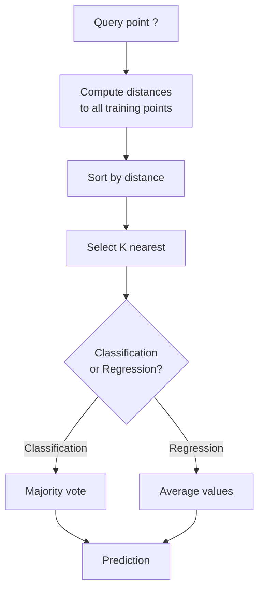
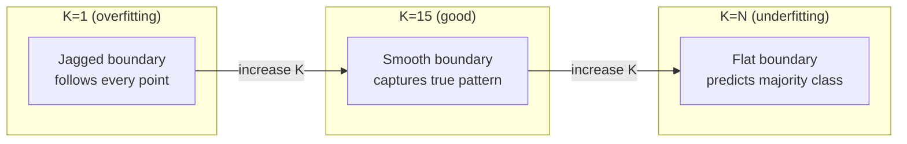
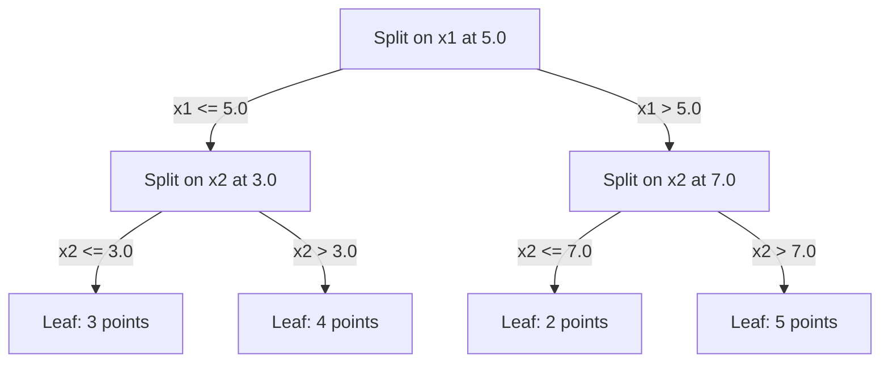

# K近邻与距离

> 存储所有数据点，通过邻居进行预测。这是最简单且实际有效的算法。

**类型:** 构建
**语言:** Python
**前置知识:** 阶段1（第14课 范数与距离）
**时间:** ~90分钟

## 学习目标

- 从零实现KNN分类与回归，支持可配置的K值和距离加权投票
- 比较L1、L2、余弦和闵可夫斯基距离度量，并为给定数据类型选择合适的度量
- 解释维度灾难，并说明KNN在高维空间中性能下降的原因
- 构建KD树以实现高效的最近邻搜索，并分析其优于暴力搜索的条件

## 问题

你有一个数据集。一个新数据点到达。你需要对其进行分类或预测其值。与其从数据中学习参数（如线性回归或SVM），不如只找到离新点最近的K个训练点，让它们投票。

这就是K近邻算法。没有训练阶段。没有需要学习的参数。没有需要最小化的损失函数。你存储整个训练集，并在预测时计算距离。

听起来简单到不像是真的。但KNN在许多问题上出人意料地有竞争力，尤其是中小规模数据集，而深入理解它揭示了基本概念：距离度量的选择（连接阶段1第14课）、维度灾难，以及懒惰学习和急切学习的区别。

KNN也以不同的名称出现在现代AI的各个角落。向量数据库对嵌入进行KNN搜索。检索增强生成（RAG）找到最近的K个文档块。推荐系统找到相似的用户或物品。算法是一样的。只是规模和数据结构不同。

## 核心概念

### KNN的工作原理

给定一个带标签的数据集和一个新的查询点：

1. 计算查询点到数据集中每个点的距离
2. 按距离排序
3. 选取最近的K个点
4. 对于分类：K个邻居的多数投票
5. 对于回归：K个邻居值的平均值（或加权平均值）



这就是整个算法。没有拟合。没有梯度下降。没有训练轮次。

### 选择K值

K是唯一的超参数。它控制着偏差-方差权衡：

|  K  |  行为  |
|---|----------|
|  K = 1  |  决策边界跟随每个点。训练误差为零。高方差。过拟合  |
|  小K（3-5）  |  对局部结构敏感。能捕捉复杂边界  |
|  大K  |  边界更平滑。对噪声更鲁棒。可能欠拟合  |
|  K = N  |  对每个点预测多数类。偏差最大  |

常见的起始点是K = sqrt(N)（对于N个点的数据集）。二分类时使用奇数K以避免平局。



### 距离度量

距离函数定义了“近”的含义。不同的度量产生不同的邻居和不同的预测。

**L2（欧几里得距离）**是默认的。直线距离。

```
d(a, b) = sqrt(sum((a_i - b_i)^2))
```

对特征尺度敏感。使用L2与KNN前务必标准化特征。

**L1（曼哈顿距离）**计算绝对差之和。比L2对异常值更鲁棒，因为它不平方差。

```
d(a, b) = sum(|a_i - b_i|)
```

**余弦距离**测量向量之间的角度，忽略幅度。对于文本和嵌入数据至关重要。

```
d(a, b) = 1 - (a . b) / (||a|| * ||b||)
```

**闵可夫斯基距离**通过参数p推广了L1和L2。

```
d(a, b) = (sum(|a_i - b_i|^p))^(1/p)

p=1: Manhattan
p=2: Euclidean
p->inf: Chebyshev (max absolute difference)
```

选择哪种度量取决于数据：

|  数据类型  |  最佳度量  |  原因  |
|-----------|------------|-----|
|  数值特征，尺度相似  |  L2（欧几里得）  |  默认值，适用于空间数据  |
| 数值特征，异常值  |  L1（曼哈顿距离） |  稳健，不会放大较大差异 |
| 文本嵌入  |  余弦相似度  |  模长是噪声，方向即意义 |
| 高维稀疏数据  |  余弦相似度或L1  |  L2受维度灾难影响严重 |
| 混合类型  |  自定义距离  |  按特征类型组合度量 |

### 加权KNN

标准KNN对所有K个邻居赋予相同权重。但距离为0.1的邻居应比距离为5.0的邻居更重要。

**距离加权KNN** 按距离的倒数对每个邻居赋权：

```
weight_i = 1 / (distance_i + epsilon)

For classification: weighted vote
For regression:     weighted average = sum(w_i * y_i) / sum(w_i)
```

epsilon 防止查询点与训练点完全匹配时除以零。

加权KNN对K值的选择不那么敏感，因为远处邻居无论K值大小贡献都很小。

### 维度灾难

KNN在高维空间中性能下降。这不是一个模糊的问题，而是一个数学事实。

**问题1：距离趋同。** 随着维度增加，最大距离与最小距离之比趋近于1。所有点到查询点的距离几乎相等。

```
In d dimensions, for random uniform points:

d=2:    max_dist / min_dist = varies widely
d=100:  max_dist / min_dist ~ 1.01
d=1000: max_dist / min_dist ~ 1.001

When all distances are nearly equal, "nearest" is meaningless.
```

**问题2：体积爆炸。** 要在固定比例的数据内捕获K个邻居，需要将搜索半径扩展到覆盖更大比例的特征空间。高维空间中的“邻域”涵盖了大部分空间。

**问题3：角落主导。** 在d维单位超立方体中，大部分体积集中在角落附近，而非中心。内切于立方体的球体体积占比随d增长而急剧下降。

实际后果：KNN在特征数约20-50以内效果良好。超出此范围需先进行降维（PCA、UMAP、t-SNE）再应用KNN，或使用基于树的搜索结构来利用数据内在的低维性。

### KD-树：快速最近邻搜索

暴力KNN需计算查询点到每个训练点的距离，每次查询复杂度为O(n*d)。对于大数据集，这太慢。

KD-树沿特征轴递归划分空间。每层沿某一维度在中位数处分割。



为找到最近邻，遍历树至包含查询点的叶节点，然后回溯并仅检查可能包含更近点的相邻分区。

平均查询时间：低维时为O(log n)。但高维（d > 20）时KD-树退化为O(n)，因为回溯时无法有效剪枝。

### 球树：中等维度下的更好选择

球树将数据划分为嵌套的超球体，而非轴对齐的矩形。每个节点定义一个球（中心+半径），包含该子树的所有点。

相比KD-树的优势：
- 在中等维度（约50维以内）效果更好
- 处理非轴对齐结构
- 更紧密的包围体积，搜索时能剪掉更多分支

KD-树和球树都是精确算法。对于真正的大规模搜索（数百万点、数百维），改用近似最近邻方法（HNSW、IVF、乘积量化）。这些将在阶段1第14课中介绍。

### 懒惰学习与急切学习

KNN是懒惰学习器：训练时不进行任何计算，所有工作在预测时完成。大多数其他算法（线性回归、SVM、神经网络）是急切学习器：训练时进行大量计算以构建紧凑模型，预测时快速完成。

|  方面  |  懒惰学习（KNN） |  急切学习（SVM、神经网络） |
|--------|------------|------------------------|
|  训练时间  |  O(1) 仅存储数据  |  O(n * 周期数)  |
|  预测时间  |  O(n * d) 每次查询  |  O(d) 或 O(参数)  |
| 预测时的内存  | 存储整个训练集  | 仅存储模型参数 |
| 适应新数据  | 即时添加数据点  | 重新训练模型 |
| 决策边界(Decision boundary)  | 隐式，即时计算  | 显式，训练后固定 |

懒惰学习(Lazy learning)在以下情况是理想的：
- 数据集频繁变化（无需重新训练即可添加/删除数据点）
- 你只需要对很少的查询进行预测
- 你希望零训练时间
- 数据集足够小，暴力搜索很快

### KNN回归

KNN回归不是采用多数投票，而是对K个邻居的目标值取平均。

```
prediction = (1/K) * sum(y_i for i in K nearest neighbors)

Or with distance weighting:
prediction = sum(w_i * y_i) / sum(w_i)
where w_i = 1 / distance_i
```

KNN回归产生分段常数（或带权重的分段平滑）预测。它无法外推到训练数据范围之外。如果训练目标值都在0到100之间，KNN永远不会预测出200。

```figure
knn-smoothness
```

## 动手构建

### 步骤1：距离函数

实现L1、L2、余弦和闵可夫斯基距离(Minkowski distances)。这些直接与阶段1第14课相关联。

```python
import math

def l2_distance(a, b):
    return math.sqrt(sum((ai - bi) ** 2 for ai, bi in zip(a, b)))

def l1_distance(a, b):
    return sum(abs(ai - bi) for ai, bi in zip(a, b))

def cosine_distance(a, b):
    dot_val = sum(ai * bi for ai, bi in zip(a, b))
    norm_a = math.sqrt(sum(ai ** 2 for ai in a))
    norm_b = math.sqrt(sum(bi ** 2 for bi in b))
    if norm_a == 0 or norm_b == 0:
        return 1.0
    return 1.0 - dot_val / (norm_a * norm_b)

def minkowski_distance(a, b, p=2):
    if p == float('inf'):
        return max(abs(ai - bi) for ai, bi in zip(a, b))
    return sum(abs(ai - bi) ** p for ai, bi in zip(a, b)) ** (1 / p)
```

### 步骤2：KNN分类器和回归器

构建完整的KNN，具有可配置的K、距离度量以及可选的加权距离。

```python
class KNN:
    def __init__(self, k=5, distance_fn=l2_distance, weighted=False,
                 task="classification"):
        self.k = k
        self.distance_fn = distance_fn
        self.weighted = weighted
        self.task = task
        self.X_train = None
        self.y_train = None

    def fit(self, X, y):
        self.X_train = X
        self.y_train = y

    def predict(self, X):
        return [self._predict_one(x) for x in X]
```

### 步骤3：KD树实现高效搜索

从头构建KD树，递归地在每个维度的中位数上分割。

```python
class KDTree:
    def __init__(self, X, indices=None, depth=0):
        # Recursively partition the data
        self.axis = depth % len(X[0])
        # Split on median of the current axis
        ...

    def query(self, point, k=1):
        # Traverse to leaf, then backtrack
        ...
```

参见`code/knn.py`获取包含所有辅助方法和演示的完整实现。

### 步骤4：特征缩放

KNN需要特征缩放，因为距离对特征量级敏感。一个范围从0到1000的特征将主导一个范围从0到1的特征。

```python
def standardize(X):
    n = len(X)
    d = len(X[0])
    means = [sum(X[i][j] for i in range(n)) / n for j in range(d)]
    stds = [
        max(1e-10, (sum((X[i][j] - means[j]) ** 2 for i in range(n)) / n) ** 0.5)
        for j in range(d)
    ]
    return [[((X[i][j] - means[j]) / stds[j]) for j in range(d)] for i in range(n)], means, stds
```

## 使用它

使用 scikit-learn：

```python
from sklearn.neighbors import KNeighborsClassifier
from sklearn.preprocessing import StandardScaler
from sklearn.pipeline import Pipeline

clf = Pipeline([
    ("scaler", StandardScaler()),
    ("knn", KNeighborsClassifier(n_neighbors=5, metric="euclidean")),
])
clf.fit(X_train, y_train)
print(f"Accuracy: {clf.score(X_test, y_test):.4f}")
```

Scikit-learn在数据集足够大且维度足够低时自动使用KD树或球树。对于高维数据，它回退到暴力搜索。你可以通过`algorithm`参数控制。

对于大规模最近邻搜索（数百万向量），使用FAISS、Annoy或向量数据库：

```python
import faiss

index = faiss.IndexFlatL2(dimension)
index.add(embeddings)
distances, indices = index.search(query_vectors, k=5)
```

## 练习

1. 在具有3个类别的2D数据集上实现KNN分类。绘制K=1、K=5、K=15和K=N时的决策边界。观察从过拟合到欠拟合的过渡。

2. 在2、5、10、50、100和500维中生成1000个随机点。对于每个维度，计算最大成对距离与最小成对距离的比值。绘制比值与维度的关系图以可视化维度诅咒(curse of dimensionality)。

3. 在文本分类问题上比较KNN的L1、L2和余弦距离（使用TF-IDF向量）。哪种度量得到最佳准确率？为什么余弦距离在文本上往往胜出？

4. 实现KD树，并测量在2D、10D和50D下1k、10k和100k点数据集的查询时间与暴力搜索的比较。在什么维度下KD树不再比暴力搜索更快？

5. 为y = sin(x) + 噪声构建加权KNN回归器。与K=3、10、30的无权重KNN比较。展示加权产生了更平滑的预测，特别是对于较大的K。

## 关键术语

|  术语  |  实际含义  |
|------|----------------------|
| K最近邻(K-nearest neighbors)  | 通过查找与查询最近的K个训练点进行预测的非参数算法 |
| 懒惰学习(Lazy learning)  | 训练时不进行计算。所有工作发生在预测时。KNN是典型例子 |
| 急切学习(Eager learning)  | 训练时进行大量计算以构建紧凑模型。大多数机器学习算法是急切的 |
| 维度诅咒(Curse of dimensionality)  | 在高维中，距离趋同，邻域扩展覆盖大部分空间，使KNN失效 |
| KD树(KD-tree)  | 沿着特征轴递归划分空间的二叉树。低维下O(log n)查询 |
| 球树(Ball tree)  | 嵌套超球面的树。在中等维度（最多约50）下比KD树效果更好 |
| 加权KNN  |  按距离倒数加权邻居。更近的邻居对预测影响更大 |
| 特征缩放  |  将特征归一化到可比范围。对于KNN等基于距离的方法必需 |
| 多数投票  |  通过统计K个邻居中最常见的类别进行分类 |
| 暴力搜索  |  计算到每个训练点的距离。每次查询O(n*d)。精确但大数据量时慢 |
| 近似最近邻  |  算法（HNSW，LSH，IVF）比精确搜索更快找到近似最近的点 |
| Voronoi图  |  空间划分，每个区域包含离某个训练点比任何其他点更近的所有点。K=1 KNN产生Voronoi边界 |

## 延伸阅读

- [Cover & Hart: Nearest Neighbor Pattern Classification (1967)](https://ieeexplore.ieee.org/document/1053964) - 奠基性的KNN论文，证明其错误率最多为贝叶斯最优的两倍
- [Cover & Hart: Nearest Neighbor Pattern Classification (1967)](https://ieeexplore.ieee.org/document/1053964) - 原始KD-tree论文
- [Cover & Hart: Nearest Neighbor Pattern Classification (1967)](https://ieeexplore.ieee.org/document/1053964) - 最近邻维度灾难的形式化分析
- [Cover & Hart: Nearest Neighbor Pattern Classification (1967)](https://ieeexplore.ieee.org/document/1053964) - 带有算法选择的实用指南
- [Cover & Hart: Nearest Neighbor Pattern Classification (1967)](https://ieeexplore.ieee.org/document/1053964) - Meta的十亿级近似最近邻搜索库
