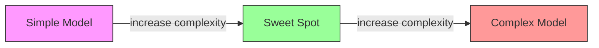
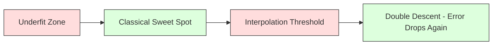
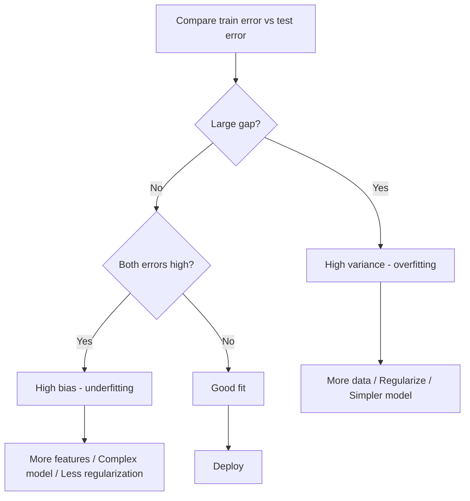
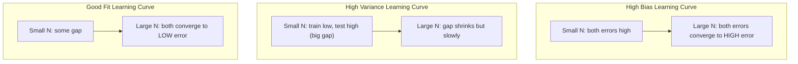
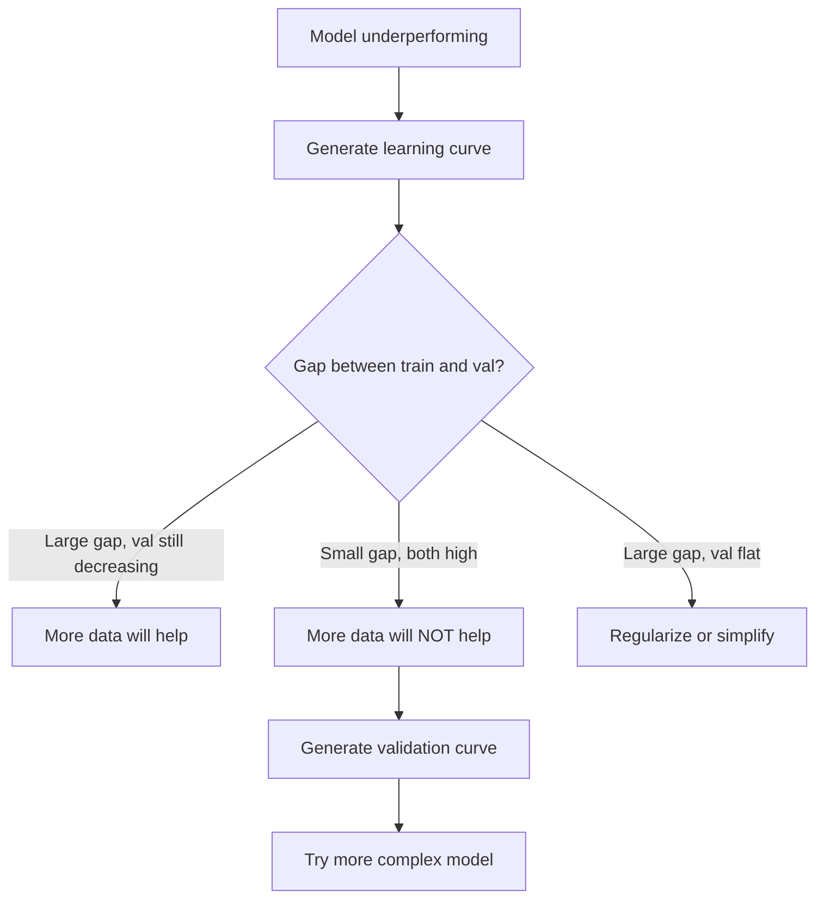

# 偏差-方差权衡

> 每个模型误差都来自三个来源之一：偏差、方差或噪声。你只能控制前两个。

**类型：** 学习
**语言：** Python
**先修知识：** 第二阶段，第01-09课（机器学习基础、回归、分类、评估）
**时长：** 约75分钟

## 学习目标

- 推导期望预测误差的偏差-方差分解，并解释不可约噪声的作用
- 利用训练误差和测试误差模式判断模型是否遭受高偏差或高方差
- 解释正则化技术（L1、L2、Dropout、早停）如何以偏差换取方差
- 实现实验，可视化不同复杂度模型的偏差-方差权衡

## 问题

你训练了一个模型。它在测试数据上有一些误差。这些误差从何而来？

如果你的模型过于简单（在曲线数据集上使用线性回归），它将始终错过真实模式。这就是偏差。如果你的模型过于复杂（在15个数据点上使用20次多项式），它将完美拟合训练数据，但会在新数据上给出截然不同的预测。这就是方差。

对于固定模型容量，你无法同时最小化两者。降低偏差，方差上升；降低方差，偏差上升。理解这一权衡是机器学习中最有用的诊断技能。它告诉你应该让模型更复杂还是更简单，应该获取更多数据还是设计更好的特征，应该增加还是减少正则化。

## 核心概念

### 偏差：系统性误差

偏差衡量模型平均预测值与真实值之间的差距。如果你在来自同一分布的不同训练集上训练同一模型，并平均这些预测，偏差就是该平均值与真实值之间的差距。

高偏差意味着模型过于僵化，无法捕捉真实模式。用一条直线拟合抛物线，无论你给它多少数据，它都会错过曲线。这称为欠拟合。

```
High bias (underfitting):
  Model always predicts roughly the same wrong thing.
  Training error: HIGH
  Test error: HIGH
  Gap between them: SMALL
```

### 方差：对训练数据的敏感性

方差衡量当你用不同数据子集训练时，预测值的变化程度。如果训练集的微小变化导致模型发生巨大变化，则方差高。

高方差意味着模型拟合的是训练数据中的噪声，而不是潜在信号。一个20次多项式会穿过每个训练点，但在它们之间剧烈振荡。这称为过拟合。

```
High variance (overfitting):
  Model fits training data perfectly but fails on new data.
  Training error: LOW
  Test error: HIGH
  Gap between them: LARGE
```

### 分解

对任意点x，平方损失下的期望预测误差可精确分解为：

```
Expected Error = Bias^2 + Variance + Irreducible Noise

where:
  Bias^2   = (E[f_hat(x)] - f(x))^2
  Variance = E[(f_hat(x) - E[f_hat(x)])^2]
  Noise    = E[(y - f(x))^2]             (sigma^2)
```

- `f(x)` 是真实函数
- `f(x)` 是模型的预测
- `f(x)` 是对不同训练集的期望
- `f(x)` 是观察到的标签（真实函数加噪声）

噪声项是不可约的。对于含噪声的数据，任何模型都无法做得比 sigma^2 更好。你的任务是找到偏差^2和方差之间的正确平衡。

### 模型复杂度与误差



经典的U形曲线：

|  复杂度  |  偏差  |  方差  |  总误差  |
|-----------|------|----------|-------------|
|  过低  |  高  |  低  |  高（欠拟合）  |
|  恰好  |  适中  |  适中  |  最低  |
|  过高  |  低  |  高  |  高（过拟合）  |

### 正则化作为偏差-方差控制

正则化刻意增加偏差以减少方差。它约束模型，使其无法追逐噪声。

- **L2（岭回归）：** 将所有权重向零收缩。保留所有特征但降低其影响。
- **L1（套索）：** 将某些权重精确推至零。执行特征选择。
- **Dropout：** 在训练期间随机禁用神经元。强制冗余表示。
- **早停：** 在模型完全拟合训练数据之前停止训练。

正则化强度（λ、Dropout率、迭代次数）直接控制你在偏差-方差曲线上的位置。正则化越强，偏差越大，方差越小。

### 双重下降：现代视角

经典理论认为：过了最佳点后，复杂度增加总会伤害性能。但2019年以来的研究显示了一些意想不到的现象。如果你将模型容量继续增加，远超过插值阈值（模型有足够参数完美拟合训练数据），测试误差可能再次下降。



这种“双重下降”现象解释了为什么过度参数化的神经网络（参数远多于训练样本）仍然泛化良好。经典的偏差-方差权衡并没有错，但对于现代场景来说并不完整。

关于双重下降的关键观察：
- 它发生在线性模型、决策树和神经网络中
- 在插值区域，更多数据反而可能有害（样本维度的双重下降）
- 更多训练周期也可能导致它（周期维度的双重下降）
- 正则化可以平滑峰值，但不能消除它

为什么会发生？在插值阈值处，模型有足够的能力拟合所有训练点。它被迫采用一个非常特定的解，该解穿过了每个点，数据中的微小扰动会导致拟合的剧烈变化。这就是方差达到峰值的地方。超过阈值后，模型有许多可能的解可以完美拟合数据。学习算法（例如，带有隐式正则化的梯度下降）倾向于选择其中最简单的解。这种对简单解的隐式偏好是过参数化模型能够泛化的原因。

|  阶段  |  参数与样本  |  行为  |
|--------|----------------------|----------|
|  欠参数化  |  p << n  |  经典权衡适用  |
|  插值阈值  |  p ~ n  |  方差达到峰值，测试误差飙升  |
|  过参数化  |  p >> n  |  隐式正则化起作用，测试误差下降  |

为了实用目的：如果你使用神经网络或大型树集成，不要停在插值阈值处。要么保持在远低于它的位置（使用显式正则化），要么远超过它。最糟糕的位置就是正好在阈值处。

### 诊断你的模型



|  症状  |  诊断  |  修复  |
|---------|-----------|-----|
|  高训练误差，高测试误差  |  偏差  |  更多特征、更复杂的模型、减少正则化  |
|  低训练误差，高测试误差  |  方差  |  更多数据、正则化、更简单的模型、丢弃法  |
|  低训练误差，低测试误差  |  拟合良好  |  发布吧  |
|  训练误差下降，测试误差上升  |  过拟合进行中  |  早停法  |

### 实用策略

**当偏差是问题时：**
- 添加多项式或交互特征
- 使用更灵活的模型（树集成代替线性）
- 降低正则化强度
- 训练更长时间（如果尚未收敛）

**当方差是问题时：**
- 获取更多训练数据
- 使用装袋法（随机森林）
- 增加正则化（更高的lambda，更多的丢弃法）
- 特征选择（移除噪声特征）
- 使用交叉验证及早发现

### 集成方法与方差缩减

集成方法是对抗方差最实用的工具。

**装袋法（Bootstrap Aggregating）**在训练数据的多个自助采样上训练多个模型，然后平均它们的预测。每个个体模型具有高方差，但平均值的方差要低得多。随机森林是将装袋法应用于决策树。

数学上为什么有效：如果你平均N个独立预测，每个方差为sigma^2，则平均值的方差为sigma^2 / N。这些模型并非真正独立（它们都看到相似的数据），因此方差缩减小于1/N，但仍然显著。

**提升法**通过顺序构建模型来减少偏差，每个新模型专注于到目前为止集成的错误。梯度提升和AdaBoost是主要例子。如果添加太多模型，提升法可能会过拟合，因此需要早停法或正则化。

|  方法  |  主要效果  |  偏差变化  |  方差变化  |
|--------|---------------|-------------|-----------------|
|  装袋法  |  减少方差  |  无变化  |  减少  |
|  提升法  |  减少偏差  |  减少  |  可能增加  |
|  堆叠法  |  两者都减少  |  取决于元学习器  |  取决于基模型  |
|  丢弃法  |  隐式装袋  |  轻微增加  |  减少  |

**实用规则：**如果你的基模型具有高方差（深层树、高次多项式），使用装袋法。如果你的基模型具有高偏差（浅层决策树桩、简单线性模型），使用提升法。

### 学习曲线

学习曲线绘制训练误差和验证误差随训练集大小的变化。它们是你拥有的最实用的诊断工具。与单次训练/测试比较不同，学习曲线展示了模型的轨迹，并告诉你更多数据是否有帮助。



如何解读它们：

|  场景  |  训练误差  |  验证误差  |  差距  |  含义  |  怎么做  |
|----------|---------------|-----------------|-----|---------------|------------|
|  高偏差  |  高  |  高  |  小  |  模型无法捕捉模式  |  更多特征、复杂模型、减少正则化  |
|  高方差  |  低  |  高  |  大  |  模型记忆训练数据  |  更多数据、正则化、更简单的模型  |
|  良好拟合  |  适中  |  适中  |  小  |  模型泛化良好  |  部署它  |
|  高方差，正在改善  |  低  |  随数据增多而下降  |  缩小  |  数据可以解决的方差问题  |  收集更多数据  |
|  高偏差，平坦  |  高  |  高且平坦  |  小且平坦  |  更多数据无帮助  |  更改模型架构  |

关键洞察：如果两条曲线都已趋于平缓，差距很小但两种误差都很高，那么更多数据是无用的。你需要一个更好的模型。如果差距很大且仍在缩小，更多数据会有帮助。

### 如何生成学习曲线

有两种方法：

**方法1：改变训练集大小，固定模型。** 保持模型和超参数不变。在训练数据的逐渐增大的子集上训练。在每个大小上测量训练误差和验证误差。这是标准的学习曲线。

**方法2：改变模型复杂度，固定数据。** 保持数据不变。扫描复杂度参数（多项式次数、树深度、层数）。在每个复杂度上测量训练误差和验证误差。这是一个验证曲线，直接展示了偏差-方差权衡。

两种方法互为补充。第一种告诉你更多数据是否有帮助。第二种告诉你不同的模型是否有帮助。在决定下一步之前，同时运行两者。



```figure
bias-variance
```

## 动手构建

代码`code/bias_variance.py`中运行了完整的偏差-方差分解实验。以下是逐步方法。

### 第1步：从已知函数生成合成数据

我们使用带有高斯噪声的`f(x) = sin(1.5x) + 0.5x`。知道真实函数让我们能够计算精确的偏差和方差。

```python
def true_function(x):
    return np.sin(1.5 * x) + 0.5 * x

def generate_data(n_samples=30, noise_std=0.5, x_range=(-3, 3), seed=None):
    rng = np.random.RandomState(seed)
    x = rng.uniform(x_range[0], x_range[1], n_samples)
    y = true_function(x) + rng.normal(0, noise_std, n_samples)
    return x, y
```

### 第2步：自助采样和多项式拟合

对于每个多项式次数，我们抽取许多自助训练集，拟合多项式，并在固定的测试网格上记录预测。这给出了每个测试点上的预测分布。

```python
def fit_polynomial(x_train, y_train, degree, lam=0.0):
    X = np.column_stack([x_train ** d for d in range(degree + 1)])
    if lam > 0:
        penalty = lam * np.eye(X.shape[1])
        penalty[0, 0] = 0
        w = np.linalg.solve(X.T @ X + penalty, X.T @ y_train)
    else:
        w = np.linalg.lstsq(X, y_train, rcond=None)[0]
    return w
```

我们在200个不同的自助样本上进行拟合。每个自助样本来自相同的底层分布，但包含不同的点。

### 第3步：计算偏差^2、方差分解

在每个测试点上有200组预测，我们可以直接从定义计算分解：

```python
mean_pred = predictions.mean(axis=0)
bias_sq = np.mean((mean_pred - y_true) ** 2)
variance = np.mean(predictions.var(axis=0))
total_error = np.mean(np.mean((predictions - y_true) ** 2, axis=1))
```

- `mean_pred` 是从自助样本估计的 E[f_hat(x)]
- `mean_pred` 是平均预测与真实值之间的平方差距
- `mean_pred` 是预测在自助样本上的平均分散程度
- `mean_pred` 应近似等于偏差^2 + 方差 + 噪声

### 第4步：学习曲线

学习曲线在保持模型复杂度固定的情况下扫描训练集大小。它们显示你的模型是数据受限还是容量受限。

```python
def demo_learning_curves():
    sizes = [10, 15, 20, 30, 50, 75, 100, 150, 200, 300]
    degree = 5

    for n in sizes:
        train_errors = []
        test_errors = []
        for seed in range(50):
            x_train, y_train = generate_data(n_samples=n, seed=seed * 100)
            w = fit_polynomial(x_train, y_train, degree)
            train_pred = predict_polynomial(x_train, w)
            train_mse = np.mean((train_pred - y_train) ** 2)
            test_pred = predict_polynomial(x_test, w)
            test_mse = np.mean((test_pred - y_test) ** 2)
            train_errors.append(train_mse)
            test_errors.append(test_mse)
        # Average over runs gives the learning curve point
```

对于一个高方差模型（小数据量下的5次多项式），你会看到：
- 训练误差开始时很低，随着更多数据使记忆变得更难而增加
- 测试误差开始时很高，随着模型获得更多信号而降低
- 差距随着数据增多而缩小

对于一个高偏差模型（1次多项式），两种误差迅速收敛到相同的高值，更多数据没有帮助。

### 第5步：正则化扫描

代码还包括`demo_regularization_sweep()`，它固定一个高次多项式（15次），并从0.001到100扫描Ridge正则化强度。这从不同角度展示了偏差-方差权衡：不是改变模型复杂度，而是改变约束强度。

```python
def demo_regularization_sweep():
    alphas = [0.001, 0.005, 0.01, 0.05, 0.1, 0.5, 1.0, 5.0, 10.0, 50.0, 100.0]
    for alpha in alphas:
        results = bias_variance_decomposition([15], lam=alpha)
        r = results[15]
        print(f"alpha={alpha:.3f}  bias={r['bias_sq']:.4f}  var={r['variance']:.4f}")
```

在低alpha值时，15次多项式几乎不受约束。方差占主导地位，因为模型在每次自助采样中追逐噪声。在高alpha值时，惩罚过强，模型实际上变成了接近常数的函数。偏差占主导地位。最优alpha值位于这两个极端之间。

这是与改变多项式阶数相同的U形曲线，但通过连续旋钮而不是离散旋钮来控制。在实践中，正则化是控制这种权衡的首选方式，因为它可以在不改变特征集的情况下实现精细控制。

## 使用它

sklearn提供了`learning_curve`和`validation_curve`来自动化这些诊断，无需编写自助循环。

### 验证曲线：扫描模型复杂度

```python
from sklearn.model_selection import validation_curve
from sklearn.pipeline import make_pipeline
from sklearn.preprocessing import PolynomialFeatures
from sklearn.linear_model import Ridge

degrees = list(range(1, 16))
train_scores_all = []
val_scores_all = []

for d in degrees:
    pipe = make_pipeline(PolynomialFeatures(d), Ridge(alpha=0.01))
    train_scores, val_scores = validation_curve(
        pipe, X, y, param_name="polynomialfeatures__degree",
        param_range=[d], cv=5, scoring="neg_mean_squared_error"
    )
    train_scores_all.append(-train_scores.mean())
    val_scores_all.append(-val_scores.mean())
```

这直接给出了偏差-方差权衡曲线。当验证分数相对于训练分数最差时，方差占主导。当两者都很差时，偏差占主导。

### 学习曲线：扫描训练集大小

```python
from sklearn.model_selection import learning_curve

pipe = make_pipeline(PolynomialFeatures(5), Ridge(alpha=0.01))
train_sizes, train_scores, val_scores = learning_curve(
    pipe, X, y, train_sizes=np.linspace(0.1, 1.0, 10),
    cv=5, scoring="neg_mean_squared_error"
)
train_mse = -train_scores.mean(axis=1)
val_mse = -val_scores.mean(axis=1)
```

绘制`train_mse`和`val_mse`相对于`train_sizes`的曲线。其形状能告诉你关于模型的一切。

### 带正则化扫描的交叉验证

```python
from sklearn.model_selection import cross_val_score

alphas = [0.001, 0.01, 0.1, 1.0, 10.0, 100.0]
for alpha in alphas:
    pipe = make_pipeline(PolynomialFeatures(10), Ridge(alpha=alpha))
    scores = cross_val_score(pipe, X, y, cv=5, scoring="neg_mean_squared_error")
    print(f"alpha={alpha:>7.3f}  MSE={-scores.mean():.4f} +/- {scores.std():.4f}")
```

对于固定的模型复杂度，扫描正则化强度。你会看到相同的偏差-方差权衡：低alpha意味着高方差，高alpha意味着高偏差。

### 综合运用：完整的诊断工作流程

在实践中，你按顺序运行这些诊断：

1. 训练你的模型。计算训练误差和测试误差。
2. 如果两者都高：存在偏差问题。跳到步骤4。
3. 如果训练误差低但测试误差高：存在方差问题。生成学习曲线以查看更多数据是否有帮助。如果没有帮助，则进行正则化。
4. 生成一个验证曲线，扫描主要复杂度参数。找到最佳点。
5. 在最佳点，生成学习曲线。如果差距仍然很大，需要更多数据或正则化。
6. 使用`cross_val_score`尝试具有不同alpha值的Ridge/Lasso。选择交叉验证误差最小的alpha。

对于大多数表格数据集，这需要10-15分钟的计算时间，并节省数小时的猜测时间。

## 发布

本课产出：`outputs/prompt-model-diagnostics.md`

## 练习

1. 使用`noise_std=0`（无噪声）运行分解。不可约误差项会发生什么变化？最优复杂度会改变吗？

2. 将训练集大小从30增加到300。这会如何影响方差分量？最优多项式阶数会移动吗？

3. 向实验添加L2正则化（Ridge回归）。对于固定的高次多项式（15次），将lambda从0扫描到100。绘制偏差^2和方差作为lambda的函数。

4. 将真实函数从多项式修改为`sin(x)`。偏差-方差分解如何变化？是否仍然存在清晰的最优阶数？

5. 实现一个简单的自助聚合(bagging)包装器：在自助样本上训练10个模型并对预测求平均。证明这能在不显著增加偏差的情况下减少方差。

## 关键术语

|  术语  |  人们的说法  |  实际含义  |
|------|----------------|----------------------|
| 偏差 | "模型过于简单" | 由错误假设导致的系统性误差。平均模型预测与真实值之间的差距。 |
| 方差 | "模型过拟合" | 对训练数据敏感带来的误差。预测在不同训练集之间的变化程度。 |
| 不可约误差 | "数据中的噪声" | 真实数据生成过程中的随机性带来的误差。没有模型能消除它。 |
| 欠拟合 | "学习不足" | 模型偏差高。即使在训练数据上也错过了真正的模式。 |
| 过拟合 | "记住数据" | 模型方差高。拟合了训练数据中的噪声，导致泛化能力差。 |
| 正则化 | "约束模型" | 添加惩罚以降低模型复杂度，用偏差换取更低的方差。 |
| 双重下降 | "更多参数可能有帮助" | 当模型容量远超插值阈值时，测试误差再次下降。 |
| 模型复杂度 | "模型的灵活程度" | 模型拟合任意模式的能力。由架构、特征或正则化控制。 |

## 延伸阅读

- [Hastie, Tibshirani, Friedman: Elements of Statistical Learning, Ch. 7](https://hastie.su.domains/ElemStatLearn/) -- 对偏差-方差分解的权威论述
- [Hastie, Tibshirani, Friedman: Elements of Statistical Learning, Ch. 7](https://hastie.su.domains/ElemStatLearn/) -- 双重下降论文
- [Hastie, Tibshirani, Friedman: Elements of Statistical Learning, Ch. 7](https://hastie.su.domains/ElemStatLearn/) -- 逐轮次和逐样本的双重下降
- [Hastie, Tibshirani, Friedman: Elements of Statistical Learning, Ch. 7](https://hastie.su.domains/ElemStatLearn/) -- 清晰的视觉解释
