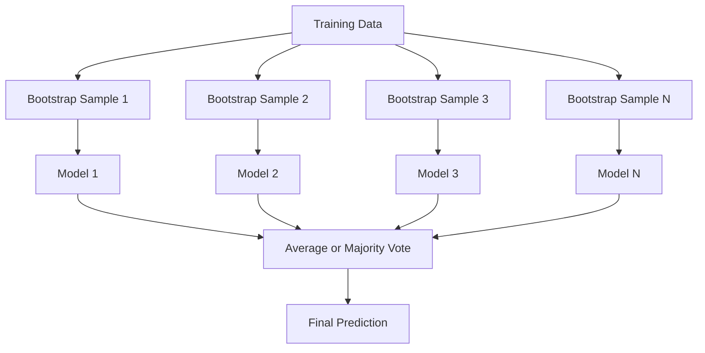
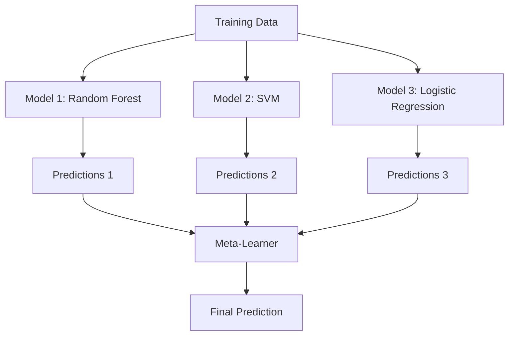

# 集成方法

> 一群弱学习器(weak learner)，正确组合起来，就成为一个强学习器(strong learner)。这不是比喻。这是一个定理。

**类型：** 构建
**语言：** Python
**先修知识：** 阶段2，第10课（偏差-方差权衡(Bias-Variance Tradeoff)）
**时间：** 约120分钟

## 学习目标

- 从零实现AdaBoost和梯度提升(gradient boosting)，并解释提升(Boosting)如何顺序地减少偏差
- 构建一个装袋(Bagging)集成，并演示如何平均去相关模型来减少方差而不增加偏差
- 比较装袋、提升和堆叠(Stacking)各自针对的误差成分
- 评估集成多样性，并解释为什么多数投票准确率随着更多独立的弱学习器而提高

## 问题

单个决策树训练快且易于解释，但会过拟合。单个线性模型在复杂边界上欠拟合。你可以花几天时间设计完美的模型架构。或者，你可以组合一堆不完美的模型，得到比其中任何一个都更好的结果。

集成方法(Ensemble methods)正是这样做的。它们是在表格数据上赢得Kaggle竞赛最可靠的技术，驱动着大多数生产级机器学习系统，并展示了偏差-方差权衡的实际应用。装袋减少方差。提升减少偏差。堆叠学习在哪些输入上信任哪些模型。

## 核心概念

### 为什么集成有效

假设你有N个独立的分类器，每个的准确率p > 0.5。多数投票的准确率为：

```
P(majority correct) = sum over k > N/2 of C(N,k) * p^k * (1-p)^(N-k)
```

对于21个准确率均为60%的分类器，多数投票准确率约为74%。当有101个分类器时，上升到84%。当模型犯不同的错误时，错误会相互抵消。

关键要求是**多样性**。如果所有模型都犯相同错误，组合它们毫无帮助。集成之所以有效，是因为它们通过以下方式产生多样化的模型：

- 不同的训练子集（装袋）
- 不同的特征子集（随机森林）
- 顺序误差修正（提升）
- 不同的模型家族（堆叠）

### 装袋（自助聚合）

装袋通过在训练数据的不同自助样本(bootstrap sample)上训练每个模型来产生多样性。



自助样本是从原始数据中有放回地抽取的，大小与原始数据相同。每个自助样本中大约出现63.2%的唯一样本。剩下的36.8%（袋外样本(out-of-bag samples)）提供了一个免费的验证集。

装袋减少方差而不显著增加偏差。每个单独的树对其自助样本过拟合，但过拟合对于每棵树是不同的，因此平均化消除了噪声。

**随机森林(Random Forests)**是装袋的一个变种：在每个分裂点，只考虑特征的随机子集。这迫使树之间更加多样化。典型的候选特征数量对于分类是`sqrt(n_features)`，对于回归是`n_features / 3`。

### 提升（顺序误差修正）

提升顺序地训练模型。每个新模型专注于先前模型出错的样本。


提升减少偏差。每个新模型修正当前集成系统的误差。最终预测是所有模型的加权和，其中更好的模型获得更高的权重。

权衡：如果运行太多轮次，提升可能会过拟合，因为它不断拟合更难的样本，其中一些可能是噪声。

### AdaBoost

AdaBoost（自适应提升(Adaptive Boosting)）是第一个实用的提升算法。它可以与任何基学习器(base learner)一起使用，通常是决策树桩(decision stump)（深度为1的树）。

算法步骤：

```
1. Initialize sample weights: w_i = 1/N for all i

2. For t = 1 to T:
   a. Train weak learner h_t on weighted data
   b. Compute weighted error:
      err_t = sum(w_i * I(h_t(x_i) != y_i)) / sum(w_i)
   c. Compute model weight:
      alpha_t = 0.5 * ln((1 - err_t) / err_t)
   d. Update sample weights:
      w_i = w_i * exp(-alpha_t * y_i * h_t(x_i))
   e. Normalize weights to sum to 1

3. Final prediction: H(x) = sign(sum(alpha_t * h_t(x)))
```

误差更低的模型获得更高的alpha。被错误分类的样本获得更高的权重，以便下一个模型关注它们。

### 梯度提升(Gradient Boosting)

梯度提升将提升推广到任意损失函数。它不是重新加权样本，而是将每个新模型拟合到当前集成的残差（损失的负梯度）。

```
1. Initialize: F_0(x) = argmin_c sum(L(y_i, c))

2. For t = 1 to T:
   a. Compute pseudo-residuals:
      r_i = -dL(y_i, F_{t-1}(x_i)) / dF_{t-1}(x_i)
   b. Fit a tree h_t to the residuals r_i
   c. Find optimal step size:
      gamma_t = argmin_gamma sum(L(y_i, F_{t-1}(x_i) + gamma * h_t(x_i)))
   d. Update:
      F_t(x) = F_{t-1}(x) + learning_rate * gamma_t * h_t(x)

3. Final prediction: F_T(x)
```

对于平方误差损失，伪残差就是实际残差：`r_i = y_i - F_{t-1}(x_i)`。每棵树实际上拟合了先前集成的误差。

学习率（收缩(shrinkage)）控制每棵树的贡献程度。较小的学习率需要更多的树，但泛化能力更好。典型值：0.01到0.3。

### XGBoost：为什么它主导表格数据

XGBoost（极限梯度提升(eXtreme Gradient Boosting)）是带有工程优化的梯度提升，使其快速、准确且抗过拟合：

- **正则化目标(Regularized objective):** 对叶子权重的L1和L2惩罚防止单个树过于自信
- **二阶近似(Second-order approximation):** 使用损失的一阶和二阶导数，提供更好的分裂决策
- **感知稀疏的分裂(Sparsity-aware splits):** 通过在每个分裂点学习缺失数据的最佳方向，原生处理缺失值
- **列子采样(Column subsampling):** 类似随机森林，在每个分裂点采样特征以增加多样性
- **加权分位数草图(Weighted quantile sketch):** 高效地在分布式数据上为连续特征寻找分裂点
- **缓存感知块结构(Cache-aware block structure):** 内存布局针对CPU缓存行优化

对于表格数据，XGBoost（及其后继者 LightGBM）持续优于神经网络。这种情况短期内不会改变。如果您的数据适合行和列的表格，请从梯度提升开始。

### 堆叠（元学习）

堆叠使用多个基模型的预测作为元学习器的特征。



元学习器学习在哪些输入下信任哪个基模型。如果随机森林在某些区域更好，而支持向量机在其他区域更好，元学习器将学习相应地路由。

为了避免数据泄露，基模型的预测必须通过在训练集上进行交叉验证来生成。永远不要在同一数据上训练基模型并生成元特征。

### 投票

最简单的集成方法。直接组合预测结果。

- **硬投票：** 对类别标签进行多数投票。
- **软投票：** 平均预测概率，选择平均概率最高的类别。通常更好，因为它利用了置信度信息。

## 动手构建

### 步骤 1：决策桩（基学习器）

`code/ensembles.py` 中的代码从头实现了所有内容。我们从决策桩开始：只有一个分裂的树。

```python
class DecisionStump:
    def __init__(self):
        self.feature_idx = None
        self.threshold = None
        self.polarity = 1
        self.alpha = None

    def fit(self, X, y, weights):
        n_samples, n_features = X.shape
        best_error = float("inf")

        for f in range(n_features):
            thresholds = np.unique(X[:, f])
            for thresh in thresholds:
                for polarity in [1, -1]:
                    pred = np.ones(n_samples)
                    pred[polarity * X[:, f] < polarity * thresh] = -1
                    error = np.sum(weights[pred != y])
                    if error < best_error:
                        best_error = error
                        self.feature_idx = f
                        self.threshold = thresh
                        self.polarity = polarity

    def predict(self, X):
        n = X.shape[0]
        pred = np.ones(n)
        idx = self.polarity * X[:, self.feature_idx] < self.polarity * self.threshold
        pred[idx] = -1
        return pred
```

### 步骤 2：从头实现 AdaBoost

```python
class AdaBoostScratch:
    def __init__(self, n_estimators=50):
        self.n_estimators = n_estimators
        self.stumps = []
        self.alphas = []

    def fit(self, X, y):
        n = X.shape[0]
        weights = np.full(n, 1 / n)

        for _ in range(self.n_estimators):
            stump = DecisionStump()
            stump.fit(X, y, weights)
            pred = stump.predict(X)

            err = np.sum(weights[pred != y])
            err = np.clip(err, 1e-10, 1 - 1e-10)

            alpha = 0.5 * np.log((1 - err) / err)
            weights *= np.exp(-alpha * y * pred)
            weights /= weights.sum()

            stump.alpha = alpha
            self.stumps.append(stump)
            self.alphas.append(alpha)

    def predict(self, X):
        total = sum(a * s.predict(X) for a, s in zip(self.alphas, self.stumps))
        return np.sign(total)
```

### 步骤 3：从头实现梯度提升

```python
class GradientBoostingScratch:
    def __init__(self, n_estimators=100, learning_rate=0.1, max_depth=3):
        self.n_estimators = n_estimators
        self.lr = learning_rate
        self.max_depth = max_depth
        self.trees = []
        self.initial_pred = None

    def fit(self, X, y):
        self.initial_pred = np.mean(y)
        current_pred = np.full(len(y), self.initial_pred)

        for _ in range(self.n_estimators):
            residuals = y - current_pred
            tree = SimpleRegressionTree(max_depth=self.max_depth)
            tree.fit(X, residuals)
            update = tree.predict(X)
            current_pred += self.lr * update
            self.trees.append(tree)

    def predict(self, X):
        pred = np.full(X.shape[0], self.initial_pred)
        for tree in self.trees:
            pred += self.lr * tree.predict(X)
        return pred
```

### 步骤 4：与 sklearn 比较

该代码验证了我们从头实现的方案与 sklearn 的 `AdaBoostClassifier` 和 `GradientBoostingClassifier` 产生相似的准确率，并并排比较所有方法。

## 使用它

### 何时使用每种方法

|  方法  |  降低  |  最适合  |  注意  |
|--------|---------|----------|---------------|
|  装袋/随机森林  |  方差  |  噪声数据、多特征  |  不帮助降低偏差  |
|  AdaBoost  |  偏差  |  干净数据、简单基学习器  |  对异常值和噪声敏感  |
|  梯度提升  |  偏差  |  表格数据、竞赛  |  训练缓慢，未调参时容易过拟合  |
|  XGBoost / LightGBM  |  两者  |  生产环境表格机器学习  |  超参数众多  |
|  堆叠  |  两者  |  获得最后 1-2% 准确率  |  复杂，元学习器过拟合风险  |
|  投票  |  方差  |  快速组合多样模型  |  仅在模型多样时有效  |

### 表格数据的生产级技术栈

对于大多数表格预测问题，建议按以下顺序尝试：

1. **LightGBM 或 XGBoost** 使用默认参数
2. 调整 n_estimators、learning_rate、max_depth、min_child_weight
3. 如果需要最后 0.5% 的准确率，构建包含 3-5 个不同模型的堆叠集成
4. 全程使用交叉验证

表格数据上的神经网络几乎总是比梯度提升差，尽管持续有研究尝试。TabNet、NODE 和类似架构偶尔能匹配，但很少能击败经过良好调优的 XGBoost。

## 发布

本课程生成 `outputs/prompt-ensemble-selector.md` —— 一个帮助您为给定数据集选择正确集成方法的提示。描述您的数据（大小、特征类型、噪声水平、类别平衡）以及您正在解决的问题。该提示逐步引导决策检查清单，推荐方法，建议起始超参数，并警告该方法的常见错误。同时生成包含完整选择指南的 `outputs/skill-ensemble-builder.md`。

## 练习

1. 修改 AdaBoost 实现以跟踪每轮后的训练准确率。绘制准确率与估计器数量的关系图。它在什么时候收敛？

2. 通过向回归树添加随机特征子抽样，从头实现随机森林。使用 `max_features=sqrt(n_features)` 训练 100 棵树并平均预测结果。与单棵树比较方差减少。

3. 在梯度提升实现中，添加早停：每轮后跟踪验证损失，并在连续 10 轮未改善时停止。它实际上需要多少棵树？

4. 构建一个堆叠集成，包含三个基模型（逻辑回归、决策树、k近邻）和一个逻辑回归元学习器。使用5折交叉验证生成元特征。与每个基模型单独比较。

5. 在相同数据集上使用默认参数运行XGBoost。将其准确率与从头实现的梯度提升比较。对两者计时。速度差异有多大？

## 关键术语

|  术语  |  人们的说法  |  实际含义  |
|------|----------------|----------------------|
|  Bagging  |  "在随机子集上训练"  |  自举聚合：在自举样本上训练模型，平均预测以降低方差  |
|  Boosting  |  "关注困难样本"  |  序列训练模型，每个模型纠正前序整体的错误，以降低偏差  |
|  AdaBoost  |  "重新加权数据"  |  通过样本权重更新的提升方法；误分类点获得更高权重供下一个学习器学习  |
|  Gradient boosting  |  "拟合残差"  |  通过让每个新模型拟合损失函数的负梯度来提升  |
|  XGBoost  |  "Kaggle的武器"  |  带正则化、二阶优化和系统级速度优化的梯度提升  |
|  Stacking  |  "模型堆叠"  |  将基模型的预测作为元学习器的输入特征  |
|  Random forest  |  "大量随机树"  |  决策树的自举聚合，每次分裂时随机选择特征子集以增加多样性  |
|  Ensemble diversity  |  "犯不同的错误"  |  模型的错误必须不相关，集成才能优于单个模型  |
|  Out-of-bag error  |  "免费验证"  |  未出现在自举样本中的样本（约36.8%）作为验证集，无需额外划分  |

## 延伸阅读

- [Schapire & Freund: Boosting: Foundations and Algorithms](https://mitpress.mit.edu/9780262526036/) -- AdaBoost创始人的书籍
- [Schapire & Freund: Boosting: Foundations and Algorithms](https://mitpress.mit.edu/9780262526036/) -- 原始梯度提升论文
- [Schapire & Freund: Boosting: Foundations and Algorithms](https://mitpress.mit.edu/9780262526036/) -- XGBoost论文
- [Schapire & Freund: Boosting: Foundations and Algorithms](https://mitpress.mit.edu/9780262526036/) -- 原始堆叠论文
- [Schapire & Freund: Boosting: Foundations and Algorithms](https://mitpress.mit.edu/9780262526036/) -- 实用参考
