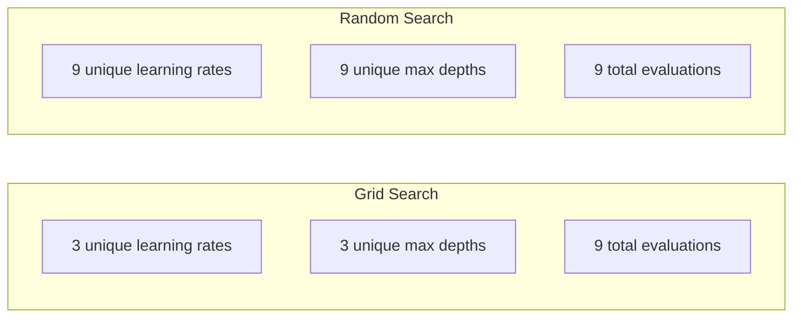
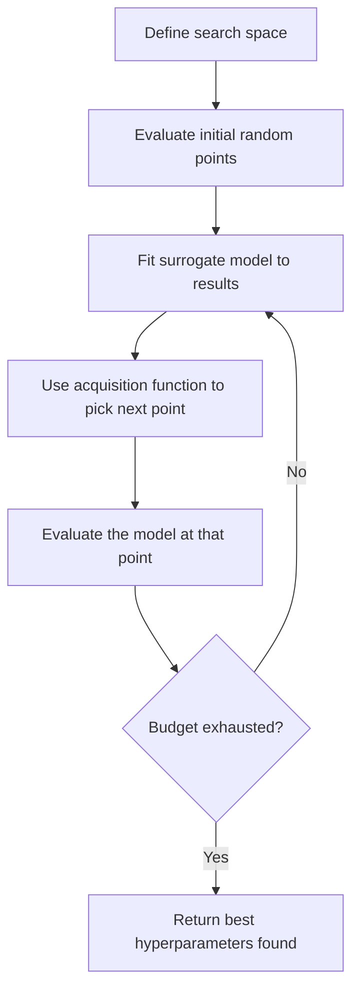
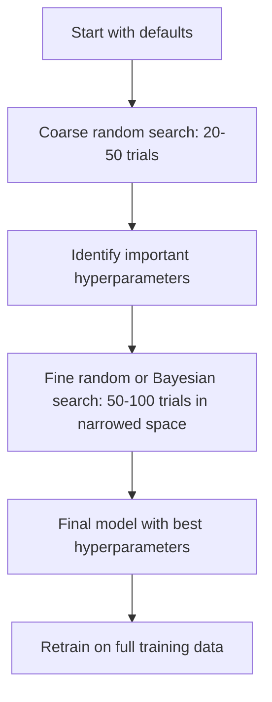
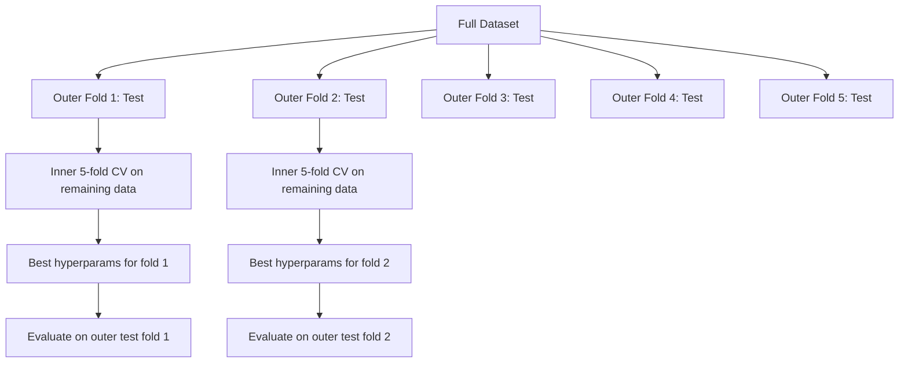

# 超参数调优

> 超参数是在训练开始前需要调节的旋钮。调好它们，就是平庸模型与优秀模型之间的差别。

**类型：** 构建
**语言：** Python
**前置知识：** 阶段2，第11课（集成方法）
**时间：** 约90分钟

## 学习目标

- 从零实现网格搜索、随机搜索和贝叶斯优化，并比较它们的样本效率
- 解释为什么当大部分超参数具有低有效维度时随机搜索优于网格搜索
- 构建一个使用代理模型和采集函数指导搜索的贝叶斯优化循环
- 设计一个超参数调优策略，通过适当的交叉验证避免在验证集上过拟合

## 问题

你的梯度提升模型有学习率、树的数量、最大深度、每叶最小样本数、子采样比例和列采样比例。总共六个超参数。如果每个有5个合理的取值，网格就有5^6 = 15,625种组合。每种组合训练需要10秒。尝试所有组合需要43小时的计算时间。

网格搜索是最直观的方法，但在大规模情况下也是最差的。随机搜索用更少的计算量做得更好。贝叶斯优化通过从过去的评估中学习做得更好。知道使用哪种策略，以及哪些超参数真正重要，可以节省数天浪费的GPU时间。

## 核心概念

### 参数 vs 超参数

参数是在训练过程中学习到的（权重、偏置、分裂阈值）。超参数是在训练开始前设置的，控制学习如何进行。

|  超参数  |  控制的内容  |  典型范围  |
|---------------|-----------------|---------------|
|  学习率  |  每次更新的步长  |  0.001 到 1.0  |
|  树的数量/轮数  |  训练多长时间  |  10 到 10,000  |
|  最大深度  |  模型复杂度  |  1 到 30  |
|  正则化（lambda）  |  防止过拟合  |  0.0001 到 100  |
|  批量大小  |  梯度估计噪声  |  16 到 512  |
|  Dropout率  |  丢弃神经元的比例  |  0.0 到 0.5  |

### 网格搜索

网格搜索评估指定值的所有组合。它是穷举的，易于理解，但随着超参数数量呈指数级增长。

```
Grid for 2 hyperparameters:

  learning_rate: [0.01, 0.1, 1.0]
  max_depth:     [3, 5, 7]

  Evaluations: 3 x 3 = 9 combinations

  (0.01, 3)  (0.01, 5)  (0.01, 7)
  (0.1,  3)  (0.1,  5)  (0.1,  7)
  (1.0,  3)  (1.0,  5)  (1.0,  7)
```

网格搜索有一个根本缺陷：如果一个超参数重要而另一个不重要，大部分评估都被浪费了。从9次评估中，你只能得到重要参数的3个唯一值。

### 随机搜索

随机搜索从分布中采样超参数，而不是网格。在同样9次评估的预算下，每个超参数你都能得到9个唯一值。



为什么随机优于网格（Bergstra & Bengio, 2012）：

- 大多数超参数具有低有效维度。对于给定问题，6个超参数中通常只有1-2个重要。
- 网格搜索在不重要的维度上浪费评估。
- 随机搜索在相同预算下更密集地覆盖重要维度。
- 在60次随机试验中，你有95%的概率找到距离最优值5%以内的点（如果搜索空间中存在最优值）。

### 贝叶斯优化

随机搜索忽略结果。它没有学到高学习率会导致发散，或者深度3始终优于深度10。贝叶斯优化利用过去的评估来决定下一步搜索哪里。



两个关键组成部分：

**代理模型：** 一个廉价评估的模型（通常是高斯过程），近似昂贵的目标函数。它在搜索空间的任何点同时给出预测和不确定性估计。

**采集函数：** 通过平衡利用（在已知好点附近搜索）和探索（在不确定性高的地方搜索）来决定下一步在哪里评估。常见选择：

- **期望提升（EI）：** 我们期望该点比当前最好点改善多少？
- **上置信界（UCB）：** 预测加上不确定性倍数。较高的UCB表示要么有前景，要么未探索。
- **改善概率（PI）：** 该点优于当前最好点的概率是多少？

贝叶斯优化通常比随机搜索用少2-5倍的评估就能找到更好的超参数。拟合代理模型的开销相对于训练实际模型可以忽略不计。

### 早停

并非每次训练都需要完成。如果一个配置在10个轮次(epoch)后明显不佳，就停止它并继续前进。这就是超参数搜索中的早停法(Early Stopping)。

策略：
- **基于耐心(Patience-based)：** 如果验证损失(validation loss)连续N个轮次(epoch)没有改善则停止。
- **中位数剪枝(Median pruning)：** 如果试验的中间结果比同一阶段已完成试验的中位数差则停止。
- **超级带(Hyperband)：** 为许多配置分配少量预算，然后逐步为最佳配置增加预算。

超级带(Hyperband)特别有效。它从81个配置开始，每个配置运行1个轮次(epoch)，保留前三分之一，给它们3个轮次(epoch)，再保留前三分之一，依此类推。这比评估所有配置的全部预算快10-50倍找到好的配置。

### 学习率调度器(Learning Rate Schedulers)

学习率(Learning Rate)几乎总是最重要的超参数。调度器(Scheduler)不是保持它固定，而是在训练过程中调整它。

| 调度器(Scheduler) | 公式 | 使用时机 |
|-----------|---------|-------------|
| 步长衰减(Step decay) | 每N个轮次(epoch)乘以0.1 | 经典CNN训练 |
| 余弦退火(Cosine annealing) | lr * 0.5 * (1 + cos(pi * t / T)) | 现代默认 |
| 预热+衰减(Warmup + decay) | 线性增加然后余弦衰减 | Transformers |
| 单周期(One-cycle) | 在一个周期内先增加后减少 | 快速收敛 |
| 平台衰减(Reduce on plateau) | 当指标停滞时按因子减少 | 安全默认 |

### 超参数重要性(Hyperparameter Importance)

并非所有超参数都同等重要。关于随机森林(Random Forest)（Probst等人，2019）和梯度提升(Gradient Boosting)的研究显示了一致的模式：

**高重要性：**
- 学习率(Learning Rate)（始终优先调整）
- 估计器(Estimator)数量/轮次(epoch)（使用早停法(Early Stopping)代替调整）
- 正则化强度(Regularization strength)

**中等重要性：**
- 最大深度(Max depth)/层数(Layer)
- 每叶最小样本数(Min samples per leaf)/权重衰减(Weight decay)
- 子样本比(Subsample ratio)

**低重要性：**
- 最大特征数(Max features)(用于随机森林(Random Forest))
- 具体激活函数(Activation Function)选择
- 批量大小(Batch size)(在合理范围内)

先调整重要的超参数，其余保留默认值。

### 实用策略



具体工作流：

1. **从库默认值开始。** 这些默认值由经验丰富的从业者选择，通常能达到80%的效果。
2. **粗粒度的随机搜索。** 大范围，20-50次试验。使用早停法(Early Stopping)快速终止不良运行。
3. **分析结果。** 哪些超参数与性能相关？缩小搜索空间。
4. **精细搜索。** 在缩小的空间内进行贝叶斯优化(Bayesian optimization)或聚焦随机搜索。50-100次试验。
5. **使用找到的最佳超参数在所有训练数据上重新训练。**

### 交叉验证集成(Cross-Validation Integration)

在单一的验证集划分(Validation Split)上调整超参数是有风险的。最佳超参数可能过拟合到特定的验证折(Validation Fold)。嵌套交叉验证(Nested Cross-Validation)通过使用两个循环来解决这个问题：

- **外循环(Outer loop)**（评估）：将数据划分为训练+验证和测试。报告无偏性能。
- **内循环(Inner loop)**（调整）：将训练+验证划分为训练和验证。找到最佳超参数。



每个外折(Outer Fold)独立地找到自己的最佳超参数。外部分数(Outer Score)是泛化性能的无偏估计。

使用sklearn：

```python
from sklearn.model_selection import cross_val_score, GridSearchCV
from sklearn.ensemble import GradientBoostingRegressor

inner_cv = GridSearchCV(
    GradientBoostingRegressor(),
    param_grid={
        "learning_rate": [0.01, 0.05, 0.1],
        "max_depth": [2, 3, 5],
        "n_estimators": [50, 100, 200],
    },
    cv=5,
    scoring="neg_mean_squared_error",
)

outer_scores = cross_val_score(
    inner_cv, X, y, cv=5, scoring="neg_mean_squared_error"
)

print(f"Nested CV MSE: {-outer_scores.mean():.4f} +/- {outer_scores.std():.4f}")
```

这是昂贵的（5个外折(Outer Fold) × 5个内折(Inner Fold) × 27个网格点 = 675次模型拟合），但它给出了可信的性能估计。在论文中报告最终结果或决策风险较高时使用它。

### 实用技巧

**从学习率开始。** 对于基于梯度的方法，它始终是最重要的超参数。糟糕的学习率会让其他一切变得无关紧要。将其他超参数固定为默认值，首先扫描学习率。

**对学习率和正则化使用对数均匀分布。** 0.001 与 0.01 之间的差异与 0.1 与 1.0 之间的差异同样重要。线性搜索会在数值较大的一端浪费预算。

**使用早停法代替调整 n_estimators。** 对于提升方法和神经网络，将 n_estimators 或 epochs 设置得较高，让早停法决定何时停止。这样可以从搜索中移除一个超参数。

**预算分配。** 将调参预算的 60% 花在最重要的两个超参数上。剩余的 40% 花在其他所有参数上。最重要的两个超参数决定了大部分性能变化。

**尺度很重要。** 永远不要在对数尺度上搜索批大小（16, 32, 64 即可）。始终在对数尺度上搜索学习率。将搜索分布与超参数对模型的影响方式匹配。

|  模型类型  |  主要超参数  |  推荐搜索方法  |  预算  |
|-----------|--------------------|--------------------|--------|
|  随机森林  |  n_estimators, max_depth, min_samples_leaf  |  随机搜索, 50 次试验  |  低（训练快）  |
|  梯度提升  |  learning_rate, n_estimators, max_depth  |  贝叶斯优化, 100 次试验 + 早停法  |  中等  |
|  神经网络  |  learning_rate, weight_decay, batch_size  |  贝叶斯或随机搜索, 100+ 次试验  |  高（训练慢）  |
|  SVM  |  C, gamma（RBF 核）  |  对数尺度网格搜索, 25-50 次试验  |  低（2 个参数）  |
|  Lasso/Ridge  |  alpha  |  对数尺度一维搜索, 20 次试验  |  非常低  |
|  XGBoost  |  learning_rate, max_depth, subsample, colsample  |  贝叶斯优化, 100-200 次试验 + 早停法  |  中等  |

**不确定时：** 使用试验次数为超参数数量 2 倍的随机搜索（例如，6 个超参数至少需要 12 次试验）。你会惊讶地发现，50 次试验的随机搜索常常比精心设计的网格搜索效果更好。

```figure
k-fold-cv
```

## 动手构建

### 第 1 步：从零开始实现网格搜索

`code/tuning.py` 中的代码从零开始实现了网格搜索、随机搜索和一个简单的贝叶斯优化器。

```python
def grid_search(model_fn, param_grid, X_train, y_train, X_val, y_val):
    keys = list(param_grid.keys())
    values = list(param_grid.values())
    best_score = -float("inf")
    best_params = None
    n_evals = 0

    for combo in itertools.product(*values):
        params = dict(zip(keys, combo))
        model = model_fn(**params)
        model.fit(X_train, y_train)
        score = evaluate(model, X_val, y_val)
        n_evals += 1

        if score > best_score:
            best_score = score
            best_params = params

    return best_params, best_score, n_evals
```

### 第 2 步：从零开始实现随机搜索

```python
def random_search(model_fn, param_distributions, X_train, y_train,
                  X_val, y_val, n_iter=50, seed=42):
    rng = np.random.RandomState(seed)
    best_score = -float("inf")
    best_params = None

    for _ in range(n_iter):
        params = {k: sample(v, rng) for k, v in param_distributions.items()}
        model = model_fn(**params)
        model.fit(X_train, y_train)
        score = evaluate(model, X_val, y_val)

        if score > best_score:
            best_score = score
            best_params = params

    return best_params, best_score, n_iter
```

### 第 3 步：贝叶斯优化（简化版）

核心思想：将高斯过程拟合到观测到的（超参数，分数）对，然后使用采集函数决定下一步探索的位置。

```python
class SimpleBayesianOptimizer:
    def __init__(self, search_space, n_initial=5):
        self.search_space = search_space
        self.n_initial = n_initial
        self.X_observed = []
        self.y_observed = []

    def _kernel(self, x1, x2, length_scale=1.0):
        dists = np.sum((x1[:, None, :] - x2[None, :, :]) ** 2, axis=2)
        return np.exp(-0.5 * dists / length_scale ** 2)

    def _fit_gp(self, X_new):
        X_obs = np.array(self.X_observed)
        y_obs = np.array(self.y_observed)
        y_mean = y_obs.mean()
        y_centered = y_obs - y_mean

        K = self._kernel(X_obs, X_obs) + 1e-4 * np.eye(len(X_obs))
        K_star = self._kernel(X_new, X_obs)

        L = np.linalg.cholesky(K)
        alpha = np.linalg.solve(L.T, np.linalg.solve(L, y_centered))
        mu = K_star @ alpha + y_mean

        v = np.linalg.solve(L, K_star.T)
        var = 1.0 - np.sum(v ** 2, axis=0)
        var = np.maximum(var, 1e-6)

        return mu, var

    def _expected_improvement(self, mu, var, best_y):
        sigma = np.sqrt(var)
        z = (mu - best_y) / (sigma + 1e-10)
        ei = sigma * (z * norm_cdf(z) + norm_pdf(z))
        return ei

    def suggest(self):
        if len(self.X_observed) < self.n_initial:
            return sample_random(self.search_space)

        candidates = [sample_random(self.search_space) for _ in range(500)]
        X_cand = np.array([to_vector(c) for c in candidates])
        mu, var = self._fit_gp(X_cand)
        ei = self._expected_improvement(mu, var, max(self.y_observed))
        return candidates[np.argmax(ei)]

    def observe(self, params, score):
        self.X_observed.append(to_vector(params))
        self.y_observed.append(score)
```

高斯过程代理模型在每个候选点给出两个值：预测分数（mu）和不确定性（var）。期望提升在这两者之间取得平衡：它倾向于模型预测分数高或不确定性高的点。早期，大多数点具有高不确定性，因此优化器会进行探索。后期，它集中在最有希望的区域。

### 第 4 步：比较所有方法

在同一个合成目标函数上运行所有三种方法并进行比较。该比较使用一个简化的包装器，通过直接目标函数（没有模型训练）调用每个优化器，因此其 API 与上述基于模型的实现不同：

```python
def synthetic_objective(params):
    lr = params["learning_rate"]
    depth = params["max_depth"]
    return -(np.log10(lr) + 2) ** 2 - (depth - 4) ** 2 + 10

param_grid = {
    "learning_rate": [0.001, 0.01, 0.1, 1.0],
    "max_depth": [2, 3, 4, 5, 6, 7, 8],
}

grid_best = None
grid_score = -float("inf")
grid_history = []
for combo in itertools.product(*param_grid.values()):
    params = dict(zip(param_grid.keys(), combo))
    score = synthetic_objective(params)
    grid_history.append((params, score))
    if score > grid_score:
        grid_score = score
        grid_best = params

param_dist = {
    "learning_rate": ("log_float", 0.001, 1.0),
    "max_depth": ("int", 2, 8),
}

rand_best = None
rand_score = -float("inf")
rand_history = []
rng = np.random.RandomState(42)
for _ in range(28):
    params = {k: sample(v, rng) for k, v in param_dist.items()}
    score = synthetic_objective(params)
    rand_history.append((params, score))
    if score > rand_score:
        rand_score = score
        rand_best = params

optimizer = SimpleBayesianOptimizer(param_dist, n_initial=5)
bayes_history = []
for _ in range(28):
    params = optimizer.suggest()
    score = synthetic_objective(params)
    optimizer.observe(params, score)
    bayes_history.append((params, score))
bayes_score = max(s for _, s in bayes_history)

print(f"{'Method':<20} {'Best Score':>12} {'Evaluations':>12}")
print("-" * 50)
print(f"{'Grid Search':<20} {grid_score:>12.4f} {len(grid_history):>12}")
print(f"{'Random Search':<20} {rand_score:>12.4f} {len(rand_history):>12}")
print(f"{'Bayesian Opt':<20} {bayes_score:>12.4f} {len(bayes_history):>12}")
```

在相同预算下，贝叶斯优化通常最快找到最佳分数，因为它不会在明显不好的区域浪费评估。随机搜索比网格搜索覆盖更多区域。网格搜索仅在超参数很少且可以承担穷举开销时胜出。

## 使用它

### Optuna 实战

Optuna 是进行严肃超参数调优的推荐库。它原生支持剪枝、分布式搜索和可视化。

```python
import optuna

def objective(trial):
    lr = trial.suggest_float("learning_rate", 1e-4, 1e-1, log=True)
    n_est = trial.suggest_int("n_estimators", 50, 500)
    max_depth = trial.suggest_int("max_depth", 2, 10)

    model = GradientBoostingRegressor(
        learning_rate=lr,
        n_estimators=n_est,
        max_depth=max_depth,
    )
    model.fit(X_train, y_train)
    return mean_squared_error(y_val, model.predict(X_val))

study = optuna.create_study(direction="minimize")
study.optimize(objective, n_trials=100)

print(f"Best params: {study.best_params}")
print(f"Best MSE: {study.best_value:.4f}")
```

Optuna 的关键特性：
- `suggest_float(..., log=True)` 用于应在对数尺度上搜索的参数（学习率、正则化）
- `suggest_float(..., log=True)` 用于整数参数
- `suggest_float(..., log=True)` 用于离散选择
- 内置 MedianPruner 用于对不良试验进行早停
- `suggest_float(..., log=True)` 用于分析

### 带剪枝的 Optuna

剪枝可以提前停止不 promising 的试验，节省大量计算。示例如下：

```python
import optuna
from sklearn.model_selection import cross_val_score

def objective(trial):
    params = {
        "learning_rate": trial.suggest_float("lr", 1e-4, 0.5, log=True),
        "max_depth": trial.suggest_int("max_depth", 2, 10),
        "n_estimators": trial.suggest_int("n_estimators", 50, 500),
        "subsample": trial.suggest_float("subsample", 0.5, 1.0),
    }

    model = GradientBoostingRegressor(**params)
    scores = cross_val_score(model, X_train, y_train, cv=3,
                             scoring="neg_mean_squared_error")
    mean_score = -scores.mean()

    trial.report(mean_score, step=0)
    if trial.should_prune():
        raise optuna.TrialPruned()

    return mean_score

pruner = optuna.pruners.MedianPruner(n_startup_trials=10, n_warmup_steps=5)
study = optuna.create_study(direction="minimize", pruner=pruner)
study.optimize(objective, n_trials=200)
```

如果某个试验的中间值比同一阶段所有已完成试验的中位数差，`MedianPruner` 会停止该试验。剪枝需要调用 `trial.report()` 来报告中间指标，并调用 `trial.should_prune()` 来检查是否应停止试验。`n_startup_trials=10` 确保在剪枝开始前至少有 10 个试验完全完成。这通常能节省总计算量的 40% 到 60%。

### sklearn内置调参器

快速实验时，sklearn提供了`GridSearchCV`、`RandomizedSearchCV`和`HalvingRandomSearchCV`：

```python
from sklearn.model_selection import RandomizedSearchCV
from scipy.stats import loguniform, randint

param_dist = {
    "learning_rate": loguniform(1e-4, 0.5),
    "max_depth": randint(2, 10),
    "n_estimators": randint(50, 500),
}

search = RandomizedSearchCV(
    GradientBoostingRegressor(),
    param_dist,
    n_iter=100,
    cv=5,
    scoring="neg_mean_squared_error",
    random_state=42,
    n_jobs=-1,
)
search.fit(X_train, y_train)
print(f"Best params: {search.best_params_}")
print(f"Best CV MSE: {-search.best_score_:.4f}")
```

使用scipy中的`loguniform`来设置学习率和正则化。使用`randint`处理整数超参数。`n_jobs=-1`标志可以在所有CPU核心上并行执行。

### 超参数调优中的常见错误

**通过预处理造成的数据泄漏（Data leakage）。** 如果在交叉验证之前对整个数据集拟合缩放器（scaler），验证折中的信息就会泄漏到训练集中。始终将预处理放在`Pipeline`内部，这样它只在训练折上拟合。

**对验证集的过拟合（Overfitting）。** 运行数千次试验实际上相当于在验证集上训练。使用嵌套交叉验证（Nested cross-validation）获取最终性能估计，或者保留一个独立的测试集，在调优期间绝不触碰。

**搜索范围过窄。** 如果最佳值位于搜索空间的边界，说明搜索范围不够宽。最优值可能超出你的范围。始终检查最佳参数是否在边界上。

**忽略交互效应（Interaction effects）。** 学习率（Learning rate）和估计器数量（Number of estimators）在提升方法（Boosting）中存在强交互。低学习率需要更多估计器。独立调优它们的效果不如一起调优。

**未对迭代模型使用早停（Early stopping）。** 对于梯度提升（Gradient boosting）和神经网络（Neural networks），将n_estimators或epochs设为较大值并使用早停。这比将迭代次数作为超参数调优效果更好。

## 练习

1. 用相同的总预算（例如50次评估）运行网格搜索（Grid search）和随机搜索（Random search）。比较找到的最佳分数。用不同随机种子重复实验10次。随机搜索获胜的频率如何？

2. 从头实现Hyperband。从81个配置开始，每个训练1个epoch。每轮保留前1/3的配置并将其预算翻三倍。比较总计算量（所有配置的epoch总和）与用满预算运行81个配置的情况。

3. 向第11课的梯度提升实现中添加学习率调度器（余弦退火，cosine annealing）。相比固定学习率有帮助吗？

4. 使用Optuna在真实数据集（例如sklearn的乳腺癌数据集）上调优RandomForestClassifier。使用`optuna.visualization.plot_param_importances(study)`查看哪些超参数最重要。与本节课的重要性排序一致吗？

5. 实现一个简单的采集函数（期望改进，Expected Improvement），并演示探索与利用（Exploration vs exploitation）。绘制代理模型（Surrogate model）的均值和不确定性，并显示EI选择下一个评估点。

## 关键术语

|  术语  |  人们的说法  |  实际含义  |
|------|----------------|----------------------|
|  超参数  |  "你选择的设定"  |  训练前设定的值，控制学习过程，不从数据中学习  |
|  网格搜索  |  "尝试所有组合"  |  在指定参数网格上进行穷举搜索。代价呈指数增长。  |
|  随机搜索  |  "随机采样即可"  |  从分布中采样超参数。比网格搜索更好地覆盖重要维度。  |
|  贝叶斯优化  |  "智能搜索"  |  使用目标函数的代理模型决定下一步评估位置，平衡探索与利用  |
|  代理模型  |  "便宜的近似"  |  从已有评估中近似昂贵目标函数的模型（通常是高斯过程，Gaussian process）  |
|  采集函数  |  "下一步看哪里"  |  通过平衡期望改进与不确定性对候选点评分。EI和UCB是常见选择。  |
|  早停  |  "停止浪费时间"  |  当验证性能停止提升时提前终止训练  |
|  Hyperband  |  "配置的锦标赛"  |  自适应资源分配：以较小预算启动多个配置，保留最佳者并增加其预算  |
|  学习率调度器  |  "训练中改变学习率"  |  在训练过程中调整学习率以实现更好收敛的函数  |

## 延伸阅读

- [Bergstra & Bengio: Random Search for Hyper-Parameter Optimization (2012)](https://jmlr.org/papers/v13/bergstra12a.html) —— 证明随机搜索优于网格搜索的论文
- [Bergstra & Bengio: Random Search for Hyper-Parameter Optimization (2012)](https://jmlr.org/papers/v13/bergstra12a.html) —— 用于机器学习的贝叶斯优化
- [Bergstra & Bengio: Random Search for Hyper-Parameter Optimization (2012)](https://jmlr.org/papers/v13/bergstra12a.html) —— Hyperband论文
- [Bergstra & Bengio: Random Search for Hyper-Parameter Optimization (2012)](https://jmlr.org/papers/v13/bergstra12a.html) —— Optuna论文
- [Bergstra & Bengio: Random Search for Hyper-Parameter Optimization (2012)](https://jmlr.org/papers/v13/bergstra12a.html) —— 哪些超参数重要
