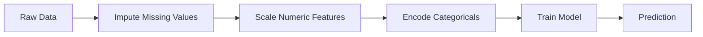
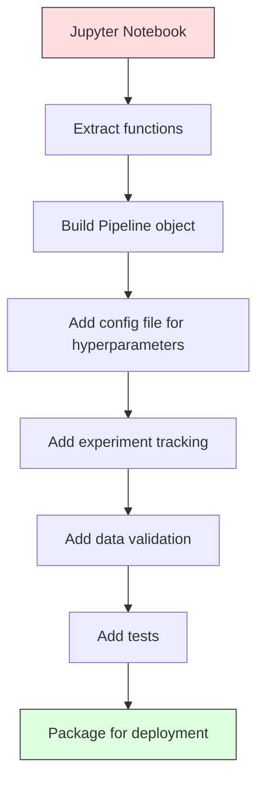

# 机器学习管道

> 模型不是产品，管道才是。管道涵盖从原始数据到部署预测的一切，每一步都必须可复现。

**类型：** 构建
**语言：** Python
**先修课程：** 第二阶段，第12课（超参数调优）
**时间：** ~120分钟

## 学习目标

- 从头构建一个机器学习管道，将插补、缩放、编码和模型训练链接成一个可复现的单一对象
- 识别数据泄露场景，并解释管道如何通过仅在训练数据上拟合转换器来防止它们
- 构建一个ColumnTransformer，对数值型和分类型特征应用不同的预处理
- 实现管道序列化，并演示相同的已拟合管道在训练和生产中产生一致的结果

## 问题

你有一个笔记本，它加载数据、用中位数填充缺失值、缩放特征、训练模型并打印准确率。它运行正常。你将其部署。

一个月后，有人重新训练模型并得到不同的结果。中位数是在包含测试数据的完整数据集上计算的（数据泄露）。缩放参数没有被保存，因此推理使用了不同的统计量。特征工程代码在训练和服务之间被复制粘贴，副本发生了偏离。一个类别列在生产中出现了编码器从未见过的新值。

这些并非假设。它们是机器学习系统在生产中失败的最常见原因。管道通过将每个转换步骤打包成一个单一的、有序的、可复现的对象来解决所有这些问题。

## 核心概念

### 什么是管道

管道是一个有序的数据转换序列，后接一个模型。每一步都将前一步的输出作为输入。整个管道在训练数据上拟合一次。在推理时，相同的已拟合管道转换新数据并生成预测。



管道保证：
- 转换仅在训练数据上拟合（无泄露）
- 在推理时应用相同的转换
- 整个对象可以被序列化并作为一个构件部署
- 交叉验证按折应用管道，防止微妙的泄露

### 数据泄露：无声的杀手

当来自测试集或未来数据的信息污染训练时，就会发生数据泄露。管道可以防止最常见的形式。

**有泄露（错误）：**
```python
X = df.drop("target", axis=1)
y = df["target"]

scaler = StandardScaler()
X_scaled = scaler.fit_transform(X)

X_train, X_test = X_scaled[:800], X_scaled[800:]
y_train, y_test = y[:800], y[800:]
```

缩放器看到了测试数据。均值和标准差包含了测试样本。这会夸大准确率估计。

**正确：**
```python
X_train, X_test = X[:800], X[800:]

scaler = StandardScaler()
X_train_scaled = scaler.fit_transform(X_train)
X_test_scaled = scaler.transform(X_test)
```

使用管道，你不需要考虑这个。管道会自动处理。

### sklearn Pipeline

sklearn的`Pipeline`链接转换器和估计器。它暴露了`.fit()`、`.predict()`和`.score()`，这些方法按顺序应用所有步骤。

```python
from sklearn.pipeline import Pipeline
from sklearn.preprocessing import StandardScaler
from sklearn.linear_model import LogisticRegression

pipe = Pipeline([
    ("scaler", StandardScaler()),
    ("model", LogisticRegression()),
])

pipe.fit(X_train, y_train)
predictions = pipe.predict(X_test)
```

当你调用`pipe.fit(X_train, y_train)`时：
1. 缩放器在X_train上调用`fit_transform`
2. 模型在缩放后的X_train上调用`fit_transform`

当你调用`pipe.predict(X_test)`时：
1. 缩放器在X_test上调用`transform`（而不是fit_transform）
2. 模型在缩放后的X_test上调用`transform`

缩放器在拟合期间从未看到测试数据。这就是关键所在。

### ColumnTransformer：不同列的不同管道

真实数据集有数值型和分类型列，需要不同的预处理。`ColumnTransformer`处理这一点。

```python
from sklearn.compose import ColumnTransformer
from sklearn.preprocessing import StandardScaler, OneHotEncoder
from sklearn.impute import SimpleImputer

numeric_pipe = Pipeline([
    ("impute", SimpleImputer(strategy="median")),
    ("scale", StandardScaler()),
])

categorical_pipe = Pipeline([
    ("impute", SimpleImputer(strategy="most_frequent")),
    ("encode", OneHotEncoder(handle_unknown="ignore")),
])

preprocessor = ColumnTransformer([
    ("num", numeric_pipe, ["age", "income", "score"]),
    ("cat", categorical_pipe, ["city", "gender", "plan"]),
])

full_pipeline = Pipeline([
    ("preprocess", preprocessor),
    ("model", GradientBoostingClassifier()),
])
```

OneHotEncoder中的`handle_unknown="ignore"`对生产至关重要。当出现一个新类别（模型从未见过的城市）时，它会生成一个零向量而不是崩溃。

### 实验跟踪

管道使训练可复现，但你还需跟踪实验过程中发生的情况：使用了哪些超参数、哪个数据集版本、指标是什么、运行的代码是什么。

**MLflow**是最常见的开源解决方案：

```python
import mlflow

with mlflow.start_run():
    mlflow.log_param("max_depth", 5)
    mlflow.log_param("n_estimators", 100)
    mlflow.log_param("learning_rate", 0.1)

    pipe.fit(X_train, y_train)
    accuracy = pipe.score(X_test, y_test)

    mlflow.log_metric("accuracy", accuracy)
    mlflow.sklearn.log_model(pipe, "model")
```

每次运行都记录参数、指标、构件和完整模型。你可以比较运行结果，复现任何实验，并部署任何模型版本。

**Weights & Biases (wandb)** 通过托管仪表板提供相同的功能：

```python
import wandb

wandb.init(project="my-pipeline")
wandb.config.update({"max_depth": 5, "n_estimators": 100})

pipe.fit(X_train, y_train)
accuracy = pipe.score(X_test, y_test)

wandb.log({"accuracy": accuracy})
```

### 模型版本管理

在实验追踪之后，你需要管理模型版本。哪个模型在生产环境中？哪个在预发布环境？哪个是上周的？

MLflow 的模型注册表提供：
- **版本追踪：** 每个保存的模型都会获得一个版本号
- **阶段转换：** "预发布(Staging)", "生产(Production)", "归档(Archived)"
- **审批流程：** 模型必须被明确提升至生产环境
- **回滚：** 立即切换回之前的版本

### 使用 DVC 进行数据版本控制

代码通过 git 进行版本控制。数据也应该版本化，但 git 无法处理大文件。DVC（数据版本控制）解决了这个问题。

```
dvc init
dvc add data/training.csv
git add data/training.csv.dvc data/.gitignore
git commit -m "Track training data"
dvc push
```

DVC 将实际数据存储在远程存储（S3、GCS、Azure）中，并在 git 中保留一个小的 `.dvc` 文件，该文件记录哈希值。当你检出一个 git 提交时，`dvc checkout` 会恢复所使用的确切数据。

这意味着每个 git 提交都同时固定了代码和数据。完全可复现。

### 可复现的实验

一个可复现的实验需要四样东西：

1. **固定的随机种子：** 为 numpy、random 以及框架（torch、sklearn）设置种子
2. **固定的依赖：** 包含精确版本的 requirements.txt 或 poetry.lock
3. **版本化的数据：** DVC 或类似工具
4. **配置文件：** 所有超参数放在配置文件中，而非硬编码

```python
import numpy as np
import random

def set_seed(seed=42):
    random.seed(seed)
    np.random.seed(seed)
    try:
        import torch
        torch.manual_seed(seed)
        torch.cuda.manual_seed_all(seed)
        torch.backends.cudnn.deterministic = True
    except ImportError:
        pass
```

### 从笔记本到生产流水线



典型的发展过程：

1. **笔记本探索：** 快速实验、可视化、特征想法
2. **提取函数：** 将预处理、特征工程、评估迁移到模块中
3. **构建流水线：** 将转换链式组合成 sklearn 的 Pipeline 或自定义类
4. **配置管理：** 将所有超参数移到 YAML/JSON 配置文件中
5. **实验追踪：** 添加 MLflow 或 wandb 日志
6. **数据验证：** 在训练前检查模式、分布和缺失值模式
7. **测试：** 转换器的单元测试，完整流水线的集成测试
8. **部署：** 序列化流水线，封装成 API（FastAPI、Flask），容器化

### 常见的流水线错误

|  错误  |  为什么不好  |  修复方法  |
|---------|-------------|-----|
|  分割前对完整数据进行拟合  |  数据泄露  |  使用带 cross_val_score 的 Pipeline  |
|  在流水线外部进行特征工程  |  训练和服务时不同的转换  |  将所有转换放入 Pipeline  |
|  未处理未知类别  |  新值导致生产环境崩溃  |  OneHotEncoder(handle_unknown="ignore")  |
|  硬编码列名  |  模式变化时出错  |  使用配置文件中的列名列表  |
|  无数据验证  |  对不良数据静默做出错误预测  |  在预测前添加模式检查  |
|  训练/服务偏差  |  模型在生产环境中看到不同的特征  |  两者使用同一个 Pipeline 对象  |

## 动手构建

`code/pipeline.py` 中的代码从头构建了一个完整的机器学习流水线：

### 步骤1：自定义转换器

```python
class CustomTransformer:
    def __init__(self):
        self.means = None
        self.stds = None

    def fit(self, X):
        self.means = np.mean(X, axis=0)
        self.stds = np.std(X, axis=0)
        self.stds[self.stds == 0] = 1.0
        return self

    def transform(self, X):
        return (X - self.means) / self.stds

    def fit_transform(self, X):
        return self.fit(X).transform(X)
```

### 步骤2：从头构建流水线

```python
class PipelineFromScratch:
    def __init__(self, steps):
        self.steps = steps

    def fit(self, X, y=None):
        X_current = X.copy()
        for name, step in self.steps[:-1]:
            X_current = step.fit_transform(X_current)
        name, model = self.steps[-1]
        model.fit(X_current, y)
        return self

    def predict(self, X):
        X_current = X.copy()
        for name, step in self.steps[:-1]:
            X_current = step.transform(X_current)
        name, model = self.steps[-1]
        return model.predict(X_current)
```

### 步骤3：使用流水线进行交叉验证

代码展示了使用流水线进行交叉验证如何防止数据泄露：缩放器在每个折的训练数据上分别拟合。

### 步骤4：使用 sklearn 的完整生产流水线

一个完整的流水线，包含 `ColumnTransformer`、多个预处理路径和一个模型，通过适当的交叉验证和实验日志进行训练。

## 发布

本課(lesson)产出：
- `outputs/prompt-ml-pipeline.md` -- a skill for building and debugging ML pipelines
- `outputs/prompt-ml-pipeline.md` -- a complete pipeline from scratch through sklearn

## 练习

1. Build a pipeline that handles a dataset with 3 numeric columns and 2 categorical columns. Use `ColumnTransformer` to apply median imputation + scaling to numerics and most-frequent imputation + one-hot encoding to categoricals. Train with 5-fold cross-validation.

2. Deliberately introduce data leakage: fit the scaler on the full dataset before splitting. Compare the cross-validation score (leaky) to the pipeline cross-validation score (clean). How large is the difference?

3. Serialize your pipeline with `joblib.dump`. Load it in a separate script and run predictions. Verify the predictions are identical.

4. Add a custom transformer to the pipeline that creates polynomial features (degree 2) for the two most important numeric columns. Where should it go in the pipeline?

5. Set up MLflow tracking for the pipeline. Run 5 experiments with different hyperparameters. Use the MLflow UI (`mlflow ui`) to compare runs and pick the best model.

## 关键术语

|  术语  |  人们的说法  |  实际含义  |
|------|----------------|----------------------|
|  Pipeline  |  "Chain of transforms + model"  |  An ordered sequence of fitted transformers and a model, applied as one unit to prevent leakage  |
|  Data leakage  |  "Test info leaked into training"  |  Using information from outside the training set to build the model, inflating performance estimates  |
|  ColumnTransformer  |  "Different preprocessing per column"  |  Applies different pipelines to different subsets of columns, combining results  |
|  Experiment tracking  |  "Logging your runs"  |  Recording parameters, metrics, artifacts, and code versions for every training run  |
|  MLflow  |  "Track and deploy models"  |  Open-source platform for experiment tracking, model registry, and deployment  |
|  DVC  |  "Git for data"  |  Version control system for large data files, storing hashes in git and data in remote storage  |
|  Model registry  |  "Model version catalog"  |  A system that tracks model versions with stage labels (staging, production, archived)  |
|  Training/serving skew  |  "It worked in the notebook"  |  Differences between how data is processed during training versus inference, causing silent errors  |
|  Reproducibility  |  "Same code, same result"  |  The ability to get identical results from the same code, data, and configuration  |

## 延伸阅读

- [scikit-learn Pipeline docs](https://scikit-learn.org/stable/modules/compose.html) -- the official pipeline reference
- [scikit-learn Pipeline docs](https://scikit-learn.org/stable/modules/compose.html) -- experiment tracking and model registry
- [scikit-learn Pipeline docs](https://scikit-learn.org/stable/modules/compose.html) -- data versioning
- [scikit-learn Pipeline docs](https://scikit-learn.org/stable/modules/compose.html) -- the seminal paper on ML systems complexity
- [scikit-learn Pipeline docs](https://scikit-learn.org/stable/modules/compose.html) -- practical production ML advice
