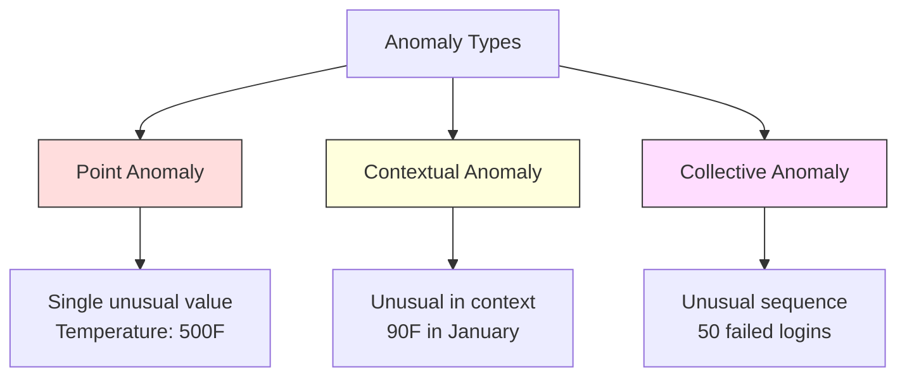
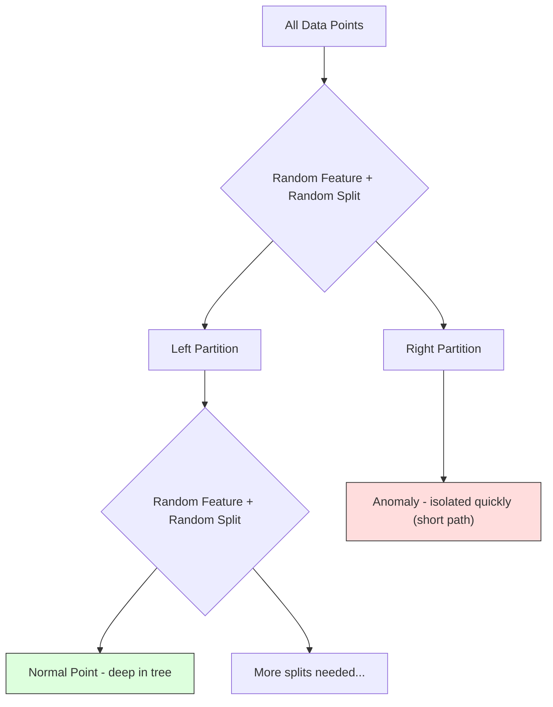
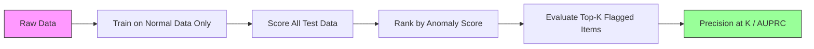

# Anomaly Detection

> Normal is easy to define. Abnormal is whatever doesn't fit.

**Type:** Build
**Language:** Python
**Prerequisites:** Phase 2, Lessons 01-09
**Time:** ~75 minutes

## 学习目标

- Implement Z-score, IQR, and Isolation Forest anomaly detection methods from scratch
- Distinguish between point, contextual, and collective anomalies and select the appropriate detection method for each
- Explain why anomaly detection is framed as modeling normal data rather than classifying anomalies
- Compare unsupervised anomaly detection with supervised classification and evaluate the tradeoff between novel anomaly coverage and precision

## 问题

A credit card is used in New York at 2pm, then in Tokyo at 2:05pm. A factory sensor reads 150 degrees when the normal range is 80-120. A server sends 50,000 requests per second when the daily average is 200.

These are anomalies. Finding them matters. Fraud costs billions. Equipment failures cost downtime. Network intrusions cost data.

The challenge: you rarely have labeled examples of anomalies. Fraud makes up 0.1% of transactions. Equipment failures happen a few times per year. You cannot train a standard classifier because there is almost nothing in the "anomaly" class to learn from. Even if you have some labels, the anomalies you have seen are not the only types you will encounter. Tomorrow's fraud scheme looks different from today's.

Anomaly detection flips the problem. Instead of learning what is abnormal, learn what is normal. Anything that deviates from normal is suspicious. This works without labels, adapts to new types of anomalies, and scales to massive datasets.

## 核心概念

### Types of Anomalies

Not all anomalies are the same:

- **Point anomalies.** A single data point that is unusual regardless of context. A temperature reading of 500 degrees. A transaction of $50,000 from an account that normally spends $50.
- **Contextual anomalies.** A data point that is unusual given its context. A temperature of 90 degrees is normal in summer, anomalous in winter. Same value, different context.
- **Collective anomalies.** A sequence of data points that is unusual as a group, even though each individual point might be normal. Five login failures is normal. Fifty in a row is a brute-force attack.

Most methods detect point anomalies. Contextual anomalies need time or location features. Collective anomalies need sequence-aware methods.



### The Unsupervised Framing

In standard classification, you have labels for both classes. In anomaly detection, you typically have one of three situations:

1. **Fully unsupervised.** No labels at all. You fit the detector on all data and hope anomalies are rare enough not to corrupt the "normal" model.
2. **Semi-supervised.** You have a clean dataset of normal data only. You fit on this clean set and score everything else. This is the strongest setup when possible.
3. **Weakly supervised.** You have a few labeled anomalies. Use them for evaluation, not training. Train unsupervised, then measure precision/recall on the labeled subset.

The key insight: anomaly detection is fundamentally different from classification. You are modeling the distribution of normal data, not the decision boundary between two classes.

### Supervised vs Unsupervised: The Tradeoff

If you do have labeled anomalies, should you use them for training (supervised classification) or for evaluation only (unsupervised detection)?

**Supervised (treat as classification):**
- Catches the exact types of anomalies you have seen before
- Higher precision on known anomaly types
- Misses novel anomaly types entirely
- Requires retraining when new anomaly types emerge
- Needs enough anomaly examples (often too few)

**Unsupervised (model normal, flag deviations):**
- Catches any deviation from normal, including novel types
- Does not require labeled anomalies
- Higher false positive rate (not everything unusual is bad)
- More robust to distribution shift

In practice, the best systems combine both: unsupervised detection for broad coverage, supervised models for known high-priority anomaly types, and human review for ambiguous cases.

### Z-Score Method

The simplest approach. Compute the mean and standard deviation of each feature. Flag any point more than k standard deviations from the mean.

```text
z_score = (x - mean) / std
anomaly if |z_score| > threshold
```

The default threshold is 3.0 (99.7% of normal data falls within 3 standard deviations for a Gaussian distribution).

**Strengths:** Simple. Fast. Interpretable ("this value is 4.5 standard deviations from normal").

**Weaknesses:** Assumes data is normally distributed. Sensitive to outliers in the training data (the outliers shift the mean and inflate the std, making them harder to detect). Fails on multimodal distributions.

**When it works well:** Single-feature monitoring where data is roughly bell-shaped. Server response times, manufacturing tolerances, sensor readings with stable baselines.

**When it fails:** Multi-cluster data (two office locations with different baseline temperatures), skewed data (transaction amounts where $1000 is rare but not anomalous), data with outliers in the training set.

### IQR方法

比Z分数更稳健。使用四分位距代替均值和标准差。

```
Q1 = 25th percentile
Q3 = 75th percentile
IQR = Q3 - Q1
lower_bound = Q1 - factor * IQR
upper_bound = Q3 + factor * IQR
anomaly if x < lower_bound or x > upper_bound
```

默认因子为1.5。

**优点：** 对异常值稳健（百分位数不受极端值影响）。适用于偏态分布。无需正态性假设。

**缺点：** 仅适用于单变量（每个特征独立应用）。无法检测仅在特征组合时才异常的点（一个点在每个特征上可能都正常，但在联合空间中异常）。

**实践说明：** IQR中的1.5因子对应箱线图中的须线。须线之外的点是潜在的异常值。使用3.0代替1.5会使检测器更保守（标记更少，误报更少）。合适的因子取决于你对误报的容忍度。

### 孤立森林(Isolation Forest)

关键洞察：异常点数量少且与众不同。在数据的随机划分中，异常点更容易被孤立——它们需要更少的随机分割就能与其余点分离。



**工作原理：**
1. 构建许多随机树（孤立森林）
2. 在每个节点，随机选择一个特征以及该特征最小值和最大值之间的随机分割值
3. 持续分割直到每个点都被孤立（在其自己的叶子节点中）
4. 异常点在所有树中的平均路径长度较短

**为什么有效：** 正常点位于密集区域。需要许多随机分割才能将一个点与其邻居隔离。异常点位于稀疏区域。一两次随机分割就足以将其隔离。

异常分数基于所有树中的平均路径长度，经随机二叉搜索树的预期路径长度归一化：

```
score(x) = 2^(-average_path_length(x) / c(n))
```

其中`c(n)`是n个样本的预期路径长度。分数接近1表示异常。分数接近0.5表示正常。分数接近0表示非常正常（位于密集簇的深处）。

**优点：** 无分布假设。适用于高维数据。扩展性好（每个树使用子样本，因此样本量呈亚线性）。可处理混合特征类型。

**缺点：** 难以处理密集区域中的异常点（掩蔽效应）。当许多特征不相关时，随机分割效果较差。

**关键超参数：**
- `n_estimators`：树的数量。通常100就足够了。更多树可得到更稳定的分数，但计算更慢。
- `n_estimators`：每棵树的样本数。原始论文中默认值为256。较小的值使单棵树准确度降低但增加了多样性。子采样正是孤立森林速度快的原因——每棵树只看一小部分数据。
- `n_estimators`：预期的异常比例。仅用于设置阈值。不影响分数本身。

### 局部异常因子(Local Outlier Factor, LOF)

LOF比较一个点周围的局部密度与其邻居周围的密度。稀疏区域中被密集区域包围的点是异常的。

**工作原理：**
1. 对于每个点，找到其k个最近邻居
2. 计算局部可达密度（邻域有多密集）
3. 比较每个点的密度与其邻居的密度
4. 如果一个点的密度远低于其邻居，则该点为异常点

**LOF分数：**
- LOF接近1.0表示密度与邻居相似（正常）
- LOF大于1.0表示密度低于邻居（可能异常）
- LOF远大于1.0（例如2.0+）表示密度显著较低（很可能是异常）

“局部”部分至关重要。考虑一个包含两个簇的数据集：一个密集簇有1000个点，一个稀疏簇有50个点。稀疏簇边缘的一个点全局上并不异常——它有50个邻居。但若其直接邻居比它更密集，则局部上是异常的。LOF捕捉到了全局方法遗漏的这一细微差别。

**优点：** 检测局部异常（在其邻域中异常的点，即使全局上并不异常）。适用于不同密度的簇。

**缺点：** 在大数据集上速度慢（朴素实现为O(n^2)）。对k值的选择敏感。在高维空间中效果不佳（维数灾难影响距离计算）。

### 比较

|  方法  |  假设  |  速度  |  处理高维  |  检测局部异常  |
|--------|------------|-------|-------------------|------------------------|
|  Z分数  |  正态分布  |  非常快  |  是（按特征）  |  否  |
|  IQR  |  无（按特征）  |  非常快  |  是（按特征）  |  否  |
|  孤立森林  |  无  |  快  |  是  |  部分  |
|  LOF  |  距离有意义  |  慢  |  差  |  是  |

### 评估挑战

评估异常检测器比评估分类器更困难：

- **极端类别不平衡。** 当异常占比为0.1%时，预测所有点为“正常”可获得99.9%的准确率。准确率毫无意义。
- **AUROC具有误导性。** 在严重不平衡情况下，AUROC可能看起来很好，即使模型在实际阈值下漏掉了大多数异常。
- **更好的指标：** Precision@k（在标记的前k个点中，有多少是真正的异常）、AUPRC（精确率-召回率曲线下面积）以及固定假阳性率下的召回率。



### 异常检测流水线

在实践中，异常检测遵循以下工作流程：

1. **收集基线数据。** 理想情况下，选择一个你知道没有（或极少）异常的时间段。
2. **特征工程。** 原始特征加上衍生特征（滚动统计量、时间特征、比率）。
3. **训练检测器。** 在基线数据上拟合。模型学习“正常”的样子。
4. **对新数据评分。** 每个新观测值得到一个异常分数。
5. **阈值选择。** 选择分数截断值。这是一个业务决策：更高的阈值意味着更少的误报，但也会漏掉更多异常。
6. **告警和调查。** 标记的点交由人工审查或自动响应。
7. **反馈收集。** 记录标记的点是真正的异常还是误报。利用这些数据评估检测器并随时间调整阈值。

流水线永远不会“完成”。数据分布会变化，新的异常类型会出现，阈值需要调整。将异常检测视为一个活的系统，而非一次性模型。

## 动手构建

在`code/anomaly_detection.py`中的代码从头实现了Z-score、IQR和孤立森林。

### Z-Score检测器

```python
def zscore_detect(X, threshold=3.0):
    mean = X.mean(axis=0)
    std = X.std(axis=0)
    std[std == 0] = 1.0
    z = np.abs((X - mean) / std)
    return z.max(axis=1) > threshold
```

简单且向量化。如果任意特征超出阈值，则标记该点。

### IQR检测器

```python
def iqr_detect(X, factor=1.5):
    q1 = np.percentile(X, 25, axis=0)
    q3 = np.percentile(X, 75, axis=0)
    iqr = q3 - q1
    iqr[iqr == 0] = 1.0
    lower = q1 - factor * iqr
    upper = q3 + factor * iqr
    outside = (X < lower) | (X > upper)
    return outside.any(axis=1)
```

### 从头实现孤立森林

从头实现构建孤立树，随机划分特征空间：

```python
class IsolationTree:
    def __init__(self, max_depth):
        self.max_depth = max_depth

    def fit(self, X, depth=0):
        n, p = X.shape
        if depth >= self.max_depth or n <= 1:
            self.is_leaf = True
            self.size = n
            return self
        self.is_leaf = False
        self.feature = np.random.randint(p)
        x_min = X[:, self.feature].min()
        x_max = X[:, self.feature].max()
        if x_min == x_max:
            self.is_leaf = True
            self.size = n
            return self
        self.threshold = np.random.uniform(x_min, x_max)
        left_mask = X[:, self.feature] < self.threshold
        self.left = IsolationTree(self.max_depth).fit(X[left_mask], depth + 1)
        self.right = IsolationTree(self.max_depth).fit(X[~left_mask], depth + 1)
        return self
```

隔离一个点的路径长度决定了其异常分数。路径越短，意味着越异常。

`IsolationForest`类包装了多棵树：

```python
class IsolationForest:
    def __init__(self, n_estimators=100, max_samples=256, seed=42):
        self.n_estimators = n_estimators
        self.max_samples = max_samples

    def fit(self, X):
        sample_size = min(self.max_samples, X.shape[0])
        max_depth = int(np.ceil(np.log2(sample_size)))
        for _ in range(self.n_estimators):
            idx = rng.choice(X.shape[0], size=sample_size, replace=False)
            tree = IsolationTree(max_depth=max_depth)
            tree.fit(X[idx])
            self.trees.append(tree)

    def anomaly_score(self, X):
        avg_path = average path length across all trees
        scores = 2.0 ** (-avg_path / c(max_samples))
        return scores
```

归一化因子`c(n)`是包含n个元素的二叉搜索树中不成功搜索的期望路径长度。它等于`2 * H(n-1) - 2*(n-1)/n`，其中`H`是调和数。这种归一化确保了分数在不同大小的数据集之间具有可比性。

### 演示场景

代码生成了多个测试场景：

1. **单聚类带离群点。** 一个二维高斯簇，在远离中心的位置注入异常点。所有方法都应在此场景中有效。
2. **多模态数据。** 三个大小和密度不同的簇。簇之间的点是异常的。Z-score在此处效果不佳，因为每个特征的范围很宽。
3. **高维数据。** 50个特征，但异常仅体现在其中5个特征上。测试方法能否在特征子集中发现异常。

每个演示使用精确率、召回率、F1和Precision@k比较所有方法。

## 使用它

使用sklearn（库实现，而非从头实现）：

```python
from sklearn.ensemble import IsolationForest
from sklearn.neighbors import LocalOutlierFactor

iso = IsolationForest(n_estimators=100, contamination=0.05, random_state=42)
iso.fit(X_train)
predictions = iso.predict(X_test)

lof = LocalOutlierFactor(n_neighbors=20, contamination=0.05, novelty=True)
lof.fit(X_train)
predictions = lof.predict(X_test)
```

注意`contamination`设置了预期的异常比例。正确设置很重要——设置太低会漏掉异常，太高则会导致误报。

`anomaly_detection.py`中的代码在相同数据上比较从头实现与sklearn的结果。

### sklearn的Contamination参数

sklearn中的`contamination`参数决定了将连续异常分数转换为二元预测的阈值。它不会改变底层分数。

```python
iso_5 = IsolationForest(contamination=0.05)
iso_10 = IsolationForest(contamination=0.10)
```

两者产生相同的异常分数。但`iso_5`标记前5%的点，而`iso_10`标记前10%的点。如果你不知道真实的异常率（通常不知道），将contamination设为"auto"并直接使用原始分数。根据假阳性与假阴性之间的成本权衡，自行设定阈值。

### 单类SVM（One-Class SVM）

另一个值得了解的异常检测器。单类SVM在高维特征空间中（使用核技巧）围绕正常数据拟合一个边界。

```python
from sklearn.svm import OneClassSVM

oc_svm = OneClassSVM(kernel="rbf", gamma="auto", nu=0.05)
oc_svm.fit(X_train)
predictions = oc_svm.predict(X_test)
```

`nu`参数近似于异常的比例。单类SVM在小到中等数据集上表现良好，但不适用于非常大的数据（核矩阵呈二次增长）。

### 自编码器方法（预览）

自编码器是一种学习压缩和重构数据的神经网络。在正常数据上训练。测试时，异常点会有较高的重构误差，因为网络只学会了重构正常模式。

这部分在第三阶段（深度学习）中会涉及，但原理相同：对正常数据进行建模，标记偏离的数据。

### 集成异常检测

正如集成方法可以改进分类（第11课），结合多个异常检测器可以提高检测效果。最简单的方法是：

1. 运行多个检测器（Z分数、IQR、孤立森林、LOF）
2. 将每个检测器的分数归一化到[0, 1]
3. 对归一化后的分数取平均值
4. 标记平均分数高于阈值的点

这种方法能减少误报，因为不同方法的失效模式不同。被所有四种方法标记的点几乎一定是异常。仅被一种方法标记的点可能只是该方法的特例。

更复杂的集成方法会根据每个检测器的估计可靠性（如果在带已知异常的验证集上测量过）赋予其权重。

### 生产环境注意事项

1. **阈值漂移。** 随着数据分布的变化，固定阈值会过时。监控异常分数的分布并定期调整。
2. **告警疲劳。** 误报太多会导致操作人员不再关注。从高阈值开始（更少但更可靠的告警），随着信任度提升再降低阈值。
3. **集成方法。** 在生产环境中，组合多个检测器。仅当多种方法一致认为某点是异常时才标记它。这能显著降低误报。
4. **特征工程。** 原始特征往往不够。添加滚动统计量、比率、距上次事件的时间以及领域特定特征。好的特征集比检测器的选择更重要。
5. **反馈循环。** 当操作人员调查被标记的项目并确认或驳回时，将此反馈回系统。随时间累积标记数据，用于评估和改进检测器。

## 发布

本課(lesson)产出：
- `outputs/skill-anomaly-detector.md` -- 选择合适检测器的决策技能
- `outputs/skill-anomaly-detector.md` -- Z分数、IQR和孤立森林从零实现，并与sklearn对比

### 选择阈值

异常分数是连续的。你需要一个阈值来做出二元决策。这是业务决策，而非技术决策。

考虑两种场景：
- **欺诈检测。** 漏掉欺诈代价高昂（退款、客户信任）。误报需要人工分析师花5分钟调查。设置低阈值以捕获更多欺诈，接受更多误报。
- **设备维护。** 一次误报意味着不必要的停机，损失$50,000. A missed failure means a $500,000维修费。设置阈值以平衡这些成本。

两种情况下，最优阈值取决于假正例与假负例之间的成本比。绘制不同阈值下的精确率和召回率，叠加成本函数，选择成本最低的点。

### 扩展到生产环境

对于实时异常检测的生产环境：

1. **批量训练，在线评分。** 定期（每天、每周）在最近的正常数据上训练模型。对新到达的每个观测值进行评分。
2. **特征计算必须一致。** 如果你使用30天的滚动统计量进行训练，那么计算新观测值的特征需要30天的历史数据。缓冲所需的历史数据。
3. **分数分布监控。** 跟踪异常分数随时间的变化。如果中位数分数上漂，要么数据在变化，要么模型过时。
4. **可解释性。** 当标记异常时，说明原因。Z分数：“特征X比正常值高4.2个标准差。”孤立森林：“该点平均经过3.1次分割被隔离（正常点需要8.5次）。”

## 练习

1. **阈值调优。** 以0.5为步长，在1.0到5.0之间运行Z分数检测器。绘制每个阈值下的精确率和召回率。数据的最佳点在哪里？

2. **多变量异常。** 创建二维数据，每个特征单独看起来正常，但组合后异常（例如远离主聚类对角线的点）。展示按特征的Z分数会漏掉这些点，但孤立森林能捕获。

3. **从零实现LOF。** 使用k近邻实现局部离群因子。与sklearn的LocalOutlierFactor在同一数据上比较。使用k=10和k=50——k值的选择如何影响结果？

4. **流式异常检测。** 修改Z分数检测器使其在流式环境中工作：随着新点到达更新运行均值和方差（Welford在线算法）。与同一数据上的批量Z分数比较。

5. **真实世界评估。** 取一个带已知异常的数据集（例如Kaggle信用卡欺诈）。使用precision@100、precision@500和AUPRC评估所有四种方法。哪种方法最好？为什么？

## 关键术语

|  术语  |  人们的说法  |  实际含义  |
|------|----------------|----------------------|
|  异常  |  "离群点，异常点"  |  显著偏离正常数据预期模式的数据点  |
|  点异常  |  "单个异常值"  |  不考虑上下文，自身就异常的单个观测值  |
|  上下文异常  |  "正常值，错误上下文"  |  在给定上下文（时间、位置等）下异常，但在另一上下文中可能正常的观测值  |
|  孤立森林  |  "随机划分发现离群点"  |  一种集成随机树，能以比正常点更少的划分次数隔离异常点  |
|  局部离群因子  |  "与邻居比较密度"  |  标记点局部密度远低于其邻居密度的方法  |
|  Z分数  |  "与均值的标准差数"  |  (x - 均值) / 标准差，度量点偏离中心的程度（以标准差为单位）  |
|  IQR  |  "四分位距(Interquartile range)"  |  Q3 - Q1，衡量中间50%数据的离散程度，用于稳健异常值检测  |
|  Contamination  |  "期望异常比例(Expected fraction of anomalies)"  |  一个超参数，告诉检测器应将多大比例的数据标记为异常  |
|  Precision@k  |  "在前k个标记中，有多少是真实的(Of the top k flags, how many are real)"  |  仅针对最可疑的k个点计算的精确率，适用于不平衡异常检测  |
|  AUPRC  |  "精确率-召回率曲线下面积(Area under precision-recall curve)"  |  一种总结所有阈值下精确率-召回率性能的指标，对于不平衡数据优于AUROC  |

## 延伸阅读

- [Liu et al., Isolation Forest (2008)](https://cs.nju.edu.cn/zhouzh/zhouzh.files/publication/icdm08b.pdf) -- 原始 Isolation Forest 论文
- [Liu et al., Isolation Forest (2008)](https://cs.nju.edu.cn/zhouzh/zhouzh.files/publication/icdm08b.pdf) -- 原始 LOF 论文
- [Liu et al., Isolation Forest (2008)](https://cs.nju.edu.cn/zhouzh/zhouzh.files/publication/icdm08b.pdf) -- 所有 sklearn 异常检测器概述
- [Liu et al., Isolation Forest (2008)](https://cs.nju.edu.cn/zhouzh/zhouzh.files/publication/icdm08b.pdf) -- 异常检测方法综合调查
- [Liu et al., Isolation Forest (2008)](https://cs.nju.edu.cn/zhouzh/zhouzh.files/publication/icdm08b.pdf) -- 在真实数据集上对10种方法的实证比较
