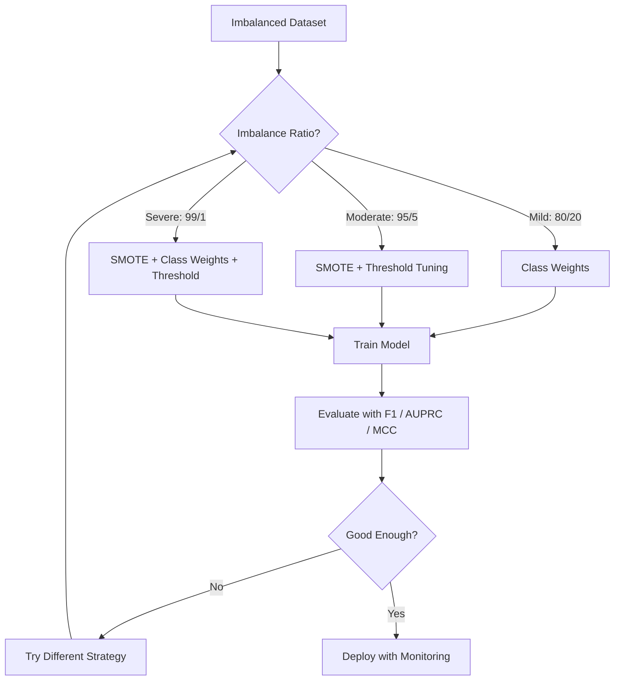
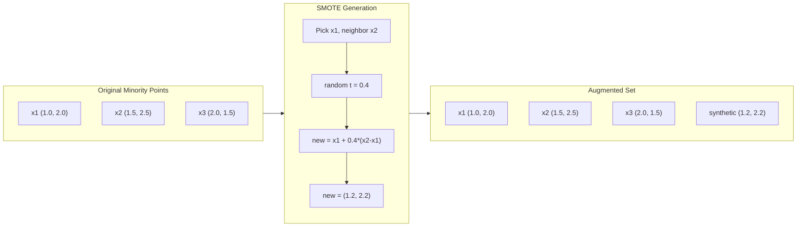
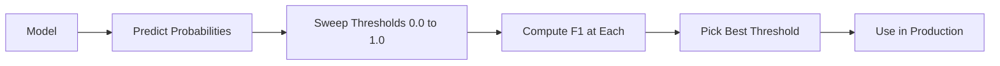
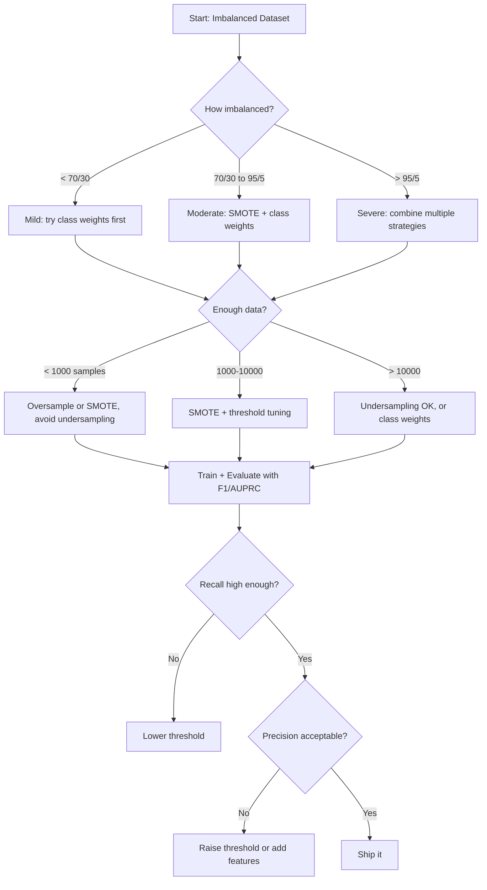

# 处理不平衡数据

> 当99%的数据是"正常"时，准确率是个谎言。

**类型：** 构建
**语言：** Python
**前置要求：** 第2阶段，第01-09课（特别是评估指标）
**时间：** 约90分钟

## 学习目标

- 从零实现SMOTE，并解释合成过采样与随机复制的区别
- 使用F1、AUPRC和马修斯相关系数而不是准确率来评估不平衡分类器
- 比较类别权重、阈值调整和重采样策略，并针对给定的不平衡比选择合适的方法
- 构建一个完整的不平衡数据管道，结合SMOTE、类别权重和阈值优化

## 问题

你构建了一个欺诈检测模型。它达到了99.9%的准确率。你庆祝。然后你意识到它对每一笔交易都预测为“非欺诈”。

这不是一个bug。当只有0.1%的交易是欺诈时，这是理性的做法。模型学会总是猜测多数类以最小化整体误差。它在技术上是正确的，但完全无用。

这在真实分类问题中随处可见。疾病诊断：1%阳性率。网络入侵：0.01%攻击。制造缺陷：0.5%次品。垃圾邮件过滤：20%垃圾邮件。流失预测：5%流失用户。少数类越重要，它往往越罕见。

准确率失败是因为它平等地对待所有正确预测。正确标记合法交易和正确捕获欺诈都计为准确率的一个点。但捕获欺诈是模型存在的全部理由。我们需要指标、技术和训练策略，迫使模型关注罕见但重要的类别。

## 核心概念

### 为什么准确率会失效

考虑一个有1000个样本的数据集：990个负例，10个正例。一个始终预测为负的模型：

|   |  预测正类  |  预测负类  |
|--|---|---|
|  实际上为正  |  0 (TP)  |  10 (FN)  |
|  实际上为负  |  0 (FP)  |  990 (TN)  |

准确率 = (0 + 990) / 1000 = 99.0%

模型捕获了零欺诈。零疾病。零缺陷。但准确率说99%。这就是为什么准确率对不平衡问题很危险。

### 更好的指标

**精确率(Precision)** = TP / (TP + FP)。在所有被标记为正例的样本中，有多少实际上是正例？高精确率意味着误报少。

**召回率(Recall)** = TP / (TP + FN)。在所有实际为正例的样本中，我们捕获了多少？高召回率意味着漏报少。

**F1分数(F1 Score)** = 2 * 精确率 * 召回率 / (精确率 + 召回率)。调和平均数。比算术平均数更惩罚精确率和召回率之间的极端不平衡。

**F-beta分数(F-beta Score)** = (1 + beta^2) * 精确率 * 召回率 / (beta^2 * 精确率 + 召回率)。当beta > 1时，召回率更重要。当beta < 1时，精确率更重要。F2在欺诈检测中很常见（漏掉欺诈比误报更糟糕）。

**AUPRC**（精确率-召回率曲线下的面积）。类似于AUC-ROC，但对不平衡数据更有信息量。随机分类器的AUPRC等于正类比例（不像ROC那样是0.5）。这使得改进更容易看到。

**马修斯相关系数(Matthews Correlation Coefficient)** = (TP * TN - FP * FN) / sqrt((TP+FP)(TP+FN)(TN+FP)(TN+FN))。取值范围从-1到+1。仅当模型在两个类上都表现良好时给出高分。即使类别大小差异很大时也能保持平衡。

对于上面的"始终预测为负"模型：精确率 = 0/0（未定义，通常设为0），召回率 = 0/10 = 0，F1 = 0，MCC = 0。这些指标正确地将模型标识为无用。

### 不平衡数据管道



### SMOTE：合成少数类过采样技术（Synthetic Minority Oversampling Technique）

随机过采样复制现有的少数类样本。这种方法有效，但有过拟合的风险，因为模型反复看到相同的点。

SMOTE创建新的合成少数类样本，这些样本是合理的但不是复制品。算法如下：

1. 对于每个少数类样本x，在其它少数类样本中找到它的k个最近邻
2. 随机选择一个邻居
3. 在x与该邻居之间的线段上创建一个新样本

公式：`new_sample = x + random(0, 1) * (neighbor - x)`

这在真实的少数类点之间进行插值，在特征空间的同一区域创建样本，而不仅仅是复制现有数据。



### 采样策略比较

**随机过采样**: 复制少数类样本以匹配多数类数量。
- 优点: 简单，无信息损失
- 缺点: 精确复制导致过拟合，增加训练时间

**随机欠采样**: 移除多数类样本以匹配少数类数量。
- 优点: 训练快，简单
- 缺点: 丢弃可能有用的多数类数据，方差更高

**SMOTE**: 通过插值创建合成少数类样本。
- 优点: 生成新数据点，相比随机过采样减少过拟合
- 缺点: 可能在决策边界附近创建噪声样本，不考虑多数类分布

|  策略  | 数据变化  | 风险  | 何时使用  |
|----------|-------------|------|-------------|
|  过采样  | 少数类复制  | 过拟合  | 小数据集，中等不平衡  |
|  欠采样  | 多数类移除  | 信息损失  | 大数据集，追求快速训练  |
|  SMOTE  | 添加合成少数类  | 边界噪声  | 中等不平衡，有足够少数类样本进行k近邻  |

### 类别权重

与其改变数据，不如改变模型处理错误的方式。对少数类的错误分类赋予更高权重。

对于950个负样本和50个正样本的二分类问题：
- 负类权重 = n_samples / (2 * n_negative) = 1000 / (2 * 950) = 0.526
- 正类权重 = n_samples / (2 * n_positive) = 1000 / (2 * 50) = 10.0

正类的权重是负类的19倍。错分一个正样本的代价相当于错分19个负样本。模型被迫关注少数类。

在逻辑回归中，这会修改损失函数：

```
weighted_loss = -sum(w_i * [y_i * log(p_i) + (1-y_i) * log(1-p_i)])
```

其中w_i取决于样本i的类别。

类别权重在期望上等价于过采样，但不会创建新数据点。这使其速度更快，并避免复制样本带来的过拟合风险。

### 阈值调整

大多数分类器输出概率。默认阈值为0.5：如果P(正类) >= 0.5，则预测为正类。但0.5是任意的。当类别不平衡时，最优阈值通常低得多。

过程：
1. 训练模型
2. 在验证集上获取预测概率
3. 从0.0到1.0扫描阈值
4. 在每个阈值下计算F1（或所选指标）
5. 选择使指标最大化的阈值



模型可能对欺诈交易输出P(欺诈)=0.15。在阈值0.5下，这被分类为非欺诈。在阈值0.10下，它被正确捕获。概率校准不如排序重要——只要欺诈的概率高于非欺诈，就存在一个阈值可以区分它们。

### 代价敏感学习

类别权重的推广。不是使用统一代价，而是指定具体的错分代价：

|   | 预测为正  | 预测为负  |
|--|---|---|
|  实际为正  | 0（正确）  | C_FN = 100  |
|  实际为负  | C_FP = 1  | 0（正确）  |

漏掉一笔欺诈交易（假阴性）的代价是误报（假阳性）的100倍。模型优化的是总代价，而不是总错误数。

当你能估计现实世界中的代价时，这是最原则性的方法。漏掉癌症诊断与导致额外活检的误报具有截然不同的代价。明确这些代价可以迫使做出正确的权衡。

### 决策流程图



```figure
class-imbalance
```

## 动手构建

### 步骤1：生成不平衡数据集

```python
import numpy as np


def make_imbalanced_data(n_majority=950, n_minority=50, seed=42):
    rng = np.random.RandomState(seed)

    X_maj = rng.randn(n_majority, 2) * 1.0 + np.array([0.0, 0.0])
    X_min = rng.randn(n_minority, 2) * 0.8 + np.array([2.5, 2.5])

    X = np.vstack([X_maj, X_min])
    y = np.concatenate([np.zeros(n_majority), np.ones(n_minority)])

    shuffle_idx = rng.permutation(len(y))
    return X[shuffle_idx], y[shuffle_idx]
```

### 步骤2：从头实现SMOTE

```python
def euclidean_distance(a, b):
    return np.sqrt(np.sum((a - b) ** 2))


def find_k_neighbors(X, idx, k):
    distances = []
    for i in range(len(X)):
        if i == idx:
            continue
        d = euclidean_distance(X[idx], X[i])
        distances.append((i, d))
    distances.sort(key=lambda x: x[1])
    return [d[0] for d in distances[:k]]


def smote(X_minority, k=5, n_synthetic=100, seed=42):
    rng = np.random.RandomState(seed)
    n_samples = len(X_minority)
    k = min(k, n_samples - 1)
    synthetic = []

    for _ in range(n_synthetic):
        idx = rng.randint(0, n_samples)
        neighbors = find_k_neighbors(X_minority, idx, k)
        neighbor_idx = neighbors[rng.randint(0, len(neighbors))]
        t = rng.random()
        new_point = X_minority[idx] + t * (X_minority[neighbor_idx] - X_minority[idx])
        synthetic.append(new_point)

    return np.array(synthetic)
```

### 步骤3：随机过采样和欠采样

```python
def random_oversample(X, y, seed=42):
    rng = np.random.RandomState(seed)
    classes, counts = np.unique(y, return_counts=True)
    max_count = counts.max()

    X_resampled = list(X)
    y_resampled = list(y)

    for cls, count in zip(classes, counts):
        if count < max_count:
            cls_indices = np.where(y == cls)[0]
            n_needed = max_count - count
            chosen = rng.choice(cls_indices, size=n_needed, replace=True)
            X_resampled.extend(X[chosen])
            y_resampled.extend(y[chosen])

    X_out = np.array(X_resampled)
    y_out = np.array(y_resampled)
    shuffle = rng.permutation(len(y_out))
    return X_out[shuffle], y_out[shuffle]


def random_undersample(X, y, seed=42):
    rng = np.random.RandomState(seed)
    classes, counts = np.unique(y, return_counts=True)
    min_count = counts.min()

    X_resampled = []
    y_resampled = []

    for cls in classes:
        cls_indices = np.where(y == cls)[0]
        chosen = rng.choice(cls_indices, size=min_count, replace=False)
        X_resampled.extend(X[chosen])
        y_resampled.extend(y[chosen])

    X_out = np.array(X_resampled)
    y_out = np.array(y_resampled)
    shuffle = rng.permutation(len(y_out))
    return X_out[shuffle], y_out[shuffle]
```

### 步骤4：带类别权重的逻辑回归

```python
def sigmoid(z):
    return 1.0 / (1.0 + np.exp(-np.clip(z, -500, 500)))


def logistic_regression_weighted(X, y, weights, lr=0.01, epochs=200):
    n_samples, n_features = X.shape
    w = np.zeros(n_features)
    b = 0.0

    for _ in range(epochs):
        z = X @ w + b
        pred = sigmoid(z)
        error = pred - y
        weighted_error = error * weights

        gradient_w = (X.T @ weighted_error) / n_samples
        gradient_b = np.mean(weighted_error)

        w -= lr * gradient_w
        b -= lr * gradient_b

    return w, b


def compute_class_weights(y):
    classes, counts = np.unique(y, return_counts=True)
    n_samples = len(y)
    n_classes = len(classes)
    weight_map = {}
    for cls, count in zip(classes, counts):
        weight_map[cls] = n_samples / (n_classes * count)
    return np.array([weight_map[yi] for yi in y])
```

### 步骤5：阈值调优

```python
def find_optimal_threshold(y_true, y_probs, metric="f1"):
    best_threshold = 0.5
    best_score = -1.0

    for threshold in np.arange(0.05, 0.96, 0.01):
        y_pred = (y_probs >= threshold).astype(int)
        tp = np.sum((y_pred == 1) & (y_true == 1))
        fp = np.sum((y_pred == 1) & (y_true == 0))
        fn = np.sum((y_pred == 0) & (y_true == 1))

        if metric == "f1":
            precision = tp / (tp + fp) if (tp + fp) > 0 else 0.0
            recall = tp / (tp + fn) if (tp + fn) > 0 else 0.0
            score = 2 * precision * recall / (precision + recall) if (precision + recall) > 0 else 0.0
        elif metric == "recall":
            score = tp / (tp + fn) if (tp + fn) > 0 else 0.0
        elif metric == "precision":
            score = tp / (tp + fp) if (tp + fp) > 0 else 0.0

        if score > best_score:
            best_score = score
            best_threshold = threshold

    return best_threshold, best_score
```

### 步骤6：评估函数

```python
def confusion_matrix_values(y_true, y_pred):
    tp = np.sum((y_pred == 1) & (y_true == 1))
    tn = np.sum((y_pred == 0) & (y_true == 0))
    fp = np.sum((y_pred == 1) & (y_true == 0))
    fn = np.sum((y_pred == 0) & (y_true == 1))
    return tp, tn, fp, fn


def compute_metrics(y_true, y_pred):
    tp, tn, fp, fn = confusion_matrix_values(y_true, y_pred)
    accuracy = (tp + tn) / (tp + tn + fp + fn)
    precision = tp / (tp + fp) if (tp + fp) > 0 else 0.0
    recall = tp / (tp + fn) if (tp + fn) > 0 else 0.0
    f1 = 2 * precision * recall / (precision + recall) if (precision + recall) > 0 else 0.0

    denom = np.sqrt(float((tp + fp) * (tp + fn) * (tn + fp) * (tn + fn)))
    mcc = (tp * tn - fp * fn) / denom if denom > 0 else 0.0

    return {
        "accuracy": accuracy,
        "precision": precision,
        "recall": recall,
        "f1": f1,
        "mcc": mcc,
    }
```

### 步骤7：比较所有方法

```python
X, y = make_imbalanced_data(950, 50, seed=42)
split = int(0.8 * len(y))
X_train, X_test = X[:split], X[split:]
y_train, y_test = y[:split], y[split:]

# Baseline: no treatment
w_base, b_base = logistic_regression_weighted(
    X_train, y_train, np.ones(len(y_train)), lr=0.1, epochs=300
)
probs_base = sigmoid(X_test @ w_base + b_base)
preds_base = (probs_base >= 0.5).astype(int)

# Oversampled
X_over, y_over = random_oversample(X_train, y_train)
w_over, b_over = logistic_regression_weighted(
    X_over, y_over, np.ones(len(y_over)), lr=0.1, epochs=300
)
preds_over = (sigmoid(X_test @ w_over + b_over) >= 0.5).astype(int)

# SMOTE
minority_mask = y_train == 1
X_minority = X_train[minority_mask]
synthetic = smote(X_minority, k=5, n_synthetic=len(y_train) - 2 * int(minority_mask.sum()))
X_smote = np.vstack([X_train, synthetic])
y_smote = np.concatenate([y_train, np.ones(len(synthetic))])
w_sm, b_sm = logistic_regression_weighted(
    X_smote, y_smote, np.ones(len(y_smote)), lr=0.1, epochs=300
)
preds_smote = (sigmoid(X_test @ w_sm + b_sm) >= 0.5).astype(int)

# Class weights
sample_weights = compute_class_weights(y_train)
w_cw, b_cw = logistic_regression_weighted(
    X_train, y_train, sample_weights, lr=0.1, epochs=300
)
probs_cw = sigmoid(X_test @ w_cw + b_cw)
preds_cw = (probs_cw >= 0.5).astype(int)

# Threshold tuning (tune on held-out validation set, not test set)
probs_val = sigmoid(X_val @ w_cw + b_cw)
best_thresh, best_f1 = find_optimal_threshold(y_val, probs_val, metric="f1")
preds_thresh = (probs_cw >= best_thresh).astype(int)
```

代码文件在一个脚本中运行所有内容并打印结果。

## 使用它

使用scikit-learn和imbalanced-learn，这些技术只需一行代码：

```python
from sklearn.linear_model import LogisticRegression
from sklearn.metrics import classification_report, f1_score
from sklearn.model_selection import train_test_split
from imblearn.over_sampling import SMOTE
from imblearn.under_sampling import RandomUnderSampler
from imblearn.pipeline import Pipeline

X_train, X_test, y_train, y_test = train_test_split(X, y, stratify=y)

model_weighted = LogisticRegression(class_weight="balanced")
model_weighted.fit(X_train, y_train)
print(classification_report(y_test, model_weighted.predict(X_test)))

smote = SMOTE(random_state=42)
X_resampled, y_resampled = smote.fit_resample(X_train, y_train)
model_smote = LogisticRegression()
model_smote.fit(X_resampled, y_resampled)
print(classification_report(y_test, model_smote.predict(X_test)))

pipeline = Pipeline([
    ("smote", SMOTE()),
    ("model", LogisticRegression(class_weight="balanced")),
])
pipeline.fit(X_train, y_train)
print(classification_report(y_test, pipeline.predict(X_test)))
```

从头实现精确展示了每项技术的原理。SMOTE只是对少数类进行k近邻插值。类别权重对损失函数进行乘法操作。阈值调优则是对不同截断值进行循环遍历。没有任何魔法。

## 发布

本課(lesson)产出：
- `outputs/skill-imbalanced-data.md` -- 处理不平衡分类问题的决策清单

## 练习

1. **Borderline-SMOTE**：修改SMOTE实现，仅对靠近决策边界的少数类样本（其k近邻中包含多数类样本）生成合成样本。在类别重叠的数据集上与标准SMOTE比较结果。

2. **成本矩阵优化**：实现成本敏感学习，其中成本矩阵作为参数。创建一个函数，接收成本矩阵并返回最小化期望成本的最优预测。使用不同的成本比率（1:10、1:100、1:1000）进行测试，并绘制精确率-召回率权衡如何变化。

3. **阈值校准**：实现Platt缩放（在模型的原始输出上拟合逻辑回归以生成校准概率）。比较校准前后的精确率-召回率曲线。表明校准不会改变排序（AUC保持不变），但使概率更有意义。

4. **集成平衡装袋**：训练多个模型，每个模型在平衡的自举样本（所有少数类 + 多数类的随机子集）上训练。平均它们的预测。将此方法与使用SMOTE的单一模型进行比较。衡量运行中的性能和方差。

5. **不平衡比率实验**：取一个平衡数据集，逐步增加不平衡比率（50/50、70/30、90/10、95/5、99/1）。对于每个比率，分别使用和不使用SMOTE进行训练。绘制两种方法的F1值随不平衡比率变化的曲线。从哪个比率开始SMOTE产生显著差异？

## 关键术语

|  术语  |  人们的说法  |  实际含义  |
|------|----------------|----------------------|
|  类别不平衡  |  "一个类别样本数量远多于其他"  |  数据集中类别的分布显著偏斜，导致模型偏向多数类  |
|  SMOTE  |  "合成过采样"  |  通过在现有少数类样本及其k个最近少数类邻居之间插值来生成新的少数类样本  |
|  类别权重  |  "让在稀有类别上犯错代价更高"  |  将损失函数乘以类别特定的权重，使模型对少数类错误分类施加更重的惩罚  |
|  阈值调优  |  "移动决策边界"  |  将分类的概率截断值从默认的0.5更改为优化所需指标的值  |
|  精确率-召回率权衡  |  "鱼与熊掌不可兼得"  |  降低阈值会捕获更多正例（召回率提高），但也会标记更多假正例（精确率下降），反之亦然  |
|  AUPRC  |  "PR曲线下面积"  |  将精确率-召回率曲线总结为单个数值；当类别高度不平衡时，比AUC-ROC更具信息量  |
|  马修斯相关系数  |  "平衡指标"  |  预测标签与真实标签之间的相关系数，仅当模型在两个类别上都表现良好时才会产生高分  |
|  成本敏感学习  |  "不同的错误代价不同"  |  将真实世界中的错误分类成本纳入训练目标，使模型优化总成本而非错误计数  |
|  随机过采样  |  "复制少数类"  |  重复少数类样本以平衡类别数量；简单但存在对重复点过拟合的风险  |

## 延伸阅读

- [SMOTE: Synthetic Minority Over-sampling Technique (Chawla et al., 2002)](https://arxiv.org/abs/1106.1813) -- SMOTE原始论文，仍是不平衡学习领域被引用最多的文献
- [SMOTE: Synthetic Minority Over-sampling Technique (Chawla et al., 2002)](https://arxiv.org/abs/1106.1813) -- 涵盖采样、成本敏感和算法方法的综合调查
- [SMOTE: Synthetic Minority Over-sampling Technique (Chawla et al., 2002)](https://arxiv.org/abs/1106.1813) -- 包含SMOTE变体、欠采样策略和流水线集成的Python库
- [SMOTE: Synthetic Minority Over-sampling Technique (Chawla et al., 2002)](https://arxiv.org/abs/1106.1813) -- 不平衡问题中何时以及为何偏好PR曲线而非ROC曲线
