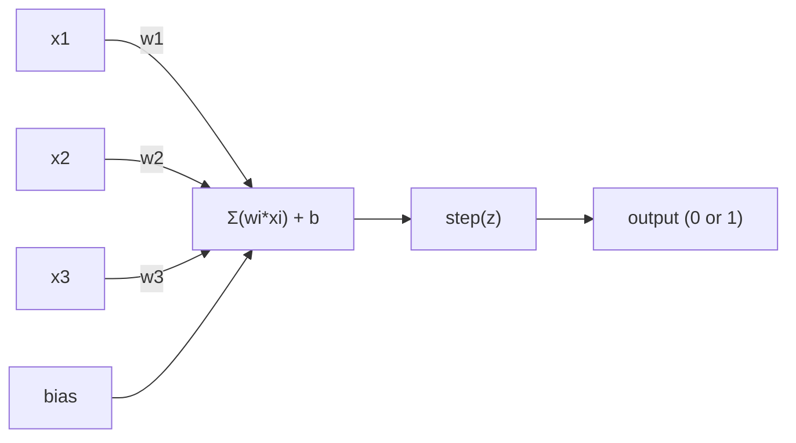
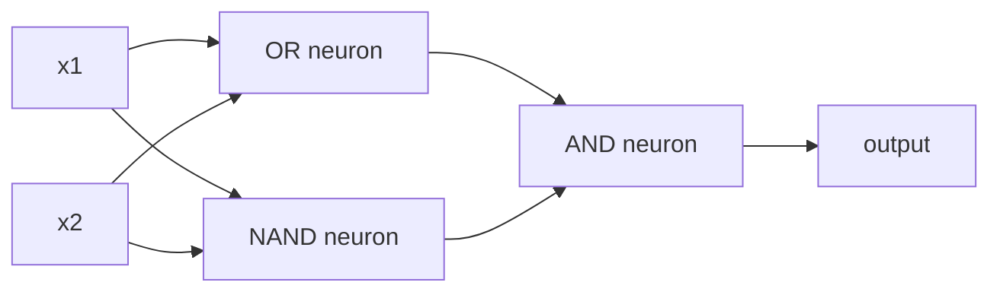

# 感知机

> 感知机是神经网络的原子。将它剖开，你会发现权重、偏置和决策。

**类型：** 构建
**语言：** Python
**前置知识：** 阶段 1 (Linear Algebra Intuition)
**时间：** 约 60 分钟

## 学习目标

- 用 Python 从零实现感知机，包括权重更新规则和阶跃激活函数
- 解释为什么单个感知机只能解决线性可分问题，并演示 XOR 失败案例
- 通过组合 OR、NAND 和 AND 门构建多层感知机来解决 XOR
- 训练一个带 Sigmoid 激活和反向传播的两层网络，自动学习 XOR

## 问题

你知道向量和点积。你知道矩阵将输入转换为输出。但机器如何*学习*使用哪种变换呢？

感知机回答了这个问题。它是最简单的学习机器：接收一些输入，乘以权重，加上偏置，做出二值决策。然后调整。仅此而已。所有已构建的神经网络都是这个思想的层层堆叠。

理解感知机意味着理解“学习”在代码中的实际含义：调整数字，直到输出匹配现实。

## 核心概念

### 一个神经元，一个决策

感知机接收 n 个输入，每个乘以权重，求和，加上偏置，然后通过激活函数输出结果。



阶跃函数是残酷的：如果加权和加偏置 >= 0，输出 1；否则输出 0。

```
step(z) = 1  if z >= 0
           0  if z < 0
```

这是一个线性分类器。权重和偏置定义了一条直线（或更高维度的超平面），将输入空间分割成两个区域。

### 决策边界（Decision Boundary）

对于两个输入，感知机在二维空间中画一条直线：

```
  x2
  ┤
  │  Class 1        /
  │    (0)          /
  │                /
  │               / w1·x1 + w2·x2 + b = 0
  │              /
  │             /     Class 2
  │            /        (1)
  ┼───────────/──────────── x1
```

直线一侧的所有点输出 0，另一侧输出 1。训练移动这条直线，直到它正确分离类别。

### 学习规则

感知机学习规则很简单：

```
For each training example (x, y_true):
    y_pred = predict(x)
    error = y_true - y_pred

    For each weight:
        w_i = w_i + learning_rate * error * x_i
    bias = bias + learning_rate * error
```

如果预测正确，误差 = 0，无变化。如果预测为 0 但应为 1，权重增加。如果预测为 1 但应为 0，权重减小。学习率控制每次调整的大小。

### XOR 问题

这里就是它失效的地方。看看这些逻辑门：

```
AND gate:           OR gate:            XOR gate:
x1  x2  out         x1  x2  out         x1  x2  out
0   0   0           0   0   0           0   0   0
0   1   0           0   1   1           0   1   1
1   0   0           1   0   1           1   0   1
1   1   1           1   1   1           1   1   0
```

AND 和 OR 是线性可分的：你可以画一条直线来分离 0 和 1。XOR 不是。没有一条直线能分离 [0,1] 和 [1,0] 与 [0,0] 和 [1,1]。

```
AND (separable):        XOR (not separable):

  x2                      x2
  1 ┤  0     1            1 ┤  1     0
    │     /                 │
  0 ┤  0 / 0              0 ┤  0     1
    ┼──/──────── x1         ┼──────────── x1
       line works!          no single line works!
```

这是一个根本限制。单个感知机只能解决线性可分问题。Minsky 和 Papert 在 1969 年证明了这一点，这几乎扼杀了神经网络研究十年之久。

解决方法：将感知机堆叠成层。多层感知机通过将两个线性决策组合成一个非线性决策来解决 XOR。

```figure
perceptron-boundary
```

## 动手构建

### 步骤 1：感知机类

```python
class Perceptron:
    def __init__(self, n_inputs, learning_rate=0.1):
        self.weights = [0.0] * n_inputs
        self.bias = 0.0
        self.lr = learning_rate

    def predict(self, inputs):
        total = sum(w * x for w, x in zip(self.weights, inputs))
        total += self.bias
        return 1 if total >= 0 else 0

    def train(self, training_data, epochs=100):
        for epoch in range(epochs):
            errors = 0
            for inputs, target in training_data:
                prediction = self.predict(inputs)
                error = target - prediction
                if error != 0:
                    errors += 1
                    for i in range(len(self.weights)):
                        self.weights[i] += self.lr * error * inputs[i]
                    self.bias += self.lr * error
            if errors == 0:
                print(f"Converged at epoch {epoch + 1}")
                return
        print(f"Did not converge after {epochs} epochs")
```

### 步骤 2：在逻辑门上训练

```python
and_data = [
    ([0, 0], 0),
    ([0, 1], 0),
    ([1, 0], 0),
    ([1, 1], 1),
]

or_data = [
    ([0, 0], 0),
    ([0, 1], 1),
    ([1, 0], 1),
    ([1, 1], 1),
]

not_data = [
    ([0], 1),
    ([1], 0),
]

print("=== AND Gate ===")
p_and = Perceptron(2)
p_and.train(and_data)
for inputs, _ in and_data:
    print(f"  {inputs} -> {p_and.predict(inputs)}")

print("\n=== OR Gate ===")
p_or = Perceptron(2)
p_or.train(or_data)
for inputs, _ in or_data:
    print(f"  {inputs} -> {p_or.predict(inputs)}")

print("\n=== NOT Gate ===")
p_not = Perceptron(1)
p_not.train(not_data)
for inputs, _ in not_data:
    print(f"  {inputs} -> {p_not.predict(inputs)}")
```

### 步骤 3：观察 XOR 失败

```python
xor_data = [
    ([0, 0], 0),
    ([0, 1], 1),
    ([1, 0], 1),
    ([1, 1], 0),
]

print("\n=== XOR Gate (single perceptron) ===")
p_xor = Perceptron(2)
p_xor.train(xor_data, epochs=1000)
for inputs, expected in xor_data:
    result = p_xor.predict(inputs)
    status = "OK" if result == expected else "WRONG"
    print(f"  {inputs} -> {result} (expected {expected}) {status}")
```

它永远不会收敛。这硬性证明了单个感知机无法学习 XOR。

### 步骤 4：用两层解决 XOR

技巧：XOR = (x1 OR x2) AND NOT (x1 AND x2)。组合三个感知机：



```python
def xor_network(x1, x2):
    or_neuron = Perceptron(2)
    or_neuron.weights = [1.0, 1.0]
    or_neuron.bias = -0.5

    nand_neuron = Perceptron(2)
    nand_neuron.weights = [-1.0, -1.0]
    nand_neuron.bias = 1.5

    and_neuron = Perceptron(2)
    and_neuron.weights = [1.0, 1.0]
    and_neuron.bias = -1.5

    hidden1 = or_neuron.predict([x1, x2])
    hidden2 = nand_neuron.predict([x1, x2])
    output = and_neuron.predict([hidden1, hidden2])
    return output


print("\n=== XOR Gate (multi-layer network) ===")
for inputs, expected in xor_data:
    result = xor_network(inputs[0], inputs[1])
    print(f"  {inputs} -> {result} (expected {expected})")
```

所有四种情况都正确。将感知机堆叠成层，可以创建单个感知机无法产生的决策边界。

### 步骤 5：训练两层网络

步骤 4 手工设置了权重。这对 XOR 有效，但对于你不知道正确权重的实际问题则不行。解决方法：用 Sigmoid 替换阶跃函数，并通过反向传播自动学习权重。

```python
class TwoLayerNetwork:
    def __init__(self, learning_rate=0.5):
        import random
        random.seed(0)
        self.w_hidden = [[random.uniform(-1, 1), random.uniform(-1, 1)] for _ in range(2)]
        self.b_hidden = [random.uniform(-1, 1), random.uniform(-1, 1)]
        self.w_output = [random.uniform(-1, 1), random.uniform(-1, 1)]
        self.b_output = random.uniform(-1, 1)
        self.lr = learning_rate

    def sigmoid(self, x):
        import math
        x = max(-500, min(500, x))
        return 1.0 / (1.0 + math.exp(-x))

    def forward(self, inputs):
        self.inputs = inputs
        self.hidden_outputs = []
        for i in range(2):
            z = sum(w * x for w, x in zip(self.w_hidden[i], inputs)) + self.b_hidden[i]
            self.hidden_outputs.append(self.sigmoid(z))
        z_out = sum(w * h for w, h in zip(self.w_output, self.hidden_outputs)) + self.b_output
        self.output = self.sigmoid(z_out)
        return self.output

    def train(self, training_data, epochs=10000):
        for epoch in range(epochs):
            total_error = 0
            for inputs, target in training_data:
                output = self.forward(inputs)
                error = target - output
                total_error += error ** 2

                d_output = error * output * (1 - output)

                saved_w_output = self.w_output[:]
                hidden_deltas = []
                for i in range(2):
                    h = self.hidden_outputs[i]
                    hd = d_output * saved_w_output[i] * h * (1 - h)
                    hidden_deltas.append(hd)

                for i in range(2):
                    self.w_output[i] += self.lr * d_output * self.hidden_outputs[i]
                self.b_output += self.lr * d_output

                for i in range(2):
                    for j in range(len(inputs)):
                        self.w_hidden[i][j] += self.lr * hidden_deltas[i] * inputs[j]
                    self.b_hidden[i] += self.lr * hidden_deltas[i]
```

```python
net = TwoLayerNetwork(learning_rate=2.0)
net.train(xor_data, epochs=10000)
for inputs, expected in xor_data:
    result = net.forward(inputs)
    predicted = 1 if result >= 0.5 else 0
    print(f"  {inputs} -> {result:.4f} (rounded: {predicted}, expected {expected})")
```

与第4步有两个关键区别。首先，sigmoid 替换了阶跃函数——它是平滑的，因此存在梯度。其次，`train` 方法将误差从输出层反向传播到隐藏层，根据每个权重对误差的贡献比例进行调整。这就是反向传播，仅用20行代码。

这是通往第3课的桥梁。`d_output` 和 `hidden_deltas` 背后的数学原理是应用于网络图的链式法则。我们将在那里正式推导它。

## 使用它

你刚才从头构建的一切都在一个导入中：

```python
from sklearn.linear_model import Perceptron as SkPerceptron
import numpy as np

X = np.array([[0,0],[0,1],[1,0],[1,1]])
y = np.array([0, 0, 0, 1])

clf = SkPerceptron(max_iter=100, tol=1e-3)
clf.fit(X, y)
print([clf.predict([x])[0] for x in X])
```

五行代码。你30行的`Perceptron`类做了同样的事情。sklearn版本添加了收敛检查、多种损失函数和稀疏输入支持——但核心循环是相同的：加权求和、阶跃函数、根据误差更新权重。

真正的差距在大规模时显现出来。生产网络中的变化：

- 阶跃函数变为 sigmoid、ReLU 或其他平滑激活函数
- 权重通过反向传播自动学习（第3课）
- 层数变得更深：3层、10层、100层以上
- 同样的原理适用：每一层从上一层的输出中创建新的特征。

单个感知器只能画直线。将它们堆叠起来，你可以画出任何形状。

## 发布

本課(lesson)产出：
- `outputs/skill-perceptron.md` - 一项涵盖何时需要单层与多层架构的技能

## 练习

1. 在与非门（NAND gate）上训练一个感知器（与非门是通用门——任何逻辑电路都可以用与非门构建）。验证其权重和偏置形成有效的决策边界。
2. 修改感知器类以追踪每个epoch的决策边界（w1*x1 + w2*x2 + b = 0）。打印在训练AND门时决策边界线的移动情况。
3. 构建一个3输入感知器，只有当3个输入中至少2个为1时才输出1（多数投票函数）。这是线性可分的吗？为什么？

## 关键术语

|  术语  |  人们的说法  |  实际含义  |
|------|----------------|----------------------|
|  感知器  |  "假神经元"  |  线性分类器：输入与权重的点积，加上偏置，通过阶跃函数  |
|  权重  |  "输入的重要性程度"  |  一个乘数，用于缩放每个输入对决策的贡献  |
|  偏置  |  "阈值"  |  一个常数，用于平移决策边界，使得即使在输入为零时感知器也能激活  |
|  激活函数  |  "压缩数值的东西"  |  在加权求和后应用的函数——感知器使用阶跃函数，现代网络使用 sigmoid/ReLU  |
|  线性可分  |  "你可以在它们之间画一条线"  |  一个数据集，其中单个超平面可以完美地将类别分开  |
|  异或问题  |  "感知器做不到的事"  |  证明单层网络无法学习非线性可分函数  |
|  决策边界  |  "分类器切换的位置"  |  超平面 w*x + b = 0，将输入空间划分为两个类别  |
|  多层感知器  |  "真正的神经网络"  |  感知器按层堆叠，每一层的输出作为下一层的输入  |

## 延伸阅读

- Frank Rosenblatt, "The Perceptron: A Probabilistic Model for Information Storage and Organization in the Brain" (1958) -- the original paper that started it all
- Minsky & Papert, "Perceptrons" (1969) -- the book that proved XOR was unsolvable by single-layer networks and killed perceptron research for a decade
- Michael Nielsen, "Neural Networks and Deep Learning", Chapter 1 (http://neuralnetworksanddeeplearning.com/) -- free online, best visual explanation of how perceptrons compose into networks
