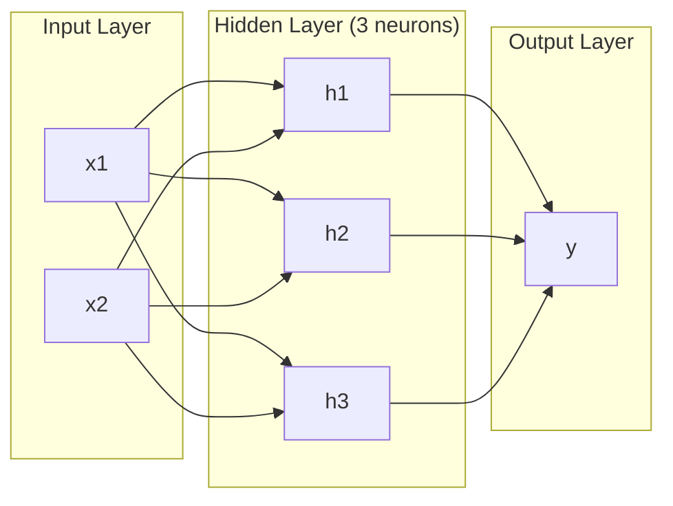
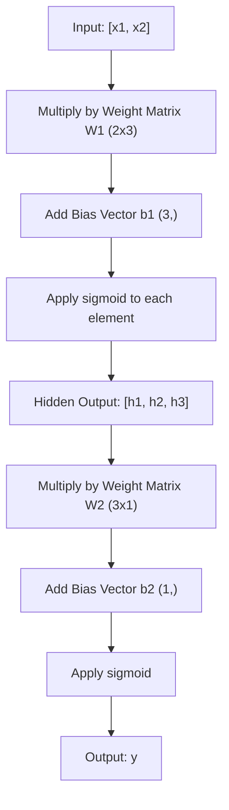
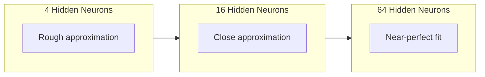

# 多层网络与前向传播

> 一个神经元画一条线。将它们堆叠起来，你就可以画出任何形状。

**类型：** 实践
**语言：** Python
**前置条件：** 阶段01（数学基础），第03.01课（感知机）
**时间：** ~90分钟

## 学习目标

- 使用Layer和Network类从头构建一个多层网络，执行完整的前向传播
- 追踪矩阵维度在网络的每一层中的变化，并识别形状不匹配
- 解释堆叠非线性激活函数如何使网络学习弯曲的决策边界
- 使用2-2-1架构和手动调整的Sigmoid权重解决XOR问题

## 问题

单个神经元就是一个画线器。仅此而已。它只能画一条穿过数据的直线。人工智能中的每一个实际问题——图像识别、语言理解、下围棋——都需要曲线。将神经元堆叠成层，你就能得到曲线。

1969年，Minsky和Papert证明了这一局限是致命的：单层网络无法学习XOR。不是“难以学习”，而是在数学上不可能。XOR真值表将[0,1]和[1,0]放在一侧，[0,0]和[1,1]放在另一侧。没有一条直线能分开它们。

这导致神经网络研究资金中断了十多年。事后看来，解决办法显而易见：不要只使用一层。将神经元堆叠成多层。让第一层将输入空间分割成新的特征，让第二层将这些特征组合成单条直线无法做出的决策。

这种堆叠就是多层网络。它是当今所有生产环境中的深度学习模型的基础。前向传播——数据从输入经过隐藏层流向输出——是你在其他一切工作正常之前需要构建的第一件事。

## 核心概念

### 层：输入层、隐藏层、输出层

一个多层网络有三种类型的层：

**输入层**——实际上不算是层。它保存你的原始数据。两个特征意味着两个输入节点。这里不进行计算。

**隐藏层**——工作发生的地方。每个神经元接收上一层所有输出，应用权重和偏置，然后将结果通过激活函数。称为“隐藏”是因为你在训练数据中永远看不到这些值。

**输出层**——最终答案。对于二分类，一个神经元使用Sigmoid。对于多分类，每个类别一个神经元。



这是一个2-3-1网络。两个输入，三个隐藏神经元，一个输出。每个连接都有一个权重。每个神经元（除了输入层）都有一个偏置。

每一层产生一个称为隐藏状态的数值向量。对于文本，隐藏状态会增加维度——将单词编码为768个数字以捕捉语义含义。对于图像，它们会降低维度——将数百万像素压缩成可管理的表示。隐藏状态就是学习发生的地方。

### 神经元与激活函数

每个神经元做三件事：

1. 将每个输入乘以相应的权重
2. 将所有乘积求和并加上偏置
3. 将和通过激活函数

目前，激活函数是Sigmoid：

```
sigmoid(z) = 1 / (1 + e^(-z))
```

Sigmoid将任何数压缩到(0, 1)范围内。大的正输入接近1。大的负输入接近0。零映射到0.5。这个平滑曲线使得学习成为可能——与感知机的硬阶跃不同，Sigmoid处处有梯度。

### 前向传播：数据如何流动

前向传播将输入数据逐层推过网络，直到到达输出。在前向传播期间没有学习发生。它只是纯计算：乘、加、激活、重复。



在每一层，三个操作按顺序发生：

```
z = W * input + b       (linear transformation)
a = sigmoid(z)           (activation)
```

一层的输出成为下一层的输入。这就是整个前向传播。

### 矩阵维度

追踪维度是深度学习中最重要的调试技能。以下是2-3-1网络：

|  步骤  |  操作  |  维度  |  结果形状  |
|------|-----------|------------|-------------|
|  输入  |  x  |  --  |  (2,)  |
|  隐藏层线性变换  |  W1 * x + b1  |  W1: (3, 2), b1: (3,)  |  (3,)  |
|  隐藏层激活  |  sigmoid(z1)  |  --  |  (3,)  |
| 输出线性层  |  W2 * h + b2  |  W2: (1, 3), b2: (1,)  |  (1,)  |
| 输出激活层  |  sigmoid(z2)  |  --  |  (1,)  |

规则：第k层的权重矩阵W的形状为(neurons_in_layer_k, neurons_in_layer_k_minus_1)。行对应当前层，列对应前一层。如果形状不匹配，则存在错误。

### 通用近似定理(Universal Approximation Theorem)

1989年，George Cybenko证明了一个卓越的结论：一个具有单隐藏层和足够多神经元的神经网络可以以任意期望的精度逼近任何连续函数。

这并不意味着一个隐藏层总是最好的。它意味着这种架构在理论上是可行的。在实践中，更深的网络（更多层，每层更少神经元）学习相同函数所需的总参数远少于浅宽网络。这就是深度学习有效的原因。

直观理解：隐藏层中的每个神经元学习一个"凸起(bump)"或特征。足够多的凸起放置在正确的位置可以近似任何光滑曲线。神经元越多，凸起越多，近似效果越好。



### 可组合性(Composability)

神经网络是可组合的。你可以堆叠它们、串联它们、并行运行它们。Whisper模型使用编码器网络处理音频，并使用独立的解码器网络生成文本。现代LLM是仅解码器架构。BERT是仅编码器架构。T5是编码器-解码器架构。架构的选择定义了模型能做什么。

```figure
mlp-forward
```

## 动手构建

纯Python。没有numpy。每个矩阵运算从头编写。

### 步骤1：Sigmoid激活函数

```python
import math

def sigmoid(x):
    x = max(-500.0, min(500.0, x))
    return 1.0 / (1.0 + math.exp(-x))
```

截断到[-500, 500]可以防止溢出。`math.exp(500)`很大但有限。`math.exp(1000)`是无穷大。

### 步骤2：层类

深度学习中最重要的是矩阵乘法。每一层、每一个注意力头、每一次前向传播——归根结底都是矩阵乘法。线性层接受一个输入向量，乘以权重矩阵，再加上偏置向量：y = Wx + b。这一个方程就占据了神经网络90%的计算量。

一个层包含一个权重矩阵和一个偏置向量。它的前向方法接受一个输入向量并返回激活后的输出。

```python
class Layer:
    def __init__(self, n_inputs, n_neurons, weights=None, biases=None):
        if weights is not None:
            self.weights = weights
        else:
            import random
            self.weights = [
                [random.uniform(-1, 1) for _ in range(n_inputs)]
                for _ in range(n_neurons)
            ]
        if biases is not None:
            self.biases = biases
        else:
            self.biases = [0.0] * n_neurons

    def forward(self, inputs):
        self.last_input = inputs
        self.last_output = []
        for neuron_idx in range(len(self.weights)):
            z = sum(
                w * x for w, x in zip(self.weights[neuron_idx], inputs)
            )
            z += self.biases[neuron_idx]
            self.last_output.append(sigmoid(z))
        return self.last_output
```

权重矩阵的形状为(n_neurons, n_inputs)。每一行是一个神经元在所有输入上的权重。前向方法遍历神经元，计算加权和加偏置，应用sigmoid函数，并收集结果。

### 步骤3：网络类

网络是层的列表。前向传播将它们串联起来：第k层的输出作为第k+1层的输入。

```python
class Network:
    def __init__(self, layers):
        self.layers = layers

    def forward(self, inputs):
        current = inputs
        for layer in self.layers:
            current = layer.forward(current)
        return current
```

这就是完整的前向传播。四行逻辑。数据进入，流经每一层，从另一端输出。

### 步骤4：手动调整权重的XOR

在第01课中，我们通过组合OR、NAND和AND感知机解决了XOR问题。现在用我们的层类和网络类做同样的事情。2-2-1架构：两个输入，两个隐藏神经元，一个输出。

```python
hidden = Layer(
    n_inputs=2,
    n_neurons=2,
    weights=[[20.0, 20.0], [-20.0, -20.0]],
    biases=[-10.0, 30.0],
)

output = Layer(
    n_inputs=2,
    n_neurons=1,
    weights=[[20.0, 20.0]],
    biases=[-30.0],
)

xor_net = Network([hidden, output])

xor_data = [
    ([0, 0], 0),
    ([0, 1], 1),
    ([1, 0], 1),
    ([1, 1], 0),
]

for inputs, expected in xor_data:
    result = xor_net.forward(inputs)
    predicted = 1 if result[0] >= 0.5 else 0
    print(f"  {inputs} -> {result[0]:.6f} (rounded: {predicted}, expected: {expected})")
```

大权重(20, -20)使sigmoid表现得像阶跃函数。第一个隐藏神经元近似OR。第二个近似NAND。输出神经元将它们组合成AND，即XOR。

### 步骤5：圆分类

一个更难的问题：将二维点分类为以原点为中心、半径为0.5的圆的内部或外部。这需要弯曲的决策边界——单个感知机无法做到。

```python
import random
import math

random.seed(42)

data = []
for _ in range(200):
    x = random.uniform(-1, 1)
    y = random.uniform(-1, 1)
    label = 1 if (x * x + y * y) < 0.25 else 0
    data.append(([x, y], label))

circle_net = Network([
    Layer(n_inputs=2, n_neurons=8),
    Layer(n_inputs=8, n_neurons=1),
])
```

使用随机权重，网络无法很好分类。但前向传播仍然运行。这就是要点——前向传播仅仅是计算。学习正确的权重是反向传播，将在第03课中介绍。

```python
correct = 0
for inputs, expected in data:
    result = circle_net.forward(inputs)
    predicted = 1 if result[0] >= 0.5 else 0
    if predicted == expected:
        correct += 1

print(f"Accuracy with random weights: {correct}/{len(data)} ({100*correct/len(data):.1f}%)")
```

随机权重得到的精度很低——通常比猜测多数类还差。训练后（第03课），具有8个隐藏神经元的相同架构将绘制出区分内部和外部的弯曲边界。

## 使用它

PyTorch用四行代码完成上述所有工作：

```python
import torch
import torch.nn as nn

model = nn.Sequential(
    nn.Linear(2, 8),
    nn.Sigmoid(),
    nn.Linear(8, 1),
    nn.Sigmoid(),
)

x = torch.tensor([[0.0, 0.0], [0.0, 1.0], [1.0, 0.0], [1.0, 1.0]])
output = model(x)
print(output)
```

`nn.Linear(2, 8)`是你的层类：形状为(8, 2)的权重矩阵，形状为(8,)的偏置向量。`nn.Sigmoid()`是逐元素应用的sigmoid函数。`nn.Sequential`是你的网络类：按顺序串联各层。

区别在于速度和规模。PyTorch在GPU上运行，处理数百万样本的批次，并自动计算反向传播的梯度。但前向传播的逻辑与您从头构建的完全相同。

## 发布

本课提供了一个可重用的提示，用于设计网络架构：

- `outputs/prompt-network-architect.md`

当你需要为特定问题决定层数、每层神经元数量以及使用哪些激活函数时，使用它。

## 练习

1. 构建一个2-4-2-1网络（两个隐藏层），并在XOR数据上使用随机权重运行前向传播。打印中间隐藏层的输出，观察表示在各层之间的转换。

2. 将圆形分类器的隐藏层大小从8改为2，再改为32。每次使用随机权重运行前向传播。隐藏神经元数量会改变输出范围或分布吗？为什么？

3. 在Network类上实现一个`count_parameters`方法，返回可训练权重和偏置的总数。在784-256-128-10网络（经典MNIST架构）上测试。它有多少个参数？

4. 为3-4-4-2网络构建前向传播。输入RGB颜色值（归一化到0-1），观察两个输出。这是一个用于两类分类的简单颜色分类器的架构。

5. 将sigmoid替换为“泄漏阶跃”函数：如果z<0则返回0.01*z，否则返回1.0。使用步骤4中相同的手动调整权重在XOR上运行前向传播。它仍然有效吗？为什么平滑的sigmoid比硬截止更受欢迎？

## 关键术语

|  术语  |  人们的说法  |  实际含义  |
|------|----------------|----------------------|
| 前向传播 | “运行模型” | 将输入逐层推进——乘以权重、加上偏置、激活——以产生输出 |
| 隐藏层 | “中间部分” | 输入层和输出层之间的任何层，其值在数据中不直接观测 |
| 多层网络 | “深度神经网络” | 神经元逐层堆叠，每层输出作为下一层输入 |
| 激活函数 | “非线性” | 在线性变换之后应用的函数，为决策边界引入曲线 |
| Sigmoid | “S形曲线” | sigma(z)=1/(1+e^(-z))，将任意实数压缩到(0,1)之间，处处光滑可导 |
| 权重矩阵 | “参数” | 形状为(当前层神经元数, 前一层神经元数)的矩阵W，包含可学习的连接强度 |
| 偏置向量 | “偏移量” | 矩阵乘法后添加的向量，使神经元在输入全零时也能激活 |
| 通用近似 | “神经网络可以学习任何东西” | 具有足够神经元的单个隐藏层可以逼近任何连续函数——但“足够”可能意味着数十亿 |
| 线性变换 | “矩阵乘法步骤” | z=W*x+b，激活之前的计算，将输入映射到新空间 |
| 决策边界 | “分类器切换的地方” | 输入空间中网络输出越过分类阈值的表面 |

## 延伸阅读

- Michael Nielsen,《Neural Networks and Deep Learning》,第1-2章(http://neuralnetworksanddeeplearning.com/)——最清晰免费的前向传播和网络结构解释，含交互式可视化
- Cybenko,《Approximation by Superpositions of a Sigmoidal Function》(1989)——通用近似定理原始论文，出人意料地易读
- 3Blue1Brown,《But what is a neural network?》(http://neuralnetworksanddeeplearning.com/)——20分钟可视化讲解层、权重和前向传播，建立正确心智模型
- Goodfellow, Bengio, Courville,《Deep Learning》,第6章(http://neuralnetworksanddeeplearning.com/)——多层网络标准参考书，免费在线
