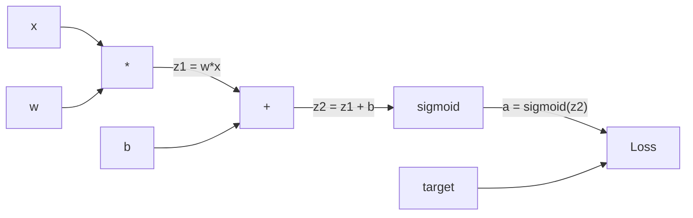
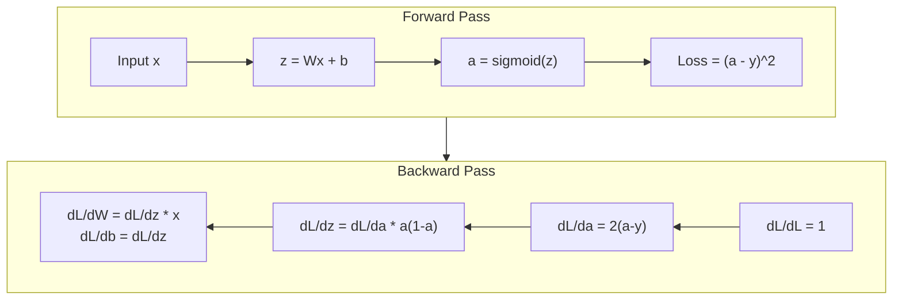
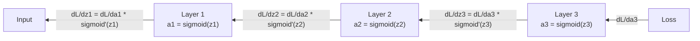

# 从零开始实现反向传播

> 反向传播(Backpropagation)是让学习成为可能的算法。没有它，神经网络不过是昂贵的随机数生成器。

**类型：** 动手实践
**语言：** Python
**前置知识：** 第03.02课（多层网络）
**时间：** 约120分钟

## 学习目标

- 实现一个基于Value的自动微分引擎，构建计算图并通过拓扑排序计算梯度
- 使用链式法则推导加法、乘法和sigmoid的反向传播
- 仅使用自己实现的反向传播引擎在XOR和圆分类任务上训练多层网络
- 识别深度sigmoid网络中的梯度消失问题，并解释为什么梯度会指数级收缩

## 问题

你的网络有一个隐藏层，包含768个输入和3072个输出，共2,359,296个权重。它做出了错误的预测。哪些权重导致了错误？逐一测试每个权重需要230万次前向传播。反向传播在一次反向传播中就计算出全部230万个梯度。这不是优化，而是可训练与不可能之间的区别。

朴素的方法：拿出一个权重，微调一点点，重新运行前向传播，观察损失是上升还是下降。这就得到该权重的梯度。然后对网络中的每个权重重复这个过程。再乘以数千个训练步骤和数百万个数据点。训练任何有用的东西都需要地质时间。

反向传播解决了这个问题。一次前向传播，一次反向传播，所有梯度都计算完毕。关键在于微积分中的链式法则(Chain Rule)，把它系统地应用到计算图上。这就是让深度学习变得实用的算法。没有它，我们还会被困在玩具问题上。

## 核心概念

### 链式法则在神经网络中的应用

你在第01阶段第05课中见过链式法则。快速回顾：如果 y = f(g(x))，那么 dy/dx = f'(g(x)) * g'(x)。沿着链相乘导数。

在神经网络中，“链”是从输入到损失的操作序列。每一层应用权重、加偏置、通过激活函数。损失函数将最终输出与目标进行比较。反向传播沿着这条链反向追踪，计算每个操作对误差的贡献。

### 计算图(Computational Graphs)

每次前向传播都会构建一个图。每个节点是一个操作（乘法、加法、sigmoid）。每条边向前传递一个值，向后传递一个梯度。



前向传播：值从左到右流动。x 和 w 产生 z1 = w*x。加上 b 得到 z2。Sigmoid 给出激活值 a。使用损失函数将 a 与目标 y 进行比较。

反向传播：梯度从右到左流动。从 dL/da 开始（损失随激活值的变化）。乘以 da/dz2（sigmoid的导数）。得到 dL/dz2。然后分为 dL/db（等于 dL/dz2，因为 z2 = z1 + b）和 dL/dz1。接着 dL/dw = dL/dz1 * x，dL/dx = dL/dz1 * w。

图中的每个节点在反向传播中都有一个任务：接收来自上方的梯度，乘以其局部导数，然后向下传递。

### 前向传播 vs 反向传播



前向传播存储了所有中间值：z、a、每层的输入。反向传播需要这些存储的值来计算梯度。这就是反向传播的核心权衡：用内存（存储激活值）换取速度（一次传播而不是数百万次）。

### 梯度在网络中的流动

对于一个3层网络，梯度会链式通过每一层：



在每一层，梯度都会乘以sigmoid的导数。sigmoid的导数是 a * (1 - a)，最大值是0.25（当 a=0.5时）。三层之后，梯度最多乘以 0.25^3 = 0.0156。十层：0.25^10 = 0.000001。

### 梯度消失(Vanishing Gradients)

这就是梯度消失问题。Sigmoid将输出压缩在0和1之间，其导数始终小于0.25。叠加足够多的sigmoid层，梯度会缩小到几乎为零。早期层几乎无法学习，因为它们接收到的梯度接近于零。

```
sigmoid(z):     Output range [0, 1]
sigmoid'(z):    Max value 0.25 (at z = 0)

After 5 layers:   gradient * 0.25^5 = 0.001x original
After 10 layers:  gradient * 0.25^10 = 0.000001x original
```

这就是为什么深度sigmoid网络几乎无法训练。解决方法是使用ReLU及其变体，这将在第04课中讲解。现在，请理解反向传播本身是完美的，问题是它要传播通过的对象。

### 推导两层网络的梯度

具体数学推导：输入x，隐藏层sigmoid，输出层sigmoid，均方误差(MSE)损失。

前向传播：
```
z1 = W1 * x + b1
a1 = sigmoid(z1)
z2 = W2 * a1 + b2
a2 = sigmoid(z2)
L = (a2 - y)^2
```

反向传播（逐步应用链式法则）：
```
dL/da2 = 2(a2 - y)
da2/dz2 = a2 * (1 - a2)
dL/dz2 = dL/da2 * da2/dz2 = 2(a2 - y) * a2 * (1 - a2)

dL/dW2 = dL/dz2 * a1
dL/db2 = dL/dz2

dL/da1 = dL/dz2 * W2
da1/dz1 = a1 * (1 - a1)
dL/dz1 = dL/da1 * da1/dz1

dL/dW1 = dL/dz1 * x
dL/db1 = dL/dz1
```

每个梯度都是局部导数的乘积，从损失回溯而来。这就是反向传播的全部。

```figure
backprop-vanishing
```

## 动手构建

### 第一步：Value节点

计算中的每个数字都成为一个Value。它存储数据、梯度以及创建方式（这样它就知道如何反向计算梯度）。

```python
class Value:
    def __init__(self, data, children=(), op=''):
        self.data = data
        self.grad = 0.0
        self._backward = lambda: None
        self._children = set(children)
        self._op = op

    def __repr__(self):
        return f"Value(data={self.data:.4f}, grad={self.grad:.4f})"
```

尚无梯度（0.0）。尚无反向函数（无操作）。`_children` 追踪哪些值(Value)产生了该值，以便后续对图进行拓扑排序。

### 步骤2：带反向函数的运算

每个运算创建一个新的值(Value)，并定义梯度如何通过它反向传播。

```python
def __add__(self, other):
    other = other if isinstance(other, Value) else Value(other)
    out = Value(self.data + other.data, (self, other), '+')

    def _backward():
        self.grad += out.grad
        other.grad += out.grad

    out._backward = _backward
    return out

def __mul__(self, other):
    other = other if isinstance(other, Value) else Value(other)
    out = Value(self.data * other.data, (self, other), '*')

    def _backward():
        self.grad += other.data * out.grad
        other.grad += self.data * out.grad

    out._backward = _backward
    return out
```

对于加法：d(a+b)/da = 1, d(a+b)/db = 1。因此两个输入直接获得输出的梯度。

对于乘法：d(a*b)/da = b, d(a*b)/db = a。每个输入获得另一个输入的值乘以输出梯度。

`+=` 至关重要。一个值(Value)可能被用于多个运算。其梯度是所有路径梯度的和。

### 步骤3：Sigmoid 与损失

```python
import math

def sigmoid(self):
    x = self.data
    x = max(-500, min(500, x))
    s = 1.0 / (1.0 + math.exp(-x))
    out = Value(s, (self,), 'sigmoid')

    def _backward():
        self.grad += (s * (1 - s)) * out.grad

    out._backward = _backward
    return out
```

Sigmoid 导数：sigmoid(x) * (1 - sigmoid(x))。在前向传播中我们计算了 sigmoid(x) = s。重复使用它，无需额外计算。

```python
def mse_loss(predicted, target):
    diff = predicted + Value(-target)
    return diff * diff
```

单输出的均方误差(MSE)：(predicted - target)^2。我们将减法表示为加法与一个取负的值(Value)。

### 步骤4：反向传播

拓扑排序确保我们以正确的顺序处理节点——一个节点的梯度在通过它传播之前已完全累积。

```python
def backward(self):
    topo = []
    visited = set()

    def build_topo(v):
        if v not in visited:
            visited.add(v)
            for child in v._children:
                build_topo(child)
            topo.append(v)

    build_topo(self)
    self.grad = 1.0
    for v in reversed(topo):
        v._backward()
```

从损失开始（梯度 = 1.0，因为 dL/dL = 1）。沿着排序后的图反向遍历。每个节点的`_backward` 将梯度推送给其子节点。

### 步骤5：层与网络

```python
import random

class Neuron:
    def __init__(self, n_inputs):
        scale = (2.0 / n_inputs) ** 0.5
        self.weights = [Value(random.uniform(-scale, scale)) for _ in range(n_inputs)]
        self.bias = Value(0.0)

    def __call__(self, x):
        act = sum((wi * xi for wi, xi in zip(self.weights, x)), self.bias)
        return act.sigmoid()

    def parameters(self):
        return self.weights + [self.bias]


class Layer:
    def __init__(self, n_inputs, n_outputs):
        self.neurons = [Neuron(n_inputs) for _ in range(n_outputs)]

    def __call__(self, x):
        out = [n(x) for n in self.neurons]
        return out[0] if len(out) == 1 else out

    def parameters(self):
        params = []
        for n in self.neurons:
            params.extend(n.parameters())
        return params


class Network:
    def __init__(self, sizes):
        self.layers = []
        for i in range(len(sizes) - 1):
            self.layers.append(Layer(sizes[i], sizes[i + 1]))

    def __call__(self, x):
        for layer in self.layers:
            x = layer(x)
            if not isinstance(x, list):
                x = [x]
        return x[0] if len(x) == 1 else x

    def parameters(self):
        params = []
        for layer in self.layers:
            params.extend(layer.parameters())
        return params

    def zero_grad(self):
        for p in self.parameters():
            p.grad = 0.0
```

一个神经元(Neuron)接收输入，计算加权和加偏置，并应用 sigmoid。权重初始化按 sqrt(2/n_inputs) 缩放以防止深层网络中 sigmoid 饱和。层(Layer)是神经元的列表。网络(Network)是层的列表。`parameters()` 方法收集所有可学习的值(Value)以便更新它们。

### 步骤6：在异或(XOR)上训练

```python
random.seed(42)
net = Network([2, 4, 1])

xor_data = [
    ([0.0, 0.0], 0.0),
    ([0.0, 1.0], 1.0),
    ([1.0, 0.0], 1.0),
    ([1.0, 1.0], 0.0),
]

learning_rate = 1.0

for epoch in range(1000):
    total_loss = Value(0.0)
    for inputs, target in xor_data:
        x = [Value(i) for i in inputs]
        pred = net(x)
        loss = mse_loss(pred, target)
        total_loss = total_loss + loss

    net.zero_grad()
    total_loss.backward()

    for p in net.parameters():
        p.data -= learning_rate * p.grad

    if epoch % 100 == 0:
        print(f"Epoch {epoch:4d} | Loss: {total_loss.data:.6f}")

print("\nXOR Results:")
for inputs, target in xor_data:
    x = [Value(i) for i in inputs]
    pred = net(x)
    print(f"  {inputs} -> {pred.data:.4f} (expected {target})")
```

观察损失下降。从随机预测到正确的异或(XOR)输出，完全由反向传播计算梯度并向正确方向调整权重驱动。

### 步骤7：圆分类

在第02课中，你手工调整了圆分类的权重。现在让网络学习它们。

```python
random.seed(7)

def generate_circle_data(n=100):
    data = []
    for _ in range(n):
        x1 = random.uniform(-1.5, 1.5)
        x2 = random.uniform(-1.5, 1.5)
        label = 1.0 if x1 * x1 + x2 * x2 < 1.0 else 0.0
        data.append(([x1, x2], label))
    return data

circle_data = generate_circle_data(80)

circle_net = Network([2, 8, 1])
learning_rate = 0.5

for epoch in range(2000):
    random.shuffle(circle_data)
    total_loss_val = 0.0
    for inputs, target in circle_data:
        x = [Value(i) for i in inputs]
        pred = circle_net(x)
        loss = mse_loss(pred, target)
        circle_net.zero_grad()
        loss.backward()
        for p in circle_net.parameters():
            p.data -= learning_rate * p.grad
        total_loss_val += loss.data

    if epoch % 200 == 0:
        correct = 0
        for inputs, target in circle_data:
            x = [Value(i) for i in inputs]
            pred = circle_net(x)
            predicted_class = 1.0 if pred.data > 0.5 else 0.0
            if predicted_class == target:
                correct += 1
        accuracy = correct / len(circle_data) * 100
        print(f"Epoch {epoch:4d} | Loss: {total_loss_val:.4f} | Accuracy: {accuracy:.1f}%")
```

这里我们使用在线随机梯度下降(online SGD)——在每个样本后更新权重，而不是累积整个批次。这更快打破对称性，并避免在整个损失景观上的 sigmoid 饱和。每个 epoch 打乱数据防止网络记忆顺序。

无需手工调整。网络自行发现圆形决策边界。这就是反向传播(Backpropagation)的力量：你定义架构、损失函数和数据。算法计算出权重。

## 使用它

PyTorch 用几行代码实现了上述所有功能。核心思想相同——autograd 在前向传播过程中构建计算图，并反向追踪计算梯度。

```python
import torch
import torch.nn as nn

model = nn.Sequential(
    nn.Linear(2, 4),
    nn.Sigmoid(),
    nn.Linear(4, 1),
    nn.Sigmoid(),
)
optimizer = torch.optim.SGD(model.parameters(), lr=1.0)
criterion = nn.MSELoss()

X = torch.tensor([[0,0],[0,1],[1,0],[1,1]], dtype=torch.float32)
y = torch.tensor([[0],[1],[1],[0]], dtype=torch.float32)

for epoch in range(1000):
    pred = model(X)
    loss = criterion(pred, y)
    optimizer.zero_grad()
    loss.backward()
    optimizer.step()

print("PyTorch XOR Results:")
with torch.no_grad():
    for i in range(4):
        pred = model(X[i])
        print(f"  {X[i].tolist()} -> {pred.item():.4f} (expected {y[i].item()})")
```

`loss.backward()` 是你的 `total_loss.backward()`。`optimizer.step()` 是你的手动 `p.data -= lr * p.grad`。`optimizer.zero_grad()` 是你的 `net.zero_grad()`。相同的算法，工业级实现。PyTorch 处理 GPU 加速、混合精度、梯度检查点和数百种层类型。但反向传播是应用于同一计算图的相同链式法则(Chain Rule)。

训练运行前向传播，然后反向传播，然后更新权重。推理只运行前向传播。无需梯度，无需更新。这个区别很重要，因为推理发生在生产环境中。当你调用像 Claude 或 GPT 这样的 API 时，你在运行推理——你的提示向前流过网络，令牌从另一端出来。没有权重改变。理解反向传播很重要，因为它塑造了该网络中的每一个权重。

## 发布

本課(lesson)产出：
- `outputs/prompt-gradient-debugger.md` —— 一个可复用的提示，用于诊断任何神经网络中的梯度问题（消失、爆炸、NaN）

## 练习

1. 向值(Value)类添加一个 `__sub__` 方法（a - b = a + (-1 * b)）。然后实现一个 `__neg__` 方法。通过将其与手动计算简单表达式如 (a - b)^2 的梯度进行比较来验证梯度是否正确。

2. 向值(Value)添加一个 `relu` 方法（输出 max(0, x)，导数为 x > 0 时1，否则0）。在隐藏层中用 relu 替换 sigmoid，并再次在异或(XOR)上训练。比较收敛速度。你应该会看到更快的训练——这预示了第04课。

3. 在值(Value)上实现一个 `__pow__` 方法用于整数次幂。用它替换 `mse_loss` 为一个正确的 `(predicted - target) ** 2` 表达式。验证梯度与原始实现匹配。

4. 在训练循环中添加梯度裁剪：调用 `backward()` 后，将所有梯度裁剪到 [-1, 1]。训练一个更深层的网络（4层以上，使用 sigmoid），比较有裁剪和无裁剪的损失曲线。这是你对抗梯度爆炸(Exploding Gradients)的第一道防线。

5. 构建一个可视化：在异或(XOR)上训练后，打印网络中每个参数的梯度。识别哪一层具有最小的梯度。这展示了你在概念部分读到的梯度消失(Vanishing Gradient)问题。

## 关键术语

|  术语  |  人们的说法  |  实际含义  |
|------|----------------|----------------------|
|  反向传播(Backpropagation)  |  "网络学习"  |  一种通过在计算图上反向应用链式法则(Chain Rule)计算每个权重的 dL/dw 的算法  |
| 计算图 | "网络结构" | 一种有向无环图，其中节点是操作，边携带前向传播的值和反向传播的梯度 |
| 链式法则 | "乘以导数" | 若 y = f(g(x))，则 dy/dx = f'(g(x)) * g'(x) —— 反向传播的数学基础 |
| 梯度 | "最陡上升方向" | 损失函数对参数的偏导数 —— 告诉您如何改变该参数以减少损失 |
| 梯度消失 | "深层网络不学习" | 当梯度通过如sigmoid等饱和激活函数的层传播时，会呈指数级缩小 |
| 前向传播 | "运行网络" | 通过依次应用每一层的操作并存储中间值，从输入计算输出 |
| 反向传播 | "计算梯度" | 反向遍历计算图，使用链式法则在每个节点累积梯度 |
| 学习率 | "学习速度" | 控制权重更新步长的标量：w_new = w_old - lr * gradient |
| 拓扑排序 | "正确的顺序" | 一种图节点的排序，每个节点出现在其依赖的所有节点之后 —— 确保梯度在传播前完全累积 |
| 自动微分 | "自动微分" | 一种系统，在前向计算期间构建计算图并自动计算梯度 —— 即PyTorch引擎的功能 |

## 延伸阅读

- Rumelhart, Hinton & Williams, "通过反向传播误差学习表示" (1986) —— 使反向传播成为主流并解锁多层网络训练的论文
- 3Blue1Brown, "神经网络"系列 (https://www.youtube.com/playlist?list=PLZHQObOWTQDNU6R1_67000Dx_ZCJB-3pi) —— 对反向传播和网络中梯度流的最佳视觉解释
