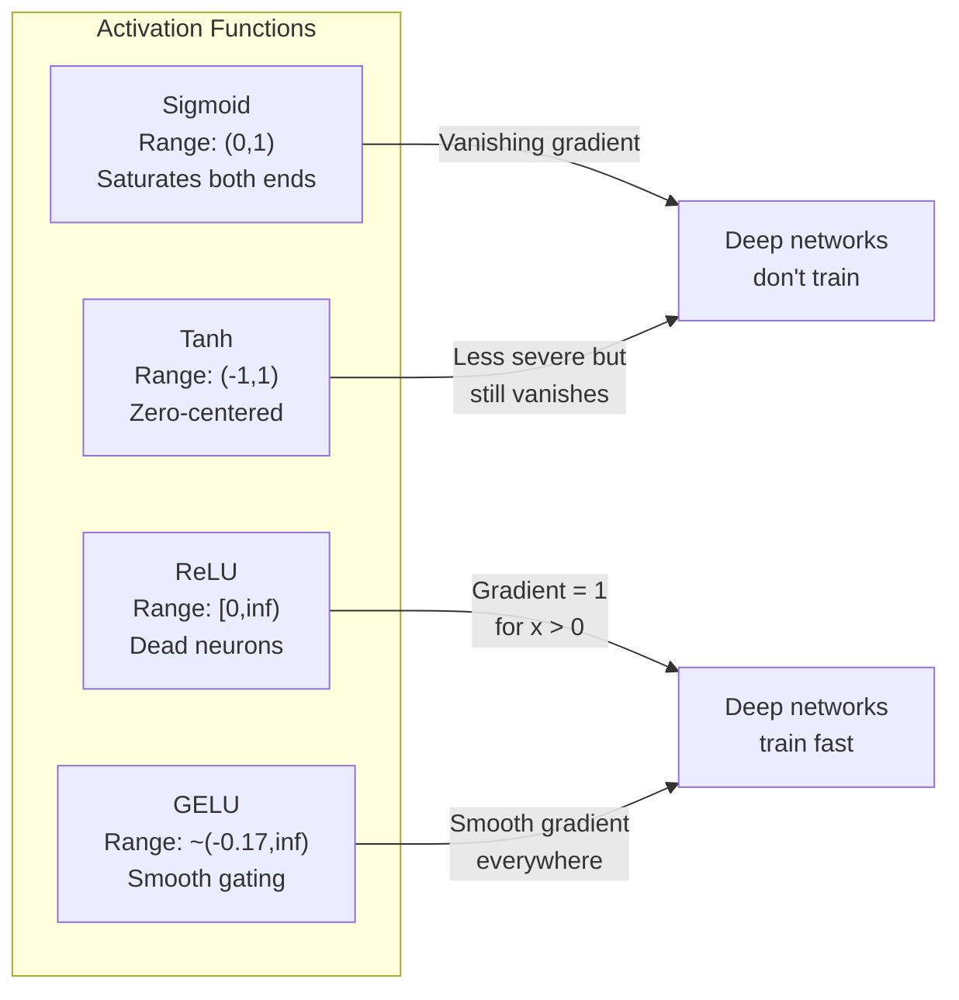
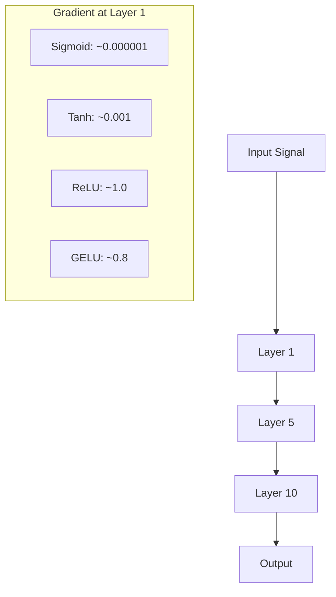
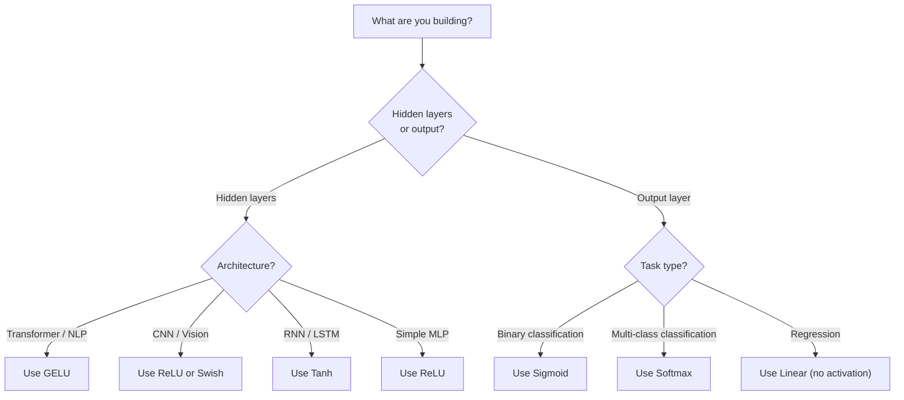

# 激活函数(Activation Functions)

> 没有非线性，你的100层网络只是一个花哨的矩阵乘法。激活函数是让神经网络能够以曲线方式思考的门控。

**类型：** 构建
**语言：** Python
**前置知识：** 第03.03课（反向传播）
**时间：** 约75分钟

## 学习目标

- 从零实现sigmoid、tanh、ReLU、Leaky ReLU、GELU、Swish和softmax及其导数
- 通过测量10层以上不同激活函数的激活幅度，诊断梯度消失问题
- 在ReLU网络中检测死亡神经元，并解释为什么GELU避免了这种失效模式
- 为给定架构（transformer、CNN、RNN、输出层）选择合适的激活函数

## 问题

堆叠两个线性变换：y = W2(W1x + b1) + b2。展开后：y = W2W1x + W2b1 + b2。这其实就是 y = Ax + c —— 一个单一的线性变换。无论堆叠多少线性层，最终都坍缩成一个矩阵乘法。你的100层网络与单层网络具有相同的表示能力。

这不是理论上的奇闻。它意味着深层线性网络根本无法学习XOR，无法分类螺旋数据集，无法识别人脸。没有激活函数，深度就是一种幻觉。

激活函数打破了线性。它们通过非线性函数扭曲每个层的输出，赋予网络弯曲决策边界、逼近任意函数并真正学习的能力。但选择错误的激活函数会导致梯度消失为零（深层网络中的sigmoid）、梯度爆炸到无穷大（未经仔细初始化的无界激活），或者神经元永久死亡（具有大负偏置的ReLU）。激活函数的选择直接决定了你的网络能否学习。

## 核心概念

### 为什么非线线性是必要的

矩阵乘法是可组合的。将向量先乘以矩阵A再乘以矩阵B，等同于乘以AB。这意味着堆叠十个线性层在数学上等效于一个大矩阵的单层线性层。所有这些参数、所有这些深度都白费了。你需要一些东西来打破这个链条。这就是激活函数的作用。

以下是证明。一个线性层计算 f(x) = Wx + b。堆叠两层：

```
Layer 1: h = W1 * x + b1
Layer 2: y = W2 * h + b2
```

代入：

```
y = W2 * (W1 * x + b1) + b2
y = (W2 * W1) * x + (W2 * b1 + b2)
y = A * x + c
```

一层。在层之间插入一个非线性激活函数g()：

```
h = g(W1 * x + b1)
y = W2 * h + b2
```

现在代入不再成立。W2 * g(W1 * x + b1) + b2 无法简化为单一线性变换。网络可以表示非线性函数。每个带有激活函数的额外层都增加了表示能力。

### Sigmoid

神经网络最初的激活函数。

```
sigmoid(x) = 1 / (1 + e^(-x))
```

输出范围：(0, 1)。平滑、可微，将任意实数映射为类似概率的值。

导数：

```
sigmoid'(x) = sigmoid(x) * (1 - sigmoid(x))
```

该导数的最大值是0.25，出现在x=0处。在反向传播中，梯度会逐层相乘。十层sigmoid意味着梯度最多乘以0.25的十次方：

```
0.25^10 = 0.000000953674
```

小于原始信号的百万分之一。这就是梯度消失(Vanishing Gradient)问题。早期层中的梯度变得极小，权重几乎不更新。网络看似在学习——后面层的损失在下降——但前面层被冻结。深层sigmoid网络根本无法训练。

另一个问题：sigmoid输出始终为正（0到1），这意味着权重的梯度总具有相同的符号。这导致梯度下降过程中出现锯齿形振荡。

### Tanh

sigmoid的居中版本。

```
tanh(x) = (e^x - e^(-x)) / (e^x + e^(-x))
```

输出范围：(-1, 1)。零中心化，消除了锯齿问题。

导数：

```
tanh'(x) = 1 - tanh(x)^2
```

最大导数在x=0处为1.0——比sigmoid好四倍。但梯度消失问题依然存在。对于大的正或负输入，导数趋近于零。十层仍然会压垮梯度，只是不那么严重。

### ReLU：突破性进展

线性整流单元(Rectified Linear Unit)。由Nair和Hinton在2010年推广用于深度学习（该函数本身可追溯到Fukushima 1969年的工作），它改变了一切。

```
relu(x) = max(0, x)
```

输出范围：[0, 无穷)。导数非常简单：

```
relu'(x) = 1  if x > 0
            0  if x <= 0
```

对于正输入，没有梯度消失。梯度恰好为1，直接传递。这就是深层网络变得可训练的原因——ReLU跨层保持梯度大小。

但存在一种失效模式：死亡神经元(Dead Neuron)问题。如果一个神经元的加权输入始终为负（由于大的负偏置或不幸的权重初始化），它的输出始终为零，梯度始终为零，并且永远不会更新。它永久死亡。在实践中，ReLU网络中10-40%的神经元可能在训练过程中死亡。

### Leaky ReLU

解决死亡神经元最直接的方法。

```
leaky_relu(x) = x        if x > 0
                alpha * x if x <= 0
```

其中alpha是一个小常数，通常为0.01。负侧有一个小斜率而非零，因此死亡神经元仍能获得梯度信号并得以恢复。

### GELU：现代默认激活函数

高斯误差线性单元(Gaussian Error Linear Unit)。由Hendrycks和Gimpel于2016年提出。是BERT、GPT及大多数现代Transformer中的默认激活函数。

```
gelu(x) = x * Phi(x)
```

其中Phi(x)是标准正态分布的累积分布函数。实际中使用的近似形式为：

```
gelu(x) ~= 0.5 * x * (1 + tanh(sqrt(2/pi) * (x + 0.044715 * x^3)))
```

GELU处处光滑，允许小的负值（不同于ReLU硬截断为零），且具有概率解释：它根据输入在高斯分布下为正的可能性来加权每个输入。这种平滑门控机制在Transformer架构中优于ReLU，因为它提供了更好的梯度流，并完全避免了死亡神经元问题。

### Swish / SiLU

自门控激活函数，由Ramachandran等人于2017年通过自动化搜索发现。

```
swish(x) = x * sigmoid(x)
```

Swish的形式为x * sigmoid(x)。Google通过在激活函数空间上进行自动化搜索发现——即神经网络设计神经网络的组成部分。

与GELU类似，Swish光滑、非单调，并允许小的负值。区别微妙：Swish使用sigmoid进行门控，而GELU使用高斯CDF。实际中性能几乎相同。Swish用于EfficientNet和一些视觉模型，GELU主导语言模型。

### Softmax：输出激活函数

不在隐藏层中使用。Softmax将原始分数(logits)向量转换为概率分布。

```
softmax(x_i) = e^(x_i) / sum(e^(x_j) for all j)
```

每个输出介于0和1之间。所有输出之和为1。这使其成为多分类问题的标准最终激活函数。最大的logit获得最高概率，但与argmax不同，softmax可微且保留了相对置信度的信息。

### 形状比较



### 梯度流比较



### 何时选用哪种激活函数



```figure
softmax-temperature
```

## 动手构建

### 步骤1：实现所有激活函数及其导数

每个函数接受一个浮点数并返回一个浮点数。每个导数函数接受相同输入并返回梯度。

```python
import math

def sigmoid(x):
    x = max(-500, min(500, x))
    return 1.0 / (1.0 + math.exp(-x))

def sigmoid_derivative(x):
    s = sigmoid(x)
    return s * (1 - s)

def tanh_act(x):
    return math.tanh(x)

def tanh_derivative(x):
    t = math.tanh(x)
    return 1 - t * t

def relu(x):
    return max(0.0, x)

def relu_derivative(x):
    return 1.0 if x > 0 else 0.0

def leaky_relu(x, alpha=0.01):
    return x if x > 0 else alpha * x

def leaky_relu_derivative(x, alpha=0.01):
    return 1.0 if x > 0 else alpha

def gelu(x):
    return 0.5 * x * (1 + math.tanh(math.sqrt(2 / math.pi) * (x + 0.044715 * x ** 3)))

def gelu_derivative(x):
    phi = 0.5 * (1 + math.erf(x / math.sqrt(2)))
    pdf = math.exp(-0.5 * x * x) / math.sqrt(2 * math.pi)
    return phi + x * pdf

def swish(x):
    return x * sigmoid(x)

def swish_derivative(x):
    s = sigmoid(x)
    return s + x * s * (1 - s)

def softmax(xs):
    max_x = max(xs)
    exps = [math.exp(x - max_x) for x in xs]
    total = sum(exps)
    return [e / total for e in exps]
```

### 步骤2：可视化梯度消失的位置

在-5到5之间均匀取100个点计算梯度。打印文本直方图，显示每个激活函数的梯度在哪些区域接近零。

```python
def gradient_scan(name, derivative_fn, start=-5, end=5, n=100):
    step = (end - start) / n
    near_zero = 0
    healthy = 0
    for i in range(n):
        x = start + i * step
        g = derivative_fn(x)
        if abs(g) < 0.01:
            near_zero += 1
        else:
            healthy += 1
    pct_dead = near_zero / n * 100
    print(f"{name:15s}: {healthy:3d} healthy, {near_zero:3d} near-zero ({pct_dead:.0f}% dead zone)")

gradient_scan("Sigmoid", sigmoid_derivative)
gradient_scan("Tanh", tanh_derivative)
gradient_scan("ReLU", relu_derivative)
gradient_scan("Leaky ReLU", leaky_relu_derivative)
gradient_scan("GELU", gelu_derivative)
gradient_scan("Swish", swish_derivative)
```

### 步骤3：梯度消失实验

使用sigmoid与ReLU分别通过N层前向传播信号，测量激活幅值的变化。

```python
import random

def vanishing_gradient_experiment(activation_fn, name, n_layers=10, n_inputs=5):
    random.seed(42)
    values = [random.gauss(0, 1) for _ in range(n_inputs)]

    print(f"\n{name} through {n_layers} layers:")
    for layer in range(n_layers):
        weights = [random.gauss(0, 1) for _ in range(n_inputs)]
        z = sum(w * v for w, v in zip(weights, values))
        activated = activation_fn(z)
        magnitude = abs(activated)
        bar = "#" * int(magnitude * 20)
        print(f"  Layer {layer+1:2d}: magnitude = {magnitude:.6f} {bar}")
        values = [activated] * n_inputs

vanishing_gradient_experiment(sigmoid, "Sigmoid")
vanishing_gradient_experiment(relu, "ReLU")
vanishing_gradient_experiment(gelu, "GELU")
```

### 步骤4：死亡神经元检测器

创建一个ReLU网络，传入随机输入，统计从未激活的神经元数量。

```python
def dead_neuron_detector(n_inputs=5, hidden_size=20, n_samples=1000):
    random.seed(0)
    weights = [[random.gauss(0, 1) for _ in range(n_inputs)] for _ in range(hidden_size)]
    biases = [random.gauss(0, 1) for _ in range(hidden_size)]

    fire_counts = [0] * hidden_size

    for _ in range(n_samples):
        inputs = [random.gauss(0, 1) for _ in range(n_inputs)]
        for neuron_idx in range(hidden_size):
            z = sum(w * x for w, x in zip(weights[neuron_idx], inputs)) + biases[neuron_idx]
            if relu(z) > 0:
                fire_counts[neuron_idx] += 1

    dead = sum(1 for c in fire_counts if c == 0)
    rarely_fire = sum(1 for c in fire_counts if 0 < c < n_samples * 0.05)
    healthy = hidden_size - dead - rarely_fire

    print(f"\nDead Neuron Report ({hidden_size} neurons, {n_samples} samples):")
    print(f"  Dead (never fired):     {dead}")
    print(f"  Barely alive (<5%):     {rarely_fire}")
    print(f"  Healthy:                {healthy}")
    print(f"  Dead neuron rate:       {dead/hidden_size*100:.1f}%")

    for i, c in enumerate(fire_counts):
        status = "DEAD" if c == 0 else "WEAK" if c < n_samples * 0.05 else "OK"
        bar = "#" * (c * 40 // n_samples)
        print(f"  Neuron {i:2d}: {c:4d}/{n_samples} fires [{status:4s}] {bar}")

dead_neuron_detector()
```

### 步骤5：训练对比——Sigmoid vs ReLU vs GELU

在圆形数据集（圆内点=类别1，圆外=类别0）上使用三种不同激活函数训练相同的两层网络，比较收敛速度。

```python
def make_circle_data(n=200, seed=42):
    random.seed(seed)
    data = []
    for _ in range(n):
        x = random.uniform(-2, 2)
        y = random.uniform(-2, 2)
        label = 1.0 if x * x + y * y < 1.5 else 0.0
        data.append(([x, y], label))
    return data


class ActivationNetwork:
    def __init__(self, activation_fn, activation_deriv, hidden_size=8, lr=0.1):
        random.seed(0)
        self.act = activation_fn
        self.act_d = activation_deriv
        self.lr = lr
        self.hidden_size = hidden_size

        self.w1 = [[random.gauss(0, 0.5) for _ in range(2)] for _ in range(hidden_size)]
        self.b1 = [0.0] * hidden_size
        self.w2 = [random.gauss(0, 0.5) for _ in range(hidden_size)]
        self.b2 = 0.0

    def forward(self, x):
        self.x = x
        self.z1 = []
        self.h = []
        for i in range(self.hidden_size):
            z = self.w1[i][0] * x[0] + self.w1[i][1] * x[1] + self.b1[i]
            self.z1.append(z)
            self.h.append(self.act(z))

        self.z2 = sum(self.w2[i] * self.h[i] for i in range(self.hidden_size)) + self.b2
        self.out = sigmoid(self.z2)
        return self.out

    def backward(self, target):
        error = self.out - target
        d_out = error * self.out * (1 - self.out)

        for i in range(self.hidden_size):
            d_h = d_out * self.w2[i] * self.act_d(self.z1[i])
            self.w2[i] -= self.lr * d_out * self.h[i]
            for j in range(2):
                self.w1[i][j] -= self.lr * d_h * self.x[j]
            self.b1[i] -= self.lr * d_h
        self.b2 -= self.lr * d_out

    def train(self, data, epochs=200):
        losses = []
        for epoch in range(epochs):
            total_loss = 0
            correct = 0
            for x, y in data:
                pred = self.forward(x)
                self.backward(y)
                total_loss += (pred - y) ** 2
                if (pred >= 0.5) == (y >= 0.5):
                    correct += 1
            avg_loss = total_loss / len(data)
            accuracy = correct / len(data) * 100
            losses.append(avg_loss)
            if epoch % 50 == 0 or epoch == epochs - 1:
                print(f"    Epoch {epoch:3d}: loss={avg_loss:.4f}, accuracy={accuracy:.1f}%")
        return losses


data = make_circle_data()

configs = [
    ("Sigmoid", sigmoid, sigmoid_derivative),
    ("ReLU", relu, relu_derivative),
    ("GELU", gelu, gelu_derivative),
]

results = {}
for name, act_fn, act_d_fn in configs:
    print(f"\n=== Training with {name} ===")
    net = ActivationNetwork(act_fn, act_d_fn, hidden_size=8, lr=0.1)
    losses = net.train(data, epochs=200)
    results[name] = losses

print("\n=== Final Loss Comparison ===")
for name, losses in results.items():
    print(f"  {name:10s}: start={losses[0]:.4f} -> end={losses[-1]:.4f} (improvement: {(1 - losses[-1]/losses[0])*100:.1f}%)")
```

## 使用它

PyTorch以函数形式和模块形式提供了所有这些激活函数：

```python
import torch
import torch.nn as nn
import torch.nn.functional as F

x = torch.randn(4, 10)

relu_out = F.relu(x)
gelu_out = F.gelu(x)
sigmoid_out = torch.sigmoid(x)
swish_out = F.silu(x)

logits = torch.randn(4, 5)
probs = F.softmax(logits, dim=1)

model = nn.Sequential(
    nn.Linear(10, 64),
    nn.GELU(),
    nn.Linear(64, 32),
    nn.GELU(),
    nn.Linear(32, 5),
)
```

Transformer中的隐藏层：GELU。CNN中的隐藏层：ReLU。分类输出层：softmax。回归输出层：无（线性）。概率输出层：sigmoid。就这样。从这些默认值开始，仅在你有证据时更改。

RNN和LSTM在隐藏状态中使用tanh，在门控中使用sigmoid，但如果你今天从头构建，你可能不会使用RNN。如果你的ReLU网络中神经元死亡，切换到GELU。除非有特定原因，否则不要选择Leaky ReLU——GELU解决了死亡神经元问题并提供了更好的梯度流。

## 发布

本課(lesson)产出：
- `outputs/prompt-activation-selector.md` —— 一个可复用的提示，帮助您为任何架构选择合适的激活函数

## 练习

1. 实现参数化ReLU (Parametric ReLU, PReLU)，其中负斜率alpha是一个可学习参数。在圆形数据集上训练它，并与固定参数的Leaky ReLU进行比较。

2. 运行50层（而非10层）的梯度消失实验。绘制sigmoid、tanh、ReLU和GELU在每个层的梯度幅度。每种激活函数的信号在哪个层有效归零？

3. 实现ELU (Exponential Linear Unit, 指数线性单元)：elu(x) = x（如果x > 0），alpha * (e^x - 1)（如果x <= 0）。在相同网络上比较其死亡神经元率与ReLU。

4. 构建一个在训练期间运行的“梯度健康监视器”：在每个epoch，计算每个层的平均梯度幅度。当任何层的梯度低于0.001或超过100时打印警告。

5. 修改训练比较以使用第01课的XOR数据集而非圆形数据集。哪种激活函数在XOR上收敛最快？为什么这与圆形数据集的结果不同？

## 关键术语

|  术语  |  人们的说法  |  实际含义  |
|------|----------------|----------------------|
|  激活函数  |  "非线性部分"  |  应用于每个神经元输出的函数，打破线性性，使网络能够学习非线性映射  |
|  梯度消失  |  "梯度在深层网络中消失"  |  当激活函数的导数小于1时，梯度随层数指数级缩小，使得早期层无法训练  |
|  梯度爆炸  |  "梯度爆发"  |  当有效乘数超过1时，梯度随层数指数级增长，导致训练不稳定  |
|  死亡神经元  |  "停止学习的神经元"  |  输入永久为负的ReLU神经元，输出零且梯度为零  |
|  Sigmoid  |  "将数值压缩到0-1"  |  逻辑函数1/(1+e^-x)，历史上很重要但会导致深层网络中的梯度消失  |
|  ReLU  |  "将负数截断为零"  |  max(0, x) —— 通过保持梯度幅度使深度学习变得实用的激活函数  |
|  GELU  |  "Transformer激活函数"  |  高斯误差线性单元(Gaussian Error Linear Unit)，一种平滑激活函数，根据输入为正的概率加权  |
|  Swish/SiLU  |  "自门控ReLU"  |  x * sigmoid(x)，通过自动搜索发现，用于EfficientNet  |
|  Softmax  |  "将分数转为概率"  |  将logits向量归一化为概率分布，其中所有值在(0,1)内且总和为1  |
|  Leaky ReLU  |  "不会死亡的ReLU"  |  max(alpha*x, x)，其中alpha很小（0.01），通过允许小的负梯度防止死亡神经元  |
|  饱和  |  "sigmoid的平坦部分"  |  激活函数导数接近零的区域，阻碍梯度流动  |
|  Logit  |  "softmax之前的原始得分"  |  应用softmax或sigmoid之前最终层的未归一化输出  |

## 延伸阅读

- Nair & Hinton, "Rectified Linear Units Improve Restricted Boltzmann Machines" (2010) —— 引入ReLU并使得深层网络训练成为可能的论文
- Hendrycks & Gimpel, "Gaussian Error Linear Units (GELUs)" (2016) —— 引入了成为Transformer默认激活函数的GELU
- Ramachandran et al., "Searching for Activation Functions" (2017) —— 使用自动搜索发现Swish，表明激活函数设计可以自动化
- Glorot & Bengio, "Understanding the difficulty of training deep feedforward neural networks" (2010) —— 诊断了梯度消失/爆炸并提出Xavier初始化的论文
- Goodfellow, Bengio, Courville, "Deep Learning" 第6.3章 (https://www.deeplearningbook.org/) —— 对隐藏单元和激活函数的严谨处理
