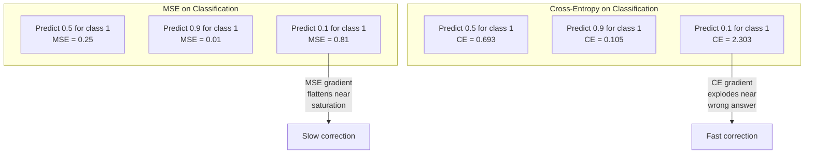
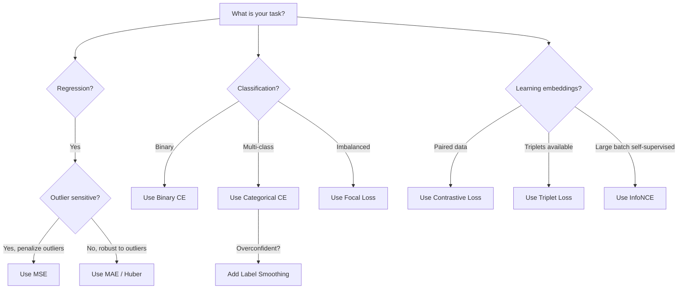
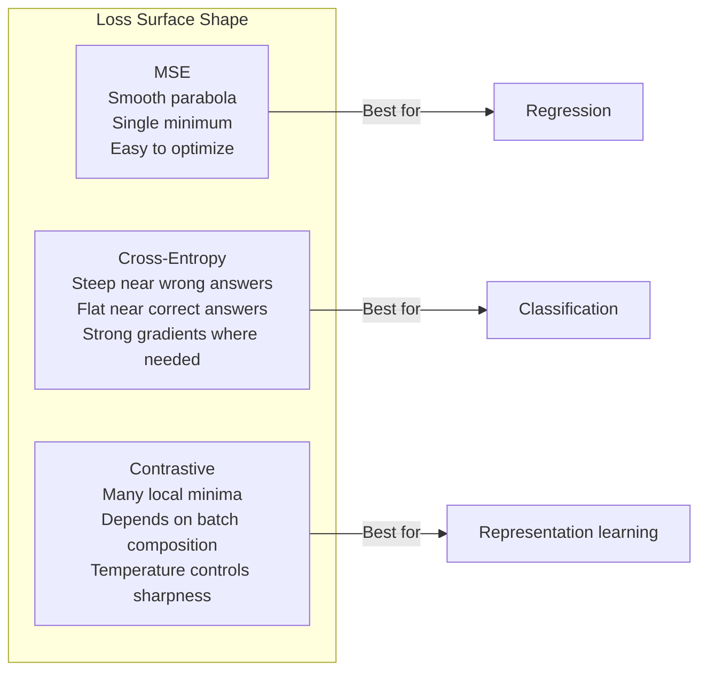

# 损失函数 (Loss Functions)

> 你的网络做出一个预测，而真实情况并非如此。它错得有多离谱？这个数值就是损失。选错了损失函数，你的模型就会完全优化错目标。

**类型：** 构建
**语言：** Python
**前置要求：** 第03.04课（激活函数）
**时长：** 约75分钟

## 学习目标

- 从零实现均方误差、二分类交叉熵、多分类交叉熵和对比损失（InfoNCE）及其梯度
- 通过展示“对所有输入预测0.5”的失败模式，解释为什么均方误差不适合分类
- 为交叉熵应用标签平滑，并描述它如何防止过度自信的预测
- 为回归、二分类、多分类和嵌入学习任务选择正确的损失函数

## 问题

一个在分类问题上最小化均方误差的模型会自信地对所有输入预测0.5。它在最小化损失，但它毫无用处。

损失函数是模型唯一真正优化的东西。不是准确率，不是F1分数，也不是你向经理汇报的任何指标。优化器会计算损失函数的梯度，并调整权重使这个数值更小。如果损失函数没有捕捉到你关心的东西，模型就会找到数学上最便宜的方式来满足它，而这种方式几乎永远不会是你想要的。

这里有一个具体例子。你有一个二分类任务，两个类别各占50%。你使用均方误差作为损失函数。模型对每个输入都预测0.5。平均均方误差为0.25，这是在完全没有学到任何东西的情况下的最小可能值。模型没有任何判别能力，但它从技术上最小化了你的损失函数。换成交叉熵，同样的模型被迫将预测推向0或1，因为-log(0.5)=0.693是一个糟糕的损失，而-log(0.99)=0.01则奖励了正确的自信预测。损失函数的选择决定了模型是真正在学习，还是在钻指标的空子。

更糟的是，在自监督学习中，你甚至没有标签。对比损失完全定义了学习信号：什么算相似，什么算不同，以及模型应该将它们推开多远。如果对比损失设置错误，你的嵌入会塌缩成一个点——每个输入都映射到同一个向量。技术上说损失为零，但完全没用。

## 核心概念

### 均方误差 (Mean Squared Error, MSE)

回归任务的默认选择。计算预测值与目标值之间差值的平方，然后对所有样本取平均。

```
MSE = (1/n) * sum((y_pred - y_true)^2)
```

为什么平方很重要：它按二次方式惩罚大误差。误差为2的代价是误差为1的4倍。误差为10的代价是100倍。这使得均方误差对异常值非常敏感——一个严重错误的预测会主导损失。

真实例子：如果你的模型预测房价，对一栋豪宅偏差了$10,000 on most houses but off by $200,000美元，均方误差会激进地试图修正那栋豪宅，可能反而损害其他99栋房子的预测性能。

均方误差对预测的梯度是：

```
dMSE/dy_pred = (2/n) * (y_pred - y_true)
```

梯度与误差成线性关系。误差越大，梯度越大。这对回归来说是优点（大误差需要大修正），对分类则是缺点（你希望以指数级，而非线性级惩罚自信的错误答案）。

### 交叉熵损失 (Cross-Entropy Loss)

分类任务的损失函数。根植于信息论——它衡量预测概率分布与真实分布之间的散度。

**二分类交叉熵 (Binary Cross-Entropy, BCE)：**

```
BCE = -(y * log(p) + (1 - y) * log(1 - p))
```

其中 y 是真实标签（0 或 1），p 是预测概率。

为什么 -log(p) 有效：当真实标签为1且你预测 p=0.99 时，损失为 -log(0.99)=0.01。当你预测 p=0.01 时，损失为 -log(0.01)=4.6。这460倍的差距就是交叉熵有效的原因。它严厉惩罚自信的错误预测，而对自信的正确预测几乎不惩罚。

梯度也反映了同样的道理：

```
dBCE/dp = -(y/p) + (1-y)/(1-p)
```

当 y=1 且 p 接近0时，梯度为 -1/p，趋近于负无穷。模型得到巨大的信号来修正错误。当 p 接近1时，梯度非常小。已经正确，无需修正。

**多分类交叉熵 (Categorical Cross-Entropy)：**

用于多分类任务，目标采用独热编码。

```
CCE = -sum(y_i * log(p_i))
```

只有真实类别对损失有贡献（因为其他所有 y_i 都是0）。如果有10个类别，正确类别得到的概率为0.1（随机猜测），损失为 -log(0.1)=2.3。如果正确类别的概率为0.9，损失为 -log(0.9)=0.105。模型学会了将概率质量集中在正确回答上。

### 为什么均方误差不适合分类



当预测接近0或1时，均方误差的梯度变得平坦（由于sigmoid饱和）。交叉熵的梯度和这种效应相反——-log抵消了sigmoid的平坦区域，在最需要的地方提供了强梯度。

### 标签平滑 (Label Smoothing)

标准的独热标签说“这是100%类别3，其他类别0%”。这是一个强烈的说法。标签平滑将其软化：

```
smooth_label = (1 - alpha) * one_hot + alpha / num_classes
```

以 alpha=0.1 和10个类别为例：目标从 [0, 0, 1, 0, ...] 变为 [0.01, 0.01, 0.91, 0.01, ...]。模型的目标是0.91而不是1.0。

为什么有效：模型试图通过softmax输出精确的1.0，需要将logit推向无穷大。这会导致过度自信、损害泛化能力，并使模型对分布变化脆弱。标签平滑将目标限制在0.9（当alpha=0.1时），使logit保持在合理范围内。GPT和大多数现代模型都使用标签平滑或其等价形式。

### 对比损失(Contrastive Loss)

无标签。无类别。只有成对的输入和问题：它们相似还是不同？

**SimCLR风格的对比损失（NT-Xent / InfoNCE）：**

取一张图像。创建它的两个增强视图（裁剪、旋转、颜色抖动）。这些是“正样本对”——它们应该具有相似的嵌入向量。批次中的其他所有图像构成“负样本对”——它们应该具有不同的嵌入向量。

```
L = -log(exp(sim(z_i, z_j) / tau) / sum(exp(sim(z_i, z_k) / tau)))
```

其中sim()是余弦相似度，z_i和z_j是正样本对，求和是对所有负样本，tau（温度系数）控制分布的尖锐程度。温度越低=负样本越难=分离越激进。

实际数字：批次大小256意味着每个正样本对有255个负样本。温度系数tau=0.07（SimCLR默认值）。该损失看起来是对相似度的softmax——它希望正样本对的相似度在256个选项中最高。

**三元组损失(Triplet Loss)：**

接受三个输入：锚点(anchor)、正样本(positive)（同类）、负样本(negative)（不同类）。

```
L = max(0, d(anchor, positive) - d(anchor, negative) + margin)
```

边距(margin)（通常为0.2-1.0）强制正负样本距离之间的最小差距。如果负样本已经足够远，损失为零——无梯度，无更新。这使得训练高效，但需要谨慎的三元组挖掘(triplet mining)（选择靠近锚点的困难负样本）。

### 焦点损失(Focal Loss)

用于不平衡数据集。标准交叉熵(Cross-Entropy)平等对待所有正确分类的样本。焦点损失降低简单样本的权重：

```
FL = -alpha * (1 - p_t)^gamma * log(p_t)
```

其中p_t是真实类别的预测概率，gamma控制聚焦程度。当gamma=0时，这是标准交叉熵。当gamma=2（默认值）时：

- 简单样本（p_t=0.9）：权重=(0.1)^2=0.01。有效忽略。
- 困难样本（p_t=0.1）：权重=(0.9)^2=0.81。全梯度信号。

焦点损失由Lin等人提出，用于目标检测，其中99%的候选区域是背景（简单负样本）。没有焦点损失，模型会被简单背景样本淹没，永远学不会检测目标。有了它，模型将能力集中在重要的困难、模糊案例上。

### 损失函数决策树(Loss Function Decision Tree)



### 损失景观(Loss Landscape)



```figure
cross-entropy-loss
```

## 动手构建

### 第1步：均方误差(MSE)及其梯度

```python
def mse(predictions, targets):
    n = len(predictions)
    total = 0.0
    for p, t in zip(predictions, targets):
        total += (p - t) ** 2
    return total / n

def mse_gradient(predictions, targets):
    n = len(predictions)
    grads = []
    for p, t in zip(predictions, targets):
        grads.append(2.0 * (p - t) / n)
    return grads
```

### 第2步：二元交叉熵(Binary Cross-Entropy)

log(0)问题是真实存在的。如果模型对正样本预测为0，log(0)=负无穷。裁剪(Clipping)可以防止这种情况。

```python
import math

def binary_cross_entropy(predictions, targets, eps=1e-15):
    n = len(predictions)
    total = 0.0
    for p, t in zip(predictions, targets):
        p_clipped = max(eps, min(1 - eps, p))
        total += -(t * math.log(p_clipped) + (1 - t) * math.log(1 - p_clipped))
    return total / n

def bce_gradient(predictions, targets, eps=1e-15):
    grads = []
    for p, t in zip(predictions, targets):
        p_clipped = max(eps, min(1 - eps, p))
        grads.append(-(t / p_clipped) + (1 - t) / (1 - p_clipped))
    return grads
```

### 第3步：分类交叉熵(Categorical Cross-Entropy)与Softmax

Softmax将原始对数(logits)转换为概率。然后我们针对独热(one-hot)目标计算交叉熵。

```python
def softmax(logits):
    max_val = max(logits)
    exps = [math.exp(x - max_val) for x in logits]
    total = sum(exps)
    return [e / total for e in exps]

def categorical_cross_entropy(logits, target_index, eps=1e-15):
    probs = softmax(logits)
    p = max(eps, probs[target_index])
    return -math.log(p)

def cce_gradient(logits, target_index):
    probs = softmax(logits)
    grads = list(probs)
    grads[target_index] -= 1.0
    return grads
```

softmax+交叉熵的梯度简化为：真实类别为（预测概率-1），其他类别为（预测概率）。这种优雅的简化并非巧合——这就是为什么softmax和交叉熵配对使用。

### 第4步：标签平滑(Label Smoothing)

```python
def label_smoothed_cce(logits, target_index, num_classes, alpha=0.1, eps=1e-15):
    probs = softmax(logits)
    loss = 0.0
    for i in range(num_classes):
        if i == target_index:
            smooth_target = 1.0 - alpha + alpha / num_classes
        else:
            smooth_target = alpha / num_classes
        p = max(eps, probs[i])
        loss += -smooth_target * math.log(p)
    return loss
```

### 第5步：对比损失（简化InfoNCE）

```python
def cosine_similarity(a, b):
    dot = sum(x * y for x, y in zip(a, b))
    norm_a = math.sqrt(sum(x * x for x in a))
    norm_b = math.sqrt(sum(x * x for x in b))
    if norm_a < 1e-10 or norm_b < 1e-10:
        return 0.0
    return dot / (norm_a * norm_b)

def contrastive_loss(anchor, positive, negatives, temperature=0.07):
    sim_pos = cosine_similarity(anchor, positive) / temperature
    sim_negs = [cosine_similarity(anchor, neg) / temperature for neg in negatives]

    max_sim = max(sim_pos, max(sim_negs)) if sim_negs else sim_pos
    exp_pos = math.exp(sim_pos - max_sim)
    exp_negs = [math.exp(s - max_sim) for s in sim_negs]
    total_exp = exp_pos + sum(exp_negs)

    return -math.log(max(1e-15, exp_pos / total_exp))
```

### 第6步：分类中的MSE与交叉熵对比

使用两种损失函数训练来自第04课（圆形数据集）的相同网络。观察交叉熵收敛更快。

```python
import random

def sigmoid(x):
    x = max(-500, min(500, x))
    return 1.0 / (1.0 + math.exp(-x))

def make_circle_data(n=200, seed=42):
    random.seed(seed)
    data = []
    for _ in range(n):
        x = random.uniform(-2, 2)
        y = random.uniform(-2, 2)
        label = 1.0 if x * x + y * y < 1.5 else 0.0
        data.append(([x, y], label))
    return data


class LossComparisonNetwork:
    def __init__(self, loss_type="bce", hidden_size=8, lr=0.1):
        random.seed(0)
        self.loss_type = loss_type
        self.lr = lr
        self.hidden_size = hidden_size

        self.w1 = [[random.gauss(0, 0.5) for _ in range(2)] for _ in range(hidden_size)]
        self.b1 = [0.0] * hidden_size
        self.w2 = [random.gauss(0, 0.5) for _ in range(hidden_size)]
        self.b2 = 0.0

    def forward(self, x):
        self.x = x
        self.z1 = []
        self.h = []
        for i in range(self.hidden_size):
            z = self.w1[i][0] * x[0] + self.w1[i][1] * x[1] + self.b1[i]
            self.z1.append(z)
            self.h.append(max(0.0, z))

        self.z2 = sum(self.w2[i] * self.h[i] for i in range(self.hidden_size)) + self.b2
        self.out = sigmoid(self.z2)
        return self.out

    def backward(self, target):
        if self.loss_type == "mse":
            d_loss = 2.0 * (self.out - target)
        else:
            eps = 1e-15
            p = max(eps, min(1 - eps, self.out))
            d_loss = -(target / p) + (1 - target) / (1 - p)

        d_sigmoid = self.out * (1 - self.out)
        d_out = d_loss * d_sigmoid

        for i in range(self.hidden_size):
            d_relu = 1.0 if self.z1[i] > 0 else 0.0
            d_h = d_out * self.w2[i] * d_relu
            self.w2[i] -= self.lr * d_out * self.h[i]
            for j in range(2):
                self.w1[i][j] -= self.lr * d_h * self.x[j]
            self.b1[i] -= self.lr * d_h
        self.b2 -= self.lr * d_out

    def compute_loss(self, pred, target):
        if self.loss_type == "mse":
            return (pred - target) ** 2
        else:
            eps = 1e-15
            p = max(eps, min(1 - eps, pred))
            return -(target * math.log(p) + (1 - target) * math.log(1 - p))

    def train(self, data, epochs=200):
        losses = []
        for epoch in range(epochs):
            total_loss = 0.0
            correct = 0
            for x, y in data:
                pred = self.forward(x)
                self.backward(y)
                total_loss += self.compute_loss(pred, y)
                if (pred >= 0.5) == (y >= 0.5):
                    correct += 1
            avg_loss = total_loss / len(data)
            accuracy = correct / len(data) * 100
            losses.append((avg_loss, accuracy))
            if epoch % 50 == 0 or epoch == epochs - 1:
                print(f"    Epoch {epoch:3d}: loss={avg_loss:.4f}, accuracy={accuracy:.1f}%")
        return losses
```

## 使用它

PyTorch提供了所有内置数值稳定性的标准损失函数：

```python
import torch
import torch.nn as nn
import torch.nn.functional as F

predictions = torch.tensor([0.9, 0.1, 0.7], requires_grad=True)
targets = torch.tensor([1.0, 0.0, 1.0])

mse_loss = F.mse_loss(predictions, targets)
bce_loss = F.binary_cross_entropy(predictions, targets)

logits = torch.randn(4, 10)
labels = torch.tensor([3, 7, 1, 9])
ce_loss = F.cross_entropy(logits, labels)
ce_smooth = F.cross_entropy(logits, labels, label_smoothing=0.1)
```

使用`F.cross_entropy`（而不是`F.nll_loss`加手动softmax）。它将log-softmax和负对数似然(Negative Log-Likelihood)结合在一次数值稳定的操作中。分开应用softmax再取对数稳定性较差——你会在减去大指数时损失精度。

对于对比学习，大多数团队使用自定义实现或像`lightly`或`pytorch-metric-learning`这样的库。核心循环始终相同：计算成对相似度，对正负样本创建softmax，反向传播。

## 发布

本課(lesson)产出：
- `outputs/prompt-loss-function-selector.md` -- 用于选择正确损失函数的可复用提示
- `outputs/prompt-loss-function-selector.md` -- 用于损失曲线异常时的诊断提示

## 练习

1. 实现Huber损失（平滑L1损失），对于小误差表现为MSE，对于大误差表现为MAE。在5%的训练目标添加随机噪声（异常值）的情况下，使用MSE与Huber训练一个预测y=sin(x)的回归网络。比较最终的测试误差。

2. 将focal loss添加到二分类训练循环中。创建一个不平衡的数据集（90%类别0，10%类别1）。在200个epoch后比较标准BCE与focal loss（gamma=2）对少数类别召回率的影响。

3. 实现带半困难负样本挖掘的三元组损失(triplet loss)。生成5个类别的2D嵌入数据。对每个锚点(anchor)，找到比正样本(positive)更远的最困难负样本(半困难)。与随机三元组选择对比收敛性。

4. 运行MSE与交叉熵(cross-entropy)的比较，但在训练中追踪每一层的梯度大小。绘制每个epoch的平均梯度范数。验证在模型最不确定的早期epoch，交叉熵是否产生更大的梯度。

5. 实现KL散度(KL divergence)损失，并验证当真实分布为独热编码时，最小化KL(true || predicted)给出的梯度与交叉熵相同。然后尝试软目标（如知识蒸馏），其中“真实”分布来自教师模型的softmax输出。

## 关键术语

|  术语  |  人们的说法  |  实际含义  |
|------|----------------|----------------------|
| 损失函数(Loss function)  |  “模型有多错误”  |  一个可微函数，将预测值和目标值映射为一个标量，优化器最小化该标量 |
| MSE  |  “平均平方误差”  |  预测值与目标值之间平方差的均值；二次惩罚大误差 |
| 交叉熵(Cross-entropy)  |  “分类损失”  |  使用 -log(p) 衡量预测概率分布与真实分布之间的散度 |
| 二值交叉熵(Binary cross-entropy)  |  “BCE”  |  二类交叉熵：-(y*log(p) + (1-y)*log(1-p)) |
| 标签平滑(Label smoothing)  |  “软化目标”  |  将硬0/1目标替换为软值（例如0.1/0.9）以防止过度自信并改善泛化 |
| 对比损失(Contrastive loss)  |  “拉近相似，推远不同”  |  通过使相似对靠近、不相似对远离嵌入空间来学习表示的一种损失 |
| InfoNCE  |  “CLIP/SimCLR损失”  |  在相似度分数上归一化温度缩放的交叉熵；将对比学习视为分类 |
| Focal loss  |  “不平衡数据修正”  |  由 (1-p_t)^gamma 加权的交叉熵，以降低简单样本权重并聚焦困难样本 |
| 三元组损失(Triplet loss)  |  “锚点-正样本-负样本”  |  在嵌入空间中将锚点推得比负样本更靠近正样本，至少相差一个间隔(margin) |
| 温度(Temperature)  |  “尖锐度旋钮”  |  作用于logits/相似度的标量除数，控制结果分布的尖锐程度；值越小越尖锐 |

## 延伸阅读

- Lin等人，《Focal Loss for Dense Object Detection》(2017)——引入focal loss以处理目标检测(RetinaNet)中的极端类别不平衡
- Chen等人，《A Simple Framework for Contrastive Learning of Visual Representations》(SimCLR, 2020)——定义了使用NT-Xent损失的现代对比学习流程
- Szegedy等人，《Rethinking the Inception Architecture》(2016)——引入标签平滑(label smoothing)作为正则化技术，现已成为大多数大模型的标准
- Hinton等人，《Distilling the Knowledge in a Neural Network》(2015)——使用软目标(soft targets)和KL散度的知识蒸馏，是模型压缩的基础
