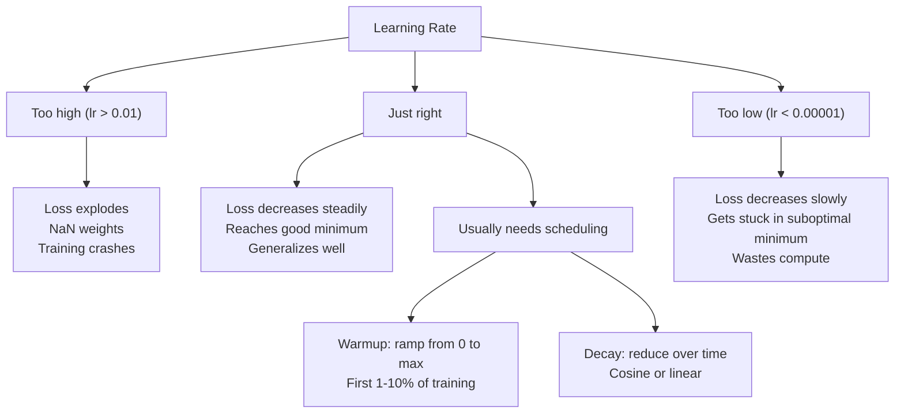
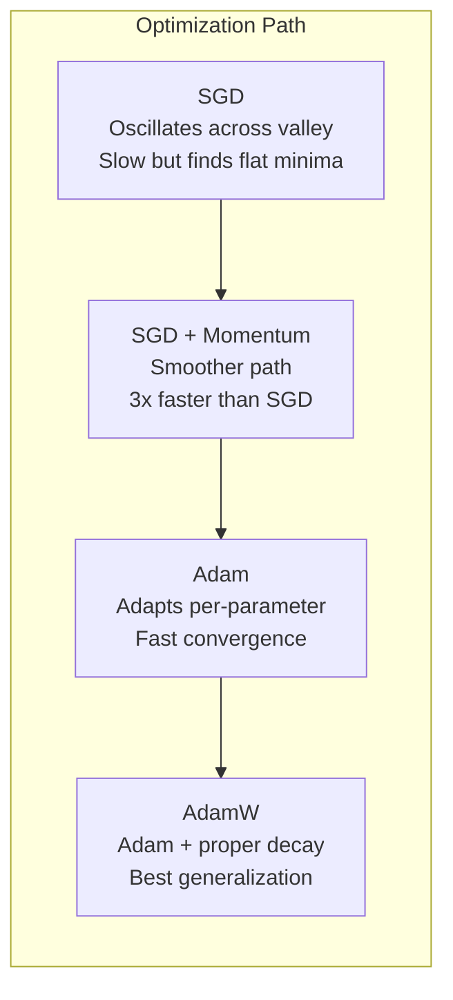
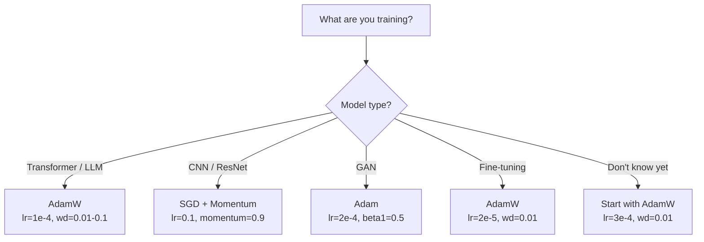

# 优化器

> 梯度下降告诉你移动的方向。它绝口不提走多远、多快。SGD是指南针。Adam是带交通数据的GPS。

**类型：** 构建
**语言：** Python
**前置条件：** 第3.05课（损失函数）
**时间：** ~75分钟

## 学习目标

- 用Python从头实现SGD、带动量的SGD、Adam和AdamW优化器
- 解释Adam的偏差校正在早期训练步骤中如何补偿零初始化的动量估计
- 演示为什么在相同任务上，AdamW比使用L2正则化的Adam产生更好的泛化性能
- 为Transformer、CNN、GAN和微调选择适当的优化器和默认超参数

## 问题

你计算了梯度。你知道权重#4,721应该减少0.003以减少损失。但0.003是什么单位？按什么缩放？并且在第1步和第1000步时，移动的量应该相同吗？

普通梯度下降在每一步对所有参数应用相同的学习率：w = w - lr * gradient。这带来了三个问题，使得实际训练神经网络变得痛苦。

第一，振荡。损失景观很少像光滑的碗形。它更像一个狭长的山谷。梯度指向山谷的横方向（陡峭方向），而不是沿着山谷（平缓方向）。梯度下降在狭窄的维度上来回弹跳，而在有用的方向上只有微小的进展。你已经见过这种情况：损失快速下降然后进入平台期，不是因为模型收敛了，而是因为它在振荡。

第二，对所有参数使用同一个学习率是错误的。有些权重需要大的更新（它们处于早期的欠拟合阶段）。另一些需要微小的更新（它们接近最优值）。对前者有效的学习率会破坏后者，反之亦然。

第三，鞍点。在高维空间中，损失景观有广阔的平坦区域，梯度接近于零。普通SGD以梯度的速度爬行，但梯度实际上为零。模型看起来卡住了。它并没有卡住——它在一个平坦区域，对面有有用的下降路径。但SGD没有机制可以冲过去。

Adam解决了所有三个问题。它为每个参数维护两个运行平均值——平均梯度（动量，处理振荡）和平均平方梯度（自适应学习率，处理不同尺度）。结合前几步的偏差校正，它提供了一个单一的优化器，在默认超参数下可以解决80%的问题。这节课从头构建它，以便你准确理解它在另外20%的问题上何时以及为何失败。

## 核心概念

### 随机梯度下降（SGD）

最简单的优化器。计算小批量(mini-batch)上的梯度，然后沿相反方向移动一步。

```
w = w - lr * gradient
```

“随机”意味着你使用数据的随机子集（小批量）来估计梯度，而不是整个数据集。这种噪声实际上是有用的——它有助于逃离尖锐的局部最小值。但噪声也会引起振荡。

学习率是唯一的旋钮。太高：损失发散。太低：训练永远进行不完。最优值取决于架构、数据、批量大小和当前的训练阶段。对于现代网络上的普通SGD，典型值范围在0.01到0.1之间。但即使在一次训练过程中，理想的学习率也会变化。

### 动量

球滚下山的类比虽然用滥了，但很准确。你不是仅根据梯度来移动，而是维护一个速度，累加过去的梯度。

```
m_t = beta * m_{t-1} + gradient
w = w - lr * m_t
```

Beta（通常为0.9）控制保留多少历史信息。当beta=0.9时，动量大致是最后10个梯度的平均值（1 / (1 - 0.9) = 10）。

为什么这能修复振荡：指向同一方向的梯度会累积。翻转方向的梯度会抵消。在那个狭窄的山谷中，“横向”分量每一步都改变符号并被抑制。“纵向”分量保持一致并被放大。结果是在有用方向上平滑加速。

实际数字：单独使用SGD在病态条件损失景观上可能需要10,000步。带动量（beta=0.9）的SGD在相同问题上通常需要3,000-5,000步。加速效果不可忽视。

### RMSProp

第一个真正有效的逐参数自适应学习率方法。由Hinton在Coursera讲座中提出（从未正式发表）。

```
s_t = beta * s_{t-1} + (1 - beta) * gradient^2
w = w - lr * gradient / (sqrt(s_t) + epsilon)
```

s_t 跟踪平方梯度的运行平均值。具有持续大梯度的参数会被一个大的数除（有效学习率更小）。具有小梯度的参数会被一个小的数除（有效学习率更大）。

这解决了“对所有参数使用同一个学习率”的问题。已经得到较大更新的权重可能接近其目标——放慢它。一直得到微小更新的权重可能训练不足——加快它。

Epsilon（通常为1e-8）防止当参数尚未更新时除以零。

### Adam：动量 + RMSProp

Adam结合了这两种思想。它为每个参数维护两个指数移动平均：

```
m_t = beta1 * m_{t-1} + (1 - beta1) * gradient        (first moment: mean)
v_t = beta2 * v_{t-1} + (1 - beta2) * gradient^2       (second moment: variance)
```

**偏差校正**是大多数解释跳过的关键细节。在第1步，m_1 = (1 - beta1) * gradient。当beta1=0.9时，结果是0.1 * gradient —— 小了十倍。移动平均还没有预热。偏差校正补偿了这一点：

```
m_hat = m_t / (1 - beta1^t)
v_hat = v_t / (1 - beta2^t)
```

在第1步且beta1=0.9时：m_hat = m_1 / (1 - 0.9) = m_1 / 0.1 = 实际梯度。在第100步：(1 - 0.9^100) 约等于1.0，因此校正消失。偏差校正对前约10步重要，在大约50步后无关紧要。

更新规则：

```
w = w - lr * m_hat / (sqrt(v_hat) + epsilon)
```

Adam默认参数：lr = 0.001, beta1 = 0.9, beta2 = 0.999, epsilon = 1e-8。这些默认值对80%的问题有效。当不工作时，先改变lr。然后改变beta2。几乎从不改变beta1或epsilon。

### AdamW: 正确实现的权重衰减

L2 正则化在损失中加上 lambda * w^2。在普通 SGD 中，这等价于权重衰减（每一步从权重中减去 lambda * w）。在 Adam 中，这种等价关系被打破。

Loshchilov & Hutter 的洞见：当你将 L2 加到损失中，然后 Adam 处理梯度时，自适应学习率也会缩放正则化项。梯度方差大的参数得到的正则化更少，方差小的参数得到的正则化更多。这不是你想要的——你希望无论梯度统计如何，正则化都是均匀的。

AdamW 通过在 Adam 更新后直接对权重应用权重衰减来修复这个问题：

```
w = w - lr * m_hat / (sqrt(v_hat) + epsilon) - lr * lambda * w
```

权重衰减项 (lr * lambda * w) 不会被 Adam 的自适应因子缩放。每个参数得到相同的比例缩减。

这看起来是一个小细节。其实不然。在几乎每个任务上，AdamW 比 Adam + L2 正则化收敛到更好的解。它是 PyTorch 中训练 Transformer、扩散模型和大多数现代架构的默认优化器。BERT、GPT、LLaMA、Stable Diffusion——都是用 AdamW 训练的。

### 学习率：最重要的超参数



如果你只调一个超参数，那就调学习率。学习率 10 倍的变化比你做的任何架构决策都重要。常见默认值：

- SGD: lr = 0.01 到 0.1
- Adam/AdamW: lr = 1e-4 到 3e-4
- 微调预训练模型: lr = 1e-5 到 5e-5
- 学习率预热: 在前 1-10% 的步骤中线性上升

### 优化器比较



### 每种优化器的优势场景



```figure
optimizer-trajectory
```

## 动手构建

### 步骤 1: 普通 SGD

```python
class SGD:
    def __init__(self, lr=0.01):
        self.lr = lr

    def step(self, params, grads):
        for i in range(len(params)):
            params[i] -= self.lr * grads[i]
```

### 步骤 2: 带动量的 SGD

```python
class SGDMomentum:
    def __init__(self, lr=0.01, beta=0.9):
        self.lr = lr
        self.beta = beta
        self.velocities = None

    def step(self, params, grads):
        if self.velocities is None:
            self.velocities = [0.0] * len(params)
        for i in range(len(params)):
            self.velocities[i] = self.beta * self.velocities[i] + grads[i]
            params[i] -= self.lr * self.velocities[i]
```

### 步骤 3: Adam

```python
import math

class Adam:
    def __init__(self, lr=0.001, beta1=0.9, beta2=0.999, epsilon=1e-8):
        self.lr = lr
        self.beta1 = beta1
        self.beta2 = beta2
        self.epsilon = epsilon
        self.m = None
        self.v = None
        self.t = 0

    def step(self, params, grads):
        if self.m is None:
            self.m = [0.0] * len(params)
            self.v = [0.0] * len(params)

        self.t += 1

        for i in range(len(params)):
            self.m[i] = self.beta1 * self.m[i] + (1 - self.beta1) * grads[i]
            self.v[i] = self.beta2 * self.v[i] + (1 - self.beta2) * grads[i] ** 2

            m_hat = self.m[i] / (1 - self.beta1 ** self.t)
            v_hat = self.v[i] / (1 - self.beta2 ** self.t)

            params[i] -= self.lr * m_hat / (math.sqrt(v_hat) + self.epsilon)
```

### 步骤 4: AdamW

```python
class AdamW:
    def __init__(self, lr=0.001, beta1=0.9, beta2=0.999, epsilon=1e-8, weight_decay=0.01):
        self.lr = lr
        self.beta1 = beta1
        self.beta2 = beta2
        self.epsilon = epsilon
        self.weight_decay = weight_decay
        self.m = None
        self.v = None
        self.t = 0

    def step(self, params, grads):
        if self.m is None:
            self.m = [0.0] * len(params)
            self.v = [0.0] * len(params)

        self.t += 1

        for i in range(len(params)):
            self.m[i] = self.beta1 * self.m[i] + (1 - self.beta1) * grads[i]
            self.v[i] = self.beta2 * self.v[i] + (1 - self.beta2) * grads[i] ** 2

            m_hat = self.m[i] / (1 - self.beta1 ** self.t)
            v_hat = self.v[i] / (1 - self.beta2 ** self.t)

            params[i] -= self.lr * m_hat / (math.sqrt(v_hat) + self.epsilon)
            params[i] -= self.lr * self.weight_decay * params[i]
```

### 步骤 5: 训练比较

用第 05 课的 circle 数据集训练相同的两层网络，使用所有四种优化器。比较收敛情况。

```python
import random

def sigmoid(x):
    x = max(-500, min(500, x))
    return 1.0 / (1.0 + math.exp(-x))

def make_circle_data(n=200, seed=42):
    random.seed(seed)
    data = []
    for _ in range(n):
        x = random.uniform(-2, 2)
        y = random.uniform(-2, 2)
        label = 1.0 if x * x + y * y < 1.5 else 0.0
        data.append(([x, y], label))
    return data


class OptimizerTestNetwork:
    def __init__(self, optimizer, hidden_size=8):
        random.seed(0)
        self.hidden_size = hidden_size
        self.optimizer = optimizer

        self.w1 = [[random.gauss(0, 0.5) for _ in range(2)] for _ in range(hidden_size)]
        self.b1 = [0.0] * hidden_size
        self.w2 = [random.gauss(0, 0.5) for _ in range(hidden_size)]
        self.b2 = 0.0

    def get_params(self):
        params = []
        for row in self.w1:
            params.extend(row)
        params.extend(self.b1)
        params.extend(self.w2)
        params.append(self.b2)
        return params

    def set_params(self, params):
        idx = 0
        for i in range(self.hidden_size):
            for j in range(2):
                self.w1[i][j] = params[idx]
                idx += 1
        for i in range(self.hidden_size):
            self.b1[i] = params[idx]
            idx += 1
        for i in range(self.hidden_size):
            self.w2[i] = params[idx]
            idx += 1
        self.b2 = params[idx]

    def forward(self, x):
        self.x = x
        self.z1 = []
        self.h = []
        for i in range(self.hidden_size):
            z = self.w1[i][0] * x[0] + self.w1[i][1] * x[1] + self.b1[i]
            self.z1.append(z)
            self.h.append(max(0.0, z))

        self.z2 = sum(self.w2[i] * self.h[i] for i in range(self.hidden_size)) + self.b2
        self.out = sigmoid(self.z2)
        return self.out

    def compute_grads(self, target):
        eps = 1e-15
        p = max(eps, min(1 - eps, self.out))
        d_loss = -(target / p) + (1 - target) / (1 - p)
        d_sigmoid = self.out * (1 - self.out)
        d_out = d_loss * d_sigmoid

        grads = [0.0] * (self.hidden_size * 2 + self.hidden_size + self.hidden_size + 1)
        idx = 0
        for i in range(self.hidden_size):
            d_relu = 1.0 if self.z1[i] > 0 else 0.0
            d_h = d_out * self.w2[i] * d_relu
            grads[idx] = d_h * self.x[0]
            grads[idx + 1] = d_h * self.x[1]
            idx += 2

        for i in range(self.hidden_size):
            d_relu = 1.0 if self.z1[i] > 0 else 0.0
            grads[idx] = d_out * self.w2[i] * d_relu
            idx += 1

        for i in range(self.hidden_size):
            grads[idx] = d_out * self.h[i]
            idx += 1

        grads[idx] = d_out
        return grads

    def train(self, data, epochs=300):
        losses = []
        for epoch in range(epochs):
            total_loss = 0.0
            correct = 0
            for x, y in data:
                pred = self.forward(x)
                grads = self.compute_grads(y)
                params = self.get_params()
                self.optimizer.step(params, grads)
                self.set_params(params)

                eps = 1e-15
                p = max(eps, min(1 - eps, pred))
                total_loss += -(y * math.log(p) + (1 - y) * math.log(1 - p))
                if (pred >= 0.5) == (y >= 0.5):
                    correct += 1
            avg_loss = total_loss / len(data)
            accuracy = correct / len(data) * 100
            losses.append((avg_loss, accuracy))
            if epoch % 75 == 0 or epoch == epochs - 1:
                print(f"    Epoch {epoch:3d}: loss={avg_loss:.4f}, accuracy={accuracy:.1f}%")
        return losses
```

## 使用它

PyTorch 优化器处理参数组、梯度裁剪和学习率调度：

```python
import torch
import torch.optim as optim

model = torch.nn.Sequential(
    torch.nn.Linear(784, 256),
    torch.nn.ReLU(),
    torch.nn.Linear(256, 10),
)

optimizer = optim.AdamW(model.parameters(), lr=3e-4, weight_decay=0.01)

scheduler = optim.lr_scheduler.CosineAnnealingLR(optimizer, T_max=100)

for epoch in range(100):
    optimizer.zero_grad()
    output = model(torch.randn(32, 784))
    loss = torch.nn.functional.cross_entropy(output, torch.randint(0, 10, (32,)))
    loss.backward()
    torch.nn.utils.clip_grad_norm_(model.parameters(), max_norm=1.0)
    optimizer.step()
    scheduler.step()
```

模式始终是：zero_grad, forward, loss, backward, (clip), step, (schedule)。记住这个顺序。搞错顺序（例如在 optimizer.step() 之前调用 scheduler.step()）是常见的小错误来源。

对于 CNN，许多从业者仍然偏好带 momentum 的 SGD（lr=0.1, momentum=0.9, weight_decay=1e-4）配合 step 或余弦调度。SGD 能找到更平坦的极小值，通常泛化更好。对于 Transformer 和 LLM，AdamW 配合预热+余弦衰减是通用默认值。没有测量过的理由就不要违背共识。

## 发布

本課(lesson)产出：
- `outputs/prompt-optimizer-selector.md` -- 一个决策提示，用于为任何架构选择合适的优化器和学习率

## 练习

1. 实现 Nesterov 动量，其中你在“前瞻”位置 (w - lr * beta * v) 处计算梯度，而不是当前位置。比较在 circle 数据集上与标准动量的收敛情况。

2. 实现学习率预热调度：在前 10% 的训练步骤中从 0 线性上升到 max_lr，然后余弦衰减到 0。使用带预热和不带预热的 Adam 训练。测量在 circle 数据集上达到 90% 准确率所需的 epoch 数。

3. 在 Adam 训练过程中跟踪每个参数的有效学习率。有效学习率是 lr * m_hat / (sqrt(v_hat) + eps)。绘制 10、50 和 200 步后的有效学习率分布。所有参数是否以相同的速度更新？

4. 实现梯度裁剪（按全局范数裁剪）。设置最大梯度范数为 1.0。使用高学习率（Adam 的 lr=0.01）进行带和不带裁剪的训练。在 10 个随机种子下，统计带和不带裁剪时发散（损失变为 NaN）的运行次数。

5. 在一个权重较大的网络上比较 Adam 和 AdamW。将所有权重初始化为 [-5, 5] 范围内的随机值（比正常大得多）。使用 weight_decay=0.1 训练 200 个 epoch。绘制两种优化器训练过程中权重的 L2 范数。AdamW 应表现出更快的权重缩减。

## 关键术语

|  术语  |  人们的说法  |  实际含义  |
|------|----------------|----------------------|
|  学习率 | "步长" | 梯度更新的标量乘数；训练中最具影响力的超参数  |
|  SGD | "基础梯度下降" | 随机梯度下降：通过减去 lr * 梯度来更新权重，基于小批量计算  |
|  动量 | "滚球类比" | 过去梯度的指数移动平均；减少震荡并加速一致方向  |
|  RMSProp | "自适应学习率" | 每个参数的梯度除以其近期梯度的运行均方根；均衡学习率  |
|  Adam  |  "默认优化器"  |  结合动量（一阶矩）和RMSProp（二阶矩），并对初始步长进行偏差校正 |
|  AdamW  |  "正确实现的Adam"  |  使用解耦权重衰减的Adam；直接将正则化应用于权重，而不是通过梯度 |
|  偏差校正（Bias correction）  |  "滑动平均的预热"  |  除以(1 - beta^t)以补偿Adam矩估计的零初始化 |
|  权重衰减（Weight decay）  |  "收缩权重"  |  每个步骤减去权重值的一部分；一种惩罚大权重的正则化器 |
|  学习率调度（Learning rate schedule）  |  "随时间改变学习率"  |  一种在训练过程中调整学习率的函数；预热+余弦衰减是现代默认方式 |
|  梯度裁剪（Gradient clipping）  |  "限制梯度范数"  |  当梯度向量的范数超过阈值时将其缩小；防止梯度更新爆炸 |

## 延伸阅读

- Kingma & Ba, "Adam: 一种随机优化方法" (2014) —— 原始的Adam论文，包含收敛性分析和偏差校正推导
- Loshchilov & Hutter, "解耦权重衰减正则化" (2017) —— 证明了L2正则化和权重衰减在Adam中不等价，并提出了AdamW
- Smith, "用于训练神经网络的循环学习率" (2017) —— 引入了学习率范围测试和循环调度，无需调整固定学习率
- Ruder, "梯度下降优化算法概述" (2016) —— 对所有优化器变体的最佳单一综述，包含清晰的比较和直觉理解
