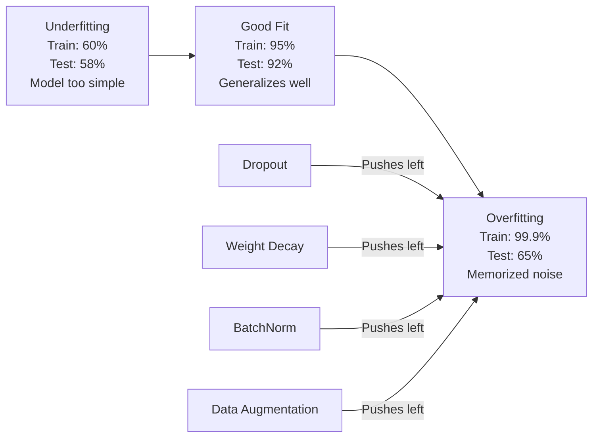
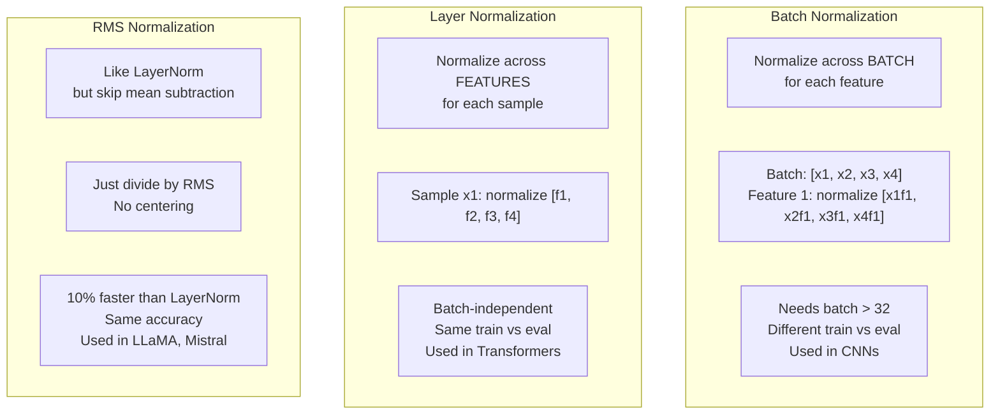
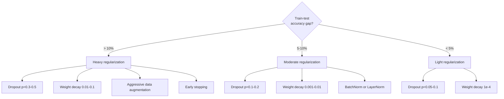

# 正则化

> 你的模型在训练数据上达到99%准确率，但在测试数据上只有60%。它只是死记硬背，而没有真正学习。正则化就是你对复杂性征收的税，迫使模型学会泛化。

**类型：** 构建
**语言：** Python
**前置条件：** 第03.06课（优化器）
**时间：** 约75分钟

## 学习目标

- 从零实现带反向缩放的Dropout、L2权重衰减、批量归一化、层归一化和RMSNorm
- 测量训练-测试准确率差距，并通过正则化实验诊断过拟合
- 解释为什么Transformer使用层归一化而不是批量归一化，以及为什么现代大语言模型更喜欢RMSNorm
- 根据过拟合的严重程度应用正确的正则化技术组合

## 问题

一个具有足够参数量的神经网络可以记住任何数据集。这不是假设——张等人（2017年）通过在ImageNet上使用随机标签训练标准网络证明了这一点。这些网络在完全随机的标签分配上达到了接近零的训练损失。它们记住了一百万个随机输入-输出对，而没有任何可学习的模式。训练损失完美，测试准确率为零。

这就是过拟合问题，随着模型变大，问题会变得更严重。GPT-3有1750亿个参数，训练集大约有5000亿个token。拥有这么多参数，模型有足够能力逐字记住训练数据的大部分内容。没有正则化，它只会机械重复训练样本，而不会学习可泛化的模式。

训练表现和测试表现之间的差距就是过拟合差距。本节课的每一种技术都从不同角度攻击这个差距。Dropout强制网络不依赖任何单个神经元。权重衰减防止任何单个权重变得过大。批量归一化使损失平面变得平滑，从而让优化器找到更平坦、更可泛化的最小值。层归一化做同样的事情，但在批量归一化失效的地方（小批量、变长序列）起作用。RMSNorm通过去掉均值计算速度快了10%。每种技术都很简单。但结合起来，它们就是死记硬背模型和泛化模型之间的区别。

## 核心概念

### 过拟合光谱

每个模型都位于从欠拟合（太简单而无法捕捉模式）到过拟合（太复杂而捕捉噪声）的光谱上。最佳点位于两者之间，而正则化将模型从过拟合一侧推向该点。



### Dropout（随机丢弃）

最简单的正则化技术，拥有最优雅的解释。在训练过程中，以概率p将每个神经元的输出随机置为零。

```
output = activation(z) * mask    where mask[i] ~ Bernoulli(1 - p)
```

当p=0.5时，每次前向传播中一半的神经元被归零。网络必须学习冗余表示，因为它无法预测哪些神经元将可用。这防止了共适应——神经元学习依赖特定其他神经元的存在。

集成解释：一个具有N个神经元和Dropout的网络会创建2^N个可能的子网络（每个神经元开或关的所有组合）。使用Dropout训练近似同时训练了所有2^N个子网络，每个子网络在不同的mini-batch上训练。在测试时，你使用所有神经元（无Dropout）并将输出乘以(1-p)以匹配训练时的期望值。这相当于平均2^N个子网络的预测——一个来自单个模型的巨大集成。

在实践中，缩放是在训练期间而不是测试期间应用的（反向缩放Dropout）：

```
During training:  output = activation(z) * mask / (1 - p)
During testing:   output = activation(z)   (no change needed)
```

这样做更简洁，因为测试代码完全不需要知道Dropout。

默认丢弃率：p=0.1用于Transformer，p=0.5用于MLP，p=0.2-0.3用于CNN。更大的Dropout意味着更强的正则化，也意味着更大的欠拟合风险。

### 权重衰减（L2正则化）

将所有权重的平方和添加到损失中：

```
total_loss = task_loss + (lambda / 2) * sum(w_i^2)
```

正则化项的梯度是lambda * w。这意味着每一步，每个权重都按其大小的一定比例向零收缩。大的权重受到更多惩罚。模型被推向没有单个权重占主导地位的解。

为什么这有助于泛化：过拟合模型往往有较大的权重，放大了训练数据中的噪声。权重衰减保持权重较小，限制了模型的有效容量，迫使它依赖鲁棒、可泛化的特征，而不是记忆的怪癖。

lambda超参数控制强度。典型值：

- 0.01用于Transformer上的AdamW
- 1e-4用于CNN上的SGD
- 0.1用于严重过拟合的模型

如第06课所述：权重衰减和L2正则化在SGD中等价，但在Adam中不等价。使用Adam训练时始终使用AdamW（解耦的权重衰减）。

### 批量归一化(Batch Normalization)

在将每一层的输出传递到下一层之前，在整个mini-batch上对其进行归一化。

对于某个层的一个mini-batch激活值：

```
mu = (1/B) * sum(x_i)           (batch mean)
sigma^2 = (1/B) * sum((x_i - mu)^2)   (batch variance)
x_hat = (x_i - mu) / sqrt(sigma^2 + eps)   (normalize)
y = gamma * x_hat + beta        (scale and shift)
```

Gamma和beta是可学习参数，如果最优，网络可以撤销归一化。没有它们，你会强制每一层的输出为零均值单位方差，这可能不是网络想要的。

**训练与推理的区分：** 训练期间，mu和sigma来自当前mini-batch。推理期间，你使用训练期间累积的运行平均值（动量=0.1的指数移动平均，即90%旧值+10%新值）。

为什么批量归一化有效仍在争论中。原始论文声称它减少了“内部协变量偏移”（随着前一层更新，层输入的分布发生变化）。Santurkar等人（2018）表明这种解释是错误的。真正的原因是：批量归一化使损失平面更平滑。梯度更具预测性，Lipschitz常数更小，优化器可以安全地采取更大的步长。这就是为什么批量归一化允许你使用更高的学习率并更快收敛。

批量归一化有一个根本限制：它依赖于批量统计量。当batch size为1时，均值和方差是无意义的。当批次较小时（<32），统计量有噪声且损害性能。这对于对象检测（内存限制batch size）和语言建模（序列长度变化）等任务很重要。

### 层归一化(Layer Normalization)

对特征维度进行归一化，而非批次维度。对于单个样本：

```
mu = (1/D) * sum(x_j)           (feature mean)
sigma^2 = (1/D) * sum((x_j - mu)^2)   (feature variance)
x_hat = (x_j - mu) / sqrt(sigma^2 + eps)
y = gamma * x_hat + beta
```

D是特征维度。每个样本独立进行归一化——不依赖于批次大小。这就是为什么Transformer使用层归一化(LayerNorm)而非批归一化(BatchNorm)。序列长度可变，批次大小通常较小（或在生成时为1），且训练和推理时的计算完全相同。

Transformer中的层归一化(LayerNorm)应用于每个自注意力块和前馈块之后（后层归一化，Post-LN），或之前（前层归一化，Pre-LN，训练更稳定）。

### 均方根归一化(RMSNorm)

去掉均值减法的层归一化(LayerNorm)。由Zhang & Sennrich（2019）提出。

```
rms = sqrt((1/D) * sum(x_j^2))
y = gamma * x / rms
```

就是这样。没有均值计算，没有beta参数。其观察是：层归一化(LayerNorm)中的再居中（均值减法）对模型性能贡献很小，但消耗计算资源。去掉它可以在减少约10%开销的情况下获得相同的准确率。

LLaMA、LLaMA 2、LLaMA 3、Mistral以及大多数现代大语言模型(LLM)都使用均方根归一化(RMSNorm)而不是层归一化(LayerNorm)。在数十亿参数和数万亿词元的规模下，这10%的节省是显著的。

### 归一化比较



### 作为正则化的数据增强

不是修改模型，而是修改数据。在保持标签的同时变换训练输入：

- 图像：随机裁剪、翻转、旋转、颜色抖动、剪切
- 文本：同义词替换、回译、随机删除
- 音频：时间拉伸、音调变换、添加噪声

其效果与正则化相同：它增加了训练集的有效大小，使模型更难记忆特定样本。一个只看到每个图像原始形式的模型可以记住它。一个看到每个图像的50个增强版本的模型被迫学习不变结构。

### 早停

最简单的正则化器：当验证损失开始增加时停止训练。此时模型尚未过拟合。在实践中，每个epoch跟踪验证损失，保存最佳模型，并在一个"耐心"窗口（通常5-20个epoch）内继续训练。如果验证损失在耐心窗口内没有改善，则停止并加载最佳保存模型。

### 何时应用什么



```figure
l2-regularization
```

## 动手构建

### 步骤1：Dropout（训练和评估模式）

```python
import random
import math


class Dropout:
    def __init__(self, p=0.5):
        self.p = p
        self.training = True
        self.mask = None

    def forward(self, x):
        if not self.training:
            return list(x)
        self.mask = []
        output = []
        for val in x:
            if random.random() < self.p:
                self.mask.append(0)
                output.append(0.0)
            else:
                self.mask.append(1)
                output.append(val / (1 - self.p))
        return output

    def backward(self, grad_output):
        grads = []
        for g, m in zip(grad_output, self.mask):
            if m == 0:
                grads.append(0.0)
            else:
                grads.append(g / (1 - self.p))
        return grads
```

### 步骤2：L2权重衰减

```python
def l2_regularization(weights, lambda_reg):
    penalty = 0.0
    for w in weights:
        penalty += w * w
    return lambda_reg * 0.5 * penalty

def l2_gradient(weights, lambda_reg):
    return [lambda_reg * w for w in weights]
```

### 步骤3：批归一化(Batch Normalization)

```python
class BatchNorm:
    def __init__(self, num_features, momentum=0.1, eps=1e-5):
        self.gamma = [1.0] * num_features
        self.beta = [0.0] * num_features
        self.eps = eps
        self.momentum = momentum
        self.running_mean = [0.0] * num_features
        self.running_var = [1.0] * num_features
        self.training = True
        self.num_features = num_features

    def forward(self, batch):
        batch_size = len(batch)
        if self.training:
            mean = [0.0] * self.num_features
            for sample in batch:
                for j in range(self.num_features):
                    mean[j] += sample[j]
            mean = [m / batch_size for m in mean]

            var = [0.0] * self.num_features
            for sample in batch:
                for j in range(self.num_features):
                    var[j] += (sample[j] - mean[j]) ** 2
            var = [v / batch_size for v in var]

            for j in range(self.num_features):
                self.running_mean[j] = (1 - self.momentum) * self.running_mean[j] + self.momentum * mean[j]
                self.running_var[j] = (1 - self.momentum) * self.running_var[j] + self.momentum * var[j]
        else:
            mean = list(self.running_mean)
            var = list(self.running_var)

        self.x_hat = []
        output = []
        for sample in batch:
            normalized = []
            out_sample = []
            for j in range(self.num_features):
                x_h = (sample[j] - mean[j]) / math.sqrt(var[j] + self.eps)
                normalized.append(x_h)
                out_sample.append(self.gamma[j] * x_h + self.beta[j])
            self.x_hat.append(normalized)
            output.append(out_sample)
        return output
```

### 步骤4：层归一化(Layer Normalization)

```python
class LayerNorm:
    def __init__(self, num_features, eps=1e-5):
        self.gamma = [1.0] * num_features
        self.beta = [0.0] * num_features
        self.eps = eps
        self.num_features = num_features

    def forward(self, x):
        mean = sum(x) / len(x)
        var = sum((xi - mean) ** 2 for xi in x) / len(x)

        self.x_hat = []
        output = []
        for j in range(self.num_features):
            x_h = (x[j] - mean) / math.sqrt(var + self.eps)
            self.x_hat.append(x_h)
            output.append(self.gamma[j] * x_h + self.beta[j])
        return output
```

### 步骤5：均方根归一化(RMSNorm)

```python
class RMSNorm:
    def __init__(self, num_features, eps=1e-6):
        self.gamma = [1.0] * num_features
        self.eps = eps
        self.num_features = num_features

    def forward(self, x):
        rms = math.sqrt(sum(xi * xi for xi in x) / len(x) + self.eps)
        output = []
        for j in range(self.num_features):
            output.append(self.gamma[j] * x[j] / rms)
        return output
```

### 步骤6：有无正则化的训练

```python
def sigmoid(x):
    x = max(-500, min(500, x))
    return 1.0 / (1.0 + math.exp(-x))


def make_circle_data(n=200, seed=42):
    random.seed(seed)
    data = []
    for _ in range(n):
        x = random.uniform(-2, 2)
        y = random.uniform(-2, 2)
        label = 1.0 if x * x + y * y < 1.5 else 0.0
        data.append(([x, y], label))
    return data


class RegularizedNetwork:
    def __init__(self, hidden_size=16, lr=0.05, dropout_p=0.0, weight_decay=0.0):
        random.seed(0)
        self.hidden_size = hidden_size
        self.lr = lr
        self.dropout_p = dropout_p
        self.weight_decay = weight_decay
        self.dropout = Dropout(p=dropout_p) if dropout_p > 0 else None

        self.w1 = [[random.gauss(0, 0.5) for _ in range(2)] for _ in range(hidden_size)]
        self.b1 = [0.0] * hidden_size
        self.w2 = [random.gauss(0, 0.5) for _ in range(hidden_size)]
        self.b2 = 0.0

    def forward(self, x, training=True):
        self.x = x
        self.z1 = []
        self.h = []
        for i in range(self.hidden_size):
            z = self.w1[i][0] * x[0] + self.w1[i][1] * x[1] + self.b1[i]
            self.z1.append(z)
            self.h.append(max(0.0, z))

        if self.dropout and training:
            self.dropout.training = True
            self.h = self.dropout.forward(self.h)
        elif self.dropout:
            self.dropout.training = False
            self.h = self.dropout.forward(self.h)

        self.z2 = sum(self.w2[i] * self.h[i] for i in range(self.hidden_size)) + self.b2
        self.out = sigmoid(self.z2)
        return self.out

    def backward(self, target):
        eps = 1e-15
        p = max(eps, min(1 - eps, self.out))
        d_loss = -(target / p) + (1 - target) / (1 - p)
        d_sigmoid = self.out * (1 - self.out)
        d_out = d_loss * d_sigmoid

        for i in range(self.hidden_size):
            d_relu = 1.0 if self.z1[i] > 0 else 0.0
            d_h = d_out * self.w2[i] * d_relu
            self.w2[i] -= self.lr * (d_out * self.h[i] + self.weight_decay * self.w2[i])
            for j in range(2):
                self.w1[i][j] -= self.lr * (d_h * self.x[j] + self.weight_decay * self.w1[i][j])
            self.b1[i] -= self.lr * d_h
        self.b2 -= self.lr * d_out

    def evaluate(self, data):
        correct = 0
        total_loss = 0.0
        for x, y in data:
            pred = self.forward(x, training=False)
            eps = 1e-15
            p = max(eps, min(1 - eps, pred))
            total_loss += -(y * math.log(p) + (1 - y) * math.log(1 - p))
            if (pred >= 0.5) == (y >= 0.5):
                correct += 1
        return total_loss / len(data), correct / len(data) * 100

    def train_model(self, train_data, test_data, epochs=300):
        history = []
        for epoch in range(epochs):
            total_loss = 0.0
            correct = 0
            for x, y in train_data:
                pred = self.forward(x, training=True)
                self.backward(y)
                eps = 1e-15
                p = max(eps, min(1 - eps, pred))
                total_loss += -(y * math.log(p) + (1 - y) * math.log(1 - p))
                if (pred >= 0.5) == (y >= 0.5):
                    correct += 1
            train_loss = total_loss / len(train_data)
            train_acc = correct / len(train_data) * 100
            test_loss, test_acc = self.evaluate(test_data)
            history.append((train_loss, train_acc, test_loss, test_acc))
            if epoch % 75 == 0 or epoch == epochs - 1:
                gap = train_acc - test_acc
                print(f"    Epoch {epoch:3d}: train_acc={train_acc:.1f}%, test_acc={test_acc:.1f}%, gap={gap:.1f}%")
        return history
```

## 使用它

PyTorch提供了所有归一化和正则化模块：

```python
import torch
import torch.nn as nn

model = nn.Sequential(
    nn.Linear(784, 256),
    nn.BatchNorm1d(256),
    nn.ReLU(),
    nn.Dropout(0.3),
    nn.Linear(256, 128),
    nn.BatchNorm1d(128),
    nn.ReLU(),
    nn.Dropout(0.3),
    nn.Linear(128, 10),
)

model.train()
out_train = model(torch.randn(32, 784))

model.eval()
out_test = model(torch.randn(1, 784))
```

`model.train()` / `model.eval()`切换至关重要。它打开/关闭dropout，并告知BatchNorm使用批次统计量还是运行统计量。在推理前忘记`model.eval()`是深度学习中最常见的错误之一。你的测试准确率会随机波动，因为dropout仍然活跃且BatchNorm正在使用小批量统计量。

对于Transformer，模式不同：

```python
class TransformerBlock(nn.Module):
    def __init__(self, d_model=512, nhead=8, dropout=0.1):
        super().__init__()
        self.attention = nn.MultiheadAttention(d_model, nhead, dropout=dropout)
        self.norm1 = nn.LayerNorm(d_model)
        self.ff = nn.Sequential(
            nn.Linear(d_model, d_model * 4),
            nn.GELU(),
            nn.Linear(d_model * 4, d_model),
            nn.Dropout(dropout),
        )
        self.norm2 = nn.LayerNorm(d_model)
        self.dropout = nn.Dropout(dropout)

    def forward(self, x):
        attended, _ = self.attention(x, x, x)
        x = self.norm1(x + self.dropout(attended))
        x = self.norm2(x + self.ff(x))
        return x
```

使用层归一化(LayerNorm)，而非批归一化(BatchNorm)。Dropout p=0.1，而非p=0.5。这些是Transformer的默认值。

## 发布

本課(lesson)产出：
- `outputs/prompt-regularization-advisor.md` —— 一个诊断过拟合并推荐正确正则化策略的提示

## 练习

1. 实现针对二维数据的空间dropout：不是丢弃单个神经元，而是丢弃整个特征通道。通过将连续的若干个特征视为通道并丢弃整个组来模拟。在隐藏大小为32的圆数据集上，比较训练-测试差距与标准dropout。

2. 将第05课中的标签平滑与本课的dropout结合。使用四种配置训练：两者都不用、仅dropout、仅标签平滑、两者都用。测量每种配置最终的训练-测试准确率差距。哪种组合给出的差距最小？

3. 在圆数据集的网络的隐藏层和激活函数之间添加一个BatchNorm层。以学习率0.01、0.05和0.1分别训练有无BatchNorm的网络。BatchNorm应能在较高学习率下稳定训练，而普通网络会发散。

4. 实现早停：每个epoch跟踪测试损失，保存最佳权重，如果测试损失在20个epoch内没有改善则停止。运行正则化网络1000个epoch。报告哪个epoch的测试准确率最佳，以及你节省了多少epoch的计算量。

5. 在4层网络（不仅仅是2层）上比较LayerNorm和RMSNorm。使用相同的权重初始化两者。训练200个epoch，比较最终准确率、训练速度（每个epoch的时间）以及第一层的梯度幅度。验证RMSNorm在保持相同准确率的情况下速度更快。

## 关键术语

|  术语  |  人们的说法  |  实际含义  |
|------|----------------|----------------------|
| 过拟合(Overfitting) | "模型记忆了数据" | 当模型的训练性能显著超过测试性能时，表明它学到了噪声而非信号 |
| 正则化(Regularization) | "防止过拟合" | 任何约束模型复杂度以提高泛化能力的技术：dropout、权重衰减(weight decay)、归一化(normalization)、数据增强(augmentation) |
| Dropout | "随机神经元删除" | 在训练中以概率p随机将神经元置零，迫使学习冗余表示；等价于训练一个集成模型(ensemble) |
| 权重衰减(Weight decay) | "L2惩罚" | 每一步通过减去λ*w将所有权重向零收缩；通过权重幅度惩罚复杂度 |
| 批量归一化(Batch normalization) | "按批次归一化" | 在训练时使用批次统计量，在推理时使用运行平均值，沿批次维度对层输出进行归一化 |
| 层归一化(Layer normalization) | "按样本归一化" | 在每个样本内跨特征进行归一化；与批次无关，用于批次大小可变的transformer中 |
| RMSNorm | "无均值的LayerNorm" | 均方根归一化；去掉LayerNorm中的均值减去操作，实现同等准确率下10%的速度提升 |
| 早停法(Early stopping) | "在过拟合前停止" | 当验证损失停止改善时停止训练；最简单的正则化方法，常与其他方法一起使用 |
| 数据增强(Data augmentation) | "从少量数据获得更多数据" | 对训练输入进行变换（翻转、裁剪、加噪声）以增加有效数据集大小，并迫使学习不变性 |
| 泛化差距(Generalization gap) | "训练-测试分割" | 训练性能与测试性能之间的差异；正则化的目的是最小化这个差距 |

## 延伸阅读

- Srivastava等人，《Dropout: A Simple Way to Prevent Neural Networks from Overfitting》（2014）——原始dropout论文，包含集成解释和大量实验
- Ioffe与Szegedy，《Batch Normalization: Accelerating Deep Network Training by Reducing Internal Covariate Shift》（2015）——提出了BatchNorm及其训练流程，是引用最多的深度学习论文之一
- Zhang与Sennrich，《Root Mean Square Layer Normalization》（2019）——展示了RMSNorm在减少计算量的情况下匹配LayerNorm的准确率；被LLaMA和Mistral采用
- Zhang等人，《Understanding Deep Learning Requires Rethinking Generalization》（2017）——里程碑式论文，展示了神经网络可以记忆随机标签，挑战了传统的泛化观点
