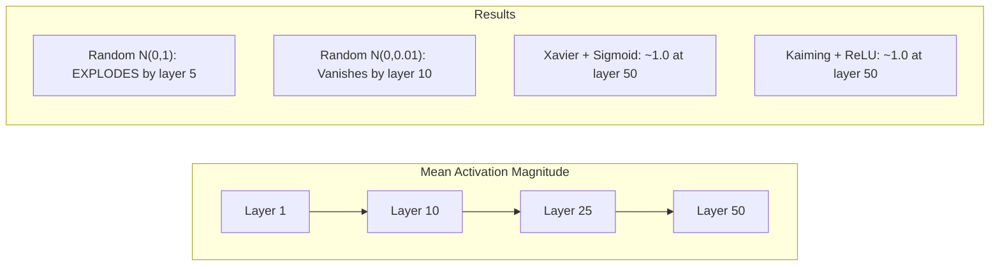
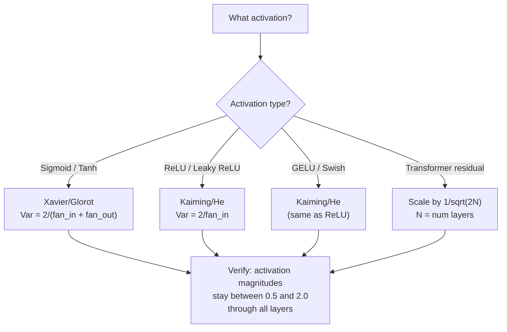

# 权重初始化与训练稳定性

> 初始化错误，训练永远不会开始。初始化正确，50层网络也能像3层一样平滑训练。

**类型：** 构建
**语言：** Python
**前置条件：** 第03.04课（激活函数），第03.07课（正则化）
**时间：** ~90分钟

## 学习目标

- 实现零初始化、随机初始化、Xavier/Glorot初始化和Kaiming/He初始化策略，并测量它们对通过50层的激活值大小的影响
- 推导为什么Xavier初始化使用Var(w)=2/(fan_in + fan_out)，而Kaiming使用Var(w)=2/fan_in
- 论证零初始化的对称性问题，并解释仅靠随机尺度为何不足
- 将正确的初始化策略与激活函数匹配：Xavier用于sigmoid/tanh，Kaiming用于ReLU/GELU

## 问题

所有权重初始化为零。什么都学不到。每个神经元计算相同的函数，接收相同的梯度，进行相同的更新。经过10,000个epoch后，你的512个神经元的隐藏层仍然只是同一神经元的512个副本。你为512个参数付了费，却只得到了1个。

将它们初始化为过大数值。激活值在网络中爆炸。到第10层，值达到1e15。到第20层，它们溢出到无穷大。梯度在反向传播中遵循相同的轨迹。

从标准正态分布中随机初始化。对于3层网络有效。但到了50层，信号要么崩溃为零，要么爆炸到无穷大，取决于随机尺度是稍微偏小还是稍微偏大。“有效”和“失效”之间的界限非常窄。

权重初始化是深度学习中最被低估的决策。架构能发论文，优化器能写博客，而初始化只能得到一个脚注。但一旦出错，其他一切都无关紧要——你的网络在训练开始前就已经死了。

## 核心概念

### 对称性问题

一个层中的每个神经元都有相同的结构：输入乘以权重，加上偏置，应用激活函数。如果所有权重初始化为相同的值（零是极端情况），每个神经元计算相同的输出。在反向传播过程中，每个神经元接收相同的梯度。在更新步骤中，每个神经元的变化量相同。

你被困住了。网络有数百个参数，但它们都同步移动。这称为对称性，随机初始化是打破它的蛮力方式。每个神经元在权重空间中从不同的点开始，因此每个神经元学习不同的特征。

但是“随机”还不够。随机性的*尺度*决定了网络是否能训练。

### 方差在层间传播

考虑一个具有fan_in个输入的单层：

```
z = w1*x1 + w2*x2 + ... + w_n*x_n
```

如果每个权重wi从方差为Var(w)的分布中抽取，且每个输入xi的方差为Var(x)，则输出方差为：

```
Var(z) = fan_in * Var(w) * Var(x)
```

如果Var(w)=1且fan_in=512，则输出方差是输入方差的512倍。经过10层后：512^10=1.2e27。你的信号爆炸了。

如果Var(w)=0.001，则输出方差每层缩小0.001*512=0.512倍。经过10层后：0.512^10=0.00013。你的信号消失了。

目标：选择Var(w)使得Var(z)=Var(x)。信号大小在各层中保持恒定。

### Xavier/Glorot初始化

Glorot和Bengio（2010）推导出了sigmoid和tanh激活函数的解决方案。为了在前向和反向传播中保持方差恒定：

```
Var(w) = 2 / (fan_in + fan_out)
```

实践中，权重从以下分布中抽取：

```
w ~ Uniform(-limit, limit)  where limit = sqrt(6 / (fan_in + fan_out))
```

或：

```
w ~ Normal(0, sqrt(2 / (fan_in + fan_out)))
```

这样做有效，因为sigmoid和tanh在零附近近似线性，而正确初始化的激活值正好落在此区域。方差在数十层中保持稳定。

### Kaiming/He初始化

ReLU会杀死一半的输出（所有负值变为零）。有效fan_in减半，因为平均一半的输入被置零。Xavier初始化未考虑这一点——它低估了所需的方差。

He等人（2015）调整了公式：

```
Var(w) = 2 / fan_in
```

权重从以下分布中抽取：

```
w ~ Normal(0, sqrt(2 / fan_in))
```

因子2补偿了ReLU将一半激活值置零的影响。没有它，信号每层缩小约0.5倍。50层后：0.5^50=8.8e-16。Kaiming初始化防止了这种情况。

### Transformer初始化

GPT-2引入了一种不同的模式。残差连接将每个子层的输出加到其输入上：

```
x = x + sublayer(x)
```

每增加一个残差层，方差(variance)就会增大。对于 N 个残差层，方差会与 N 成比例增长。GPT-2 将残差层(Residual Layer)的权重按 1/sqrt(2N) 缩放，其中 N 是层数。这能保持累积信号幅度的稳定。

Llama 3（405B 参数，126 层）使用了类似的方案。如果没有这种缩放，经过 126 层注意力(Attention)和前馈(Feedforward)模块后，残差流(Residual Stream)将无限增长。

```mermaid
flowchart TD
    subgraph "Zero Init"
        Z1["Layer 1<br/>All weights = 0"] --> Z2["Layer 2<br/>All neurons identical"]
        Z2 --> Z3["Layer 3<br/>Still identical"]
        Z3 --> ZR["Result: 1 effective neuron<br/>regardless of width"]
    end

    subgraph "Xavier Init"
        X1["Layer 1<br/>Var = 2/(fan_in+fan_out)"] --> X2["Layer 2<br/>Signal stable"]
        X2 --> X3["Layer 50<br/>Signal stable"]
        X3 --> XR["Result: Trains with<br/>sigmoid/tanh"]
    end

    subgraph "Kaiming Init"
        K1["Layer 1<br/>Var = 2/fan_in"] --> K2["Layer 2<br/>Signal stable"]
        K2 --> K3["Layer 50<br/>Signal stable"]
        K3 --> KR["Result: Trains with<br/>ReLU/GELU"]
    end
```



### 经过 50 层的激活幅度(Activation Magnitude)



### 选择合适的初始化(Initialization)



```figure
weight-init-variance
```

## 动手构建

### 第 1 步：初始化策略(Initialization Strategies)

初始化权重矩阵的四种方式。每种方式返回一个列表的列表（二维矩阵），列数为 fan_in，行数为 fan_out。

```python
import math
import random


def zero_init(fan_in, fan_out):
    return [[0.0 for _ in range(fan_in)] for _ in range(fan_out)]


def random_init(fan_in, fan_out, scale=1.0):
    return [[random.gauss(0, scale) for _ in range(fan_in)] for _ in range(fan_out)]


def xavier_init(fan_in, fan_out):
    std = math.sqrt(2.0 / (fan_in + fan_out))
    return [[random.gauss(0, std) for _ in range(fan_in)] for _ in range(fan_out)]


def kaiming_init(fan_in, fan_out):
    std = math.sqrt(2.0 / fan_in)
    return [[random.gauss(0, std) for _ in range(fan_in)] for _ in range(fan_out)]
```

### 第 2 步：激活函数(Activation Functions)

我们需要 sigmoid、tanh 和 ReLU，以便用各自对应的激活函数测试每种初始化策略。

```python
def sigmoid(x):
    x = max(-500, min(500, x))
    return 1.0 / (1.0 + math.exp(-x))


def tanh_act(x):
    return math.tanh(x)


def relu(x):
    return max(0.0, x)
```

### 第 3 步：经过 50 层的前向传播(Forward Pass)

将随机数据通过网络，测量每一层的平均激活幅度。

```python
def forward_deep(init_fn, activation_fn, n_layers=50, width=64, n_samples=100):
    random.seed(42)
    layer_magnitudes = []

    inputs = [[random.gauss(0, 1) for _ in range(width)] for _ in range(n_samples)]

    for layer_idx in range(n_layers):
        weights = init_fn(width, width)
        biases = [0.0] * width

        new_inputs = []
        for sample in inputs:
            output = []
            for neuron_idx in range(width):
                z = sum(weights[neuron_idx][j] * sample[j] for j in range(width)) + biases[neuron_idx]
                output.append(activation_fn(z))
            new_inputs.append(output)
        inputs = new_inputs

        magnitudes = []
        for sample in inputs:
            magnitudes.append(sum(abs(v) for v in sample) / width)
        mean_mag = sum(magnitudes) / len(magnitudes)
        layer_magnitudes.append(mean_mag)

    return layer_magnitudes
```

### 第 4 步：实验(The Experiment)

运行所有组合：零初始化(Zero Init)、随机 N(0,1)、随机 N(0,0.01)、Xavier 配合 sigmoid、Xavier 配合 tanh、Kaiming 配合 ReLU。输出关键层的幅度。

```python
def run_experiment():
    configs = [
        ("Zero init + Sigmoid", lambda fi, fo: zero_init(fi, fo), sigmoid),
        ("Random N(0,1) + ReLU", lambda fi, fo: random_init(fi, fo, 1.0), relu),
        ("Random N(0,0.01) + ReLU", lambda fi, fo: random_init(fi, fo, 0.01), relu),
        ("Xavier + Sigmoid", xavier_init, sigmoid),
        ("Xavier + Tanh", xavier_init, tanh_act),
        ("Kaiming + ReLU", kaiming_init, relu),
    ]

    print(f"{'Strategy':<30} {'L1':>10} {'L5':>10} {'L10':>10} {'L25':>10} {'L50':>10}")
    print("-" * 80)

    for name, init_fn, act_fn in configs:
        mags = forward_deep(init_fn, act_fn)
        row = f"{name:<30}"
        for idx in [0, 4, 9, 24, 49]:
            val = mags[idx]
            if val > 1e6:
                row += f" {'EXPLODED':>10}"
            elif val < 1e-6:
                row += f" {'VANISHED':>10}"
            else:
                row += f" {val:>10.4f}"
        print(row)
```

### 第 5 步：对称性(Symmetry)演示

展示零初始化会产生完全相同的神经元(Neuron)。

```python
def symmetry_demo():
    random.seed(42)
    weights = zero_init(2, 4)
    biases = [0.0] * 4

    inputs = [0.5, -0.3]
    outputs = []
    for neuron_idx in range(4):
        z = sum(weights[neuron_idx][j] * inputs[j] for j in range(2)) + biases[neuron_idx]
        outputs.append(sigmoid(z))

    print("\nSymmetry Demo (4 neurons, zero init):")
    for i, out in enumerate(outputs):
        print(f"  Neuron {i}: output = {out:.6f}")
    all_same = all(abs(outputs[i] - outputs[0]) < 1e-10 for i in range(len(outputs)))
    print(f"  All identical: {all_same}")
    print(f"  Effective parameters: 1 (not {len(weights) * len(weights[0])})")
```

### 第 6 步：逐层幅度报告

打印经过 50 层的激活幅度可视化柱状图。

```python
def magnitude_report(name, magnitudes):
    print(f"\n{name}:")
    for i, mag in enumerate(magnitudes):
        if i % 5 == 0 or i == len(magnitudes) - 1:
            if mag > 1e6:
                bar = "X" * 50 + " EXPLODED"
            elif mag < 1e-6:
                bar = "." + " VANISHED"
            else:
                bar_len = min(50, max(1, int(mag * 10)))
                bar = "#" * bar_len
            print(f"  Layer {i+1:3d}: {bar} ({mag:.6f})")
```

## 使用它

PyTorch 将这些作为内置函数提供：

```python
import torch
import torch.nn as nn

layer = nn.Linear(512, 256)

nn.init.xavier_uniform_(layer.weight)
nn.init.xavier_normal_(layer.weight)

nn.init.kaiming_uniform_(layer.weight, nonlinearity='relu')
nn.init.kaiming_normal_(layer.weight, nonlinearity='relu')

nn.init.zeros_(layer.bias)
```

当你调用 `nn.Linear(512, 256)` 时，PyTorch 默认使用 Kaiming 均匀初始化(Kaiming Uniform Initialization)。这就是大多数简单网络“直接可用”的原因——PyTorch 已经做出了正确选择。但当你构建自定义架构或网络深度超过 20 层时，你需要理解背后的原理，并可能覆盖默认设置。

对于 Transformer，HuggingFace 模型通常在其 `_init_weights` 方法中处理初始化。GPT-2 的实现将残差投影(Residual Projection)按 1/sqrt(N) 缩放。如果你从头构建 Transformer，你需要自行添加这一缩放。

## 发布

本課(lesson)产出：
- `outputs/prompt-init-strategy.md` —— 一个用于诊断权重初始化问题并推荐正确策略的提示(Prompt)。

## 练习

1. 添加 LeCun 初始化（Var = 1/fan_in，专为 SELU 激活函数设计）。使用 LeCun 初始化配合 tanh 运行 50 层实验，并与 Xavier 配合 tanh 的结果进行比较。

2. 实现 GPT-2 残差缩放：将每一层的输出乘以 1/sqrt(2*N) 再累加到残差流中。运行 50 层，分别测试有缩放和无缩放的情况，测量残差幅度增长的速度。

3. 创建一个“初始化健康检查”函数，输入网络层的维度和激活函数类型，推荐正确的初始化方式，并在当前初始化可能导致问题时发出警告。

4. 在 fan_in = 16 和 fan_in = 1024 的情况下运行实验。Xavier 和 Kaiming 会根据 fan_in 自适应，但随机初始化不会。展示随着层数增加，“有效”与“失效”之间的差距如何扩大。

5. 实现正交初始化(Orthogonal Initialization)（生成随机矩阵，计算其 SVD，使用正交矩阵 U）。在 50 层的 ReLU 网络中与 Kaiming 进行比较。

## 关键术语

|  术语  |  人们的说法  |  实际含义  |
|------|----------------|----------------------|
|  权重初始化(Weight Initialization) | "随机设置初始权重" | 选择初始权重值的策略，决定了网络是否能够训练  |
|  对称性破缺(Symmetry Breaking) | "让神经元各不相同" | 使用随机初始化确保神经元学习不同的特征，而不是计算相同的函数  |
|  扇入(Fan-in) | "神经元的输入数量" | 输入连接的数量，决定了加权和中的输入方差如何累积  |
|  扇出(Fan-out) | "神经元的输出数量" | 输出连接的数量，与反向传播过程中梯度方差的维持相关  |
|  Xavier/Glorot 初始化(Xavier/Glorot Init) | "sigmoid 的初始化" | Var(w) = 2/(fan_in + fan_out)，设计用于保持 sigmoid 和 tanh 激活函数下的方差  |
| Kaiming/He 初始化 | "ReLU 初始化" | Var(w) = 2/fan_in，考虑到 ReLU 将一半的激活值置零 |
| 方差传播(Variance propagation) | "信号如何在层间增长或缩小" | 分析激活方差如何根据权重尺度逐层变化的数学分析 |
| 残差缩放(Residual scaling) | "GPT-2 的初始化技巧" | 将残差连接权重缩放 1/sqrt(2N)，以防止方差通过 N 个 Transformer 层增长 |
| 死网络(Dead network) | "无法训练" | 一种网络，其糟糕的初始化导致所有梯度为零或所有激活值饱和 |
| 激活爆炸(Exploding activations) | "值趋于无穷" | 当权重方差过高时，导致激活值幅度逐层指数增长 |

## 延伸阅读

- Glorot & Bengio, "Understanding the difficulty of training deep feedforward neural networks" (2010) —— 引入 Xavier 初始化的原始论文，包含方差分析
- He et al., "Delving Deep into Rectifiers" (2015) —— 为 ReLU 网络提出 Kaiming 初始化
- Radford et al., "Language Models are Unsupervised Multitask Learners" (2019) —— GPT-2 论文，包含残差缩放初始化
- Mishkin & Matas, "All You Need is a Good Init" (2016) —— 层序单位方差初始化，一种分析公式的经验替代方案
