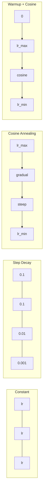
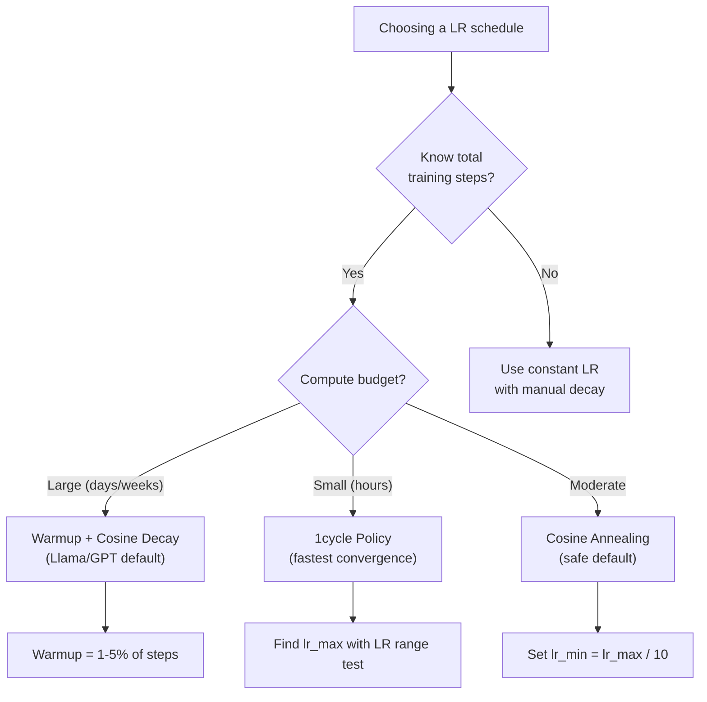
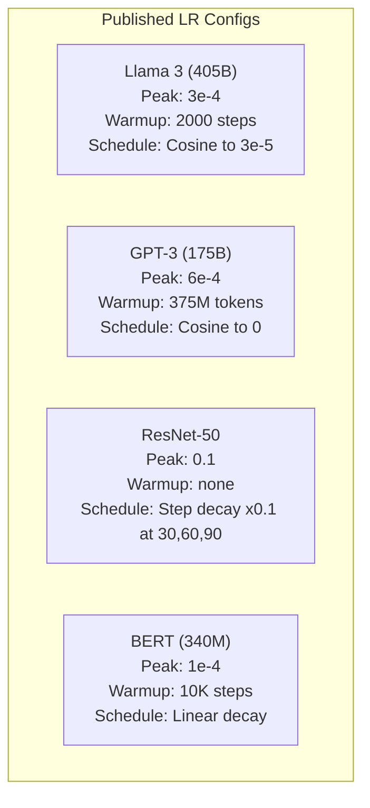

# 学习率调度与预热(Learning Rate Schedules and Warmup)

> 学习率是最重要的超参数。不是架构，不是数据集大小，不是激活函数——就是学习率。如果你什么都不调，那就调这个。

**类型：** 构建
**语言：** Python
**前置知识：** 第 03.06 课（优化器）、第 03.08 课（权重初始化）
**时长：** ~90 分钟

## 学习目标

- 从头实现常数、阶梯衰减、余弦退火、预热+余弦和1cycle学习率调度
- 展示学习率选择的三种失败模式：发散（过高）、停滞（过低）和振荡（无衰减）
- 解释为什么基于Adam的优化器需要预热，以及预热如何稳定早期训练
- 在同一任务上比较所有五种调度的收敛速度，并为给定的训练预算选择合适的调度

## 问题

设学习率为0.1。训练发散——损失在3步内跳到无穷。设为0.0001。训练缓慢——100轮后模型几乎没离开随机状态。设为0.01。训练在50轮内有效，然后损失在无法到达的最小值附近振荡，因为步长太大。

最优学习率不是常数。它在训练过程中变化。早期，你需要大步快速覆盖区域。训练后期，你需要小步进入尖锐的最小值。90%精度的模型和95%精度的模型之间的区别通常只是调度。

过去三年中发布的每个主要模型都使用了学习率调度。Llama 3 使用了峰值学习率 3e-4，2000步预热，余弦衰减到3e-5。GPT-3 使用了学习率 6e-4，在3.75亿个token上预热。这些不是随意选择，而是花费数百万美元的广泛超参数扫描的结果。

你需要了解调度，因为默认值对你的问题不一定有效。当微调预训练模型时，正确的调度与从头训练不同。当增加批大小时，预热期需要改变。当训练在第10000步中断时，你需要知道是调度问题还是其他问题。

## 核心概念

### 常数学习率(Constant Learning Rate)

最简单的方法。选一个数，每一步都用它。

```
lr(t) = lr_0
```

很少最优。要么对训练后期太高（在最小值附近振荡），要么对初期太低（小步浪费计算）。对于小模型和调试来说还行。任何训练超过一小时的模型选择它都是糟糕的选择。

### 阶梯衰减(Step Decay)

来自ResNet时代的传统方法。在固定轮数将学习率乘以一个因子（通常是10倍）。

```
lr(t) = lr_0 * gamma^(floor(epoch / step_size))
```

其中 gamma = 0.1 且 step_size = 30 意味着：每30轮学习率下降10倍。ResNet-50 使用了这个——lr=0.1，在第30、60、90轮下降10倍。

问题：最优衰减点取决于数据集和架构。换到不同的问题需要重新调优何时下降。过渡是突变的——当学习率突然变化时损失可能飙升。

### 余弦退火(Cosine Annealing)

从最大学习率到最小学习率平滑衰减，遵循余弦曲线：

```
lr(t) = lr_min + 0.5 * (lr_max - lr_min) * (1 + cos(pi * t / T))
```

其中 t 是当前步数，T 是总步数。

当 t=0 时，余弦项为1，所以 lr = lr_max。当 t=T 时，余弦项为-1，所以 lr = lr_min。衰减刚开始温和，中间加速，最后再次变得温和。

这是大多数现代训练运行的默认选择。除了 lr_max 和 lr_min 外没有需要调优的超参数。余弦形状符合经验观察：大多数学习发生在训练中期——你希望在关键时期有合理的步长。

### 预热(Warmup)：为什么开始要小

Adam和其他自适应优化器维持梯度均值和方差的运行估计。在第0步，这些估计被初始化为零。最初的几次梯度更新基于垃圾统计量。如果此时学习率很大，模型会采取巨大且方向很差的步。

预热解决了这个问题。从很小的学习率开始（通常是 lr_max / warmup_steps 甚至零），在前N步线性增加到 lr_max。当你达到完整学习率时，Adam的统计量已经稳定。

```
lr(t) = lr_max * (t / warmup_steps)     for t < warmup_steps
```

典型的预热：总训练步数的1-5%。Llama 3 训练了约1.8万亿个token，预热了2000步。GPT-3 在3.75亿个token上预热。

### 线性预热+余弦衰减(Linear Warmup + Cosine Decay)

现代默认方法。线性上升，然后余弦衰减：

```
if t < warmup_steps:
    lr(t) = lr_max * (t / warmup_steps)
else:
    progress = (t - warmup_steps) / (total_steps - warmup_steps)
    lr(t) = lr_min + 0.5 * (lr_max - lr_min) * (1 + cos(pi * progress))
```

这是 Llama、GPT、PaLM 以及大多数现代 transformer 使用的。预热防止早期不稳定。余弦衰减使模型稳定在好的最小值。

### 1cycle策略(1cycle Policy)

Leslie Smith在2018年的发现：在训练前半段将学习率从低值线性增加到高值，然后在后半段再降回来。反直觉——为什么要在训练中途增加学习率？

理论：高学习率通过向优化轨迹添加噪声起到正则化作用。模型在上升阶段探索更多的损失景观，找到更好的盆地。下降阶段则在找到的最佳盆地内精炼。

```
Phase 1 (0 to T/2):    lr ramps from lr_max/25 to lr_max
Phase 2 (T/2 to T):    lr ramps from lr_max to lr_max/10000
```

对于固定的计算预算，1cycle 通常比余弦退火训练更快。权衡：你必须提前知道总步数。

### 调度形状



### 决策流程图



### 已发表模型中的实数



```figure
lr-schedule
```

## 动手构建

### 第一步：调度函数

每个函数接收当前步数并返回该步的学习率。

```python
import math


def constant_schedule(step, lr=0.01, **kwargs):
    return lr


def step_decay_schedule(step, lr=0.1, step_size=100, gamma=0.1, **kwargs):
    return lr * (gamma ** (step // step_size))


def cosine_schedule(step, lr=0.01, total_steps=1000, lr_min=1e-5, **kwargs):
    if step >= total_steps:
        return lr_min
    return lr_min + 0.5 * (lr - lr_min) * (1 + math.cos(math.pi * step / total_steps))


def warmup_cosine_schedule(step, lr=0.01, total_steps=1000, warmup_steps=100, lr_min=1e-5, **kwargs):
    if total_steps <= warmup_steps:
        return lr * (step / max(warmup_steps, 1))
    if step < warmup_steps:
        return lr * step / warmup_steps
    progress = (step - warmup_steps) / (total_steps - warmup_steps)
    return lr_min + 0.5 * (lr - lr_min) * (1 + math.cos(math.pi * progress))


def one_cycle_schedule(step, lr=0.01, total_steps=1000, **kwargs):
    mid = max(total_steps // 2, 1)
    if step < mid:
        return (lr / 25) + (lr - lr / 25) * step / mid
    else:
        progress = (step - mid) / max(total_steps - mid, 1)
        return lr * (1 - progress) + (lr / 10000) * progress
```

### 第二步：可视化所有调度

打印基于文本的图，显示每个调度在训练过程中的变化。

```python
def visualize_schedule(name, schedule_fn, total_steps=500, **kwargs):
    steps = list(range(0, total_steps, total_steps // 20))
    if total_steps - 1 not in steps:
        steps.append(total_steps - 1)

    lrs = [schedule_fn(s, total_steps=total_steps, **kwargs) for s in steps]
    max_lr = max(lrs) if max(lrs) > 0 else 1.0

    print(f"\n{name}:")
    for s, lr_val in zip(steps, lrs):
        bar_len = int(lr_val / max_lr * 40)
        bar = "#" * bar_len
        print(f"  Step {s:4d}: lr={lr_val:.6f} {bar}")
```

### 第三步：训练网络

在圆形数据集上的简单两层网络，与之前的课程相同，但现在我们改变调度。

```python
import random


def sigmoid(x):
    x = max(-500, min(500, x))
    return 1.0 / (1.0 + math.exp(-x))


def relu(x):
    return max(0.0, x)


def relu_deriv(x):
    return 1.0 if x > 0 else 0.0


def make_circle_data(n=200, seed=42):
    random.seed(seed)
    data = []
    for _ in range(n):
        x = random.uniform(-2, 2)
        y = random.uniform(-2, 2)
        label = 1.0 if x * x + y * y < 1.5 else 0.0
        data.append(([x, y], label))
    return data


def train_with_schedule(schedule_fn, schedule_name, data, epochs=300, base_lr=0.05, **kwargs):
    random.seed(0)
    hidden_size = 8
    total_steps = epochs * len(data)

    std = math.sqrt(2.0 / 2)
    w1 = [[random.gauss(0, std) for _ in range(2)] for _ in range(hidden_size)]
    b1 = [0.0] * hidden_size
    w2 = [random.gauss(0, std) for _ in range(hidden_size)]
    b2 = 0.0

    step = 0
    epoch_losses = []

    for epoch in range(epochs):
        total_loss = 0
        correct = 0

        for x, target in data:
            lr = schedule_fn(step, lr=base_lr, total_steps=total_steps, **kwargs)

            z1 = []
            h = []
            for i in range(hidden_size):
                z = w1[i][0] * x[0] + w1[i][1] * x[1] + b1[i]
                z1.append(z)
                h.append(relu(z))

            z2 = sum(w2[i] * h[i] for i in range(hidden_size)) + b2
            out = sigmoid(z2)

            error = out - target
            d_out = error * out * (1 - out)

            for i in range(hidden_size):
                d_h = d_out * w2[i] * relu_deriv(z1[i])
                w2[i] -= lr * d_out * h[i]
                for j in range(2):
                    w1[i][j] -= lr * d_h * x[j]
                b1[i] -= lr * d_h
            b2 -= lr * d_out

            total_loss += (out - target) ** 2
            if (out >= 0.5) == (target >= 0.5):
                correct += 1
            step += 1

        avg_loss = total_loss / len(data)
        accuracy = correct / len(data) * 100
        epoch_losses.append(avg_loss)

    return epoch_losses
```

### 第四步：比较所有调度

使用每个调度训练相同的网络，比较最终损失和收敛行为。

```python
def compare_schedules(data):
    configs = [
        ("Constant", constant_schedule, {}),
        ("Step Decay", step_decay_schedule, {"step_size": 15000, "gamma": 0.1}),
        ("Cosine", cosine_schedule, {"lr_min": 1e-5}),
        ("Warmup+Cosine", warmup_cosine_schedule, {"warmup_steps": 3000, "lr_min": 1e-5}),
        ("1cycle", one_cycle_schedule, {}),
    ]

    print(f"\n{'Schedule':<20} {'Start Loss':>12} {'Mid Loss':>12} {'End Loss':>12} {'Best Loss':>12}")
    print("-" * 70)

    for name, schedule_fn, extra_kwargs in configs:
        losses = train_with_schedule(schedule_fn, name, data, epochs=300, base_lr=0.05, **extra_kwargs)
        mid_idx = len(losses) // 2
        best = min(losses)
        print(f"{name:<20} {losses[0]:>12.6f} {losses[mid_idx]:>12.6f} {losses[-1]:>12.6f} {best:>12.6f}")
```

### 第五步：学习率过高与过低

演示三种失败模式：过高（发散）、过低（爬行）和恰到好处。

```python
def lr_sensitivity(data):
    learning_rates = [1.0, 0.1, 0.01, 0.001, 0.0001]

    print("\nLR Sensitivity (constant schedule, 100 epochs):")
    print(f"  {'LR':>10} {'Start Loss':>12} {'End Loss':>12} {'Status':>15}")
    print("  " + "-" * 52)

    for lr in learning_rates:
        losses = train_with_schedule(constant_schedule, f"lr={lr}", data, epochs=100, base_lr=lr)
        start = losses[0]
        end = losses[-1]

        if end > start or math.isnan(end) or end > 1.0:
            status = "DIVERGED"
        elif end > start * 0.9:
            status = "BARELY MOVED"
        elif end < 0.15:
            status = "CONVERGED"
        else:
            status = "LEARNING"

        end_str = f"{end:.6f}" if not math.isnan(end) else "NaN"
        print(f"  {lr:>10.4f} {start:>12.6f} {end_str:>12} {status:>15}")
```

## 使用它

PyTorch 在 `torch.optim.lr_scheduler` 中提供了调度器：

```python
import torch
import torch.optim as optim
from torch.optim.lr_scheduler import CosineAnnealingLR, OneCycleLR, StepLR

model = nn.Sequential(nn.Linear(10, 64), nn.ReLU(), nn.Linear(64, 1))
optimizer = optim.Adam(model.parameters(), lr=3e-4)

scheduler = CosineAnnealingLR(optimizer, T_max=1000, eta_min=1e-5)

for step in range(1000):
    loss = train_step(model, optimizer)
    scheduler.step()
```

对于预热 + 余弦，使用 lambda 调度器或 HuggingFace 的 `get_cosine_schedule_with_warmup`：

```python
from transformers import get_cosine_schedule_with_warmup

scheduler = get_cosine_schedule_with_warmup(
    optimizer,
    num_warmup_steps=2000,
    num_training_steps=100000,
)
```

HuggingFace 函数是大多数 Llama 和 GPT 微调脚本使用的。不确定时，使用预热 + 余弦，预热步数为总步数的 3-5%。几乎适用于所有情况。

## 发布

本課(lesson)产出：
- `outputs/prompt-lr-schedule-advisor.md` —— 一个为你的训练设置推荐正确学习率调度和超参数的提示

## 练习

1. 实现指数衰减：lr(t) = lr_0 * gamma^t，其中 gamma = 0.999。在圆形数据集上与余弦退火进行比较。

2. 实现学习率范围测试（Leslie Smith）：训练几百步，同时将 LR 从 1e-7 指数增加到 1。绘制损失与 LR 的关系图。最佳最大 LR 是损失开始增加之前的值。

3. 使用预热 + 余弦训练，但改变预热长度：总步数的 0%、1%、5%、10%、20%。找到训练最稳定的最佳点。

4. 实现带热重启的余弦退火（SGDR）：每 T 步将学习率重置为 lr_max 并再次衰减。在更长的训练运行中与标准余弦进行比较。

5. 构建一个“调度外科医生”，监控训练损失并在损失稳定时自动从预热切换到余弦，如果损失停滞太久则降低学习率。

## 关键术语

|  术语  |  人们的说法  |  实际含义  |
|------|----------------|----------------------|
| 学习率 | "模型学习的速度" | 乘以梯度以确定参数更新大小的标量 |
| 调度 | "随时间改变学习率" | 将训练步映射到学习率的函数，旨在优化收敛 |
| 预热 | "从小学习率开始" | 在前 N 步将学习率从接近零线性增加到目标值，以稳定优化器统计信息 |
| 余弦退火 | "平滑学习率衰减" | 在训练过程中按照余弦曲线从 lr_max 减小到 lr_min |
| 步进衰减 | "在里程碑处降低学习率" | 在固定的 epoch 间隔将学习率乘以一个因子（通常为 0.1） |
| 1cycle 策略 | "先升后降" | Leslie Smith 的方法，在一个周期内先增加再降低学习率，以加快收敛 |
| 学习率范围测试 | "找到最佳学习率" | 短暂训练的同时增加学习率，找到损失开始发散的值 |
| 带热重启的余弦退火 | "重置并重复" | 周期性地将学习率重置为 lr_max 并再次衰减（SGDR） |
|  Eta min  |  "学习率的下限"  |  学习率调度衰减到的最小学习率  |
|  Peak learning rate  |  "最大学习率"  |  训练期间达到的最高学习率，通常在学习率热身之后  |

## 延伸阅读

- Loshchilov & Hutter, "SGDR: 带热身重启的随机梯度下降" (2017) —— 引入了余弦退火和热身重启
- Smith, "超收敛：使用大学习率快速训练神经网络" (2018) —— 1cycle策略论文
- Touvron 等, "Llama 2：开放基础与微调对话模型" (2023) —— 记录大规模使用的热身+余弦调度
- Goyal 等, "准确的大批量SGD：一小时内训练ImageNet" (2017) —— 大批量训练的线性缩放规则和热身
