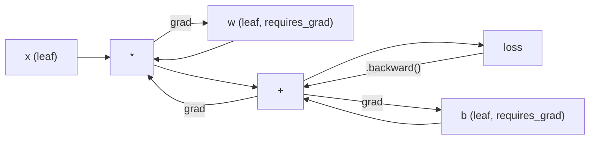
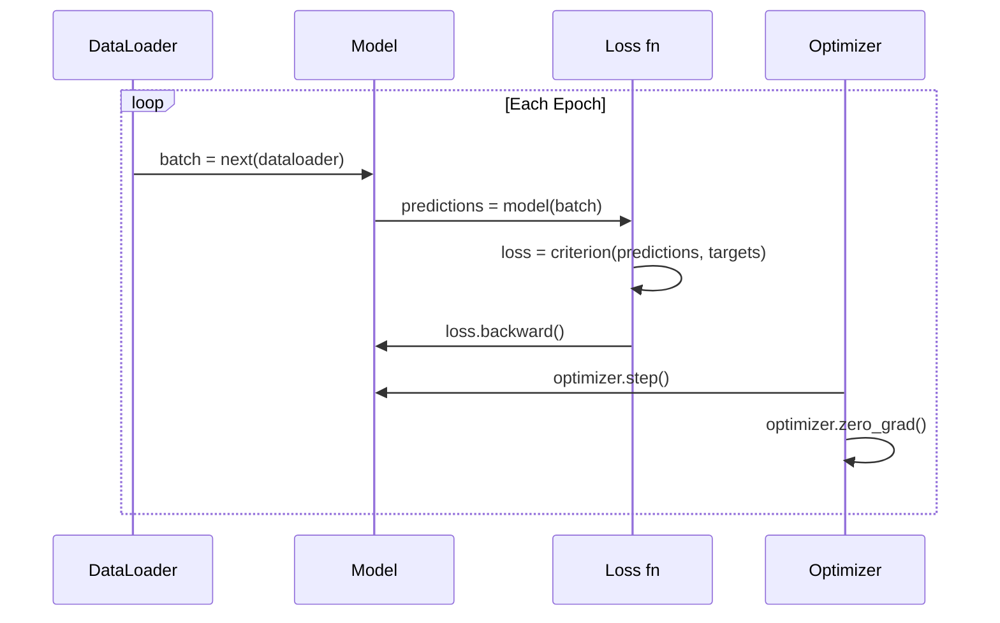

# PyTorch 简介

> 你已经用活塞和曲轴搭建了引擎。现在学习那个人人都实际在用的引擎。

**类型：** 构建
**语言：** Python
**前置知识：** 第 03.10 课（构建你自己的迷你框架）
**时间：** 约 75 分钟

## 学习目标

- 使用 PyTorch 的 nn.Module、nn.Sequential 和 autograd 构建并训练神经网络
- 使用 PyTorch 张量、GPU 加速以及标准训练循环（zero_grad、forward、loss、backward、step）
- 将你从零开始的迷你框架组件转换为 PyTorch 等效实现
- 分析并比较你的纯 Python 框架与 PyTorch 在同一任务上的训练速度

## 问题

你有一个可用的迷你框架。线性层、ReLU、Dropout、批归一化、Adam、DataLoader、训练循环。它用纯 Python 在一个圆形分类问题上训练了一个 4 层网络。

然而，它在同一问题上比 PyTorch 慢 500 倍。

你的迷你框架使用嵌套的 Python 循环逐样本处理数据。PyTorch 则将相同的操作分派到优化的 C++/CUDA 内核上，这些内核在 GPU 上运行。在单个 NVIDIA A100 上，PyTorch 在 ImageNet（128 万张图像）上训练 ResNet-50（2560 万参数）大约需要 6 小时。你的框架完成同样的任务大约需要 3000 小时——如果它没有先耗尽内存的话。

速度并非唯一的差距。你的框架没有 GPU 支持。没有自动微分——你为每个模块手写了 backward()。没有序列化。没有分布式训练。没有混合精度。没有调试梯度流的方法（除了打印语句）。

PyTorch 填补了所有这些空白。而且它保持了与你已经构建的完全相同的思维模型：Module、forward()、parameters()、backward()、optimizer.step()。概念一一对应。语法几乎相同。区别在于，PyTorch 在你从零设计的同一接口后面封装了十年的系统工程经验。

## 核心概念

### 为什么 PyTorch 胜出

2015 年，TensorFlow 要求你在运行任何操作之前先定义一个静态计算图。你构建图，编译它，然后通过它输入数据。调试意味着盯着图可视化。改变架构意味着从头重建图。

PyTorch 于 2017 年发布，采用了不同的理念：即时执行。你写 Python 代码，它立即运行。`y = model(x)` 实际上现在计算 y，而不是“向一个稍后计算 y 的图中添加一个节点”。这意味着标准的 Python 调试工具可以工作。print() 可以工作。pdb 可以工作。前向传播中的 if/else 可以工作。

到 2020 年，市场已经给出了答案。PyTorch 在机器学习研究论文中的份额从 7%（2017 年）增长到超过 75%（2022 年）。Meta、Google DeepMind、OpenAI、Anthropic 和 Hugging Face 都使用 PyTorch 作为主要框架。TensorFlow 2.x 则采用即时执行作为回应——这默认承认了 PyTorch 的设计是正确的。

经验教训：开发者体验会不断累积。一个慢 10% 但调试快 50% 的框架每次都会胜出。

### 张量

张量是一种多维数组，具有三个关键属性：形状、数据类型和设备。

```python
import torch

x = torch.zeros(3, 4)           # shape: (3, 4), dtype: float32, device: cpu
x = torch.randn(2, 3, 224, 224) # batch of 2 RGB images, 224x224
x = torch.tensor([1, 2, 3])     # from a Python list
```

**形状** 是维度。标量形状为 ()，向量为 (n,)，矩阵为 (m, n)，一批图像为 (batch, channels, height, width)。

**数据类型** 控制精度和内存。

|  dtype  |  位宽  |  范围  |  用途  |
|-------|------|-------|----------|
|  float32  |  32  |  ~7 位十进制数字  |  默认训练  |
|  float16  |  16  |  ~3.3 位十进制数字  |  混合精度  |
|  bfloat16  |  16  |  与 float32 相同范围，精度较低  |  LLM 训练  |
|  int8  |  8  |  -128 到 127  |  量化推理  |

**设备** 决定计算发生的位置。

```python
device = torch.device("cuda" if torch.cuda.is_available() else "cpu")
x = torch.randn(3, 4, device=device)
x = x.to("cuda")
x = x.cpu()
```

每个操作要求所有张量在同一个设备上。这是初学者遇到的头号 PyTorch 错误：`RuntimeError: Expected all tensors to be on the same device`。解决方法是在计算之前将所有内容移动到同一个设备。

**重塑** 是常数时间操作——它改变元数据，而不改变数据。

```python
x = torch.randn(2, 3, 4)
x.view(2, 12)      # reshape to (2, 12) -- must be contiguous
x.reshape(6, 4)    # reshape to (6, 4) -- works always
x.permute(2, 0, 1) # reorder dimensions
x.unsqueeze(0)     # add dimension: (1, 2, 3, 4)
x.squeeze()        # remove size-1 dimensions
```

### 自动微分

你的迷你框架要求你为每个模块实现 backward()。PyTorch 不需要。它将张量上的每个操作记录到一个有向无环图（计算图）中，然后反向遍历该图以自动计算梯度。



与你的框架的关键区别：PyTorch 使用基于磁带（tape-based）的自动微分。在前向传播过程中，每个操作都会追加到一条“磁带”上。调用 `.backward()` 会反向回放磁带。

```python
x = torch.randn(3, requires_grad=True)
y = x ** 2 + 3 * x
z = y.sum()
z.backward()
print(x.grad)  # dz/dx = 2x + 3
```

自动微分的三条规则：

1. 只有带有`requires_grad=True`的叶张量会累积梯度
2. 梯度默认累积——在每次反向传播前调用`requires_grad=True`
3. `requires_grad=True`禁用梯度跟踪（在评估时使用）

### nn.Module

`nn.Module`是PyTorch中每个神经网络组件的基类。你在第10课中已经构建了这个抽象。PyTorch的版本增加了自动参数注册、递归模块发现、设备管理和状态字典序列化。

```python
import torch.nn as nn

class MLP(nn.Module):
    def __init__(self, input_dim, hidden_dim, output_dim):
        super().__init__()
        self.layer1 = nn.Linear(input_dim, hidden_dim)
        self.relu = nn.ReLU()
        self.layer2 = nn.Linear(hidden_dim, output_dim)

    def forward(self, x):
        x = self.layer1(x)
        x = self.relu(x)
        x = self.layer2(x)
        return x
```

当你在`__init__`中将`nn.Module`或`nn.Parameter`作为属性赋值时，PyTorch会自动注册它。`model.parameters()`递归地收集每个注册的参数。这就是为什么你永远不需要像在迷你框架中那样手动收集权重。

关键构建块：

|  模块  |  功能  |  参数  |
|--------|-------------|------------|
|  nn.Linear(in, out)  |  Wx + b  |  in*out + out  |
|  nn.Conv2d(in_ch, out_ch, k)  |  2D卷积  |  in_ch*out_ch*k*k + out_ch  |
|  nn.BatchNorm1d(features)  |  归一化激活  |  2 * features  |
|  nn.Dropout(p)  |  随机置零  |  0  |
|  nn.ReLU()  |  max(0, x)  |  0  |
|  nn.GELU()  |  高斯误差线性单元  |  0  |
|  nn.Embedding(vocab, dim)  |  查找表  |  vocab * dim  |
|  nn.LayerNorm(dim)  |  逐样本归一化  |  2 * dim  |

### 损失函数与优化器

PyTorch提供了你构建的所有东西的生产就绪版本。

**损失函数**（来自`torch.nn`）：

|  损失  |  任务  |  输入  |
|------|------|-------|
|  nn.MSELoss()  |  回归  |  任意形状  |
|  nn.CrossEntropyLoss()  |  多类分类  |  对数几率（非softmax）  |
|  nn.BCEWithLogitsLoss()  |  二分类  |  对数几率（非sigmoid）  |
|  nn.L1Loss()  |  回归（鲁棒）  |  任意形状  |
|  nn.CTCLoss()  |  序列对齐  |  对数概率  |

注意：`CrossEntropyLoss`内部结合了`LogSoftmax` + `NLLLoss`。传入原始对数几率，而不是softmax输出。这是一个常见错误，会悄无声息地产生错误的梯度。

**优化器**（来自`torch.optim`）：

|  优化器  |  使用时机  |  典型学习率  |
|-----------|-------------|-----------|
|  SGD(params, lr, momentum)  |  卷积神经网络、调优良好的流水线  |  0.01--0.1  |
|  Adam(params, lr)  |  默认起点  |  1e-3  |
|  AdamW(params, lr, weight_decay)  |  变换器、微调  |  1e-4--1e-3  |
|  LBFGS(params)  |  小规模、二阶  |  1.0  |

### 训练循环（Training Loop）

每个PyTorch训练循环都遵循相同的5步模式。你在第10课中已经了解了这一点。



标准模式：

```python
for epoch in range(num_epochs):
    model.train()
    for inputs, targets in train_loader:
        inputs, targets = inputs.to(device), targets.to(device)
        optimizer.zero_grad()
        outputs = model(inputs)
        loss = criterion(outputs, targets)
        loss.backward()
        optimizer.step()
```

批次循环内的五行代码。训练GPT-4、Stable Diffusion和LLaMA的五行代码。架构在变，数据在变。但这五行代码不变。

### 数据集和数据加载器（Dataset and DataLoader）

PyTorch的`Dataset`是一个抽象类，包含两个方法：`__len__`和`__getitem__`。`DataLoader`通过批处理、打乱和多进程数据加载来封装它。

```python
from torch.utils.data import Dataset, DataLoader

class MNISTDataset(Dataset):
    def __init__(self, images, labels):
        self.images = images
        self.labels = labels

    def __len__(self):
        return len(self.labels)

    def __getitem__(self, idx):
        return self.images[idx], self.labels[idx]

loader = DataLoader(dataset, batch_size=64, shuffle=True, num_workers=4)
```

`num_workers=4`会生成4个进程并行加载数据，而GPU则训练当前批次。在磁盘绑定型工作负载（大图像、音频）中，仅此一项就能使训练速度翻倍。

### GPU训练

将模型移动到GPU：

```python
device = torch.device("cuda" if torch.cuda.is_available() else "cpu")
model = model.to(device)
```

这会递归地将每个参数和缓冲区移动到GPU。然后在训练期间移动每个批次：

```python
inputs, targets = inputs.to(device), targets.to(device)
```

**混合精度（Mixed precision）**通过在前向/反向传播中使用float16，同时将主权重保持在float32，在现代GPU（A100、H100、RTX 4090）上将内存使用减半，吞吐量翻倍：

```python
from torch.amp import autocast, GradScaler

scaler = GradScaler()
for inputs, targets in loader:
    with autocast(device_type="cuda"):
        outputs = model(inputs)
        loss = criterion(outputs, targets)
    scaler.scale(loss).backward()
    scaler.step(optimizer)
    scaler.update()
    optimizer.zero_grad()
```

### 对比：Mini框架 vs PyTorch vs JAX

|  特性  |  Mini框架（第10课）  |  PyTorch  |  JAX  |
|---------|---------------------|---------|-----|
|  自动微分  |  手动backward()  |  基于磁带的自动微分  |  函数式变换  |
|  执行方式  |  即时（Python循环）  |  即时（C++内核）  |  追踪+JIT编译  |
|  GPU支持  |  不支持  |  支持（CUDA、ROCm、MPS）  |  支持（CUDA、TPU）  |
|  速度（MNIST MLP）  |  ~300秒/epoch  |  ~0.5秒/epoch  |  ~0.3秒/epoch  |
|  模块系统  |  自定义Module类  |  nn.Module  |  无状态函数（Flax/Equinox）  |
|  调试  |  print()  |  print()、pdb、breakpoint()  |  较难（JIT追踪中断了print）  |
|  生态系统  |  无  |  Hugging Face、Lightning、timm  |  Flax、Optax、Orbax  |
|  学习曲线  |  你构建的  |  中等  |  陡峭（函数式范式）  |
|  生产使用  |  玩具问题  |  Meta、OpenAI、Anthropic、HF  |  Google DeepMind、Midjourney  |

```figure
dropout-mask
```

## 动手构建

一个基于MNIST训练的3层MLP，仅使用PyTorch原语。没有高层包装器，没有`torchvision.datasets`。我们自己下载并解析原始数据。

### 步骤1：从原始文件加载MNIST

MNIST以4个gzip压缩文件形式提供：训练图像（60,000 x 28 x 28）、训练标签、测试图像（10,000 x 28 x 28）、测试标签。我们下载它们并解析二进制格式。

```python
import torch
import torch.nn as nn
import struct
import gzip
import urllib.request
import os

def download_mnist(path="./mnist_data"):
    base_url = "https://storage.googleapis.com/cvdf-datasets/mnist/"
    files = [
        "train-images-idx3-ubyte.gz",
        "train-labels-idx1-ubyte.gz",
        "t10k-images-idx3-ubyte.gz",
        "t10k-labels-idx1-ubyte.gz",
    ]
    os.makedirs(path, exist_ok=True)
    for f in files:
        filepath = os.path.join(path, f)
        if not os.path.exists(filepath):
            urllib.request.urlretrieve(base_url + f, filepath)

def load_images(filepath):
    with gzip.open(filepath, "rb") as f:
        magic, num, rows, cols = struct.unpack(">IIII", f.read(16))
        data = f.read()
        images = torch.frombuffer(bytearray(data), dtype=torch.uint8)
        images = images.reshape(num, rows * cols).float() / 255.0
    return images

def load_labels(filepath):
    with gzip.open(filepath, "rb") as f:
        magic, num = struct.unpack(">II", f.read(8))
        data = f.read()
        labels = torch.frombuffer(bytearray(data), dtype=torch.uint8).long()
    return labels
```

### 步骤2：定义模型

一个3层MLP：784 -> 256 -> 128 -> 10。ReLU激活函数。Dropout用于正则化。不使用批归一化以保持简单。

```python
class MNISTModel(nn.Module):
    def __init__(self):
        super().__init__()
        self.net = nn.Sequential(
            nn.Linear(784, 256),
            nn.ReLU(),
            nn.Dropout(0.2),
            nn.Linear(256, 128),
            nn.ReLU(),
            nn.Dropout(0.2),
            nn.Linear(128, 10),
        )

    def forward(self, x):
        return self.net(x)
```

输出层产生10个原始logits（每个数字一个）。没有softmax——`CrossEntropyLoss`内部处理。

参数数量：784*256 + 256 + 256*128 + 128 + 128*10 + 10 = 235,146。按现代标准很小。GPT-2 small有1.24亿。这个模型在几秒内训练完成。

### 步骤3：训练循环

规范的前向-损失-反向传播模式。

```python
def train_one_epoch(model, loader, criterion, optimizer, device):
    model.train()
    total_loss = 0
    correct = 0
    total = 0
    for images, labels in loader:
        images, labels = images.to(device), labels.to(device)
        optimizer.zero_grad()
        outputs = model(images)
        loss = criterion(outputs, labels)
        loss.backward()
        optimizer.step()
        total_loss += loss.item() * images.size(0)
        _, predicted = outputs.max(1)
        correct += predicted.eq(labels).sum().item()
        total += labels.size(0)
    return total_loss / total, correct / total


def evaluate(model, loader, criterion, device):
    model.eval()
    total_loss = 0
    correct = 0
    total = 0
    with torch.no_grad():
        for images, labels in loader:
            images, labels = images.to(device), labels.to(device)
            outputs = model(images)
            loss = criterion(outputs, labels)
            total_loss += loss.item() * images.size(0)
            _, predicted = outputs.max(1)
            correct += predicted.eq(labels).sum().item()
            total += labels.size(0)
    return total_loss / total, correct / total
```

注意在评估期间使用`torch.no_grad()`。这会禁用自动求导，减少内存使用并加速推理。没有它，PyTorch会构建一个你永远不会用到的计算图。

### 步骤4：整合所有内容

```python
def main():
    device = torch.device("cuda" if torch.cuda.is_available() else "cpu")

    download_mnist()
    train_images = load_images("./mnist_data/train-images-idx3-ubyte.gz")
    train_labels = load_labels("./mnist_data/train-labels-idx1-ubyte.gz")
    test_images = load_images("./mnist_data/t10k-images-idx3-ubyte.gz")
    test_labels = load_labels("./mnist_data/t10k-labels-idx1-ubyte.gz")

    train_dataset = torch.utils.data.TensorDataset(train_images, train_labels)
    test_dataset = torch.utils.data.TensorDataset(test_images, test_labels)
    train_loader = torch.utils.data.DataLoader(
        train_dataset, batch_size=64, shuffle=True
    )
    test_loader = torch.utils.data.DataLoader(
        test_dataset, batch_size=256, shuffle=False
    )

    model = MNISTModel().to(device)
    criterion = nn.CrossEntropyLoss()
    optimizer = torch.optim.Adam(model.parameters(), lr=1e-3)

    num_params = sum(p.numel() for p in model.parameters())
    print(f"Device: {device}")
    print(f"Parameters: {num_params:,}")
    print(f"Train samples: {len(train_dataset):,}")
    print(f"Test samples: {len(test_dataset):,}")
    print()

    for epoch in range(10):
        train_loss, train_acc = train_one_epoch(
            model, train_loader, criterion, optimizer, device
        )
        test_loss, test_acc = evaluate(
            model, test_loader, criterion, device
        )
        print(
            f"Epoch {epoch+1:2d} | "
            f"Train Loss: {train_loss:.4f} | Train Acc: {train_acc:.4f} | "
            f"Test Loss: {test_loss:.4f} | Test Acc: {test_acc:.4f}"
        )

    torch.save(model.state_dict(), "mnist_mlp.pt")
    print(f"\nModel saved to mnist_mlp.pt")
    print(f"Final test accuracy: {test_acc:.4f}")
```

10个epoch后的预期输出：测试准确率约97.8%。CPU训练时间：约30秒。GPU上：约5秒。使用相同架构的迷你框架：约45分钟。

## 使用它

### 快速对比：迷你框架 vs PyTorch

|  迷你框架（第10课）  |  PyTorch  |
|---------------------------|---------|
|  `model = Sequential(Linear(784, 256), ReLU(), ...)`  |  `model = nn.Sequential(nn.Linear(784, 256), nn.ReLU(), ...)`  |
|  `pred = model.forward(x)`  |  `pred = model(x)`  |
|  `optimizer.zero_grad()`  |  `optimizer.zero_grad()`  |
|  `grad = criterion.backward()` 然后 `model.backward(grad)`  |  `loss.backward()`  |
|  `optimizer.step()`  |  `optimizer.step()`  |
|  无GPU  |  `model.to("cuda")`  |
|  每个模块手动反向传播  |  Autograd处理一切  |

接口几乎相同。区别在于底层实现。

### 保存和加载模型

```python
torch.save(model.state_dict(), "model.pt")

model = MNISTModel()
model.load_state_dict(torch.load("model.pt", weights_only=True))
model.eval()
```

始终保存`state_dict()`（参数字典），而不是模型对象。保存模型对象使用pickle，当重构代码时会出错。状态字典是可移植的。

### 学习率调度

```python
scheduler = torch.optim.lr_scheduler.CosineAnnealingLR(
    optimizer, T_max=10
)
for epoch in range(10):
    train_one_epoch(model, train_loader, criterion, optimizer, device)
    scheduler.step()
```

PyTorch自带了15+个调度器：StepLR、ExponentialLR、CosineAnnealingLR、OneCycleLR、ReduceLROnPlateau。所有调度器均可插入相同的优化器接口。

## 发布

本节课产出两个成果：

- `outputs/prompt-pytorch-debugger.md` —— 诊断常见PyTorch训练失败的提示
- `outputs/prompt-pytorch-debugger.md` —— PyTorch训练模式的技能参考

## 练习

1. **添加批归一化。** 在每个线性层之后（激活函数之前）插入`nn.BatchNorm1d`。比较测试准确率和训练速度与仅使用Dropout的版本。批归一化应在更少的epoch内达到98%+的准确率。

2. **实现学习率查找器。** 训练一个epoch，学习率指数递增（从1e-7到1.0）。绘制损失 vs 学习率曲线。最佳学习率恰好在损失开始上升之前。用这个为MNIST模型选择更好的学习率。

3. **使用混合精度移植到GPU。** 在训练循环中添加`torch.amp.autocast`和`GradScaler`。在GPU上测量有无混合精度的吞吐量（样本/秒）。在A100上，预计约2倍加速。

4. **构建自定义数据集。** 下载Fashion-MNIST（格式与MNIST相同，但包含衣物图像）。实现一个`FashionMNISTDataset(Dataset)`类，包含`__getitem__`和`__len__`。训练相同的MLP并比较准确率。Fashion-MNIST更困难——预计约88% vs 98%。

5. **用SGD +动量替换Adam。** 使用`SGD(params, lr=0.01, momentum=0.9)`进行训练。比较收敛曲线。然后添加`CosineAnnealingLR`调度器，观察SGD是否在10个epoch时赶上Adam。

## 关键术语

|  术语  |  人们的说法  |  实际含义  |
|------|----------------|----------------------|
|  Tensor  |  "多维数组"  |  一种类型化、设备感知的数组，每个操作都内建了自动微分支持  |
|  Autograd  |  "自动反向传播"  |  一种基于磁带（tape）的系统，在前向传播期间记录操作，然后反向重放以计算精确梯度  |
|  nn.Module  |  "层"  |  任何可微分计算块的基类——注册参数、支持嵌套、处理训练/评估模式  |
|  state_dict  |  "模型权重"  |  一个将参数名映射到张量的OrderedDict——是训练模型的可移植、可序列化的表示  |
|  .backward()  |  "计算梯度"  |  反向遍历计算图，为每个requires_grad=True的叶子张量计算并累积梯度  |
|  .to(device)  |  "移到GPU"  |  递归地将所有参数和缓冲区转移到指定设备（CPU、CUDA、MPS）  |
|  DataLoader  |  "数据流水线"  |  一个迭代器，对来自Dataset的数据进行批处理、打乱并可选地并行加载  |
|  混合精度  |  "使用float16"  |  训练时使用float16进行前向/反向传播以提高速度，同时保留float32主权重以保证数值稳定性  |
|  即时执行(Eager execution)  |  "立即运行"  |  调用时立即执行操作，不推迟到以后的编译步骤——这是PyTorch区别于TF 1.x的核心设计选择  |
|  zero_grad  |  "重置梯度"  |  在下次反向传播前将所有参数梯度置零，因为PyTorch默认会累积梯度  |

## 延伸阅读

- Paszke等人，《PyTorch: An Imperative Style, High-Performance Deep Learning Library》(2019) —— 解释PyTorch设计权衡的原始论文
- PyTorch教程：《Learning PyTorch with Examples》(https://pytorch.org/tutorials/beginner/pytorch_with_examples.html) —— 从张量到nn.Module的官方路径
- PyTorch性能调优指南(https://pytorch.org/tutorials/beginner/pytorch_with_examples.html) —— 混合精度、DataLoader工作进程、固定内存及其他生产优化
- Horace He，《Making Deep Learning Go Brrrr》(https://pytorch.org/tutorials/beginner/pytorch_with_examples.html) —— 为什么GPU训练很快，附PyTorch特定优化策略
