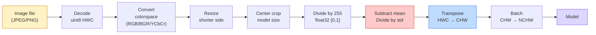
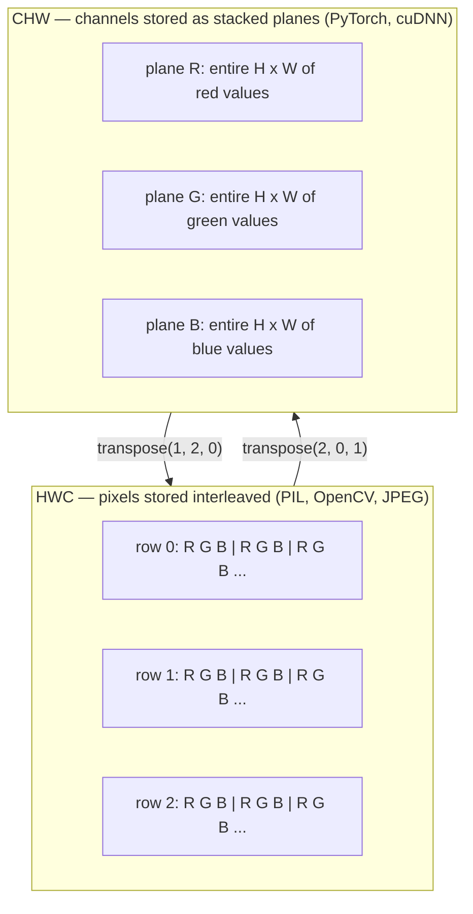

# 图像基础——像素、通道、色彩空间

> 图像是光样本的张量。你将要使用的每一个视觉模型都源于这一事实。

**类型：** 构建
**语言：** Python
**先决条件：** 阶段1第12课（张量操作），阶段3第11课（PyTorch入门）
**时间：** 约45分钟

## 学习目标

- 解释连续场景如何离散化为像素，以及采样/量化决策为何决定所有下游模型的上限
- 将图像作为NumPy数组读取、切片和检查，并在HWC与CHW布局间流畅切换
- 在RGB、灰度、HSV和YCbCr之间转换，并论证每个色彩空间存在的理由
- 精确按照torchvision期望的方式应用像素级预处理（归一化、标准化、调整大小、通道优先）

## 问题

你将要阅读的每一篇论文、下载的每一个预训练权重、调用的每一个视觉API都假设输入具有特定的编码。如果传入一个模型期望`float32`的`uint8`图像，模型仍然会运行——但静默产生垃圾。将BGR输入给在RGB上训练的网络，准确率下降十个点。将通道最后的输入交给期望通道最先的模型，第一个卷积层会将高度视为特征通道。这些都不会引发错误，只会破坏你的指标，让你花一周时间寻找一个来自文件加载方式的bug。

一旦你知道卷积在什么上面滑动，它并不复杂。困难的部分在于，“图像”对相机、JPEG解码器、PIL、OpenCV、torchvision和CUDA内核意味着不同的东西。每个堆栈都有自己轴顺序、字节范围和通道惯例。一个视觉工程师如果无法分清这些，就会交付有缺陷的流水线。

这节课夯实基础，以便本阶段其余内容可以在此基础上构建。在课程结束时，你将了解什么是像素，为什么每个像素有三个数字而不是一个，“使用ImageNet统计量归一化”实际上做了什么，以及如何在本阶段其他每节课都会假设的两个或三个布局之间进行转换。

## 核心概念

### 预处理全流程一览

每个生产级视觉系统都是相同的可逆变换序列。某一步搞错，模型就会看到与训练时不同的输入。



两个红色和蓝色框是80%静默失败的发生地：缺少标准化和错误的布局。

### 像素是样本，不是方块

相机传感器统计落在微小探测器网格上的光子数。每个探测器在极短的时间内积分光线，并发出与撞击光子数成正比的电压。传感器随后将电压离散化为整数。一个探测器成为一个像素。

```
Continuous scene                 Sensor grid                     Digital image
(infinite detail)                (H x W detectors)               (H x W integers)

    ~~~~~                        +--+--+--+--+--+                 210 198 180 155 120
   ~   ~   ~                     |  |  |  |  |  |                 205 195 178 152 118
  ~ light ~      ---->           +--+--+--+--+--+     ---->       200 190 175 150 115
   ~~~~~                         |  |  |  |  |  |                 195 185 170 148 112
                                 +--+--+--+--+--+                 188 180 165 145 108
```

在这一步有两个选择，它们决定了所有下游任务的上限：

- **空间采样**决定每度场景有多少个探测器。太少，边缘会变得锯齿状（混叠）。太多，存储和计算会爆炸。
- **强度量化**决定电压分桶的精细程度。8位提供256级，是显示的标准。10、12、16位提供更平滑的梯度，对医学成像、HDR和原始传感器流水线很重要。

像素不是有面积的彩色方块。它是一个单一测量值。当你调整大小或旋转时，你是在对该测量网格进行重采样。

### 为什么是三个通道

一个探测器统计整个可见光谱的光子——那就是灰度。为了获得颜色，传感器在网格上覆盖红、绿、蓝滤波器的马赛克。去马赛克后，每个空间位置有三个整数：附近红色滤波探测器、绿色滤波器和蓝色滤波器的响应。这三个整数就是一个像素的RGB三元组。

```
One pixel in memory:

    (R, G, B) = (210, 140, 30)   <- reddish-orange

An H x W RGB image:

    shape (H, W, 3)     stored as   H rows of W pixels of 3 values
                                    each in [0, 255] for uint8
```

三不是魔法。深度相机增加Z通道。卫星增加红外和紫外波段。医学扫描通常有一个通道（X射线、CT）或多个（高光谱）。通道数是最后一个轴；卷积层学习跨其混合。

### 两种布局惯例：HWC和CHW

相同的张量，两种排序。每个库选择一种。

```
HWC (height, width, channels)           CHW (channels, height, width)

   W ->                                    H ->
  +-----+-----+-----+                     +-----+-----+
H |R G B|R G B|R G B|                   C |R R R R R R|
| +-----+-----+-----+                   | +-----+-----+
v |R G B|R G B|R G B|                   v |G G G G G G|
  +-----+-----+-----+                     +-----+-----+
                                          |B B B B B B|
                                          +-----+-----+

   PIL, OpenCV, matplotlib,              PyTorch, most deep learning
   almost every image file on disk       frameworks, cuDNN kernels
```

CHW存在是因为卷积核在H和W上滑动。将通道轴放在最前面意味着每个内核每个通道看到一个连续的2D平面，这样可以干净地向量化。磁盘格式保持HWC，因为这匹配传感器输出扫描线的方式。

你将输入一千次的一行转换：

```
img_chw = img_hwc.transpose(2, 0, 1)      # NumPy
img_chw = img_hwc.permute(2, 0, 1)        # PyTorch tensor
```

内存布局可视化：



### 字节范围和dtype

三种约定主导：

|  约定  |  dtype  |  范围  |  你看到它的地方  |
|------------|-------|-------|------------------|
|  原始  |  `uint8`  |  [0, 255]  |  磁盘上的文件、PIL、OpenCV输出  |
|  归一化  |  `float32`  |  [0.0, 1.0]  |  在`img.astype('float32') / 255`之后  |
|  标准化  |  `float32`  |  大致 [-2, +2]  |  减去均值并除以标准差后  |

卷积网络在标准化输入上训练。ImageNet统计量`mean=[0.485, 0.456, 0.406]`、`std=[0.229, 0.224, 0.225]`是三个通道在整个ImageNet训练集上的算术均值和标准差，在[0,1]归一化像素上计算。将原始`uint8`输入到期望标准化浮点数的模型中是应用视觉中最常见的静默失败。

### 颜色空间及其存在原因

RGB是捕获格式，但对模型来说并非总是最有用的表示。

```
 RGB               HSV                       YCbCr / YUV

 R red             H hue (angle 0-360)       Y luminance (brightness)
 G green           S saturation (0-1)        Cb chroma blue-yellow
 B blue            V value/brightness (0-1)  Cr chroma red-green

 Linear to         Separates color from      Separates brightness from
 sensor output     brightness. Useful for    color. JPEG and most video
                   color thresholding, UI    codecs compress the chroma
                   sliders, simple filters   channels harder because the
                                             human eye is less sensitive
                                             to chroma detail than to Y.
```

对于大多数现代CNN，你输入的是RGB。当你遇到以下情况时会遇到其他空间：

- **HSV** — 经典CV代码、基于颜色的分割、白平衡。
- **YCbCr** — 读取JPEG内部结构、视频流水线、仅对Y通道操作的超分辨率模型。
- **灰度图(Grayscale)** — OCR、文档模型、以及任何将颜色视为干扰变量而非信号的情况。

从RGB转换的灰度图是加权和而非平均值，因为人眼对绿色比红色或蓝色更敏感：

```
Y = 0.299 R + 0.587 G + 0.114 B       (ITU-R BT.601, the classic weights)
```

### 宽高比、调整大小与插值

每个模型都有固定的输入尺寸（大多数ImageNet分类器为224x224，现代检测器为384x384或512x512）。你的图像很少匹配。三个重要的调整大小选项：

- **先调整短边，再中心裁剪** — 标准的ImageNet方案。保持宽高比，丢弃边缘像素条。
- **调整大小并填充** — 保持宽高比和所有像素，添加黑边。检测和OCR的标准做法。
- **直接调整到目标尺寸** — 拉伸图像。速度快，扭曲几何形状，适用于许多分类任务。

插值方法决定了新网格与旧网格不对齐时如何计算中间像素：

```
Nearest neighbour     fastest, blocky, only choice for masks/labels
Bilinear              fast, smooth, default for most image resizing
Bicubic               slower, sharper on upscaling
Lanczos               slowest, best quality, used for final display
```

经验法则：训练用双线性(bilinear)，你要查看的资源用双三次(bicubic)或兰索斯(lanczos)，包含整数类ID的任何内容用最近邻(nearest)。

```figure
conv-output-size
```

## 动手构建

### 第1步：加载图像并检查其形状

使用Pillow加载任何JPEG或PNG，转换为NumPy，并打印你得到的结果。对于离线运行的可确定性示例，合成一张图像。

```python
import numpy as np
from PIL import Image

def synthetic_rgb(h=128, w=192, seed=0):
    rng = np.random.default_rng(seed)
    yy, xx = np.meshgrid(np.linspace(0, 1, h), np.linspace(0, 1, w), indexing="ij")
    r = (np.sin(xx * 6) * 0.5 + 0.5) * 255
    g = yy * 255
    b = (1 - yy) * xx * 255
    rgb = np.stack([r, g, b], axis=-1) + rng.normal(0, 6, (h, w, 3))
    return np.clip(rgb, 0, 255).astype(np.uint8)

arr = synthetic_rgb()
# Or load from disk:
# arr = np.asarray(Image.open("your_image.jpg").convert("RGB"))

print(f"type:   {type(arr).__name__}")
print(f"dtype:  {arr.dtype}")
print(f"shape:  {arr.shape}     # (H, W, C)")
print(f"min:    {arr.min()}")
print(f"max:    {arr.max()}")
print(f"pixel at (0, 0): {arr[0, 0]}")
```

预期输出：`shape: (H, W, 3)`, `dtype: uint8`, 范围 `[0, 255]`。无论字节来自相机、JPEG解码器还是合成生成器，这都是规范的磁盘表示。

### 第2步：拆分通道并重排布局

分别提取R、G、B，然后从HWC转换为CHW以用于PyTorch。

```python
R = arr[:, :, 0]
G = arr[:, :, 1]
B = arr[:, :, 2]
print(f"R shape: {R.shape}, mean: {R.mean():.1f}")
print(f"G shape: {G.shape}, mean: {G.mean():.1f}")
print(f"B shape: {B.shape}, mean: {B.mean():.1f}")

arr_chw = arr.transpose(2, 0, 1)
print(f"\nHWC shape: {arr.shape}")
print(f"CHW shape: {arr_chw.shape}")
```

三个灰度平面，每个通道一个。CHW仅重新排列轴；当内存布局允许时，严格来说不需要数据拷贝。

### 第3步：灰度图和HSV转换

加权和灰度图，然后手动RGB转HSV。

```python
def rgb_to_grayscale(rgb):
    weights = np.array([0.299, 0.587, 0.114], dtype=np.float32)
    return (rgb.astype(np.float32) @ weights).astype(np.uint8)

def rgb_to_hsv(rgb):
    rgb_f = rgb.astype(np.float32) / 255.0
    r, g, b = rgb_f[..., 0], rgb_f[..., 1], rgb_f[..., 2]
    cmax = np.max(rgb_f, axis=-1)
    cmin = np.min(rgb_f, axis=-1)
    delta = cmax - cmin

    h = np.zeros_like(cmax)
    mask = delta > 0
    rmax = mask & (cmax == r)
    gmax = mask & (cmax == g)
    bmax = mask & (cmax == b)
    h[rmax] = ((g[rmax] - b[rmax]) / delta[rmax]) % 6
    h[gmax] = ((b[gmax] - r[gmax]) / delta[gmax]) + 2
    h[bmax] = ((r[bmax] - g[bmax]) / delta[bmax]) + 4
    h = h * 60.0

    s = np.where(cmax > 0, delta / cmax, 0)
    v = cmax
    return np.stack([h, s, v], axis=-1)

gray = rgb_to_grayscale(arr)
hsv = rgb_to_hsv(arr)
print(f"gray shape: {gray.shape}, range: [{gray.min()}, {gray.max()}]")
print(f"hsv   shape: {hsv.shape}")
print(f"hue range: [{hsv[..., 0].min():.1f}, {hsv[..., 0].max():.1f}] degrees")
print(f"sat range: [{hsv[..., 1].min():.2f}, {hsv[..., 1].max():.2f}]")
print(f"val range: [{hsv[..., 2].min():.2f}, {hsv[..., 2].max():.2f}]")
```

色相(Hue)以度为单位输出，饱和度(Saturation)和明度(Value)在[0,1]范围内。这与OpenCV`hsv_full`约定一致。

### 第4步：归一化、标准化并反转

从原始字节转换为预训练ImageNet模型所需的确切张量，然后再转换回来。

```python
mean = np.array([0.485, 0.456, 0.406], dtype=np.float32)
std = np.array([0.229, 0.224, 0.225], dtype=np.float32)

def preprocess_imagenet(rgb_uint8):
    x = rgb_uint8.astype(np.float32) / 255.0
    x = (x - mean) / std
    x = x.transpose(2, 0, 1)
    return x

def deprocess_imagenet(chw_float32):
    x = chw_float32.transpose(1, 2, 0)
    x = x * std + mean
    x = np.clip(x * 255.0, 0, 255).astype(np.uint8)
    return x

x = preprocess_imagenet(arr)
print(f"preprocessed shape: {x.shape}     # (C, H, W)")
print(f"preprocessed dtype: {x.dtype}")
print(f"preprocessed mean per channel:  {x.mean(axis=(1, 2)).round(3)}")
print(f"preprocessed std  per channel:  {x.std(axis=(1, 2)).round(3)}")

roundtrip = deprocess_imagenet(x)
max_diff = np.abs(roundtrip.astype(int) - arr.astype(int)).max()
print(f"roundtrip max pixel diff: {max_diff}    # should be 0 or 1")
```

每个通道的均值应接近零，标准差接近一。预处理/后处理对正是每个torchvision`transforms.Normalize`调用在底层所做的。

### 第5步：使用三种插值方法调整大小

在放大时比较最近邻、双线性和双三次，以便差异可见。

```python
target = (arr.shape[0] * 3, arr.shape[1] * 3)

nearest = np.asarray(Image.fromarray(arr).resize(target[::-1], Image.NEAREST))
bilinear = np.asarray(Image.fromarray(arr).resize(target[::-1], Image.BILINEAR))
bicubic = np.asarray(Image.fromarray(arr).resize(target[::-1], Image.BICUBIC))

def local_roughness(x):
    gy = np.diff(x.astype(float), axis=0)
    gx = np.diff(x.astype(float), axis=1)
    return float(np.abs(gy).mean() + np.abs(gx).mean())

for name, out in [("nearest", nearest), ("bilinear", bilinear), ("bicubic", bicubic)]:
    print(f"{name:>8}  shape={out.shape}  roughness={local_roughness(out):6.2f}")
```

最近邻在粗糙度上得分最高，因为它保留了硬边缘。双线性最平滑。双三次介于两者之间，在保持感知锐度的同时没有阶梯状伪影。

## 使用它

`torchvision.transforms`将上述所有内容打包到一个可组合的流水线中。下面的代码精确重现了`preprocess_imagenet`的功能，并增加了调整大小和裁剪。

```python
import torch
from torchvision import transforms
from PIL import Image

img = Image.fromarray(synthetic_rgb(256, 256))

pipeline = transforms.Compose([
    transforms.Resize(256),
    transforms.CenterCrop(224),
    transforms.ToTensor(),
    transforms.Normalize(mean=[0.485, 0.456, 0.406], std=[0.229, 0.224, 0.225]),
])

x = pipeline(img)
print(f"tensor type:  {type(x).__name__}")
print(f"tensor dtype: {x.dtype}")
print(f"tensor shape: {tuple(x.shape)}      # (C, H, W)")
print(f"per-channel mean: {x.mean(dim=(1, 2)).tolist()}")
print(f"per-channel std:  {x.std(dim=(1, 2)).tolist()}")

batch = x.unsqueeze(0)
print(f"\nbatched shape: {tuple(batch.shape)}   # (N, C, H, W) — ready for a model")
```

四个步骤，按此顺序：`Resize(256)`将短边缩放到256；`CenterCrop(224)`从中间取224x224的补丁；`ToTensor()`除以255并将HWC转换为CHW；`Normalize`减去ImageNet均值并除以标准差。颠倒这个顺序会静默地改变到达模型的内容。

## 发布

本課(lesson)产出：

- `outputs/prompt-vision-preprocessing-audit.md` — 一个提示，将任何模型卡或数据集卡转化为团队必须遵循的精确预处理不变量的检查清单。
- `outputs/prompt-vision-preprocessing-audit.md` — 一项技能，给定任何图像形状的张量或数组，报告dtype、布局、范围以及它是看起来原始、归一化还是标准化。

## 练习

1. **(简单)** 使用OpenCV(`cv2.imread`)和Pillow加载JPEG。打印两个形状以及`(0, 0)`处的像素。解释通道顺序差异，然后写一行转换使OpenCV数组与Pillow数组相同。
2. **(中等)** 编写`cv2.imread`及其逆操作，使其在任意uint8图像上通过`(0, 0)`测试。你的函数必须能通过同一个调用处理HWC的单张图像和NCHW的批量图像。
3. **(困难)** 取一个3通道ImageNet标准化张量，通过1x1卷积学习RGB到单个灰度通道的加权混合。将权重初始化为`cv2.imread`，冻结它们，并验证输出与你的手动`(0, 0)`在浮点误差范围内匹配。还有哪些经典的颜色空间变换可以写成1x1卷积？

## 关键术语

|  术语  |  人们的说法  |  实际含义  |
|------|----------------|----------------------|
| 像素 | "彩色方块" | 一个网格位置上的光强度样本 — 三个数值表示颜色，一个表示灰度 |
|  Channel  |  "颜色"  |  多个并行空间网格叠加成图像张量之一；在HWC中为最后一个轴，在CHW中为第一个轴  |
|  HWC / CHW  |  "形状"  |  图像张量的轴序；磁盘和PIL使用HWC，PyTorch和cuDNN使用CHW  |
|  Normalize  |  "缩放图像"  |  除以255使像素值在[0,1]范围内——必要但不充分  |
|  Standardize  |  "零中心化"  |  每个通道减去均值并除以标准差，使输入分布与模型训练时的分布一致  |
|  Grayscale conversion  |  "通道平均"  |  使用系数0.299/0.587/0.114的加权和，匹配人类亮度感知  |
|  Interpolation  |  "调整大小时如何选取像素"  |  当新网格与旧网格不对齐时决定输出值的规则——标签使用最近邻，训练使用双线性，显示使用双三次  |
|  Aspect ratio  |  "宽度除以高度"  |  区分"调整大小并填充"与"调整大小并拉伸"的比例  |

## 延伸阅读

- [Charles Poynton — A Guided Tour of Color Space](https://poynton.ca/PDFs/Guided_tour.pdf) — 关于为什么有这么多色彩空间以及每种何时重要的最清晰的技术论述
- [Charles Poynton — A Guided Tour of Color Space](https://poynton.ca/PDFs/Guided_tour.pdf) — 你在生产中实际会组合的完整变换流程
- [Charles Poynton — A Guided Tour of Color Space](https://poynton.ca/PDFs/Guided_tour.pdf) — 关于色度子采样、DCT以及为什么JPEG编码YCbCr而非RGB的锐利视觉之旅
- [Charles Poynton — A Guided Tour of Color Space](https://poynton.ca/PDFs/Guided_tour.pdf) — [PyTorch Vision Transforms Docs](https://pytorch.org/vision/stable/transforms.html) 的权威来源以及为什么模型动物园中的每个模型都期望它
