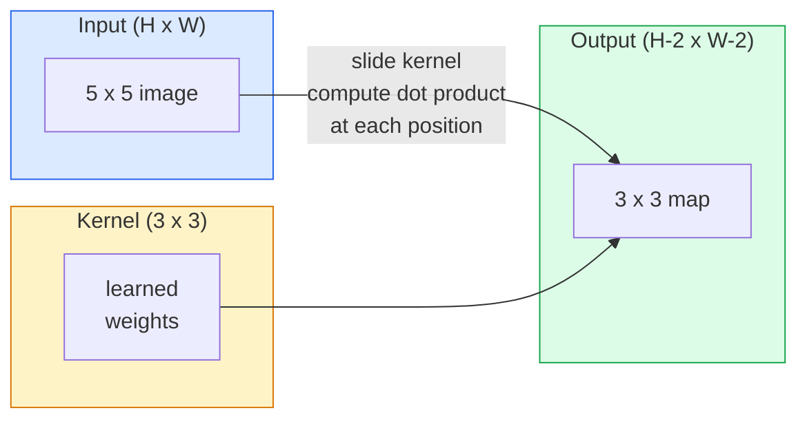
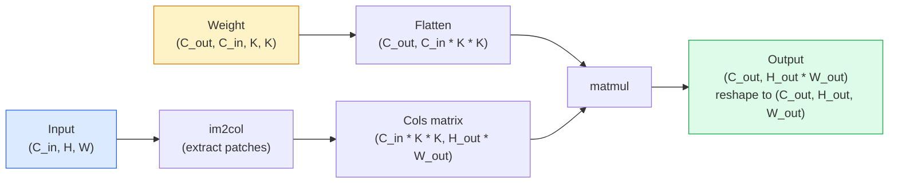

# 从头实现卷积

> 卷积是一个微小的密集层，你将其滑动到图像上，在每个位置共享相同的权重。

**类型：** 构建
**语言：** Python
**前置知识：** 阶段3（深度学习核心），阶段4第01课（图像基础）
**时间：** 约75分钟

## 学习目标

- 仅使用NumPy从头实现2D卷积，包括嵌套循环版本和向量化的`im2col`版本
- 计算任意输入尺寸、卷积核尺寸、填充和步长组合的输出空间尺寸，并证明`im2col`公式
- 手工设计卷积核（边缘、模糊、锐化、Sobel），并解释每个卷积核为何产生特定的激活模式
- 将卷积堆叠成特征提取器，并将堆叠深度与感受野大小联系起来

## 问题

一个全连接层处理224x224的RGB图像，每个神经元需要224 * 224 * 3 = 150,528个输入权重。一个含有1,000个单元的隐藏层就已经有1.5亿个参数——在你学到任何有用的东西之前。更糟糕的是，该层没有意识到左上角的狗和右下角的狗是相同的模式。它将每个像素位置视为独立的，这对于图像来说是恰恰错误的：将猫平移三个像素不应该迫使网络重新学习这个概念。

图像模型需要的两个性质是**平移等变性**（输入平移时输出也平移）和**参数共享**（相同的特征检测器在所有位置运行）。密集层两者都不提供。卷积则免费提供两者。

卷积并非为深度学习而发明。它是支撑JPEG压缩、Photoshop中的高斯模糊、工业视觉中的边缘检测以及所有音频滤波器的相同操作。CNN从2012年到2020年统治ImageNet的原因在于，卷积是对于附近值相关且相同模式可能出现在任何地方的数据的正确先验。

## 核心概念

### 单个卷积核，滑动

2D卷积取一个称为卷积核（或滤波器）的小权重矩阵，将其在输入上滑动，并在每个位置计算逐元素乘积之和。该和成为输出中的一个像素。



一个具体的3x3示例，输入为5x5（无填充，步长为1）：

```
Input X (5 x 5):                Kernel W (3 x 3):

  1  2  0  1  2                   1  0 -1
  0  1  3  1  0                   2  0 -2
  2  1  0  2  1                   1  0 -1
  1  0  2  1  3
  2  1  1  0  1

The kernel slides across every valid 3 x 3 window. Output Y is 3 x 3:

 Y[0,0] = sum( W * X[0:3, 0:3] )
 Y[0,1] = sum( W * X[0:3, 1:4] )
 Y[0,2] = sum( W * X[0:3, 2:5] )
 Y[1,0] = sum( W * X[1:4, 0:3] )
 ... and so on
```

那一个公式——**共享权重、局部性、滑动窗口**——就是整个思想。其余的都是记账工作。

### 输出尺寸公式

给定输入空间尺寸`H`，卷积核尺寸`K`，填充`P`，步长`S`：

```
H_out = floor( (H - K + 2P) / S ) + 1
```

记住这个。你在每个架构中会计算它几十次。

|  场景  |  H  |  K  |  P  |  S  |  H_out  |
|----------|---|---|---|---|-------|
|  有效卷积，无填充  |  32  |  3  |  0  |  1  |  30  |
|  相同卷积（保持尺寸）  |  32  |  3  |  1  |  1  |  32  |
|  下采样2倍  |  32  |  3  |  1  |  2  |  16  |
|  池化2x2  |  32  |  2  |  0  |  2  |  16  |
|  大感受野  |  32  |  7  |  3  |  2  |  16  |

"相同填充"意味着选择P使得当S == 1时H_out == H。对于奇数K，即P = (K - 1) / 2。这就是为什么3x3卷积核占主导地位——它们是最小的具有中心的奇数卷积核。

### 填充

没有填充，每次卷积都会缩小特征图。堆叠20个，你的224x224图像会变成184x184，这会浪费边界上的计算，并使需要匹配形状的残差连接复杂化。

```
Zero padding (P = 1) on a 5 x 5 input:

  0  0  0  0  0  0  0
  0  1  2  0  1  2  0
  0  0  1  3  1  0  0
  0  2  1  0  2  1  0       Now the kernel can centre on pixel
  0  1  0  2  1  3  0       (0, 0) and still have three rows and
  0  2  1  1  0  1  0       three columns of values to multiply.
  0  0  0  0  0  0  0
```

实践中遇到的模式：`zero`（最常见），`reflect`（镜像边缘，避免生成模型中的硬边界），`replicate`（复制边缘），`circular`（环绕，用于环形问题）。

### 步长

步长是滑动的步幅。`stride=1`是默认值。`stride=2`将空间尺寸减半，是在CNN中下采样的经典方式，无需单独的池化层——每个现代架构（ResNet、ConvNeXt、MobileNet）在某处都使用步长卷积代替最大池化。

```
Stride 1 on a 5 x 5 input, 3 x 3 kernel:

  starts: (0,0) (0,1) (0,2)        -> output row 0
          (1,0) (1,1) (1,2)        -> output row 1
          (2,0) (2,1) (2,2)        -> output row 2

  Output: 3 x 3

Stride 2 on the same input:

  starts: (0,0) (0,2)              -> output row 0
          (2,0) (2,2)              -> output row 1

  Output: 2 x 2
```

### 多输入通道

真实图像有三个通道。RGB输入上的3x3卷积实际上是一个3x3x3的体素：每个输入通道一个3x3切片。在每个空间位置，你跨所有三个切片相乘并求和，再加上一个偏置。

```
Input:   (C_in,  H,  W)        3 x 5 x 5
Kernel:  (C_in,  K,  K)        3 x 3 x 3 (one kernel)
Output:  (1,     H', W')       2D map

For a layer that produces C_out output channels, you stack C_out kernels:

Weight:  (C_out, C_in, K, K)   e.g. 64 x 3 x 3 x 3
Output:  (C_out, H', W')       64 x 3 x 3

Parameter count: C_out * C_in * K * K + C_out   (the + C_out is biases)
```

最后一行是你在规划模型时会计算的。一个64通道的3x3卷积，输入3通道，有`64 * 3 * 3 * 3 + 64 = 1,792`个参数。便宜。

### im2col技巧

嵌套循环易于阅读但速度慢。GPU需要大型矩阵乘法。诀窍：将输入的每个感受野窗口展平成一个大矩阵的一列，将卷积核展平成一行，整个卷积就变成了一次矩阵乘法。



每个生产级卷积实现都是此方法加上缓存分块技巧的变体（直接卷积、Winograd、大核FFT卷积）。理解im2col就理解了核心。

### 感受野

单个3x3卷积看9个输入像素。堆叠两个3x3卷积，第二层的一个神经元看到5x5输入像素。三个3x3卷积给出7x7。一般地：

```
RF after L stacked K x K convs (stride 1) = 1 + L * (K - 1)

With strides:   RF grows multiplicatively with stride along each layer.
```

“处处3x3”之所以有效（VGG、ResNet、ConvNeXt），是因为两个3x3卷积能看到与一个5x5卷积相同的输入区域，但参数更少且中间多了个非线性层。

```figure
convolution-kernel
```

## 动手构建

### 步骤1：填充数组

从最小的原语开始：一个在H x W数组周围补零的函数。

```python
import numpy as np

def pad2d(x, p):
    if p == 0:
        return x
    h, w = x.shape[-2:]
    out = np.zeros(x.shape[:-2] + (h + 2 * p, w + 2 * p), dtype=x.dtype)
    out[..., p:p + h, p:p + w] = x
    return out

x = np.arange(9).reshape(3, 3)
print(x)
print()
print(pad2d(x, 1))
```

尾轴技巧`x.shape[:-2]`意味着同一函数无需修改即可用于`(H, W)`、`(C, H, W)`或`(N, C, H, W)`。

### 步骤2：带嵌套循环的二维卷积

参考实现——慢，但明确。这本质上就是`torch.nn.functional.conv2d`所做的。

```python
def conv2d_naive(x, w, b=None, stride=1, padding=0):
    c_in, h, w_in = x.shape
    c_out, c_in_w, kh, kw = w.shape
    assert c_in == c_in_w

    x_pad = pad2d(x, padding)
    h_out = (h + 2 * padding - kh) // stride + 1
    w_out = (w_in + 2 * padding - kw) // stride + 1

    out = np.zeros((c_out, h_out, w_out), dtype=np.float32)
    for oc in range(c_out):
        for i in range(h_out):
            for j in range(w_out):
                hs = i * stride
                ws = j * stride
                patch = x_pad[:, hs:hs + kh, ws:ws + kw]
                out[oc, i, j] = np.sum(patch * w[oc])
        if b is not None:
            out[oc] += b[oc]
    return out
```

四个嵌套循环（输出通道、行、列，加上对C_in、kh、kw的隐式求和）。这是你验证每个更快实现的标准答案。

### 步骤3：用手设计的卷积核验证

构建一个垂直Sobel卷积核，应用到合成阶跃图像上，观察垂直边缘亮起。

```python
def synthetic_step_image():
    img = np.zeros((1, 16, 16), dtype=np.float32)
    img[:, :, 8:] = 1.0
    return img

sobel_x = np.array([
    [[-1, 0, 1],
     [-2, 0, 2],
     [-1, 0, 1]]
], dtype=np.float32)[None]

x = synthetic_step_image()
y = conv2d_naive(x, sobel_x, padding=1)
print(y[0].round(1))
```

期望在列7上得到大的正值（从左到右亮度增加），其他地方为0。这单个打印就是验证数学正确性的完整性检查。

### 步骤4：im2col

将输入中每个与卷积核大小相同的窗口转换为矩阵的一列。对于`C_in=3, K=3`，每列有27个数。

```python
def im2col(x, kh, kw, stride=1, padding=0):
    c_in, h, w = x.shape
    x_pad = pad2d(x, padding)
    h_out = (h + 2 * padding - kh) // stride + 1
    w_out = (w + 2 * padding - kw) // stride + 1

    cols = np.zeros((c_in * kh * kw, h_out * w_out), dtype=x.dtype)
    col = 0
    for i in range(h_out):
        for j in range(w_out):
            hs = i * stride
            ws = j * stride
            patch = x_pad[:, hs:hs + kh, ws:ws + kw]
            cols[:, col] = patch.reshape(-1)
            col += 1
    return cols, h_out, w_out
```

它仍然是一个Python循环，但现在重活将由一个向量化的矩阵乘法完成。

### 步骤5：通过im2col+矩阵乘法实现快速卷积

用一次矩阵乘法替换四重循环。

```python
def conv2d_im2col(x, w, b=None, stride=1, padding=0):
    c_out, c_in, kh, kw = w.shape
    cols, h_out, w_out = im2col(x, kh, kw, stride, padding)
    w_flat = w.reshape(c_out, -1)
    out = w_flat @ cols
    if b is not None:
        out += b[:, None]
    return out.reshape(c_out, h_out, w_out)
```

正确性检查：运行两个实现并比较。

```python
rng = np.random.default_rng(0)
x = rng.normal(0, 1, (3, 16, 16)).astype(np.float32)
w = rng.normal(0, 1, (8, 3, 3, 3)).astype(np.float32)
b = rng.normal(0, 1, (8,)).astype(np.float32)

y_naive = conv2d_naive(x, w, b, padding=1)
y_im2col = conv2d_im2col(x, w, b, padding=1)

print(f"max abs diff: {np.max(np.abs(y_naive - y_im2col)):.2e}")
```

`max abs diff`应该接近`1e-5`——差异是浮点累加顺序造成的，不是bug。

### 步骤6：一组手设计的卷积核

五个滤波器，展示单个卷积层在没有任何训练前能表达什么。

```python
KERNELS = {
    "identity": np.array([[0, 0, 0], [0, 1, 0], [0, 0, 0]], dtype=np.float32),
    "blur_3x3": np.ones((3, 3), dtype=np.float32) / 9.0,
    "sharpen": np.array([[0, -1, 0], [-1, 5, -1], [0, -1, 0]], dtype=np.float32),
    "sobel_x": np.array([[-1, 0, 1], [-2, 0, 2], [-1, 0, 1]], dtype=np.float32),
    "sobel_y": np.array([[-1, -2, -1], [0, 0, 0], [1, 2, 1]], dtype=np.float32),
}

def apply_kernel(img2d, kernel):
    x = img2d[None].astype(np.float32)
    w = kernel[None, None]
    return conv2d_im2col(x, w, padding=1)[0]
```

应用于任何灰度图像，模糊平滑，锐化使边缘清晰，Sobel-x亮起垂直边缘，Sobel-y亮起水平边缘。这正是AlexNet和VGG中训练过的*第一个*卷积层最终学到的模式——因为无论后续任务如何，一个好的图像模型都需要边缘和斑点检测器。

## 使用它

PyTorch的`nn.Conv2d`用自动求导、CUDA内核和cuDNN优化封装了相同操作。形状语义相同。

```python
import torch
import torch.nn as nn

conv = nn.Conv2d(in_channels=3, out_channels=64, kernel_size=3, stride=1, padding=1)
print(conv)
print(f"weight shape: {tuple(conv.weight.shape)}   # (C_out, C_in, K, K)")
print(f"bias shape:   {tuple(conv.bias.shape)}")
print(f"param count:  {sum(p.numel() for p in conv.parameters())}")

x = torch.randn(8, 3, 224, 224)
y = conv(x)
print(f"\ninput  shape: {tuple(x.shape)}")
print(f"output shape: {tuple(y.shape)}")
```

将`padding=1`换成`padding=0`，输出降为222x222。将`stride=1`换成`stride=2`，输出降为112x112。与你上面记住的公式相同。

## 发布

本課(lesson)产出：

- `outputs/prompt-cnn-architect.md`——一个提示，给定输入尺寸、参数预算和目标感受野，设计一个每一步都有正确K/S/P的`Conv2d`层堆叠。
- `outputs/prompt-cnn-architect.md`——一种技能，逐层遍历网络说明，返回每个块的输出形状、感受野和参数数量。

## 练习

1. **(简单)** 给定128x128灰度输入和一堆`[Conv3x3(s=1,p=1), Conv3x3(s=2,p=1), Conv3x3(s=1,p=1), Conv3x3(s=2,p=1)]`，手动计算每层的输出空间尺寸和感受野。用虚拟卷积的PyTorch `nn.Sequential`验证。
2. **(中等)** 扩展`[Conv3x3(s=1,p=1), Conv3x3(s=2,p=1), Conv3x3(s=1,p=1), Conv3x3(s=2,p=1)]`和`nn.Sequential`以接受`conv2d_naive`参数。证明`conv2d_im2col`复制了深度可分离卷积，其参数数量是`groups`而不是`groups=C_in=C_out`。
3. **(困难)** 手动实现`[Conv3x3(s=1,p=1), Conv3x3(s=2,p=1), Conv3x3(s=1,p=1), Conv3x3(s=2,p=1)]`的反向传播：给定输出的梯度，计算`nn.Sequential`和`conv2d_naive`的梯度。在相同输入和权重上对照`conv2d_im2col`验证。技巧：im2col的梯度是`groups`，并且必须累积重叠窗口。

## 关键术语

|  术语  |  人们的说法  |  实际含义  |
|------|----------------|----------------------|
| 卷积  |  "滑动滤波器"  |  在每个空间位置应用的可学习点积，权重共享；数学上是互相关，但大家都称之为卷积 |
| 卷积核/滤波器  |  "特征检测器"  |  形状为(C_in, K, K)的小权重张量，与输入窗口的点积产生一个输出像素 |
|  步长 (Stride)  |  "你跳跃的距离"  |  连续卷积核放置之间的步长；步长为 2 时每个空间维度减半  |
|  填充 (Padding)  |  "边缘补零"  |  在输入周围添加额外值，以便卷积核能够居中于边界像素；`same` 填充使输出尺寸等于输入尺寸  |
|  感受野 (Receptive field)  |  "神经元看到多少"  |  给定输出激活所依赖的原始输入区域，随深度和步长增大而扩大  |
|  im2col  |  "GEMM 技巧"  |  将每个感受窗重排为列，使卷积变为一次大矩阵乘法——每个快速卷积核的核心  |
|  深度可分离卷积 (Depthwise conv)  |  "每个通道一个卷积核"  |  使用 `groups == C_in` 的卷积，每个输出通道仅从对应输入通道计算；是 MobileNet 和 ConvNeXt 的骨干  |
|  平移等变性 (Translation equivariance)  |  "输入平移，输出平移"  |  输入平移 k 个像素导致输出平移 k 个像素的性质；由共享权重自然实现  |

## 延伸阅读

- [A guide to convolution arithmetic for deep learning (Dumoulin & Visin, 2016)](https://arxiv.org/abs/1603.07285) — 每个课程悄悄引用的填充/步长/膨胀权威图解
- [A guide to convolution arithmetic for deep learning (Dumoulin & Visin, 2016)](https://arxiv.org/abs/1603.07285) — 经典讲义，包含原始 im2col 解释
- [A guide to convolution arithmetic for deep learning (Dumoulin & Visin, 2016)](https://arxiv.org/abs/1603.07285) — 从手动卷积到训练数字分类器的逐步教程笔记本
- [A guide to convolution arithmetic for deep learning (Dumoulin & Visin, 2016)](https://arxiv.org/abs/1603.07285) — 论文质量的感受野计算交互式解释器
