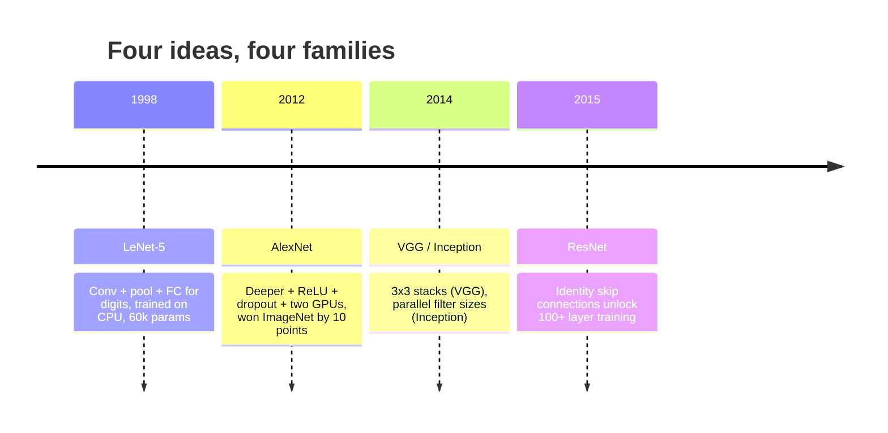
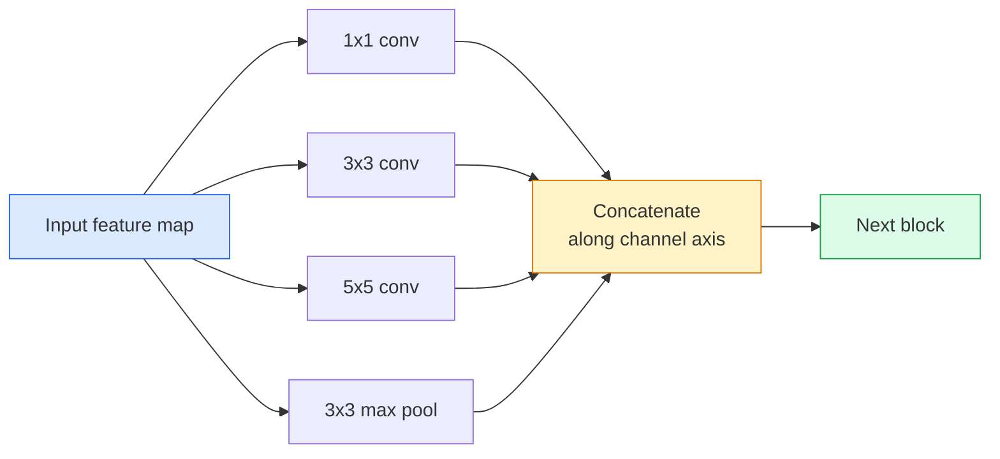
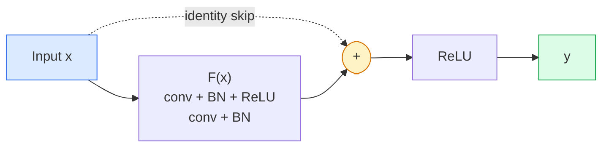

# CNN——从LeNet到ResNet

> 过去三十年的每一个主要CNN都是相同的卷积-非线性-下采样配方，再加上一个新想法。按顺序学习这些想法。

**类型：** 学习+构建
**语言：** Python
**先修知识：** 阶段3第11课（PyTorch）、阶段4第01课（图像基础）、阶段4第02课（从头实现卷积）
**时间：** 约75分钟

## 学习目标

- 追溯LeNet-5 -> AlexNet -> VGG -> Inception -> ResNet的架构谱系，并说明每个系列贡献的单一新想法
- 在PyTorch中实现LeNet-5、VGG风格块和ResNet BasicBlock，每个不超过40行
- 解释为什么残差连接(Residual Connection)将1000层网络从不可训练变为最先进
- 在查看源码之前，读取现代骨干网络（ResNet-18、ResNet-50）并预测其输出形状、感受野和参数数量

## 问题

2011年，最好的ImageNet分类器达到约74%的top-5准确率。2012年AlexNet达到85%。2015年ResNet达到96%。没有新数据。没有新GPU。这些进步来自架构思想。一位实战计算机视觉工程师必须知道每个想法来自哪篇论文，因为你在2026年部署的每个生产骨干网络都是这些相同元素的重新组合——而且这些思想在不断迁移：分组卷积(Grouped Convolution)从CNN传到Transformer，残差连接(Residual Connection)从ResNet传到每个现有的大语言模型，批量归一化(Batch Normalisation)存在于扩散模型中。

按顺序学习这些网络还能让你避免一个常见错误：当LeNet规模的网络就能解决问题时，却去选择最大的可用模型。MNIST不需要ResNet。了解每个系列的扩展曲线会告诉你在曲线上的位置。

## 核心概念

### 改变视觉领域的四个想法



经典视觉领域中没有其他东西比这四个飞跃更重要。

### LeNet-5（1998年）

Yann LeCun的数字识别器。6万个参数。两个卷积-池化块，两个全连接层，tanh激活函数。它定义了每个CNN继承的模板：

```
input (1, 32, 32)
  conv 5x5 -> (6, 28, 28)
  avg pool 2x2 -> (6, 14, 14)
  conv 5x5 -> (16, 10, 10)
  avg pool 2x2 -> (16, 5, 5)
  flatten -> 400
  dense -> 120
  dense -> 84
  dense -> 10
```

现代世界称为CNN的一切——交替卷积和下采样，然后送入小的分类头——就是层数更多、通道更大、激活函数更好的LeNet。

### AlexNet（2012年）

三个共同突破ImageNet的变化：

1. **ReLU**代替tanh。梯度不再消失。训练速度提升六倍。
2. **Dropout**在全连接头中。正则化成为一个层，而非技巧。
3. **深度和宽度**。五个卷积层，三个全连接层，6000万个参数，在两个GPU上训练，模型在它们之间分割。

论文的图2仍然将GPU分割显示为两个并行流。这种并行性是一种硬件变通方法，而非架构洞见——但上述三个想法仍然存在于你使用的每个模型中。

### VGG（2014年）

VGG问：如果只使用3x3卷积并加深网络，会发生什么？

```
stack:   conv 3x3 -> conv 3x3 -> pool 2x2
repeat:  16 or 19 conv layers
```

两个3x3卷积与一个5x5卷积看到的输入区域相同，但参数更少（2*9*C^2 = 18C^2 对比 25*C^2），并且中间多了一个ReLU。VGG将这个观察变成了一个完整的架构。其简单性——一个块类型，重复使用——使其成为后来所有架构的参考点。

代价：1.38亿个参数，训练慢，推理成本高。

### Inception（2014年，同年）

Google对“应该使用什么卷积核大小？”的回答是：全部，并行使用。



每个分支各有专长——1x1用于通道混合，3x3用于局部纹理，5x5用于更大模式，池化用于平移不变特征——拼接(concat)让下一层选择有用的分支。Inception v1在每个分支内部使用1x1卷积作为瓶颈，以保持参数数量合理。

### 退化问题

到2015年，VGG-19可行而VGG-32不行。深度本应有所帮助，但超过约20层后，训练和测试损失都变得更糟。这不是过拟合。这是优化器无法找到有用的权重，因为梯度在每一层中乘法地缩小。

```
Plain deep network:
  y = f_L( f_{L-1}( ... f_1(x) ... ) )

Gradient wrt early layer:
  dL/dW_1 = dL/dy * df_L/df_{L-1} * ... * df_2/df_1 * df_1/dW_1

Each multiplicative term has magnitude roughly (weight magnitude) * (activation gain).
Stack 100 of them with gains < 1 and the gradient is effectively zero.
```

VGG在19层时有效，因为批量归一化（同时发表）保持了激活的良好尺度。但即使批量归一化也无法挽救超过30层左右的深度。

### ResNet（2015年）

He、Zhang、Ren、Sun提出了一个改变，解决了所有问题：

```
standard block:   y = F(x)
residual block:   y = F(x) + x
```

`+ x`表示该层总是可以选择通过将`F(x)`驱动为零来什么都不做。一个1000层的ResNet现在至多和一个1层网络一样差，因为每个额外的块都有一个简单的逃生口。有了这个保证，优化器愿意让每个块*稍微*有用——而稍微有用，堆叠100次，就是最先进的。



该块的两种变体随处可见：

- **BasicBlock**（ResNet-18、ResNet-34）：两个3x3卷积，跳过两者。
- **Bottleneck**（ResNet-50、-101、-152）：1x1降维，3x3中间，1x1升维，跳过三者。当通道数高时更便宜。

当跳跃连接需要跨过下采样（stride=2）时，恒等路径被替换为1x1步长为2的卷积以匹配形状。

### 为什么残差结构在视觉之外也重要

这个想法其实并非关于图像分类。它是将深度网络从"祈祷梯度存活"变成一种可靠、可扩展的工程工具。你接下来会读到的每个Transformer都在每个块中拥有完全相同的跳跃连接。没有ResNet，就没有GPT。

```figure
pooling
```

## 动手构建

### 第一步：LeNet-5

一个最小、忠实的LeNet。使用Tanh激活函数和平均池化(Average Pooling)。唯一向现代技术妥协的是我们在下游使用`nn.CrossEntropyLoss`代替原来的高斯连接(Gaussian Connections)。

```python
import torch
import torch.nn as nn
import torch.nn.functional as F

class LeNet5(nn.Module):
    def __init__(self, num_classes=10):
        super().__init__()
        self.conv1 = nn.Conv2d(1, 6, kernel_size=5)
        self.conv2 = nn.Conv2d(6, 16, kernel_size=5)
        self.pool = nn.AvgPool2d(2)
        self.fc1 = nn.Linear(16 * 5 * 5, 120)
        self.fc2 = nn.Linear(120, 84)
        self.fc3 = nn.Linear(84, num_classes)

    def forward(self, x):
        x = self.pool(torch.tanh(self.conv1(x)))
        x = self.pool(torch.tanh(self.conv2(x)))
        x = torch.flatten(x, 1)
        x = torch.tanh(self.fc1(x))
        x = torch.tanh(self.fc2(x))
        return self.fc3(x)

net = LeNet5()
x = torch.randn(1, 1, 32, 32)
print(f"output: {net(x).shape}")
print(f"params: {sum(p.numel() for p in net.parameters()):,}")
```

预期输出：`output: torch.Size([1, 10])`，`params: 61,706`。这就是开启现代视觉的数字分类器。

### 第二步：一个VGG块

一个可复用的块：两个3x3卷积，ReLU，批归一化(Batch Normalization)，最大池化(Max Pooling)。

```python
class VGGBlock(nn.Module):
    def __init__(self, in_c, out_c):
        super().__init__()
        self.conv1 = nn.Conv2d(in_c, out_c, kernel_size=3, padding=1)
        self.bn1 = nn.BatchNorm2d(out_c)
        self.conv2 = nn.Conv2d(out_c, out_c, kernel_size=3, padding=1)
        self.bn2 = nn.BatchNorm2d(out_c)
        self.pool = nn.MaxPool2d(2)

    def forward(self, x):
        x = F.relu(self.bn1(self.conv1(x)))
        x = F.relu(self.bn2(self.conv2(x)))
        return self.pool(x)

class MiniVGG(nn.Module):
    def __init__(self, num_classes=10):
        super().__init__()
        self.stack = nn.Sequential(
            VGGBlock(3, 32),
            VGGBlock(32, 64),
            VGGBlock(64, 128),
        )
        self.head = nn.Sequential(
            nn.AdaptiveAvgPool2d(1),
            nn.Flatten(),
            nn.Linear(128, num_classes),
        )

    def forward(self, x):
        return self.head(self.stack(x))

net = MiniVGG()
x = torch.randn(1, 3, 32, 32)
print(f"output: {net(x).shape}")
print(f"params: {sum(p.numel() for p in net.parameters()):,}")
```

三个VGG块处理CIFAR大小的输入，一个自适应池化(Adaptive Pooling)，一个线性层。约29万参数。对CIFAR-10来说绰绰有余。

### 第三步：一个ResNet基本块(BasicBlock)

ResNet-18和ResNet-34的核心构建块。

```python
class BasicBlock(nn.Module):
    def __init__(self, in_c, out_c, stride=1):
        super().__init__()
        self.conv1 = nn.Conv2d(in_c, out_c, kernel_size=3, stride=stride, padding=1, bias=False)
        self.bn1 = nn.BatchNorm2d(out_c)
        self.conv2 = nn.Conv2d(out_c, out_c, kernel_size=3, stride=1, padding=1, bias=False)
        self.bn2 = nn.BatchNorm2d(out_c)
        if stride != 1 or in_c != out_c:
            self.shortcut = nn.Sequential(
                nn.Conv2d(in_c, out_c, kernel_size=1, stride=stride, bias=False),
                nn.BatchNorm2d(out_c),
            )
        else:
            self.shortcut = nn.Identity()

    def forward(self, x):
        out = F.relu(self.bn1(self.conv1(x)))
        out = self.bn2(self.conv2(out))
        out = out + self.shortcut(x)
        return F.relu(out)
```

`bias=False`在卷积层上是一种批归一化惯例——BN的beta参数已经处理了偏置，因此携带卷积偏置是浪费。`shortcut`只在步长或通道数变化时才需要真正的卷积；否则它是一个无操作的恒等映射。

### 第四步：一个小型ResNet

堆叠四个BasicBlock组来构建一个适用于CIFAR大小输入的ResNet。

```python
class TinyResNet(nn.Module):
    def __init__(self, num_classes=10):
        super().__init__()
        self.stem = nn.Sequential(
            nn.Conv2d(3, 32, kernel_size=3, stride=1, padding=1, bias=False),
            nn.BatchNorm2d(32),
            nn.ReLU(inplace=True),
        )
        self.layer1 = self._make_group(32, 32, num_blocks=2, stride=1)
        self.layer2 = self._make_group(32, 64, num_blocks=2, stride=2)
        self.layer3 = self._make_group(64, 128, num_blocks=2, stride=2)
        self.layer4 = self._make_group(128, 256, num_blocks=2, stride=2)
        self.head = nn.Sequential(
            nn.AdaptiveAvgPool2d(1),
            nn.Flatten(),
            nn.Linear(256, num_classes),
        )

    def _make_group(self, in_c, out_c, num_blocks, stride):
        blocks = [BasicBlock(in_c, out_c, stride=stride)]
        for _ in range(num_blocks - 1):
            blocks.append(BasicBlock(out_c, out_c, stride=1))
        return nn.Sequential(*blocks)

    def forward(self, x):
        x = self.stem(x)
        x = self.layer1(x)
        x = self.layer2(x)
        x = self.layer3(x)
        x = self.layer4(x)
        return self.head(x)

net = TinyResNet()
x = torch.randn(1, 3, 32, 32)
print(f"output: {net(x).shape}")
print(f"params: {sum(p.numel() for p in net.parameters()):,}")
```

每组两个块。第2、3、4组起始处步长为2。每次下采样时通道数加倍。约280万参数。这是能干净地扩展到ResNet-152的标准配方。

### 第五步：比较参数与特征效率

对三个网络输入相同的样本，比较参数量。

```python
def summary(name, net, x):
    y = net(x)
    params = sum(p.numel() for p in net.parameters())
    print(f"{name:12s}  input {tuple(x.shape)} -> output {tuple(y.shape)}  params {params:>10,}")

x = torch.randn(1, 3, 32, 32)
summary("LeNet5",     LeNet5(),       torch.randn(1, 1, 32, 32))
summary("MiniVGG",    MiniVGG(),      x)
summary("TinyResNet", TinyResNet(),   x)
```

三个模型，三个时代，三个量级的参数量。对于CIFAR-10准确率，经过几轮训练后大致需要：LeNet 60%，MiniVGG 89%，TinyResNet 93%。

## 使用它

`torchvision.models`提供所有上述网络的预训练版本。不同系列的调用签名完全相同，这正是骨干网络抽象(Backbone Abstraction)的意义所在。

```python
from torchvision.models import resnet18, ResNet18_Weights, vgg16, VGG16_Weights

r18 = resnet18(weights=ResNet18_Weights.IMAGENET1K_V1)
r18.eval()

print(f"ResNet-18 params: {sum(p.numel() for p in r18.parameters()):,}")
print(r18.layer1[0])
print()

v16 = vgg16(weights=VGG16_Weights.IMAGENET1K_V1)
v16.eval()
print(f"VGG-16   params: {sum(p.numel() for p in v16.parameters()):,}")
```

ResNet-18有1170万参数。VGG-16有1.38亿参数。ImageNet top-1准确率相近（69.8% vs 71.6%）。残差连接带来了12倍的参数效率优势。这就是从2016年到2021年ViT出现之前ResNet变体占据主导地位的原因——并且在计算资源受限的实际部署中仍然占据主导地位。

对于迁移学习(Transfer Learning)，配方总是相同的：加载预训练模型，冻结骨干网络，替换分类器头部。

```python
for p in r18.parameters():
    p.requires_grad = False
r18.fc = nn.Linear(r18.fc.in_features, 10)
```

三行代码。你现在有了一个10类CIFAR分类器，它继承了ImageNet支付过的表示。

## 发布

本課(lesson)产出：

- `outputs/prompt-backbone-selector.md`——一个提示，根据任务、数据集大小和计算预算选择合适的CNN系列（LeNet/VGG/ResNet/MobileNet/ConvNeXt）。
- `outputs/prompt-backbone-selector.md`——一项技能，读取PyTorch模块并标记跳跃连接错误（步长变化时缺少快捷连接、快捷连接激活顺序错误、BN放置位置相对于加法错误）。

## 练习

1. **(简单)** 手动逐层计算`TinyResNet`的参数数量。与`sum(p.numel() for p in net.parameters())`比较。大部分参数预算去了哪里——卷积、BN还是分类器头部？
2. **(中等)** 实现Bottleneck块（1x1 -> 3x3 -> 1x1带跳跃连接），并用它构建一个适用于CIFAR的ResNet-50风格网络。与`TinyResNet`比较参数量。
3. **(困难)** 移除`TinyResNet`中的跳跃连接，在CIFAR-10上训练一个34块的"普通"网络和一个34块ResNet，各10个epoch。绘制两个网络的训练损失与epoch曲线。复现He等人论文中图1的结果：普通深层网络收敛到比它更浅的双胞胎网络更高的损失。

## 关键术语

|  术语  |  人们的说法  |  实际含义  |
|------|----------------|----------------------|
|  主干网络(Backbone)  |  "模型"  |  产生输入给任务头部的特征图的卷积块堆叠  |
|  残差连接(Residual connection)  |  "跳跃连接"  |  `y = F(x) + x`；允许优化器通过将F置为零来学习恒等映射，从而使任意深度可训练  |
|  基本块(BasicBlock)  |  "带跳跃连接的两个3x3卷积"  |  ResNet-18/34构建块：卷积-BN-ReLU-卷积-BN-加法-ReLU  |
|  瓶颈块(Bottleneck)  |  "1x1降维，3x3，1x1升维"  |  ResNet-50/101/152块；在高通道数时便宜，因为3x3在缩减宽度上运行  |
|  退化问题(Degradation problem)  |  "越深越差"  |  超过约20个普通卷积层后，训练和测试误差均增加；由残差连接解决，而非更多数据  |
|  起点(Stem)  |  "第一层"  |  将3通道输入转换为基础特征宽度的初始卷积；对于ImageNet通常是7x7步长2，对于CIFAR是3x3步长1  |
| 头部 | "分类器" | 最后一个主干块之后的层：自适应池化、展平、线性层 |
| 迁移学习 | "预训练权重" | 加载在ImageNet上训练的主干，并仅针对你的任务微调头部 |

## 延伸阅读

- [Deep Residual Learning for Image Recognition (He et al., 2015)](https://arxiv.org/abs/1512.03385) — ResNet论文；每一张图都值得研究
- [Deep Residual Learning for Image Recognition (He et al., 2015)](https://arxiv.org/abs/1512.03385) — VGG论文；仍然是关于"为什么用3x3"的最佳参考
- [Deep Residual Learning for Image Recognition (He et al., 2015)](https://arxiv.org/abs/1512.03385) — AlexNet；结束了手工特征时代的论文
- [Deep Residual Learning for Image Recognition (He et al., 2015)](https://arxiv.org/abs/1512.03385) — Inception v1；并行滤波器思想至今仍出现在视觉Transformer中
