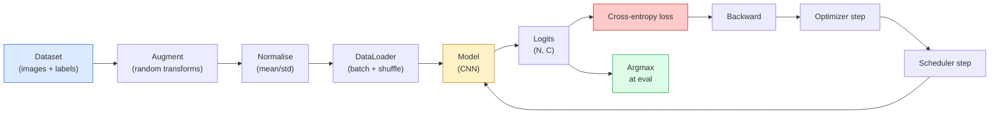

# 图像分类

> 分类器是从像素到类别概率分布的函数。其他一切都是管道。

**类型：**构建
**语言：**Python
**前置条件：**阶段2第09课（模型评估），阶段3第10课（迷你框架），阶段4第03课（CNN）
**时间：**约75分钟

## 学习目标

- 在CIFAR-10上构建端到端图像分类管道：数据集、数据增强、模型、训练循环、评估
- 解释每个组件（数据加载器、损失函数、优化器、学习率调度器、数据增强）的作用，并预测任何一个组件损坏时损失曲线的表现
- 从头实现mixup、cutout和标签平滑，并说明何时值得添加它们
- 阅读混淆矩阵和按类别的精确率/召回率表格，以诊断超出总体准确率的数据集和模型故障

## 问题

每个上线的视觉任务在某种程度上都归结为图像分类。检测对区域进行分类。分割对像素进行分类。检索通过与类别中心点的相似度进行排序。正确进行图像分类——数据集循环、数据增强策略、损失函数、评估——是迁移到该阶段所有其他任务的核心技能。

大多数分类问题不在模型本身。它们存在于管道中：归一化错误、未打乱的训练集、扭曲标签的数据增强、被训练数据污染的验证集分割、在第30个epoch后无声发散的学习率。一个在正确设置下能在CIFAR-10上达到93%准确率的CNN，在错误管道下通常只能达到70-75%，而且损失曲线看起来始终合理。

本课程手动构建整个管道，使每个部分都可检查。你不会使用任何可能隐藏问题的`torchvision.datasets`。

## 核心概念

### 分类管道



这个循环中的每一行都可能是bug藏身之处。交叉熵接收的是原始logits而不是softmax输出，因此在损失函数之前对logits做任何`model(x).softmax()`都会计算错误的梯度。数据增强只应用于输入，而不应用于标签——除了mixup，它同时混合输入和标签。`optimizer.zero_grad()`必须在每一步执行一次；跳过它会累积梯度，看起来像是学习率极其不稳定。这些错误中的每一个都会使学习曲线变平，而不会抛出错误。

### 交叉熵、logits和softmax

分类器为每个图像产生`C`个数字，称为logits。应用softmax将其转换为概率分布：

```
softmax(z)_i = exp(z_i) / sum_j exp(z_j)
```

交叉熵衡量正确类别的负对数概率：

```
CE(z, y) = -log( softmax(z)_y )
        = -z_y + log( sum_j exp(z_j) )
```

右侧形式是数值稳定的形式（log-sum-exp）。PyTorch的`nn.CrossEntropyLoss`在一个操作中融合了softmax和负对数似然，并直接接收原始logits。先自己应用softmax几乎总是一个错误——你计算的是log(softmax(softmax(z)))，这是一个无意义的量。

### 为什么数据增强有效

CNN具有平移的归纳偏置（来自权重共享），但对裁剪、翻转、颜色抖动或遮挡没有内置的不变性。教会它这些不变性的唯一方法是展示应用了这些变换的像素。训练期间的每个随机变换都是一种方式，表明：“这两张图像具有相同标签；学习忽略差异的特征。”

```
Original crop:  "dog facing left"
Flip:           "dog facing right"       <- same label, different pixels
Rotate(+15):    "dog, slight tilt"
Colour jitter:  "dog in warmer light"
RandomErasing:  "dog with patch missing"
```

规则：数据增强必须保持标签不变。对数字进行cutout和旋转可能会将“6”变成“9”；对于该数据集，使用较小的旋转范围并选择尊重数字特定不变性的数据增强。

### Mixup和CutMix

普通数据增强变换像素但保持标签为独热编码。**Mixup**和**CutMix**通过插值两者打破了这一点。

```
Mixup:
  lambda ~ Beta(a, a)
  x = lambda * x_i + (1 - lambda) * x_j
  y = lambda * y_i + (1 - lambda) * y_j

Cutmix:
  paste a random rectangle of x_j into x_i
  y = area-weighted mix of y_i and y_j
```

为什么有帮助：模型停止记忆尖锐的独热目标，并学会在类别之间插值。训练损失上升，测试准确率上升。这是任何分类器最便宜的鲁棒性升级。

### 标签平滑

Mixup的近亲。不是针对`[0, 0, 1, 0, 0]`进行训练，而是针对`[eps/C, eps/C, 1-eps, eps/C, eps/C]`进行训练，使用较小的`eps`（如0.1）。阻止模型产生任意尖锐的logits，并以几乎零成本改善校准。自PyTorch 1.10起内置于`nn.CrossEntropyLoss(label_smoothing=0.1)`中。

### 超越准确率的评估

总体准确率隐藏了不平衡。一个90-10的二分类器如果总是预测多数类，准确率为90%。真正告诉你发生了什么工具：

- **按类别准确率**——每个类别一个数字；立即发现性能不佳的类别。
- **混淆矩阵**——C×C网格，行i列j = 真实类别i预测为类别j的数量；对角线是正确的，非对角线是你的模型出错的地方。
- **Top-1 / Top-5**——正确类别是否在top 1或top 5预测中；Top-5对ImageNet很重要，因为像“Norwich梗” vs “Norfolk梗”这样的类别确实有歧义。
- **校准（ECE）**——0.8置信度的预测是否80%的时间正确？现代网络系统性地过度自信；通过温度缩放或标签平滑修复。

```figure
receptive-field
```

## 动手构建

### 步骤1：确定性合成数据集

CIFAR-10存储在磁盘上。为了使本课程可复现且快速，我们构建一个看起来像CIFAR的合成数据集——32x32 RGB图像，具有模型必须学习的类别特定结构。完全相同的管道可直接在真实CIFAR-10上工作。

```python
import numpy as np
import torch
from torch.utils.data import Dataset


def synthetic_cifar(num_per_class=1000, num_classes=10, seed=0):
    rng = np.random.default_rng(seed)
    X = []
    Y = []
    for c in range(num_classes):
        centre = rng.uniform(0, 1, (3,))
        freq = 2 + c
        for _ in range(num_per_class):
            yy, xx = np.meshgrid(np.linspace(0, 1, 32), np.linspace(0, 1, 32), indexing="ij")
            r = np.sin(xx * freq) * 0.5 + centre[0]
            g = np.cos(yy * freq) * 0.5 + centre[1]
            b = (xx + yy) * 0.5 * centre[2]
            img = np.stack([r, g, b], axis=-1)
            img += rng.normal(0, 0.08, img.shape)
            img = np.clip(img, 0, 1)
            X.append(img.astype(np.float32))
            Y.append(c)
    X = np.stack(X)
    Y = np.array(Y)
    idx = rng.permutation(len(X))
    return X[idx], Y[idx]


class ArrayDataset(Dataset):
    def __init__(self, X, Y, transform=None):
        self.X = X
        self.Y = Y
        self.transform = transform

    def __len__(self):
        return len(self.X)

    def __getitem__(self, i):
        img = self.X[i]
        if self.transform is not None:
            img = self.transform(img)
        img = torch.from_numpy(img).permute(2, 0, 1)
        return img, int(self.Y[i])
```

每个类别有自己的调色板和频率模式，加上高斯噪声，迫使模型学习信号而非记忆像素。十个类别，每个类别一千张图像，已排列。

### 步骤2：归一化和数据增强

每个视觉管道都有的两个变换。

```python
def standardize(mean, std):
    mean = np.array(mean, dtype=np.float32)
    std = np.array(std, dtype=np.float32)
    def _fn(img):
        return (img - mean) / std
    return _fn


def random_hflip(p=0.5):
    def _fn(img):
        if np.random.random() < p:
            return img[:, ::-1, :].copy()
        return img
    return _fn


def random_crop(pad=4):
    def _fn(img):
        h, w = img.shape[:2]
        padded = np.pad(img, ((pad, pad), (pad, pad), (0, 0)), mode="reflect")
        y = np.random.randint(0, 2 * pad)
        x = np.random.randint(0, 2 * pad)
        return padded[y:y + h, x:x + w, :]
    return _fn


def compose(*fns):
    def _fn(img):
        for fn in fns:
            img = fn(img)
        return img
    return _fn
```

在裁剪之前使用反射填充而不是零填充，因为黑色边框是模型会以非有用方式学习忽略的信号。

### 步骤 3：混合(Mixup)

在训练步骤中将两张图片和两个标签混合。实现为批次变换，因此它位于前向传播旁边而不是数据集内部。

```python
def mixup_batch(x, y, num_classes, alpha=0.2):
    if alpha <= 0:
        return x, torch.nn.functional.one_hot(y, num_classes).float()
    lam = float(np.random.beta(alpha, alpha))
    idx = torch.randperm(x.size(0), device=x.device)
    x_mixed = lam * x + (1 - lam) * x[idx]
    y_onehot = torch.nn.functional.one_hot(y, num_classes).float()
    y_mixed = lam * y_onehot + (1 - lam) * y_onehot[idx]
    return x_mixed, y_mixed


def soft_cross_entropy(logits, soft_targets):
    log_probs = torch.log_softmax(logits, dim=-1)
    return -(soft_targets * log_probs).sum(dim=-1).mean()
```

`soft_cross_entropy` 是针对软标签分布(soft-label distribution)的交叉熵(Cross-entropy)。当目标恰好是独热编码(one-hot)时，它退化为通常的独热情况。

### 步骤 4：训练循环

完整配方：对数据遍历一次，每批次计算一次梯度，每轮(epoch)更新一次调度器(scheduler)。

```python
import torch
import torch.nn as nn
from torch.utils.data import DataLoader
from torch.optim import SGD
from torch.optim.lr_scheduler import CosineAnnealingLR

def train_one_epoch(model, loader, optimizer, device, num_classes, use_mixup=True):
    model.train()
    total, correct, loss_sum = 0, 0, 0.0
    for x, y in loader:
        x, y = x.to(device), y.to(device)
        if use_mixup:
            x_m, y_soft = mixup_batch(x, y, num_classes)
            logits = model(x_m)
            loss = soft_cross_entropy(logits, y_soft)
        else:
            logits = model(x)
            loss = nn.functional.cross_entropy(logits, y, label_smoothing=0.1)
        optimizer.zero_grad()
        loss.backward()
        optimizer.step()
        loss_sum += loss.item() * x.size(0)
        total += x.size(0)
        # Training accuracy vs the un-mixed labels `y` is only an approximation
        # when mixup is on (the model saw soft targets, not y). Treat it as a
        # rough progress signal; rely on val accuracy for real performance.
        with torch.no_grad():
            pred = logits.argmax(dim=-1)
            correct += (pred == y).sum().item()
    return loss_sum / total, correct / total


@torch.no_grad()
def evaluate(model, loader, device, num_classes):
    model.eval()
    total, correct = 0, 0
    loss_sum = 0.0
    cm = torch.zeros(num_classes, num_classes, dtype=torch.long)
    for x, y in loader:
        x, y = x.to(device), y.to(device)
        logits = model(x)
        loss = nn.functional.cross_entropy(logits, y)
        pred = logits.argmax(dim=-1)
        for t, p in zip(y.cpu(), pred.cpu()):
            cm[t, p] += 1
        loss_sum += loss.item() * x.size(0)
        total += x.size(0)
        correct += (pred == y).sum().item()
    return loss_sum / total, correct / total, cm
```

编写训练循环时每次都要检查的五个不变量(Invariants)：

1. `model.train()` 在训练之前，`model.eval()` 在评估之前——切换丢弃(Dropout)和批归一化(BatchNorm)的行为。
2. `model.train()` 在 `model.eval()` 之前。
3. `model.train()` 在累积指标(Accumulating Metrics)时，以防止计算图(Computation Graph)保持活跃。
4. `model.train()` 在评估期间——节省内存和时间，防止细微错误。
5. 对原始对数(Logits)取 Argmax，而非对 Softmax——结果相同，但少一个操作。

### 步骤 5：整合

使用上一课的 `TinyResNet`，训练几个轮次，评估。

```python
from main import synthetic_cifar, ArrayDataset
from main import standardize, random_hflip, random_crop, compose
from main import mixup_batch, soft_cross_entropy
from main import train_one_epoch, evaluate
# TinyResNet comes from the previous lesson (03-cnns-lenet-to-resnet).
# Adjust the import path to wherever you stored the previous lesson's code.
from cnns_lenet_to_resnet import TinyResNet  # example placeholder

X, Y = synthetic_cifar(num_per_class=500)
split = int(0.9 * len(X))
X_train, Y_train = X[:split], Y[:split]
X_val, Y_val = X[split:], Y[split:]

mean = [0.5, 0.5, 0.5]
std = [0.25, 0.25, 0.25]
train_tf = compose(random_hflip(), random_crop(pad=4), standardize(mean, std))
eval_tf = standardize(mean, std)

train_ds = ArrayDataset(X_train, Y_train, transform=train_tf)
val_ds = ArrayDataset(X_val, Y_val, transform=eval_tf)

train_loader = DataLoader(train_ds, batch_size=128, shuffle=True, num_workers=0)
val_loader = DataLoader(val_ds, batch_size=256, shuffle=False, num_workers=0)

device = "cuda" if torch.cuda.is_available() else "cpu"
model = TinyResNet(num_classes=10).to(device)
optimizer = SGD(model.parameters(), lr=0.1, momentum=0.9, weight_decay=5e-4, nesterov=True)
scheduler = CosineAnnealingLR(optimizer, T_max=10)

for epoch in range(10):
    tr_loss, tr_acc = train_one_epoch(model, train_loader, optimizer, device, 10, use_mixup=True)
    va_loss, va_acc, _ = evaluate(model, val_loader, device, 10)
    scheduler.step()
    print(f"epoch {epoch:2d}  lr {scheduler.get_last_lr()[0]:.4f}  "
          f"train {tr_loss:.3f}/{tr_acc:.3f}  val {va_loss:.3f}/{va_acc:.3f}")
```

在合成数据集上，这能在五个轮次内达到接近完美的验证准确率，这正是关键所在：流程正确，模型可以学习可学习的内容。将数据集替换为真实的 CIFAR-10，相同的循环无需更改即可训练至约 90% 的准确率。

### 步骤 6：阅读混淆矩阵(Confusion Matrix)

仅凭准确率永远无法告知模型在何处失败。混淆矩阵可以。

```python
def print_confusion(cm, labels=None):
    c = cm.shape[0]
    labels = labels or [str(i) for i in range(c)]
    print(f"{'':>6}" + "".join(f"{l:>5}" for l in labels))
    for i in range(c):
        row = cm[i].tolist()
        print(f"{labels[i]:>6}" + "".join(f"{v:>5}" for v in row))
    print()
    tp = cm.diag().float()
    fp = cm.sum(dim=0).float() - tp
    fn = cm.sum(dim=1).float() - tp
    prec = tp / (tp + fp).clamp_min(1)
    rec = tp / (tp + fn).clamp_min(1)
    f1 = 2 * prec * rec / (prec + rec).clamp_min(1e-9)
    for i in range(c):
        print(f"{labels[i]:>6}  prec {prec[i]:.3f}  rec {rec[i]:.3f}  f1 {f1[i]:.3f}")

_, _, cm = evaluate(model, val_loader, device, 10)
print_confusion(cm)
```

行是真实类别，列是预测类别。类别 3 和 5 之间的一组非对角计数意味着模型混淆了这两个类别，并为你提供了针对性数据收集或特定类别增强(Augmentation)的起点。

## 使用它

`torchvision` 将上述所有内容封装为惯用组件(Idiomatic Components)。对于真实的 CIFAR-10，完整流程是四行代码加上一个训练循环。

```python
from torchvision.datasets import CIFAR10
from torchvision.transforms import Compose, RandomCrop, RandomHorizontalFlip, ToTensor, Normalize

mean = (0.4914, 0.4822, 0.4465)
std = (0.2470, 0.2435, 0.2616)
train_tf = Compose([
    RandomCrop(32, padding=4, padding_mode="reflect"),
    RandomHorizontalFlip(),
    ToTensor(),
    Normalize(mean, std),
])
eval_tf = Compose([ToTensor(), Normalize(mean, std)])

train_ds = CIFAR10(root="./data", train=True,  download=True, transform=train_tf)
val_ds   = CIFAR10(root="./data", train=False, download=True, transform=eval_tf)
```

需要注意两点：均值/标准差是**数据集特定的**——基于 CIFAR-10 训练集计算，而非 ImageNet——并且反射填充(Reflect Pad)是社区默认的裁剪策略。在此处复制粘贴 ImageNet 统计数据会导致约 1% 的准确率泄露，除非有人对模型进行分析，否则不会被发现。

## 发布

本課(lesson)产出：

- `outputs/prompt-classifier-pipeline-auditor.md` ——一个用于审计训练脚本是否符合上述五个不变量的提示(Prompt)，并揭示第一个违反项。
- `outputs/prompt-classifier-pipeline-auditor.md` ——一项技能，给定混淆矩阵和类别名称列表，总结每个类别的失败情况并提出最有效的单一修复方案。

## 练习

1. **(简单)** 在合成数据集上，分别使用和不使用混合(Mixup)训练同一模型五个轮次。绘制两种情况的训练损失和验证损失。解释为什么使用混合的训练损失更高，但验证准确率相似或更好。
2. **(中等)** 实现裁剪(Cutout)——在每个训练图像中随机将 8x8 正方形区域置零——并运行消融实验(Ablation)：无增强、水平翻转+裁剪、水平翻转+裁剪+裁剪、水平翻转+裁剪+混合。报告每种情况的验证准确率。
3. **(困难)** 构建 CIFAR-100 流程（100 个类别，相同输入尺寸），并复现 ResNet-34 训练，使其与已发表准确率相差在 1% 以内。额外任务：搜索三个学习率和两个权重衰减(Weight Decay)，记录到本地 CSV，生成最终的混淆矩阵-最高混淆表。

## 关键术语

|  术语  |  人们的说法  |  实际含义  |
|------|----------------|----------------------|
|  对数(Logits)  |  "原始输出"  |  每张图像的 C 个数值的预 Softmax 向量；交叉熵(Cross-entropy)期望这些值，而非 Softmax 后的值  |
|  交叉熵  |  "损失"  |  正确类别的负对数概率(Negative log-probability)；在一个稳定操作中结合了 Log-Softmax 和负对数似然(NLL)  |
|  数据加载器(DataLoader)  |  "批次处理器"  |  封装数据集，提供打乱、分批和（可选）多工作者加载；一半训练错误的替罪羊  |
|  增强(Augmentation)  |  "随机变换"  |  训练时保留标签的任何像素级变换；教授 CNN 本不具备的不变性(Invariances)  |
|  混合 / 切割混合(Mixup / Cutmix)  |  "混合两张图像"  |  混合输入和标签，使分类器学习平滑插值而非硬边界  |
|  标签平滑(Label smoothing)  |  "更软的目标"  |  将独热编码(One-hot)替换为 (1-eps, eps/(C-1), ...)；改善校准(Calibration)并轻微提升准确率  |
|  Top-k 准确率  |  "Top-5"  |  正确类别属于概率最高的 k 个预测中；用于具有真正模糊类别的数据集  |
|  混淆矩阵(Confusion matrix)  |  "错误所在之处"  |  C x C 表格，其中条目 (i, j) 统计真实类别为 i 被预测为 j 的图像数；对角线是正确的，非对角线告诉你需要修复什么  |

## 延伸阅读

- [CS231n: Training Neural Networks](https://cs231n.github.io/neural-networks-3/) ——仍然是最清晰的单页训练流程介绍
- [CS231n: Training Neural Networks](https://cs231n.github.io/neural-networks-3/) ——每一个小技巧，加起来可在 ImageNet 上为 ResNet 准确率增加 3-4%
- [CS231n: Training Neural Networks](https://cs231n.github.io/neural-networks-3/) ——原始的混合论文；三页理论加上令人信服的实验
- [CS231n: Training Neural Networks](https://cs231n.github.io/neural-networks-3/) ——证明了现代网络校准不良并用一个标量参数修复的论文
