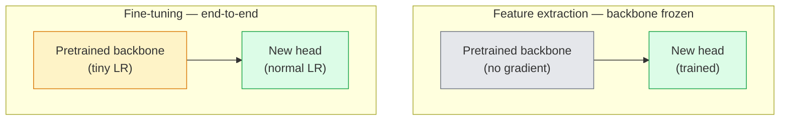

# 迁移学习与微调

> 别人花了百万GPU小时教会一个网络边缘、纹理和物体部位是什么样子。在训练你自己的模型之前，不妨借用这些特征。

**类型：** 构建
**语言：** Python
**前置条件：** 阶段4 第03课（CNN），阶段4 第04课（图像分类）
**时长：** ~75分钟

## 学习目标

- 区分特征提取与微调，并根据数据集大小、领域距离和计算预算选择合适的方法
- 加载预训练主干网络，替换其分类头，并在不到20行代码内仅训练分类头以达到可行的基线
- 以判别式学习率逐步解冻层，使得早期通用特征的更新幅度小于后期任务特定特征
- 诊断三种常见失败：解冻块上学习率过高导致特征漂移、小数据集上BN统计量崩溃、以及灾难性遗忘

## 问题

在ImageNet上训练一个ResNet-50大约需要2,000 GPU小时。很少有团队能为每一个交付的任务提供这样的预算。几乎每个团队实际交付的是预训练主干网络加上一个在几百或几千张任务专用图像上训练的新分类头。

这并非捷径。任何经ImageNet训练的CNN的第一个卷积块学习边缘和类似Gabor的滤波器。接下来的几个块学习纹理和简单图案。中间块学习物体部位。最终块学习开始看起来像1,000个ImageNet类别的组合。该层次结构的前90%几乎原封不动地迁移到医学影像、工业检测、卫星数据以及其他所有视觉任务——因为自然的边缘和纹理词汇是有限的。后10%才是你实际训练的部分。

正确进行迁移有三个陷阱等着你：学习率过高破坏预训练特征，冻结过多导致模型信息匮乏，以及让BatchNorm的运行统计量向一个网络其余部分从未学习过的小数据集偏移。本节课将逐一剖析这些问题。

## 核心概念

### 特征提取 vs 微调

两种策略，根据你对预训练特征的信任程度以及你拥有的数据量来选择。



经验法则：

|  数据集大小  |  领域距离  |  方案  |
|--------------|-----------------|--------|
|  < 1千张图像  |  接近ImageNet  |  冻结主干，仅训练分类头  |
|  1千-1万  |  接近  |  冻结前2-3个阶段，微调其余部分  |
|  1万-10万  |  任意  |  使用判别式学习率进行端到端微调  |
|  10万以上  |  远  |  微调所有层；如果领域足够远，考虑从头训练  |

"接近ImageNet"大致指包含物体类内容的自然RGB照片。医学CT扫描、俯视卫星图像和显微镜图像属于远距离领域——这些特征仍有帮助，但你需要让更多层进行自适应。

### 为什么冻结会有效

CNN学到的ImageNet特征并非专用于那1,000个类别。它们专用于自然图像的统计特性：特定方向的边缘、纹理、对比度模式、形状基元。这些统计特性在人类能命名的几乎所有视觉领域中都是稳定的。这就是为什么一个在ImageNet上训练、仅用一个新线性分类头（不微调主干）在CIFAR-10上进行零样本评估的模型能达到80%以上的准确率。分类头在学习为当前任务加权哪些已学特征。

### 判别式学习率

当你解冻时，早期层应该比后期层训练得更慢。早期层编码你想要保留的通用特征；后期层编码你需要大量调整的任务特定结构。

```
Typical recipe:

  stage 0 (stem + first group): lr = base_lr / 100    (mostly fixed)
  stage 1:                       lr = base_lr / 10
  stage 2:                       lr = base_lr / 3
  stage 3 (last backbone group): lr = base_lr
  head:                          lr = base_lr  (or slightly higher)
```

在PyTorch中，这只需向优化器传递一个参数组列表。一个模型，五个学习率，零额外代码。

### BatchNorm问题

BN层保存着在ImageNet上计算的`running_mean`和`running_var`缓冲区。如果你的任务具有不同的像素分布——不同的光照、不同的传感器、不同的色彩空间——这些缓冲区就不正确了。按偏好顺序有三种选择：

1. **在训练模式下微调BN。** 让BN随其他参数一起更新其运行统计量。当任务数据集为中等规模（>=5k样本）时的默认选择。
2. **在评估模式下冻结BN。** 保持ImageNet统计量，仅训练权重。当数据集足够小以至于BN的移动平均会有噪声时正确。
3. **用GroupNorm替换BN。** 完全消除了移动平均问题。用于每GPU批次大小很小的检测和分割主干网络。

如果搞错了这一点，准确率会悄无声息地下降5-15%。

### 分类头设计

分类头是1-3个线性层加上可选的dropout。每个torchvision主干网络都带有一个默认的分类头，你需要替换它：

```
backbone.fc = nn.Linear(backbone.fc.in_features, num_classes)          # ResNet
backbone.classifier[1] = nn.Linear(..., num_classes)                    # EfficientNet, MobileNet
backbone.heads.head = nn.Linear(..., num_classes)                       # torchvision ViT
```

对于小数据集，单个线性层通常就足够了。当任务分布与主干训练分布相差较大时，添加一个隐藏层（Linear -> ReLU -> Dropout -> Linear）会有帮助。

### 逐层学习率衰减

一种更平滑的判别式学习率版本，用于现代微调（BEiT、DINOv2、ViT-B微调）。不是将层分组为阶段，而是让每一层的学习率比其上一层略小：

```
lr_layer_k = base_lr * decay^(L - k)
```

当衰减率=0.75且L=12个transformer块时，第一个块以分类头学习率的`0.75^11 ≈ 0.04x`进行训练。这对transformer微调的影响比CNN更大，因为CNN中按阶段分组的学习率通常就足够了。

### 评估什么

迁移学习运行需要两个你在从头训练中不会追踪的数字：

- **仅预训练准确率** — 主干网络冻结时分类头的准确率。这是你的下限。
- **微调后准确率** — 同一模型经过端到端训练后的准确率。这是你的上限。

如果微调后准确率低于仅预训练准确率，说明存在学习率或批归一化错误。始终打印两者。

## 动手构建

### 步骤1：加载预训练主干网络并检查它

```python
import torch
import torch.nn as nn
from torchvision.models import resnet18, ResNet18_Weights

backbone = resnet18(weights=ResNet18_Weights.IMAGENET1K_V1)
print(backbone)
print()
print("classifier head:", backbone.fc)
print("feature dim:", backbone.fc.in_features)
```

`ResNet18` 有四个阶段（`layer1..layer4`）加上一个起始层和一个 `fc` 分类头。每个 torchvision 分类主干网络都有类似的结构。

### 步骤2：特征提取 — 冻结所有层，替换分类头

```python
def make_feature_extractor(num_classes=10):
    model = resnet18(weights=ResNet18_Weights.IMAGENET1K_V1)
    for p in model.parameters():
        p.requires_grad = False
    model.fc = nn.Linear(model.fc.in_features, num_classes)
    return model

model = make_feature_extractor(num_classes=10)
trainable = sum(p.numel() for p in model.parameters() if p.requires_grad)
frozen = sum(p.numel() for p in model.parameters() if not p.requires_grad)
print(f"trainable: {trainable:>10,}")
print(f"frozen:    {frozen:>10,}")
```

只有 `model.fc` 是可训练的。主干网络是一个冻结的特征提取器。

### 步骤3：判别式微调

一个构建具有阶段特定学习率的参数组的工具。

```python
def discriminative_param_groups(model, base_lr=1e-3, decay=0.3):
    stages = [
        ["conv1", "bn1"],
        ["layer1"],
        ["layer2"],
        ["layer3"],
        ["layer4"],
        ["fc"],
    ]
    groups = []
    for i, names in enumerate(stages):
        lr = base_lr * (decay ** (len(stages) - 1 - i))
        params = [p for n, p in model.named_parameters()
                  if any(n.startswith(k) for k in names)]
        if params:
            groups.append({"params": params, "lr": lr, "name": "_".join(names)})
    return groups

model = resnet18(weights=ResNet18_Weights.IMAGENET1K_V1)
model.fc = nn.Linear(model.fc.in_features, 10)
for p in model.parameters():
    p.requires_grad = True

groups = discriminative_param_groups(model)
for g in groups:
    print(f"{g['name']:>10s}  lr={g['lr']:.2e}  params={sum(p.numel() for p in g['params']):>8,}")
```

`decay=0.3` 意味着每个阶段以下一阶段学习率的30%进行训练。`fc` 获得 `base_lr`，`layer4` 获得 `0.3 * base_lr`，`conv1` 获得 `0.3^5 * base_lr ≈ 0.00243 * base_lr`。听起来很极端；但经验表明这有效。

### 步骤4：批归一化处理

冻结批归一化运行统计而不冻结其权重的辅助工具。

```python
def freeze_bn_stats(model):
    for m in model.modules():
        if isinstance(m, (nn.BatchNorm1d, nn.BatchNorm2d, nn.BatchNorm3d)):
            m.eval()
            for p in m.parameters():
                p.requires_grad = False
    return model
```

在每个epoch开始时设置 `model.train()` 后调用它。`model.train()` 将所有层切换到训练模式；此操作仅对批归一化层反转该设置。

### 步骤5：最小端到端微调循环

```python
from torch.optim import SGD
from torch.utils.data import DataLoader
from torch.optim.lr_scheduler import CosineAnnealingLR
import torch.nn.functional as F

def fine_tune(model, train_loader, val_loader, device, epochs=5, base_lr=1e-3, freeze_bn=False):
    model = model.to(device)
    groups = discriminative_param_groups(model, base_lr=base_lr)
    optimizer = SGD(groups, momentum=0.9, weight_decay=1e-4, nesterov=True)
    scheduler = CosineAnnealingLR(optimizer, T_max=epochs)

    for epoch in range(epochs):
        model.train()
        if freeze_bn:
            freeze_bn_stats(model)
        tr_loss, tr_correct, tr_total = 0.0, 0, 0
        for x, y in train_loader:
            x, y = x.to(device), y.to(device)
            logits = model(x)
            loss = F.cross_entropy(logits, y, label_smoothing=0.1)
            optimizer.zero_grad()
            loss.backward()
            optimizer.step()
            tr_loss += loss.item() * x.size(0)
            tr_total += x.size(0)
            tr_correct += (logits.argmax(-1) == y).sum().item()
        scheduler.step()

        model.eval()
        va_total, va_correct = 0, 0
        with torch.no_grad():
            for x, y in val_loader:
                x, y = x.to(device), y.to(device)
                pred = model(x).argmax(-1)
                va_total += x.size(0)
                va_correct += (pred == y).sum().item()
        print(f"epoch {epoch}  train {tr_loss/tr_total:.3f}/{tr_correct/tr_total:.3f}  "
              f"val {va_correct/va_total:.3f}")
    return model
```

在CIFAR-10上使用上述方案训练五个epoch，`ResNet18-IMAGENET1K_V1` 从约70%零样本线性探测准确率提升到约93%微调后准确率。仅训练分类头而从不接触主干网络时，准确率会停滞在约86%。

### 步骤6：渐进解冻

一个每epoch从后向前解冻一个阶段的调度。以额外增加几个epoch为代价减轻特征漂移。

```python
def progressive_unfreeze_schedule(model):
    stages = ["layer4", "layer3", "layer2", "layer1"]
    yielded = set()

    def start():
        for p in model.parameters():
            p.requires_grad = False
        for p in model.fc.parameters():
            p.requires_grad = True

    def unfreeze(epoch):
        if epoch < len(stages):
            name = stages[epoch]
            yielded.add(name)
            for n, p in model.named_parameters():
                if n.startswith(name):
                    p.requires_grad = True
            return name
        return None

    return start, unfreeze
```

在第一个epoch之前调用一次 `start()`。在每个epoch开始时调用 `unfreeze(epoch)`。每当可训练参数集合发生变化时重建优化器，否则冻结的参数仍会缓存动量，从而干扰优化器。

## 使用它

对于大多数实际任务，`torchvision.models` 加三行代码就足够了。当你遇到库默认设置无法修复的问题时，上述更复杂的机制才有意义。

```python
from torchvision.models import resnet50, ResNet50_Weights

model = resnet50(weights=ResNet50_Weights.IMAGENET1K_V2)
model.fc = nn.Linear(model.fc.in_features, num_classes)
optimizer = torch.optim.AdamW(model.parameters(), lr=1e-4, weight_decay=1e-4)
```

其他两个生产级默认设置：

- `timm` 提供了约800个预训练视觉主干网络，具有一致的API（`timm.create_model("resnet50", pretrained=True, num_classes=10)`）。对于torchvision模型库之外的任何微调，这是标准做法。
- 对于Transformer，`timm` 提供了ViT/BEiT/DeiT，具有与文本模型相同的加载语义。

## 发布

本課(lesson)产出：

- `outputs/prompt-fine-tune-planner.md` — 一个提示，根据数据集大小、领域距离和计算预算，在特征提取、渐进微调和端到端微调之间进行选择。
- `outputs/prompt-fine-tune-planner.md` — 一项技能，给定一个PyTorch模型，报告哪些参数是可训练的，哪些批归一化层处于评估模式，以及优化器是否确实接收了可训练参数。

## 练习

1. **（简单）** 在同一个合成CIFAR数据集上，将`ResNet18`训练为线性探测（主干冻结）和完全微调。并排报告两个准确率。解释哪个差距表明特征迁移良好，哪个表明特征迁移不佳。
2. **（中等）** 故意引入一个错误：在主干阶段而不是分类头设置`ResNet18`。展示训练损失爆炸，然后通过应用`base_lr = 1e-1`辅助工具恢复。记录每个阶段开始发散的学习率。
3. **（困难）** 使用一个医学影像数据集（如CheXpert-small、PatchCamelyon或HAM10000），比较三种方案：（a）ImageNet预训练的冻结主干+线性分类头；（b）ImageNet预训练的端到端微调；（c）从头训练。报告每种方案的准确率和计算成本。在多大数据集规模下从头训练变得有竞争力？

## 关键术语

|  术语  |  人们的说法  |  实际含义  |
|------|----------------|----------------------|
|  特征提取  |  "冻结并训练分类头"  |  主干网络参数冻结，仅新的分类头接收梯度  |
|  微调  |  "重新端到端训练"  |  所有参数可训练，通常使用比从头训练小得多的学习率  |
|  判别式学习率  |  "早期层使用更小的学习率"  |  优化器参数组，其中早期阶段的学习率是后期阶段学习率的一部分  |
|  逐层学习率衰减  |  "平滑学习率梯度"  |  每层学习率乘以 decay^(L - k)；常见于Transformer微调  |
|  灾难性遗忘  |  "模型丢失了ImageNet知识"  |  过高的学习率在新任务信号被学习之前覆盖了预训练特征  |
|  批归一化统计漂移  |  "运行均值错误"  |  批归一化运行均值/方差在与当前任务不同的分布上计算，静默地损害准确率  |
| 线性探测(Linear probe)  |  "冻结主干 + 线性头"  |  预训练特征的评估——基于冻结表示的最佳线性分类器的准确率 |
| 灾难性坍塌(Catastrophic collapse)  |  "所有预测都归为同一类别"  |  当微调时的学习率足够高以至于在头部梯度稳定之前破坏特征时发生 |

## 延伸阅读

- [How transferable are features in deep neural networks? (Yosinski et al., 2014)](https://arxiv.org/abs/1411.1792) — 量化层间特征可迁移性的论文
- [How transferable are features in deep neural networks? (Yosinski et al., 2014)](https://arxiv.org/abs/1411.1792) — 原始判别式学习率/渐进解冻的方法；这些思想可直接迁移到视觉领域
- [How transferable are features in deep neural networks? (Yosinski et al., 2014)](https://arxiv.org/abs/1411.1792) — 现代视觉骨干网络的参考及其训练时使用的精确微调默认参数
- [How transferable are features in deep neural networks? (Yosinski et al., 2014)](https://arxiv.org/abs/1411.1792) — 为什么线性探测准确率重要以及如何正确报告
