# 从零开始的YOLO目标检测

> 检测是分类加回归，在特征图的每个位置运行，然后通过非极大值抑制清理结果。

**类型：** 构建
**语言：** Python
**先修知识：** 阶段4第03课（卷积神经网络）、阶段4第04课（图像分类）、阶段4第05课（迁移学习）
**时间：** 约75分钟

## 学习目标

- 解释将检测转化为密集预测问题的网格和锚点设计，并说明输出张量中每个数字的含义
- 计算边界框之间的交并比，并从零实现非极大值抑制
- 在预训练骨干网络上构建最小YOLO风格头部，包括分类、目标和边界框回归损失
- 读取检测指标行（精确率@0.5、召回率、平均精度@0.5、平均精度@0.5:0.95），并决定下一步调整哪个参数

## 问题

分类说“这张图是狗”。检测说“像素(112, 40, 280, 210)处有一只狗，(400, 180, 560, 310)处有一只猫，画面中没有其他物体”。这一结构性变化——预测可变数量的带标签边框而非每张图一个标签——是所有自动驾驶系统、监控产品、文档布局解析器和工厂视觉生产线所依赖的基础。

检测也是视觉中所有工程权衡同时显现的地方。你需要准确的边框（回归头），每个边框正确的类别（分类头），模型知道何时没有检测到目标（目标得分），并且每个真实物体恰好有一个预测（非极大值抑制）。缺少任何一环，管线要么漏检，要么报告虚假边框，要么以略微不同的位置预测同一个物体十五次。

YOLO（You Only Look Once，Redmon等人，2016）是使这一切通过卷积网络单次前向传播实时运行的设计，同样的结构性决策仍是现代检测器（YOLOv8、YOLOv9、YOLO-NAS、RT-DETR）的骨干。学会核心部分，每个变体都只是相同部件的重新排列。

## 核心概念

### 作为密集预测的检测

分类器每张图输出C个数字。YOLO风格检测器每张图输出`(S x S x (5 + C))`个数字，其中S是空间网格大小。

```mermaid
flowchart LR
    IMG["Input 416x416 RGB"] --> BB["Backbone<br/>(ResNet, DarkNet, ...)"]
    BB --> FM["Feature map<br/>(C_feat, 13, 13)"]
    FM --> HEAD["Detection head<br/>(1x1 convs)"]
    HEAD --> OUT["Output tensor<br/>(13, 13, B * (5 + C))"]
    OUT --> DEC["Decode<br/>(grid + sigmoid + exp)"]
    DEC --> NMS["Non-max suppression"]
    NMS --> RESULT["Final boxes"]

    style IMG fill:#dbeafe,stroke:#2563eb
    style HEAD fill:#fef3c7,stroke:#d97706
    style NMS fill:#fecaca,stroke:#dc2626
    style RESULT fill:#dcfce7,stroke:#16a34a
```



每个`S * S`网格单元预测`B`个边框。对于每个边框：

- 4个数字描述几何形状：`tx, ty, tw, th`。
- 1个数字是目标得分：“此单元格中心是否有物体？”
- C个数字是类别概率。

每单元总数：`B * (5 + C)`。对于VOC且`S=13, B=2, C=20`时，每单元50个数字。

### 为什么用网格和锚点

普通回归会为每个物体预测绝对坐标的`(x, y, w, h)`。这对卷积网络很困难，因为平移图片不应使所有预测平移相同量——每个物体在空间上是锚定的。网格的解决方案是将每个真实边界框分配给其中心所在的网格单元；只有该单元负责该物体。

锚点解决第二个问题。3x3卷积很难从16像素感受野的特征单元回归出500像素宽的边框。相反，我们每单元预定义`B`个先验边框形状（锚点），并预测每个锚点的小偏移。模型学会选择正确的锚点并微调它，而不是从零回归。

```
Anchor box priors (example for 416x416 input):

  small:   (30,  60)
  medium:  (75,  170)
  large:   (200, 380)

At each grid cell, every anchor emits (tx, ty, tw, th, obj, c_1, ..., c_C).
```

现代检测器常使用特征金字塔网络(FPN)，每分辨率有不同的锚点集——浅层高分辨率图用小的锚点，深层低分辨率图用大的锚点。思想相同，尺度更多。

### 解码预测

原始`tx, ty, tw, th`不是边框坐标；它们是回归目标，绘制前需要转换：

```
centre x  = (sigmoid(tx) + cell_x) * stride
centre y  = (sigmoid(ty) + cell_y) * stride
width     = anchor_w * exp(tw)
height    = anchor_h * exp(th)
```

`sigmoid`保持中心偏移在单元内。`exp`允许宽度从锚点自由缩放而无需符号翻转。`stride`将网格坐标缩放回像素。自v2以来，每个YOLO版本的解码步骤都相同。

### 交并比(IoU)

检测中两个边框之间的通用相似性度量：

```
IoU(A, B) = area(A intersect B) / area(A union B)
```

IoU = 1表示完全相同；IoU = 0表示无重叠。预测与真实边框之间的IoU决定预测是否算作真阳性（通常IoU >= 0.5）。两个预测之间的IoU是非极大值抑制(NMS)用于去重的依据。

### 非极大值抑制(NMS)

在相邻锚点上训练的卷积网络常对同一物体预测重叠边框。NMS保留置信度最高的预测，并删除任何IoU超过阈值的其他预测。

```
NMS(boxes, scores, iou_threshold):
    sort boxes by score descending
    keep = []
    while boxes not empty:
        pick the top-scoring box, add to keep
        remove every box with IoU > iou_threshold to the picked box
    return keep
```

典型阈值：目标检测为0.45。最近检测器将标准NMS替换为`soft-NMS`、`DIoU-NMS`，或直接学习抑制（RT-DETR），但结构性目的相同。

### 损失函数

YOLO损失是三个加权的损失之和：

```
L = lambda_coord * L_box(pred, target, where obj=1)
  + lambda_obj   * L_obj(pred, 1,     where obj=1)
  + lambda_noobj * L_obj(pred, 0,     where obj=0)
  + lambda_cls   * L_cls(pred, target, where obj=1)
```

只有包含物体的单元才贡献边框回归和分类损失。不含物体的单元只贡献目标损失（教导模型保持沉默）。`lambda_noobj`通常很小（~0.5），因为绝大多数单元为空，否则会主导总损失。

现代变体将均方误差边框损失替换为CIoU/DIoU（直接优化IoU），使用焦点损失处理类别不平衡，并用质量焦点损失平衡目标。三部分结构不变。

### 检测指标

准确性并不能转化为检测能力。真正起作用的是这四个数字：

- **Precision@IoU=0.5** —— 在预测为正样本中，有多少是真正正确的。
- **Recall@IoU=0.5** —— 在真实目标中，我们找到了多少。
- **AP@0.5** —— IoU阈值为0.5时的精确率-召回率曲线面积；每个类别一个数值。
- **mAP@0.5:0.95** —— 在IoU阈值0.5、0.55、...、0.95上的AP平均值。COCO评估标准；最严格也最具信息量。

报告所有四个值。如果一个检测器在mAP@0.5上表现强劲但在mAP@0.5:0.95上较弱，说明定位粗略但不精确；可通过更好的边界框回归损失来修正。如果一个检测器精确率高但召回率低，说明过于保守；降低置信度阈值或增加目标性权重。

## 动手构建

### 第一步：IoU

整节课的核心工具。处理两个边界框数组，格式为`(x1, y1, x2, y2)`。

```python
import numpy as np

def box_iou(boxes_a, boxes_b):
    ax1, ay1, ax2, ay2 = boxes_a[:, 0], boxes_a[:, 1], boxes_a[:, 2], boxes_a[:, 3]
    bx1, by1, bx2, by2 = boxes_b[:, 0], boxes_b[:, 1], boxes_b[:, 2], boxes_b[:, 3]

    inter_x1 = np.maximum(ax1[:, None], bx1[None, :])
    inter_y1 = np.maximum(ay1[:, None], by1[None, :])
    inter_x2 = np.minimum(ax2[:, None], bx2[None, :])
    inter_y2 = np.minimum(ay2[:, None], by2[None, :])

    inter_w = np.clip(inter_x2 - inter_x1, 0, None)
    inter_h = np.clip(inter_y2 - inter_y1, 0, None)
    inter = inter_w * inter_h

    area_a = (ax2 - ax1) * (ay2 - ay1)
    area_b = (bx2 - bx1) * (by2 - by1)
    union = area_a[:, None] + area_b[None, :] - inter
    return inter / np.clip(union, 1e-8, None)
```

返回一个`(N_a, N_b)`的成对IoU矩阵。通过将其中一个数组的形状设为`(1, 4)`，可将其用于单个真实边界框。

### 第二步：非极大值抑制

```python
def nms(boxes, scores, iou_threshold=0.45):
    order = np.argsort(-scores)
    keep = []
    while len(order) > 0:
        i = order[0]
        keep.append(i)
        if len(order) == 1:
            break
        rest = order[1:]
        ious = box_iou(boxes[[i]], boxes[rest])[0]
        order = rest[ious <= iou_threshold]
    return np.array(keep, dtype=np.int64)
```

确定性方法，从排序开始`O(N log N)`，并且对相同输入匹配`torchvision.ops.nms`的行为。

### 第三步：边界框编码与解码

在像素坐标与网络实际回归的`(tx, ty, tw, th)`目标之间进行转换。

```python
def encode(box_xyxy, cell_x, cell_y, stride, anchor_wh):
    x1, y1, x2, y2 = box_xyxy
    cx = 0.5 * (x1 + x2)
    cy = 0.5 * (y1 + y2)
    w = x2 - x1
    h = y2 - y1
    tx = cx / stride - cell_x
    ty = cy / stride - cell_y
    tw = np.log(w / anchor_wh[0] + 1e-8)
    th = np.log(h / anchor_wh[1] + 1e-8)
    return np.array([tx, ty, tw, th])


def decode(tx_ty_tw_th, cell_x, cell_y, stride, anchor_wh):
    tx, ty, tw, th = tx_ty_tw_th
    cx = (sigmoid(tx) + cell_x) * stride
    cy = (sigmoid(ty) + cell_y) * stride
    w = anchor_wh[0] * np.exp(tw)
    h = anchor_wh[1] * np.exp(th)
    return np.array([cx - w / 2, cy - h / 2, cx + w / 2, cy + h / 2])


def sigmoid(x):
    return 1.0 / (1.0 + np.exp(-x))
```

测试：先编码一个边界框再解码——你应该会得到与原始框非常接近的结果（当`tx`不在后sigmoid范围内时，sigmoid逆函数可能不是完全可逆的）。

### 第四步：一个极简的YOLO输出头

在特征图上进行一次1x1卷积，重塑为`(B, S, S, num_anchors, 5 + C)`。

```python
import torch
import torch.nn as nn

class YOLOHead(nn.Module):
    def __init__(self, in_c, num_anchors, num_classes):
        super().__init__()
        self.num_anchors = num_anchors
        self.num_classes = num_classes
        self.conv = nn.Conv2d(in_c, num_anchors * (5 + num_classes), kernel_size=1)

    def forward(self, x):
        n, _, h, w = x.shape
        y = self.conv(x)
        y = y.view(n, self.num_anchors, 5 + self.num_classes, h, w)
        y = y.permute(0, 3, 4, 1, 2).contiguous()
        return y
```

输出形状：`(N, H, W, num_anchors, 5 + C)`。最后一个维度包含`[tx, ty, tw, th, obj, cls_0, ..., cls_{C-1}]`。

### 第五步：真实标签分配

对于每个真实边界框，决定哪个`(cell, anchor)`负责。

```python
def assign_targets(boxes_xyxy, classes, anchors, stride, grid_size, num_classes):
    num_anchors = len(anchors)
    target = np.zeros((grid_size, grid_size, num_anchors, 5 + num_classes), dtype=np.float32)
    has_obj = np.zeros((grid_size, grid_size, num_anchors), dtype=bool)

    for box, cls in zip(boxes_xyxy, classes):
        x1, y1, x2, y2 = box
        cx, cy = 0.5 * (x1 + x2), 0.5 * (y1 + y2)
        gx, gy = int(cx / stride), int(cy / stride)
        bw, bh = x2 - x1, y2 - y1

        ious = np.array([
            (min(bw, aw) * min(bh, ah)) / (bw * bh + aw * ah - min(bw, aw) * min(bh, ah))
            for aw, ah in anchors
        ])
        best = int(np.argmax(ious))
        aw, ah = anchors[best]

        target[gy, gx, best, 0] = cx / stride - gx
        target[gy, gx, best, 1] = cy / stride - gy
        target[gy, gx, best, 2] = np.log(bw / aw + 1e-8)
        target[gy, gx, best, 3] = np.log(bh / ah + 1e-8)
        target[gy, gx, best, 4] = 1.0
        target[gy, gx, best, 5 + cls] = 1.0
        has_obj[gy, gx, best] = True
    return target, has_obj
```

锚框选择的标准是“与真实边界框的最佳形状IoU”——这是一个廉价的近似方法，与YOLOv2/v3的分配方式一致。v5及以后的版本使用了更复杂的策略（任务对齐匹配、动态k），但都基于同样的思想。

### 第六步：三个损失函数

```python
def yolo_loss(pred, target, has_obj, lambda_coord=5.0, lambda_obj=1.0, lambda_noobj=0.5, lambda_cls=1.0):
    has_obj_t = torch.from_numpy(has_obj).bool()
    target_t = torch.from_numpy(target).float()

    # box-regression loss: only on cells with objects
    box_pred = pred[..., :4][has_obj_t]
    box_true = target_t[..., :4][has_obj_t]
    loss_box = torch.nn.functional.mse_loss(box_pred, box_true, reduction="sum")

    # objectness loss
    obj_pred = pred[..., 4]
    obj_true = target_t[..., 4]
    loss_obj_pos = torch.nn.functional.binary_cross_entropy_with_logits(
        obj_pred[has_obj_t], obj_true[has_obj_t], reduction="sum")
    loss_obj_neg = torch.nn.functional.binary_cross_entropy_with_logits(
        obj_pred[~has_obj_t], obj_true[~has_obj_t], reduction="sum")

    # classification loss on cells with objects
    cls_pred = pred[..., 5:][has_obj_t]
    cls_true = target_t[..., 5:][has_obj_t]
    loss_cls = torch.nn.functional.binary_cross_entropy_with_logits(
        cls_pred, cls_true, reduction="sum")

    total = (lambda_coord * loss_box
             + lambda_obj * loss_obj_pos
             + lambda_noobj * loss_obj_neg
             + lambda_cls * loss_cls)
    return total, {"box": loss_box.item(), "obj_pos": loss_obj_pos.item(),
                   "obj_neg": loss_obj_neg.item(), "cls": loss_cls.item()}
```

五个超参数，每个YOLO教程要么硬编码要么进行扫描。它们的比例很重要：`lambda_coord=5, lambda_noobj=0.5`与原始YOLOv1论文一致，仍然是一个合理的默认值。

### 第七步：推理流程

解码原始输出头，应用sigmoid/exp，根据目标性进行阈值处理，然后进行NMS。

```python
def postprocess(pred_tensor, anchors, stride, img_size, conf_threshold=0.25, iou_threshold=0.45):
    pred = pred_tensor.detach().cpu().numpy()
    grid_h, grid_w = pred.shape[1], pred.shape[2]
    num_anchors = len(anchors)

    boxes, scores, classes = [], [], []
    for gy in range(grid_h):
        for gx in range(grid_w):
            for a in range(num_anchors):
                tx, ty, tw, th, obj, *cls = pred[0, gy, gx, a]
                score = sigmoid(obj) * sigmoid(np.array(cls)).max()
                if score < conf_threshold:
                    continue
                cls_idx = int(np.argmax(cls))
                cx = (sigmoid(tx) + gx) * stride
                cy = (sigmoid(ty) + gy) * stride
                w = anchors[a][0] * np.exp(tw)
                h = anchors[a][1] * np.exp(th)
                boxes.append([cx - w / 2, cy - h / 2, cx + w / 2, cy + h / 2])
                scores.append(float(score))
                classes.append(cls_idx)

    if not boxes:
        return np.zeros((0, 4)), np.zeros((0,)), np.zeros((0,), dtype=int)
    boxes = np.array(boxes)
    scores = np.array(scores)
    classes = np.array(classes)
    keep = nms(boxes, scores, iou_threshold)
    return boxes[keep], scores[keep], classes[keep]
```

这就是完整的评估流程：输出头 -> 解码 -> 阈值处理 -> NMS。

## 使用它

`torchvision.models.detection`提供的生产级检测器具有相同的概念结构。加载一个预训练模型只需三行代码。

```python
import torch
from torchvision.models.detection import fasterrcnn_resnet50_fpn_v2

model = fasterrcnn_resnet50_fpn_v2(weights="DEFAULT")
model.eval()
with torch.no_grad():
    predictions = model([torch.randn(3, 400, 600)])
print(predictions[0].keys())
print(f"boxes:  {predictions[0]['boxes'].shape}")
print(f"scores: {predictions[0]['scores'].shape}")
print(f"labels: {predictions[0]['labels'].shape}")
```

对于实时推理流程，`ultralytics`（YOLOv8/v9）是标准：`from ultralytics import YOLO; model = YOLO('yolov8n.pt'); model(img)`。该模型内部处理解码和NMS，并返回与上面构建的相同的`boxes / scores / labels`三元组。

## 发布

本課(lesson)产出：

- `outputs/prompt-detection-metric-reader.md` —— 一个提示，将`precision, recall, AP, mAP@0.5:0.95`行转化为一行诊断信息和最有用的下一个实验。
- `outputs/prompt-detection-metric-reader.md` —— 一项技能，给定一个真实边界框数据集，对`precision, recall, AP, mAP@0.5:0.95`运行k-means，返回每个FPN级别的锚框集以及选择正确锚框数量所需的覆盖统计信息。

## 练习

1. **(简单)** 实现`box_iou`，并在1000个随机边界框对上与`torchvision.ops.box_iou`进行对比。验证最大绝对差值低于`1e-6`。
2. **(中等)** 将`box_iou`移植到一个使用`torchvision.ops.box_iou`边界框损失而非MSE的版本。在一个100张图像的合成数据集上展示，在相同epoch数下，CIoU比MSE收敛到更好的最终mAP@0.5:0.95。
3. **(困难)** 实现多尺度推理：以三种分辨率将同一张图像输入模型，合并边界框预测，最后运行一个NMS。在留出集上测量相对于单尺度推理的mAP提升。

## 关键术语

|  术语  |  人们的说法  |  实际含义  |
|------|----------------|----------------------|
|  锚框  |  边界框先验  |  每个网格单元中预定义的边界框形状，网络预测的是相对于这些形状的增量而非绝对坐标  |
|  IoU  |  重叠度  |  两个边界框的交并比；检测中通用的相似性度量  |
|  NMS  |  去重  |  贪心算法，保留得分最高的预测，并移除重叠超过阈值的预测  |
|  目标性  |  这里是否有物体  |  每个锚框、每个网格单元的标量，预测一个物体是否中心位于该网格单元中  |
|  网格步长  |  "下采样因子"  |  每个网格单元的像素数；一个416像素输入，13网格头，步长为32  |
|  mAP  |  "平均精度均值"  |  精确率-召回率曲线下面积的平均值，对类别和（对于COCO）IoU阈值取平均  |
|  AP@0.5  |  "PASCAL VOC AP"  |  IoU阈值为0.5时的平均精度；该指标的宽松版本  |
|  mAP@0.5:0.95  |  "COCO AP"  |  在IoU阈值0.5到0.95步长0.05上的平均值；严格版本和当前社区标准  |

## 延伸阅读

- [YOLOv1: You Only Look Once (Redmon et al., 2016)](https://arxiv.org/abs/1506.02640) — 奠基性论文；此后每个YOLO都是对该结构的改进
- [YOLOv1: You Only Look Once (Redmon et al., 2016)](https://arxiv.org/abs/1506.02640) — 引入多尺度FPN风格头的论文；仍然是最清晰的图示
- [YOLOv1: You Only Look Once (Redmon et al., 2016)](https://arxiv.org/abs/1506.02640) — 当前生产参考；涵盖数据集格式、数据增强、训练配方
- [YOLOv1: You Only Look Once (Redmon et al., 2016)](https://arxiv.org/abs/1506.02640) — 关于整个检测器集合的最佳通俗指南；对理解DETR、RetinaNet、FCOS和YOLO之间的关系极为宝贵
